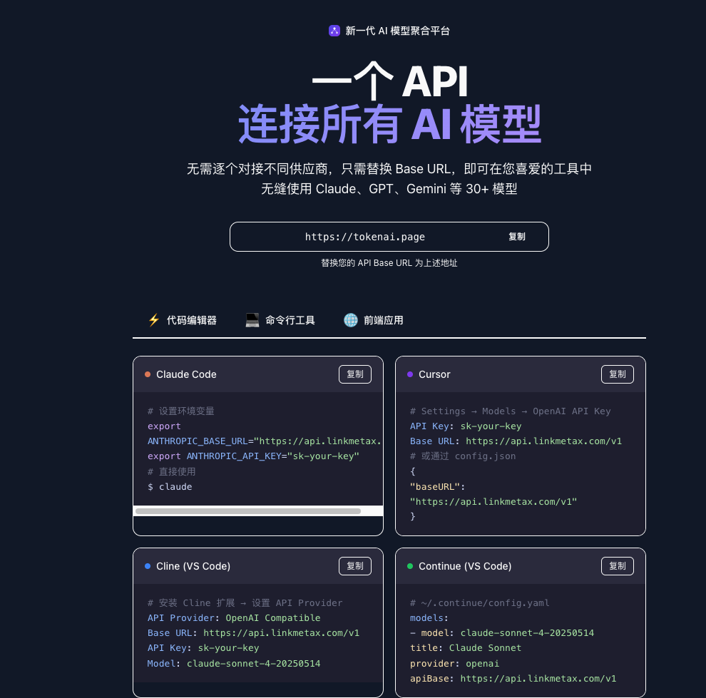

# 项目简报

## 一句话定位

**TokenAI 是面向开发者与企业的专业模型 Token 服务与 AI 网关服务商。** 我们通过一个统一 API 连接主流文本、图像、音频与视频模型，并提供稳定路由、用量管控、透明计费与调用可观测能力，让团队更快接入模型、更稳运行应用、更清晰地管理成本。

## 核心价值

- **稳定接入：** 通过多上游渠道调度、失败重试与可用性管理，降低单一渠道波动对业务的影响。
- **统一集成：** 用统一 API 和密钥体系接入多家模型服务，减少重复适配与供应商切换成本。
- **可管可控：** 集中管理用户、令牌、权限、限流、额度、计费与调用日志，让每一次模型调用都有边界、有记录。
- **企业服务：** 面向团队提供对公服务、技术支持及网关部署能力，帮助 AI 应用从测试走向持续运营。

## 推荐对外文案

### 首页主文案

**稳定接入主流 AI 模型，为企业应用而生。**

TokenAI 将主流文本、图像、音频与视频模型统一到一个 API，并提供稳定路由、用量管控、透明计费与全链路可观测能力。无需反复适配不同供应商，即可更快构建、更稳运行 AI 应用。

### 简短版

TokenAI 提供专业的模型 Token 服务与企业级 AI 网关，以统一 API 连接主流 AI 模型，让模型接入更稳定、管理更简单、成本更透明。

### 完整版

TokenAI 是专业的模型 Token 服务与企业级 AI 网关服务商。我们聚合主流文本、图像、音频与视频模型，通过统一 API、智能渠道调度、失败重试、精细化权限与额度控制、透明计费和调用日志，为开发者与企业提供稳定、易用、可治理的模型接入基础设施。无论是快速验证产品，还是支撑团队规模化使用，TokenAI 都致力于降低接入复杂度与运营成本，让企业把精力放在真正创造业务价值的 AI 应用上。

## 表达原则

- 对外优先使用“稳定、易用、可治理”，不使用无法验证的“最稳定”“最好用”“全网最低价”等绝对化表述。
- “Token 服务”与“企业网关”必须同时出现，前者承接快速购买与调用需求，后者建立长期企业价值。
- 稳定性应由多渠道调度、失败重试、限流、监控和服务保障等可验证能力支撑；具备正式 SLA 后再使用明确可用率数字。

## 行业对标结论

主流 AI 网关的共同价值已经从“转发模型请求”升级为四类能力：统一多模型接入、可靠性路由、成本与用量治理、安全与可观测性。TokenAI 的对外说明应围绕这四类客户结果展开，而不是只描述“售卖 Token”。

## 内容参考（但不参考 UI）



图片中的核心内容需要纳入 TokenAI 首页与用户文档，但只参考信息结构，不照搬视觉样式。核心目标是让用户理解：**获得 API Key 后，只需在常用工具中替换 Base URL 与 API Key，即可通过一个入口调用平台支持的多个模型。**

## 用户配置引导模块

### 模块标题与说明

**一个 API，连接主流 AI 模型**

无需逐个对接不同模型供应商。复制 TokenAI API 地址和 API Key，按照工具说明完成配置，即可在常用开发工具与 AI 应用中调用平台已开放的模型。

> 页面不得写死“30+”等数量或固定模型清单。模型数量、模型名称与可用协议应读取平台当前配置，或使用“主流 AI 模型”等不会过期的描述。

### 用户准备事项

在展示工具配置前，先引导用户完成三个准备步骤：

1. 注册或登录 TokenAI。
2. 在令牌管理中创建 API Key；页面只显示 `sk-your-key` 占位符，不得展示真实密钥。
3. 复制当前站点提供的 API Base URL，并从模型列表选择一个账户可用的模型 ID。

Base URL 需要区分两类协议：

- **Anthropic 兼容工具：** 使用页面提供的 Anthropic Base URL，通常不追加 `/v1`。
- **OpenAI 兼容工具：** 使用页面提供的 OpenAI Base URL；若页面提供的是站点根地址，则按照页面提示追加 `/v1`。

域名和路径必须由当前部署配置动态生成，不能在产品文案或代码示例中写死 `tokenai.page`、`api.TokenAI.com` 等地址。

### 配置分类

配置内容按使用场景分为三个标签页：

- **代码编辑器：** Claude Code、Cursor、Cline、Continue。
- **命令行工具：** curl、OpenAI SDK、Anthropic SDK，以及后续支持的 CLI 工具。
- **前端应用：** Cherry Studio、Open WebUI、LobeChat 等已验证兼容的应用。

只展示经过当前网关协议验证的工具；未验证的工具不能仅凭“OpenAI Compatible”标签直接宣称支持。

### 代码编辑器配置示例

#### Claude Code

```bash
export ANTHROPIC_BASE_URL="<TokenAI_ANTHROPIC_BASE_URL>"
export ANTHROPIC_API_KEY="sk-your-key"

claude
```

说明：Claude Code 使用 Anthropic 兼容协议。若用户同时设置了其他 Anthropic 认证变量，应提示检查变量优先级，避免请求仍然发往原服务地址。

#### Cursor

在 `Settings → Models` 中选择 OpenAI API 配置：

```text
API Key: sk-your-key
Base URL: <TokenAI_OPENAI_BASE_URL>/v1
```

如果当前 Cursor 版本支持配置文件，也可以展示等价示例：

```json
{
  "baseURL": "<TokenAI_OPENAI_BASE_URL>/v1"
}
```

说明：Cursor 的设置入口可能随版本变化，页面应同时提供“打开设置”文字路径和可复制参数，避免只依赖截图。

#### Cline（VS Code）

```text
API Provider: OpenAI Compatible
Base URL: <TokenAI_OPENAI_BASE_URL>/v1
API Key: sk-your-key
Model: <available-model-id>
```

#### Continue（VS Code）

```yaml
models:
  - name: TokenAI Model
    provider: openai
    model: <available-model-id>
    apiBase: <TokenAI_OPENAI_BASE_URL>/v1
    apiKey: sk-your-key
```

说明：Continue 配置字段可能随版本升级变化，正式上线前必须用目标版本验证；密钥优先通过环境变量或工具的安全凭据存储提供，不建议提交到代码仓库。

### 交互要求

- Base URL、API Key 占位符和每段完整配置都提供复制按钮，并显示复制成功反馈。
- 用户切换工具时，示例中的 Base URL、模型 ID 与协议类型同步变化。
- 每张工具卡都包含“配置位置、必填字段、启动或保存方式、验证方法”四项信息。
- 提供“查看完整文档”和“配置失败排查”入口，不能让首页卡片承担全部说明。
- 移动端代码块允许横向滚动，复制按钮保持可见，不能截断关键 URL 或环境变量名。

### 配置完成后的验证

引导用户完成最小验证闭环：

1. 确认 API Key 有效且仍有可用额度。
2. 确认所填模型 ID 位于当前账户可用模型列表中。
3. 发起一次最小请求，确认收到正常响应。
4. 在用量日志中确认请求模型、Token 用量和计费记录符合预期。

常见错误提示至少覆盖：Base URL 路径错误、API Key 无效、模型不存在、额度不足、请求被限流和工具仍在使用旧环境变量。
