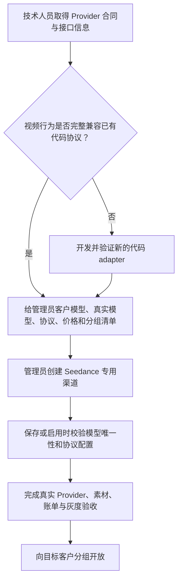

# Seedance 视频与素材产品设计

## 1. 文档定位与当前状态

本文定义 Seedance 专用渠道、ModelArk V3 视频任务、平台素材库和真人认证代理的当前产品设计，回答
“管理员如何配置、客户如何使用、平台承诺什么、失败时如何表现”。具体系统组件、状态机和数据字段
由[Seedance 专用渠道与 Link 架构](../20-architecture/Seedance专用渠道与Link架构.md)负责。

当前代码已经实现本文描述的产品边界。每条官方或第三方线路是否可以向客户开放，仍须分别完成真实
Provider、内容、素材、账单、失败和灰度验收；渠道能够保存或单个请求成功不等于生产发布。

## 2. 产品背景

Seedance 是高成本、长耗时的异步视频服务。官方火山、海外 BytePlus 和第三方中转商虽然都能提供
Seedance 模型，但南向接口、状态、素材库和账号作用域并不完全相同。若把这些线路伪装成普通
`DoubaoVideo`，或让 Priority/Weight 在多个渠道之间选择，管理员无法判断某个客户模型实际使用哪条
线路，失败时也可能产生重复视频和无法对齐的 Provider 成本。

本产品因此把“Seedance”作为管理员可识别的独立业务渠道，并统一向客户提供 ModelArk V3 视频合同。
Provider 差异由技术人员审核并由代码协议处理，不要求管理员理解请求转换、状态脚本或 Provider 私有
路径。

## 3. 产品目标

1. 管理员看到“Seedance 专用渠道”就能明确知道它服务 Seedance，不与豆包原生视频渠道混淆。
2. 一个客户模型固定对应一条官方或第三方线路，模型名称本身能够表达地区、Provider 或产品差异。
3. 客户统一使用 ModelArk V3 创建、查询、列表和删除视频任务，不直接适配各第三方私有接口。
4. 高成本创建只发送一次；失败或结果不明时不自动换渠道再创建，避免重复费用和对账歧义。
5. 官方与第三方素材库使用统一平台身份，无素材库模型继续使用请求级 URL，并严格隔离国内、海外和
   Provider 账号。
6. 技术人员与管理员各自负责擅长的部分：技术人员判断兼容性，管理员使用普通字段配置和运营。
7. 在保持 NEWAPI 原生合同不变的前提下，复用现有鉴权、分组、计费、任务、日志和管理底座。

## 4. 非目标

- 不把 Seedance 包装成 `/v1/video/generations`，也不改变 NEWAPI 原生 `DoubaoVideo` 行为；
- 不让一个客户模型在多个 Seedance 渠道之间负载均衡、故障切换或自动降级；
- 不由系统根据模型名、价格、域名、Key 或请求字段自动认证某条线路是否兼容 Seedance；
- 不让管理员编写协议 JSON、字段映射、请求路径、响应脚本或状态机；
- 不为每个模型建立 publication、SKU、capability、implementation 或 execution binding；
- 不建设平台人脸/活体表单、独立真人授权域或 Provider 数据删除承诺；
- 不建设素材创建/删除 unknown、自动重试、孤儿扫描或管理员核查工作台。

## 5. 角色与分工

| 角色 | 负责内容 | 不需要承担 |
| --- | --- | --- |
| API 客户 | 选择客户模型，调用 ModelArk V3，查询 Task，管理 Provider opaque 素材 ID | 判断 Provider 协议、渠道或凭据 |
| 平台管理员 | 按技术指引配置客户模型、渠道、映射、价格、分组和启停 | 编写转换 JSON、分析 Provider 接口 |
| 技术人员 | 判断新线路是否兼容已有协议；不兼容时开发 adapter；提供配置清单 | 代替管理员执行日常启停和分组运营 |
| 运维与审计人员 | 观察任务、费用和脱敏日志，异常时通知技术人员 | 在后台修复低概率孤儿或重放视频请求 |

客户只看到 API Key、客户模型、ModelArk V3、Task、素材 opaque ID 和账单。Provider 模型、渠道、上游
协议、账号和凭据是平台内部信息。

## 6. 产品对象与命名

| 产品对象 | 管理或客户含义 |
| --- | --- |
| 客户模型 | 客户选择的具体产品；同时决定可用分组、价格、地区和唯一 Seedance 渠道 |
| Seedance 专用渠道 | 管理员配置的一条确定 Provider 线路，包含连接、模型、协议和启停状态 |
| Provider 模型 | 由模型映射得到的真实上游模型名，只用于 Provider 调用 |
| 视频协议 | 技术人员已经实现并审核的代码转换方案 |
| 素材协议 | 该渠道选择的官方素材库、第三方素材库或无素材库形态 |
| Task | 一次已经取得可信 Provider task ID 的异步视频任务 |
| Asset / AssetGroup | Provider 返回的 opaque 素材或素材组 ID，由调用方和客户模型一起保存 |

不同 Provider、地区、协议、账号或价格线路必须使用不同客户模型名。管理员不会把这些线路映射为同一
个前端模型再交给系统选择。客户在选择模型时就应知道它属于国内、海外还是特定第三方产品，无须在
请求中再选择 Region、Provider 或素材库。

## 7. 新线路上线决策

兼容性是线下技术审核结论，不是运行时自动推断。新模型完全兼容现有协议时允许零代码配置上线；只要
请求、状态、删除、计费或素材语义存在合同差异，就先由技术人员开发新的代码 adapter，再交给管理员。

## 8. 管理员渠道产品

### 8.1 基础配置

管理员创建“Seedance 专用渠道”时配置：

- 渠道名称、Base URL 和单一视频 Key；
- 客户模型清单和客户模型到 Provider 模型的映射；
- 经技术人员确认的视频协议，以及与其兼容的一个素材协议；
- 客户分组、价格和启停状态；
- 官方素材库需要的素材 AK/SK、Project、Region 和 URL TTL。

第三方中转已经处理素材账号时，管理员不再重复填写官方素材 AK/SK、Region 或 Project。NEWAPI 原生
`param_override`、`header_override` 等高级配置继续保留在表单中，但不作为普通上线流程的必填项。
Seedance Channel 不允许 Multi-Key 轮换。

### 8.2 一模型一渠道

同一个已启用客户模型只能出现在一个 Seedance 专用渠道中。系统只在以下管理动作中校验：

- 新建并启用渠道；
- 保存已启用渠道；
- 编辑已启用渠道的模型清单；
- 重新启用停用渠道。

发现冲突时，系统使用普通语言指出冲突模型和已有渠道，并拒绝保存或启用。停用渠道可以暂存重名
配置；系统不在每次客户请求时重复检查，也不为绕过后台直接修改数据库的极端情况增加自动修复。

### 8.3 Priority 与 Weight

Priority 和 Weight 对 Seedance 路由不生效。管理端可以保留 NEWAPI 通用字段和高级配置入口，但必须
明确提示管理员：“每个 Seedance 模型固定使用一个渠道，Priority 和 Weight 不参与路由，任务失败
不会自动切换渠道。”保存时相应值不获得任何 Seedance 分发语义。

### 8.4 启停与配置变化

停用渠道只阻止新的客户请求。已经创建的 Task 继续使用创建时的线路、协议、连接、素材和计费事实；
修改模型映射、轮换 Key、升级协议或调整价格都不能把在途任务改到新配置上。

改变 Provider 账号、Base URL、Region、Project、国内/海外类型或素材协议时，管理员必须新建渠道，
不能把旧素材和在途任务解释为新作用域。

## 9. 客户视频产品

### 9.1 统一入口

客户可通过 `GET /v1/models` 或只返回 Seedance 条目的
`GET /api/v3/contents/generations/models` 获取完整客户模型目录。停用模型仍保留并返回
`available=false`、`availability=disabled`；当前 Key 无权使用的已启用模型返回 `restricted`。每个
Seedance 条目的 `api.video` 给出统一 ModelArk V3 创建合同与操作，`api.assets` 逐项给出素材引用、
素材类型、素材组、真人认证、素材操作和匿名复用域。目录存在不等于当前可调用。

Seedance 客户使用四组 ModelArk V3 行为：

| 行为 | 客户接口 | 产品结果 |
| --- | --- | --- |
| 创建 | `POST /api/v3/contents/generations/tasks` | 校验请求并向客户模型固定的 Provider 创建一次任务 |
| 查询 | `GET /api/v3/contents/generations/tasks/{task_id}` | 按创建时冻结线路返回最新可信状态 |
| 列表 | `GET /api/v3/contents/generations/tasks` | 返回当前用户和应用作用域的平台 Task |
| 删除 | `DELETE /api/v3/contents/generations/tasks/{task_id}` | 调用创建时 Provider；不支持时明确告知 |

`/v1/video/generations` 是 NEWAPI 原生视频入口，不会选择 Seedance 专用渠道。客户也不直接调用任何
第三方私有路径。

### 9.2 请求与响应

客户提交标准 ModelArk V3 请求和客户模型。平台校验鉴权、应用、分组、必填字段、媒体类型，以及时长、
分辨率和数量等计费安全边界。Provider 不支持的字段明确失败，不静默删除、钳制、降级或改义。

普通响应只返回平台 Task ID、客户模型和 ModelArk V3 状态/结果投影，不返回 Provider task ID、Provider
模型、渠道 ID、Key、连接快照或原始 Provider 响应。

客户模型名由部署方定义，并通过内部 `model_mapping` 精确映射到已登记上游模型。公开目录和普通响应
不返回上游原始模型名或 Provider。客户选择哪个模型就固定哪个履约产品，平台不在模型之间降级或回退。

### 9.3 单次创建承诺

每次客户 POST 表示一个独立视频创建意图，平台只发送一次 Provider POST：

- 不因网络错误自动重发；
- 不从官方切换到第三方，也不从第三方切换到另一第三方；
- 不使用 Priority、Weight、Affinity 或 fallback；
- 不增加平台自定义幂等键把两个客户 POST 合并成一次。

这项设计优先保证成本、任务归属和账单可解释性。客户需要再次尝试时，应明确发起新的创建请求，并
承担它可能形成另一条 Provider 任务的产品语义。

### 9.4 结果不明

Provider 请求已经发送、但平台无法确认是否创建成功时，结果进入 `unknown`：

- 平台不自动重发、换渠道或退款；
- 暂时保留资金和创建事实，避免 Provider 已创建但客户已退款；
- 取得可信 task ID 后可以恢复为正式 Task；
- 技术人员确认 Provider 明确未创建后，才能人工拒绝并释放资金。

`unknown` 不等于 Provider 已失败。一次查询返回无效 JSON、未知状态或缺失结果，只表示本次观测不可
采信，不直接把业务任务判为失败或退款。

## 10. 素材库产品

### 10.1 每个模型三选一

每个 Seedance 客户模型只能属于以下一种素材产品形态：

| 形态 | 客户体验 | 管理配置 |
| --- | --- | --- |
| 官方素材库 | 使用火山国内或 BytePlus 官方审核与素材能力 | 对应官方素材协议和账号作用域 |
| 第三方素材库 | 使用中转商已经代理的素材能力 | 对应第三方素材协议，通常复用渠道 Key/Base URL |
| 无素材库 | 仅使用请求级 HTTP/HTTPS URL 或 Data URL | 素材协议选择 `none` |

客户不在请求中选择素材库、Region 或 Provider。模型名称和固定渠道已经确定这些事实；系统不会在官方、
第三方和无素材库之间运行时切换。

### 10.2 调用方自管素材身份

客户通过 `/v1/assets` 和 `/v1/asset-groups` 管理单个 Provider 资源。每个操作携带客户 `model`，平台按
模型选择唯一 Seedance Channel，并直接返回 Provider opaque 素材、素材组或认证会话 ID；素材可用时
同时返回 `asset://<opaque-id>`。调用方保存 `model + id + reference`。

平台不为 opaque ID 增加 Provider 命名空间，不返回 Provider 名称、Channel ID、账号、Region/Project、
协议或上游原始模型，也不建立 Asset/AssetGroup 表、所有权映射或列表索引。不同线路是否接受同一 ID
由 Provider 决定；平台不迁移、探测或自动切换。

平台不保存媒体二进制。创建素材使用的 HTTPS URL 只参与当次请求和 Provider 调用，不进入 Task、日志
或长期存储。

### 10.3 在视频请求中使用素材

同一 ModelArk V3 请求可以混合使用 `asset://<opaque-id>`、HTTP/HTTPS URL 和 Data URL。平台只校验
`asset://` 后存在非空 ID，不查询素材、不验证所有权、应用、ready、客户模型、Channel、账号、Region
或 Project，也不改写为另一套平台 ID。引用进入当前模型的 adapter 后，由 Provider 判断存在性、权限、
审核及模型兼容性；失败只返回脱敏错误，不探测或切换其它 Provider。

请求级 URL/Data URL 不自动获得素材库、迁移、真人认证、撤回或长期审核语义。

### 10.4 真人认证代理

客户创建 `group_kind=real_person` 的 AssetGroup 后，平台直接返回官方或第三方认证链接/二维码。客户在
Provider 页面完成人脸、活体、证件和授权流程，再通过查询 AssetGroup 刷新状态。

平台不建设自己的认证表单，不保存人脸媒体、证件、活体数据、人脸特征或授权正文，也不承诺替代
Provider 完成法律授权、撤回平台外副本或删除 Provider 已处理的数据。Provider 不支持删除或撤回时，
平台明确返回不支持。

### 10.5 简化失败语义

- 每个素材或素材组 POST 都创建一个新资源，不提供平台幂等键或自动重复检测；
- 创建未取得可信 Provider ID 时返回失败并记录脱敏技术日志，不建立 `create_unknown`；
- 删除未取得明确成功时返回失败并保留原状态，不建立 `delete_unknown`；
- 统一北向不提供素材组更新；Provider 私有更新接口不自动成为平台能力，也不建立品牌化入口；
- 要求空组删除的 adapter 必须与 Provider 都明确证明组为空；计数缺失、非零或查询歧义都返回失败；
- 后续 GET 明确确认 Provider 不存在后，才把平台资源更新为 deleted；
- 少见孤儿资源由管理员通知技术人员分析，不建设自动扫描或专门核查页面。

## 11. 计费与账单体验

- 客户价格、Token 权限、Group、日志和响应全部使用客户模型名；Provider 模型不进入客户账单；
- 创建前按客户模型和请求参数预扣，可信终态只结算或退款一次；
- 时长、分辨率、数量等客户可控乘数先做上界校验，异常输入不能产生负费用；
- 历史任务使用创建时的价格和计费事实，不按当前价格重新计算；
- `unknown` 不自动退款；客户退款与 Provider 潜在成本分别记录；
- Provider 实际金额未知时显示未知，不用客户 quota 或当前报价伪装 Provider 成本。

使用上游 Token 结算的成功任务只接受查询响应中严格大于零且不超过冻结上界的可信用量；字段缺失、
类型错误或超界时进入对账态并保留预扣，不使用 `pointConsume` 反推或估算。`pointConsume` 仅作为可选
Provider 成本证据和管理员审计投影，不返回客户。

客户账单的具体聚合和展示由[客户与上游对账单产品说明](客户与上游对账单产品说明.md)负责。

## 12. 权限、隐私与信息展示

| 信息 | API 客户 | 平台管理员 | 技术诊断 |
| --- | --- | --- | --- |
| 客户模型、平台 Task、平台素材、客户费用 | 可见自身范围 | 可见授权管理范围 | 可见授权诊断范围 |
| Provider 模型、渠道和协议 | 不可见 | 配置所需时可见 | 可见冻结事实 |
| Provider task/resource ID、连接快照 | 不可见 | 普通页面不展示 | 仅脱敏、按权限查看 |
| Key、AK/SK、完整签名 URL、原始响应 | 不可见 | 不以明文展示 | 不进入普通日志或响应 |

所有 Task 和平台持久化资源按 `user_id + app_id` 隔离。素材代理不持久化 Asset/AssetGroup，opaque ID
由受信应用管理；缓存和前端状态不能成为任务、资金或权限的唯一事实源。

## 13. 主要失败与客户反馈

| 场景 | 产品行为 |
| --- | --- |
| ModelArk V3 请求结构或计费乘数非法 | 创建前明确拒绝，Provider 不收到请求 |
| 客户模型不存在、未授权或唯一渠道停用 | 明确拒绝，不扫描其它 Seedance 渠道 |
| Provider 不支持请求字段或删除能力 | 返回明确的不支持，不静默删字段或伪造成功 |
| Provider 明确拒绝创建 | 任务创建失败，按已确认事实处理预扣 |
| Provider 创建结果不明 | 进入 `unknown`，不重发、不换渠道、不自动退款 |
| 单次任务查询不可采信 | 保持原业务状态，允许后续继续查询 |
| 当前模型不支持素材或具体操作 | 返回 `unsupported_asset_operation`，不尝试其它 Provider |
| opaque ID 属于错误 Provider、账号或模型 | 只由当前 Provider 判断，平台返回脱敏上游错误且不 fallback |
| 素材创建没有可信 Provider ID | 返回失败，不建立本地素材状态 |
| 素材删除结果不明确 | 返回失败，不建立本地 unknown 或自动重试 |
| 上游计量线路成功终态缺失可信计量 | 进入 `RECONCILIATION_REQUIRED`，保留预扣且不暴露私有计费证据 |

错误提示面向客户或普通管理员说明“什么不符合、需要修改什么”，不要求他们理解内部合同、状态机或
Provider 请求路径。

## 14. 产品验收与发布边界

代码实现完成后，每个准备开放的客户模型仍需独立验证：

1. 创建、查询、列表、删除和明确不支持行为；
2. 文本、图片、视频、音频等该模型声明支持的输入组合；
3. Provider 明确拒绝、任务失败、请求结果不明和查询异常；
4. 实际时长、分辨率、输出内容、审核和内容回源；
5. 素材创建、使用、真人认证链接和国内/海外/第三方隔离；
6. 预扣、成功结算、失败退款、unknown 资金和 Provider 成本；
7. 普通响应、日志、CSV 和页面的敏感信息脱敏；
8. SQLite、MySQL、PostgreSQL 与目标部署环境；
9. 单模型灰度、停用和在途 Task 延续。

一个 Provider 或相邻模型的成功证据不能替代另一条线路、地区或模型规格的验收。生产执行以
[验收标准](验收标准.md)和[全渠道上线验收手册](../40-operations/05-全渠道上线验收手册.md)为准。

## 15. 相关文档

- [业务流程](业务流程.md)：按角色描述从配置、调用到任务、素材和账单的完整流程；
- [验收标准](验收标准.md)：定义客户可观察的发布通过条件；
- [Seedance 专用渠道与 Link 架构](../20-architecture/Seedance专用渠道与Link架构.md)：定义系统边界、
  协议、Task 和素材的权威架构；
- [Seedance 渠道配置清单](../40-operations/07-Seedance渠道配置清单.md)：管理员实际配置入口；
- [交互模式](../90-ui-ux/交互模式.md)：管理端字段、提示和角色可见性。
