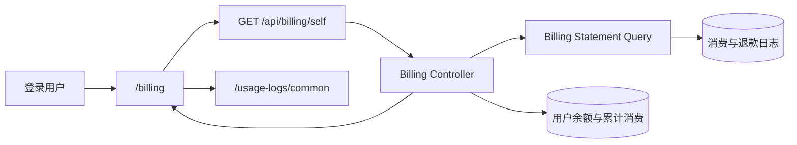

# API Key 用量账单架构

## 1. 目的与范围

本文描述用户用量账单如何以“周期 × API Key × 模型”为粒度汇总已经发生的结算事实，并与 Dashboard、钱包、用量日志和计费主链路保持解耦。

账单是用量与费用结算记录，不是税务发票或复式记账系统。本文不设计期初/期末余额、逐笔充值勾稽、跨期冲销或历史价格重算。

## 2. 当前实现状态

当前代码已经实现：

- 登录用户页面 `/billing`；
- 自助接口 `GET /api/billing/self`；
- 使用构成接口 `GET /api/billing/self/breakdown`；
- 最长 31 天的账单周期；
- API Key × 模型明细、按模型和按 API Key汇总；
- 输入、输出、总 Token、请求数、RPM、TPM、耗时、流式比例；
- 消费、退款和非负净费用；
- 当前余额与累计消费；
- 缓存、长短 Context、动态计费和数据质量明细；
- 带原始 quota/比例列的 CSV 导出和用量日志下钻；
- SQLite、MySQL/PostgreSQL 使用 GORM 聚合的实现，以及 ClickHouse SQL 兼容测试。

该功能没有新增数据库结构，也没有修改预扣、结算、退款或日志写入主链路。

## 3. 架构决策

### 3.1 独立账单面

账单使用独立功能模块：

```text
web/src/features/billing/
web/src/routes/_authenticated/billing/
controller/billing_statement.go
model/billing_statement.go
controller/billing_statement_breakdown.go
model/billing_statement_breakdown.go
```

它不并入 Dashboard、Wallet 或 Usage Logs：

- Dashboard 面向运行分析，账单面向周期结算；
- Wallet 面向余额与充值，不表达模型用量；
- Usage Logs 面向单次请求审计，账单面向聚合；
- 独立模块减少对上游文件的接线和未来合并冲突。

### 3.2 结算日志是账单事实

账单直接聚合 `logs` 中的消费和退款记录，不使用当前价格重新计算历史费用，也不以 `quota_data` 小时缓存为权威。

```text
历史费用 = 请求当时已结算并写入日志的 quota
```

模型价格、分组倍率、表达式档位和附加费用只在单次用量日志详情中解释，不在账单汇总层重新执行。

## 4. 系统上下文



账单查询是只读投影。任何页面筛选、汇总或导出都不能回写日志、余额或结算状态。

## 5. 数据口径

### 5.1 聚合键

服务端按以下维度聚合：

```text
user_id + token_id + token_name + model_name
```

随后以 `token_id + model_name` 合并历史名称变化，并使用最新非空日志名称作为展示名。删除后的 API Key仍可按 ID和历史日志参与账单。

### 5.2 请求与异步结算

带有 `task_id` 的异步调整日志影响 Token 和费用，但不重复计算逻辑调用：

| 指标 | 是否包含任务调整行 |
| --- | --- |
| 请求数 | 否 |
| 平均响应耗时 | 否 |
| 流式请求数 | 否 |
| 输入/输出 Token | 是 |
| 消费额度 | 是，仅消费日志 |
| 退款额度 | 是，仅退款日志 |

因此请求数表示逻辑调用次数，Token 和费用表示查询周期内已经记录的结算结果。

### 5.3 费用公式

每个明细行：

```text
gross_quota  = 周期内消费类型日志 quota 之和
refund_quota = 周期内退款类型日志 quota 之和
net_quota    = max(gross_quota - refund_quota, 0)
```

消费和退款按各自日志 `created_at` 归属周期。跨期退款不会回写原消费周期；只有退款而无同期消费的行显示 0，不生成负费用或信用余额。

### 5.4 运行指标

```text
total_tokens = prompt_tokens + completion_tokens
average_rpm  = requests / 周期分钟数
average_tpm  = total_tokens / 周期分钟数
stream_ratio = stream_requests / requests
```

平均耗时来自消费日志中的秒级 `use_time`。值为 0 的合法消费行仍参与平均，页面不得将该指标解释为毫秒精度。

## 6. 接口合同

```text
GET /api/billing/self
GET /api/billing/self/breakdown
UserAuth()
```

请求参数：

| 参数 | 约束 |
| --- | --- |
| `start_timestamp` | 必填，Unix 秒 |
| `end_timestamp` | 必填，Unix 秒 |
| 周期 | 大于 0 且不超过 31 天 |
| `token_id` | 可选，必须大于 0 |
| `model_name` | 可选，最长 255 字符 |

Controller 只使用认证上下文中的用户 ID，不接受任意 `user_id`。响应包含：

- `period`：实际查询周期；
- `funds`：当前余额和累计消费；
- `summary`：全周期汇总；
- `items`：API Key × 模型明细；
- `generated_at`：数据生成时间；
- `data_source=settlement_logs`。

额度字段返回原始 quota，由前端按当前站点货币和倍率配置格式化。

`/api/billing/self` 是正式金额与基础 Token 的权威来源；`/api/billing/self/breakdown` 只提供缓存、Context、动态计费和数据质量等可选解释。breakdown 中 `data_quality.unavailable_requests > 0` 表示历史元数据无法可靠解析，前端不得将其显示为零用量。

## 7. 前端职责

前端使用 React Query，以周期作为查询键：

```text
['billing-statement', start, end]
['billing-statement-breakdown', start, end]
```

当前页面一次获取周期内全部明细，API Key 和模型筛选在本地完成。前端可以：

- 切换本周、上周、近 7 天、近 30 天和自定义周期；
- 展示明细、按模型汇总或按 API Key汇总；
- 导出当前可见聚合行；
- 只将与 statement 的 `token_id + model_name` 及请求数一致、且数据质量可用的 breakdown 行纳入构成汇总；
- 携带周期、API Key名称和模型跳转到用量日志。

前端不得：

- 用当前价格重算 quota；
- 从展示金额反推或修改余额；
- 把账单汇总当作单次请求明细；
- 向普通用户显示渠道、上游凭证或管理员审计字段。

## 8. 一致性、保留与失败边界

- 账单读取已写入日志的最终事实，不提供读写事务快照或月结封账。
- `LogConsumeEnabled` 关闭或日志被清理后，历史账单可能不完整。
- 账单生成时间不表示所有异步任务均已终态；后续结算会按日志发生时间进入后续查询结果。
- 当前余额和累计消费来自用户主数据，与周期日志不是严格的会计勾稽关系。
- 查询失败只影响账单页面，不得影响模型调用、结算或钱包。
- statement 可用但 breakdown 失败、不一致或元数据损坏时，正式金额继续展示，使用构成标为不可用且不进入顶部构成汇总。
- 前端缓存只用于短时读取性能，不能作为导出或审计的唯一数据源。

## 9. 数据库兼容

聚合查询使用 GORM 和三种主日志数据库均支持的能力：

- `CASE WHEN`；
- `COALESCE`；
- `SUM`、`AVG`、`MAX`；
- `LIKE` / `NOT LIKE`；
- `GROUP BY`。

禁止为账单引入单数据库 JSON 操作符。当前通过日志 `other` 中是否包含 `"task_id"` 识别异步调整行；如果未来改为结构化列，必须提供 SQLite、MySQL 和 PostgreSQL 一致迁移与回退。

ClickHouse 日志库使用同一口径，并由独立合同测试验证生成 SQL 的兼容性。

## 10. 权限与隐私

- 页面和接口只对已登录用户开放。
- 用户只能查看自己的账单。
- API Key只展示 ID和日志中的名称，不返回密钥值。
- 账单不返回请求体、prompt、上游响应、渠道或管理员信息。
- CSV 导出继承当前页面筛选和浏览器下载边界，同时保留人类可读展示列与机器可核对的原始 quota/比例列；导出文件由用户自行保护。

## 11. 架构不变量

1. 历史费用只读结算日志，不按当前价格重算。
2. 异步调整影响 Token 和费用，但不重复增加请求数。
3. 净费用永不为负。
4. 账单查询不修改计费、余额、日志或数据库结构。
5. 账单与单次用量日志通过下钻关联，不复制费用解释器。
6. 账单不是税务发票或账务级流水。
7. 所有聚合继续兼容支持的数据库。

## 12. 相关文档

- [API Key 用量账单使用指南](../30-engineering/API-Key用量账单使用指南.md)
- [01 计费与分组运维手册](../40-operations/01-计费与分组运维手册.md)
