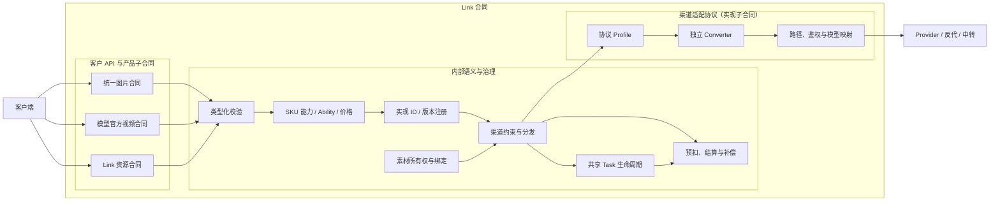
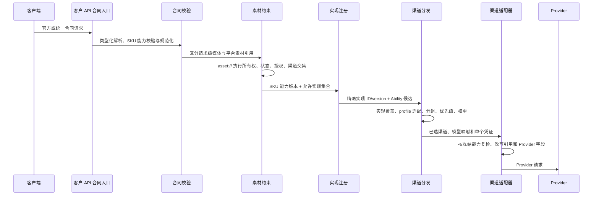

# Link 合同架构

## 1. 目的与范围

本文定义所有“经项目负责人明确决定、通过本地代码修改实现并在代码中显式注册”的 Link 合同所共同遵守的架构边界。范围由明确的代码扩展和注册事实决定，不由 Ability、候选渠道、模型发现、运行时能力探测或其他启发式规则推断。

NEWAPI 已原生支持的渠道或模型不建立 Link 合同；这是代码变更前的治理约束，不是系统在运行时判定 Link 身份的逻辑。仅有配置变更而没有新增代码合同注册时，不属于 Link 合同。

- Link 合同向客户提供什么稳定承诺；
- 公开模型、官方协议和平台资源如何标识；
- 渠道、Provider、反代和中转差异如何由渠道适配协议消化；
- 何时可以跨渠道选路，何时必须拆分公开 SKU；
- 请求校验、任务生命周期、计费和素材引用如何保持合同一致。

本文是 Link 扩展范围内的跨产品总纲，不是 new-api 全部 relay 路由的总合同。图片异步执行、视频任务和素材生命周期的细节分别见对应专题架构。

## 2. 当前实现状态

截至 2026-08-03，代码已经形成以下边界：

| 产品面 | Link 合同 | 当前实现 |
| --- | --- | --- |
| 图片 | 统一 NEWAPI 图片接口 | `POST /v1/images/generations`；注册 SKU 由版本化 `ImageSKUCapability` 执行字段和值域校验，异步时使用 `GET /v1/images/tasks/:task_id` |
| 视频 | 模型厂商官方合同 | Seedance 使用 ModelArk v3，Kling 使用 Kling v1，即梦使用 `CVSync2Async*` |
| 素材库 | 平台统一控制面合同 | `/v1/assets`、平台 `ast_xxx`、持久化 `AssetSource` 和 binding/source 双模式 Resolver |
| Provider 实现 | 代码注册 + 渠道显式选择 | 以 implementation ID/version/content hash 贯穿 Ability、运行时、binding、Task、attempt 与 exposure |

注册图片任务会同时冻结客户合同版本、SKU capability hash 和 implementation hash；非终态轮询发现
任一快照已经不是当前唯一注册事实时，任务按合同违例失败关闭，不继续访问上游。启用渠道和运行时
候选还必须命中当前启用的 implementation exposure 策略，profile 不再构成第二套监控身份。

当前仍需通过生产配置或灰度持续证明的事项包括：

- 同一视频 SKU 的全部启用渠道是否完整实现其官方合同；
- 公开视频 SKU 的真实 Provider 字段、媒体组合和结果投影是否持续满足已注册 capability；
- 异步 create attempt 的发送前持久化与轮询合同违例对账是否覆盖故障注入；
- 图片公开 SKU 的价格、能力和值域是否已完成真实上游与账单验收；
- 历史视频只读入口和素材旧别名是否达到退出条件；
- 内置 API 文档是否准确发布上述 Link 合同。

架构文档只描述已实现边界和已接受设计，不把“代码可解析”“渠道可配置”自动写成“生产已发布”。运行时可用模型仍以模型发现、ability、分组和渠道配置为准。

## 3. 核心决策

### 3.1 Link 合同的概念层级

**Link 合同**是系统对一个 Link 扩展产品从客户调用到渠道实现的端到端承诺，是该扩展设计、发布、路由和验收的唯一权威边界。它不是 NEWAPI 原生合同的替代，也不是某一个 DTO 或路由的别名，而是下列子合同的组合：

```text
Link 合同
├─ 客户 API 合同
├─ SKU 能力合同
├─ 任务与计费合同
├─ Link 资源合同
└─ 渠道适配协议
```

| 子概念 | 定义的主要语义 |
| --- | --- |
| 客户 API 合同 | 路径、鉴权、请求、响应、错误、幂等和可观测行为 |
| SKU 能力合同 | 公开模型的字段、值域、默认值、媒体组合和能力版本 |
| 任务与计费合同 | 同步或异步生命周期、查询、取消、结算、退费和对账 |
| Link 资源合同 | 平台素材的标识、所有权、授权、绑定和生命周期 |
| 渠道适配协议 | 请求转换、上游鉴权、路径与模型映射、响应归一和上游任务生命周期 |

渠道适配协议是 Link 合同的实现子合同，不是并列的第二套公开合同。它只能证明渠道是否完整实现已发布能力，不得反向定义或扩张客户 API、SKU 能力和计费语义。渠道切换不得改变客户调用方式。Provider 私有路径、字段、真实模型 ID、任务 ID、状态和鉴权只能存在于渠道配置、适配器、任务快照和管理员审计中。

客户和 Provider 只是调用链中的角色，不用于构造两套方向性合同。`Link 资源` 则专指平台治理的虚拟素材对象，不是 Link 合同的简称，也不表示平台必然托管媒体字节。

### 3.2 显式代码注册是唯一身份依据

Link 合同是一个封闭的、可枚举的代码注册集合。公开合同注册与 Provider 实现注册是连续但不同的
两个动作。每个公开合同注册项至少包含：

- 唯一 `contract_id` 与合同版本；
- 公开路由或公开 SKU 绑定；
- 类型化 DTO/字段白名单与错误投影；
- 至少一个本地 converter、adapter/profile 或生命周期扩展接线；
- 计费与任务快照边界；
- 合同、失败关闭和兼容回归测试；
- 对应架构、调用与运维文档。

经明确代码扩展和注册的 Moxing Seedance 合同属于 Link 合同。仅在数据库中新增 Moxing Channel、Ability、模型映射或价格，不会创建新 Link 合同。

每份 Provider 实现另以 `link_implementation_id + link_implementation_version` 代码注册，声明它
覆盖的公开 SKU、渠道类型、profile、converter、适配器版本、Link 资源解析模式以及任务和计费接线。
管理员必须在具体渠道上显式选择精确实现版本；只保存 route、模型、profile 或前端模板不能登记
Provider 实现。保存、Ability 发布、运行时过滤和发送前复检使用同一注册事实。

### 3.3 历史“北向 / 南向”与子概念的对应

“北向”和“南向”只是从网关视角描述调用方向的历史用语，不是新设计中的合同层级。在仅需要表达两个方向时，按下列规则理解：

```text
北向（客户 -> 网关）
  ≈ Link 合同的客户可见部分
  主入口子概念：客户 API 合同

南向（网关 -> Provider / 反代 / 中转）
  = 渠道适配协议
```

“北向”的历史含义比单个 API 入口更宽，因此必须根据具体语义落到对应子合同；“南向”则统一收敛为渠道适配协议：

| 历史表述 | 正式子概念 | 说明 |
| --- | --- | --- |
| 北向接口、北向协议、北向 DTO、北向错误 | 客户 API 合同 | 定义客户调用网关的路径、鉴权、请求、响应和错误投影 |
| 北向模型能力、北向参数值域 | SKU 能力合同 | 定义公开 SKU 可接受和可承诺的能力 |
| 北向任务状态、查询、取消、计费 | 任务与计费合同 | 定义客户可见的任务生命周期和资金语义 |
| 北向素材 ID、素材授权、素材引用 | Link 资源合同 | 定义平台资源对客户的稳定身份和治理语义 |
| 南向协议、南向转换、南向适配器、上游协议 | 渠道适配协议 | 定义网关如何调用和归一化具体渠道 |

因此，不得将“北向 = Link 合同、南向 = 另一套并列合同”作为架构分层。正确关系是：北向表述按语义分别归入 Link 合同的客户可见子合同，南向表述归入 Link 合同内部的渠道适配协议。

### 3.4 一个 Link 公开 SKU 对应一份客户合同和能力声明

Link 公开模型名不是基础模型家族别名，而是稳定、可计费、可验证的合同 SKU。同一 Link SKU 只能进入以下语义等价的渠道：

- 请求字段、类型、默认值、枚举和值域；
- 响应和错误外壳；
- 同步、异步、查询、取消、删除及内容下载生命周期；
- 已发布能力；
- 计费维度和结算语义。

无法证明等价时，应从该 Link SKU 的候选渠道中移除；如果产品确需同时发布，应拆分公开 SKU，并分别绑定模型映射、能力、渠道和价格。不得先随机进入不兼容渠道，再依赖重试、字段删除或内部错误掩盖差异。该等价门只属于 Link 扩展，不得介入 NEWAPI 原生文生文等 relay 路由的 Ability、优先级与权重选渠。

同一公开 SKU 可以列出一个或多个已注册 Provider 实现，只要它们完整覆盖相同公开能力。实现 ID、
渠道类型、profile、converter 和内部素材解析模式不进入公开 capability hash；它们用于实现查找、
候选过滤、binding、执行快照和审计。实现 ID 不同本身不构成拆分 SKU 的理由，只有客户可见能力、
生命周期或计费语义无法证明等价时才拆分。一个实现也可以覆盖多个公开 SKU，但每个 SKU 都必须
分别通过公开 capability 覆盖校验。

### 3.5 合同来源

客户端可见合同的来源优先级为：

```text
NEWAPI 已稳定发布的原生合同（有则直接使用，不建 Link）
  -> NEWAPI 原生无法覆盖时，使用对应模型厂商官方 API 建立 Link 合同
  -> 已验证且明确发布的平台扩展
```

第三方聚合商、反代和渠道文档只用于确认 Provider 事实，不能直接升级为公共字段或公共协议。每项公开合同应记录来源链接、版本或验证日期。

### 3.6 公开 SKU 能力合同是客户能力权威

`contract_id` 是客户 API 合同的协议族和响应投影键；版本化 `VideoSKUCapability` 与最小
`ImageSKUCapability` 分别是视频和显式 Link 图片 SKU 的能力合同，标识某个公开 SKU 在该协议下
实际发布的字段值域、默认值、媒体组合、生命周期、Link 资源支持和计费维度。它们与合同 ID 共同
定义 Link 合同的客户可见部分，但都不由渠道决定。

合同是否属于 Link 只由代码注册确定，与 Ability 或候选渠道无关。Link 合同注册后，Provider 实现
注册项声明内部实现能力，渠道显式绑定精确实现 ID/version；profile 只描述协议适配形状，不能单独
授予 Link 身份。Ability 只表示“这个渠道可以进入该 SKU 的执行选渠集合”，不自动证明合同等价。
配置发布和运行时必须分别校验执行渠道完整实现 SKU 能力；不等价时排除渠道或拆分
公开 SKU。完整决策见
[ADR-0010](decisions/0010-视频公开SKU能力与候选渠道等价.md) 与
[ADR-0015](decisions/0015-Link公开SKU与实现身份版本绑定.md)。

### 3.7 Link 资源是平台逻辑身份

[Link 资源虚拟素材库架构](Link资源虚拟素材库架构.md) 与
[ADR-0015](decisions/0015-Link公开SKU与实现身份版本绑定.md) 已确立 Link 资源的目标合同：客户创建后
统一使用 `asset://ast_*`，不需在后续图片或视频请求重传源 URL；平台内部可按候选渠道和显式实现
版本解析为 active `upstream_binding` 或受保护 `source_url`。

“客户只使用 Asset”不等于“平台已永久托管媒体”：

- binding 已成功物化时，源 URL 只是初始建立输入，其过期不使该 binding 自动失效；
- URL-only Provider 没有上游素材对象时，源 URL 是每次执行的真实数据路径，过期后对应渠道必须退出候选；
- `ready` 表示当前至少存在一条可解析路径，不是跨所有 Provider 的永久可用承诺；
- 一次性签名 URL 优先走请求级媒体路径；需要可复用时必须保证源 TTL 或先建立 managed binding。

当前代码已经实现最小 `AssetSource`、显式实现身份、能力分层和 binding/source 双模式 Resolver。
SQLite schema 与方言契约已纳入自动化；MySQL、PostgreSQL 外部数据库门禁在提供对应 disposable
test DSN 时执行。代码完成不等于生产发布，真实 Provider 抓取、字段和计费仍须按渠道灰度验收。

### 3.8 实现版本单轨与内容哈希

当前 Link 扩展仍处于本地开发且未发布，不建设多版本共存、退役解析或兼容状态机。每个实现 ID 在
代码注册表中只保留一个已确认的当前版本；version 用于证明渠道、Task、binding、计费和审计引用的是
同一份不可变声明，不是让 v1/v2 同时运行的开关。

若开发期间确认从 v1 升级为 v2，执行一次性硬切换：删除本地 v1 注册、v1 专属 adapter/parser、
分支、fixture 和测试，清理本地 v1 渠道、Task、binding、attempt 与 exposure 数据，只保留 v2。
不得保留双注册、历史 resolver、alias、双读、fallback 或“旧任务继续走 v1”的代码。new-api 上游
共享文件不因该切换删除或重构，只保留接入当前版本所需的极窄调用。

Task 冻结连接和实现身份仍用于防止同一次当前版本部署中渠道配置漂移；它不构成本地未发布版本之间
的数据兼容承诺。将来首次正式发布后若需要跨版本无损升级，必须在升级前重新作出独立架构决策，
不能预先把本地双轨复杂度写进当前权威实现。

客户合同版本、Link implementation version 与 southbound adapter version 是三条独立版本轴：前者
约束公开 API，中者标识当前 Provider 实现声明，后者标识网关到 Provider 的协议 revision。当前文档
中的实现 `/v1` 仅表示该实现的首版且唯一当前声明；FunCloud adapter `v2` 则表示已确认采用的最新
上游协议。二者不能据名称推导出仓库需要同时保留 implementation v1/v2。

实现 `content_hash` 是内部防静默改义证据，不是公开合同字段。哈希材料使用版本化的专用类型，排除
展示文案、运行状态、凭据和其它非执行字段；字符串先 trim，集合语义的 SKU、渠道类型、profile、
converter、解析模式、媒体类型和限制值排序去重，只有具有业务顺序语义的字段保留顺序。注册、渠道
校验、binding 和 Task 必须复用同一个 `link-implementation-hash-v1` 规范，经 `common.Marshal` 后
计算 SHA-256，表示为 `sha256:<hex>`；不得由各调用方临时拼 map 或自行序列化。

## 4. 总体架构



客户端 DTO 在进入分发前完成白名单校验和类型化归一。Provider converter 只负责确定性转换，不得反向扩张 Link 合同。

## 5. 产品合同

### 5.1 统一图片合同

当前统一图片产品使用：

```text
POST /v1/images/generations
GET  /v1/images/tasks/:task_id
```

当前 Link 图片 SKU 定义与发布门禁：

| 公开 SKU | 合同归属 | 实现登记与发布状态 | Provider 模型与路径 |
| --- | --- | --- | --- |
| `seedream-5-moxing` | Link 图片 SKU | `moxing.images.media-task/v1`，待代码登记和真实验收 | `seedream-5-0-260128`；Advanced Custom `/v1/images/generations` + `media_task_image_blocking` |
| `seedream-5-qihang` | Link 图片 SKU | `qihang.images.openai-compatible/v1`，待代码登记和真实验收；登记前不得进入 Link 门禁后的候选集 | `seedream-5`；Advanced Custom `/v1/images/generations` + `converter=none` |
| `nano-banana-2` | Link 图片 SKU | 独立验收后才可加入 `moxing.images.media-task/v1` 或其它等价实现；验收前保持未发布 | `gemini-3.1-flash-image-preview-usage`；Advanced Custom `/v1/media/generations` + `media_task_image_blocking` |

客户端统一使用 `model`、`prompt`、`image`、`size`、`n`、`response_format` 和 `stream` 等 Link 合同字段。Nano 的 `image -> reference_images`、模型 ID 和异步任务信封转换均属于 Provider 事实。

统一字段不表示各模型拥有相同值域。尺寸、参考图数量、高级参数和同步/异步能力按 SKU 声明并在上游调用前校验。

`seedream-5-moxing` 等名称中的 Provider 后缀是已发布产品的历史命名，只是稳定、不可解释的 SKU
标识，不具有实现选择或路由约束力。是否属于 Moxing、Qihang 或其它 Provider 只能由渠道保存的精确
实现 ID/version 决定，不能从模型名、converter、Base URL 或 profile 反推。

显式 Link 图片 SKU 使用最小、版本化的 `ImageSKUCapability` 记录公开字段值域和
`supports_link_assets`，继续复用现有 OpenAI 图片 DTO、路由、Task 和计费。Provider 实现的 route、
converter、模型映射和素材解析模式保留在实现注册项中，不进入公开图片 capability hash。图片
Link Resolver 和真实 Provider 验收完成前，对应 SKU 的 `supports_link_assets` 保持 false。

供应商原生图片协议是独立附加合同，只有上游真实支持、网关已有转发能力并完成渠道验证时才能开放；它不属于统一图片的跨供应商兼容承诺。

### 5.2 官方视频合同

视频生成属于模型数据面，不强制伪装成单一平台协议：

| 模型族 | Link 合同 ID | 客户 API 合同入口 |
| --- | --- | --- |
| Seedance | `modelark.contents.generations.v3` | `/api/v3/contents/generations/tasks` |
| Kling | `kling.v1.videos` | `/kling/v1/videos/*` |
| 即梦 | `jimeng.cv.async.2022-08-31` | `/jimeng?Action=CVSync2Async*` |

中间件将官方 DTO 转为内部视频任务语义，并把原始合同对象保存在请求上下文。任务创建时冻结 Link 合同标识、合同版本和渠道适配协议版本；查询、列表、取消、删除和内容下载按任务创建时的合同投影。存量字段与新术语的对应见 9.1 节。

OpenAI Videos 是 NEWAPI rc23 原生合同，不属于 Link 合同。`sora-2`、`sora-2-pro` 等原生模型
继续使用 `/v1/videos`、原生 DTO、Sora adapter、Ability 与计费分发；它们不冻结 Link capability
或 implementation。反向边界同样严格：上表显式登记的 Link SKU 不得借原生或旧版平台视频入口
创建，详见 [ADR-0016](decisions/0016-原生OpenAI-Videos与Link合同并存边界.md)。

### 5.3 请求级媒体与统一素材库合同

视频官方合同中的媒体字段支持两条互不混淆的输入路径：

| 路径 | 客户端值 | 平台职责 | 适用范围 |
| --- | --- | --- | --- |
| 请求级媒体 | 合同允许的 HTTP/HTTPS URL 或 Data URL | 类型、scheme、数量、大小和 SKU 能力校验；请求结束后释放 | 普通图片、音频及模型明确支持的其他非托管媒体 |
| Link 资源（平台治理素材） | `asset://ast_xxx` | 所有权、状态、授权、解析路径、渠道交集、改写、撤回和生命周期 | 需要复用、迁移、账号绑定或平台授权治理的素材 |

请求级媒体不是平台素材库的匿名上传入口。网关作为中转层，不主动下载或长期保存其二进制，
不执行人工素材审核，也不把渠道凭据、Cookie 或平台认证信息附加到媒体地址。调用方负责确保
其有权向选定模型服务提交该媒体；Provider 仍可按自身合同执行格式、内容安全和合规判断。
网关仍须执行自身能够确定的协议、安全、计费和敏感信息边界，不能把“不做内容审核”解释为
允许任意 scheme、合同外字段、无限请求体或日志泄露。

素材库属于平台控制面，统一提供：

- 平台 CRUD、迁移、授权、幂等和用户隔离；
- 平台资源 ID `ast_xxx`；
- 图片或视频已发布字段中的 `asset://ast_xxx` 引用；
- 平台状态、错误和生命周期。

上游素材账号、资源 ID、素材组、Action/Version、签名、profile 和渠道 ID 不进入普通客户 API 合同。

Link 资源仍使用图片统一合同或视频官方合同中已经发布的媒体字段，只把字段值设为
`asset://ast_xxx`。网关在选渠前校验所有权、状态、授权、实现版本、解析能力和多素材渠道交集，
并在每次 Provider 尝试前改写为该实现所需的 binding 引用或受保护源 URL。

平台已经识别为真人或需要平台授权、撤回和审计的素材，只能通过 `asset://ast_xxx` 使用。
对于未经分类的直接 URL/Data URL，网关不执行内容审核，也不能仅凭地址技术判断是否包含
真人；此时真人限制属于调用方义务、受控分组和业务准入政策，不能描述成平台自动识别保证。
需要技术强制时，必须先增加可验证分类/审核能力，或禁止全部无法证明类型的直接媒体。

同一请求是否允许混用请求级媒体和 Link 资源由公开 SKU 明确声明。未声明时 fail closed；
第一阶段 ModelArk 视频 SKU 拒绝混用。

### 5.4 当前实现注册表

当前代码注册表覆盖数据库中已配置的 Link 图片与视频渠道，并保留同一公开 SKU 的等价实现关系：

| 实现 ID/version | 渠道类型与协议 | 公开 SKU |
| --- | --- | --- |
| `byteplus.seedance-ark/v1` | DoubaoVideo official + official Action Assets | `seedance-byteplus` |
| `moxing.seedance-media-task/v1` | DoubaoVideo third-party relay + relay assets | `seedance-2-0-oversea` |
| `moxing.seedance-ark-assets/v1` | DoubaoVideo reverse proxy + Ark assets | `seedance-2-0-oversea` |
| `tokensave.seedance-media-task/v1` | DoubaoVideo third-party relay + relay assets | `doubao-seedance-2-0-260128` |
| `feicai.seedance-json-omni/v1` | DoubaoVideo JSON omni-reference adapter v2 | 五个固定分辨率 AZHW SKU |
| `funcloud.seedance-json/v1` | DoubaoVideo FunCloud adapter v2，`source_url` only | `seedance-2.0-standard`、`seedance-2.0-fast` |
| `moxing.images.media-task/v1` | Advanced Custom media-task converter | `seedream-5-moxing`、`nano-banana-2` |
| `qihang.images.openai-compatible/v1` | Advanced Custom converter none | `seedream-5-qihang` |
| `kling.videos-official/v1` | Kling official | 三个 Kling SKU |
| `jimeng.videos-official/v1` | Jimeng official | `jimeng_vgfm_t2v_l20` |

该表是当前代码事实的文档投影，运行时唯一权威仍是代码注册表及其 `sha256:` content hash。渠道必须
保存精确 ID/version；名称、Base URL、模型后缀、profile 和 converter 均不得反推实现身份。

## 6. 请求、选渠与适配顺序



错误必须尽早发生：

- 合同错误在预扣和上游调用前返回对应 4xx；
- 无兼容渠道时明确失败，不进入错误渠道试探；
- 未发布能力保持未发布，不通过任意 map 或 passthrough 绕过；
- 能力不等价的渠道在配置发布时拒绝、运行时排除，不选中后再降级；
- 上游运行错误与 Link 合同错误分开投影。

## 7. 任务、幂等与计费

- 图片和视频可以共享 Task 持久层、轮询、终态 CAS、计费补偿和审计，但必须使用各自的客户端协议与响应投影。
- 任务快照冻结创建时实际使用的 Link 合同、SKU 能力版本、生命周期能力、渠道 profile、路径、
  `link_implementation_id`、实现版本/content hash、单个凭证、上游任务 ID、模型映射和计费合同。
- 渠道配置只决定新任务；在途任务不得随配置修改而漂移。
- 取得上游任务 ID并完成本地持久化后，结算与退款责任从请求转移到 Task。
- 公开模型名是价格键；上游模型、路径和 profile 不决定售价。
- 未经验证的 usage 不参与精确结算；缺失可信 usage 时按各产品的安全策略保留预扣或失败关闭。
- exposure 策略模板按实现 ID/version 配置；实际风险事实、聚合与熔断至少按
  `channel_id + implementation ID/version + public SKU` 隔离。某个渠道/实现/SKU 风险桶熔断后，
  其它风险桶不得被污染，能力等价且仍满足策略的其它实现可以继续接管。
- 剩余等价候选数是熔断后的可用性结果，应统计所有仍合格的等价实现；它不参与 exposure 阈值
  计算。若运维需要，可另报同实现剩余数，但不得用它替代跨实现可用候选数。
- 每个可能创建共享 Task 的数据面 POST 在发送任何上游字节前建立耐久 create attempt。它
  覆盖正式视频和已选中持久化媒体任务 route 的图片调用；素材和真人认证控制面继续使用自身
  状态机。资金预扣与 `sending` 原子提交；上游任务 ID 确认后才原子创建 Task 并把 hold
  转移到 Task 的 `pending`。潜在异步图片返回同步结果时直接结算并关闭 attempt。
- 发送后的模糊创建结果进入 `unknown`，不得自动重发或退款。对账超过产品批准的资金占用
  截止时间仍无法恢复时，释放客户 hold 并把潜在上游成本记为平台 exposure。
- 已有 Task 的单次轮询合同违例进入 `reconciliation_required`，保持业务非终态和计费
  `pending`；不能直接推导为 `FAILURE`。可信终态结果确定违反交付上限或安全合同可以进入
  内部 `PROVIDER_CONTRACT_FAILURE`，对外投影 `failed/provider_contract_failure`，按冻结
  零目标结算并记录 exposure；明确业务失败和任务 SLA 到期分别执行对应终态资金处理。
- `Idempotency-Key` 是推荐的可选平台扩展；缺失时每个 HTTP 请求是新的业务尝试，内部
  create attempt 不提供跨请求 exactly-once。完整规则见
  [ADR-0011](decisions/0011-异步创建未知与轮询合同违例对账.md)。

## 8. 安全、错误与可观测性

### 8.1 安全边界

- 客户端不得透传合同外 Provider 参数。
- API Key、上游凭证、签名 URL、上游任务 ID和 `private_data` 不得进入用户响应。
- Provider 错误必须脱敏，不能泄露内部域名、请求头或账号信息。
- 平台素材引用 fail closed；未知或未登记的上游素材 ID不得直接接受。
- 请求级媒体不得持久化到 Task、幂等记录、计费探针、日志、metrics 或 trace；除正式 Provider
  请求外不得附加平台或渠道凭据。
- 不执行请求级媒体内容审核不免除协议校验、请求体上界、凭据隔离、日志脱敏和已发布真人素材
  政策。
- 真人托管素材在发送前的 `sending` 事务锁定授权并写入可索引
  attempt—任务—素材—授权 reservation；撤回事务锁定同一授权行。撤回先提交则不得发送，
  reservation 先提交则属于可索引的在途任务。
- 真人授权撤回立即阻止新的 reservation 和平台内容访问；已提交上游的任务只能在上游支持时
  尝试取消或清理，不得承诺收回 Provider 已处理或缓存的数据。
- 取得上游任务 ID 后，真人授权 reservation 必须在 Task 创建事务绑定为任务关系。
  `/v1/videos/{task_id}/content` 及其 `last_frame` 分支每次回源前都重新检查这些授权；任一
  授权不再是 `authorized` 时返回稳定的内容不可用错误，不向上游发起下载。

### 8.2 必要审计维度

管理日志至少能够关联：

- 公开模型与 Link 合同 ID；
- Link 实现 ID、版本和内部 content hash；
- 渠道 ID、渠道 profile 和适配器版本；
- 本地任务 ID、脱敏上游任务/请求 ID；
- 能力过滤和合同拒绝原因；
- 预扣、终态结算、退款和补偿状态；
- create attempt 状态、hold 年龄/金额、对账截止时间和平台 exposure；
- 轮询合同违例次数、`reconciliation_required` 年龄和 SLA 到期原因；
- 素材绑定、账号指纹和渠道交集失败原因。
- 真人任务内容阻断、撤回时的取消尝试及其最终结果。

普通用户日志必须移除管理员专属字段。

## 9. 架构不变量

1. 渠道变化不改变客户 API 合同。
2. 一个 Link 公开 SKU 不同时承载两个不等价合同；该规则不改变 NEWAPI 原生 relay 语义。
3. 一个 Link 公开 SKU 可由多个已登记且能力等价的实现服务；实现 ID 不进入公开 capability hash。
4. 合同外字段不透传，合法字段不静默删除、钳制、降级或改义。
5. 公开模型名、上游模型 ID、实现身份、渠道和价格各有单一职责。
6. 图片保持统一 NEWAPI 合同；视频保持各模型官方合同；素材库保持平台统一合同。
7. 素材 Provider 差异不能成为新的客户端资源类型或枚举。
8. 任务创建与轮询使用冻结的同一 Provider 账号、实现版本和协议事实。
9. 所有数据库设计继续兼容 SQLite、MySQL 和 PostgreSQL。
10. 请求级媒体与平台托管素材是两条显式路径；只有 `asset://ast_xxx` 进入素材绑定生命周期，
   但未经分类的直接媒体不能被描述成平台已自动识别真人。
11. Link 公开 SKU 能力是该扩展客户端的唯一权威；候选渠道必须在配置发布和运行时都完整实现该能力。
12. 共享 Task 型创建在发送前拥有耐久 attempt；创建未知和可恢复轮询合同违例都不能被即时
    等同为业务失败。
13. 真人授权使用与撤回在同一授权行上线性化；撤回先提交时不发送，reservation 先提交时纳入
    在途取消/清理。平台任务级内容端点始终 fail closed，已下载到平台外的副本不在该保证范围。
14. 每个实现 ID 只注册一个当前版本；开发期升级执行硬切换并删除本地旧版本代码、测试和数据，不
    建设多版本共存或兼容解析。
15. Task 和 binding 只允许匹配当前精确实现版本；旧版本记录不迁移、不回退、不参与执行。
16. exposure 指标按渠道、精确实现版本和公开 SKU 隔离；熔断一个候选后，其它等价实现仍可接管。

### 9.1 new-api 上游标识符保留映射

本次决策统一架构概念，但按最小入侵原则不重命名 new-api 已有数据库字段、任务快照字段或已发布 API。
这些上游标识符继续使用，其权威含义按下表解释；本地未发布的 Link 旧数据与旧实现不属于保留范围。

| 保留标识符 | 当前语义 |
| --- | --- |
| `northbound_contract_id` | Link 合同 ID |
| `northbound_contract_version` | Link 合同版本 |
| `southbound_adapter_version` | 渠道适配协议版本 |
| `VideoSouthboundAdapterVersion` | Go 代码中保留的渠道适配协议版本类型名 |

不得仅为了术语一致而重命名上述 new-api 字段或类型；Link 本地代码则直接收敛到唯一当前实现。

## 10. 变更规则

新增模型、渠道或 Provider 时依次完成：

1. 由项目负责人明确批准新增 Link 合同和代码扩展范围；不由系统自动发现或推断。
2. 确认不与 NEWAPI 已有原生合同重复；这是开发治理检查，不是 Link 身份判定。
3. 新增唯一 `contract_id`/版本、公开 SKU capability 和显式代码注册项。
4. 新增不可变的 `link_implementation_id + version` 注册项，并让渠道显式保存精确版本。
5. 将新增逻辑隔离在独立路由、DTO、converter、adapter/profile 或生命周期扩展文件中，原生热路径只保留最小接线。
6. 明确已有 Link SKU 的全部实现是否合同等价；无法证明时排除实现或拆分 SKU。
7. 为实现版本显式配置 exposure 策略，并明确渠道/实现/SKU 风险桶，再启用渠道和 Ability。
8. 增加合同、跨实现等价、单版本硬切换、跨实现 failover、exposure 隔离、失败关闭、计费和敏感信息回归测试。
9. 完成 create unknown、轮询合同违例、真实终态、错误、限流和账单故障注入后再开放 ability。
10. 同步更新架构、开发者指南、运维手册和公开 API 文档。

## 11. 相关文档

- [硬约束](../00-context/硬约束.md)
- [ADR-0007：视频 Link 合同与共享任务底座](decisions/0007-视频Link合同与共享任务底座.md)
- [ADR-0008：共享异步任务计费状态机与原子补偿](decisions/0008-共享异步任务计费状态机与原子补偿.md)
- [ADR-0009：请求级媒体与平台托管素材双路径](decisions/0009-请求级媒体与平台托管素材双路径.md)
- [ADR-0010：视频公开 SKU 能力与候选渠道等价](decisions/0010-视频公开SKU能力与候选渠道等价.md)
- [ADR-0011：异步创建未知与轮询合同违例对账](decisions/0011-异步创建未知与轮询合同违例对账.md)
- [ADR-0013：Link 合同与渠道适配协议](decisions/0013-Link合同与渠道适配协议.md)
- [ADR-0015：Link 公开 SKU 与实现身份版本绑定](decisions/0015-Link公开SKU与实现身份版本绑定.md)
- [统一图片生成与异步任务架构](统一图片生成与异步任务架构.md)
- [视频上游接入与异步任务架构](视频上游接入与异步任务架构.md)
- [素材代理与真人授权架构](素材代理与真人授权架构.md)
- [图片模型 API 用户调用指南](../30-engineering/图片模型API用户调用指南.md)
- [Seedance（ModelArk v3）视频 API 调用指南](../30-engineering/视频模型API用户调用指南.md)
- [素材库对接指南](../30-engineering/素材库对接指南.md)
