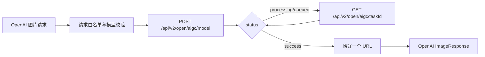

# 图片服务合同与异步 Provider 适配架构

## 1. 范围与边界

NEWAPI 原生图片入口 `/v1/images/generations` 与 `/v1/images/edits` 以上游 DTO、渠道选择、计费和
错误语义为权威。Seedance Link 的视频与素材边界由[Seedance 专用渠道与 Link 架构](Seedance专用渠道与Link架构.md)
定义，不在图片入口中推断或复用。

图片渠道分为两类：

- 原生同步渠道：Provider 在一次请求中返回完整图片，直接走普通图片生命周期；
- 兼容子集渠道：Provider 内部是异步任务，但 adaptor 在同一 HTTP 请求内创建并轮询，客户仍只看
  OpenAI 图片 `200` 响应。FunCloud 中转异步图片渠道属于此类。

这两类都不得建立第二套客户任务查询、幂等账本或图片专用 Task 状态机。

## 2. 客户合同

所有普通图片渠道使用 `POST /v1/images/generations` 或 `POST /v1/images/edits`。具体渠道可以声明
兼容子集，但必须在代码中明确拒绝不支持字段，不得静默删除、钳制或改义。

FunCloud 异步图片渠道的公开约束为：

- `n` 固定为 `1`，`response_format` 只能为 `url`；
- 参考图只接受 `extra_fields.reference_images` 中的 HTTP(S) URL 数组；网关只校验数量、scheme
  和 URL 长度，不远程下载或探测文件大小；
- `callbackUrl`、Base64 和其它 Provider 私有字段明确返回 `400`；
- 一次请求内完成创建、轮询和结果投影，成功必须恰好返回一个 URL。

## 3. 渠道与 adaptor

普通渠道通过 `ChannelType`、`APIType`、endpoint 类型和 `relay/channel/<name>/` adaptor 注册。
管理员只配置客户模型、`model_mapping`、API Key、Base URL 和价格；Provider 模型、请求字段、状态
和错误映射由代码登记。

FunCloud adaptor 的南向流程为：

轮询节奏为前 30 秒每 3 秒、之后每 5 秒；总体等待使用已有 `RELAY_TIMEOUT`，部署值为 `0` 时不得
上线此渠道。Provider task ID 不写入客户响应、Task 表或持久化任务状态。

## 4. 超时、取消与计费

该兼容子集复用当前 `gpt-image-2` 普通同步图片生命周期：

- 预扣和普通同步结算由现有图片链路负责；
- `RELAY_TIMEOUT` 或客户端 context 取消时，请求失败并按同步图片失败/退款路径处理；
- 不自动重发、换渠道或把未知结果伪装成成功；
- 不新增 durable `TaskCreateAttempt`、客户幂等 claim、内部对账状态机或 Provider exposure 账本。

这不是通用异步任务规则。若未来 Provider 在超时后仍可能扣费且无法由同步失败语义覆盖，必须停止
使用该兼容子集，另行评审 durable Task/attempt 合同。

## 5. Link 资源边界

Seedance `asset://<opaque-id>` 只由视频 adapter 原样转交 Provider；图片 adaptor 不查询、不下载、
不迁移、不验证和不持久化素材引用。图片模型不得根据名称、价格或请求字段获得 Link 履约资格。

## 6. 不变量

1. 客户模型、Channel、Provider 模型和代码 adaptor 身份分离；`model_mapping` 只做精确转换。
2. 不支持字段显式失败；Provider 原始响应、凭据和完整敏感 URL 不进入客户日志或响应。
3. FunCloud 结果为空、多于一个、非法 JSON、未知状态或未知错误码均失败关闭且跳过重试。
4. 图片兼容子集不创建本地 Task，不提供 `/v1/images/tasks/:task_id`。
5. 视频/Seedance 的 durable Task、attempt、冻结快照与计费状态机继续按其专题架构执行。

## 7. 相关文档

- [Seedance 专用渠道与 Link 架构](Seedance专用渠道与Link架构.md)
- [异步任务与计费事实架构](异步任务与计费事实架构.md)
- [架构概览](架构概览.md)
- [ADR-0008](decisions/0008-共享异步任务计费状态机与原子补偿.md)
- [ADR-0016](decisions/0016-Seedance专用渠道与确定性素材代理.md)
