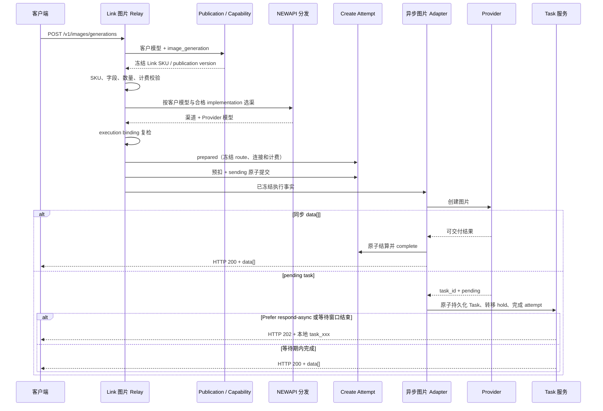

# Link 图片服务合同与异步任务架构

## 1. 目的与范围

本文定义统一图片入口下 NEWAPI 原生透传与 Link 南向适配的边界，并描述非标准同步图片、Chat 图片和
异步媒体任务上游如何完整履行同一北向图片承诺。重点回答：

- 什么条件下图片上游属于 NEWAPI 原生透传，什么条件下必须注册 Link implementation；
- 北向统一使用 `/v1/images/generations` 时，南向如何适配标准图片、私有图片、Chat 和异步任务协议；
- 渠道类型、Link SKU capability、implementation、Advanced Custom route 和 `model_mapping` 分别负责什么；
- 何时必须在 Provider POST 前建立 durable create attempt，何时不进入共享 Task；
- 如何避免重复创建、重复计费、结果超发、静默改义和敏感信息落库。

本文不扩展标准 multipart `/v1/images/edits`，也不改变 `gpt-image-2` 等既有 NEWAPI 原生图片模型的
路由、DTO、Relay、Provider adapter 和计费语义。

## 2. 北向统一承诺与原生边界

### 2.1 客户入口

客户生成图片统一调用：

```text
POST /v1/images/generations
```

可能异步完成的 Link 图片实现还提供：

```text
GET /v1/images/tasks/:task_id
```

统一北向入口不表示所有图片请求都属于 Link。请求使用没有 Link publication 的普通客户模型时，继续
进入 NEWAPI 原生图片链路；只有客户模型已经显式发布为 Link 图片 SKU 时，才进入 capability、候选
资格、execution binding、适配器和任务合同门禁。

### 2.2 完整标准兼容

只有同时满足以下条件的上游，才可以视为 `/v1/images/generations` 标准兼容并直接透传：

1. 接受北向公开 DTO 中已承诺的字段，且字段名称、类型、缺省值和显式零值语义一致；
2. `model`、`prompt`、`size`、`n`、`response_format` 和已开放参考图等字段不会被静默删除、钳制或改义；
3. 同步成功直接返回可按 NEWAPI 原生图片语义处理的 `data[]`；
4. 不返回 Provider 私有任务信封，也不要求平台轮询另一套创建结果；
5. 错误状态、错误外壳和结果数量能够按原生图片链路安全交付；
6. 计费所需的请求数量与实际交付结果可由原生链路可靠确定。

路径相同不是完整兼容的充分条件。上游即使也暴露 `/v1/images/generations`，只要返回 HTTP 200/202
任务信封、使用私有字段、需要结果重组或改变客户字段语义，仍属于 Link 南向适配。

### 2.3 原生透传不进入 Link

完整兼容标准图片协议的上游继续使用 NEWAPI 原生能力：

```text
客户 /v1/images/generations
  -> NEWAPI 原生图片 DTO / Relay / 计费
  -> 标准兼容图片上游
  -> 标准 data[]
```

该分支不创建 Link SKU、`LinkModelPublication`、Link implementation 身份或 Link Task 快照，也不因
Provider 名称、渠道类型、模型映射、价格或 Advanced Custom route 被推断为 Link。

如果上游只支持标准图片入口，而不支持 Chat、Responses、Embeddings 等其它 OpenAI 路径，可以使用
普通 Advanced Custom 渠道和 `converter=none` 做端点级候选隔离；这仍是原生图片透传，不是 Link。

## 3. Link 图片的进入条件

### 3.1 必须进入 Link 的南向形状

以下任一情况需要显式注册 Link SKU capability、Link implementation 和 execution binding：

- 上游使用私有同步图片路径或私有请求/响应结构；
- 上游通过 `/v1/chat/completions` 或其它非图片协议生成图片；
- 上游虽然使用 `/v1/images/generations`，但返回同步与异步联合任务信封；
- 上游需要字段转换、图片结果提取、状态归一、轮询、取消或 Provider 私有鉴权；
- 上游只能履行北向图片合同的受控子集，需要稳定值域、显式拒绝和失败关闭；
- 多个 Provider 要作为同一客户图片能力的等价候选，必须证明其完整覆盖相同语义。

Link 不是因为“第三方 Provider”或“路径不同”而自动产生。只有代码显式注册并获准发布的本地扩展才
属于 Link；已有 NEWAPI 原生图片能力不得被包装成平行 Link 合同。

### 3.2 一个能力合同可以有多个南向实现

Link SKU capability 定义客户可观察的字段、值域、结果、资源、生命周期和计费维度。Provider 路径、
模型、converter、鉴权、轮询与结果提取属于 Link implementation。不得为每个 Provider 自动创建一份
客户能力合同：

```text
一个客户图片能力 SKU
  ├── 私有同步图片 implementation
  ├── Chat 图片 implementation
  └── 异步媒体任务 implementation
```

只有完整覆盖同一 capability 的实现才能履约同一 SKU；无法证明等价时必须拆分 SKU 或保持未发布，
不得在运行时取交集后静默缩小客户能力。SKU 名称应描述稳定客户能力，不应依赖当前 Provider 名称。

### 3.3 当前注册与待核验边界

当前代码已经注册以下图片相关实现事实：

| implementation | 当前南向形状 | 当前代码绑定 SKU | 架构归类 |
| --- | --- | --- | --- |
| `moxing.images.media-task/v1` | 标准或媒体任务路径，`media_task_image_blocking` | `seedream-5-moxing`、`nano-banana-2` | 非标准同步/异步联合语义，属于 Link |
| `qihang.images.openai-compatible/v1` | `/v1/images/generations`，`converter=none` | `seedream-5-qihang` | 必须先完成标准兼容性核验；完整兼容时应回归普通透传，不应仅因现有注册继续作为 Link |

当前代码存在注册不等于生产发布。Qihang 是否保留 Link 身份必须以真实请求字段、响应、错误、结果数量
和计费语义核验为准；仅有相同路径和 `converter=none` 不能单独证明完整兼容，也不能单独证明需要 Link。
当前能力清理完成前，不得把 Provider 命名的 SKU 描述为长期、Provider 中立的客户合同。

## 4. 身份、配置与事实所有权

### 4.1 四种身份

| 身份 | 负责 | 不负责 |
| --- | --- | --- |
| 客户模型名 | 模型发现、Token 权限、价格、Ability、日志和响应 | 不证明 Link SKU 或 Provider 实现 |
| Link SKU | 客户能力、值域、资源、生命周期和实现等价 | 不保存路径、凭据、权重或 Provider 名称 |
| Link implementation | 南向协议、路径、converter、adapter、任务和鉴权形状 | 不定义客户价格或模型别名 |
| Provider 模型 | 上游实际模型参数 | 不承担客户合同身份 |

客户模型通过持久化 publication 稳定绑定 Link SKU：

```text
(link, image_generation, customer_model)
  -> Link SKU + publication version
```

渠道 `model_mapping` 只负责：

```text
customer_model -> provider_model
```

execution binding 再在精确 implementation、route family、action、profile 和 Provider 模型内证明该执行
形状仍履行已发布 SKU。Channel、Ability、模型映射、价格和 route 均不得反向创建 Link 身份。

### 4.2 Advanced Custom route

Advanced Custom route 是南向运行投影，负责：

- 哪个北向路径可以命中该渠道；
- 哪些客户模型命中该 route；
- 上游路径、converter 和鉴权模板。

普通 Advanced Custom 渠道可以由管理员维护 route。选择 Link 接入方案后，route 中受 implementation
管理的路径、converter、鉴权和客户模型范围必须由注册事实自动投影并锁定；管理员只填写客户模型、
`model_mapping`、凭据、Base URL、分组、权重和状态。Link route 不能成为第二套手工配置权威。

后端保存边界必须重新计算或严格核对该投影，不能只依赖前端填充；清除 Link 方案时才恢复普通渠道
配置。数据面可以读取持久化投影，以避免把 Link 推导逻辑侵入 NEWAPI 原生热路径。

## 5. 渠道类型选择

渠道类型描述南向运输与适配方式，不定义客户产品或 Link SKU。选择顺序如下：

| 上游能力 | 渠道类型 | 南向处理 | Link |
| --- | --- | --- | --- |
| 完整支持 OpenAI 多类接口 | NEWAPI 原生 OpenAI-compatible 类型 | 原生 adapter | 否 |
| 只完整支持标准图片入口 | 普通 Advanced Custom | `converter=none`，只登记图片 route | 否 |
| 私有同步 JSON 图片接口 | Advanced Custom + Link 接入方案 | 专用同步 converter | 是 |
| 通过 Chat 生成图片 | Advanced Custom + Link 接入方案 | image-to-chat 请求与响应转换 | 是 |
| HTTP 200/202 媒体任务协议 | Advanced Custom + Link 接入方案 | media-task converter + Task | 是 |
| 特殊签名、SDK、素材绑定或复杂状态机 | 专属 Provider 渠道类型 + Link 接入方案 | 专属 adapter | 是 |

同一 Provider 同时提供普通 Chat 与 Link 图片时，优先使用独立渠道实例隔离普通 Ability 和 Link
publication；确需共用渠道时，必须有端点级 route、模型范围和 Link 候选过滤证明确保两类语义不混用。

## 6. 总体数据流

```mermaid
flowchart LR
    Client[图片客户端]
    Router["POST /v1/images/generations"]
    Publication{存在 Link publication?}
    Native[NEWAPI 原生图片 Relay]
    Standard[标准兼容图片上游]
    Capability[Link SKU capability]
    Dist[NEWAPI 分发与 Link 候选约束]
    Binding[Execution binding 复检]
    Adapter[Link 南向 adapter]
    Sync[私有同步图片或 Chat 上游]
    Attempt[Create Attempt / Billing Hold]
    Async[异步媒体任务上游]
    Task[(共享 Task)]
    Poller[补偿与轮询]

    Client --> Router --> Publication
    Publication -->|否| Native --> Standard --> Client
    Publication -->|是| Capability --> Dist --> Binding --> Adapter
    Adapter -->|确定同步| Sync --> Adapter --> Client
    Adapter -->|可能异步| Attempt --> Async
    Async -->|同步 data[]| Adapter --> Client
    Async -->|可信 task_id| Task --> Poller --> Async
    Poller --> Task
```

Link 不替代 NEWAPI 的分组、优先级、权重、Affinity 和重试算法。Link 只提供 publication、capability、
实现资格和发送前复检；零合格候选必须失败关闭，不能降级到普通 NEWAPI 候选或另一 SKU。

## 7. 原生标准图片链路

```text
客户请求
  -> 没有 Link publication
  -> NEWAPI 原生请求校验
  -> 按客户模型和 Ability 选渠
  -> model_mapping 得到 Provider 模型
  -> 标准兼容图片上游
  -> 原生图片响应与计费
```

普通标准图片请求不因客户模型名称恰好类似 Link SKU、渠道使用 Advanced Custom 或 Provider 价格存在而
进入 Link。直接使用已注册的内部 Link SKU 且没有 publication 的请求仍失败关闭，避免绕过客户模型
发布事实；普通未注册模型继续保留原生行为。

## 8. Link 同步协议转换

### 8.1 私有同步图片协议

私有同步图片 implementation 必须把北向字段显式转换为 Provider 字段，并把 Provider 结果归一为
NEWAPI 图片 `data[]`。合同外字段必须在发送前拒绝，不能由 converter 静默删除。Provider 返回的图片
数量、格式或 URL 不满足已发布 capability 时，必须返回合同错误并按冻结计费事实处理。

### 8.2 Chat 图片协议

当 Provider 只通过 `/v1/chat/completions` 生成图片时，客户仍调用 `/v1/images/generations`。该链路是
协议转换，不是透传：

```text
ImageRequest
  -> Chat messages / Provider 私有字段
  -> POST /v1/chat/completions
  -> choices / content / tool result
  -> OpenAI Images data[]
```

implementation 必须明确：

- prompt、参考图、尺寸、数量和响应格式如何转换；
- 文本与图片混合结果、tool call、finish reason 和内容审核如何解释；
- 图片 URL、Base64 或 Provider 文件引用如何转为北向结果；
- usage、结果数量和计费如何冻结并核对。

无法准确履行的字段必须在 SKU capability 中缩小并显式拒绝，或保持实现未发布；不得让客户改用 Chat
协议才能获得图片，也不得把 `choices[]` 直接暴露为图片响应。

### 8.3 同步 Link 是否建立 attempt

Link 身份本身不自动要求 durable create attempt。确定同步且没有共享 Task 生命周期的 implementation
应使用其注册的同步 task contract；只有可能返回持久化任务、创建结果需要耐久恢复或合同明确要求的
Provider POST 才进入下一节的 attempt 链路。

## 9. Link 异步创建与响应



上游 HTTP 状态不是唯一判断依据。HTTP 200 中包含 `queued/running` 和 `task_id` 时仍是异步任务；
HTTP 200 中包含可信、符合 capability 的 `data[]` 时可以同步完成。

attempt 只作用于已选中且注册为潜在异步或需要耐久恢复的 route，并且必须在 Provider POST 发送任何
请求字节前建立。`prepared` 先于预扣；预扣、hold 与 `sending` 原子提交后才能发送。陈旧 `sending`
进入 `unknown`，由共享任务补偿调度器扫描，不自动重发、换渠道或退款。

## 10. Task 数据合同

图片异步任务复用共享 `tasks` 表，并通过以下事实隔离：

```text
platform = media_image
client_protocol = openai_images
action = image_generation
private_data.media_image != nil
```

创建时冻结：

- 本地与上游任务 ID；
- 合同命名空间、`image_generation` 路由族、客户模型、Link SKU 和 publication version；
- implementation ID/version/content hash 与 Provider 模型；
- 创建和最后轮询请求 ID；
- 查询 Base URL、implementation 注册的查询模板、鉴权模板和代理；
- 创建时实际单个 API Key；
- 客户模型、Provider 模型、请求图片数量和响应格式；
- 模型价格、分组倍率、附加倍率和计费来源；
- 可选表达式快照与最小计费探针。

不得持久化：

- prompt；
- 参考图、原图或 Base64；
- 完整请求或上游响应；
- 客户端 Authorization/Cookie；
- 无关 Provider 私有字段。

查询路径、鉴权、状态字段和结果提取方式属于不可变 implementation 与 Task 快照。当前 Moxing 媒体
任务使用 `/v1/media/tasks/{task_id}`，但该路径不是所有 Link 图片 implementation 的全局合同。

## 11. 轮询与状态

上游状态按 implementation 注册的解析规则归一为：

```text
queued
running / in_progress / processing
succeeded / success / completed
failed / failure / cancelled / expired
unknown
```

公开状态投影为：

```text
queued
in_progress
completed
failed
unknown
```

内部 `RECONCILIATION_REQUIRED` 对外投影为 `unknown`，不是失败终态。

`PROVIDER_CONTRACT_FAILURE` 是平台内部额外终态，不是伪造的上游状态；客户端投影为 `failed`，并返回
`error.code=provider_contract_failure`。

轮询规则：

- 查询 URL 只由冻结 Base URL、implementation 查询模板和转义后的任务 ID 构造；
- 除非注册合同明确允许并完成安全验证，不接受上游临时返回的绝对 `poll_url`；
- 响应体必须有固定上限；当前媒体任务实现上限为 1 MiB；
- 返回任务 ID 与冻结 ID 不一致时进入 `reconciliation_required`；
- 成功必须包含符合北向 capability 的可信图片结果；
- 无效 JSON、未知状态、成功结果暂缺或结果不可采信时进入 `reconciliation_required`，保持计费 pending
  并有界重试，不解释为成功或立即退款；
- 去重后结果数确定超过请求 `n` 时，进入内部 `PROVIDER_CONTRACT_FAILURE`，对外投影为
  `failed/provider_contract_failure`，按零目标退款并记录潜在 Provider cost exposure；
- 对账超过任务 SLA 时进入 `expired`，退款并记录 `upstream_outcome_unresolved`。

请求内等待和后台轮询可能发生只读 GET 竞争，但终态状态条件更新和计费状态机保证只结算或退款一次。

## 12. 幂等与责任转移

### 12.1 异步任务

取得可信上游任务 ID 并完成本地持久化后：

```text
请求链路不再退款
Task 独占终态结算或退款
```

同一 `Idempotency-Key` 与相同请求可以恢复已有异步任务；相同 Key 但请求不同返回冲突。取得任务 ID
后禁止换渠道重新 POST。

未提供 Key 时，每个 HTTP POST 都是新的业务尝试。内部 attempt 仍保护资金与恢复事实，但客户端收到
`create_outcome_unknown` 后重新提交可能生成第二组图片。错误响应必须携带平台 `request_id`：原请求有
Key 时只提示使用同一 Key；原请求无 Key 时提示不要自动重试，事后新增 Key 不能恢复原 attempt。

### 12.2 潜在异步 route 的同步完成

潜在异步 route 同步返回 HTTP 200 时不创建长期 Task，也不持久化结果用于回放；完成计费后关闭 create
attempt，并把可选 claim 保留为 `completed_no_replay`。若原响应丢失，同键重放返回稳定、不可重试的
`409 idempotency_result_unavailable`，只证明原操作已完成且不会再次 POST。

创建结果未知且无法确认上游是否接受时进入耐久 `unknown`，由共享任务补偿调度器有界扫描；到客户资金
占用期限仍无法恢复时释放 hold 并进入 `released_with_exposure`，不在日后静默补扣客户。

普通原生同步图片和不使用 durable attempt 的同步 Link implementation 不继承上述
`completed_no_replay` 合同，继续遵守各自注册的同步幂等与计费语义。

## 13. 计费与资金闭环

### 13.1 固定价格

固定 `ModelPrice` 以客户模型名为价格键；客户模型恰好等于 Link SKU 只是合法特例。预扣按请求数量，
成功后按实际交付数量结算：

```text
target quota = 单张价格 × 实际成功图片数 × 分组倍率
```

结果数不得超过请求 `n`；可信终态超发进入内部 `PROVIDER_CONTRACT_FAILURE`，按零目标退款并记录
exposure，不向用户补扣未请求图片。资金操作成功后 `billing_state=settled`；资金写入失败时为 `failed`
并重试，不能把 billing `failed` 误解为 Provider 业务失败。

### 13.2 usage 表达式

启用 `tiered_expr` 前必须有：

- 可信终态 usage 字段语义；
- 管理员配置的安全预扣 Token 上界；
- 真实 Provider 账单核验；
- 目标尺寸、图片输入和多结果样本。

终态 usage 可以由 implementation 归一为已支持的 OpenAI 或 Gemini 组件语义。usage 缺失或无效时保持
安全预扣上界，不根据尺寸或图片数量臆测 Token。精确结算使用创建时冻结的表达式快照和计费探针。

### 13.3 生命周期

`media_image` 的有效生命周期具有 30 分钟保护下限；生产配置应覆盖上游 P99/SLA。失败、取消、过期和
生命周期超时进入共享退款/补偿状态机。

## 14. 错误、安全与审计

- 不支持字段在上游调用前返回 400；不得静默删除、钳制、降级或改义。
- 上游错误经过脱敏，不返回渠道 ID、Provider 模型、Base URL、任务 ID 或凭证。
- 任务查询只允许资源所有者或管理员，且必须匹配 `client_protocol=openai_images`。
- 普通响应不包含 `private_data`、`billing_state` 或上游请求。
- 管理审计关联客户模型、Link SKU、publication version、implementation、渠道、Provider 模型、
  attempt、Task、计费和 exposure。
- 管理审计保留 hold 金额/年龄、对账截止时间、`released_with_exposure`、
  `provider_contract_failure` 和 `upstream_outcome_unresolved`。
- 创建后本地持久化失败、任务生命周期退款后晚成功、usage 与账单不一致均属于人工对账红色窗口。

## 15. 架构不变量

1. 客户统一调用 `/v1/images/generations`；Provider 私有路径、Chat 协议和任务协议不泄漏到北向。
2. 完整标准兼容的图片上游走 NEWAPI 原生透传，不创建平行 Link 合同。
3. 路径相同不等于标准兼容；任何字段、响应、错误或生命周期转换都必须显式注册 Link implementation。
4. Link SKU 描述稳定客户能力，implementation 描述 Provider 履约方式；不得按 Provider 自动创建 SKU。
5. 普通 Advanced Custom route 可以手工配置；Link route 必须由 implementation 自动投影并锁定。
6. 渠道类型描述南向执行方式，不创建客户合同或 Link 身份。
7. 同一 SKU 的所有实现必须完整等价；不完整、未知或资格耗尽时失败关闭。
8. 同步和异步可以投影为同一北向图片合同，但异步任务复用共享 Task，不建立第二套任务系统。
9. 只有可能返回持久化 Task 或需要耐久恢复的 Provider POST 才强制建立 create attempt。
10. Task 持久化后，只有 Task 可以完成终态资金操作。
11. 上游结果数不得超过请求 `n`，用户控制数量先经过统一上限。
12. 任务快照不保存 prompt、参考图内容、完整上游响应或客户凭据。
13. 所有终态和资金更新保持幂等，并兼容 SQLite、MySQL 和 PostgreSQL。
14. 客户模型 publication 是 Link SKU 的权威；当前候选与 Provider 模型只决定履约资格。
15. 客户价格与响应使用客户模型名；capability、实现等价和内部审计使用 Link SKU。

## 16. 相关文档

- [Link 服务合同概念与协作关系](Link服务合同概念与协作关系.md)
- [Link 服务合同注册与履约架构](Link服务合同注册与履约架构.md)
- [异步任务与计费事实架构](异步任务与计费事实架构.md)
- [ADR-0008：共享异步任务计费状态机与原子补偿](decisions/0008-共享异步任务计费状态机与原子补偿.md)
- [ADR-0011：异步创建未知与轮询合同违例对账](decisions/0011-异步创建未知与轮询合同违例对账.md)
- [图片模型 API 用户调用指南](../30-engineering/图片模型API用户调用指南.md)
- [03 图片渠道与异步任务运维手册](../40-operations/03-图片渠道与异步任务运维手册.md)
