# Link 图片服务合同与异步任务架构

## 1. 目的与范围

本文描述统一图片接口如何承接同步和异步上游，并复用共享 Task、幂等和计费补偿能力。重点回答：

- 三个公开图片 SKU 如何保持同一组 Link 合同字段；
- Moxing、Qihang 和媒体任务协议如何在 Provider 隔离；
- HTTP 200 与 HTTP 202 如何进入同一客户接入合同；
- 何时把计费责任从请求链路转交给 Task；
- 如何避免重复创建、重复计费、结果超发和敏感信息落库。

本文不扩展标准 multipart `/v1/images/edits`，也不改变 `gpt-image-2` 等既有 OpenAI 图片模型的同步路径。

## 2. 当前实现状态

当前代码已实现：

- `POST /v1/images/generations` 统一入口；
- `seedream-5-moxing`、`seedream-5-qihang`、`nano-banana-2` 的公共字段合同测试；
- Advanced Custom `media_task_image_blocking`；
- HTTP 200 图片、HTTP 200 queued 信封和 HTTP 202 任务信封识别；
- 共享 `Task` 持久化、后台轮询、终态 CAS、退款和补偿；
- `GET /v1/images/tasks/:task_id` 所有权查询；
- 图片任务创建幂等与同步图片隔离；
- Provider POST 前的 `TaskCreateAttempt`、资金 hold、`sending/unknown` 对账和人工恢复；
- 轮询合同违例 `RECONCILIATION_REQUIRED`、确定性 `PROVIDER_CONTRACT_FAILURE` 与 exposure；
- 固定按张结算和可选 usage 表达式结算；
- 客户模型名通过持久化 publication 绑定 Link 图片 SKU；Advanced Custom 渠道使用既有
  `model_mapping` 得到 Provider 模型，再由所选 Link 接入方案的 image execution binding 复检；
- publication、客户模型、Link SKU、Provider 模型和 implementation 身份进入 create attempt 与异步
  Task 快照，直接使用内部 Link SKU 而没有 publication 的请求失败关闭。

生产发布仍受 ability、分组、价格和真实验收控制。`doubao-seedream-4-5-251128` 只有适配器能力，不属于当前公开 SKU；`gpt-image-2` 被明确排除在媒体图片 Task 路径外。

以上边界已经在图片 relay、共享 task attempt 和 polling service 中接线。代码存在不等于生产
已发布；真实渠道、价格、usage 和错误语义仍需按分组与 Provider 验收。

## 3. 客户模型发布与 Link 图片合同

### 3.1 路径与公开 SKU

```text
POST /v1/images/generations
GET  /v1/images/tasks/:task_id
```

客户请求中的 `model` 是可自定义的客户模型名。系统按
`(link, image_generation, customer_model)` 读取 publication 后取得下表 Link SKU；Link SKU 是稳定
能力合同，不要求客户直接使用该字符串。客户模型继续用于模型发现、Token 权限、价格、Ability、日志
和响应。

| 公开 SKU | 公开能力 | 渠道实现 |
| --- | --- | --- |
| `seedream-5-moxing` | 文生图、URL 参考图 | 映射为 `seedream-5-0-260128`，同步或媒体任务 |
| `seedream-5-qihang` | 文生图、URL 参考图 | 映射为 `seedream-5`，`converter=none`，当前同步 |
| `nano-banana-2` | 文生图、URL 参考图 | 映射为 Gemini usage 模型，媒体任务 |

三个 SKU 共同使用：

```text
model
prompt
image
size
n
response_format
stream
```

`image` 是 NEWAPI 统一图片合同中的 URL 参考图字段。Moxing Nano 所需的 `reference_images` 只在 converter 出站时生成；新客户端不得使用该 Provider 字段。

### 3.2 能力和值域

统一字段只保证同名同义，不保证所有模型值域相同：

| SKU | `size` | URL 参考图 | 当前关键限制 |
| --- | --- | --- | --- |
| `seedream-5-moxing` | `2K`、`3K` | 最多 14 个 HTTP(S) URL | `n=1`、`response_format=url`、不支持 stream |
| `seedream-5-qihang` | `2K` | 最多 2 个 HTTP(S) URL | `n=1`、当前同步实现、不支持 stream |
| `nano-banana-2` | `1K`、`2K`、`4K` | 最多 10 个 HTTP(S) URL | `n=1`、受控 `aspect_ratio`、不支持 stream |

当前三个 capability 的 `MaxOutputImages=1`、`supports_link_assets=false`。平台先执行
`dto.MaxImageN` 全局数量上限，再应用模型更严格的数量、尺寸和字段规则。合同外字段、
`asset://`、冲突的参考图字段和不支持的显式值返回 400，不静默删除。

## 4. 组件与职责

```mermaid
flowchart LR
    Client[图片客户端]
    Router["POST /v1/images/generations"]
    Publication[客户模型 publication 与 SKU capability]
    Dist[模型与渠道分发]
    Binding[Execution binding 复检]
    Attempt[发送前 Create Attempt / Billing Hold]
    Adapter[Advanced Custom 适配器]
    Provider[图片上游]
    Task[(共享 Task)]
    Poller[图片任务轮询]
    Billing[计费与补偿]
    Query["GET /v1/images/tasks/:id"]

    Client --> Router --> Publication --> Dist --> Binding --> Attempt --> Adapter --> Provider
    Adapter -->|同步 data[]| Client
    Adapter -->|任务信封 + hold 转移| Task
    Task --> Poller --> Provider
    Poller --> Task
    Poller --> Billing
    Query --> Task
    Client --> Query
```

| 组件 | 负责 | 不负责 |
| --- | --- | --- |
| 图片 Router/Controller | 客户端认证、publication 冻结、SKU 校验、分发和响应 | 不解析 Provider 私有任务 |
| 图片 DTO 与 converter | 公共字段校验、模型专有值域和 Provider 转换 | 不决定价格或渠道权重 |
| Link publication / implementation | 稳定绑定客户模型与 SKU，过滤等价实现并在发送前复检 Provider 模型 | 不替代 NEWAPI 选渠或 `model_mapping` |
| Create Attempt | 在潜在异步 POST 前冻结执行/计费事实，承接同步完成、Task 转移和 unknown | 不保存 prompt、参考图或完整响应 |
| `media_task_image_blocking` | 同步响应、任务信封、创建结果和等待窗口 | 不维护第二套任务表 |
| Task 服务 | 持久化、轮询、CAS、终态和公开投影 | 不保存 prompt 或参考图内容 |
| 计费服务 | 预扣、按实际结果或 usage 结算、退款和补偿 | 不由上游路径决定售价 |
| 查询 Controller | 用户所有权和 `openai_images` 协议隔离 | 不暴露上游任务或凭证 |

## 5. 创建与响应链路

```mermaid
sequenceDiagram
    participant C as 客户端
    participant R as Relay
    participant P as Publication
    participant D as NEWAPI 分发
    participant J as Create Attempt
    participant A as 图片适配器
    participant U as Provider
    participant T as Task 服务

    C->>R: POST /v1/images/generations
    R->>P: 客户模型 + image_generation
    P-->>R: 冻结 Link SKU / publication version
    R->>R: SKU、字段、数量、计费校验
    R->>D: 按客户模型正常选渠
    D-->>R: 渠道 + Provider 模型
    R->>R: execution binding 复检冻结 SKU
    R->>A: 已选渠道、映射模型、请求
    R->>J: prepared（冻结 route、连接和计费）
    R->>J: 预扣 + sending 原子提交
    A->>U: 创建图片
    alt HTTP 200 + data[]
        U-->>A: 同步结果
        A->>J: 原子结算并 complete
        A-->>R: OpenAI 图片响应
        R-->>C: HTTP 200
    else HTTP 200/202 + pending task
        U-->>A: task_id + pending
        A->>T: 原子持久化 Task、转移 hold、完成 attempt
        alt Prefer respond-async 或等待窗口结束
            T-->>C: HTTP 202 + 本地 task_xxx
        else 等待期内完成
            T-->>C: HTTP 200 + data[]
        end
    end
```



上游 HTTP 状态不是唯一判断依据。HTTP 200 中包含 `queued/running` 和 `task_id` 时仍是异步任务；HTTP 200 中包含 `data[]` 时保持同步图片合同。

attempt 只在分发已经确定当前 route 具有持久化媒体任务能力后建立，但必须早于 POST，因为直到
响应到达前无法知道本次结果是同步还是异步。`prepared` 先于预扣；预扣、hold 与 `sending`
原子提交后才能发送任何请求字节。陈旧 `sending` 进入 `unknown`，由共享任务补偿调度器扫描，
不自动重发或退款。

## 6. Task 数据合同

图片任务复用共享 `tasks` 表，并通过以下事实隔离：

```text
platform = media_image
client_protocol = openai_images
action = image_generation
private_data.media_image != nil
```

创建时冻结：

- 本地与上游任务 ID；
- 合同命名空间、`image_generation` 路由族、客户模型、Link SKU 和 publication version；
- implementation ID/version/content hash 与 Provider 模型；
- 创建和最后轮询请求 ID；
- 查询 Base URL、固定查询模板和代理；
- 创建时实际单个 API Key及鉴权模板；
- 客户模型、Provider 模型和请求图片数量；
- 响应格式；
- 模型价格、分组倍率、附加倍率和计费来源；
- 可选表达式快照与最小计费探针。

不得持久化：

- prompt；
- 参考图、原图或 Base64；
- 完整请求或上游响应；
- 客户端 Authorization/Cookie；
- 无关 Provider 私有字段。

## 7. 轮询与状态

上游状态归一化为：

```text
queued
running / in_progress / processing
succeeded / success / completed
failed / failure / cancelled / expired
unknown
```

公开状态投影为：

```text
queued
in_progress
completed
failed
unknown
```

内部 `RECONCILIATION_REQUIRED` 对外投影为 `unknown`，不是失败终态。

`PROVIDER_CONTRACT_FAILURE` 是平台内部额外终态，不是伪造的上游状态；客户端投影为
`failed`，并返回 `error.code=provider_contract_failure`。

轮询规则：

- 查询 URL 只由冻结 Base URL、固定 `/v1/media/tasks/{task_id}` 和转义后的任务 ID构造；
- 不接受上游返回的绝对 `poll_url`；
- 响应体上限为 1 MiB；
- 返回任务 ID与冻结 ID不一致时进入 `reconciliation_required`；
- 成功必须包含有效 HTTP(S) 结果 URL；
- 无效 JSON、未知状态、成功结果暂缺或结果 URL 不可采信时进入
  `reconciliation_required`，保持计费 pending 并有界重试，不解释为成功或立即退款；
- 去重后结果数确定超过请求 `n` 时，可信终态已经证明结果不可按公开合同交付，进入
  内部 `PROVIDER_CONTRACT_FAILURE`，对外投影为
  `failed/provider_contract_failure`，零目标退款并记录潜在上游成本 exposure；
- 对账超过任务 SLA 时进入 `expired`，退款并记录 `upstream_outcome_unresolved`。

请求内等待和后台轮询可能发生只读 GET竞争，但终态状态条件更新和计费状态机保证只结算或退款一次。

## 8. 幂等与责任转移

图片创建 attempt 只作用于已选中的 Advanced Custom 持久化媒体任务 route，且必须在渠道
分发之后、POST 之前建立。普通 OpenAI 图片和 `gpt-image-2` 不进入该 attempt 域。
`Idempotency-Key` claim 是 attempt 的可选客户端重放索引，不是 attempt 存在的前提。

### 8.1 异步任务

取得上游任务 ID并完成本地持久化后：

```text
请求链路不再退款
Task 独占终态结算或退款
```

同一 `Idempotency-Key` 与相同请求可以恢复已有异步任务；相同 Key 但请求不同返回冲突。
取得任务 ID 后禁止换渠道重新 POST。

未提供 Key 时，每个 HTTP POST 都是新的业务尝试。内部 attempt 仍保护资金与恢复事实，但
客户端收到 `create_outcome_unknown` 后重新提交可能生成第二组图片。错误响应必须携带平台
`request_id`：原请求有 Key 时只提示使用同一 Key；原请求无 Key 时提示不要自动重试，事后
新增 Key 不能恢复原 attempt。

### 8.2 同步图片

同步 HTTP 200 不创建长期 Task，也不持久化结果用于回放；完成计费后关闭 create attempt，并
把可选 claim 保留为 `completed_no_replay`。因此同步图片不提供结果 exactly-once 回放。若原
响应丢失，同键重放返回稳定、
不可重试的 `409 idempotency_result_unavailable`，只证明原操作已完成且不会再次 POST；
客户端不得无条件自动重试创建请求。

创建结果未知且无法确认上游是否接受时进入耐久 `unknown`，由共享任务补偿调度器有界扫描；
到客户资金占用期限仍无法恢复时释放 hold 并进入 `released_with_exposure`，不在日后静默
补扣客户。

## 9. 计费与资金闭环

### 9.1 固定价格

固定 `ModelPrice` 以客户模型名为价格键；客户模型恰好等于 Link SKU 只是合法特例。预扣按请求数量，
成功后按实际交付数量结算：

```text
target quota = 单张价格 × 实际成功图片数 × 分组倍率
```

结果数不得超过请求 `n`；可信终态超发进入内部 `PROVIDER_CONTRACT_FAILURE`，对外返回
`failed/provider_contract_failure`，并按冻结目标零退款，不向用户补扣未请求图片。资金操作
成功后 `billing_state=settled`；资金写入失败时为 `failed` 并重试，不能把 billing `failed`
误解为 Provider 业务失败。由于 Provider 可能已经完成并计费，该分支必须幂等记录独立
exposure，不能与上游明确失败混为同一指标。

### 9.2 usage 表达式

启用 `tiered_expr` 前必须有：

- 可信终态 usage 字段语义；
- 管理员配置的安全预扣 Token 上界；
- 真实上游账单核验；
- 目标尺寸、图片输入和多结果样本。

终态 usage 支持 OpenAI 与 Gemini 组件语义。usage 缺失或无效时保持安全预扣上界，不根据尺寸或图片数量臆测 Token。任何精确结算都使用冻结表达式快照和计费探针。

### 9.3 生命周期

`media_image` 的有效生命周期具有 30 分钟保护下限；生产配置应覆盖上游 P99/SLA，通常保持 `TASK_TIMEOUT_MINUTES=1440`。失败、取消、过期和生命周期超时进入共享退款/补偿状态机。

## 10. 错误、安全与审计

- 不支持字段在上游调用前返回 400。
- 上游错误经过脱敏，不返回渠道 ID、真实模型、Base URL、任务 ID 或凭证。
- 任务查询只允许资源所有者或管理员，且必须匹配 `client_protocol=openai_images`。
- 普通响应不包含 `private_data`、`billing_state` 或上游请求。
- 管理审计保留本地任务、脱敏上游任务/请求、轮询次数、等待时间、渠道和计费状态。
- 管理审计关联客户模型、Link SKU、publication version、implementation 和 Provider 模型。
- 管理审计还必须保留 attempt 状态、hold 金额/年龄、对账截止时间、
  `released_with_exposure`、`provider_contract_failure` 和 `upstream_outcome_unresolved`。
- 创建后本地持久化失败、任务生命周期退款后晚成功、usage 与账单不一致均属于人工对账红色窗口。

## 11. 架构不变量

1. 公开 SKU 使用统一图片路径和同义字段，Provider 差异不泄漏。
2. 同步和异步是同一客户端响应联合合同，不是两套产品 API。
3. 图片任务复用共享 Task，不建立第二套任务系统。
4. Task 持久化后，只有 Task 可以完成终态资金操作。
5. 上游结果数不超过请求 `n`，用户控制数量先经过统一上限。
6. `gpt-image-2` 与标准 multipart edits 不进入媒体图片 Task 路径。
7. 任务快照不保存 prompt、参考图内容或完整上游响应。
8. 所有终态和资金更新保持幂等，并兼容三种数据库。
9. 可能返回持久化 Task 的图片 route 在 POST 前建立 attempt；同步结果关闭 attempt，异步结果
   原子转入 Task。
10. 观测不可采信进入有界对账；可信但确定不可交付的结果进入内部
    `PROVIDER_CONTRACT_FAILURE`，按零目标结算并记录 exposure。
11. 对账扫描扩展共享任务补偿调度器，不新增图片专用进程。
12. 客户模型 publication 是 Link SKU 的权威；当前候选与 Provider 模型只用于履约资格和发送前复检。
13. 客户价格与响应保留客户模型名，capability、实现等价和内部审计使用 Link SKU。

## 12. 相关文档

- [Link 服务合同概念与协作关系](Link服务合同概念与协作关系.md)
- [Link 服务合同注册与履约架构](Link服务合同注册与履约架构.md)
- [异步任务与计费事实架构](异步任务与计费事实架构.md)
- [ADR-0008：共享异步任务计费状态机与原子补偿](decisions/0008-共享异步任务计费状态机与原子补偿.md)
- [ADR-0011：异步创建未知与轮询合同违例对账](decisions/0011-异步创建未知与轮询合同违例对账.md)
- [图片模型 API 用户调用指南](../30-engineering/图片模型API用户调用指南.md)
- [03 图片渠道与异步任务运维手册](../40-operations/03-图片渠道与异步任务运维手册.md)
