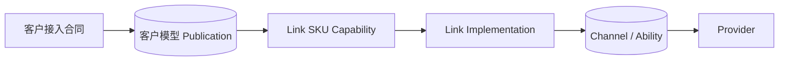
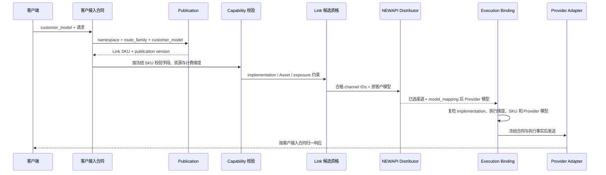

# Link 服务合同注册与履约架构

## 1. 目的与范围

本文描述 Link 服务合同如何在代码中注册、通过客户模型发布、由渠道实现履约，并在请求、Task、素材
与计费边界保持一致。概念定义与角色关系见
[Link 服务合同概念与协作关系](Link服务合同概念与协作关系.md)；本文只展开技术权威、控制流和失败
关闭规则。

Link 只覆盖经项目负责人确认、需要本地代码扩展并显式注册的能力。NEWAPI 原生 Chat、Responses、
Images、OpenAI Videos 等继续使用上游 Router、DTO、Relay、Ability、模型发现和计费语义，不因 Link
注册而被包装、复制、收紧或降级。

## 2. 架构目标

Link 履约链必须同时满足：

1. 客户可以继续使用任意客户模型名；
2. 客户模型一旦发布，其 Link SKU 不随当前渠道集合静默改变；
3. 一个 Link SKU 只有一份客户可见能力合同；
4. 多个 Provider 实现只有完整覆盖同一能力时才能作为等价候选；
5. NEWAPI 继续负责分组、优先级、权重、Affinity 和重试选渠；
6. Provider 路径、模型、协议与素材差异停留在上游调用合同内部；
7. Task、create attempt、Asset 和 Binding 冻结已经发生的合同与执行事实；
8. 候选、实现或快照不一致时在发送前失败关闭，不做兼容猜测。

代码存在不等于生产开放。模型发现、Ability、分组、价格、exposure 策略、Provider 真实验收和灰度
共同决定当前可用性；架构注册只证明系统具备受控发布与履约边界。

## 3. 五类权威事实



| 层次 | 权威标识 | 负责 | 不负责 |
| --- | --- | --- | --- |
| 客户接入合同 | `contract_id + version` | 路径、DTO、响应、错误和生命周期投影 | Provider 选择 |
| 客户模型发布 | namespace + route family + customer model + version | 客户模型稳定代表哪个 Link SKU | 当前渠道可用性 |
| Link SKU capability | SKU + capability version/hash | 字段、值域、媒体组合、资源和生命周期能力 | Provider 凭据、成本与权重 |
| Link implementation | implementation ID/version/content hash | 某 Provider 执行形状如何完整履行 SKU | 客户模型别名和客户价格 |
| 渠道实例 | channel ID + 当前配置 | 凭据、连接、模型映射、价格、分组、优先级和权重 | 重新定义合同与实现 |

### 3.1 客户接入合同与 SKU capability

`contract_id` 决定客户请求、响应、错误和任务操作的协议族。`VideoSKUCapability` 与
`ImageSKUCapability` 决定具体 Link SKU 的字段白名单、值域、默认值、媒体上限、Link 资源支持和
生命周期能力。

客户接入合同和 SKU capability 共同定义客户承诺，但客户不必直接使用 SKU 字符串。请求先通过
`LinkModelPublication` 将客户模型名解析为 Link SKU，再按该 SKU 的 capability 校验。

### 3.2 客户模型 publication

publication 的唯一逻辑键为：

```text
(contract_namespace, route_family, customer_model)
  -> link_sku + publication_version
```

当前默认命名空间是 `link`，当前路由族是 `image_generation`、`modelark_video`、`kling_video` 和
`jimeng_video`。publication 是主数据库事实，不由 Ability、Redis 或请求期候选派生。初始发布和每次
显式改绑都写不可变 audit。

### 3.3 Link implementation

每个实现以 `link_implementation_id + version + content_hash` 标识，并声明：

- 唯一 Provider 与渠道类型；
- 可履约的公开 SKU；
- execution bindings；
- 视频与素材 profile、converter、adapter 和路径；
- Link 资源解析模式、TTL、素材类型与数量；
- Task、计费和 exposure 接线要求。

implementation 是代码注册事实。Provider 名称、Base URL、Key 格式、模型后缀、profile 或
`model_mapping` 不能单独创建实现身份。

南向连接地址继续继承 NEWAPI 的原生 HTTP(S) 语义。Provider 官网描述的是客户直接调用 Provider
时的接入方式，不是本网关对 `Channel.base_url` 的合同权威；官网要求或推荐 HTTPS、当前官网只展示
HTTPS 地址、某次验收使用 HTTPS，均不能让 Link 为同一渠道地址建立第二套 scheme 白名单。Link
implementation 负责固定协议结构、路径、鉴权、转换和响应语义，不负责把 NEWAPI 已支持的 HTTP
连接收紧为 HTTPS-only。只有 mTLS、TLS 层身份或其它无法由 HTTP 承载的协议能力确属履约必要条件时，
才能由精确 adapter 以代码注册事实和回归测试显式限制；一般性的传输安全偏好属于部署与运维选择。

该继承规则只适用于管理员控制的 Provider 连接事实。客户提交的任意 URL、`AssetSource`、Provider
返回的内容地址以及平台代理回源仍是不可信输入，必须继续执行对应的结构校验、同源约束、SSRF、
重定向、TTL 和授权检查；这些安全边界不得通过“兼容 NEWAPI Base URL”反向放宽。

### 3.4 execution binding

execution binding 证明一个固定执行形状履行哪个 Link SKU：

```text
(implementation ID/version, route_family, action, profile, provider_model)
  -> Link SKU
```

所有维度在渠道发布时必须已固定并唯一解析。Provider 模型只是其中一个维度；相同模型出现在不同
route、action 或 profile 时不能合并推断。重复、缺失或歧义均拒绝保存或发布。

### 3.5 Channel 与 Ability

Channel 保存客户模型列表、`model_mapping`、凭据、连接、价格、分组和运行参数。Ability 继续以客户
模型名参与 NEWAPI 分发。它们只表示“当前存在一个可能履约的候选”，不能创建、删除或改变客户模型
publication。

## 4. Link 接入方案与发布控制面

### 4.1 Link 接入方案

管理端把精确 `LinkImplementation` 投影为“Link 接入方案”。管理员先选择方案，再配置客户模型和
既有 `model_mapping`。选择方案后，Provider、视频/素材 profile、解析模式、路径、adapter 与
execution binding 摘要由注册事实带出并锁定；系统不建立平行的接入方案表。

管理员唯一维护的模型翻译仍是：

```text
customer_model -> model_mapping -> provider_model
```

系统据此自动推导：

```text
provider_model + implementation execution shape -> Link SKU
```

管理端不提供第二张可编辑的“customer model -> Link SKU”映射。

新建 Link 视频渠道且 `models`、`model_mapping` 均为空时，管理端可以从当前 implementation 中
`action=create`、唯一 route、当前视频 profile 的 execution bindings 读取 `provider_model`，填入
既有 `Models` 编辑器作为未保存的可编辑默认值。该投影不创建 `model_mapping`、publication 或
Ability；无法唯一确定 route、编辑存量配置、切换或清除方案时，不得自动改写已有模型与 mapping。
图片方案不自动采用这一视频默认行为。

方案投影是响应式的：先选方案、后填写或修改 `models` / `model_mapping` 时，SKU 专属创建路径、
Advanced Custom routes 等受方案管理字段必须从同一注册事实重新计算；新方案未声明的字段必须清空，
不能残留上一方案的执行配置。route family 直接取唯一 execution binding，不按渠道类型维护第二份
前端映射。清除方案时恢复选择前的普通渠道配置；编辑已有方案且没有可恢复快照时回到普通渠道默认值。

### 4.2 保存与发布顺序

```text
选择 Link 接入方案
  -> 验证 implementation ID/version、渠道类型和 exposure 策略
  -> 沿 model_mapping 解析每个客户模型的 Provider 模型
  -> execution binding 唯一解析 Link SKU
  -> 验证 capability、路径、adapter 与素材能力完整覆盖
  -> 启用时原子创建或核对 LinkModelPublication
  -> 发布以客户模型名为键的 Ability
```

禁用渠道可以保存并完成结构校验，但不自动形成客户发布事实。启用渠道、启用 Ability 或批量更新时，
publication 核对与 Ability 变更处于同一事务边界，避免先暴露候选再发现合同冲突。

单渠道、批量和按标签的状态变更，以及新建、编辑、克隆、批量标签编辑等管理入口，都必须把当前
操作人传入同一事务。Channel 状态、Ability 可用性、初始 publication 与 audit 任一失败时整体回滚；
缓存只在提交成功后刷新。系统自动修复或后台同步可以使用操作人 `0`，人工管理操作不得降级为匿名
审计。

### 4.3 等价渠道与普通候选冲突

同一 publication 可以由多个渠道履约；这些渠道的 Provider、Provider 模型和上游调用合同可以不同，
但 execution binding 必须解析到同一 SKU，且 implementation 必须完整覆盖其 capability。

同一分组与 route family 中若存在同名普通 NEWAPI Ability，Link 发布失败关闭。系统不修改普通渠道
语义，也不把普通渠道强制解释成 Link 实现。禁用或删除最后一条 Link Ability 只令 publication 暂时
不可履约，不释放客户模型名。

### 4.4 显式改绑

普通保存不能把既有 publication 指向另一 SKU。改绑使用敏感写权限入口，必须提供：

- 完整 publication key；
- 新的已注册 Link SKU；
- `expected_version`；
- 有效操作人和非空原因。

事务锁定当前行，验证 SKU 支持目标 route family，以版本条件更新并追加 audit。版本竞争、相同 SKU、
未注册 SKU 或缺少原因均拒绝。

管理端只在当前发布 SKU 与方案推导 SKU 不一致时展示显式改绑动作。该动作需要渠道敏感写权限，确认
框固定展示客户模型、当前/目标 SKU 和 `expected_version`，并要求填写原因；普通保存仍不能隐式调用
改绑。无效 SKU 或参数返回 400，不存在的 publication 返回 404，版本竞争和并发改动返回 409。

## 5. 请求履约主链路



### 5.1 publication 冻结

类型化 Link 路由从请求稳定确定 namespace、route family 和 customer model。找到 publication 后，将
客户模型、Link SKU 和 publication version 写入请求上下文。已注册 Link SKU 没有 publication 时
不能直接进入 Link 履约；没有 publication 的普通自定义模型继续遵守普通 NEWAPI 语义。

### 5.2 候选资格与选渠

Link middleware 只计算候选资格交集：implementation、capability、Asset 解析和 exposure 必须满足
本次冻结 SKU。NEWAPI Distributor 仍按客户模型、分组、路径、优先级、权重、Affinity 与重试选择
渠道；Link 不复制或替代分发算法。

当前 publication 存在但资格交集为空时返回“已发布但暂不可履约”的稳定失败，不把它降级为普通
模型，也不改投未配置 Provider。

### 5.3 发送前复检

NEWAPI 应用选中渠道的普通 `model_mapping` 后，发送前再次解析该渠道的 execution binding。实际
Provider 模型、implementation、route family、action、profile 和 Link SKU 必须与请求冻结事实完全
一致。该复检关闭 Distributor 到 Adapter 之间的配置漂移窗口。

## 6. 产品数据面接入

### 6.1 Link 图片

Link 图片复用：

```text
POST /v1/images/generations
GET  /v1/images/tasks/:task_id
```

`image_generation` publication 将客户模型映射到图片 SKU。当前注册的图片 SKU 为
`seedream-5-moxing`、`seedream-5-qihang` 和 `nano-banana-2`；它们分别由 Advanced Custom route、
converter 和 Provider 模型 execution binding 履约。同步响应与异步 Task 是同一客户响应联合合同。

当前图片 capability 的 `supports_link_assets=false`，`asset://` 不进入图片数据面。NEWAPI 原生图片
模型和 multipart image edits 不因 Link 图片注册而改变。

### 6.2 Link 视频

当前类型化视频客户接入合同为：

| 模型族 | `contract_id` | route family | 客户入口 |
| --- | --- | --- | --- |
| Seedance / ModelArk | `modelark.contents.generations.v3` | `modelark_video` | `/api/v3/contents/generations/tasks` |
| Kling | `kling.v1.videos` | `kling_video` | `/kling/v1/videos/*` |
| 即梦 | `jimeng.cv.async.2022-08-31` | `jimeng_video` | `/jimeng?Action=CVSync2Async*` |

类型化 DTO 在分发前完成字段白名单和 capability 校验；选渠后由对应 Provider profile/adapter 创建
任务。视频查询、取消、remix 和内容代理沿用 Task 冻结的客户协议与执行快照，不重新选渠。

NEWAPI 原生 OpenAI Videos 与 `/v1/video/generations` 不属于 Link 视频合同；本地 Link middleware
不能据模型名把原生入口转成 Link 路径。

### 6.3 Link 资源

Link SKU capability 先决定是否允许 `asset://ast_*`、素材角色、数量和组合。implementation 的
素材能力再决定解析为 `upstream_binding` 或 `source_url`，且必须完整覆盖公开能力：

```text
implementation_asset_capability >= sku_asset_capability
```

请求选渠前验证 Asset 所有权、App、状态、授权、publication 与候选实现；Provider 尝试前由唯一
Resolver 改写引用。Provider 私有素材 ID、凭据、源 URL 和 binding 细节不进入客户响应。

## 7. 耐久执行、计费与审计

### 7.1 Task 与 create attempt

可能创建共享异步 Task 的 Link Provider POST 在发送前建立 `TaskCreateAttempt`：

```text
prepared -> held + sending -> upstream_succeeded -> Task
                         \-> unknown -> recovered | rejected | released_with_exposure
```

attempt 和 Task 冻结：

- namespace、route family、客户模型、Link SKU、publication version；
- 客户接入合同与 SKU capability version/hash；
- implementation ID/version/content hash、渠道和 Provider 模型；
- profile、adapter、连接、素材和计费快照。

取得可信上游 task ID 后，Task 创建、hold 转移和 attempt 完成原子提交。创建结果未知时不自动重发，
到资金占用期限仍无法恢复时释放客户 hold 并记录 Provider cost exposure。

### 7.2 在途任务

在途任务使用创建时 publication 和执行快照，不读取当前 Channel 或当前 publication 改写历史语义。
当前代码注册中 capability 或 implementation 的同一版本内容不再匹配时，轮询失败关闭；不可采信
响应进入 `RECONCILIATION_REQUIRED`，确定不可交付终态进入 `PROVIDER_CONTRACT_FAILURE`。

### 7.3 计费身份

客户价格、Token 权限、Ability、消费日志和响应使用客户模型名；Link SKU 用于 capability、实现等价、
素材资格和内部审计；Provider 模型只用于上游调用。渠道成本、权重和 Provider 价格不能动态改变客户
计费合同。

exposure 按 `channel + implementation ID/version + Link SKU` 隔离。熔断一个风险桶后，其它完整等价
实现仍可候选；exposure 策略缺失、失效或预算耗尽时对应实现失败关闭。

### 7.4 审计边界

管理员审计至少可关联客户模型、publication version、Link SKU、客户合同、implementation、渠道、
Provider 模型、profile、素材执行、attempt、Task、计费和 exposure。普通客户响应与日志不得暴露
Provider 模型、实现 ID、上游任务/素材 ID、凭据、签名 URL 或私有快照。

## 8. 版本与不可变性

| 对象 | 变更规则 |
| --- | --- |
| 客户接入合同 | 不兼容请求/响应/错误或生命周期变化提升合同版本 |
| SKU capability | 客户可观察字段、值域、资源或生命周期变化提升 capability 版本 |
| implementation | Provider 执行语义、execution binding、路径、profile、adapter 或素材方式变化提升版本 |
| publication | 客户模型改绑另一 SKU 时 `publication_version + 1` 并写 audit |

implementation `content_hash` 使用 `link-implementation-hash-v2` 的规范化材料，经 `common.Marshal` 后
计算 SHA-256。哈希覆盖 execution bindings 与执行语义，排除展示文案、运行状态、凭据和其它非执行
字段。相同 implementation ID/version 不得原地改义。

当前开发期只保留每个 implementation 的单一当前版本；旧版本任务和 binding 不建立兼容 Resolver、
alias、双读或 fallback。正式发布后若需要多版本无损共存，必须另行作出架构决策。

## 9. 当前 implementation 注册投影

| implementation ID/version | 主要执行形状 | Link SKU |
| --- | --- | --- |
| `byteplus.seedance-ark/v1` | DoubaoVideo official + official Action Assets | `seedance-byteplus` |
| `moxing.seedance-media-task/v2` | third-party relay + relay assets；当前候选 | `seedance-2-0-oversea` |
| `moxing.seedance-ark-assets/v1` | deprecated Ark 历史解析；不得创建新任务 | 冻结历史事实中的 `seedance-2-0-oversea` |
| `tokensave.seedance-media-task/v2` | third-party relay + relay assets；按秒计费、general 图片 | `doubao-seedance-2-0-260128` |
| `feicai.seedance-videos/v2` | JSON media-arrays + `source_url` | 10 个独立飞彩 SKU；无逐模型 size 证据的组合保持不可发布 |
| `funcloud.seedance-json/v1` | FunCloud adapter v2 + `source_url` | `seedance-2.0-standard`、`seedance-2.0-fast` |
| `moxing.images.media-task/v1` | Advanced Custom media-task | `seedream-5-moxing`、`nano-banana-2` |
| `qihang.images.openai-compatible/v1` | Advanced Custom converter none | `seedream-5-qihang` |
| `kling.videos-official/v1` | Kling official | 三个 Kling SKU |
| `jimeng.videos-official/v1` | Jimeng official | `jimeng_vgfm_t2v_l20` |

表中的 `/v1`、`/v2` 仅把独立的 implementation ID 与 version 并列展示，斜线不是 ID 的组成部分。

`moxing.seedance-media-task` 与 `tokensave.seedance-media-task` 的 Provider 均为 Moxing，两者的 Provider 模型均属
TokenSave 模型体系。两个字符串是已发布的不可变 implementation ID，不是 Provider 或 Link 方案展示名；
为保持历史 Task、publication 和 execution binding 可验证，不对这两个 ID 做重命名。界面使用代码注册且
不进入履约 hash 的 `plan_name` 展示 Link 方案，当前分别为 `tokensave.seedance-2-0-oversea` 与
`tokensave.doubao-seedance-2-0-260128`。两者仍按 origin、凭据、SKU、计费和 AssetBinding 独立履约。

该表只帮助阅读，运行时权威是代码注册表及其 content hash。未在 capability、implementation 和
execution binding 中完整登记的 Provider 模型不能通过渠道配置获得 Link 身份。

### 9.1 Task 与计费合同标识

implementation 注册中的 `task_contract` 和 `billing_contract` 是执行语义及 content hash 的组成部分，
用于声明该实现接入哪一套共享任务与计费事实；它们不创建第二套 Provider 专用 Task 或客户余额。

| 合同标识 | 类型 | 当前语义 |
| --- | --- | --- |
| `shared_video_task` | Task | 复用 Link 视频共享异步 Task、create attempt、轮询、结算与补偿事实 |
| `shared_image_task` | Task | 复用 Link 图片共享异步 Task 事实 |
| `synchronous_image_or_shared_task` | Task | 按图片合同选择同步返回或共享异步 Task，不建立 Provider 专用状态机 |
| `newapi_quota` | billing | 使用 NEWAPI 客户模型价格、分组倍率、quota、消费日志和统一结算事实 |

这些标识是注册合同 ID，不是路由路径，也不能代替客户接入合同、SKU capability 或 publication。

## 10. 架构不变量

1. Link SKU、implementation 与 route family 只能来自显式代码注册。
2. 客户模型 publication 是 Link SKU 的持久化发布权威，当前候选只决定可用性。
3. 一个客户模型在同一 namespace 和 route family 中只对应一个当前 Link SKU。
4. 一个 Link SKU 只承载一份客户能力合同；实现必须完整覆盖，不能静默取交集。
5. `model_mapping` 只翻译客户模型到 Provider 模型，不存储客户模型到 Link SKU 的合同关系。
6. NEWAPI 继续执行既有分发；Link 只增加资格过滤和发送前复检。
7. 同范围 Link 与普通候选不混用；冲突只让 Link 失败关闭。
8. 客户价格使用客户模型名，Provider 成本、模型和渠道权重不改变售价。
9. Task、attempt、Asset、Binding 和 exposure 冻结 publication 与实现事实。
10. 原生 NEWAPI 合同不由 Link 中间件识别、包装或降级。
11. 所有持久化、唯一冲突、事务和行锁语义同时支持 SQLite、MySQL 和 PostgreSQL。
12. API Key、Provider 凭据、签名 URL、上游资源 ID 和私有快照不进入普通用户响应或日志。
13. Link 南向 Provider Base URL 继承 NEWAPI 的 HTTP(S) 语义；Provider 官网直连要求不能创建
    HTTPS-only 的 Link 分叉。

## 11. 扩展规则

新增 Link 模型或 Provider 实现时依次完成：

1. 确认该能力需要本地 Link 扩展，而不是重复 NEWAPI 原生合同；
2. 注册客户接入合同、route family 和 SKU capability；
3. 注册不可变 implementation ID/version、完整 execution bindings 和 content hash；
4. 声明视频/素材 profile、路径、adapter、解析模式、Task、计费与 exposure 边界；
5. 验证 implementation 完整覆盖 SKU，歧义时拆分执行形状或 SKU；
6. 接入 publication 创建/核对、普通候选冲突、候选资格和发送前复检；
7. 为 Task、attempt、Asset/Binding、计费、错误和敏感信息增加合同级回归测试；
8. 完成真实 Provider、三数据库、账单和灰度验收后再开放目标 Ability。

## 12. 相关文档

- [Link 服务合同概念与协作关系](Link服务合同概念与协作关系.md)
- [异步任务与计费事实架构](异步任务与计费事实架构.md)
- [Link 图片服务合同与异步任务架构](Link图片服务合同与异步任务架构.md)
- [Link 视频服务合同与异步任务架构](Link视频服务合同与异步任务架构.md)
- [Link 资源合同与解析架构](Link资源合同与解析架构.md)
- [真人素材授权与撤回架构](真人素材授权与撤回架构.md)
- [ADR-0015：Link 服务合同发布与实现身份绑定](decisions/0015-Link服务合同发布与实现身份绑定.md)
