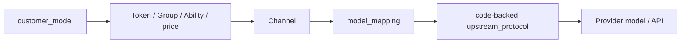

# Link 渠道与上游协议履约架构

## 1. 目标与状态

本文定义简化后的 Link 配置和履约链。它已经被接受，但当前代码仍可能包含旧的 Link 服务合同注册、
publication、SKU、implementation、execution binding 和 Link Access Plan；实施时应删除这些机制，
不能把本文描述为已完成的生产事实。

Link 的目标是复用 NEWAPI 成熟的 Channel、Ability、模型映射、价格、Task、计费和日志底座，并为
本地新增入口提供代码化 Provider adapter。它不再建立第二套合同治理系统。

## 2. 唯一主链



| 层次 | 权威事实 | 负责 | 不负责 |
| --- | --- | --- | --- |
| 客户入口 | Router、DTO、响应投影 | 标准请求结构和客户协议 | Provider 兼容性认证 |
| 访问与计价 | Token、Group、Ability、price | 可见性、访问和客户价格 | 选择等价 Provider |
| 渠道 | Channel | 凭据、连接、模型列表、协议、账号作用域 | 创建 Link SKU 或发布身份 |
| 模型翻译 | `model_mapping` | 客户模型到 Provider 模型 | 协议转换逻辑 |
| 协议 | 代码 adapter | 路径、鉴权、转换、状态、错误和结果 | 管理员自定义脚本 |
| 历史执行 | attempt、Task、Asset、计费快照 | 已发生事实 | 改写下一次路由 |

## 3. `ChannelTypeSeedanceLink`

### 3.1 业务边界

所有 Seedance 模型线路都配置为 `ChannelTypeSeedanceLink`，包括国内火山、海外 BytePlus、飞彩、
FunCloud、TokenSave 以及以后经技术确认的第三方线路。该 ChannelType 是管理员可理解的业务分类；
南向是否使用 ModelArk V3 由协议字段决定。

### 3.2 客户模型唯一性

不同 Seedance 渠道必须配置不同客户模型名。系统只在以下操作中检查模型名是否已被其他已启用的
Seedance 渠道使用：

- 新建并启用渠道；
- 编辑已启用渠道的模型列表；
- 重新启用停用渠道。

停用渠道可以保留重复名称。系统不增加数据库唯一约束、请求时重复校验、启动扫描、历史修复、并发
补偿或后台自愈。非标准数据库修改造成的非法状态由管理员检查并修正。

冲突提示必须让普通管理员理解：

> 模型“{model}”已经配置在渠道“{channel}”中。每个 Seedance 模型只能使用一个渠道，请更换模型
> 名称或先停用原渠道。

### 3.3 不使用分发参数

Seedance 不使用 Priority、Weight、Affinity、随机分配、失败重选、跨渠道重试或 fallback。管理端
置灰 Priority 和 Weight，但保留字段以避免侵入 NEWAPI 通用 Channel 模型：

> **Seedance 模型不使用优先级和权重**
>
> 每个 Seedance 模型只能配置在一个 Seedance 专用渠道中。请求会直接发送到这个渠道，不会自动切换
> 到其他渠道。

字段提示为：

> 此设置对 Seedance 专用渠道无效。

## 4. 代码化上游协议

渠道只保存代码中已登记的协议枚举。示例：

```text
video_upstream_protocol:
  modelark_v3_volcengine
  modelark_v3_byteplus
  media_task_v1
  media_arrays_v2
  funcloud_seedance_v2

asset_upstream_protocol:
  none
  volcengine_assets_action_v2024_01_01
  byteplus_assets_action_v2024_01_01
  ark_assets_v1
  relay_assets_v1
```

协议 adapter 必须以代码实现请求、响应、状态和错误转换。管理员不得填写字段映射 JSON、响应脚本、
状态机或 capability 声明。完全兼容已有协议的新模型可以零开发上线；不兼容时由技术人员新增 adapter。

### 4.1 管理字段

| 线路 | 必要配置 |
| --- | --- |
| 国内火山官方 | 视频 API Key、素材 AK/SK、Region、Project、模型映射 |
| 海外 BytePlus 官方 | 视频 API Key、素材 AK/SK、Region、Project、模型映射 |
| 飞彩、FunCloud、TokenSave 等第三方 | Base URL、平台 Key、视频协议、素材协议、模型映射 |
| 无素材库上游 | Base URL、Key、视频协议、`asset_upstream_protocol=none`、模型映射 |

管理表单根据协议显示字段。第三方已经代理 AK/SK、Region、Project 或真人认证时不重复要求这些字段。
NEWAPI 现有 `param_override` 和 `header_override` 继续保留。

### 4.2 凭据和账号

素材资格绑定稳定的 Channel 和 Provider 账号作用域，不绑定包含 Secret 的 credential fingerprint。
同一账号内轮换 Key 或 AK/SK 不使既有素材失效。更换账号、Project、Region、国内/海外类型或素材
协议时必须新建渠道，不允许原地把既有素材解释到新作用域。

## 5. 请求履约

### 5.1 Seedance 创建

```text
ModelArk V3 请求结构校验
  -> Token / Group / Ability / price
  -> 客户模型确定唯一 Seedance Channel
  -> 应用 model_mapping
  -> adapter 校验自己支持的字段
  -> 冻结执行、素材和计费事实
  -> 一次 Provider POST
```

入口只校验统一 ModelArk V3 结构、必填字段、媒体类型和计费上界。它不再要求 publication、SKU
capability、implementation 或 execution binding。adapter 不支持的字段必须明确拒绝，不得静默删除、
钳制或改义。

### 5.2 查询、列表和删除

- 单任务查询读取 Task 冻结的渠道、连接和 adapter；
- 列表从本地主数据库按 `user_id + app_id` 查询；
- 删除读取冻结 adapter 调用上游；上游不支持时返回明确的不支持；
- 任何后续操作都不重新分发或根据当前 Channel 重解释任务。

## 6. 图片扩展

Link 图片也采用客户模型、Ability、Channel、`model_mapping` 和代码 converter/protocol 的简化链，
不再依赖 publication、SKU 或 implementation。图片是否同步、异步以及是否支持素材，由具体入口和
adapter 的代码合同决定。

本决策不把 Seedance 的“单客户模型单渠道”和“Priority/Weight 无效”自动扩张到所有图片模型。
图片分发策略以后按图片产品设计单独评审。

## 7. 耐久事实

可能创建高成本异步任务的 Provider POST 必须在发送前建立 durable attempt。Task 冻结客户模型、
渠道、协议、Provider 模型、查询连接、素材和计费事实。视频创建结果 `unknown` 时不自动重发、换渠道
或退款。

素材管理请求不复用视频 `unknown` 状态机：未取得可信 Provider Asset ID 就返回失败并记录技术日志；
删除结果不明确时返回失败并保留本地状态，后续查询明确不存在后再更新为 deleted。

## 8. 删除的旧机制

目标架构删除：

- `LinkModelPublication` 及改绑审计；
- Link SKU 与逐模型 capability；
- `LinkImplementation` ID/version/hash；
- execution binding 和等价候选证明；
- Link Access Plan；
- publication、implementation 与 Asset binding 共同计算的候选交集；
- 根据模型名、Channel、profile 或价格自动推断 Link 身份。

旧 Task 的冻结快照仍按迁移方案保留读取能力，但旧身份不能继续参与新请求路由。

## 9. 架构不变量

1. 管理配置是当前路由事实，不是隐藏合同身份。
2. 新协议只能由技术人员以代码 adapter 增加。
3. Seedance 客户模型在已启用渠道范围内唯一。
4. Seedance 不参与 Priority、Weight、Affinity、重试、切换或 fallback。
5. 视频创建只有一次 Provider POST。
6. Task 和素材按创建时 Channel/账号事实继续执行。
7. 不支持字段明确失败，不静默兼容。
8. NEWAPI 原生路由不因 Link 配置改变语义。

## 10. 相关文档

- [Link 扩展概念与协作关系](Link服务合同概念与协作关系.md)
- [Seedance 统一北向合同架构](Seedance统一北向合同架构.md)
- [Link 视频服务合同与异步任务架构](Link视频服务合同与异步任务架构.md)
- [Link 资源合同与解析架构](Link资源合同与解析架构.md)
- [ADR-0016](decisions/0016-Seedance专用渠道与确定性素材代理.md)
