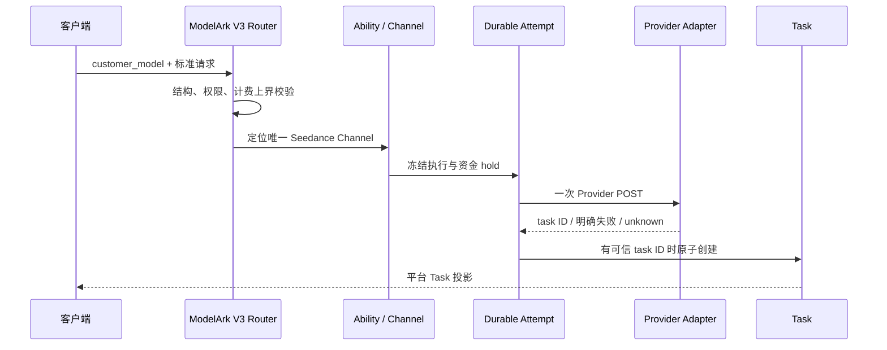

# Link 视频服务合同与异步任务架构

## 1. 范围与状态

本文描述 Link 类型化视频入口、Provider adapter 和共享异步任务的目标边界。设计已经接受但尚待完整
实施和生产验收。NEWAPI 原生 `/v1/videos`、`/v1/video/generations` 及其 Provider adapter 不属于
本文范围，不因 Link 设计改变。

## 2. 客户入口

| 视频族 | 客户合同 | 入口 | 渠道边界 |
| --- | --- | --- | --- |
| Seedance | ModelArk V3 | `/api/v3/contents/generations/tasks` 四组接口 | 仅 `ChannelTypeSeedanceLink` |
| Kling | Kling 类型化合同 | `/kling/v1/videos/*` | Kling 专属 adapter |
| 即梦 | 即梦 CV 异步合同 | `/jimeng?Action=CVSync2Async*` | 即梦专属 adapter |

客户入口负责协议结构、权限和计费安全校验。Provider 私有请求字段、任务 ID、模型名和凭据不得进入
普通客户合同。

## 3. Seedance 确定性路由

Seedance 采用单模型单渠道：

```text
customer_model
  -> Group / Ability / price
  -> 唯一 ChannelTypeSeedanceLink
  -> model_mapping
  -> video_upstream_protocol
  -> Provider
```

不同官方和第三方渠道必须使用不同客户模型名。Priority、Weight、Affinity、随机分配、失败重选、跨
渠道重试和 fallback 均不参与 Seedance 请求。

模型重名只在创建/启用渠道、编辑已启用渠道模型列表和重新启用时检查。运行时相信已保存的管理配置，
不重复增加唯一性门禁。

## 4. 南向 adapter

`video_upstream_protocol` 是代码 adapter 类型。每个 adapter 对自己的协议负责：

- Provider 鉴权和创建/查询/删除路径；
- ModelArk V3 到上游请求的转换；
- `model_mapping` 后 Provider 模型的发送；
- 状态、进度、结果和错误归一；
- 是否支持删除、列表或特定媒体组合；
- 任务轮询需要的最小连接快照。

管理员只能选择已存在的 adapter，不编写字段映射或状态机 JSON。上游与现有协议完全兼容时可配置
上线；否则由技术人员新增 adapter。

## 5. 创建主链



Provider 请求字节发送前必须提交 durable `TaskCreateAttempt`、资金 hold 和发送许可。attempt 冻结：

- user、token、app、客户模型和客户入口；
- Channel、Provider 模型、`video_upstream_protocol` 和 adapter 版本；
- 查询 Base URL/路径、代理和受保护凭据引用；
- 平台素材与 Provider 作用域；
- 预扣、价格、计费表达式和对账事实。

取得可信 Provider task ID 后，Task 创建、attempt hold 转移和 attempt 完成必须原子提交。没有可信
task ID 时不得创建伪 Task。

## 6. 一次发送与 `unknown`

Seedance 视频是高成本重任务，每次创建只允许一次 Provider POST。禁止：

- 网络错误后自动重发；
- 切换另一 Seedance 渠道创建；
- 从官方切到第三方或反向切换；
- 把结果不明当成确定失败并立即退款。

发送后无法确认 Provider 是否创建任务时，attempt 进入 `unknown`。它保留资金和 Provider exposure
事实，等待可用的对账证据；不得自动重试、切换或退款。该规则不扩大到低成本素材管理 API。

公开 ModelArk 视频创建合同没有可依赖的客户幂等字段，Seedance 北向不强制自定义
`Idempotency-Key` 或 `ClientToken`。两个独立 POST 是两个业务创建意图。

## 7. Task 生命周期

Task 使用创建时冻结快照：

```text
创建成功
  -> 按冻结 adapter 查询
  -> 运行中 / 成功 / 明确失败
  -> 按冻结计费事实结算
```

- GET 单项按冻结 Channel 和 adapter 查询，不重新选渠；
- GET 列表从本地主数据库按 `user_id + app_id` 返回；
- DELETE 按冻结 adapter 调用 Provider；不支持时明确返回；
- 单次无效 JSON、未知状态、任务 ID 不匹配或成功结果缺失不直接证明业务失败；
- 当前 Channel 停用、映射变化或凭据轮换不能改写历史任务。

轮询状态更新和计费终态必须幂等。Provider 业务事实已经确认后，计费写入失败由独立补偿继续处理，
不能回滚 Provider 状态。

## 8. 素材参与创建

请求可混用 HTTP/HTTPS URL、Data URL 和 `asset://ast_*`。只要含平台素材：

1. 客户模型确定的 Channel 必须等于所有素材冻结 Channel；
2. 所有素材必须属于相同 Provider 账号、Region 和 Project；
3. Resolver 把 `asset://ast_*` 改写为该 Channel 对应的 Provider 资源 ID；
4. 普通 URL/Data URL 与已解析素材一起发送同一个 Provider；
5. 不满足时返回 `asset_channel_mismatch` 或 `asset_scope_conflict`。

视频请求不创建素材、不自动迁移素材，也不在素材失效时回退源 URL。

## 9. 计费

客户价格、Token 权限、Ability、日志和响应均使用客户模型名。预扣和结算必须使用统一 quota 安全函数，
所有客户可控乘数在进入计费前有明确上界，饱和事件写入管理员审计。

客户退款与 Provider 潜在成本分账。Provider 金额未知时保持未知，不得用客户 quota 冒充 Provider
货币成本。`unknown` 与不可采信轮询按共享异步事实架构处理。

## 10. 失败语义

| 场景 | 结果 |
| --- | --- |
| 无唯一 Seedance Channel | 请求失败，不扫描其他渠道 |
| adapter 不支持字段 | 参数错误，不静默删除 |
| Provider 明确未创建 | attempt rejected，可按冻结规则释放 hold |
| Provider 创建结果不明 | attempt unknown，不重试/切换/退款 |
| 单次轮询不可采信 | 保持任务活动并记录观测失败 |
| Provider 明确不可交付 | 进入失败终态并按冻结计费合同处理 |
| Provider 不支持删除 | 返回不支持，不伪造成功 |

## 11. 架构不变量

1. Link 类型化视频入口与 NEWAPI 原生视频入口隔离。
2. Seedance 使用唯一 Channel，不使用 Priority/Weight/Affinity/fallback。
3. Provider adapter 是代码，不是管理员 JSON 配置。
4. 发送前建立 durable attempt 和资金 hold。
5. 每个 Seedance 创建只发送一次 Provider POST。
6. `unknown` 不自动重发、换渠道或退款。
7. Task 按冻结 adapter、连接、素材和计费事实执行。
8. 客户模型用于权限、价格和日志；Provider 模型只用于上游调用。
9. 普通客户不看到 Provider 私有身份或敏感快照。

## 12. 相关文档

- [Seedance 统一北向合同架构](Seedance统一北向合同架构.md)
- [异步任务与计费事实架构](异步任务与计费事实架构.md)
- [Link 资源合同与解析架构](Link资源合同与解析架构.md)
- [ADR-0008](decisions/0008-共享异步任务计费状态机与原子补偿.md)
- [ADR-0011](decisions/0011-异步创建未知与轮询合同违例对账.md)
- [ADR-0016](decisions/0016-Seedance专用渠道与确定性素材代理.md)
