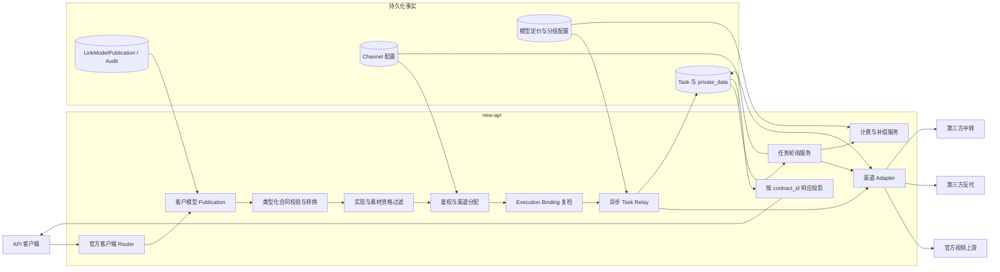
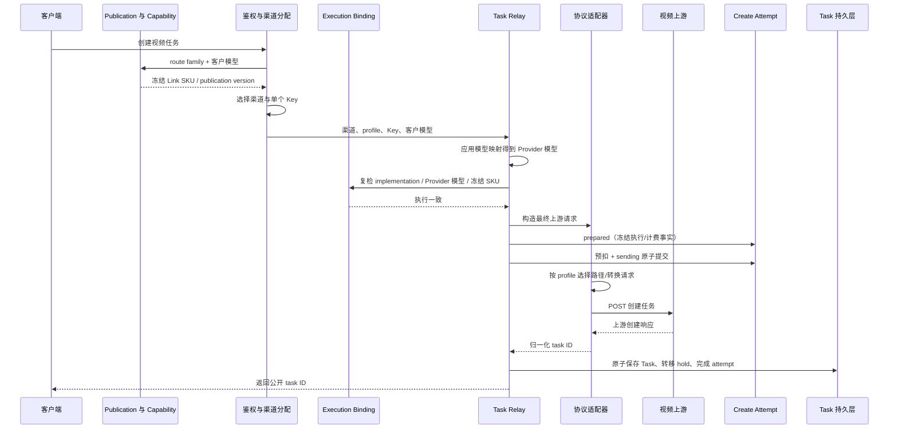
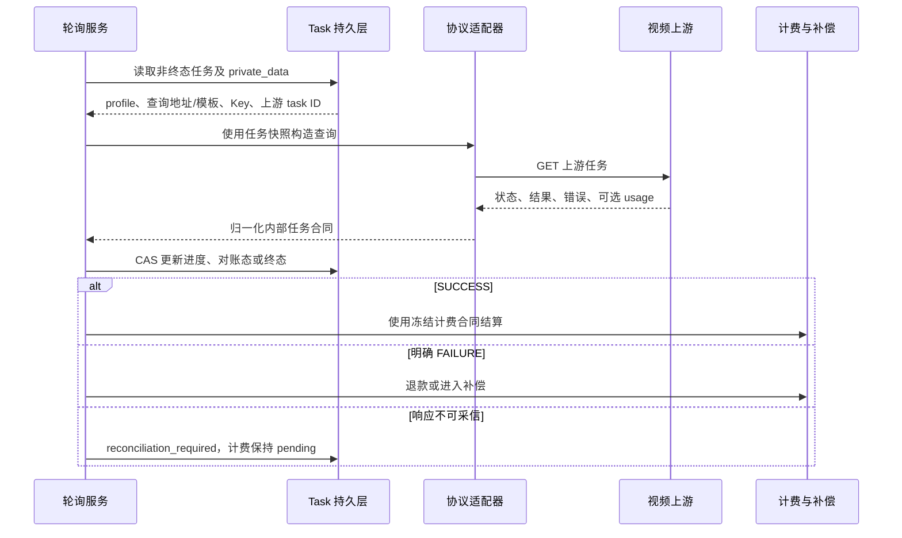

# Link 视频服务合同与异步任务架构

> 本文记录 Link 视频客户接入合同、客户模型 publication、上游调用合同与共享异步 Task 的当前架构。`DoubaoVideo` 是 Seedance 等字节视频渠道的执行类型，不是所有 Link 视频合同的代名词。

## 1. 目的与范围

本文回答以下架构问题：

- 官方直连、第三方反代和第三方中转如何复用同一视频任务入口；
- 协议、地址、凭证、模型映射和价格分别由谁决定；
- 创建请求与异步轮询如何保持协议和账号一致；
- 第三方差异如何隔离，而不演变为供应商专用 Provider、服务或状态系统；
- 任务终态如何与既有计费、退款和补偿边界衔接。

本文只定义 Seedance、Kling、即梦等显式 Link 视频合同、Provider adapter 和共享异步任务接线。
`video_upstream_profile` 只描述 `DoubaoVideo` 渠道的 Provider 执行协议；Kling、即梦使用各自 adapter。
NEWAPI rc23 原生 OpenAI Videos 与旧版平台视频不属于本文架构，其 Router、DTO、Relay、Sora adapter、
模型发现和客户端协议以上游代码为唯一权威。

Seedance ModelArk v3 的规范词汇、模型级 capability、版本与机器发现细节集中在
[Seedance 统一北向合同架构](Seedance统一北向合同架构.md)，本文不重复维护逐模型字段矩阵。

### 1.1 当前实现状态

截至 2026-08-06，代码已实现：

- Seedance、Kling、即梦三套类型化客户接入合同和稳定 `contract_id`；
- 官方 DTO 白名单校验、合同错误投影和 Provider 请求转换；
- 任务快照中的客户接入合同版本、上游调用合同 adapter 版本、执行连接和计费事实；
- ModelArk 客户端与 `official`、`third_party_reverse_proxy`、`third_party_relay`、
  `third_party_json_video_media_arrays`、`third_party_funcloud_seedance_v2` 渠道 profile 解耦；
- `southbound_adapter_version` 已从审计字符串升级为实际执行键；创建、轮询和内容代理按任务冻结的
  上游调用合同 adapter 版本分发，不用当前代码版本覆盖在途任务合同；
- 公开 SKU 以 `VideoSKUCapability` 为运行时唯一权威；飞彩单轨
  `feicai.seedance-videos/v2` 已登记 10 个独立 SKU、媒体上下限和按秒/按次计费模式；
  逐模型 size registry 仍只接受正式黑盒证据，未登记组合在预扣前 fail closed，且不投影为公开
  OpenAPI 能力；
- JSON Video media-arrays 创建只有一条可达路径：类型化 ModelArk 请求 + 冻结
  capability + 映射后上游模型进入 `mediaarrays.CreateRequest`；通用 body 重解析和备用
  builder 已禁止；
- FunCloud v2 的独立 profile、两个公开 SKU、source URL Link 资源解析和 adapter v2 快照；
- 平台托管素材的渠道交集约束和每次 Provider 尝试前的 `asset://` 引用改写；官方合同允许的请求级
  URL/Data URL 不进入 Asset/Binding 生命周期；
- 显式接入的 Link 视频协议在 Provider POST 前建立 durable `TaskCreateAttempt`，预扣与 `sending` 原子
  提交，unknown 由共享补偿调度和 Root 人工恢复/拒绝接口处理；
- 轮询合同违例进入 `RECONCILIATION_REQUIRED`，确定性不可交付终态进入
  `PROVIDER_CONTRACT_FAILURE` 并记录 exposure。
- 任意客户模型先经既有 `model_mapping` 得到 Provider 模型，再由所选 Link 接入方案的
  `(route family, action, profile, Provider model)` execution binding 唯一解析 Link SKU；客户模型
  publication 独立持久化，零候选时仍保留合同身份。
- 类型化视频入口按 publication 冻结 Link SKU/version，选渠后、Provider POST 前再次核对所选渠道的
  execution binding 与实际映射模型；Task 和 durable create attempt 同时冻结客户模型、Link SKU、
  publication version、implementation 和 Provider 模型。

代码实现不等于生产开放。仍需通过生产配置和灰度持续证明全部启用渠道的合同等价性，并在真实
Provider、价格、错误、内容回源和故障注入下完成验收；Ability、分组与 exposure 策略继续控制
实际发布，不能因代码存在就视为某个模型或渠道已面向所有分组开放。

## 2. 架构原则

### 2.1 客户合同与上游合同显式分层

Link 视频服务合同中的客户语义、发布身份和 Provider 执行各有显式权威：

- `contract_id` 决定客户端请求、响应、错误和生命周期投影；
- `(contract_namespace, route_family, customer_model)` 的 publication 决定稳定 Link SKU；
- `VideoSKUCapability` 决定该 SKU 的字段、媒体组合和生命周期；
- implementation execution binding 决定选中渠道的 Provider 模型如何履行该 SKU；
- `video_upstream_profile + southbound_adapter_version` 组成上游调用合同键：profile 决定
  `DoubaoVideo` 的协议族，冻结版本决定同一协议族内不兼容的结果与凭据语义。

这些身份正交。系统不能从供应商名称、Base URL、客户模型名称、Key 格式或请求头推断合同或实现。

### 2.2 配置与执行事实分离

渠道保存管理员可编辑的当前配置，用于创建未来任务；任务快照保存某个任务创建时已经发生的执行事实，用于完成在途任务。二者不是重复配置源：

```text
渠道配置（可编辑）  -> 决定下一次创建
任务快照（不可编辑）-> 保证已创建任务完成
```

### 2.3 适配器无供应商专用状态

协议适配器只进行确定性的 URL 构造、请求转换和响应归一化，不维护 Key 池、任务绑定、租户、价格或素材生命周期。异步状态归现有 Task 持久层，账号路由归现有渠道系统。

这里的“无供应商专用状态”不等于“异步任务无状态”。任务 ID、查询配置、选中 Key、模型和计费快照都是完成异步任务所需的创建事实。

### 2.4 失败优先于错误成功

未知 profile、无效路径、缺失任务 ID、未知中转状态以及成功终态缺失可用结果定位事实必须拒绝或
保持未完成，不能通过猜测、默认映射或空结果把任务标记为成功。可用结果定位事实可以是经过校验的
Provider 结果 URL，也可以是由已验证协议、冻结 Base URL、任务 ID 和固定内容路径确定性构造的
平台内容地址；响应里一个从未用于交付的提示 URL 不能反向成为成功或计费门闩。

### 2.5 三种模型身份与计费正交

客户模型名决定模型发现、Token 权限、Ability、价格、日志和响应；publication 决定 Link SKU；
`model_mapping` 决定 Provider 模型；profile 决定如何调用。任何一项都不能隐式覆盖另一项。

### 2.6 SKU 能力先于渠道能力

publication 先确定稳定 Link SKU，公开 SKU 的版本化能力声明再决定客户端可提交什么以及可依赖哪些
生命周期动作；渠道/profile
只回答自己能否完整实现。不能从当前候选渠道动态计算 SKU 能力合同，也不能选中渠道后再删字段或
改变 DELETE 语义。规范化、配置发布校验、运行时过滤和发送前复检统一遵循
[ADR-0015](decisions/0015-Link服务合同发布与实现身份绑定.md)。

## 3. 系统上下文



架构保持现有 `Router -> Controller -> Service -> Model` 分层。协议适配位于 relay 边界；任务轮询和计费编排位于 service；渠道与任务事实由 model 持久化。

## 4. 组件职责

| 组件 | 核心职责 | 不承担的职责 |
| --- | --- | --- |
| 视频 Router / Controller | 暴露厂商官方入口，绑定 `client_protocol` 与合同响应投影 | 不用统一 DTO 替代各厂商合同 |
| 客户模型 publication | 按 route family 冻结客户模型、Link SKU 与 publication version | 不依赖当前候选决定产品身份 |
| Link 合同转换层 | 严格 DTO 白名单校验，按冻结 SKU 生成带 `contract_id` 的内部请求 | 不选择渠道，不透传未知字段 |
| SKU 能力注册 | 定义字段值域、规范化、媒体组合和公开生命周期 | 不读取渠道地址或动态取候选交集 |
| implementation / execution binding | 过滤完整等价实现，发送前复检 Provider 模型与冻结 SKU | 不替代 `model_mapping` 或 NEWAPI 分发 |
| 渠道分配器 | 按模型、分组、优先级和权重选择渠道及单个 Key | 不按模型名或地址猜测 profile |
| Create Attempt | 发送前冻结创建和资金事实，承接 unknown 对账 | 不伪造尚未取得上游 ID 的 Task |
| Task Relay | 校验请求、应用模型映射、建立 attempt、估算与预扣、调用 adaptor、持久化任务 | 不实现供应商专用协议字段 |
| 渠道 adapter | 按渠道类型/profile 构造 URL、鉴权与请求，并归一化任务状态 | 不决定客户端响应外壳，不维护第二套 Task |
| Task 模型 | 保存公开/上游任务 ID、模型、执行快照和计费快照 | 不作为管理员配置入口 |
| 任务轮询服务 | 读取任务快照、查询上游、归一化状态、推进终态 | 不重新选择上游调用合同或账号 |
| 计费与补偿服务 | 预扣、终态结算/退款、失败补偿和审计 | 不由 profile 或第三方路径决定价格 |

## 5. 协议合同

### 5.1 协议集合

| profile | 创建请求 | 创建/查询地址 | 响应处理 |
| --- | --- | --- | --- |
| `official` | 保持现有 Ark 视频请求 | 使用官方根地址回退与内置固定路径 | 使用官方任务响应合同 |
| `third_party_reverse_proxy` | 保持 Ark 兼容结构 | 使用渠道 Base URL、创建路径和查询模板 | 归一化已定义的包裹、任务 ID、状态和结果字段差异 |
| `third_party_relay` | 转换为统一媒体异步任务结构 | 使用渠道 Base URL、创建路径和查询模板 | 将中转四态、结果和错误归一化为内部任务合同 |
| `third_party_json_video_media_arrays` | 当前转换为 `duration/size/images/audios`；飞彩目标 v2 增加受 capability 约束的 `videos` | 使用渠道 HTTP(S) Base URL、`/v1/videos` 与查询模板 | 当前 adapter v1 以 `id` 为唯一任务身份；飞彩全模型采用单轨 v2 替换，不建设双轨 |
| `third_party_funcloud_seedance_v2` | 从 ModelArk 内容构造 FunCloud v2 JSON | SKU 固定创建路径，查询 `/api/v2/open/aigc/{task_id}` | 归一化 v2 状态与结果；Link 资源只使用 `source_url` |

official 的内置路径为：

```text
POST /api/v3/contents/generations/tasks
GET  /api/v3/contents/generations/tasks/{task_id}
```

### 5.2 第三方中转请求合同

`third_party_relay` 从现有视频请求派生受控字段，包括：

- 上游模型 `model`；
- 能力与输入控制：`capability`、`input_mode`、`control_mode`；
- 文本、首帧、尾帧和参考图；
- 时长、分辨率、比例、随机种子、固定相机、水印和音频开关。

Provider 字段必须以中转合同为准，不能把客户端或内部字段名原样透传：

| 客户端/内部字段 | `third_party_relay` 出站字段 |
| --- | --- |
| `duration` | `duration_seconds` |
| `ratio` | `aspect_ratio` |
| `generate_audio` | `with_audio` |

这些可选标量使用指针语义；显式 `0` 或 `false` 必须继续发送，只有字段缺失时才省略。出站 JSON 不得同时残留 `duration`、`ratio`、`generate_audio` 等旧字段，否则上游可能接受任务却静默忽略参数。

转换只接受已定义的媒体类型和图片角色。不支持的视频/音频输入、重复首尾帧或互斥的尾帧与参考图组合直接拒绝，不能静默删除字段或降级为另一种输入模式。

### 5.3 内部任务响应合同

所有上游在进入任务服务前归一化为同一最小合同：

```text
task_id / id
status
result video URL（成功时必需；可来自 Provider 响应或已验证协议的确定性规范化内容地址）
error（失败时可用且已脱敏）
usage（仅在语义已验证时提供）
```

第三方中转状态归一化为 `queued`、`running`、`succeeded`、`failed`。第三方反代只接受已定义的
Ark 兼容状态及别名；任何未识别状态都不得被解释为成功。现有 relay/reverse-proxy profile 的
`succeeded` 必须从响应取得可用结果 URL；若另一已验证 profile 的协议定义了固定内容端点，则可
由冻结连接和任务 ID 确定性构造规范化结果 URL。Provider 返回但不会被平台代理使用的提示 URL，
其 origin、query 或是否存在不得单独改变任务终态和计费；它也不得成为凭据转发目标。

`third_party_json_video_media_arrays` 只支持
`54:third_party_json_video_media_arrays:v2`：

- 创建响应必须提供非空、长度受控且无控制字符的 `id`；`task_id` 不参与身份判断；查询响应的
  `id` 必须等于冻结任务 ID，查询响应中的 `task_id` 继续忽略；
- `completed` 顶层必须提供非空绝对 HTTP(S) `video_url`，且无 userinfo、长度受控并与冻结
  Base URL 同源（scheme、host 和有效端口一致）；通过校验后保存到 `private_data.result_url`，
  内容回源使用任务冻结 Bearer Key 并拒绝重定向；
- 缺失、畸形或跨域结果 URL 时进入 `reconciliation_required`，不得回退固定路径；
- `queued`、`processing`、`completed`、`failed` 之外的状态继续 fail closed。

这里的 v2 是 media-arrays 网关执行合同版本，不是 Provider 模型版本或客户接入合同版本。
旧 omni-reference adapter、parser、fixture 与无鉴权内容源已经硬删除；客户端不选择 adapter version。

上述段落描述当前代码事实。已接受的[飞彩全模型设计](<seedance 模型接入设计/飞彩/README.md>)
选择单轨 adapter v2：部署数据不再依赖飞彩 v1 后，v2 整体替换 media-arrays v1 请求、轮询、内容代理
和 fixture；当前文档在代码落地前不把目标 v2 写成已实现事实。

未经真实账单验证的第三方 usage 不得伪装为官方 Ark usage。协议兼容不等于计费语义兼容。

### 5.4 客户接入合同、publication 与上游调用合同

Seedance 使用 ModelArk v3 客户接入合同；Kling 和即梦使用各自官网合同。客户模型先按对应 route
family 读取 publication，`video_upstream_profile` 再作为 new-api 调用 Provider 的上游合同键：

```text
客户模型 + modelark_video / kling_video / jimeng_video
  -> publication 冻结 Link SKU
  -> SKU capability 校验
  -> NEWAPI 按客户模型选渠
  -> model_mapping + execution binding 复检
  -> official / third_party_reverse_proxy / third_party_relay
  -> third_party_json_video_media_arrays / third_party_funcloud_seedance_v2
```

因此，从 `/api/v3/contents/generations/tasks` 创建任务时，不能因为客户端采用 ModelArk 合同就只保留 `official` 渠道。`ModelArkVideoChannelConstraint` 的兼容边界是：

- 仅考察已启用的 `DoubaoVideo` 渠道；
- 空 profile 按历史 `official` 兼容；
- `VideoUpstreamProfile.IsValid()` 登记的已实现 profile 均可参与后续分发；
- 未知 profile 必须拒绝，不能借客户端转换绕过上游调用合同实现；
- 请求包含 `asset://ast_xxx` 时，允许集合与 `AssetRouteConstraint` 的素材可用渠道集合取
  交集，不能扩大素材路由范围；仅含请求级 URL/Data URL 时不伪造素材 binding；
- 最终仍由分发器按客户模型、调用分组、渠道状态、优先级和权重选渠。

具体字段转换、响应归一化和终态 usage 由选中 profile 的适配器负责。生命周期的公开语义由
SKU 能力定义，profile 只声明实现情况；不支持取消或删除的 profile 可以服务明确不发布这些
动作的 SKU，但不能成为发布了相应动作之 SKU 的候选渠道。

Link 合同层先捕获不可变的 publication，再按其 Link SKU 捕获
`resolved_sku_capability`（版本与内容 hash），用两个快照
完成字段默认值和等价显式值规范化。后续步骤不得重新读取“当前版本”：

- ModelArk resolution 只使用 `480p`、`720p`、`1080p`、`4k`，ratio 只使用
  `16:9`、`4:3`、`1:1`、`3:4`、`9:16`、`21:9`、`adaptive`；不接受别名；
- duration、resolution 和 ratio 的默认值都属于 capability 并进入内容 hash；没有冻结默认值的维度
  必须由客户显式提供；
- 非笛卡尔积能力使用 `resolution_ratio_combinations` 显式登记，adapter 不从数组顺序推断组合或默认值；
- 显式 `false`、`0`、`-1`、`default` 和空 `tools` 数组保留字段存在性；模型或候选不能等价履约时
  在收费和 Provider POST 前失败，不静默删除。

1. 使用客户模型读取 Ability 候选，publication 继续作为合同权威；
2. 排除未完整实现该冻结能力版本的渠道/profile；
3. 与 `AssetRouteConstraint` 等请求级路由约束取交集；
4. 按分组、优先级和权重分发；
5. 应用渠道 `model_mapping`，发送前用 execution binding 和同一冻结能力再次校验。

Ability 发布时也执行候选等价检查；配置错误不能只等运行时随机暴露。

客户端长期合同为三套厂商官方薄适配层，而不是三套任务系统：

| 客户端协议 | `contract_id` / 版本 | 创建与查询入口 | 独立合同 |
| --- | --- | --- | --- |
| ModelArk v3 | `modelark.contents.generations.v3` / `2024-01-01` | `POST/GET /api/v3/contents/generations/tasks`，单任务 `GET/DELETE .../:task_id` | 七天本地列表、ModelArk 状态、按状态取消或删除 |
| Kling v1 | `kling.v1.videos` / `v1` | `POST /kling/v1/videos/{text2video,image2video}`，`GET .../:task_id` | 文生/图生路径、Kling 状态与响应外壳 |
| 即梦 | `jimeng.cv.async.2022-08-31` / `2022-08-31` | `POST /jimeng/?Action=CVSync2Async*` | Action/Version、即梦状态与响应外壳 |

这些 Link 合同共享内部 Task、渠道分配、素材约束、轮询、计费和审计主链路，但不得互用 DTO、
状态或错误外壳。它们只通过自己的类型化 Router 和显式候选实现发布；不得为此修改、包装或复制
rc23 原生 `/v1/videos` 与 `/v1/video/generations`。

## 6. 配置与状态所有权

| 事实 | 创建新任务时的来源 | 在途任务的执行事实 | 说明 |
| --- | --- | --- | --- |
| 客户接入合同 | Router 与类型化合同转换 | `Task.client_protocol`、`private_data.northbound_contract_id/version` | 决定后续查询、错误和响应投影 |
| 客户模型 publication | `LinkModelPublication` | namespace、route family、Link SKU、publication version | 决定创建时客户模型代表的产品，不随改绑重解释 |
| SKU 能力 | 公开 SKU 能力注册 | `private_data.sku_capability_version/lifecycle_capabilities` | 决定规范化、DELETE、内容和生命周期投影 |
| implementation | Link 接入方案与 execution binding | implementation ID/version/content hash | 证明 Provider 执行完整履行冻结 SKU |
| 上游调用合同版本 | 选中渠道类型与 profile | `Task.private_data.southbound_adapter_version` | 标识创建任务时使用的转换实现 |
| DoubaoVideo 渠道 profile | `ChannelOtherSettings.video_upstream_profile` | `Task.private_data.video_upstream_profile` | 决定该渠道的创建与查询协议 |
| 上游根地址 | `Channel.base_url` | `Task.private_data.video_upstream_query_base_url` | official 可使用类型默认地址 |
| 创建路径 | 渠道设置或 official 内置路径 | 无需快照 | 仅创建阶段使用 |
| 查询路径 | 渠道设置或 official 内置路径 | `Task.private_data.video_upstream_query_path_template` | 第三方模板含 `{task_id}` |
| 上游凭证 | `Channel.key` 中本次选中的单个 Key | `Task.private_data.key` | 不保存整组 Key |
| 客户模型 | 客户端请求 | `Task.properties.origin_model_name` | 计费、权限、日志和用户响应的模型键 |
| 上游模型 | 渠道 `model_mapping` | `Task.properties.upstream_model_name` | 仅参与上游调用和追踪 |
| 上游任务 ID | 创建响应 | `Task.private_data.upstream_task_id` | 不对用户暴露真实 ID |
| 上游请求 ID | 创建响应头 | `Task.private_data.upstream_request_id` | 仅用于追踪和事后对账，不参与计费计算 |
| 计费合同 | 模型定价、表达式、分组倍率 | 任务计费快照 | 与 profile、地址和上游模型解耦 |

渠道配置是唯一的人工配置面；任务快照由系统自动生成，不提供独立编辑 API。管理员修改渠道只影响修改后创建的任务。

## 7. 创建链路



创建阶段必须在同一条已选渠道上下文中完成 publication 冻结、模型映射、execution binding 复检、
Key 选择、请求发送和任务快照。不能在上游任务创建成功后重新读取渠道或当前 publication 补写快照。

JSON Video media-arrays 的创建请求在 adapter 入口已持有类型化请求、已解析的
`VideoSKUCapability` 和映射后上游模型，必须直接交给唯一 `mediaarrays.CreateRequest`
builder。不得再从 JSON body 反向解析 Link SKU、重新选择 capability 或保留第二套请求
builder；这会让模型映射后的私有模型名错误参与 SKU 能力合同解析。

`prepared` 必须先于预扣；预扣、`billing_hold=held` 和 `sending` 必须在同一数据库事务中完成，
且先于任何出站请求字节。进程退出后遗留的 `sending` 保守转为 `unknown`，禁止自动退款或
重发。取得可信上游任务 ID 后，Task 创建、hold 转入 `AsyncBilling.pending` 和 attempt 完成
在同一事务提交。

明确证明上游未创建时可以释放 hold。发送后的模糊结果保留 hold 并进入有界对账；超过批准
期限仍无法恢复时释放客户资金并记录供应商孤儿/平台成本 exposure。`Idempotency-Key` 可选：
提供时可安全重放同一 attempt；缺失时新的 HTTP 请求是新的业务尝试，平台只提供
at-least-once。完整状态见
[ADR-0011](decisions/0011-异步创建未知与轮询合同违例对账.md)。

确定拒绝必须由已登记、可测试的 Provider `HTTP status + error.code` 合同证明。仅凭 400、401、
403 或其他 HTTP 状态不能证明任务未创建。飞彩 v1 专用规则已经删除；当前 v2 没有确定拒绝组合，
发送后的非 2xx 或解析异常均进入 `unknown`。只有取得 v2 独立证据后才能增加精确组合，不能把整个
状态码或相同 message 注册为确定拒绝。

人工处置只开放 Root 运维接口：Provider 确认已创建时通过 `recover` 补录上游任务 ID；确认
绝未创建时通过 `reject` 释放 hold。两者都要求新鲜的 2FA/Passkey security proof、
`provider_verified=true` 和脱敏审计备注；`reject` 只接受 `unknown + held`，资金释放、授权
reservation 关闭、幂等 claim 处理和操作人/时间/备注在同一状态转换中完成，并保持幂等。

## 8. 轮询与终态链路



轮询只使用任务快照。adapter version 必须实际参与 decoder 分发；缺失、未知、畸形或与 profile
不匹配的版本进入合同违例对账，不从当前渠道配置、Provider 地址或模型名推断旧协议。所有新任务
必须写完整连接与 adapter 快照；未发布开发数据通过一次性清理收敛，不保留运行时 fallback。

任务终态写入使用状态条件更新，避免并发轮询重复推进终态。资金调整失败不能回滚已经确认的上游业务事实；计费状态必须允许在终态后独立补偿。

无效 JSON、未知/空状态、任务 ID 不匹配、成功结果缺失或不可采信等单次合同违例不等于业务
失败。任务进入内部 `reconciliation_required`，继续使用冻结连接有界重试并告警；合法响应
恢复后继续原状态机。只有上游明确失败才能写 `FAILURE`。超过公开任务最大生命周期时可按
服务 SLA 写 `EXPIRED` 并退款，同时记录 `upstream_outcome_unresolved`，不能把它描述成已
证明的上游失败。

如果已经取得可信、完整、重复查询不会改变的终态结果，但它确定违反公开交付上限或安全合同，
可以进入内部 `PROVIDER_CONTRACT_FAILURE`，对外投影为
`failed/provider_contract_failure`，并按 ADR-0008 冻结零目标结算，同时记录潜在 Provider
成本 exposure。结算成功后 billing 为 `settled`；资金写入失败时为 `failed` 并进入补偿。
这与“本次响应不可采信”不同，不能把所有合同违例都永久留在对账态。

## 9. URL 与配置约束

南向 Provider Base URL 使用 NEWAPI 已有的绝对 HTTP(S) 语义。Provider 官网面向直连客户提出的
HTTPS 接入要求、示例或建议不属于 Link 客户合同，也不能反向限制中转站管理员配置的连接地址；
profile 和 implementation 只固定 Provider 协议、路径、鉴权、请求转换与响应归一。除非精确协议
依赖 HTTP 无法提供的传输能力，否则不得增加 Provider 专属 HTTPS-only 校验。

这条规则不等于信任 Provider 返回的任意 URL。任务结果和内容回源仍必须与冻结 Base URL 同源，
拒绝 userinfo 和重定向，并经过长度、SSRF、端口及脱敏校验；客户可控媒体 URL 与 Link AssetSource
继续遵守资源合同，不能借南向 Base URL 兼容规则获得额外权限。

代码在渠道保存、任务完成响应与内容回源三个边界使用同一 HTTP(S) 语义。任何后续修改都必须同时
覆盖这三层，避免形成“可保存或可创建，但任务结果不可交付”的半兼容状态。

所有已登记第三方 profile 必须同时提供 Base URL、创建路径和查询路径模板：

- Base URL 必须是绝对 `http://` 或 `https://` 地址，不包含 query 或 fragment；
- 路径必须以单个 `/` 开头，只能是 path，不能填写完整 URL；
- 创建路径不能包含 `{task_id}`；
- 查询模板必须包含且仅包含一个 `{task_id}`；
- 拼接时去除 Base URL 末尾多余 `/`；
- 查询时对 task ID 执行 URL path escaping；
- profile 未知或第三方配置缺失时拒绝保存或调用，不回退 official。

official profile 不读取第三方路径字段。保存 official 渠道时由后端清空这些字段，避免隐藏配置成为第二协议来源。

### 9.1 对外视频内容 URL 投影

任务查询响应（ModelArk v3 协议 `/api/v3/contents/generations/tasks/:task_id`）返回给客户端的视频内容 URL，遵循「主机跟随入站请求」规则，与上游 URL 约束（§9）相互独立：

- 成功任务的 `content.video_url` 固定为相对路径 `/v1/videos/{task_id}/content`，`last_frame_url` 为 `/v1/videos/{task_id}/content?part=last_frame`；不直接暴露上游直链或 `private_data.result_url`。
- 响应阶段在 controller 投影层（`projectModelArkVideoTask`）按入站请求推导前缀 `scheme://host[:port]`：`scheme` 取 `X-Forwarded-Proto` → `TLS` → `http`；`host` 取 `X-Forwarded-Host` → `Request.Host`；任一缺失时回退 `ServerAddress`。
- 该前缀仅用于客户端回访本服务自身的视频代理端点 `/v1/videos/:task_id/content`（VideoProxy），不会被本服务用作回源地址；VideoProxy 回源用的是任务快照里的上游直链。因此请求 `Host` 头伪造不构成 SSRF，最坏情况是客户端拿到不可达链接。
- 本节不定义 OpenAI Videos 响应、任务识别或历史兼容；这些行为以上游原生实现为准。

不变量：`video_url` 的主机部分 ≡ 调用方本次请求访问本服务所用的主机。线上公网域名与本地 localhost 两种入口在同一份 `ServerAddress` 配置下都能正确回访，无需按环境切换。反代部署须转发 `X-Forwarded-Proto` 与 `Host`，见 [环境配置](../40-operations/环境配置.md)。

### 9.2 JSON video 内容回源

平台公开 URL 始终是 §9.1 的自身代理端点；omni Provider 只执行 v2 回源合同：

- 使用 `private_data.result_url`，按冻结实现决定鉴权；保存和回源前均执行同源 HTTP(S) 校验，
  所有重定向继续逐跳执行 SSRF 校验；
- 完整结果 URL、签名 query 和 Key 不写普通日志或 `FailReason`；Task 的普通 `data` 也不得保留
  可重放结果 URL；
- 本地 Fake-IP 把 Provider 域名解析到 `198.18.0.0/15` 时，应修正本地 DNS/代理规则，不关闭或
  放宽网关 SSRF 防护。

## 10. 凭证与数据安全

- API Key 只由管理员在渠道配置一次；任务快照保存的是创建时实际使用的单个 Key，而不是可编辑副本或 Key 集合。
- `Task.private_data` 必须保持 `json:"-"` 用户响应边界，不得出现在任务列表、查询响应、错误详情或调试日志中。
- 数据库和备份必须按上游凭证敏感级别保护；任务完成不会自动降低历史备份中的凭证敏感性。
- Authorization、Cookie、原始媒体、可重放签名 URL 和完整第三方响应不得进入计费探针或普通日志。
- 第三方错误只保留完成排障所需的脱敏信息，不能原样转发可能包含凭证或内部地址的消息。
- 创建响应中的上游请求 ID 保存到成功 Task 私有数据；发送后结果不明确时，在
  `sending -> unknown` 同一次转换写入 create attempt。它只用于管理员对账和关联供应商账单，
  不向普通用户响应暴露，也不作为计费成立的前提。
- 请求重试时必须用最后一次响应的请求 ID 覆盖上下文，即便最后一次响应没有该头也要清空旧值，避免把失败尝试的 ID 错记到成功任务。
- 如果上游凭证泄露或撤销，需要另行定义显式、可审计的在途任务重绑流程；不得通过静默读取渠道新 Key 改变任务账号。
- 使用真人托管素材时，发送前 `sending` 事务按固定顺序锁定授权并写可索引
  attempt—任务—素材—授权 reservation；Task 创建事务把它绑定为 `task_bound`。撤回锁定
  同一授权行，按 reservation 找到已接受 attempt/Task。任务级视频内容和 last-frame 端点
  每次回源前回查授权；撤回后 fail closed，不向 Provider 发送内容请求。

## 11. 计费边界

视频协议适配只提供业务请求和经过验证的 usage，不决定价格：

```text
客户模型名 -> 模型定价/表达式
调用分组   -> 分组倍率
任务请求   -> 受控计费维度
profile    -> 请求与响应协议（不参与价格）
上游模型名 -> 上游调用（不作为价格键）
```

所有显式接入共享 Task 的 Link 视频任务使用持久化 `AsyncBilling` 门闩。普通按次/倍率任务使用
冻结的 `PerCallBilling` 语义；表达式任务额外冻结表达式、计费探针和预扣上界。成功、失败、取消、
过期后的结算、退款和补偿统一遵循
[ADR-0008](decisions/0008-共享异步任务计费状态机与原子补偿.md)。该描述不改变 NEWAPI 原生
视频的计费接线。

正式 Task 之前的资金由 create attempt hold 承接，不伪造 `AsyncBilling.pending`。hold 只能
原子转入 Task、在明确未创建时释放，或在 unknown 对账期限届满后释放并形成 exposure。
`debt`、`released_with_exposure` 和 `upstream_outcome_unresolved` 必须分别监控数量、金额和
年龄。

管理员配置中的「异步任务预扣 Token 上界」是服务器持久化的计费事实，按客户模型保存到
`task_billing_setting.preconsume_tokens`，合法范围为 `1..1,073,741,823`；缺失或越界时任务创建
fail closed，不使用进程级默认值。异步视频任务强制全额预扣，不能由无限额度或信任额度旁路，
因此上界过大会阻止余额不足的任务创建，过小则可能在终态进入 `debt`。

费用试算器是按模型隔离的浏览器本地草稿，不能改变真实预扣或结算，也不能保存请求头、凭证或真实请求体。依赖 `_task.has_video_input`、`_task.resolution` 的表达式可通过受控任务探针预览；本地求值只接受计费变量和已声明函数的白名单，服务端表达式引擎和冻结任务快照始终是计费权威。异步表达式不得依赖 `header()` 或时间函数，因为这些值没有冻结到任务快照，预扣与终态复算可能不一致。

终态优先使用可信的 `usage.completion_tokens`，缺失时回退 `usage.total_tokens`；两者都不可用时保留原预扣。实际目标低于预扣时退还差额，超过预扣上界时进入 `debt`，不得自动突破上界补扣。

供应商请求 ID 只服务于账单抽样和事后对账；按 token 结算的直接事实仍是经过验证的终态 usage。对账流程不得进入计费热路径，也不能因对账接口暂时不可用阻塞正常结算。

## 12. 扩展规则

为已批准的 Link 视频合同新增第三方上游实现时按以下顺序判断：

1. 如果请求、创建响应、查询状态和结果语义兼容 `third_party_reverse_proxy`，只新增渠道配置。
2. 如果兼容 `third_party_relay` 的统一媒体任务合同，只新增渠道配置。
3. 如果仅有域名或路径差异，使用渠道 Base URL 与路径字段解决，不新增 profile。
4. 如果 JSON、鉴权或任务状态语义不兼容，先定义供应商无关、可复用、可测试的新协议合同，再决定是否新增 profile。
5. 只有一个供应商使用不构成以该供应商命名 profile 或架构组件的理由。

新 profile 必须同时具备创建请求、创建响应、查询 URL、查询响应、错误语义和终态合同，不能只为某个字段或路径增加半套模式。

## 13. Link 数据演进

- 客户模型 publication 独立于 Ability 生命周期；禁用、删除最后一条渠道和缓存重建不删除合同身份。
- 普通渠道保存不能改绑 SKU；显式改绑提升 publication version，既有 Task 继续使用旧快照。
- 现有 `DoubaoVideo` 渠道空 profile 的 `official` 归一化是已存在的配置事实，不得泛化为其它
  profile、adapter、任务或客户端协议的 fallback。
- 未发布的开发期别名直接迁移到供应商无关 profile，不保留永久运行时别名。
- 所有新 Task、create attempt 和 recovery snapshot 必须写完整 profile、adapter version 和执行
  快照；未发布开发版本采用一次性数据清理和硬切换，不新增历史 Resolver、双读或 fallback。
- 第三方新增字段默认不进入内部合同。只有经过验证、具有稳定业务语义且不破坏既有调用方时才扩展归一化结构。
- Link Provider 协议发生不兼容变化时更新唯一当前 adapter version 或新增稳定 profile，不在原
  profile 下按供应商地址分叉。首次正式发布后如确需跨版本并行，必须在变更前单独决策。
- 本节不适用于 NEWAPI 原生视频，不得据此增加原生 `client_protocol`、历史任务读取或协议兼容。

## 14. 架构不变量

以下条件必须长期成立：

1. `contract_id`、客户模型 publication 和 SKU capability 共同定义客户合同；profile/adapter 与 execution binding 定义渠道执行，二者不得互相推断或覆盖。
2. 渠道是新任务唯一的人工执行配置源，publication 是客户模型身份权威，任务快照是不可编辑执行事实。
3. 创建和轮询使用同一个实际选中 Key，多 Key 集合不得作为 Bearer 凭证。
4. 在途任务不受渠道 profile、adapter version、地址、查询路径和 Key 修改影响。
5. 第三方成功终态必须具备可用结果 URL；它来自可信响应或已验证固定内容合同，不能来自猜测。
   未知协议和未知中转状态 fail closed，非权威提示 URL 不决定终态或计费。
6. 客户模型决定价格键；Link SKU、profile、路径和 Provider 模型不决定价格；未经验证的 usage 不参与结算。
7. 任务私有凭证、Authorization、Cookie 和签名 URL 不出现在用户响应或普通日志。
8. 新第三方兼容现有协议时零代码接入，不兼容时新增的是通用协议合同而不是供应商模式。
9. 不新增供应商专用进程、环境变量、Key 池、Redis 绑定或控制面作为视频调用前提。
10. 任务与配置持久化继续兼容 SQLite、MySQL 和 PostgreSQL。
11. 对外视频内容 URL 的主机跟随调用方入站请求（`X-Forwarded-Proto` / `Host`），不取自全局 `ServerAddress`；`ServerAddress` 仅作兜底与其他模块（重置链接、Midjourney、Passkey 等）自用。
12. 客户端 ModelArk 协议不限定 Provider 必须为 `official`；所有已登记的视频 profile 按统一任务合同参与选渠，未知 profile 继续 fail closed。
13. Seedance、Kling、即梦必须分别使用自己的 DTO、字段白名单、错误外壳和生命周期；只共享内部 Task 与公共服务。
14. 公开 SKU 能力是客户端权威；Ability 候选在发布和运行时都必须完整实现该能力，生命周期
    不得随选中 profile 漂移。
15. 每个显式接入的 Link 异步创建在出站前拥有耐久 create attempt；`sending/unknown` 不自动
    退款或重发，该规则不自动传播到 NEWAPI 原生 Router。
16. 单次轮询合同违例进入对账而不是 `FAILURE`；计费保持 pending，直到可证明终态或 SLA
    到期。
17. 可信但确定不可交付的终态结果进入内部 `PROVIDER_CONTRACT_FAILURE`、零目标结算和
    exposure，不与可恢复观测异常混用。
18. 真人授权使用与撤回在同一授权行上线性化；任务级内容代理 fail closed，撤回扫描通过
    普通索引关联已接受 attempt 与在途 Task。
19. `VideoSKUCapability` 是固定 Seedance 2.0 SKU 的运行时权威；OpenAPI vendor
    extension 是可机器比较的公开投影，二者差异必须使 CI 失败。
20. 同一 namespace、route family 和客户模型只发布一个 Link SKU；零候选不删除 publication，
    Provider POST 前必须用 execution binding 复检实际模型仍履行该 SKU。

## 15. 持续回归边界

以下行为必须持续由自动化测试和灰度验收保护：

- 新建 DoubaoVideo 任务完整冻结 profile、查询地址、查询模板和实际选中 Key；
- 三套官方入口分别冻结稳定 `contract_id`/版本和上游调用合同 adapter 版本，任务查询按原 `client_protocol` 投影；
- 自定义客户模型通过 publication 和 execution binding 解析 SKU；删除全部候选后 publication 仍存在，
  不同 SKU 只能显式改绑；
- 未知 Link 合同字段在合同转换层拒绝，不能落入 metadata 或任意 map 后透传；
- 单 Key 修改、多 Key 选择和缺失执行快照 fail closed 均有行为测试；
- 所有已登记 profile 的创建、查询、响应归一化和失败语义有回归测试；
- SKU 规范化接受缺失值与等价显式值、拒绝冲突值；Ability 发布和运行时都排除生命周期或媒体
  能力不等价的候选；
- 飞彩 v2 的 10 个固定分辨率 SKU 在 size 与 Provider 证据未闭合时不进入 OpenAPI 公开投影；
  任一未发布 SKU 被误写入公开指南或机器合同应使 CI 失败；
- 飞彩 media-arrays 的 implementation、converter 和 billing probe 只接受四元 registry 中已验证的精确 size 组合；
  Ability 发布门禁、converter 和 billing probe 读取 `model/video_provider_size_evidence.go` 的同一份
  implementation/version、Provider model、resolution、ratio 证据；任何分辨率都不得复用其它模型的
  像素值，也不得在没有 size 证据时发布 Ability；
- JSON Video media-arrays 只通过类型化 `mediaarrays.CreateRequest` 创建，通用请求转换入口
  对该 profile fail closed，不存在 body 重解析 fallback；
- ModelArk 创建入口允许空 profile 和全部已登记 profile，并拒绝未知 profile；请求包含
  `asset://ast_xxx` 时与素材允许渠道集合取交集，请求级 URL/Data URL 只接受已声明支持它们
  的 SKU/profile；
- `third_party_relay` 将 `duration`、`ratio`、`generate_audio` 分别投影为 `duration_seconds`、`aspect_ratio`、`with_audio`，并保留显式零值；
- 异步计费补偿只扫描终态任务，非终态任务不能提前 settled；
- create attempt 在预扣和发送前持久化；陈旧 `sending`、模糊创建结果、到期释放和 exposure
  均经过故障注入，且不重复创建或退款；
- 轮询合同违例保持活动/对账态，合法响应可恢复；只有明确失败或 SLA 到期触发终态资金处理；
- 可信终态违反交付/安全合同进入内部 `PROVIDER_CONTRACT_FAILURE`，零目标资金成功后
  `settled`；注入资金写入失败后能从 `failed` 补偿到 `settled`，exposure 只记录一次；
- 并发创建/撤回覆盖两个提交顺序；撤回先提交时没有上游 POST，reservation 先提交时可按索引
  找到 attempt/Task；撤回后视频与 last-frame 下载不回源；
- 运维手册与代码对 Key 快照、路径和 profile 的描述一致；
- official、第三方反代和第三方中转完成脱敏的真实上游创建至终态验收。

## 16. 相关文档

- [Link 服务合同概念与协作关系](Link服务合同概念与协作关系.md)
- [Seedance 统一北向合同架构](Seedance统一北向合同架构.md)
- [Link 服务合同注册与履约架构](Link服务合同注册与履约架构.md)
- [异步任务与计费事实架构](异步任务与计费事实架构.md)
- [ADR-0001：视频上游协议适配与任务执行快照](decisions/0001-视频上游协议适配与任务执行快照.md)
- [ADR-0008：共享异步任务计费状态机与原子补偿](decisions/0008-共享异步任务计费状态机与原子补偿.md)
- [表达式计费系统设计](../../pkg/billingexpr/expr.md)
- [02 视频与素材渠道运维手册](../40-operations/02-视频与素材渠道运维手册.md)
- [01 计费与分组运维手册](../40-operations/01-计费与分组运维手册.md)
- [素材库对接指南](../30-engineering/素材库对接指南.md)
- [Link 资源合同与解析架构](Link资源合同与解析架构.md)
- [真人素材授权与撤回架构](真人素材授权与撤回架构.md)
- [ADR-0009：请求级媒体与平台托管素材双路径](decisions/0009-请求级媒体与平台托管素材双路径.md)
- [ADR-0015：Link 服务合同发布与实现身份绑定](decisions/0015-Link服务合同发布与实现身份绑定.md)
- [ADR-0011：异步创建未知与轮询合同违例对账](decisions/0011-异步创建未知与轮询合同违例对账.md)
- [环境配置（反代转发头与 ServerAddress）](../40-operations/环境配置.md)
- 历史重构现场：[历史视频与素材合同重构方案](../99-archive/2026-07-28-视频官方%E5%8C%97%E5%90%91与统一素材库合同重构方案.md)
- 历史接口决策与差距分析：[视频生成与素材接口标准性及实现差距分析](../99-archive/2026-07-23-视频生成与素材接口标准性及实现差距分析.md)
- 历史排障现场：[ModelArk 入口误过滤 Moxing 第三方中转渠道](../99-archive/2026-07-26-ModelArk入口误过滤Moxing第三方中转渠道问题与修复方案.md)
- 历史排障现场：[视频产物归档失败-video-url 前缀请求感知推导方案](../99-archive/2026-07-26-视频产物归档失败-video-url前缀请求感知推导方案.md)
