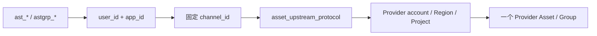

# Link 素材库与确定性解析架构

## 1. 定位与状态

平台素材库是官方或第三方可信资源控制面的中转代理，不是对象存储、URL 缓存、人脸认证平台或内容
审核机构。本文描述已接受的目标设计；当前通用 `AssetBinding`、自动物化/迁移、source fallback 和
独立真人授权实现均属于待移除旧架构。

平台不保存媒体二进制。客户使用平台身份，Provider 身份只保存在受保护执行事实中：

```text
Asset Group: astgrp_*
Asset:       ast_*
视频引用:    asset://ast_*
```

## 2. 客户与 Provider 接口

客户统一使用平台 API：

```text
POST   /v1/asset-groups
GET    /v1/asset-groups/{group_id}
GET    /v1/asset-groups
DELETE /v1/asset-groups/{group_id}

POST   /v1/assets
GET    /v1/assets/{asset_id}
GET    /v1/assets
PATCH  /v1/assets/{asset_id}
DELETE /v1/assets/{asset_id}
```

平台在南向使用渠道配置的 `asset_upstream_protocol`。客户不持有 Provider AK/SK，也不复制 Provider
Action 签名合同。裸 Provider `asset://asset-*` 不属于客户合同；控制台已有素材只能由管理员显式导入、
分配给 `user_id + app_id`，再生成 `ast_*` / `astgrp_*`。

## 3. 一对一资源模型



一个平台 Asset 或 AssetGroup 只对应一个 Provider 资源，并保存：

- `user_id + app_id` 所有权；
- 固定 `channel_id` 和素材协议；
- 稳定 Provider 账号作用域；
- Region/Project（协议需要时）；
- Provider Asset/Group ID；
- Provider status、media type 和 moderation strategy。

不建立 0..N `AssetBinding`、多渠道候选、自动物化、跨账号/区域迁移或 source/binding fallback。

创建素材时的客户模型只用于找到唯一 Seedance Channel；素材不永久绑定该模型。同一 Channel、账号、
Region、Project 下的其他兼容 Seedance 模型可以复用。

## 4. 国内与海外

国内火山与海外 BytePlus 的账号、Region、Project、权益、审核和真人认证不互通。同一媒体若需要在
两个区域使用，必须分别创建两个平台素材并分别经过上游处理。

客户不在 Token、Group 或请求字段中选择 `cn/global`。不同线路已经使用不同客户模型名，模型页面
直接表达国内、海外或第三方产品。

当前官方素材实现只验证了 BytePlus 固定 Host 和相关真人图片流程，不能通过替换 Base URL/Region
声称兼容国内火山。国内协议必须取得并验证独立的 Host、签名、Project、权益和认证合同。

## 5. 凭据与账号边界

官方直连可以同时需要：

- 视频 Bearer API Key；
- 素材 AK/SK；
- Region 和 Project。

第三方中转通常只需要 Base URL、平台 Key、视频协议、素材协议和模型映射，不重复要求已经由上游
代理的 AK/SK、Region 或 Project。管理表单按协议显示普通字段，并保留 NEWAPI 的
`param_override` / `header_override`。

素材绑定稳定 Channel 和账号作用域，不绑定包含 Secret 的 credential fingerprint。同账号轮换 Key
或 AK/SK 后既有素材继续可用；改变账号、Project、Region、国内/海外类型或素材协议必须新建渠道。

## 6. 创建 Asset

### 6.1 路由与请求

客户提交客户模型、可访问 URL、可选 `astgrp_*`、media type 和 Provider 支持的 moderation。模型只
确定唯一 Channel；`asset_upstream_protocol=none` 时直接返回“该模型不支持素材库”，不扫描其他
渠道。

每次 POST 表示创建一个新资源。不建立素材幂等键、请求 HMAC、自动重试或重复资源检测。

### 6.2 源 URL 生命周期

平台可以在发送 Provider `CreateAsset` 前作用域加密保存源 URL。取得可信 Provider Asset ID 后立即
删除；创建失败时同样立即删除，不等待 Provider 状态变为 Active。

后续使用只依赖 Provider Asset ID。资源失效时不回退源 URL、不自动重建、不迁移到其他渠道或区域。

### 6.3 moderation

- 平台传递上游定义的 moderation 语义；
- 不自行判断账号是否有权使用 `Skip`；
- adapter 不支持时明确失败，不静默删除字段；
- 保存实际策略；
- `active` 只表示 Provider 按该策略接受资源，不代表平台完成全面法律或内容审核。

## 7. 查询、列表和删除

- `POST /v1/assets` 取得可信 ID 后返回 `processing`；
- `GET /v1/assets/{id}` 调用固定 adapter 刷新 Provider 状态；
- `GET /v1/asset-groups/{id}` 按需刷新认证/Group 状态；
- 列表以本地主数据库为主，不逐项调用 Provider；
- 删除使用固定 Channel 和 adapter，不重新路由。

素材管理不建立 `create_unknown` / `delete_unknown`：

- 创建未取得可信 Provider ID：请求失败，本地记录 failed，脱敏技术日志用于排障；
- 可能的 Provider 孤儿资源由管理员通知技术人员分析，不建设核查页面或自动扫描；
- 删除未明确成功：返回失败并保留原状态；
- 后续 GET 明确确认 Provider 不存在后才更新为 deleted。

## 8. 视频解析

ModelArk V3 请求可以同时包含 `asset://ast_*`、HTTP/HTTPS URL 和 Data URL。只要含平台素材：

1. 校验 `user_id + app_id` 所有权和 active 状态；
2. 客户模型确定的 Channel 必须等于素材固定 Channel；
3. 多个素材必须属于同一账号、Region 和 Project；
4. Resolver 把 `asset://ast_*` 改写为真实 Provider 资源引用；
5. 普通 URL/Data URL 与素材一起发送到这个唯一 Channel。

不一致时返回：

```text
asset_channel_mismatch
asset_scope_conflict
```

这些是所有权和 Provider 作用域校验，不是 SKU capability、publication 或候选分发门禁。

## 9. AssetGroup 与真人认证

真人认证是 `AssetGroup` 的一种上游创建方式。adapter 创建 Provider 认证/邀请并直接返回官方或第三方
`verification_url` / QR。客户直接访问上游页面，平台按需 GET Provider 状态。

平台只保存租户、固定 Channel、Provider Group ID、状态和必要的短期查询句柄；不保存人脸媒体、
身份证件、活体数据、人脸特征或授权表单。详见
[素材组与真人认证代理架构](真人素材授权与撤回架构.md)。

## 10. 最小状态

Asset：

```text
creating -> processing -> active | failed
active -> deleting -> deleted | active
```

AssetGroup：

```text
creating -> verifying -> active | failed | expired
active -> deleting -> deleted | active
```

状态保持能够表达 Provider 真实结果的最小集合，不增加后台持续轮询、自动迁移、复杂
`AssetOperationJob` 或管理员核查状态。

## 11. 安全不变量

1. 所有资源按 `user_id + app_id` 隔离。
2. 一个平台资源只对应一个固定 Channel 和一个 Provider 资源。
3. 国内、海外、账号和 Project 之间不自动迁移。
4. 裸 Provider 资源 ID 不进入客户合同。
5. 平台不保存媒体二进制、人脸材料、凭据或完整签名 URL。
6. 源 URL 在取得 Provider ID或创建失败后立即删除。
7. 素材失败不建立视频级 unknown 对账机制。
8. Resolver 只做所有权、状态和确定作用域转换，不参与选渠。

## 12. 相关文档

- [Seedance 统一北向合同架构](Seedance统一北向合同架构.md)
- [Link 视频服务合同与异步任务架构](Link视频服务合同与异步任务架构.md)
- [素材组与真人认证代理架构](真人素材授权与撤回架构.md)
- [ADR-0016](decisions/0016-Seedance专用渠道与确定性素材代理.md)
