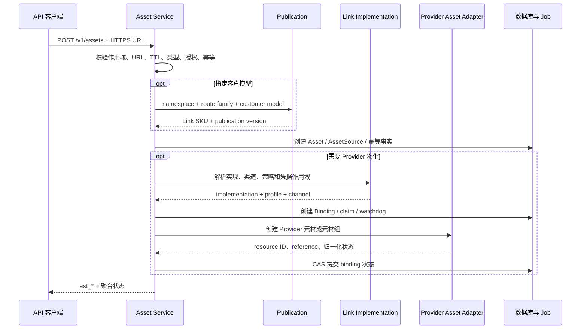

# Link 资源合同与解析架构

Link 资源是 new-api 面向客户提供的稳定逻辑媒体身份。客户使用 `ast_*` 或 `asset://ast_*`，平台在
内部根据客户模型 publication、Link 实现能力、所有权、授权、渠道账号和 URL 有效期，将其解析为
Provider 托管引用或受保护源 URL。

平台不是对象存储服务：不保存媒体二进制，不把 Provider 资源 ID 暴露为客户合同，也不承诺所有
Provider 都具备相同的素材生命周期。

## 1. 范围与当前边界

本文负责：

- `Asset`、`AssetSource`、`AssetBinding` 的职责和生命周期；
- `/v1/assets` 客户合同与 `asset://ast_*` 使用语义；
- Link Resolver 的选渠前约束和发送前改写；
- Provider 素材 adapter、账号指纹、source/binding 双路径；
- 创建、迁移、删除、后台任务、TTL、安全和审计边界。

真人身份认证、任务使用 reservation、撤回和内容回源门禁由
[真人素材授权与撤回架构](真人素材授权与撤回架构.md)负责。请求级 HTTP/HTTPS URL 或 Data URL
不创建 Link 资源，也不获得本文的复用、迁移、撤回和治理能力。

当前代码已经实现 `AssetSource` 作用域加密、0..N binding、binding/source Resolver、查询时聚合状态、
显式 Link implementation、publication 快照、渠道账号围栏和后台 operation job。图片 Link 资源尚未
发布：现有图片 capability 均为 `supports_link_assets=false`，图片 Router 未接入 Resolver。

代码存在不等于生产发布。Provider 托管生命周期、外部数据库和目标渠道仍必须完成真实环境验收。

## 2. 客户资源与内部执行事实

```text
Asset（ast_*，客户逻辑身份）
  ├─ 所有权 / app / asset_kind / media_type / 聚合状态
  ├─ 客户模型与 publication 快照
  ├─ 0..1 AssetSource
  │    └─ 作用域加密 URL + expires_at
  ├─ 0..N AssetBinding
  │    ├─ implementation ID/version/hash + policy
  │    ├─ channel + profile + credential fingerprint
  │    ├─ Provider resource/reference + 状态
  │    └─ ownership claim
  └─ 0..1 真人授权引用
```

| 对象 | 权威职责 | 不承担的职责 |
| --- | --- | --- |
| `Asset` | 客户稳定身份、所有权、类型、publication、聚合状态和迁移谱系 | 不保存媒体字节、完整 URL 或上游 ID |
| `AssetSource` | 不可变的受保护执行源，也是创建 binding 的原始输入 | 不是独立客户资源、内容指纹或长期素材档案 |
| `AssetBinding` | 某实现、渠道、凭据作用域下的 Provider 托管映射 | 不允许客户直接创建或读取上游资源 ID |
| ownership claim | 证明 Provider 账号作用域中的对象只由一个本地 Asset 认领 | 不替代用户所有权或真人授权 |
| `AssetOperationJob` | 驱动轮询、删除、更新和未知创建 watchdog | 不决定客户合同或资源所有权 |

`Asset` 是聚合根。source 与 binding 是两种执行路径，不是两类客户资源；同一个 `ast_*` 可以在
不同候选渠道上选择不同路径。

## 3. 客户接入合同

### 3.1 创建

```text
POST /v1/assets
  -> 鉴权与 user/app 作用域
  -> 校验 HTTPS URL、类型、TTL、授权和幂等
  -> 可选客户模型 publication 解析
  -> 创建 Asset + AssetSource
  -> 可选选择 Link implementation 与渠道物化 binding
  -> 返回 ast_*
```

创建请求可以不指定 `model` 或 `target`，此时建立供应商中立的 `Asset + AssetSource`。指定 `model`
时，值是客户模型名；系统从 publication 冻结 contract namespace、route family、Link SKU 与 version，
不能从当前渠道候选反向猜 SKU。

指定管理目标时只接受规范 target。Provider profile、渠道类型、Base URL 或 Key 格式不能产生 Link
实现身份；可物化 binding 必须来自代码注册的 implementation 和精确 execution binding。

`Idempotency-Key` 的作用域为 `user + app + endpoint + key`：

- 同键同请求返回原 `ast_*` 和当前聚合状态；
- 同键不同请求返回冲突；
- 数据库只保存 key 摘要与规范请求 HMAC；
- 创建结果未知时不自动换 Key 或 Provider 重建；
- watchdog 到期后关闭本地创建并保留潜在 Provider 孤儿风险。

### 3.2 使用

客户在已声明支持 Link 资源的类型化媒体字段中使用：

```text
asset://ast_xxx
```

客户不能提交裸 `ast_*` 让 Converter 猜语义，也不能直接提交 Provider 素材 ID。使用资格由对应公开
SKU capability 声明，包括支持的素材类型、数量、真人要求、是否允许 source/binding，以及能否与
请求级媒体混用。

### 3.3 查询、迁移与删除

- 查询返回平台身份、类型、聚合状态、授权引用和脱敏 binding 摘要，不暴露完整 source 或 Provider ID；
- 迁移创建新的 `ast_*`，通过 `supersedes_asset_id`、batch 和 reason 保留谱系，不原地换源或改绑；
- 删除先使本地资源不可引用，再异步清理 Provider 对象；
- 删除 Asset 不删除客户自己的 OSS/CDN 源对象；
- 无法证明 Provider 对象已删除时不能向客户投影已完成清理。

## 4. 控制面创建与 Provider 物化



上游明确拒绝时 binding 进入失败；网络结果不确定时进入 `create_unknown`，禁止自动重建。删除或
撤回与上游创建并发时，晚到结果只能补记并进入清理，不能把本地资源复活为 ready。

## 5. Provider 中立 Resolver

### 5.1 两种解析模式

| 模式 | Provider 能力 | 输出 | 资格 |
| --- | --- | --- | --- |
| `upstream_binding` | Provider 有完整素材创建、查询和删除生命周期 | 上游资源引用 | binding active，implementation/profile/账号指纹匹配，授权有效 |
| `source_url` | Provider 在任务请求中自行抓取 HTTPS URL | 解密后的源 URL | source 可解密，声明 TTL 足够，授权有效 |

Resolver 是 `asset://ast_*` 到 Provider 引用的唯一转换权威。Converter 只消费 Resolver 输出，不自行
读取数据库、解密 URL、猜测上游 ID 或绕过授权。

### 5.2 选渠与发送前复检

```text
客户模型 publication
  -> SKU capability
  -> 候选 implementation
  -> Asset 所有权 / app / 状态 / 类型 / 授权
  -> publication 一致性
  -> binding 或 source 可用路径
  -> 多素材渠道与实现交集
  -> 常规 Ability / 分组 / 优先级 / 权重分发
  -> 发送前复检并改写引用
```

Resolver 按以下顺序执行：

1. 从本次请求冻结的 publication 确定 Link SKU；
2. 校验所有 Asset 的 user/app、状态、媒体类型、publication 和真人授权；
3. 解析代码注册的候选 implementation 及资源能力；
4. 为每个 Asset 生成 active binding 或有效 source 候选；
5. 对多素材求共同可执行渠道/实现交集；
6. 将交集交给既有渠道分发器；
7. 每次 Provider 尝试前复检 publication、实现版本、渠道、凭据指纹、binding 状态、授权和 TTL；
8. 将平台引用改写为精确 Provider 引用。

没有交集、实现退役、凭据变化、source 失效或授权撤回时 fail closed。Resolver 不在失败后把 Link
资源降级为请求级 URL，也不跨渠道偷换客户请求。

## 6. Provider 实现与凭据隔离

Link implementation 注册资源解析模式、允许的 SKU、渠道类型、profile、adapter、素材限制和最小
TTL。profile 只描述协议形状，不能独立授予 Link 身份。

当前 Provider 素材适配形状包括：

| asset profile | 主要用途 | 凭据边界 |
| --- | --- | --- |
| `ark_assets` | Ark 兼容素材、素材组和认证 | 渠道 Bearer/平台 Key 作用域 |
| `relay_assets` | 第三方中转素材创建与引用 | 中转渠道 Key |
| `joycreator_assets` | 管理素材库，不参与视频路由 | management-only |
| `official_action_assets` | BytePlus 官方 Action 素材与真人认证 | 独立 AK/SK + Project + Region |

BytePlus 视频模型 API Key 保存在 `Channel.Key`，官方素材 AK/SK 保存在一对一敏感凭据模型中。两类
adapter 共享渠道身份但消费不同凭据；读取接口不回显 AK/SK，轮换和清除使用显式管理动作。

binding 冻结 implementation ID/version/hash、channel、profile、credential fingerprint 与 publication。
渠道 Key、Base URL、素材凭据、Project、Region 或 profile 改变后，旧 binding 失去路由资格；存在
活动资源时，生命周期栅栏可以阻止破坏性轮换和删除。

## 7. 生命周期与后台任务

Asset 公共状态是 source 与全部 binding 在查询时点的聚合投影：

```text
creating -> processing -> ready
    |            |          |
    +-> create_unknown      +-> deleting -> deleted
    +-> failed                  \-> deletion_failed
```

binding 使用更细的 `creating/create_unknown/processing/active/failed/stale_credential/deleting/
deletion_failed/deleted`。只有 ready Asset 的可用路径能参与解析。

聚合规则：

- 任一 active binding 或有效 source 存在时，资源可解析；
- source 过期只关闭 `source_url`，不删除仍可用 binding；
- 凭据或实现版本漂移只关闭对应 binding；
- 真人授权失效高于技术路径可用性，立即关闭新的解析；
- 逻辑删除后所有路径均不可用于新请求。

`AssetOperationJob` 通过租约、CAS、有上限重试和退避驱动 `poll_binding`、`update_binding`、
`delete_binding`、`delete_group` 和创建 watchdog。关闭素材创建开关后，已开始的轮询、删除、撤回和
watchdog 仍须继续，避免生命周期永久停留。

## 8. URL、TTL 与安全边界

平台只执行提交前控制面校验：HTTPS、无 userinfo、长度受限、明显非公网目标拒绝以及当前 DNS
结果检查。平台不主动 GET/HEAD，因此不能证明 URL 可访问、媒体类型正确、无重定向或无 DNS
rebinding；Provider 仍负责最终抓取安全。

`AssetSource` 只保存 `asset-source:<public_id>` 作用域认证加密 URL 和客户声明的 `expires_at`：

- 不增加独立公开 ID、业务状态、URL HMAC、全局去重或后台刷新；
- URL 不得进入响应、普通日志、metrics、trace、Task 或 job payload；
- 已声明有效期时，选渠和每次发送前都必须满足实现最小 TTL；
- `expires_at=0` 表示有效期未知，按 best-effort 处理，不表示永久有效；
- 换源创建新 `ast_*`，不原地修改密文；
- Asset 删除时一并删除 source。

所有查询和修改以 `user_id + app_id` 过滤。Provider ID、凭据指纹、完整签名 URL、上游响应和私有
连接事实只在受保护持久化与管理员审计中使用。

## 9. 可观测性与架构不变量

审计至少能够关联 customer model、publication version、Link SKU、implementation、channel、profile、
解析模式、binding、TTL 分类、授权状态和失败原因，但普通用户只看到稳定平台错误。

必须保持：

1. `ast_*` 是唯一客户资源身份，Provider ID 不是客户合同。
2. 平台不保存媒体二进制，完整 source URL 只存在于作用域密文。
3. AssetSource 与 AssetBinding 是同一资源的执行路径，不是独立客户对象。
4. publication 改绑不重解释既有 Asset/Binding。
5. Resolver 是 `asset://` 的唯一转换权威，Converter 不自行解析。
6. 多素材请求使用全部资源的可执行渠道/实现交集。
7. ownership、app、publication 和真人授权检查先于技术引用解析。
8. 实现、渠道、凭据或 TTL 不匹配时 fail closed，不提供 alias、双读或 fallback。
9. 迁移和换源创建新 `ast_*`，并保留谱系。
10. 创建未知、删除失败和 Provider 孤儿风险必须耐久记录、可恢复、可审计。
11. 所有模型、事务、锁和 job 查询兼容 SQLite、MySQL 与 PostgreSQL。

## 10. 相关文档

- [Link 服务合同概念与协作关系](Link服务合同概念与协作关系.md)
- [Link 服务合同注册与履约架构](Link服务合同注册与履约架构.md)
- [真人素材授权与撤回架构](真人素材授权与撤回架构.md)
- [Link 视频服务合同与异步任务架构](Link视频服务合同与异步任务架构.md)
- [素材库对接指南](../30-engineering/素材库对接指南.md)
- [02 视频与素材渠道运维手册](../40-operations/02-视频与素材渠道运维手册.md)
- [04 素材库验收操作手册](../40-operations/04-素材库验收操作手册.md)
- [ADR-0005：官方 Action 素材凭据隔离](decisions/0005-官方Action素材凭据隔离.md)
- [ADR-0009：请求级媒体与平台托管素材双路径](decisions/0009-请求级媒体与平台托管素材双路径.md)
- [ADR-0015：Link 服务合同发布与实现身份绑定](decisions/0015-Link服务合同发布与实现身份绑定.md)
