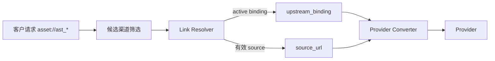

# Link 资源虚拟素材库架构

## 1. 目的、权威性与当前状态

本文定义 Link 资源虚拟素材库的正式产品与架构边界，是下列问题的当前权威说明：

- 客户创建和使用 Link 资源时获得什么稳定合同；
- 平台如何统一 FunCloud、Moxing、官方等不同 Provider 的素材消费方式；
- Link 资源如何由逻辑身份、受保护源引用和上游 binding 组成；
- 选渠、解析、授权、有效期和安全边界如何协同；
- 哪些能力属于公开 SKU，哪些能力只属于渠道实现。

[ADR-0015](decisions/0015-Link公开SKU与实现身份版本绑定.md) 已接受本文所描述的架构，并沿用
ADR-0014 的最小 AssetSource 与双模式 Resolver，同时将内部能力归属收敛到显式实现 ID/version，
并覆盖已登记图片 SKU。截至 2026-08-03，代码已完成持久化 `AssetSource`、binding/source 双模式
Resolver、查询时 Asset 聚合状态、当前 binding 的实现/策略/凭据围栏、公开/内部能力分层和显式
实现版本接线；运行时可用性仍以渠道启用状态、Ability、分组、
价格和外部 Provider 验收为准。实施过程与外部验收门禁见
[Link 资源虚拟素材库实施方案](../80-dev/2026-08-02-Link资源虚拟素材库实施方案.md)。

跨图片、视频和素材产品的 Link 总合同见 [Link 合同架构](Link合同架构.md)；本文只展开其中的
Link 资源子合同。

## 2. 业务目标与范围

### 2.1 业务目标

Link 资源虚拟素材库为客户提供供应商中立的素材身份：

1. 客户通过统一 `/v1/assets` 合同创建 `ast_*`；
2. 创建后只需在业务请求中使用 `asset://ast_*`，不感知 Provider 的素材 ID、素材 API 或凭据；
3. 平台可在不改变客户请求的前提下，为已登记的图片或视频 SKU 选择支持上游托管素材或仅支持
   HTTPS URL 的渠道；
4. 所有权、App 隔离、真人授权、状态、路由和审计由平台统一治理；
5. Provider 差异停留在渠道适配协议内部，不派生第二套客户素材产品。

“虚拟”表示平台托管的是逻辑身份、治理状态和可解析引用，不表示平台保存媒体二进制。

### 2.2 支持的内容类型

| 产品类型 | 业务定义 | Link 资源要求 |
| --- | --- | --- |
| AI 动漫 / AI 漫剧 | 无真人实拍参与，核心画面由 AI 生成，采用二维、三维、动态漫画等非写实视觉风格 | `asset_kind=general` |
| AI 写实 / AI 仿真人 | 无真人实拍参与，人物为虚构人物，由 AI 生成并追求真人视觉效果 | `asset_kind=general` |
| 授权真人肖像驱动 AI 生成 | 使用已取得合法授权的可识别真人肖像作为身份参考，最终人物、场景和核心画面由 AI 生成 | `asset_kind=real_person`；仅支持图片；关联有效授权 |

不支持下列业务：

- 纯真人实拍；
- 真人实拍素材为最终内容主体、AI 仅负责场景、特效、换景、增强或后期；
- 未经授权使用可识别真人的肖像、声音或其它身份特征驱动生成；
- 以 `general` 绕过真人授权或内容准入规则。

平台不下载媒体字节，因此不会仅凭媒体内容自动判定业务类别。准入声明、内容审核和发布规则由
上层应用及合规流程共同执行。

### 2.3 非目标

Link 资源虚拟素材库不承担：

- 媒体文件存储、CDN、转码、裁剪、格式转换或内容分发；
- URL 下载、GET/HEAD 探测、本地临时文件、multipart 转换桥或对象存储副本；
- 复制 Provider 的 IAM、组织、主子账号、模型开通、权益购买和官方账单能力；
- 将每个 Provider 的素材管理 API 原样暴露给客户；
- 保证一个资源在所有 Provider、所有时间点永久可用。

## 3. 核心领域模型

### 3.1 聚合模型

```text
Asset（ast_*）
  ├─ 所有权 / App / asset_kind / media_type / 状态
  ├─ 0..1 AssetSource（不可变的受保护源引用）
  ├─ 0..N AssetBinding（特定渠道与凭据下的上游托管素材）
  └─ 0..1 真人授权关联
```

| 对象 | 职责 | 客户是否可见 |
| --- | --- | --- |
| `Asset` | 平台稳定逻辑身份与治理根对象 | 可见 `ast_*`、类型、状态和安全元数据 |
| `AssetSource` | URL-only 渠道的短期执行引用，也是创建 binding 的原始输入 | 不作为独立客户资源，不暴露完整 URL |
| `AssetBinding` | 某渠道、凭据和上游作用域中的托管素材映射 | 不暴露上游 ID、凭据指纹和作用域细节 |
| 真人授权 | 证明可识别自然人形象的使用范围、期限和撤销状态 | 通过平台授权合同管理 |

`Asset` 是聚合根。`AssetSource` 与 `AssetBinding` 是两种可解析路径，不是两类客户资源。通过
当前创建 API 新建的 Asset 必须带一个 source。当前本地旧 binding-only Asset 数据不兼容读取，实施
时直接清理并按最新合同重新创建。任何 Asset 都必须至少存在一条实际可用路径，不能创建 source 与
binding 都为空的壳对象。

### 3.2 AssetSource 的最小边界

`AssetSource` 不是媒体身份、内容指纹或长期素材档案。相同 OSS 对象重新签名会产生不同 URL，
同一稳定 URL 后的内容也可能变化；平台不下载字节，因此不使用 URL 或 URL HMAC 判断“同一媒体”。
平台资源身份只由 `ast_*` 表达，source 只在以下场景使用：

- 为 managed-assets Provider 创建上游 binding；
- 在 URL-only Provider 执行任务时恢复实际 HTTPS URL。

最小 source 记录只需要所属 Asset、认证加密 URL 和客户声明的过期时间，不具有公开 ID、独立状态、
错误字段或生命周期任务。

创建成功后不得原地替换 `AssetSource` URL。原因包括：

- URL 变化可能意味着内容、所有权、授权和风险边界变化；
- 原地覆盖会让历史任务无法证明当时使用的输入；
- 旧 binding 与新 source 可能不再代表同一媒体；
- 幂等和撤销语义会变得含糊。

需要换源、刷新签名 URL 或迁移作用域时，应创建新的 `ast_*`，并通过显式迁移关系记录来源。

## 4. 客户 API 合同

### 4.1 创建

客户使用 JSON 和公网 HTTPS URL 创建资源：

```http
POST /v1/assets
Content-Type: application/json
Idempotency-Key: <opaque-key>
```

```json
{
  "asset_kind": "general",
  "media_type": "image",
  "model": "seedance-byteplus",
  "source": {
    "type": "url",
    "url": "https://example.com/object?...",
    "expires_at": 1785686400
  }
}
```

合同要求：

- `source.type` 当前只支持 `url`；
- `source.url` 必须是符合平台安全策略的公网 HTTPS URL；
- `expires_at > 0` 表示客户声明的绝对过期时间；`0` 表示有效期未知，不表示永久有效；
- 平台不解析或猜测厂商签名参数，未知有效期按 best-effort 使用；
- `model` 或 `target` 是可选的 binding 预创建提示，不是 Asset 身份的一部分；
- 未提供提示时可只创建 `Asset + AssetSource`；
- 创建响应和后续查询不得回显完整源 URL。

创建成功表示平台已经建立逻辑资源，并且按平台当时已知条件至少存在一种可解析路径；不表示
平台已访问源 URL，也不表示所有候选渠道都已预先创建 binding。

### 4.2 使用

创建后，客户在图片或视频公开 SKU 已声明支持 Link 资源的请求字段中统一传入：

```text
asset://ast_xxx
```

客户不需要知道最终渠道采用 `upstream_binding` 还是 `source_url`，也不需要在每次任务中重传
创建 URL。请求级 HTTPS URL 仍是一条独立便捷路径，但不进入素材库，不获得 `ast_*` 的复用、
授权和治理语义。一个媒体集合默认不得混用请求级 URL 与 Link 资源，避免生命周期与选渠规则
含糊。

### 4.3 查询、删除与迁移

- 查询返回平台身份、资产级状态、类型、授权引用和 binding 摘要，不建立独立 source 状态合同；
- 删除按平台逻辑删除语义执行，并异步清理可清理的上游 binding；
- 删除不得把上游清理失败伪装成已完成；
- 迁移会创建新的 `ast_*`，不会刷新或覆盖原 AssetSource；
- 同一当前实现版本内已创建的任务继续引用创建时的资源和解析审计，不随客户发起的换源/迁移重写；
  实现版本硬切换前则直接清理本地旧任务，不为旧版本保留执行入口。

## 5. Provider 中立解析架构

### 5.1 两种解析模式



| 模式 | 适用渠道 | 解析结果 | 主要有效性条件 |
| --- | --- | --- | --- |
| `upstream_binding` | Provider 有完整素材创建、查询、删除生命周期 | 上游素材 URI 或资源 ID | binding active、凭据指纹/作用域匹配、授权有效 |
| `source_url` | Provider 可在任务请求中自行抓取 HTTPS URL | 解密后的原始 HTTPS URL | 已声明过期时间时未过期且 TTL 足够；未知有效期时 best-effort；授权有效 |

同一资源可以在不同候选渠道上使用不同模式。Resolver 是 `asset://ast_*` 到 Provider 引用的
唯一权威；Converter 只负责已解析引用到具体协议字段的转换，不得自行访问数据库、挑选 source
或绕过授权检查。

### 5.2 解析顺序与路由

对每个候选渠道，平台按以下语义判断可解析性：

1. 校验 Asset 所有权、App、逻辑状态、媒体类型和真人授权；
2. 如果渠道支持并存在作用域匹配的 active binding，优先使用 `upstream_binding`；
3. 否则，如果渠道声明支持 `source_url`，且已声明的过期时间满足 TTL 或有效期未知，使用受保护源 URL；
4. 两条路径均不可用时，该渠道退出候选；
5. 请求包含多个 Link 资源时，渠道必须对全部资源都可解析，不能分资源选择不同渠道；
6. 选渠后、真正发送前再次检查状态、授权和 TTL，防止排队或重试期间条件失效。

Resolver 不在失败后把 Link 资源静默降级为另一条客户路径，也不跨渠道偷换请求。没有候选渠道时
返回稳定、可诊断的资源不可解析错误。

### 5.3 binding 与 source 的生命周期关系

- binding 是已在上游物化的资源；建立成功后，源 URL 过期不会自动使该 binding 失效；
- `source_url` 没有上游持久资源，源 URL 是每次任务的数据路径，过期后该模式立即不可用；
- `expires_at=0` 只表示平台无法提前判断有效期；Provider 抓取失败按普通上游失败处理；
- 当 source 过期但仍有 active binding 时，Asset 仍可为 `ready`；
- 当所有解析路径都不可用时，Asset 不得继续对任务路由宣称 `ready`；
- binding 的凭据、项目、region 或其它作用域变化时，不得复用不匹配的上游 ID。
- binding 只允许在创建它的当前精确实现 ID/version/content hash 和凭据作用域内复用；
- 每个 Asset 持久化一条最小 `AssetSource(asset_id, encrypted_url, expires_at)`；URL 使用
  `asset-source:<public_id>` scope 的 v2 envelope 加密，legacy unscoped envelope 一律拒绝；
- `model` 与 `target` 是互斥的可选预物化提示；两者都缺失时创建 source-only Asset，不创建 binding；
- 开发期确认实现升级后，直接删除本地旧版本注册和专属代码，清理旧 binding、Task、attempt 与
  exposure 数据，再按当前版本重新物化；旧 binding 不迁移、不兼容读取，也不形成清理专用执行链；
- Resolver 只识别代码注册的唯一当前版本，不实现历史版本解析、双读、alias 或 fallback。

因此，“客户以后只使用 Asset”是客户合同；“平台是否仍需 source”由实际解析模式决定。平台不能
因为已发放 `ast_*` 就假设 URL-only 渠道永久可用。

## 6. 能力模型与发布约束

### 6.1 公开 SKU 能力

客户可见的 `VideoSKUCapability` 与最小 `ImageSKUCapability` 只表达稳定 Link 合同，例如：

- 是否支持 Link 资源；
- 支持的资源媒体类型、数量和组合；
- 是否要求真人授权；
- 请求级 URL 与 Link 资源是否允许混用。

`supports_link_assets` 是各产品公开 SKU 的能力权威，并参与对应公开能力版本和内容哈希。它不
承诺特定 Provider 存在持久素材库，也不暴露解析模式。图片继续复用统一 NEWAPI 图片 DTO、路由、
Task 和计费；引入图片 capability 不得派生第二套 Provider 专属图片 API。

### 6.2 渠道实现能力

已注册 `link_implementation_id + link_implementation_version` 的内部能力独立表达：

- `supports_managed_assets`；
- `asset_resolution_modes`；
- `asset_source_min_ttl_seconds`；
- 支持的媒体类型、数量、凭据和作用域要求。

这些字段不进入公开 SKU 内容哈希，否则两个能够实现同一客户合同、但内部解析方式不同的实现会被
错误判定为不等价。channel type、profile、converter 和 adapter version 是实现注册项的适配条件；
profile 只描述协议形状，不能单独授予 Provider 身份或 Link 资格。Ability 发布和运行时路由必须
验证“渠道绑定的精确实现版本完整覆盖公开 Link 能力”；覆盖不了就排除实现或拆分公开 SKU，不得
靠 Converter 丢字段或运行时猜测。

同一公开 SKU 可以关联多个已验证等价实现；实现 ID 不参与公开 capability 等价比较。一个实现也
可以覆盖多个公开 SKU，但必须逐一证明其公开能力覆盖。binding、credential fingerprint、Task、
create attempt 和 exposure 冻结实现 ID/version，防止当前部署中渠道配置漂移。

新任务、Task、binding 和渠道校验只读取代码注册的唯一当前实现版本。Task 冻结版本不用于兼容已从
本地代码删除的旧实现。开发期升级先清理本地旧数据，再一次性切换注册表和代码；不保留历史声明或
旧 adapter/parser。

### 6.3 Provider 能力矩阵

| Provider 类型 | `upstream_binding` | `source_url` | 客户体验 |
| --- | --- | --- | --- |
| 具有完整素材生命周期的官方/Moxing 类已登记实现 | 可支持 | 可按合同选择支持 | 创建后统一使用 `asset://ast_*` |
| FunCloud 当前普通视频合同 | 不支持 | 支持请求级 HTTPS URL | 通过 Link Resolver 消费源引用，客户仍使用 `asset://ast_*` |
| 只接受 multipart 字节且不能抓取 URL 的渠道 | 不支持 | 不支持 | 不得接入当前 Link 资源合同 |

Provider 能力必须以已验证文档和实测为准。FunCloud 的 `realPersonMode` 目前存在语义冲突：一处
描述为图中真人驱动，另一处限制输出不得与现实自然人雷同。在获得 Provider 书面澄清并完成授权、
计费、审核和端到端验收前，不得配置公开 SKU、Ability 或 `supports_link_assets=true`；对外文案也
不得断言其人物必然对应或不对应现实自然人。

## 7. 状态、有效期与错误语义

### 7.1 状态判定

Asset 的对外状态是查询时点的聚合状态，不能简单复制 source 或某个 binding 的状态：

| 条件 | 聚合语义 |
| --- | --- |
| 至少有一条当前可解析路径 | `ready` |
| 正在创建必要 binding，且没有其它可用路径 | `processing` |
| source 与全部 binding 均不可用 | `failed` 或 `expired`，按原因区分 |
| 已逻辑删除或授权撤销导致整体禁止使用 | 不可解析 |

source 的过期只关闭 `source_url` 路径；不得级联删除仍可用的 binding。真人授权失效则是更高层的
治理条件，即使技术引用仍有效也必须 fail-closed。

`ready` 表示查询时点至少存在一条资产级可用路径，不保证任意公开 SKU、任意候选渠道或任意多个
Asset 组合都可执行。请求是否可提交以渠道对全部资源的交集计算和发送前二次校验为准。

### 7.2 签名 URL 与 TTL

当客户提供 `expires_at > 0` 时，平台至少在以下两个时点校验：

1. 创建或预创建 binding 时，剩余 TTL 足以完成预计上游抓取；
2. 任务发送前，剩余 TTL 满足所选渠道的最小 TTL。

`expires_at=0` 表示有效期未知：平台不将其宣传为永久可用，只在发送时 best-effort 交给 Provider。
平台不解析各 OSS 厂商的签名参数来推测有效期，不通过 GET/HEAD 延长或验证 URL，也不在 Task、
幂等响应或普通审计中保存可恢复明文。短期一次性 URL 若不能支撑后续任务，应直接使用请求级 URL，
或在有效期内先完成可独立存活的 managed binding。

### 7.3 稳定错误分类

客户错误必须区分至少以下原因：

- Asset 不存在、无权访问或 App 不匹配；
- Asset 类型或媒体组合不符合公开 SKU；
- 真人授权缺失、过期或撤销；
- source 已过期或 TTL 不足；
- 选中作用域没有 active binding；
- binding 的实现 ID/version/content hash 与候选渠道不一致，或对应实现已不允许新执行；
- 没有渠道能同时解析请求中的全部资源；
- Provider 创建、查询、删除或抓取失败。

对外错误不得泄露源 URL、上游素材 ID、凭据指纹和内部候选渠道清单。

## 8. 安全与合规约束

### 8.1 源引用保护

完整 source URL 必须：

- 使用现有持久密钥派生的、绑定 `asset_id` scope 的认证加密封装持久化；
- 解密后只在解析和发送所需的最短内存生命周期存在；
- 不进入响应、日志、Task 快照、错误正文、指标标签和普通管理员页面；
- 解密失败时只关闭 `source_url` 路径并告警，不影响独立存活的 active binding；
- 随 Asset 删除一并删除；过期后不再解密，不建立独立保留期或后台清理状态机。

创建幂等继续使用规范化完整请求的作用域 HMAC，不在 AssetSource 上增加 URL HMAC、全局去重或
“同一媒体”判断。平台不为短期 source 建设独立密钥注册表和密文迁移系统。

平台仍须在创建时执行 URL 结构与 SSRF 安全校验。由于平台本身不抓取 URL，Provider 的实际抓取
风险还必须通过渠道准入、域名策略和 Provider 合同治理，不能误称已由平台下载器隔离。

### 8.2 所有权与授权

- Asset 的用户、App 与请求上下文必须匹配；
- binding 必须匹配选中渠道的凭据指纹及项目/region 等作用域；
- `real_person` 必须关联当前有效且作用域覆盖的授权；
- 授权撤销后，新任务必须立即停止解析，已有任务按任务与合规策略处理；
- 客户 metadata、extra 或 Provider 私有字段不得绕过公开 DTO 注入授权或解析模式。

## 9. 可观测性与审计

每次解析应记录不可逆、安全的结构化结果：

- `asset_id`、公开 SKU、实现 ID/version、渠道/profile；
- 采用的解析模式；
- binding 标识；采用 `source_url` 时只记录解析模式，不记录 URL 或 URL 指纹；
- source 剩余 TTL 分段、授权状态和失败分类；
- 选择、二次校验、发送和 Provider 响应的关联 ID。

指标至少覆盖各解析模式成功率、无可解析渠道、TTL 不足、binding 作用域不匹配、授权拒绝、
Provider 抓取失败和上游清理失败。日志脱敏规则必须在错误路径和重试路径同样成立。

## 10. 架构不变量

1. 客户只持有平台 `ast_*`，Provider 差异不得进入客户 API。
2. `Asset` 是稳定逻辑身份；source 与 binding 都只是内部解析路径。
3. 平台不下载、不托管媒体字节，不保留 multipart 兼容链路。
4. 完整 source URL 只作为短期执行引用加密保存，不参与资源身份、去重或客户状态合同。
5. `upstream_binding` 优先于 `source_url`；选渠和发送前均须校验。
6. source 过期不使独立存活的 active binding 失效。
7. 真人授权和所有权校验先于技术引用解析，失败时必须 fail-closed。
8. 公开 `supports_link_assets` 与内部 `supports_managed_assets` 不得混为一谈。
9. Converter 不解析裸 `asset://ast_*`，Resolver 是唯一引用转换权威。
10. 换源和作用域迁移创建新 `ast_*`，不原地刷新 AssetSource。
11. `expires_at=0` 表示有效期未知和 best-effort，不表示永久有效。
12. 内部解析能力归属于不可变的 Link 实现 ID/version；profile 只描述适配形状，不能创建实现身份。
13. 同一公开 SKU 可由多个能力等价实现服务；实现 ID 不进入公开 capability hash。
14. binding 只匹配代码注册的唯一当前实现版本；开发期版本升级直接清理旧 binding 并重新物化，
    不保留旧版本兼容链。
15. 本地旧 Task、binding、attempt 和 exposure 数据不迁移、不双读、不回退；new-api 上游共享代码
    仍按最小入侵原则保留。

## 11. 相关文档

- [ADR-0015：Link 公开 SKU 与实现身份版本绑定](decisions/0015-Link公开SKU与实现身份版本绑定.md)
- [ADR-0014：Link 资源源引用与双模式解析（已被 ADR-0015 取代）](decisions/0014-Link资源源引用与双模式解析.md)
- [Link 合同架构](Link合同架构.md)
- [素材代理与真人授权架构](素材代理与真人授权架构.md)
- [数据模型](数据模型.md)
- [视频上游接入与异步任务架构](视频上游接入与异步任务架构.md)
- [Link 资源虚拟素材库实施方案](../80-dev/2026-08-02-Link资源虚拟素材库实施方案.md)
- [FunCloud Seedance 2.0 中转接入分析方案](../80-dev/2026-08-02-FunCloud-Seedance-2.0中转接入分析方案.md)
