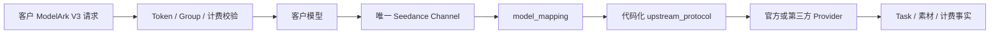
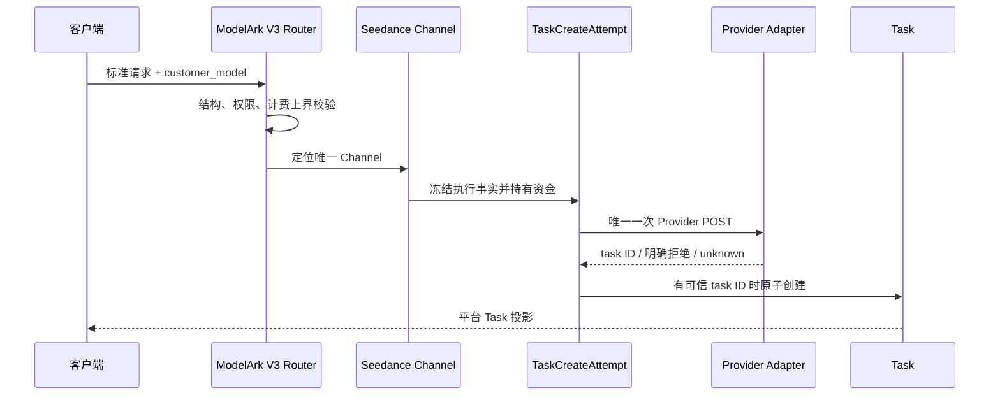

# Seedance 专用渠道与 Link 架构

## 1. 范围与状态

本文是 Seedance、ModelArk V3、代码化上游协议、异步视频任务和无状态素材代理的总体权威架构。
Provider opaque 素材 ID 与视频引用的数据流专题细节由
[Seedance 无状态素材代理架构](Seedance无状态素材代理架构.md)负责。对外能力和操作矩阵由
[Seedance 模型素材库支持矩阵](Seedance模型素材库支持矩阵.md)负责。迁移步骤、实施
清单和评审过程不进入架构正文。

当前代码已经实现本文描述的架构边界，包括无条件采集成功终态中的明确 usage/Token 数值，并按冻结
计价方式决定是否参与客户结算。具体 Provider 是否可进入生产分组，仍取决于该线路的真实视频、素材、
计费和灰度验收；“架构已实现”不等于“所有 Provider 已生产发布”。

NEWAPI 原生 `/v1/videos`、`/v1/video/generations`、Router、DTO、Provider adapter 和计费语义不属于
Seedance Link 合同，继续以上游代码为权威。

## 2. 总体边界

Seedance 使用独立业务渠道：

```text
技术类型：ChannelTypeSeedanceLink
管理名称：Seedance 专用渠道
北向视频合同：ModelArk V3
北向素材合同：/v1/assets + /v1/asset-groups
南向履约：代码注册的 video_upstream_protocol / asset_upstream_protocol
```

所有官方和第三方 Seedance 线路都属于该渠道类型，包括火山、BytePlus、飞彩、FunCloud、TokenSave
及以后经技术人员确认的兼容线路。业务类型不等于南向协议；不同 Provider 可以使用不同协议。



## 3. 身份、配置与职责

### 3.1 四个直接概念

| 概念 | 作用 | 权威 |
| --- | --- | --- |
| 客户模型 | 模型发现、Token 权限、Group、价格、日志和客户请求 | 管理员配置 |
| Channel | 凭据、Base URL、模型清单、协议和 Provider 作用域 | 主数据库 |
| Provider 模型 | 实际发送给上游的模型名 | `model_mapping` |
| 上游协议 | 请求、响应、状态、路径和素材转换 | 代码注册表 |

Link 不在这些概念之间插入 publication、Link SKU、逐模型 capability、`LinkImplementation`、
execution binding、内容 hash、Link Access Plan 或候选等价证明。

### 3.2 人与系统分工

技术人员负责线下判断某个 Provider 模型是否完整兼容现有代码协议。完全兼容时，管理员配置客户
模型、Channel、`model_mapping` 和已有协议即可上线；不兼容时，技术人员先新增代码 adapter。

系统负责请求结构、权限、计费上界、确定性路由、Task、资金、素材控制面转发和敏感信息保护。素材
opaque ID 的所有权与应用内隔离由受信调用方管理。系统不
根据模型名、价格、域名、Key 或 Provider 名称自动认证兼容性，也不让管理员编写 JSON 映射、响应
脚本或状态机。

## 4. 模型与渠道的确定关系

### 4.1 一个客户模型只对应一个已启用渠道

不同 Provider 线路必须使用不同客户模型名：

```text
customer_model
  -> Token / Group / price
  -> 唯一已启用 ChannelTypeSeedanceLink
  -> model_mapping
  -> provider_model
```

模型唯一性在新建启用渠道、保存已启用渠道、修改已启用渠道模型清单和重新启用时校验。停用渠道
可以暂存重名配置，但重新启用前必须解决冲突。系统不增加请求时复检、数据库唯一约束、启动扫描、
自动修复或并发补偿；绕过管理入口直接修改数据库形成的非法状态由管理员和技术人员处理。

### 4.2 不进入原生分发池

Seedance 客户模型不写入 NEWAPI 原生 Ability 或通用渠道分发缓存。模型发现和价格展示使用只读
投影：所有已配置客户模型均进入目录，是否可调用由 `available` / `availability` 单独表达；目录还投影
统一 ModelArk V3 北向操作、逐模型创建参数合同和客户安全素材操作矩阵。创建参数以允许字段白名单、
必填性、固定值、默认值、枚举、上下限及逐内容类型数量表达；未登记字段即不支持。该投影不能获得
`/v1/video/generations` 履约资格，也不暴露 Provider 模型、Channel、南向协议或私有路径。

通用 `GET /v1/models` 和 ModelArk 专用 `GET /api/v3/contents/generations/models` 复用该投影；后者只
筛出 Seedance 条目，不建立第二套模型事实或 Provider capability 注册表。

Priority、Weight、Affinity、随机分发、失败重选、跨渠道重试和 fallback 均不参与 Seedance 路由。
管理端不展示 Seedance 的 Priority/Weight 编辑项，并使用普通人可理解的说明告知管理员：每个模型
固定使用一个渠道，不会自动切换。

### 4.3 渠道凭据

Seedance Channel 只允许一个视频渠道凭据，不使用 Multi-Key 轮换。每次任务创建会冻结实际连接和
受保护凭据事实；后续查询、删除和结算不重新选择当前 Channel 的 Key。

## 5. 代码化南向协议

### 5.1 注册表是唯一事实源

管理员只能选择代码已经注册的协议。当前视频协议为：

```text
modelark_v3_volcengine
modelark_v3_byteplus
modelark_v3_cmcc
tokensave_media_task_v1
moxing_media_task_v1
moxing_modelark_media_v1
ark_media_v1
feicai_videos_v1
funcloud_seedance
```

当前素材协议为：

```text
none
volcengine_assets_action_v2024_01_01
byteplus_assets_action_v2024_01_01
ark_assets_v1
tokensave_assets_v1
moxing_joycreator_assets_v1
moxing_volc_assets_v1
funcloud_material
cmcc_aicc_assets_v2
```

精确枚举、路径和 transport profile 以 `relaykit/dto/upstream_protocol.go` 为代码权威。内部 transport
profile 只服务 adapter 复用和任务快照，不是第二套管理员配置协议。

### 5.2 管理字段

所有线路复用 NEWAPI 普通 Channel 字段：Name、Base URL、Key、Models、Group、`model_mapping`、
`param_override` 和 `header_override`。管理端只根据所选协议显示真正需要的素材 Region、Project、
AK/SK 和 URL TTL 等字段；第三方已经代管这些事实时不重复要求客户或管理员填写。

视频协议与素材协议必须按代码注册关系配对。火山、BytePlus、移动云、第三方素材和无素材库是互斥的
渠道形态；系统不在运行时从一个素材协议切换到另一个。

### 5.3 凭据轮换与 Provider 可见性

一个启用素材协议的 Seedance Channel 是一个管理员声明、后端冻结的素材租户边界。首次启用素材协议时
创建随机唯一 identity；同一 Channel 的所有客户模型由
`SHA-256("seedance_channel_asset_scope:v1" + "\n" + identity)` 发布相同匿名 `reuse_scope`。不同
Channel 即使 Base URL、协议和 Project 完全相同也使用不同 identity，平台不声明跨 Channel 复用。

identity 建立后，Channel Type、Base URL、视频协议、素材协议、Region 和 Project 在更新事务中不可变，
素材协议也不能原地改回 `none`。更换账号、租户或上述任一字段必须新建 Channel。Key/AK/SK 仅在管理员
显式确认“素材租户未变化”后允许轮换；后端校验确认并写入审计，但不保存凭据内容，也不声称能独立证明
新旧凭据属于同一 Provider 租户。既有 opaque ID 在该边界内的可见性仍由 Provider 判断。

## 6. ModelArk V3 北向合同

Seedance 专用渠道提供四组客户行为：

| 行为 | 接口 | 权威来源 |
| --- | --- | --- |
| 创建 | `POST /api/v3/contents/generations/tasks` | 客户模型对应的唯一 Seedance Channel |
| 查询单项 | `GET /api/v3/contents/generations/tasks/{task_id}` | Task 冻结 adapter 与连接 |
| 查询列表 | `GET /api/v3/contents/generations/tasks` | 主数据库内的 `user_id + app_id` Task |
| 删除 | `DELETE /api/v3/contents/generations/tasks/{task_id}` | Task 冻结 adapter；不支持时明确返回 |

北向入口校验 ModelArk V3 的 JSON 结构、必填字段、标准媒体节点以及 duration、分辨率、数量等计费
安全边界。adapter 再校验该南向协议的精确字段组合。不支持字段必须明确失败，不得静默删除、钳制、
降级或改义。

模型目录的 `api.video.creation.parameters` 与 `content_types` 是上述两层校验的客户安全交集：调用方可据此
生成表单或请求，但不得从客户模型后缀猜测能力。通用模型列表、单模型详情、ModelArk 专用模型列表和
价格目录复用同一投影；任何入口都不得返回南向协议、Provider 模型或渠道身份。

客户端只看到平台 Task ID、客户模型和 ModelArk V3 投影；Provider task ID、Provider 模型、渠道
凭据、连接快照和原始 Provider 响应不得进入普通响应。

`/v1/video/generations` 始终属于 NEWAPI 原生 `DoubaoVideo` 等渠道。Seedance adapter 对缺少 ModelArk
V3 合同的调用 fail closed，不能把类型 61 当成原生 Doubao 渠道使用。

## 7. 视频创建与耐久执行

### 7.1 创建主链



发送 Provider 请求字节前必须建立 durable `TaskCreateAttempt`。资金 hold、必要额度 reservation 与
`sending` 在同一事务提交；未取得可信 Provider task ID 时不得创建伪 Task。取得可信 ID 后，Task
创建、hold 转移和 attempt 完成原子提交。

### 7.2 只发送一次

每个 Seedance 创建意图只允许一次 Provider POST。系统禁止网络错误重发、换渠道重建、官方与第三方
互切，以及把结果不明当成明确失败。ModelArk V3 不增加平台自定义 `Idempotency-Key` 或
`ClientToken`；两个 POST 是两个独立创建意图。

### 7.3 `unknown`

请求已经发送但无法确认 Provider 是否创建任务时，attempt 进入 `unknown`：

- 保留资金 hold、冻结执行事实和 Provider 暴露记录；
- 不自动重发、换渠道、退款或进入 `released_with_exposure`；
- 只有技术人员确认 Provider 明确未创建后才能人工拒绝并幂等释放资金；
- 取得可信 task ID 后可以按冻结事实恢复并创建 Task。

单次轮询返回无效 JSON、未知状态、ID 不匹配或缺失结果，只能证明本次观测不可采信，不能直接把
业务任务判为失败或退款。

## 8. Task 冻结与后续操作

Task 和 create attempt 保存已经发生的事实，包括：

- 客户模型、Token、app 和北向合同；
- Channel、Provider 模型、上游协议和 adapter 版本；
- Base URL、查询路径、代理和受保护凭据；
- 请求中的 opaque 素材引用（不附加平台所有权或 Provider 作用域结论）；
- 预扣、价格、计费表达式和结算上下文。

GET、DELETE、内容回源、轮询和结算均使用冻结事实。当前 Channel 停用、模型映射变化、凭据轮换、
协议升级或管理员改价不能重新路由或重新解释历史任务。Provider 不支持删除时返回诚实的不支持
错误，不伪造取消或删除成功。

## 9. 无状态素材代理

素材控制面只代理带客户 `model` 的单资源操作，不提供列表，也不建立 Asset/AssetGroup、所有权、状态、
Channel 或 Provider 作用域映射。Provider 返回的 opaque ID 直接交给调用方保存；真人认证属于素材组的
上游流程，不形成平台独立授权域。

平台不保存 source URL 或媒体二进制，不浏览 Provider 账号资源，不建立云导入、容量分配、自动物化、
跨线路迁移、source fallback、跨 Provider 探测或素材 unknown 状态机。完整定义见
[Seedance 无状态素材代理架构](Seedance无状态素材代理架构.md)。

## 10. 素材参与视频创建

ModelArk V3 可以同时携带 HTTP/HTTPS URL、Data URL 和 `asset://<opaque-id>`。平台只验证引用非空，
不查询素材或复检所有权、应用、状态、模型、Channel、账号或 Region/Project；引用直接进入当前模型
adapter，存在性、权限、审核与兼容性由 Provider 判定。详细合同见
[Seedance 模型素材库支持矩阵](Seedance模型素材库支持矩阵.md)和[Seedance 无状态素材代理架构](Seedance无状态素材代理架构.md)。

## 11. 计费与风险

客户价格、Token 权限、Group、日志和响应使用客户模型名；Provider 模型只用于上游调用。所有影响
计费的数量和时长先校验上界，quota 转换使用统一 checked 饱和函数，饱和事件进入管理员审计。

预扣、结算、差额、退款和补偿必须幂等。客户退款与 Provider 潜在成本分账；Provider 金额未知时
保持未知，不得使用客户 quota 冒充 Provider 货币成本。共享资金状态和补偿规则由
[异步任务与计费事实架构](异步任务与计费事实架构.md)负责。

### 11.1 终态实际用量与计价单位分离

Provider 响应归一负责“如实取得实际用量”，冻结计费上下文负责“决定用什么单位结算”，两者不能由
同一个布尔开关绑定。成功终态原始响应中只要出现任何明确的 `usage` 或 Token 相关用量字段，并通过
数值类型、非负值、上界和溢出校验，就必须形成平台实际用量事实；不得再增加配置、逐模型白名单、
人工验收状态或 Provider 开关来决定是否采集，也不得从进度、金额或时长猜测 Token。

旧的共享用量开关曾把“是否采集”与“是否参与结算”混在一起；它不属于 Provider 合同，当前代码已删除，
没有替换成 Provider 配置或模型白名单。adapter 直接采集成功终态中的明确 usage/Token 数值，运行时按创建时冻结的计价方式
处理：

| 冻结计价方式 | 成功终态返回实际 Token usage | 客户结算 |
| --- | --- | --- |
| 按 Token | 有任一合法字段 | 按协议优先级归一为实际 Token，幂等重算预扣差额 |
| 按 Token | 没有合法字段 | 保留预扣估算，不凭空构造实际用量 |
| 按秒或按次 | 有合法 Token 字段 | 保存为 Provider 用量证据，但仍按冻结秒数或次数结算 |

同一响应的多个 Token 字段不得相加。优先使用最具体的输出/completion 字段；缺失时由 total 与 prompt
推导，最后才使用单独的 total。所有原始字段和来源进入私有、耐久计费证据，
完整 Provider 响应、私有 Task ID 和媒体 URL 不进入客户响应或通用日志。首次成功写入并结算的终态
用量不可被后续轮询覆盖；重复查询只做幂等确认，差异进入 Provider 合同异常审计。

## 12. 权威事实

| 事实 | 权威来源 | 变化影响 |
| --- | --- | --- |
| 新请求可用性 | Token、Group、Channel 状态与模型清单 | 只影响新请求 |
| 客户模型到渠道 | 已启用 Seedance Channel 模型清单 | 保存/启用时校验唯一 |
| Provider 模型 | `model_mapping` | 创建时冻结 |
| 南向协议 | 代码注册表 + Channel 协议选择 | 创建时冻结 |
| 视频创建与资金 | `TaskCreateAttempt` / `Task` | 后续按冻结事实执行 |
| 素材 opaque ID 与复用域 | 调用方保存 `model + id + reference`；主库保存 Channel 随机 identity，公开元数据只给匿名 `reuse_scope` | 同 Channel 模型共享 scope、不同 Channel 隔离；平台不建立 Asset/AssetGroup 事实，存在性与兼容性由 Provider 裁决 |
| 历史费用 | 冻结计费上下文与结算日志 | 不按当前价格回算 |

主数据库是 Channel、Task、资金、素材和审计的持久化事实源。Redis、进程缓存、模型发现投影和前端
状态都必须可重建。

## 13. 明确删除或不建立的复杂度

以下机制不属于当前架构，也不得以兼容名义恢复：

1. publication、Link SKU、逐模型 capability、implementation 和 execution binding；
2. Link Access Plan、改绑审计、内容 hash 和候选交集；
3. 根据模型、Channel、价格、域名或 Key 自动认证 Link 身份；
4. 一个 Seedance 客户模型对应多个渠道；
5. Priority/Weight/Affinity、失败重选、跨渠道重试或 fallback；
6. 管理员编写协议 JSON、字段映射或状态脚本；
7. 请求时重复唯一性检查、启动扫描、自动修复和低频并发补丁；
8. 通用 0..N AssetBinding、跨账号/区域迁移和 source fallback；
9. 平台人脸认证、法律授权、独立撤回域和 Provider 数据删除承诺；
10. 素材幂等、unknown 对账、孤儿扫描和管理员核查工作流。

## 14. 架构不变量

1. NEWAPI 原生合同不由 Link 识别、包装、收紧或降级。
2. 所有 Seedance 线路使用 `ChannelTypeSeedanceLink`，南向差异由代码协议表达。
3. 一个已启用客户模型只对应一个 Seedance Channel。
4. Seedance 不进入原生分发池，不使用 Priority/Weight/重试/切换。
5. 每个视频创建只发送一次 Provider POST；`unknown` 不自动退款。
6. Task 按创建时冻结的 Channel、协议、连接、素材和计费事实执行。
7. 素材 API 不提供列表或本地资源身份；opaque ID 由调用方保存，视频调用不做本地素材可用性校验。
8. 真人认证直接使用 Provider 页面，平台不保存生物识别材料。
9. 不支持字段和操作明确失败，不静默兼容或伪造成功。
10. 主数据库持有耐久事实，缓存和投影不能成为唯一权威。
11. Provider 实际用量的采集与客户计价单位分离；成功终态中的任何明确 usage/Token 数值均为合法
    用量，不得被配置、白名单或共享布尔开关静默丢弃。
12. 一个启用素材协议的 Channel 只拥有一个随机稳定 identity；同 Channel 模型 scope 相同，不同
    Channel scope 不同；边界字段不可原地修改，凭据轮换必须显式确认租户未变化。

## 15. 变更性质：Link 新增与 NEWAPI 原生边界

| 变更面 | 性质 | 说明 |
| --- | --- | --- |
| ModelArk V3 Router、Seedance ChannelType、视频/素材协议注册 | Link 专属新增 | 独立于 NEWAPI 原生视频入口，不修改原生模型识别或拒绝逻辑 |
| TaskCreateAttempt、Seedance Task 快照和 Provider usage 归一 | 共享异步底座的本地扩展 | 复用耐久 Task/计费事实；只在显式接入的 Link 任务启用 |
| `/v1/assets` 单资源代理与 `asset://<opaque-id>` | Link 专属合同优化 | 不建立本地 Asset/AssetGroup、resolver、列表或所有权事实 |
| 原生鉴权、计费和日志底座 | NEWAPI 原生能力复用 + 必要窄接线 | 仅传递合同/任务事实或调用共享服务；原生入口保持原语义 |

未来接取上游时，新增类型、协议、校验和测试应优先放在 `relay/channel/task/seedance/`、协议注册表或
新文件中；只有无法通过独立接线完成时才修改 NEWAPI 原生热路径，并记录最小接线点。

## 16. 相关文档

- [架构概览](架构概览.md)
- [Seedance 模型素材库支持矩阵](Seedance模型素材库支持矩阵.md)
- [Seedance 无状态素材代理架构](Seedance无状态素材代理架构.md)
- [异步任务与计费事实架构](异步任务与计费事实架构.md)
- [图片服务与异步 Provider 适配架构](图片服务与异步Provider适配架构.md)
- [Seedance Provider 接入设计](<Seedance模型接入设计/README.md>)
- [ADR-0008：共享异步任务计费状态机与原子补偿](decisions/0008-共享异步任务计费状态机与原子补偿.md)
- [ADR-0017：调用方自管无状态素材代理](decisions/0017-调用方自管无状态素材代理.md)
