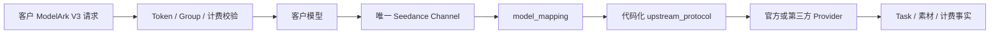
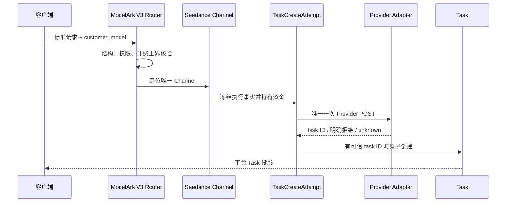

# Seedance 专用渠道与 Link 架构

## 1. 范围与状态

本文是 Seedance、ModelArk V3、代码化上游协议、异步视频任务和平台素材代理的唯一权威架构。
迁移步骤、实施清单和评审过程不进入本文。

当前代码已经实现本文描述的架构边界。具体 Provider 是否可进入生产分组，仍取决于该线路的真实
视频、素材、计费和灰度验收；“架构已实现”不等于“所有 Provider 已生产发布”。

NEWAPI 原生 `/v1/videos`、`/v1/video/generations`、Router、DTO、Provider adapter 和计费语义不属于
Seedance Link 合同，继续以上游代码为权威。

## 2. 总体边界

Seedance 使用独立业务渠道：

```text
技术类型：ChannelTypeSeedanceLink
管理名称：Seedance 专用渠道
北向视频合同：ModelArk V3
北向素材合同：/v1/assets + /v1/asset-groups
南向履约：代码注册的 video_upstream_protocol / asset_upstream_protocol
```

所有官方和第三方 Seedance 线路都属于该渠道类型，包括火山、BytePlus、飞彩、FunCloud、TokenSave
及以后经技术人员确认的兼容线路。业务类型不等于南向协议；不同 Provider 可以使用不同协议。



## 3. 身份、配置与职责

### 3.1 四个直接概念

| 概念 | 作用 | 权威 |
| --- | --- | --- |
| 客户模型 | 模型发现、Token 权限、Group、价格、日志和客户请求 | 管理员配置 |
| Channel | 凭据、Base URL、模型清单、协议和 Provider 作用域 | 主数据库 |
| Provider 模型 | 实际发送给上游的模型名 | `model_mapping` |
| 上游协议 | 请求、响应、状态、路径和素材转换 | 代码注册表 |

Link 不在这些概念之间插入 publication、Link SKU、逐模型 capability、`LinkImplementation`、
execution binding、内容 hash、Link Access Plan 或候选等价证明。

### 3.2 人与系统分工

技术人员负责线下判断某个 Provider 模型是否完整兼容现有代码协议。完全兼容时，管理员配置客户
模型、Channel、`model_mapping` 和已有协议即可上线；不兼容时，技术人员先新增代码 adapter。

系统负责请求结构、权限、计费上界、确定性路由、Task、资金、素材所有权和敏感信息保护。系统不
根据模型名、价格、域名、Key 或 Provider 名称自动认证兼容性，也不让管理员编写 JSON 映射、响应
脚本或状态机。

## 4. 模型与渠道的确定关系

### 4.1 一个客户模型只对应一个已启用渠道

不同 Provider 线路必须使用不同客户模型名：

```text
customer_model
  -> Token / Group / price
  -> 唯一已启用 ChannelTypeSeedanceLink
  -> model_mapping
  -> provider_model
```

模型唯一性在新建启用渠道、保存已启用渠道、修改已启用渠道模型清单和重新启用时校验。停用渠道
可以暂存重名配置，但重新启用前必须解决冲突。系统不增加请求时复检、数据库唯一约束、启动扫描、
自动修复或并发补偿；绕过管理入口直接修改数据库形成的非法状态由管理员和技术人员处理。

### 4.2 不进入原生分发池

Seedance 客户模型不写入 NEWAPI 原生 Ability 或通用渠道分发缓存。模型发现和价格展示使用只读
投影，该投影不能获得 `/v1/video/generations` 履约资格。

Priority、Weight、Affinity、随机分发、失败重选、跨渠道重试和 fallback 均不参与 Seedance 路由。
管理端不展示 Seedance 的 Priority/Weight 编辑项，并使用普通人可理解的说明告知管理员：每个模型
固定使用一个渠道，不会自动切换。

### 4.3 渠道凭据

Seedance Channel 只允许一个视频渠道凭据，不使用 Multi-Key 轮换。每次任务创建会冻结实际连接和
受保护凭据事实；后续查询、删除和结算不重新选择当前 Channel 的 Key。

## 5. 代码化南向协议

### 5.1 注册表是唯一事实源

管理员只能选择代码已经注册的协议。当前视频协议为：

```text
modelark_v3_volcengine
modelark_v3_byteplus
media_task_v1
ark_media_v1
media_arrays_v2
funcloud_seedance_v2
```

当前素材协议为：

```text
none
volcengine_assets_action_v2024_01_01
byteplus_assets_action_v2024_01_01
ark_assets_v1
relay_assets_v1
```

精确枚举、路径和 transport profile 以 `relaykit/dto/upstream_protocol.go` 为代码权威。内部 transport
profile 只服务 adapter 复用和任务快照，不是第二套管理员配置协议。

### 5.2 管理字段

所有线路复用 NEWAPI 普通 Channel 字段：Name、Base URL、Key、Models、Group、`model_mapping`、
`param_override` 和 `header_override`。管理端只根据所选协议显示真正需要的素材 Region、Project、
AK/SK 和 URL TTL 等字段；第三方已经代管这些事实时不重复要求客户或管理员填写。

视频协议与素材协议必须按代码注册关系配对。官方国内、官方海外、第三方素材和无素材库是互斥的
渠道形态；系统不在运行时从一个素材协议切换到另一个。

### 5.3 凭据轮换与作用域

素材作用域由固定 Channel、Base URL、协议、Provider 账号、Region 和 Project 表达。Key/AK/SK 的
Secret 值不参与作用域身份；同一作用域内轮换凭据不使既有素材失效。改变账号、Base URL、Region、
Project、国内/海外类型或素材协议时必须新建渠道，不能把旧素材解释到新作用域。

## 6. ModelArk V3 北向合同

Seedance 专用渠道提供四组客户行为：

| 行为 | 接口 | 权威来源 |
| --- | --- | --- |
| 创建 | `POST /api/v3/contents/generations/tasks` | 客户模型对应的唯一 Seedance Channel |
| 查询单项 | `GET /api/v3/contents/generations/tasks/{task_id}` | Task 冻结 adapter 与连接 |
| 查询列表 | `GET /api/v3/contents/generations/tasks` | 主数据库内的 `user_id + app_id` Task |
| 删除 | `DELETE /api/v3/contents/generations/tasks/{task_id}` | Task 冻结 adapter；不支持时明确返回 |

北向入口校验 ModelArk V3 的 JSON 结构、必填字段、标准媒体节点以及 duration、分辨率、数量等计费
安全边界。adapter 再校验该南向协议的精确字段组合。不支持字段必须明确失败，不得静默删除、钳制、
降级或改义。

客户端只看到平台 Task ID、客户模型和 ModelArk V3 投影；Provider task ID、Provider 模型、渠道
凭据、连接快照和原始 Provider 响应不得进入普通响应。

`/v1/video/generations` 始终属于 NEWAPI 原生 `DoubaoVideo` 等渠道。Seedance adapter 对缺少 ModelArk
V3 合同的调用 fail closed，不能把类型 61 当成原生 Doubao 渠道使用。

## 7. 视频创建与耐久执行

### 7.1 创建主链



发送 Provider 请求字节前必须建立 durable `TaskCreateAttempt`。资金 hold、必要额度 reservation 与
`sending` 在同一事务提交；未取得可信 Provider task ID 时不得创建伪 Task。取得可信 ID 后，Task
创建、hold 转移和 attempt 完成原子提交。

### 7.2 只发送一次

每个 Seedance 创建意图只允许一次 Provider POST。系统禁止网络错误重发、换渠道重建、官方与第三方
互切，以及把结果不明当成明确失败。ModelArk V3 不增加平台自定义 `Idempotency-Key` 或
`ClientToken`；两个 POST 是两个独立创建意图。

### 7.3 `unknown`

请求已经发送但无法确认 Provider 是否创建任务时，attempt 进入 `unknown`：

- 保留资金 hold、冻结执行事实和 Provider 暴露记录；
- 不自动重发、换渠道、退款或进入 `released_with_exposure`；
- 只有技术人员确认 Provider 明确未创建后才能人工拒绝并幂等释放资金；
- 取得可信 task ID 后可以按冻结事实恢复并创建 Task。

单次轮询返回无效 JSON、未知状态、ID 不匹配或缺失结果，只能证明本次观测不可采信，不能直接把
业务任务判为失败或退款。

## 8. Task 冻结与后续操作

Task 和 create attempt 保存已经发生的事实，包括：

- 客户模型、Token、app 和北向合同；
- Channel、Provider 模型、上游协议和 adapter 版本；
- Base URL、查询路径、代理和受保护凭据；
- 平台素材引用与 Provider 作用域；
- 预扣、价格、计费表达式和结算上下文。

GET、DELETE、内容回源、轮询和结算均使用冻结事实。当前 Channel 停用、模型映射变化、凭据轮换、
协议升级或管理员改价不能重新路由或重新解释历史任务。Provider 不支持删除时返回诚实的不支持
错误，不伪造取消或删除成功。

## 9. 平台素材代理

### 9.1 客户合同

客户统一使用：

```text
POST   /v1/asset-groups
GET    /v1/asset-groups/{group_id}
GET    /v1/asset-groups
DELETE /v1/asset-groups/{group_id}

POST   /v1/assets
GET    /v1/assets/{asset_id}
GET    /v1/assets
PATCH  /v1/assets/{asset_id}
DELETE /v1/assets/{asset_id}
```

素材引用分为两个不重叠的北向命名空间：

| 引用 | 含义 | 平台责任 |
| --- | --- | --- |
| `asset://ast_*` | 平台创建并映射的 Provider 私域素材 | 按 `user_id + app_id` 校验、解析和冻结 |
| `asset://pubref_<Provider公共AssetID>` | 调用方自行从官方公共目录取得的预置素材 | 校验格式、去掉 `pubref_` 后转发 |

`pubref_*` 不是平台 Asset，不进入 `/v1/assets`、数据库或租户配额；平台不提供公共目录列表、搜索、详情、
资格判断或可用性预检，最终结果由 Provider 判定。客户不得提交不带 `ast_*` / `pubref_*` 命名空间的裸
Provider Asset ID，也不能通过平台查看 Provider 账号级资源列表。

### 9.2 一对一 Provider 资源

```text
ast_xxx / astgrp_xxx
  -> user_id + app_id
  -> channel_id
  -> asset_upstream_protocol
  -> Provider 账号 + Region + Project
  -> 一个 Provider Asset / Group / 验证会话
```

平台不建立 0..N AssetBinding、多渠道候选、自动物化、自动迁移或 source fallback。国内火山、海外
BytePlus 和第三方素材互不迁移；同一媒体跨线路使用时必须分别创建并经过各自 Provider 处理。

`RequestedModel` 冻结创建时的客户模型。Resolver 要求视频请求使用同一客户模型和固定 Channel，
并复检 Provider 作用域；系统不自动推断其它客户模型是否兼容。

### 9.3 来源与状态

平台不保存媒体二进制。`CreateAsset` 的 HTTP/HTTPS/Data URL 只存在于当前请求和 Provider 创建调用
中，不写入 Asset、Task、日志或长期 source 记录。取得可信 Provider ID 后，后续操作只使用 Provider
资源身份，不从原 URL 重建。

Asset 与 AssetGroup 使用与当前上游投影一致的最小状态：`processing`、`ready`、`failed`、`deleted`。
创建未取得可信 Provider ID 时返回失败；删除结果不明确时返回失败并保留原状态，后续 GET 明确确认
不存在后再标记 deleted。不建立 `create_unknown`、`delete_unknown`、自动重试、孤儿扫描、持续轮询
或管理员核查状态机。

### 9.4 真人认证代理

真人认证是 `AssetGroup(group_kind=real_person)` 的一种上游流程，不是平台独立授权域：

```text
客户创建 AssetGroup
  -> 固定 Seedance Channel 和素材协议
  -> adapter 创建 Provider 验证会话
  -> 返回官方或第三方 verification_url / QR
  -> 客户直接访问 Provider 页面
  -> GET AssetGroup 时按需刷新状态
```

平台只保存租户归属、冻结渠道、Provider Group/Session ID、加密的短期验证 URL 和过期时间。平台不
保存人脸媒体、证件、活体数据、人脸特征或授权表单正文，也不建立 `RealPersonAuthorization`、平台
H5、人脸表单、reservation 或自建撤回状态机。Provider 不支持删除或撤回时必须明确返回不支持。

## 10. 素材参与视频创建

ModelArk V3 可以同时携带 HTTP/HTTPS URL、Data URL、`asset://ast_*` 和官方 `asset://pubref_*`。
`ast_*` 按以下私域规则解析：

1. 客户模型确定的 Channel 必须等于所有素材冻结 Channel；
2. 所有平台素材必须属于相同 Provider 账号、Region 和 Project；
3. Resolver 把 `asset://ast_*` 改写为该 Provider 的真实资源引用；
4. 普通 URL/Data URL 与解析后的平台素材一起发送到同一个 Provider；
5. 渠道不一致返回 `asset_channel_mismatch`，Provider 作用域不一致返回 `asset_scope_conflict`。

Resolver 是平台素材身份到 Provider 引用的唯一转换权威。请求级 URL/Data URL 不自动获得 Asset、
迁移、真人认证或撤回语义。

`pubref_*` 仅对 `modelark_v3_volcengine` 和 `modelark_v3_byteplus` 开放。Resolver 只校验公共 ID 使用安全
字符且长度合规，再把 `asset://pubref_<id>` 改写为 `asset://<id>`；不查询私域库、不创建 Asset，也不
判断该 ID 是否确属公共目录。Provider 返回的不存在、无权限、审核或配额错误走统一上游错误语义。

## 11. 计费与风险

客户价格、Token 权限、Group、日志和响应使用客户模型名；Provider 模型只用于上游调用。所有影响
计费的数量和时长先校验上界，quota 转换使用统一 checked 饱和函数，饱和事件进入管理员审计。

预扣、结算、差额、退款和补偿必须幂等。客户退款与 Provider 潜在成本分账；Provider 金额未知时
保持未知，不得使用客户 quota 冒充 Provider 货币成本。共享资金状态和补偿规则由
[异步任务与计费事实架构](异步任务与计费事实架构.md)负责。

## 12. 权威事实

| 事实 | 权威来源 | 变化影响 |
| --- | --- | --- |
| 新请求可用性 | Token、Group、Channel 状态与模型清单 | 只影响新请求 |
| 客户模型到渠道 | 已启用 Seedance Channel 模型清单 | 保存/启用时校验唯一 |
| Provider 模型 | `model_mapping` | 创建时冻结 |
| 南向协议 | 代码注册表 + Channel 协议选择 | 创建时冻结 |
| 视频创建与资金 | `TaskCreateAttempt` / `Task` | 后续按冻结事实执行 |
| 素材归属和作用域 | `Asset` / `AssetGroup` | 创建后不可迁移 |
| 历史费用 | 冻结计费上下文与结算日志 | 不按当前价格回算 |

主数据库是 Channel、Task、资金、素材和审计的持久化事实源。Redis、进程缓存、模型发现投影和前端
状态都必须可重建。

## 13. 明确删除或不建立的复杂度

以下机制不属于当前架构，也不得以兼容名义恢复：

1. publication、Link SKU、逐模型 capability、implementation 和 execution binding；
2. Link Access Plan、改绑审计、内容 hash 和候选交集；
3. 根据模型、Channel、价格、域名或 Key 自动认证 Link 身份；
4. 一个 Seedance 客户模型对应多个渠道；
5. Priority/Weight/Affinity、失败重选、跨渠道重试或 fallback；
6. 管理员编写协议 JSON、字段映射或状态脚本；
7. 请求时重复唯一性检查、启动扫描、自动修复和低频并发补丁；
8. 通用 0..N AssetBinding、跨账号/区域迁移和 source fallback；
9. 平台人脸认证、法律授权、独立撤回域和 Provider 数据删除承诺；
10. 素材幂等、unknown 对账、孤儿扫描和管理员核查工作流。

## 14. 架构不变量

1. NEWAPI 原生合同不由 Link 识别、包装、收紧或降级。
2. 所有 Seedance 线路使用 `ChannelTypeSeedanceLink`，南向差异由代码协议表达。
3. 一个已启用客户模型只对应一个 Seedance Channel。
4. Seedance 不进入原生分发池，不使用 Priority/Weight/重试/切换。
5. 每个视频创建只发送一次 Provider POST；`unknown` 不自动退款。
6. Task 按创建时冻结的 Channel、协议、连接、素材和计费事实执行。
7. `ast_*` / AssetGroup 按 `user_id + app_id` 隔离并一对一固定 Provider 作用域；`pubref_*` 不进入资源域。
8. 真人认证直接使用 Provider 页面，平台不保存生物识别材料。
9. 不支持字段和操作明确失败，不静默兼容或伪造成功。
10. 主数据库持有耐久事实，缓存和投影不能成为唯一权威。

## 15. 相关文档

- [架构概览](架构概览.md)
- [异步任务与计费事实架构](异步任务与计费事实架构.md)
- [Link 图片服务合同与异步任务架构](Link图片服务合同与异步任务架构.md)
- [Seedance Provider 接入设计](<Seedance模型接入设计/README.md>)
- [ADR-0008：共享异步任务计费状态机与原子补偿](decisions/0008-共享异步任务计费状态机与原子补偿.md)
- [ADR-0016：Seedance 专用渠道与确定性素材代理](decisions/0016-Seedance专用渠道与确定性素材代理.md)
