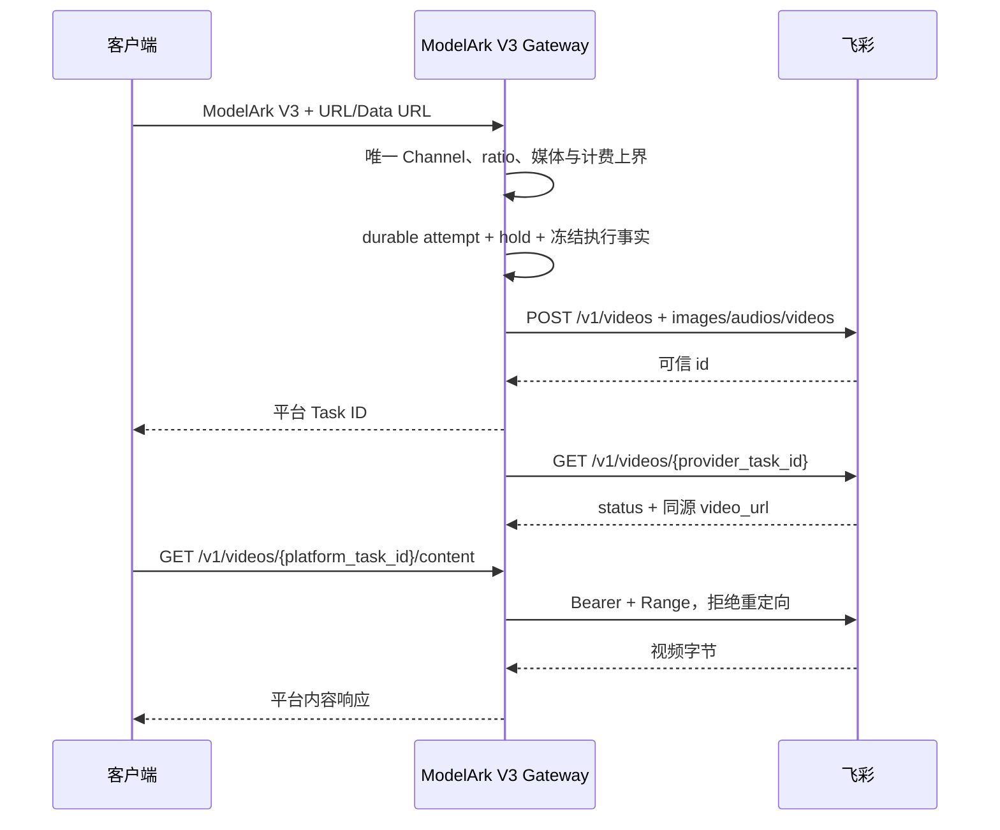

# 飞彩 URL 媒体协议与素材边界设计

## 1. 范围与状态

本文是飞彩 Seedance 线路使用 `feicai_videos_v1` 时的协议身份、北向到南向转换、素材边界、异步
结果和内容回源权威设计。飞彩的客户模型、价格和比例范围由
[飞彩全模型与计费设计](飞彩全模型与计费设计.md)负责；Seedance Channel、durable attempt、Task 和
资金状态继续由[Seedance 专用渠道与 Link 架构](../../Seedance专用渠道与Link架构.md)负责。

当前代码已经实现本文描述的协议注册、URL 媒体转换、无素材库配对、素材引用拒绝、Task 结果归一和
带 Provider 凭据的内容代理。真实 Provider 凭据、模型组合、账单和生产灰度仍需逐线路验收；代码存在
不等于该线路已经生产发布。

## 2. 核心决策

飞彩使用统一 ModelArk V3 北向合同和一个当前南向协议：

```text
video_upstream_protocol = feicai_videos_v1
asset_upstream_protocol = none
```

该协议的含义是“通过飞彩 `/v1/videos` JSON URL 数组提交请求级媒体”，不是素材库协议。
线协议形状相似的其它 Provider 仍建立自己的协议和 adapter，不复用飞彩的身份或模型登记表。

管理员页面必须同时展示协议能力边界：

```text
中文：飞彩视频 V1（不提供素材 CRUD）
英文：Feicai Videos V1 (No Asset Management API)
```

Channel 只持久化稳定协议标识，不保存本地化展示名称。

## 3. 责任边界

| 参与方 | 负责 | 不负责 |
| --- | --- | --- |
| 客户端 | 使用 ModelArk V3、提供 URL/Data URL 或 `asset://<opaque-id>`、选择客户模型 | 直接调用飞彩私有接口或获得 Provider 凭据 |
| 中转站 | 确定唯一 Channel、转换线协议、建立 attempt/Task、校验固定安全上界、代理结果内容 | 判断素材真实性、管理飞彩素材库、复制逐模型 capability 表 |
| 飞彩 | 拉取媒体、判断 opaque 素材引用和模型支持、审核内容、创建和执行任务、返回状态与结果 | 理解平台租户身份 |

飞彩对某个模型是否要求图片、是否支持音频/参考视频或真人内容拥有最终判断权。平台只维护跨请求必须
稳定的线协议和已经验证的精确比例范围，不为飞彩建立第二套运行时模型能力系统。

## 4. 北向与南向映射

ModelArk V3 请求按以下固定规则转换：

| 北向事实 | 飞彩南向字段 | 平台行为 |
| --- | --- | --- |
| 客户模型 | `model` | 通过唯一 Channel 的 `model_mapping` 得到精确 Provider 模型 |
| 有序 `text` 内容 | `prompt` | 按出现顺序以换行连接非空文本 |
| `duration` | `duration` | 发送显式正整数，并先执行统一计费安全上界校验 |
| `resolution` | Provider 模型登记 | 校验请求分辨率与映射后的精确 Provider 模型固定档位一致，不向飞彩发送像素尺寸 |
| `ratio` | `ratio` | 按精确 Provider 模型的允许集合校验并原样发送；不推导 `size` |
| `reference_image` | `images[]` | 保留顺序 |
| `reference_audio` | `audios[]` | 保留顺序 |
| `reference_video` | `videos[]` | 保留顺序 |

协议级媒体限制为图片最多 9 张、音频最多 3 段、参考视频最多 3 段。图片支持 HTTP、HTTPS 和受支持
图片 MIME 的 Base64 Data URL；音频和视频只支持 HTTPS URL。三类媒体的非空
`asset://<opaque-id>` 均不做本地素材解释并交给 Provider。其它 role、内容类型、本地路径、相对路径、
带用户信息的 URL、非图片 Data URL 和超过协议上限的数组在 Provider POST 前失败。

这些限制只描述当前 adapter 能安全表达的合同。SD2 图片必填、Pro PI 固定 15 秒/参考视频和逐模型固定价格
由飞彩专用精确 Provider 模型表在发送前校验，不从模型名模糊推断。

## 5. 素材语义

飞彩当前没有已验证的公共预置素材、私域素材 CRUD、素材组或真人认证合同，因此
`asset_upstream_protocol` 固定为 `none`。

| 北向素材表达 | 行为 |
| --- | --- |
| HTTP/HTTPS URL | 作为本次请求的媒体地址转换，不创建平台 Asset |
| 图片 Data URL | 作为本次请求内联图片转换，不创建平台 Asset |
| `asset://<opaque-id>` | 不查询、不识别来源、不改写，原样交给飞彩 Provider 最终判断 |

平台不得为飞彩持久化 source URL、把 URL 包装成平台素材、建立 source fallback、自动物化、跨渠道
迁移或多 Provider binding。请求级 URL 即使指向真人或 AIGC 人像，也只具有本次请求的 URL 语义；
平台不检查内容类别，也不赋予素材入库或真人认证状态。

以后只有飞彩提供稳定 Provider 资源身份和明确生命周期时，才能另行设计一个当前素材协议。届时仍只
维护一个当前实现，不堆叠飞彩品牌化版本名称；在该合同落地前，`feicai_videos_v1` 的素材语义保持
不变。

## 6. 创建、轮询与内容回源



创建响应只接受非空、长度受控且无控制字符的顶层 `id`。查询响应的顶层 `id` 必须与冻结的 Provider
task ID 一致；状态映射为：

| 飞彩状态 | 平台状态 |
| --- | --- |
| `queued` | `queued` |
| `processing` / `in_progress` | `running` |
| `completed` | `succeeded` |
| `failed` | `failed` |

未知状态、ID 不一致、无效 JSON、成功但缺少合法结果 URL 均是 Provider 合同违例，不被解释为普通
成功或可信业务失败。创建请求已经发送但没有取得可信 ID 时进入 `unknown`，不自动重发、换渠道或
退款。

飞彩成功结果 URL 需要 Provider Bearer 凭据。平台只向客户返回
`/v1/videos/{platform_task_id}/content`，内容代理使用 Task 冻结的 Base URL、Key、代理和结果 URL：

- 结果 URL 必须与冻结 Base URL 同源，并通过 URL/SSRF 校验；
- 回源时添加冻结 Bearer，支持客户 `Range`；
- 飞彩线路拒绝结果下载重定向，避免凭据跨源发送；
- Provider URL、Key 和 Provider task ID 不进入普通响应或日志。

## 7. 错误语义

错误按发生位置处理：

1. Provider POST 前可确定的无效 ModelArk 结构、不支持的 ratio、非法 URL、超量媒体和素材引用，返回稳定的
   平台错误，不发送请求；
2. Provider POST 后没有可信任务身份且没有已验证的终结拒绝合同，保持 `unknown`，不能为了“透传”
   而错误退款或重试；
3. 轮询得到可信 `failed` 时投影为平台失败，Provider code/message 经过长度限制和敏感内容清洗；
4. 原始 Provider 响应、URL、Bearer、Cookie 或私有错误体不得直接返回客户。

代码登记表只负责已确认的结构能力与计费上界；Provider 仍负责内容审核和真实生成。中转站必须保持异步事实、
错误码和敏感信息边界一致，不透传原始响应。

## 8. 版本与历史任务

管理员只可为新请求选择 `feicai_videos_v1`，不保留 `url_media_arrays_v1` alias、双读或回退分支。
旧飞彩 Channel、Ability、历史 Task/attempt 与直接关联数据已经按明确授权删除；旧 transport profile
和管理员可配置的协议别名也一并移除。运行时只维护当前飞彩协议。内部 adapter revision 只冻结已经
创建的 Task 所使用的线协议语义；新 revision 不形成管理员可选的飞彩协议族。

## 9. 架构不变量

1. 飞彩北向固定 ModelArk V3，南向固定当前 `feicai_videos_v1`。
2. `feicai_videos_v1` 只能与 `asset_upstream_protocol=none` 配对。
3. URL/Data URL 不创建 Asset；`asset://<opaque-id>` 不触发本地素材查询或 Provider 探测。
4. 一个客户模型只使用唯一已启用 Seedance Channel，不随机分发或失败换渠。
5. Provider POST 只发送一次；未取得可信任务身份时保持 `unknown`。
6. 查询、内容和结算使用当前飞彩 Task 创建时冻结的事实，不重新读取当前协议或凭据解释任务。
7. 客户只看到平台 Task 和平台内容 URL，不看到 Provider ID、凭据或完整结果 URL。
8. 固定分辨率、比例范围、时长和媒体数量由精确 Provider 模型登记表在发送前验证；Provider 仍决定内容审核和真实生成结果。
9. 不恢复管理员可配置的飞彩 v1/v2/v3 协议、Provider 模型配置族或素材协议族。

## 10. 代码事实映射

| 设计事实 | 代码位置 |
| --- | --- |
| 协议身份、固定路径和素材 `none` | `relaykit/dto/upstream_protocol.go` |
| ModelArk V3 到 URL 数组转换 | `relay/channel/task/seedance/thirdparty/feicai/create_request.go` |
| 十模型、精确比例范围、时长、媒体与按秒计费事实 | `relay/channel/task/seedance/thirdparty/feicai/model_spec.go` |
| opaque 素材引用非空校验与直通 | `relay/channel/task/seedance/thirdparty/feicai/media_url.go` |
| 创建与查询响应归一 | `relay/channel/task/seedance/thirdparty/feicai/response.go` |
| 冻结凭据结果来源 | `controller/video_feicai_content.go` |
| 平台内容代理 | `controller/video_proxy_link.go` |
| 管理端协议配对和展示 | `web/src/features/channels/` |
