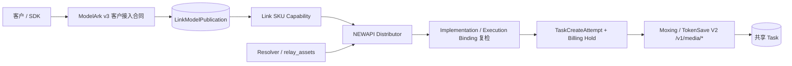

# 墨行 Seedance 模型线路与合同边界

## 1. 目的

本文定义墨行当前两个 Seedance 模型、历史协议线路和 Link implementation 如何分层，避免把
Moxing V2、TokenSave V2、历史 Ark 官 Key 或素材管理 facade 误认为可互换实现。

## 2. 总体上下文



客户只依赖 ModelArk v3 路径、客户模型名、Link Task 与本站内容代理。墨行域名、Provider 模型、
`task_id`、`uuid`、`upstream_id`、API Key、集成 Token 和上游结果 URL 都是内部执行或管理员审计
事实。

## 3. 四条线路必须隔离

| 线路 | 模型 | 视频 profile | 素材 profile | 结论 |
| --- | --- | --- | --- | --- |
| Moxing V2 媒体任务 | `seedance-2-0-oversea` | `third_party_relay` | `relay_assets` | 当前模型；按量计费 |
| TokenSave V2 媒体任务 | `doubao-seedance-2-0-260128` | `third_party_relay` | `relay_assets` | 当前模型；按秒计费 |
| 历史 Ark 官 Key | `dreamina-seedance-2-0-260128` | `third_party_reverse_proxy` | 待重新取证 | 历史隔离；不得新增候选或 binding |
| JoyCreator 素材管理 | 无视频 execution binding | 无 | management-only | 不参与视频候选和 Resolver |

`dreamina-seedance-2-0-260128` 是墨行官方历史研究资料中的 Provider 模型名。当前代码没有为它
注册 capability、execution binding 或价格；历史错误候选已经移除。`moxing.seedance-ark-assets@v1`
只作为 deprecated implementation 解释完整冻结的旧 Task，不得用于保存渠道或创建新任务。该字符串不是
当前可履约代码事实。原“海外官 Key 真人素材库”参考文档已改为当前 doubao V2 模型页，不再提供
Ark 素材、H5 真人认证或账号作用域合同；历史模型页中的相关素材描述必须重新取证。

`doubao-seedance-2-0-260128` 纳入墨行当前产品范围，但仍属于 TokenSave 的独立 V2 implementation。
“同属墨行产品范围”不等于“同一 Provider implementation”：它不能配置为 Ark 资产线路，也不能因
路径相似而复用 `moxing.seedance-media-task` 的身份、凭据、价格、usage 或 execution binding。

## 4. 五类权威事实

| 层次 | 墨行设计值 | 负责 |
| --- | --- | --- |
| 客户接入合同 | `modelark.contents.generations.v3` | 北向路径、DTO、错误与 Task 投影 |
| 客户模型 publication | `(link, modelark_video, customer_model) -> Link SKU + version` | 客户模型稳定代表哪个 SKU |
| 当前公开 SKU | `seedance-2-0-oversea`、`doubao-seedance-2-0-260128` | 各自字段、值域、媒体和生命周期能力 |
| 当前实现 | `moxing.seedance-media-task@v2`、`tokensave.seedance-media-task@v2` | 各自域名、`/v1/media/*`、`relay_assets`、adapter 和 binding |
| 渠道实例 | Channel、Ability、`model_mapping`、凭据、分组、价格 | 当前可用性和选渠，不定义合同身份 |

稳定解析链为：

```text
customer_model
  -> channel.model_mapping
  -> 精确 Provider 模型
  -> 对应 implementation 的唯一 execution binding
  -> 同名但结构上独立的 Link SKU
```

当前可选择实现只保留 `moxing.seedance-media-task@v2 -> seedance-2-0-oversea` 与
`tokensave.seedance-media-task@v2 -> doubao-seedance-2-0-260128`。TokenSave v1 与 Moxing Ark v1 只用于冻结历史 Task
解析，不得再创建新候选。历史 Ark 文档绑定的 `dreamina-seedance-2-0-260128` 没有当前 capability
或候选；重新接入必须使用独立 SKU 和新的显式 implementation。

## 5. 当前实现与剩余发布门禁

| 边界 | 当前代码投影 | 官方资料支持的安全边界 | 设计动作 |
| --- | --- | --- | --- |
| 当前模型线路 | 两个 SKU 各有唯一 relay implementation | 两个模型页都使用 V2 relay | 已闭合；不得跨实现降级 |
| 分辨率 | oversea 为 `480p/720p`；doubao 为 `480p/720p/1080p` | 分别按各自限制表 | 已闭合；4K 不发布 |
| 结果生命周期 | 只投影创建、查询和内容 | 两页均未定义 last-frame 结果 | 已闭合；`supports_last_frame=false` |
| 真人素材 | 两个当前 implementation 只声明 `general` 图片 | V2 资料只有素材引用，没有真人授权生命周期；Ark 素材合同已失去配套证据 | 已闭合；`real_person` 拒绝，Ark 不新增 binding |
| prompt/默认值 | 两个初版均强制非空文本和显式时长、分辨率、比例 | 字段安全交集明确，缺省语义未验 | 已闭合；不猜测 Provider 默认 |
| usage | 两个 v2 implementation 都不把未验字符串投影为 token | 模型页把 `usage` 描述为字符串 | 仍需生产取证；当前结算不依赖 usage |

这些差距是发布门禁，不表示可以在运行时按响应猜测。若部署中已经存在 publication、Task、attempt、
AssetBinding 或 exposure，任何 implementation/capability 收窄都必须先形成显式迁移或新版本；没有
持久化执行事实时才可按开发期单轨规则收敛。

## 6. 发布与请求流程

```text
选择精确的 Moxing V2 或 TokenSave V2 接入方案
  -> 锁定 implementation / profile / path / asset profile
  -> 配置 customer_model -> 对应 Provider 模型
  -> execution binding 唯一解析 Link SKU
  -> 校验 capability、单 Key、HTTPS、TTL、价格与 exposure
  -> 启用时原子创建或核对 publication
  -> 发布 Ability
```

请求时先冻结 publication 与 capability，再计算 implementation、素材和 exposure 合格候选。NEWAPI
继续按客户模型、分组、优先级和权重选渠；Provider POST 前再次核对实际映射模型、implementation
和冻结 SKU。候选耗尽时返回“已发布但暂不可履约”，不能在两个当前 SKU 之间降级，也不能降级到
Ark 或 NEWAPI 原生 OpenAI Videos。

## 7. 不变量

1. Moxing V2、TokenSave V2、Ark 与 JoyCreator 是四条不同线路，路径相似不产生等价性。
2. 两个当前 SKU 只由各自已验证的 V2 execution binding 履约，不能交叉候选或 fallback。
3. 历史 `dreamina` 不复用当前 V2 publication、Task、素材 binding 或计费事实；Ark 素材合同在重新
   取证前不得新建 binding。
4. 客户模型名、Link SKU 和 Provider 模型保持结构性分离；即使字符串恰好相同也不能互相推断，
   历史 Ark 重新接入时仍必须使用独立 Link SKU。
5. 当前代码注册不等于生产可用；与官方资料冲突时发布失败关闭。
6. NEWAPI 原生 `/v1/videos` 不受本设计的模型识别、改写或 fallback 影响。
