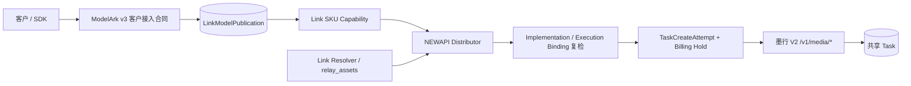

# 墨行 Seedance 模型线路与合同边界

## 1. 目的

本文定义墨行 Seedance 官方资料中的模型、协议线路和 Link implementation 如何分层，避免把当前
V2 中转、历史 Ark 官 Key、TokenSave 模型或素材管理 facade 误认为同一套可互换实现。

## 2. 总体上下文



客户只依赖 ModelArk v3 路径、客户模型名、Link Task 与本站内容代理。墨行域名、Provider 模型、
`task_id`、`uuid`、`upstream_id`、API Key、集成 Token 和上游结果 URL 都是内部执行或管理员审计
事实。

## 3. 三条线路必须隔离

| 线路 | 模型 | 视频 profile | 素材 profile | 结论 |
| --- | --- | --- | --- | --- |
| 当前 V2 媒体任务 | `seedance-2-0-oversea` | `third_party_relay` | `relay_assets` | 可进入发布设计 |
| 历史 Ark 官 Key | `dreamina-seedance-2-0-260128` | `third_party_reverse_proxy` | `ark_assets` | 历史隔离；不得与当前 SKU 混用 |
| JoyCreator 素材管理 | 无视频 execution binding | 无 | management-only | 不参与视频候选和 Link Resolver |

`dreamina-seedance-2-0-260128` 是墨行官方历史研究资料中的 Provider 模型名。当前生产代码没有为它
注册独立 capability、implementation 或价格；现有 Ark 注册实际仍使用
`seedance-2-0-oversea + third_party_reverse_proxy`，并因此属于本设计明确阻断的错误候选，而不是
历史 `dreamina` 已经落地的代码事实。

`doubao-seedance-2-0-260128` 属于 TokenSave 的独立 V2 implementation。墨行历史资料明确说明当前
doubao 线路不能配置为 Ark 资产线路，因此不得因路径相似而复用墨行实现身份。

## 4. 五类权威事实

| 层次 | 墨行设计值 | 负责 |
| --- | --- | --- |
| 客户接入合同 | `modelark.contents.generations.v3` | 北向路径、DTO、错误与 Task 投影 |
| 客户模型 publication | `(link, modelark_video, customer_model) -> Link SKU + version` | 客户模型稳定代表哪个 SKU |
| 当前公开 SKU | `seedance-2-0-oversea` | 当前 V2 字段、值域、媒体和生命周期能力 |
| 当前实现 | `moxing.seedance-media-task/<version>` | `/v1/media/*`、`relay_assets`、adapter 和 execution binding |
| 渠道实例 | Channel、Ability、`model_mapping`、凭据、分组、价格 | 当前可用性和选渠，不定义合同身份 |

稳定解析链为：

```text
customer_model
  -> channel.model_mapping
  -> seedance-2-0-oversea
  -> moxing.seedance-media-task 精确 execution binding
  -> Link SKU seedance-2-0-oversea
```

当前代码中的 `moxing.seedance-ark-assets/v1 -> seedance-2-0-oversea` 与目录内官方资料不一致：官方
Ark 文档绑定的是 `dreamina-seedance-2-0-260128`，当前 `seedance-2-0-oversea` 明确使用 V2
`/v1/media/*`。该注册项在完成部署数据审计和重新取证前不得成为当前 SKU 的合格候选。

## 5. 当前实现与目标合同的差距

| 边界 | 当前代码投影 | 官方资料支持的安全边界 | 设计动作 |
| --- | --- | --- | --- |
| 当前模型线路 | relay 与 Ark 都可履约 `seedance-2-0-oversea` | 当前模型只证明 V2 relay | 排除 Ark 候选；是否改版本先审计部署数据 |
| 分辨率 | 当前 capability 含 `480p/720p/1080p/4k` | 当前 V2 限制表只列 `480p/720p` | 发布前收窄；价格表中的 1080p 不能代替能力证明 |
| 结果生命周期 | 当前非 official capability 投影 last frame | V2 文档未定义 last-frame 结果 | `supports_last_frame=false` |
| 真人素材 | implementation 声明 general/real_person | `relay_assets` adapter 与当前资料没有真人认证生命周期 | 当前 V2 仅 `general` |
| prompt | 当前 capability 不强制文本 | V2 参数表标记 prompt 必填 | 初版要求至少一个非空 text |
| 默认值 | 当前默认时长 5 秒 | V2 文档未给出时长、分辨率、比例默认值 | 初版要求显式传入，实测后再版本化开放默认 |
| usage | adapter 接受 token 对象 | V2 文档把 `usage` 描述为字符串 | 未验证前不用于实际 token 结算 |

这些差距是发布门禁，不表示可以在运行时按响应猜测。若部署中已经存在 publication、Task、attempt、
AssetBinding 或 exposure，任何 implementation/capability 收窄都必须先形成显式迁移或新版本；没有
持久化执行事实时才可按开发期单轨规则收敛。

## 6. 发布与请求流程

```text
选择墨行 V2 接入方案
  -> 锁定 implementation / profile / path / asset profile
  -> 配置 customer_model -> seedance-2-0-oversea
  -> execution binding 唯一解析 Link SKU
  -> 校验 capability、单 Key、HTTPS、TTL、价格与 exposure
  -> 启用时原子创建或核对 publication
  -> 发布 Ability
```

请求时先冻结 publication 与 capability，再计算 implementation、素材和 exposure 合格候选。NEWAPI
继续按客户模型、分组、优先级和权重选渠；Provider POST 前再次核对实际映射模型、implementation
和冻结 SKU。候选耗尽时返回“已发布但暂不可履约”，不能降级到 Ark、TokenSave 或 NEWAPI 原生
OpenAI Videos。

## 7. 不变量

1. V2、Ark 与 JoyCreator 是三条不同线路，路径相似不产生等价性。
2. `seedance-2-0-oversea` 只由已验证的 V2 execution binding 履约。
3. 历史 `dreamina` 不复用当前 V2 publication、Task、素材 binding 或计费事实。
4. 客户模型名、Link SKU 和 Provider 模型保持结构性分离；即使字符串恰好相同也不能互相推断，
   历史 Ark 重新接入时仍必须使用独立 Link SKU。
5. 当前代码注册不等于生产可用；与官方资料冲突时发布失败关闭。
6. NEWAPI 原生 `/v1/videos` 不受本设计的模型识别、改写或 fallback 影响。
