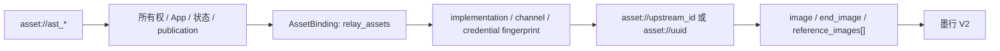

# Link 资源与墨行素材适配设计

## 1. 目标

客户始终创建和引用平台 Link 资源：

```text
POST /v1/assets -> ast_*
视频请求       -> asset://ast_*
```

墨行 `uuid`、`upstream_id`、Ark `asset-*`、JoyCreator `id/assetId` 和原始 URL 都是内部执行事实，
不能作为第二套客户素材身份。

## 2. 三类官方素材接口

| 官方接口 | 作用域 | Link 设计 |
| --- | --- | --- |
| `/assets/*` | 当前 V2 relay 素材；按 API Key 用户隔离 | `relay_assets`，服务 `seedance-2-0-oversea` |
| `/v1/ark/assets/*` | 历史 Ark 素材、分组和 H5 真人认证 | `ark_assets`，只服务经重新验证的历史 Ark 模型 |
| `/joycreator/openApi/v1/asset/*` | JoyCreator 管理 facade | management-only，不参与视频候选和 Resolver |

同一个 Provider 提供这些端点不表示素材 ID、凭据作用域或生命周期可以互换。

## 3. 当前 V2 relay 解析链



`RelayAdapter` 创建素材时调用 `POST /assets`，查询 `GET /assets/{uuid}`，并把 `Active` 记录的
`upstream_id` 作为优先 Provider 引用；没有 `upstream_id` 时才使用 `uuid`。客户从不看到该选择。

## 4. Asset 与 binding 规则

### 4.1 创建和状态

- 客户 source 只接受符合平台安全策略的公网 HTTPS URL；官方接口支持图片 base64 不代表 Link
  AssetSource 也接受或持久化 base64；
- V2 relay 可处理 Image、Video、Audio 素材，但当前视频 SKU capability 只开放实际请求转换支持的
  图片引用；素材类型存在不等于某个 SKU 可消费；
- `Pending/Processing/Active/Failed` 分别归一为 processing/processing/active/failed；
- 只有 active 且作用域匹配的 binding 才能用于 Provider 请求；
- 更新名称和删除是 Provider lifecycle 操作，不改变平台 `ast_*` 身份；
- Provider 404 可作为删除幂等成功处理，其它清理失败必须保留可审计状态。

### 4.2 凭据与作用域

V2 官方资料明确素材归属绑定 API Key 用户。因此 binding 必须同时匹配：

- 当前精确 implementation ID/version/content hash；
- Channel ID、单 Key 凭据指纹和 Base URL；
- `asset_upstream_profile=relay_assets`；
- Asset 所有者、App、publication 和 Link SKU；
- 目标媒体类型和角色。

轮换 Key、Base URL、profile 或 implementation 后，旧 binding 不能在新作用域复用。需要迁移时创建
新的 binding 或新的 `ast_*`，不能只替换上游 ID。

## 5. 当前真人素材边界

当前 `/assets/*` 资料没有 H5 真人认证、授权撤回或分组生命周期；代码中的 `RelayAdapter` 也只接受
`asset_kind=general`。因此当前 V2 implementation 必须只声明 `general`，不能因为资料写到“人像库
参考”就把普通 relay asset 提升为平台 `real_person`。

历史 Ark 线路支持图片型真人素材和 H5 认证，但它只与 `dreamina` Ark 模型及相同账号作用域协作。
Ark 真人 binding 不能被当前 V2 `seedance-2-0-oversea` 复用。若将来墨行 V2 提供等价真人授权合同，
必须新增 implementation/capability 版本并验证撤回线性化、在途 reservation、删除和内容回源。

## 6. 请求级媒体与 Link 资源

- 请求级 HTTP(S)/Data URL 只属于当前任务，不创建 Asset 或 binding；
- 平台 Link AssetSource 仍只保存认证加密的 HTTPS URL，不保存可恢复 base64；
- 一个媒体集合默认不能混用直接 URL 与 `asset://ast_*`；
- Converter 不访问数据库，也不接收裸 `asset://ast_*`，Resolver 是唯一引用转换权威；
- 多个 Link 资源必须在同一候选渠道、同一凭据作用域下全部可解析；
- 选渠后、发送前再次检查状态、授权、publication、实现和 binding 围栏。

当前 V2 implementation 采用 `upstream_binding`，不是 `source_url`。即使 AssetSource 仍有效，也不能
在缺少 active relay binding 时把源 URL 静默塞给 Provider，除非新 implementation 显式登记并验证
`source_url` 模式。

## 7. JoyCreator 隔离

JoyCreator facade 的素材组 `id`、业务 `groupId/assetId`、`vendorUrl` 和状态只用于管理及对账。它没有
当前视频 execution binding，不能：

- 作为 `relay_assets` 或 `ark_assets` 的 fallback；
- 把 `vendorUrl` 当作 Link AssetSource；
- 把 JoyCreator `id` 拼成当前 V2 的 `asset://`；
- 仅因同一 Base URL 而复用视频 Channel Key。

如未来接入，只能作为独立 management-only profile，并保持与视频候选和客户素材合同解耦。

## 8. 不变量

1. 客户只持有 `ast_*`，所有墨行素材标识都停留在内部 binding。
2. V2 relay、历史 Ark 和 JoyCreator 素材不能跨 profile 复用。
3. 当前 V2 只允许 general Link 资源，不发布 real_person。
4. `Active`、凭据作用域和 implementation 围栏必须在选渠与发送前同时成立。
5. Provider 支持某种素材类型不自动扩张公开 SKU 媒体能力。
6. Converter 不解析 Link 资源，Resolver 不修改客户模型或计费合同。

