# 飞彩 Seedance 总体架构与履约设计

## 1. 目的与决策

本文定义飞彩 10 个 Seedance 模型共享的合同边界、v2/v3 并行实现、请求转换、异步 Task、Link 资源、
计费探针和内容代理。逐模型差异见[全模型 SKU 与计费设计](飞彩全模型SKU与计费设计.md)。

当前显式注册 `feicai.seedance-videos@v2` 与 `@v3`：

- 不保留飞彩 v1 渠道作为等价候选；
- v2 只绑定带 `-feicai` 后缀模型，v3 只绑定无后缀模型，两个版本不互相 fallback；
- 两个版本共享 media-arrays adapter v2 与客户 SKU 语义，但分别冻结 implementation hash、binding、
  size evidence、渠道连接和任务事实；
- 已删除飞彩 v1 implementation、media-arrays adapter v1 专用分支、v1 capability 版本和对应测试；
- 其它 Provider 仍可继续使用它们各自的 v1 implementation，不能删除全局 `LinkImplementationVersionV1`；
- 删除 v1 前必须证明所有部署环境不存在仍需履约或访问的飞彩 v1 事实。

旧 v1 曾只履约两个 720p SKU，采用全局两元 size 表、media-arrays adapter v1 与图片/音频数组。
这些历史差异只用于说明迁移边界，已不是当前运行时事实。

## 2. 系统与合同边界

```mermaid
flowchart LR
    Client["客户 / SDK"]
    Access["ModelArk v3 客户接入合同"]
    Publication[("LinkModelPublication")]
    Capability["10 个 Link SKU Capability"]
    Filter["实现、素材与 exposure 资格过滤"]
    Distributor["NEWAPI Distributor"]
    Binding["Execution Binding 复检"]
    Attempt["TaskCreateAttempt + Billing Hold"]
    Resolver["Link Asset Resolver"]
    Adapter["media-arrays Adapter v2"]
    Feicai["飞彩 /v1/videos"]
    Task[("共享 Task")]
    Logs[("结算日志 / Exposure")]

    Client --> Access --> Publication --> Capability --> Filter --> Distributor --> Binding --> Attempt
    Attempt --> Resolver --> Adapter --> Feicai --> Task --> Logs
```



| 层次 | 飞彩设计值 | 权威职责 |
| --- | --- | --- |
| 客户接入合同 | `modelark.contents.generations.v3` | 路径、DTO、响应、错误和 Task 投影 |
| 客户模型 publication | `(link, modelark_video, customer_model) -> Link SKU + version` | 客户模型稳定代表哪个产品 |
| Link SKU capability | 10 个独立 SKU 及 version/hash | 时长、分辨率、媒体、默认值和计费维度 |
| Link implementation | `feicai.seedance-videos@v2` / `@v3` | v2 绑定带后缀模型，v3 绑定无后缀模型；分别冻结路径、adapter、素材方式和 execution bindings |
| Channel / Ability | 模型映射、Key、Base URL、分组、价格、优先级和权重 | 当前能否履约，不定义合同身份 |

三种模型身份保持分离：

```text
customer_model
  -> channel.model_mapping
  -> provider_model
  -> 所选 feicai.seedance-videos@v2 或 @v3 execution binding
  -> Link SKU
```

## 3. v2/v3 实现合同

```text
implementation ID:      feicai.seedance-videos
implementation version: v2 或 v3
contract_id:             modelark.contents.generations.v3
route_family:            modelark_video
video profile:           third_party_json_video_media_arrays
adapter version:         54:third_party_json_video_media_arrays:v2
create path:             /v1/videos
query path:              /v1/videos/{upstream_task_id}
task contract:           shared_video_task
billing contract:        newapi_quota
asset profile:           none
asset modes:             source_url
```

profile 表达协议族，implementation version 和 adapter revision 表达已冻结执行语义。每个版本的 content hash 至少覆盖：

- 10 个 Public SKU 与 10 条 execution binding；
- 固定分辨率、逐模型 size registry 和 billing size class；
- 媒体最小/最大数量与角色；
- `images[]`、`audios[]`、`videos[]` 请求合同；
- Task 身份、状态归一化、确定拒绝和对账合同；
- billing mode、内容代理和 Link 资源上限。

implementation registry 以 ID/version 精确解析同 ID 的不可变版本。代码同时登记飞彩 v2 与 v3；Channel
必须明确保存所选版本，Task 快照和内容代理只接受冻结的精确版本/hash。v2 的证据或 binding 不能满足 v3，
反之亦然。

## 4. v1 移除与单轨切换边界

### 4.1 部署数据门禁

删除 v1 前必须对每个部署环境执行只读审计，范围至少包括：

- 引用 `feicai.seedance-videos@v1` 的 Channel 与 Ability；
- publication、execution binding 或缓存中派生的 v1 身份；
- 非终态 Task 和 `TaskCreateAttempt`；
- 仍处于 hold、结算、退款或 exposure 处置中的资金事实；
- AssetBinding、授权 reservation 和内容代理仍需访问的历史 Task；
- 管理端、运维脚本和测试 fixture 中写死的 adapter v1。

只有全部满足以下条件才允许部署单轨 v2：

1. 飞彩 v1 已停止接收新流量；
2. v1 attempt 与 Task 已进入可信终态或完成显式人工处置；
3. v1 hold、退款、结算和 exposure 均已闭合；
4. 没有仍需通过平台内容端点访问的 v1 结果；
5. 渠道配置可在同一发布窗口更新为 implementation v2 与 adapter v2；
6. 回滚策略只回滚整个发布版本和配置快照，不在新代码中保留 v1 兼容分支。

任一条件不满足时暂停 v2 部署，先完成数据处置；不得以临时兼容、猜测式 parser 或忽略旧数据绕过。

### 4.2 v1 代码移除范围

v2 变更中应移除或替换的仅是飞彩专用 v1 语义：

| 当前 v1 事实 | v2 单轨结果 |
| --- | --- |
| 飞彩 implementation version=v1 | 替换为同 ID、version=v2 的唯一注册 |
| `azhw-media-arrays-v1` 两 SKU capability | 替换为覆盖 10 SKU 的 v2 capability 版本 |
| media-arrays profile 只允许 adapter v1 | 改为只允许 adapter v2 |
| `IsJSONVideoMediaArraysV1` 分派 | 替换为 v2 分派；不保留 v1 分支 |
| v1 内容代理、轮询和 fixture | 替换为 v2 合同与 v2 fixture |
| v1 专属 `403 + feicai_account_required` 登记 | 删除；取得 v2 证据后按 v2 精确登记 |
| 全局 `{resolution}:{ratio}` size 表 | 替换为逐 implementation/provider model 的 v2 registry |
| converter 明确拒绝 video | 替换为仅 Pro PI 接受 `reference_video` |

全局 implementation v1 常量、其它 Provider v1 adapter 和非飞彩测试不属于删除范围。

## 5. 发布与请求主链

### 5.1 发布

```text
选择飞彩 v2（带后缀模型）或 v3（无后缀模型）接入方案
  -> 锁定 Provider/profile/adapter/path/素材方式
  -> 配置 customer_model -> provider_model
  -> execution binding 唯一解析 Link SKU
  -> 校验 capability、HTTPS、单 Key、exposure 和计费配置
  -> 启用时原子创建或核对 publication
  -> 发布 Ability
```

普通保存不能改变既有 publication；改绑必须提供 `expected_version`、操作人和原因。同一范围出现普通 NEWAPI
同名候选时 Link 发布失败关闭。

飞彩 `GET /v1/models` 只用于管理员预检和漂移监控。缺少目标模型可阻止渠道发布或产生告警，但不能删除
publication；新增模型也不能自动创建 SKU、binding、价格或 Ability。

### 5.2 请求

```text
1. publication 冻结客户模型、Link SKU 和 capability version/hash
2. capability 校验字段、固定分辨率、时长、媒体数量与角色
3. 校验直接媒体与 asset:// 不混用
4. 计算全部 Link 资源可解析的渠道交集
5. exposure 与精确 implementation version 资格过滤
6. NEWAPI 选渠并应用 model_mapping
7. execution binding 复检 provider_model -> 冻结 SKU
8. Resolver 二次校验并改写 asset://
9. 按 implementation/provider_model/resolution/ratio 解析 size 与 billing class
10. 生成冻结 billing probe，建立 TaskCreateAttempt、预扣并原子进入 sending
11. adapter v2 构造 Provider 请求并发送
```

未登记 ratio/size、模型映射、媒体角色、计费维度或素材路径都在 Provider POST 前失败。零合格候选表示
“已发布但暂不可履约”，不得降级到 FunCloud、普通 DoubaoVideo 或 NEWAPI 原生视频候选。

## 6. 请求转换

目标上游 DTO：

```json
{
  "model": "<provider_model>",
  "prompt": "<merged text>",
  "duration": 4,
  "size": "1280x720",
  "images": ["https://..."],
  "audios": ["https://..."],
  "videos": ["https://..."]
}
```

数组使用 `omitempty`；`videos` 只允许 Pro PI。`duration` 与 `size` 在 capability 归一化后始终显式发送，
避免依赖 Provider 未闭合默认值。Provider 原生资料明确允许使用整数 `duration` 替代字符串 `seconds`，
因此 media-arrays adapter v2 只发送 `duration`，不建立两套时长字段。

| ModelArk 客户字段 | 飞彩字段 | 规则 |
| --- | --- | --- |
| publication 后的客户模型 | `model` | 经精确 `model_mapping` 得到 Provider 模型 |
| 非空 `content[type=text]` | `prompt` | 按输入顺序换行拼接，至少一项非空 |
| `duration` | `duration` | 发送经 SKU 校验的整数 |
| 固定分辨率 + `ratio` | `size` | 查所选 implementation/version 的逐模型 size registry |
| `reference_image` | `images[]` | 保序 |
| `reference_audio` | `audios[]` | 保序，仅 SKU 允许时发送 |
| `reference_video` | `videos[]` | 仅 Pro PI，保序 |

converter 不读取数据库、不选渠道、不解密 AssetSource，也不接受 metadata/extra 中的飞彩私有字段。

规范化规则：

- 4–15 秒模型只有在逐模型验证默认值后才允许省略并归一为 4；
- SD2 初版必须显式给出 11–15，不能根据全局默认猜成 11；
- Pro PI 省略归一为 15，显式值只能为 15；
- `resolution` 必须等于 SKU 固定分辨率；
- size 必须在所选 implementation/version 的四元 registry 中精确命中；
- `images[]` 位置不推断首尾帧；
- duration、size 和媒体数量在 billing probe 与资金 hold 前完成校验。

## 7. size 当前事实与不变量

当前代码已切换为四元 registry：

```text
(implementation ID/version, provider_model, resolution, ratio)
  -> provider size + billing size class + verified evidence version
```

当前 registry 只登记 `feicai.seedance-videos@v2` 下 Mini 720p、Fast 720p、Value 720p、Standard
720p、Standard 1080p 和 Standard 4K 六个 Provider 模型的 `16:9` 精确条目。v3 当前没有任何 size
evidence。旧 `720p:16:9` 与 `720p:9:16` 两元记录没有作为 fallback 保留。
create converter 与 billing probe 接收同一个冻结实现身份和映射后的 Provider 模型，调用同一 resolver。
任何未登记组合都在预扣和 Provider POST 前返回能力不支持。

## 8. durable create、确定拒绝与任务身份

```text
prepared
  -> held + sending
  -> upstream_succeeded -> Task + hold 转移
  -> terminal_rejection -> rejected + 释放 hold
  -> unknown -> recovered | released_with_exposure
```

只有取得可信、非空且格式安全的 Provider `id` 才创建 Task。发送后断连、非 2xx、无效 JSON、缺少 `id`
或解析失败默认进入 `unknown`，不能自动换渠道、重发或退款。

已移除的飞彩 implementation v1 曾登记 `HTTP 403 + feicai_account_required`，v2/v3 都不继承该规则。
任一当前版本在取得“精确 version + status + error.code 能证明未创建”的独立证据前，所有非 2xx 都进入
`unknown`。证据成立后只为该精确 implementation/version 增加组合及回归，不扩大到另一版本、整个状态码或 message。

飞彩 `id` 与 `task_id` 不可互换：

- 创建只读取顶层 `id`，不以 `task_id` fallback；
- Task 冻结该 `id` 为 `upstream_task_id`；
- 查询使用冻结 `id`，响应顶层 `id` 必须精确匹配；
- 查询响应中的 `task_id` 是非权威内部字段，不用于身份、客户响应或路由；
- `/v1/tasks?task_id=` 在证明与冻结 `id` 稳定关联前不能恢复 create unknown。

## 9. 主轮询与对账状态归一化

`GET /v1/videos/{id}` 是主轮询源。正式凭据黑盒已证明生产端使用以下小写状态：

| 飞彩查询状态 | 共享 Task 状态 | 处理 |
| --- | --- | --- |
| `queued` | queued | 继续轮询 |
| `processing` | running | 继续轮询 |
| `in_progress` | running | 继续轮询；2026-08-05 正式凭据实测补充 |
| `completed` | succeeded | 校验结果 URL 后终态结算 |
| `failed` | failed | 记录脱敏错误并按冻结计费合同处理 |
| 未知值 | `RECONCILIATION_REQUIRED` | 不直接判失败或退款 |

研究资料中的 `GET /v1/tasks` 使用另一套大写状态，但 2026-08-05 目标生产 HTTPS Base URL 实测返回 404。
因此它当前不是可用对账源，下表仅保留为未来正式接口恢复后的候选合同：

| 飞彩任务列表状态 | 对账归一化 |
| --- | --- |
| `QUEUED` | queued |
| `IN_PROGRESS` | running |
| `SUCCESS` | succeeded，仍需校验唯一身份与结果 URL |
| `FAILURE` | failed，失败原因脱敏 |
| 未知值 | reconciliation_required |

两套状态解析器必须独立，不能先转小写后复用主轮询映射。生产 `/v1/tasks` 不可用时，create unknown
保持未决，不能改用明文研究环境或“最近一条相似任务”恢复。未来只有正式 HTTPS 接口可用、能以冻结
request ID、幂等键或其它唯一键精确关联，并通过 CAS 幂等恢复时，任务列表才可改变 attempt/Task。

无效 JSON、ID 不匹配、未知状态、完成无 URL 或结果 URL 不满足安全规则都属于不可采信响应。

## 10. Link 资源与多媒体输入

飞彩 v2/v3 复用 Resolver 的 `source_url` 模式：

```text
asset://ast_*
  -> 所有权 / App / 状态 / publication 校验
  -> 全部素材的候选渠道交集
  -> 选中飞彩 v2 或 v3
  -> 发送前 TTL 与冻结 implementation version 二次校验
  -> 解密 HTTPS source URL
  -> converter 写入 images[] / audios[] / videos[]
```

目标 implementation 能力上限：

```text
supports_managed_assets: false
asset_resolution_modes:  [source_url]
asset_kinds:              [general]
media_types:              [image, audio, video]
max_images/audio/videos:  9 / 3 / 3
supports_mixed_paths:     false
source_min_ttl_seconds:   3600（保守门禁，待生产取证）
```

implementation 上限不代表全部 SKU 都开放所有媒体：SD2 要求 1–9 张图片且禁止音频/视频；通用按秒模型
禁止视频；Pro PI 才允许 0–3 个 `reference_video`。

- 图片可接受公共合同允许的 HTTPS URL；Data URL 只作为有大小/MIME 上限的请求级图片；
- 音频和视频只接受 HTTPS；HTTP、内网、localhost、本地路径和相对路径均拒绝；
- 请求级媒体不进入 Asset CRUD、授权、迁移或长期保存；
- 一个请求不得混用直接媒体与 `asset://`；
- AssetSource URL 认证加密，不进入响应、Task、attempt、日志或指标；
- `expires_at=0` 表示未知有效期而非永久有效；
- 多个 Asset 必须由同一候选全部解析，选渠和发送前均复检。

飞彩资料所称“支持真人内容”不等于平台 `real_person` 合同。飞彩 v2/v3 只注册 `asset_kind=general`；
`real_person` 始终 fail closed。

## 11. 内容代理、错误与脱敏

客户只访问 new-api 的 Task content endpoint：

```text
客户 -> 校验用户、App、Task 终态与授权
new-api -> 读取 Task 冻结的飞彩 implementation version、Base URL、Key 和结果 URL
new-api -> 强制可验证 HTTPS、同源、SSRF 与拒绝重定向
new-api -> 携带冻结 Bearer 流式回源
```

不得返回飞彩 `video_url` 或 Bearer，不得改用渠道当前 Key，也不得为研究资料示例放宽明文 HTTP。
Range 与响应头继续使用内容代理白名单。

对外错误区分字段/能力 4xx、素材错误、已发布但暂不可履约、创建 unknown 和可信 Provider 失败。
日志不得包含 Key、Authorization、完整媒体/结果 URL、Provider 模型或上游任务 ID；`diagnostic_id` 只进入
管理员审计，`upstream_error_body` 不原样回显。

## 12. v2/v3 代码登记闭环

飞彩任一 implementation 只有在下列代码权威同时一致时才是完整实现：

| 权威面 | 必须表达的事实 |
| --- | --- |
| SKU capability | 10 个 SKU、固定分辨率、时长/default、媒体 min/max/roles、billing mode、v2 hash |
| Link implementation | 精确 `feicai.seedance-videos@v2` 或 `@v3`、各自 10 bindings、adapter v2、素材上限与 content hash |
| adapter registry | media-arrays profile 只接受 v2；创建、查询、内容均按 v2 分派 |
| size registry | 四元键，converter 与 billing probe 共用，旧两元 resolver 删除 |
| request converter | 整数 duration、逐模型 size、三类媒体数组，Pro PI video，SD2 min_images |
| durable create | 确定拒绝按 implementation/version 独立登记；其它发送后异常 unknown |
| polling/reconcile | 主轮询接受已取证小写状态并使用冻结顶层 id；生产任务列表 404，恢复链保持关闭 |
| billing | 按秒/按次分离，checked quota、saturation 审计、exposure 闭环 |
| content | 只接受冻结 implementation version/hash、同源 HTTPS、冻结 Key、拒绝重定向 |
| regression | 移除 v1 fixture；v2/v3 各 10 条 binding 分离，交叉模型名与跨版本 evidence 全部失败关闭 |

详细用例由[工程回归规约](../../../30-engineering/飞彩Seedance全模型回归规约.md)维护，本文不复制测试步骤。

## 13. 架构不变量

1. 客户模型、Link SKU 和 Provider 模型保持三层分离。
2. 飞彩运行时只接受显式注册的 implementation v2/v3；两者并行可选但不存在跨版本 binding、evidence 或 fallback。
3. v1 删除前必须证明部署数据不再依赖 v1；不满足时停止发布而不是增加兼容分支。
4. 10 个模型分别由显式 capability 和 execution binding 注册，渠道配置不能扩展能力。
5. publication 决定已发布身份，Channel/Ability 只决定当前可用性。
6. 候选耗尽时 fail closed，不进入普通或原生视频候选集。
7. converter 只消费已验证、已解析的类型化请求。
8. 顶层 `id` 是唯一上游任务身份；发送后未知不自动重发或退款。
9. Task、attempt、计费、素材和内容代理冻结精确 implementation version/hash 与 publication 事实。
10. 飞彩只消费 `general` Link 资源，不建立第二套素材身份或真人合同。
11. Provider 凭据、模型、任务 ID、源 URL 和账单私有字段只进入受控内部边界。
12. Provider 对账金额与客户结算金额分离，任何未验证倍率均不参与扣费。
