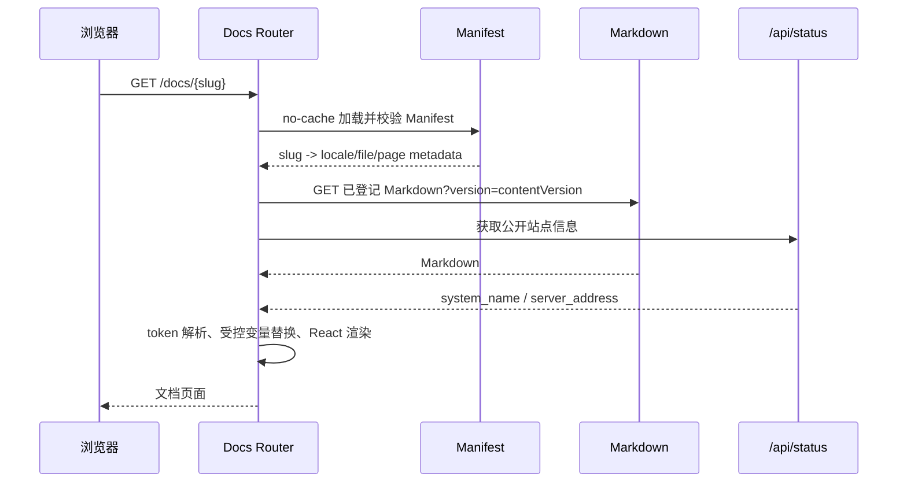

# 公开 API 文档交付架构

公开 API 文档是 new-api Web 交付物中的只读合同投影。受控 Markdown、公开 operation 白名单和
审计后的 OpenAPI 在现有 React/Rsbuild 构建中校验并生成静态内容，最终随 `web/dist` 嵌入同一个
Go 二进制发布。

本文只描述交付边界、事实归属、构建与运行数据流、安全和一致性约束。内容维护步骤见
[公开 API 文档维护指南](../30-engineering/公开API文档维护指南.md)，页面结构和交互见
[API 文档中心交互规范](../90-ui-ux/API文档中心交互规范.md)。

## 1. 目标与非目标

### 1.1 目标

- 对第三方调用方发布经批准、可追溯的 API 合同说明；
- 让公开内容与对应代码在同一次变更中审查、测试和发布；
- 复用现有 React、TanStack Router、Rsbuild、Go embed 与单二进制部署；
- 保持公开文档与内部 `docs/`、后台 API、Provider 私有字段和凭据严格隔离；
- 在运行时按页加载 Markdown，不把全部正文编译进主 JavaScript 包；
- 构建期证明 Manifest、Markdown、OpenAPI、公开白名单和最终静态产物一致。

### 1.2 非目标

- 不建设独立文档站运行时、CMS、数据库表或在线 Markdown 编辑器；
- 不自动公开全部 Gin 路由、DTO 字段或 Provider 兼容参数；
- 不把内部 `docs/` 或后台 `docs/openapi/api.json` 发布到互联网；
- 不在浏览器填充真实 API Key 或提供未单独安全设计的 Try it；
- 不以文档中心为由改写 Router、Relay、DTO 或通用 Markdown 组件。

## 2. 事实所有权

| 事实 | 权威来源 | 约束 |
| --- | --- | --- |
| API 机器合同 | `docs/openapi/relay.json` | 只提供审计候选，不自动代表全部公开 |
| 公开 operation 范围 | `docs/openapi/public-operations.json` | 以 operationId 显式批准，不按路径前缀推断 |
| 页面导航与文件映射 | `web/public/docs-content/manifest.json` | slug、locale、page ID、文件和本地资源白名单 |
| 人类可读说明 | manifest 登记的 Markdown | 场景、限制、示例和错误处理；不复制内部实现 |
| 搜索元数据 | Manifest + 已登记 Markdown heading | 在构建期生成，浏览器不抓取全站正文 |
| 运行时站点变量 | 当前 origin 与公开 `/api/status` | 不读取登录态凭据或管理员配置 |
| 页面框架 | `web/src/features/docs/`、`web/src/routes/docs/` | 路由、加载、渲染和交互，不定义 API 合同 |

公开文档描述客户可以依赖的协议，不等同于代码能够解析的全部字段。Link 能力必须来自已发布合同；
NEWAPI 原生能力以上游公开合同和当前路由审计为准。

## 3. 系统上下文

```mermaid
flowchart LR
    Author[文档维护者]
    OpenAPI[审计后的 Relay OpenAPI]
    Allowlist[公开 Operation 白名单]
    Markdown[公开 Markdown]
    Manifest[导航 Manifest]

    subgraph Build[现有 Web 构建]
        Validator[内容与合同校验]
        Search[搜索索引生成]
        App[React Docs 模块]
        Rsbuild[Rsbuild]
        Dist[web/dist]
    end

    subgraph Runtime[现有 Go 运行时]
        Embed[Go embed]
        Static[静态资源服务]
        Status[/api/status]
    end

    User[第三方调用方]

    OpenAPI --> Validator
    Allowlist --> Validator
    Author --> Markdown --> Validator
    Author --> Manifest --> Validator
    Validator --> Search --> Rsbuild
    App --> Rsbuild
    Rsbuild --> Dist --> Embed --> Static --> User
    User --> App
    App --> Status
```

文档中心不新增后端业务层或数据库。Go 继续提供静态文件、SPA fallback 和公开状态，只为 Manifest
缓存一致性保留窄范围响应规则。

## 4. 构建数据流

```text
docs/openapi/relay.json
docs/openapi/public-operations.json
web/public/docs-content/manifest.json
web/public/docs-content/**/*.md
web/scripts/docs/**
web/src/features/docs/**
  -> docs:validate
  -> 生成 generated/search-index.json
  -> Rsbuild
  -> web/dist/docs-content/**
  -> validate-dist
  -> Go embed
```

生产唯一入口仍是 `bun run build`。文档校验、搜索索引和最终产物审计是强制阶段，失败必须阻止
构建，不能在运行时降级为 warning。

构建校验至少证明：

1. Manifest schema、唯一性、slug、locale 和文件映射合法；
2. 公开目录实际文件集合与 Manifest 及固定生成文件精确一致；
3. Markdown frontmatter、唯一 H1、operationId 和 OpenAPI 方法/路径/schema 一致；
4. 未出现 raw HTML、危险 URL、未知占位符、凭据模式、内部文档或后台 API；
5. 搜索索引只包含公开页面；
6. `web/dist/docs-content` 与源内容版本一致且没有额外文件。

## 5. 运行数据流



路由输入只能解析为 Manifest 登记文件，禁止用用户 slug 拼接文件路径。深层刷新由现有 Go SPA
fallback 返回 `index.html`，再由 TanStack Router 恢复页面。

## 6. 内容与渲染隔离

Markdown 只保存正文、示例和少量受控 frontmatter。路由、布局、权限、安全过滤、动态变量、代码
高亮和复制由 React Docs 模块负责。

渲染顺序固定为：

```text
读取 Markdown
  -> 解析受控 frontmatter
  -> Marked token 化
  -> 拒绝 raw HTML 与未知 token
  -> 只在文本/代码 token 中替换公开变量
  -> 生成稳定 heading ID
  -> 校验链接与本地资源
  -> React 受控组件渲染
```

文档内容不能执行脚本、MDX、事件处理器或作者 HTML，也不能驱动 `dangerouslySetInnerHTML`。Shiki
只返回 token，由 React 转义输出。

## 7. Manifest 与公开目录边界

Manifest 是导航、文件解析和本地资源登记表，不是静态服务器的访问控制器。由于公开目录中的文件
可能被直接请求，构建必须枚举实际文件并要求精确属于：

- `manifest.json`；
- Manifest 登记的 Markdown；
- Manifest 登记的本地资源；
- 固定生成文件，例如搜索索引。

未登记 Markdown、隐藏文件、符号链接、临时文件、内部 OpenAPI、副本和未知生成文件均阻止构建。

Manifest 中的 page ID 是跨语言稳定身份，slug 是公开路由合同，file 是受控静态映射，
`contentVersion` 用于保证 Manifest、Markdown 与搜索索引来自同一构建。

## 8. OpenAPI 协作边界

公开白名单只保存已批准 operationId 和必要发布状态，不复制 schema。机器 schema 仍来自审计后的
`relay.json`，Markdown 负责使用说明、场景、限制、示例和错误处理。

构建器按 operationId 校验 Gin/合同审计结果、OpenAPI 方法与路径、Markdown frontmatter。以下内容
永不进入公开 API Reference：

- 后台管理、渠道、用户、系统设置和内部日志接口；
- Provider 真实模型 ID、渠道 ID、Key、Header override；
- Task 私有数据、连接快照和上游原文；
- 未实现、仅兼容读取、已退休或未验证的 operation；
- DTO 捕获但未声明为公共合同的未知字段。

ModelArk V3 OpenAPI 只描述统一官方请求结构、四组任务行为、平台素材引用和稳定错误，不生成逐模型
SKU capability 投影。Provider 或模型的特殊限制由对应代码 adapter 明确校验，并在公开模型说明中以
普通文档表达；已删除的 publication、implementation 或 hash 注册表不进入客户合同。

不另设 `GET /api/v3/contents/generations/models`。客户模型发现继续使用 NEWAPI 原生 `/v1/models`，
只依据 Token、Group、Ability 和已启用渠道返回客户模型；不得暴露 Provider 模型、Channel ID、上游
协议、价格、Key 或连接。模型是否兼容某个 adapter 由技术人员线下确认，不由模型发现接口创建或认证。

## 9. 安全与缓存

- 示例只使用固定占位 Key 和模型，不读取 localStorage、Cookie 或登录用户数据；
- 动态变量只能来自公开状态、当前 origin 或固定占位符，且只写入文本/代码 token；
- 内部链接解析为 Manifest slug，外部链接只允许 HTTP(S)，其他 scheme 拒绝；
- 远程图片、内联 Data URL、SVG、MathML、iframe、表单和 style 默认不支持；
- Manifest 使用 `no-cache, must-revalidate`，Markdown 与索引按 `contentVersion` cache-bust；
- Docs 路由独立代码分割，页面按需加载，不无界抓取全站 Markdown；
- 状态接口失败时从当前 origin 推导公开 Base URL，不阻塞静态正文；
- 合同、目录清单和敏感内容错误只能在构建期失败，不允许运行时绕过。

## 10. 架构取舍与演进

文档中心选择内置现有 Web，而不是 Mintlify、VitePress、Docusaurus 或独立部署单元。该选择减少
第二套框架、主题、构建和发布链路，并保持代码与公开合同原子交付；代价是 SEO、超大规模内容和
独立发布能力受当前 SPA 与单体构建约束。

以下变化需要重新评估架构，而不是在 Markdown 或组件中隐式扩展：

- 在线 Try it、真实 API Key、浏览器代理或文件上传；
- 独立发布节奏、独立域名、SSR/SSG 或大规模全文搜索；
- CMS、在线编辑、多正文事实源；
- Manifest schema、heading ID、slug 或公开 operationId 的不兼容变化。

## 11. 架构不变量

1. 公开范围由 operation 白名单显式批准，不能从路径或 DTO 自动推导。
2. 内部 `docs/` 与后台 OpenAPI 永不直接进入公开产物。
3. Manifest 负责受控解析，最终公开文件集合由构建全量清单保证。
4. Markdown 是内容，不拥有路由、安全、执行逻辑或运行时凭据。
5. 公开文档、OpenAPI 和代码必须在同一次变更与构建中保持一致。
6. 文档内容更新随现有应用重新构建发布，不存在绕过代码审查的在线写入通道。
7. 运行时加载失败可以受控降级；合同、安全和产物一致性错误必须在构建期阻断。

## 12. 相关文档

- [公开 API 文档维护指南](../30-engineering/公开API文档维护指南.md)
- [API 文档中心交互规范](../90-ui-ux/API文档中心交互规范.md)
- [路线图：内置 API 文档中心上线验收](../50-planning/路线图.md#内置-api-文档中心上线验收)
- [Seedance 专用渠道与 Link 架构](Seedance专用渠道与Link架构.md)
