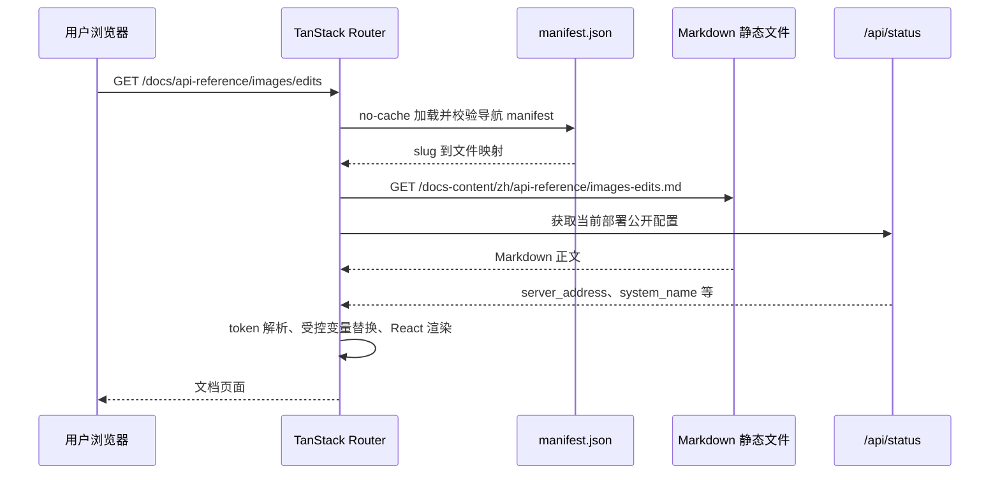

# 内置 API 文档中心架构

## 1. 文档定位

本文定义面向第三方调用方的 API 文档中心在当前 Web 项目中的长期架构。该文档中心使用 Markdown 作为内容来源，通过现有 React、TanStack Router 和 Rsbuild 构建链路发布，最终继续由 Go 服务嵌入并提供静态资源。

本文回答以下问题：

- 外部 API 文档如何与内部工程文档隔离；
- 如何在不增加 Mintlify、VitePress 等独立构建和部署系统的前提下提供文档站体验；
- Markdown 内容、导航、路由、渲染、搜索和动态站点信息分别由谁负责；
- 如何避免公开 渠道细节、后台管理接口或不稳定实现字段；
- 如何保持现有单次 Web 构建和单个 Go 二进制部署方式；
- API 合同、OpenAPI 和面向用户的 Markdown 说明如何协同治理。

本文描述已经落地的文档中心架构。内容覆盖范围与上线验收仍以公开 operation 白名单、构建校验和
[内置 API 文档中心实施计划](../50-planning/内置API文档中心实施计划.md)中的剩余门禁为准；
`99-archive/` 中的旧实施方案只保留历史背景。

### 1.1 当前实现状态

截至 2026-08-04，首期代码已经按本架构落地：

- `docs/openapi/public-operations.json` 已冻结 32 个 operation，并由构建脚本与审计后的 `docs/openapi/relay.json` 交叉校验；
- `web/public/docs-content/` 已包含受控 manifest、17 篇中文 Markdown 和构建期搜索索引；
- `web/src/features/docs/` 与 `web/src/routes/docs/` 已提供公开路由、三栏/移动布局、目录、搜索、分页、代码复制和安全 token 渲染；
- 首页与顶部导航已统一复用 `docs_link` 回退规则，示例 Base URL 由公开站点状态与当前 origin 动态推导；
- `bun run build` 已强制执行源内容、合同与最终 `dist` 审计，Go 侧已固定 manifest 缓存和深层路由刷新测试。

当前剩余的是发布前浏览器视口、主题、纯键盘和真实部署缓存的人工验收，以及仓库既有的全局 lint/format 基线清理；这些事项不改变本文架构边界。

## 2. 架构决策摘要

文档中心采用以下决策：

1. 文档中心内置于当前 `web/` 项目，不引入独立文档站构建、运行时或部署单元。
2. 外部文档内容使用 Markdown，存放在 `web/public/docs-content/`，由现有 Rsbuild 作为静态资源复制到 `web/dist/docs-content/`。
3. 文档页面使用独立的公开路由 `/docs` 和 `/docs/*`，不要求登录，不进入 `_authenticated` 布局。
4. 文档中心使用独立的 `features/docs` 模块，不扩写现有通用 Markdown 组件，不让文档特性影响首页、关于页或其他内容渲染。
5. 导航只读取受控的 `manifest.json`；URL slug 必须先解析为 manifest 中登记的文件，禁止按用户输入直接拼接任意文件路径。
6. 文档正文由浏览器按页加载，避免把全部 Markdown 编译进主 JavaScript 包。
7. 文档 UI 与正文分离：页面框架文案进入前端 i18n，API 正文按文档语言目录独立维护。
8. 首期只提供可复制示例，不提供在线携带 API Key 的 Try it 请求功能。
9. 公开内容开发前必须先完成 Link 合同矩阵、`docs/openapi/relay.json` 审计和机器可读 operation 白名单；后台 `docs/openapi/api.json` 永不进入公开文档产物。
10. Manifest 只负责导航和运行时文件解析，不等同于静态文件发布边界；`bun run build` 前必须执行公开目录全量清单、安全和合同校验。
11. Markdown 先解析为受控 token，再在文本或代码 token 中替换动态变量，并由 React 组件渲染；首期拒绝作者原始 HTML，不使用文档内容驱动的 `dangerouslySetInnerHTML`。
12. 标题、摘要、关键词和 `h2`/`h3` 搜索索引在同一次 Web 构建前生成，不在浏览器运行时抓取全站 Markdown。
13. 外部 `docs_link` 配置继续优先；空值或非法值才回退 `/docs`。首页、顶部导航和文档页必须复用同一链接解析规则。
14. 文档更新仍随当前应用重新构建和发布，不建立绕过代码审查的在线内容编辑通道。

## 3. 目标与非目标

### 3.1 目标

- 为第三方调用方提供稳定、可搜索、可复制的 API 接入说明。
- 提供类似专业文档站的顶部导航、左侧目录、正文和本页目录布局。
- 支持桌面端与移动端，并保持键盘导航和可访问名称。
- 根据当前部署动态展示 Base URL，禁止在正文中写死生产域名。
- 用公开 Link 合同组织内容，不要求用户理解渠道、供应商适配器或内部 Task 数据。
- 让文档内容和对应 API 代码在同一次变更中审查、测试和发布。
- 保持当前 `bun run build -> web/dist -> Go embed` 的交付链路。

### 3.2 非目标

- 不引入 Mintlify 运行时、Mintlify 托管或独立文档子域名。
- 不把现有 `docs/` 内部架构、运维、研究和开发草稿直接发布到互联网。
- 不为文档建设 CMS、数据库表或管理员在线 Markdown 编辑器。
- 不自动公开全部 Gin 路由、DTO 字段或 Provider 私有参数。
- 不公开后台管理 API、渠道配置 API、内部审计字段或凭据结构。
- 不在首期实现 API Key 自动填充、浏览器在线调用、SDK 自动生成或服务端全文检索。
- 不以文档建设为由重构现有 Router、Relay、DTO 或 Markdown 通用组件。

## 4. 架构原则

### 4.1 公开合同优先

文档描述的是第三方调用方可依赖的 Link 合同，而不是当前代码中能够解析的所有字段。DTO 中的兼容字段、历史别名、`Extra`、Provider 转换字段和 Provider 特例不能因为“代码支持”就自动进入公开文档。

公开内容来源优先级为：

```text
已确认的 NEWAPI 原生合同或显式 Link 合同
  -> Link 扩展对应的模型厂商官方合同
  -> 已完成真实验证并明确发布的本地扩展
```

第三方聚合商或反代文档只能作为渠道适配依据，不得直接成为公开合同。

公开面必须由显式 operation 白名单控制，不得使用路径前缀、Go DTO 反射或 Gin 路由枚举自动推导。例如 `/api/v3/contents/generations/tasks` 是已经发布的 ModelArk 视频 Link 合同，不能因为路径以 `/api` 开头而被当作后台管理 API；相反，后台 `docs/openapi/api.json` 即使结构完整也不得进入白名单。

首期合同审计至少覆盖：

- 文本：模型发现、Chat Completions、Responses、Anthropic Messages；
- 图片：统一生成、编辑和图片 Task 查询；
- 视频：ModelArk、Kling、即梦各自的创建、查询、取消或结果读取合同；
- 素材：平台素材 CRUD、绑定、迁移和真人授权中明确面向普通 API 调用方的 operation；
- 各协议的鉴权、Content-Type、字段上限、错误信封、幂等、流式或异步生命周期。

### 4.2 内容与渲染分离

Markdown 文件只保存正文、示例和少量声明式元数据；路由、布局、权限、安全过滤、代码复制和动态变量替换由 React 文档模块负责。

正文不得嵌入任意脚本、事件处理器、原始 HTML 或需要执行的 React 代码。需要交互的功能由受控 React 组件统一实现，不能允许 Markdown 自行注入。代码高亮使用 Shiki token 输出并由 React 渲染，不接收作者提供的高亮 HTML。

### 4.3 独立模块、最小接线

新增逻辑集中在：

```text
web/src/features/docs/
web/src/routes/docs/
web/public/docs-content/
web/scripts/docs/
```

现有文件只允许完成以下窄接线：

- 注册公开文档路由；
- 让首页和顶部导航复用统一的文档链接解析器；
- 增加文档框架所需 i18n 键；
- 将公开内容校验和搜索索引生成接入唯一的 `bun run build`；
- 必要时对文档 manifest 增加窄范围缓存规则。

现有 `web/src/components/ui/markdown.tsx` 保持原职责，不扩展为文档站框架。

### 4.4 默认安全

- 文档不接收或保存真实 API Key。
- 示例只使用 `sk-your-key` 等占位符。
- 作者原始 HTML 在构建校验时拒绝，运行时不渲染。
- 受控扩展原则上不得输出 HTML 字符串；确需输出的生成片段必须经过独立、最小允许列表的 DOMPurify 净化。
- 文档路由只读取 manifest 白名单文件；公开目录本身还必须通过构建时全量文件清单校验。
- 内部链接使用客户端路由；只有外部 HTTP(S) 链接才打开新窗口。
- 首期不支持远程图片、SVG、MathML、style、iframe、脚本、表单、可执行 URL 和在线 API 调试。
- 动态站点变量只能写入文本或代码 token，不能在 Markdown 源字符串上做无上下文的全局替换。

## 5. 系统上下文

```mermaid
flowchart LR
    Author[文档维护者]
    Contract[公开 Link 合同与 OpenAPI]
    Allowlist[公开 Operation 白名单]
    Markdown[Markdown 内容]
    Manifest[导航 Manifest]

    subgraph WebBuild[现有 Web 构建]
        Validator[公开内容与合同校验]
        SearchIndex[搜索索引生成]
        DocsModule[React Docs 模块]
        Rsbuild[Rsbuild]
        Dist[web/dist]
    end

    subgraph Runtime[现有 Go 运行时]
        Embed[Go embed]
        Static[静态资源服务]
        Status[/api/status]
    end

    User[第三方调用方]

    Author --> Markdown
    Author --> Manifest
    Contract --> Allowlist
    Allowlist --> Validator
    Markdown --> Validator
    Manifest --> Validator
    Validator --> SearchIndex
    Validator --> Rsbuild
    SearchIndex --> Rsbuild
    DocsModule --> Rsbuild
    Rsbuild --> Dist --> Embed --> Static
    User --> Static
    User --> DocsModule
    DocsModule --> Status
```

文档中心不新增后端业务层、数据库或独立服务。Go 继续提供现有静态文件和 `/api/status`，只允许为 manifest 缓存一致性增加窄范围静态响应规则；文档加载、导航和渲染均在前端完成。

## 6. 构建与运行链路

### 6.1 构建链路

```text
docs/openapi/relay.json
docs/openapi/public-operations.json
web/public/docs-content/**/*.md
web/public/docs-content/manifest.json
web/scripts/docs/**
web/src/features/docs/**
  -> bun run docs:validate
  -> 生成 web/public/docs-content/generated/search-index.json
  -> bun run build
  -> Rsbuild
  -> web/dist/docs-content/**
  -> go:embed web/dist
```

`bun run docs:validate` 是内部可单独运行的诊断命令，但必须作为 `bun run build` 的强制前置阶段。发布者仍只需记住一个生产构建入口；校验失败必须阻止生成 `web/dist`，不能降级为 warning。

### 6.2 运行链路



页面刷新仍由现有 Go `NoRoute` 返回 SPA `index.html`，随后由 TanStack Router 恢复文档路由。Markdown 静态文件由 `web/dist` 直接提供。

## 7. 目录与内容边界

### 7.1 内部与外部文档隔离

| 目录                       | 读者           | 内容                             | 是否公开               |
| -------------------------- | -------------- | -------------------------------- | ---------------------- |
| `docs/`                    | 开发、运维、AI | 架构、ADR、研究、方案、运维      | 否                     |
| `web/public/docs-content/` | API 调用方     | 快速开始、协议、接口、错误、示例 | 是                     |
| `docs/openapi/relay.json`  | 工程与合同校验 | 模型调用公开合同候选             | 审计后按需生成公开副本 |
| `docs/openapi/public-operations.json` | 工程与合同校验 | 已批准公开的 operationId 清单 | 否，构建时只读取 |
| `docs/openapi/api.json`    | 工程内部       | 后台管理接口                     | 永不公开               |

任何从 `docs/` 进入公开目录的内容都必须经过人工选择和脱敏，不能整目录复制。

`web/public/docs-content/` 中的文件会被静态服务器直接访问，manifest 不能阻止用户手工请求未登记文件。因此构建校验必须枚举该目录的实际文件，并要求它们精确属于以下集合：

- `manifest.json`；
- manifest 登记的 Markdown；
- manifest 显式登记的本地静态资源；
- 构建脚本生成的固定文件，例如 `generated/search-index.json`。

未登记 Markdown、符号链接、隐藏文件、临时文件、内部 OpenAPI、副本和未知生成文件一律使构建失败。

### 7.2 推荐内容结构

```text
web/public/docs-content/
├── manifest.json
├── zh/
│   ├── index.md
│   ├── getting-started/
│   │   ├── quickstart.md
│   │   ├── authentication.md
│   │   └── base-url.md
│   ├── concepts/
│   │   ├── models.md
│   │   ├── errors.md
│   │   ├── rate-limits.md
│   │   ├── billing.md
│   │   └── idempotency.md
│   ├── api-reference/
│   │   ├── text/
│   │   │   ├── models-list.md
│   │   │   ├── chat-completions.md
│   │   │   ├── responses-create.md
│   │   │   └── messages-create.md
│   │   ├── images/
│   │   │   ├── generations.md
│   │   │   ├── edits.md
│   │   │   └── task-get.md
│   │   ├── videos/
│   │   │   ├── modelark.md
│   │   │   ├── kling.md
│   │   │   └── jimeng.md
│   │   └── assets/
│   │       ├── overview.md
│   │       ├── create-and-manage.md
│   │       └── real-person-authorization.md
│   └── guides/
│       ├── cursor.md
│       ├── claude-code.md
│       └── troubleshooting.md
└── generated/
    └── search-index.json
```

这里列出的是合同审计候选页面，不代表所有 operation 必须发布。最终页面必须以公开 operation 白名单为准；未通过真实 Link 合同确认的素材、视频或授权 operation 保持未发布。

首期只要求 `zh/`。未来增加语言时按相同 page id 和 slug 建立 `en/` 等目录，避免把不同语言正文塞进前端 i18n JSON。

## 8. 组件职责

| 组件                | 职责                                       | 不承担的职责                    |
| ------------------- | ------------------------------------------ | ------------------------------- |
| Docs Route          | 解析 `/docs/*`、加载当前页面、设置页面标题 | 不直接拼接 Markdown 文件路径    |
| Docs Layout         | 顶部栏、侧栏、正文、本页目录、移动端抽屉   | 不解析 Markdown                 |
| Build Validator     | 校验合同、manifest、公开目录全量文件和敏感内容 | 不把内部 OpenAPI 复制到公开目录 |
| Manifest Loader     | no-cache 加载、校验并在会话内复用 manifest | 不从目录自动发现未登记页面      |
| Docs Content Loader | 按 manifest 映射获取单页 Markdown          | 不允许跨目录或任意 URL          |
| Docs Markdown       | Marked token 解析、受控变量替换和 React 渲染 | 不执行或渲染作者原始 HTML       |
| Heading/TOC         | 生成稳定标题 ID 和本页目录                 | 不修改正文合同                  |
| Code Block          | Shiki token 高亮、语言标记、复制反馈       | 不执行代码或接收高亮 HTML       |
| Docs Search         | 加载构建期索引，搜索标题、关键词、摘要和 heading | 不抓取 Markdown 或内部 `docs/` |
| `/api/status`       | 提供部署相关公开信息                       | 不提供用户 API Key 或管理员配置 |

## 9. Manifest 合同

Manifest 是公开文档导航、运行时文件解析和本地资源登记表。首期 schema 必须为未来多语言保留明确层级：

```json
{
  "schemaVersion": 1,
  "contentVersion": "2026-07-29.1",
  "defaultLocale": "zh",
  "locales": {
    "zh": {
      "groups": [
        {
          "id": "getting-started",
          "title": "开始使用",
          "pages": [
            {
              "id": "quickstart",
              "title": "快速开始",
              "slug": "quickstart",
              "file": "zh/getting-started/quickstart.md",
              "description": "完成第一次 API 调用",
              "keywords": ["API Key", "Base URL"],
              "assets": []
            }
          ]
        }
      ]
    }
  }
}
```

约束如下：

- `schemaVersion` 只接受实现支持的整数版本；`contentVersion` 每次公开内容变化都必须更新；
- locale、group id、page id、slug、file 和 assets 在规定作用域内唯一；
- page id 是跨语言稳定身份，同一主题在不同 locale 中保持相同 page id 和 slug；
- slug 使用规范化的小写 ASCII 分段，匹配 `^[a-z0-9]+(?:-[a-z0-9]+)*(?:/[a-z0-9]+(?:-[a-z0-9]+)*)*$`；
- slug 和 file 禁止空段、`.`、`..`、反斜线、百分号、查询参数、fragment、控制字符和协议相对形式；
- file 必须以对应 locale 目录开头并以 `.md` 结尾，asset 必须位于对应 locale 的显式资源目录；
- 路由输入只做一次 URL 解码并与规范 slug 精确匹配，不对非法或大小写不同的路径进行猜测；
- 页面排序完全由 manifest 决定；
- 未登记文件不可通过文档路由访问；
- 未登记文件即使不经过文档路由，也必须由构建全量清单检查阻止进入 `web/dist/docs-content`；
- 外部链接不进入 `file`，只能作为页面正文或显式导航链接；
- 字符串长度、关键词数量、单页资源数、页面总数和文件大小必须有显式上限；
- manifest 校验失败时文档中心显示受控错误页，不猜测目录结构。

Manifest 的标题、摘要和关键词是导航与搜索的权威元数据。Markdown frontmatter 不重复这些字段，只保存：

```yaml
---
page-id: images-generations
kind: api-reference
last-verified: 2026-07-29
operations:
  - createImageGeneration
---
```

构建时必须校验 `page-id`、唯一 `h1`、manifest 标题和 operation 白名单的一致性。API Reference 的 operation 必须进一步校验方法、路径、Content-Type 和 OpenAPI schema；普通指南不得伪造 operation 绑定。

## 10. 路由与导航

### 10.1 公开路由

```text
/docs
/docs/quickstart
/docs/authentication
/docs/api-reference/models
/docs/api-reference/chat/completions
/docs/api-reference/images/generations
/docs/api-reference/images/edits
/docs/api-reference/images/tasks
/docs/api-reference/videos/modelark
/docs/api-reference/videos/kling
/docs/api-reference/videos/jimeng
/docs/api-reference/assets
```

`/docs` 默认进入概述页。不存在或非规范 slug 显示文档专用 404，并保留返回文档首页入口。路由切换后聚焦正文标题；带合法 `#heading` 的深层链接在内容加载完成后滚动到目标章节。

### 10.2 当前站点导航

站点已有 `docs_link` 配置。内置文档上线不覆盖现有外部配置；首页、顶部导航和文档页通过同一解析器遵循：

```text
空值                            -> 内部 /docs
合法 http:// 或 https://        -> 外部链接
单个 / 开头且不是 //            -> 内部 TanStack Router 链接
其他值                          -> 拒绝并安全回退 /docs
```

解析前先 trim；禁止 `javascript:`、`data:`、协议相对 URL、反斜线和控制字符。不能因为 `docs_link` 非空就一律按外部链接处理，也不能让非法配置进入 `<a href>`。

### 10.3 文档内部链接

- `/docs/...` 使用客户端路由；
- `#heading` 保持当前页面锚点跳转；
- 合法 `http://`、`https://` 使用新窗口和 `noopener noreferrer`；
- 不支持协议相对 URL、`javascript:`、`data:`、`file:` 等其他协议；
- Markdown 相对链接必须解析为 manifest 中已登记的逻辑 slug，不能直接解析为 Markdown 文件路径；
- 首期图片只允许 manifest 登记的本地资源，外部图片和内联 data URL 均拒绝。

## 11. Markdown 渲染与安全

渲染顺序固定为：

```text
读取 Markdown
  -> 解析受控 frontmatter
  -> Marked lexer 解析 token
  -> 拒绝 raw HTML 与未支持 token
  -> 仅在文本/代码 token 中替换公开站点变量
  -> 为 heading 生成稳定 ID
  -> 校验并分类链接与本地资源
  -> React 受控组件渲染
  -> Shiki codeToTokens 按需高亮
```

允许的动态占位符首期限定为：

```text
{{SYSTEM_NAME}}
{{SITE_BASE_URL}}
{{OPENAI_BASE_URL}}
{{ANTHROPIC_BASE_URL}}
{{API_KEY_PLACEHOLDER}}
{{MODEL_ID_PLACEHOLDER}}
```

这些值只能来自公开站点状态、当前请求 origin 或固定占位符。禁止从 localStorage、用户令牌列表、Cookie 或真实登录凭据自动填充。

变量替换要求：

- `SYSTEM_NAME` 作为纯文本 token 输出；
- Base URL 必须先通过 HTTP(S) URL 校验和协议路径归一化，再作为文本或代码输出；
- API Key 与模型始终使用固定占位符，不读取当前登录用户数据；
- 未知占位符使构建失败，运行时不做模糊替换；
- 状态接口失败时以当前 origin 推导 Base URL，不阻塞静态正文。

首期不支持作者原始 HTML。构建器发现 HTML token、MDX、内联 SVG、MathML、表单或 style 时直接失败；运行时再次丢弃这些 token。表格、提示块、代码块和链接均由受控 React 组件渲染。

Shiki 使用 `codeToTokens` 或等价 token API，代码文本由 React 转义，颜色值只来自已加载主题，不接收 Markdown 中的 style。若某个受控扩展必须输出 HTML 字符串，该片段必须在独立模块中用 DOMPurify 的显式 `ALLOWED_TAGS`、`ALLOWED_ATTR`、`FORBID_TAGS`、`FORBID_ATTR` 和 URI 规则净化；净化后不得重新写入未经 URL 解析器验证的属性。

Heading ID 使用固定算法：对 heading 纯文本做 Unicode NFKC、trim、小写和稳定分段；空结果使用确定性 `section`，重复项依次添加 `-2`、`-3`。算法版本属于文档路由合同，变更时需要迁移旧锚点或提供兼容跳转。

## 12. API 合同与 OpenAPI 治理

### 12.1 合同边界

公开文档只覆盖 Relay 和明确发布的平台 API。以下内容不得进入公开 API Reference：

- `docs/openapi/api.json` 中的后台管理接口；
- 渠道、用户管理、系统设置和内部日志接口；
- Provider 真实模型 ID、渠道 ID、Key、Header override；
- Task `private_data` 和上游请求/响应原文；
- 未实现路由、仅兼容读取的存量路由；
- 未验证的供应商原生协议；
- DTO 捕获但未声明为公共合同的未知字段。

是否公开按 operationId 白名单判断，禁止按 `/api`、`/v1` 等路径前缀粗略判断。公开白名单只记录已批准 operationId 和必要的发布状态，不复制 schema；schema 仍以审计后的 `relay.json` 为机器合同。

### 12.2 OpenAPI 协作方式

实施前置门禁：

- 建立 `docs/openapi/public-operations.json`；
- 审计并修正 `relay.json` 中图片 Qwen 私有结构、重复 operationId、缺失的图片 Task、视频、素材和错误响应；
- 明确退休、存量只读、未实现和未验证 operation，不得进入白名单；
- 校验 Gin 路由、OpenAPI 路径/方法/operationId 和 Markdown frontmatter；
- 每个 API Reference 记录鉴权、Content-Type、字段上限、响应、错误、幂等或任务生命周期和最后验证日期。

首期 Markdown 页面人工维护，但结构化参数表和示例必须通过 OpenAPI 校验。经过白名单筛选的生成内容只能进入 `web/public/docs-content/generated/`，且同样受公开目录全量清单约束。

长期：

- OpenAPI 定义机器合同；
- Markdown 定义使用说明、场景、限制、错误处理和教程；
- CI 阻止路由、OpenAPI 和 Markdown 三者明显漂移。

## 13. 搜索、目录与可访问性

### 13.1 搜索

首期搜索范围：

- 页面标题；
- description；
- keywords；
- heading。

这些字段在 `bun run docs:validate` 中从 manifest 和已登记 Markdown 的 `h2`/`h3` 生成到 `generated/search-index.json`。浏览器首次打开搜索时按需加载当前 locale 索引，不在运行时抓取全部 Markdown。全文正文搜索不在首期范围内。

索引生成必须保证稳定排序、去重和大小上限；未登记页面、其他 locale、原始正文、代码内容和内部 `docs/` 不得进入索引。

### 13.2 本页目录

- 只收集 `h2` 和 `h3`；
- heading ID 在同一页面内稳定且唯一；
- 滚动时高亮当前章节；
- 桌面端固定在右侧，移动端进入抽屉；
- 键盘和屏幕阅读器可以访问目录链接。

### 13.3 布局

桌面端采用：

```text
顶部文档导航
  -> 左侧文档目录
  -> 中间正文
  -> 右侧本页目录
```

移动端隐藏左右固定栏，通过带 `aria-expanded` 的按钮打开目录。代码块横向滚动，复制按钮始终可达。

## 14. 缓存与性能

- Docs 路由保持独立代码分割，不增加首页初始包。
- Manifest 使用 `cache: no-store` 或等价 no-cache 语义加载，校验成功后才在当前会话内复用。
- 现有静态中间件默认对非根资源缓存一周，因此必须对 `/docs-content/manifest.json` 增加窄范围 `no-cache, must-revalidate` 规则，或提供经验证等价的构建版本 cache-bust；不能只依赖响应中的自定义版本头。
- 页面 Markdown 和搜索索引按 `contentVersion` 附加查询参数；部署为单个 Go embed 版本，manifest 与内容必须来自同一构建产物。
- 页面切换可以预取当前页相邻文档，但不得启动全站无界并发抓取。
- Shiki 或等价高亮逻辑只在进入文档路由时加载。
- 单页 Markdown 应保持可审查大小，超大参考内容拆成多个主题页。

## 15. 错误与降级

| 场景               | 行为                                         |
| ------------------ | -------------------------------------------- |
| manifest 加载失败  | 显示文档不可用错误和重试按钮                 |
| slug 不存在        | 显示文档 404，不回退首页正文                 |
| Markdown 文件缺失  | 显示内容加载失败并记录开发环境诊断           |
| Markdown 解析失败  | 不渲染半成品 HTML，显示受控错误              |
| `/api/status` 失败 | 使用当前 origin 和安全占位符，不阻塞静态正文 |
| 代码高亮失败       | 降级为转义后的纯文本代码块                   |
| 搜索索引失败       | 保留目录导航，隐藏或禁用搜索                 |

普通用户错误页面不得包含绝对文件路径、原始 Markdown、堆栈或内部配置。

构建期的合同、公开目录清单、raw HTML、未知占位符、敏感内容或索引生成错误不允许运行时降级，必须直接阻止生产构建。

## 16. 国际化

文档框架文案使用现有 `react-i18next`：

- 搜索；
- 复制、复制成功；
- 上一页、下一页；
- 打开目录；
- 文档加载失败；
- 未找到页面。

正文使用独立语言文件：

```text
docs-content/zh/...
docs-content/en/...
```

Manifest 按 locale 分组，同一主题在不同语言下保持相同 page id 和逻辑 slug。当前 UI locale 不存在或单页缺失时回退 `defaultLocale`，并明确展示当前回退状态；不把整篇 Markdown 存入 i18n JSON。

## 17. 备选方案

### 17.1 Mintlify 独立文档站

未采用。其搜索、API Reference 和内容体验成熟，但需要独立构建/托管，并使文档发布脱离当前单二进制交付要求。

### 17.2 VitePress 或 Docusaurus

未采用。可自托管且适合 Markdown，但仍形成第二套前端框架和构建链路，增加依赖、部署和主题维护。

### 17.3 直接扩展通用 Markdown 组件

未采用。现有组件同时服务其他页面，加入文档导航、heading、代码复制和链接改写会扩大回归面，并违背最小入侵约束。

### 17.4 将内部 `docs/` 整体发布

未采用。内部文档包含架构、运维、研究、实现草稿和可能的敏感执行细节，不符合公开内容最小化原则。

## 18. 演进约束

- 新增接口页面前先确认接口已公开且合同可追溯。
- 新增或删除公开 API 必须在同一变更中更新 Gin 路由审计、`relay.json`、公开 operation 白名单和对应 Markdown。
- 文档不得先于能力发布而宣称支持。
- 废弃页面必须提供迁移说明和重定向，不能直接复用旧 slug 表示新合同。
- Manifest schema、heading ID 算法、slug 和公开 operationId 都属于稳定合同；不兼容变更必须升级版本并提供迁移。
- `docs:validate`、组件测试和最终 `web/dist/docs-content` 审计属于发布门禁，不得标记为可选。
- 引入在线 Try it 前必须单独完成 API Key、CORS、代理、日志和文件上传安全设计。
- 若未来文档规模、SEO 或独立发布需求超过当前 SPA 能力，应重新评估静态站点生成，但不得同时维护两套正文事实来源。
