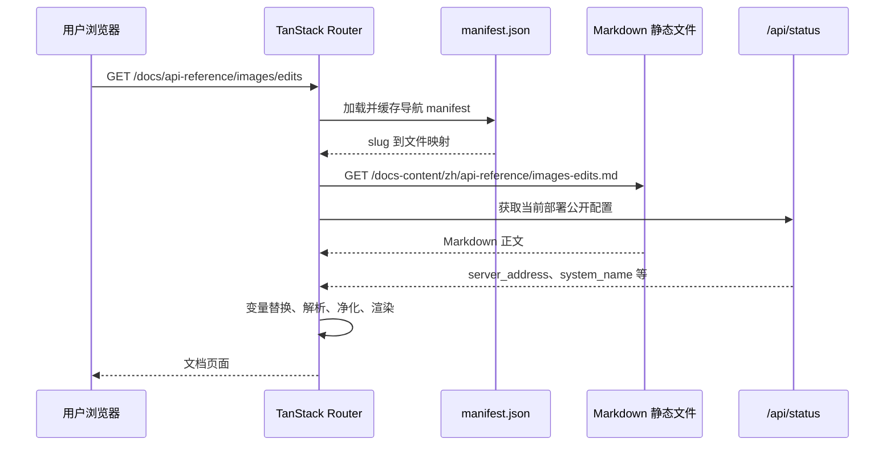

# 内置 API 文档中心架构

## 1. 文档定位

本文定义面向第三方调用方的 API 文档中心在当前 Web 项目中的长期架构。该文档中心使用 Markdown 作为内容来源，通过现有 React、TanStack Router 和 Rsbuild 构建链路发布，最终继续由 Go 服务嵌入并提供静态资源。

本文回答以下问题：

- 外部 API 文档如何与内部工程文档隔离；
- 如何在不增加 Mintlify、VitePress 等独立构建和部署系统的前提下提供文档站体验；
- Markdown 内容、导航、路由、渲染、搜索和动态站点信息分别由谁负责；
- 如何避免公开南向渠道细节、后台管理接口或不稳定实现字段；
- 如何保持现有单次 Web 构建和单个 Go 二进制部署方式；
- API 合同、OpenAPI 和面向用户的 Markdown 说明如何协同治理。

本文不表示当前所有 API 文档内容已经完成。具体编码顺序、文件清单、测试和发布门禁见 [内置 API 文档中心实施方案](../80-dev/2026-07-28-内置API文档中心实施方案.md)。

## 2. 架构决策摘要

文档中心采用以下决策：

1. 文档中心内置于当前 `web/` 项目，不引入独立文档站构建、运行时或部署单元。
2. 外部文档内容使用 Markdown，存放在 `web/public/docs-content/`，由现有 Rsbuild 作为静态资源复制到 `web/dist/docs-content/`。
3. 文档页面使用独立的公开路由 `/docs` 和 `/docs/*`，不要求登录，不进入 `_authenticated` 布局。
4. 文档中心使用独立的 `features/docs` 模块，不扩写现有通用 Markdown 组件，不让文档特性影响首页、关于页或其他内容渲染。
5. 导航只读取受控的 `manifest.json`；URL slug 必须先解析为 manifest 中登记的文件，禁止按用户输入直接拼接任意文件路径。
6. 文档正文由浏览器按页加载，避免把全部 Markdown 编译进主 JavaScript 包。
7. 文档 UI 与正文分离：页面框架文案进入前端 i18n，API 正文按文档语言目录独立维护。
8. 首期只提供可复制示例，不提供在线携带 API Key 的 Try it 请求功能。
9. `docs/openapi/relay.json` 继续作为公开 Relay 合同的机器可读候选来源，但必须在完成合同审计后才能参与公开页面生成；后台 `docs/openapi/api.json` 永不进入公开文档产物。
10. 文档更新仍随当前应用重新构建和发布，不建立绕过代码审查的在线内容编辑通道。

## 3. 目标与非目标

### 3.1 目标

- 为第三方调用方提供稳定、可搜索、可复制的 API 接入说明。
- 提供类似专业文档站的顶部导航、左侧目录、正文和本页目录布局。
- 支持桌面端与移动端，并保持键盘导航和可访问名称。
- 根据当前部署动态展示 Base URL，禁止在正文中写死生产域名。
- 用公开北向合同组织内容，不要求用户理解渠道、供应商适配器或内部 Task 数据。
- 让文档内容和对应 API 代码在同一次变更中审查、测试和发布。
- 保持当前 `bun run build -> web/dist -> Go embed` 的交付链路。

### 3.2 非目标

- 不引入 Mintlify 运行时、Mintlify 托管或独立文档子域名。
- 不把现有 `docs/` 内部架构、运维、研究和开发草稿直接发布到互联网。
- 不为文档建设 CMS、数据库表或管理员在线 Markdown 编辑器。
- 不自动公开全部 Gin 路由、DTO 字段或 Provider 私有参数。
- 不公开后台管理 API、渠道配置 API、内部审计字段或凭据结构。
- 不在首期实现 API Key 自动填充、浏览器在线调用、SDK 自动生成或服务端全文检索。
- 不以文档建设为由重构现有 Router、Relay、DTO 或 Markdown 通用组件。

## 4. 架构原则

### 4.1 公开合同优先

文档描述的是第三方调用方可依赖的北向合同，而不是当前代码中能够解析的所有字段。DTO 中的兼容字段、历史别名、`Extra`、南向转换字段和 Provider 特例不能因为“代码支持”就自动进入公开文档。

公开内容来源优先级为：

```text
已确认的 NEWAPI 北向合同
  -> 对应模型厂商官方合同
  -> 已完成真实验证并明确发布的本地扩展
```

第三方聚合商或反代文档只能作为南向适配依据，不得直接成为公开合同。

### 4.2 内容与渲染分离

Markdown 文件只保存正文、示例和少量声明式元数据；路由、布局、权限、安全过滤、代码复制和动态变量替换由 React 文档模块负责。

正文不得嵌入任意脚本、事件处理器或需要执行的 React 代码。需要交互的功能应由受控组件统一实现，不能允许 Markdown 自行注入。

### 4.3 独立模块、最小接线

新增逻辑集中在：

```text
web/src/features/docs/
web/src/routes/docs/
web/public/docs-content/
```

现有文件只允许完成以下窄接线：

- 注册公开文档路由；
- 将站点文档导航指向 `/docs`；
- 增加文档框架所需 i18n 键；
- 必要时增加同一 Web 构建内的文档校验脚本。

现有 `web/src/components/ui/markdown.tsx` 保持原职责，不扩展为文档站框架。

### 4.4 默认安全

- 文档不接收或保存真实 API Key。
- 示例只使用 `sk-your-key` 等占位符。
- Markdown 生成的 HTML 必须经过 DOMPurify。
- 文档文件必须来自 manifest 白名单。
- 内部链接使用客户端路由；只有外部 HTTP(S) 链接才打开新窗口。
- 首期不支持任意 HTML iframe、远程脚本、表单提交和在线 API 调试。

## 5. 系统上下文

```mermaid
flowchart LR
    Author[文档维护者]
    Contract[公开北向合同与 OpenAPI]
    Markdown[Markdown 内容]
    Manifest[导航 Manifest]

    subgraph WebBuild[现有 Web 构建]
        DocsModule[React Docs 模块]
        Rsbuild[Rsbuild]
        Dist[web/dist]
    end

    subgraph Runtime[现有 Go 运行时]
        Embed[Go embed]
        Static[静态资源服务]
        Status[/api/status]
    end

    User[第三方调用方]

    Author --> Markdown
    Author --> Manifest
    Contract -.校验与生成.-> Markdown
    Markdown --> Rsbuild
    Manifest --> Rsbuild
    DocsModule --> Rsbuild
    Rsbuild --> Dist --> Embed --> Static
    User --> Static
    User --> DocsModule
    DocsModule --> Status
```

文档中心不新增后端业务层、数据库或独立服务。Go 只继续提供现有静态文件和 `/api/status`；文档加载、导航和渲染均在前端完成。

## 6. 构建与运行链路

### 6.1 构建链路

```text
web/public/docs-content/**/*.md
web/public/docs-content/manifest.json
web/src/features/docs/**
  -> bun run build
  -> Rsbuild
  -> web/dist/docs-content/**
  -> go:embed web/dist
```

首期不需要额外文档构建命令。后续加入文档校验或搜索索引生成时，可以把脚本接入现有 `bun run build` 前置阶段，但对维护者仍保持一个统一构建入口。

### 6.2 运行链路



页面刷新仍由现有 Go `NoRoute` 返回 SPA `index.html`，随后由 TanStack Router 恢复文档路由。Markdown 静态文件由 `web/dist` 直接提供。

## 7. 目录与内容边界

### 7.1 内部与外部文档隔离

| 目录 | 读者 | 内容 | 是否公开 |
| --- | --- | --- | --- |
| `docs/` | 开发、运维、AI | 架构、ADR、研究、方案、运维 | 否 |
| `web/public/docs-content/` | API 调用方 | 快速开始、协议、接口、错误、示例 | 是 |
| `docs/openapi/relay.json` | 工程与合同校验 | 模型调用公开合同候选 | 审计后按需生成公开副本 |
| `docs/openapi/api.json` | 工程内部 | 后台管理接口 | 永不公开 |

任何从 `docs/` 进入公开目录的内容都必须经过人工选择和脱敏，不能整目录复制。

### 7.2 推荐内容结构

```text
web/public/docs-content/
├── manifest.json
├── zh/
│   ├── index.md
│   ├── getting-started/
│   │   ├── quickstart.md
│   │   ├── authentication.md
│   │   └── base-url.md
│   ├── concepts/
│   │   ├── models.md
│   │   ├── errors.md
│   │   ├── rate-limits.md
│   │   ├── billing.md
│   │   └── idempotency.md
│   ├── api-reference/
│   │   ├── models-list.md
│   │   ├── chat-completions.md
│   │   ├── responses-create.md
│   │   ├── images-generations.md
│   │   ├── images-edits.md
│   │   └── images-task-get.md
│   └── guides/
│       ├── cursor.md
│       ├── claude-code.md
│       └── troubleshooting.md
└── generated/
    └── search-index.json
```

首期只要求 `zh/`。未来增加语言时按相同 slug 建立 `en/` 等目录，避免把不同语言正文塞进前端 i18n JSON。

## 8. 组件职责

| 组件 | 职责 | 不承担的职责 |
| --- | --- | --- |
| Docs Route | 解析 `/docs/*`、加载当前页面、设置页面标题 | 不直接拼接 Markdown 文件路径 |
| Docs Layout | 顶部栏、侧栏、正文、本页目录、移动端抽屉 | 不解析 Markdown |
| Manifest Loader | 加载、校验并缓存 manifest | 不从目录自动发现未登记页面 |
| Docs Content Loader | 按 manifest 映射获取单页 Markdown | 不允许跨目录或任意 URL |
| Docs Markdown | 变量替换、Marked 解析、DOMPurify 净化 | 不执行 Markdown 中的脚本或组件 |
| Heading/TOC | 生成稳定标题 ID 和本页目录 | 不修改正文合同 |
| Code Block | 语法高亮、语言标记、复制反馈 | 不执行示例代码 |
| Docs Search | 搜索标题、关键词、摘要和受控正文索引 | 不查询内部 `docs/` |
| `/api/status` | 提供部署相关公开信息 | 不提供用户 API Key 或管理员配置 |

## 9. Manifest 合同

Manifest 是公开文档导航和文件访问的唯一登记表，至少包含：

```json
{
  "version": "2026-07-28",
  "defaultLocale": "zh",
  "groups": [
    {
      "id": "getting-started",
      "title": "开始使用",
      "pages": [
        {
          "title": "快速开始",
          "slug": "quickstart",
          "file": "zh/getting-started/quickstart.md",
          "description": "完成第一次 API 调用",
          "keywords": ["API Key", "Base URL"]
        }
      ]
    }
  ]
}
```

约束如下：

- `id`、`slug` 和 `file` 在各自作用域内唯一；
- `slug` 不以 `/` 开头，不包含 `..`、查询参数或 fragment；
- `file` 必须位于 `/docs-content/` 下并以 `.md` 结尾；
- 页面排序完全由 manifest 决定；
- 未登记文件不可通过文档路由访问；
- 外部链接不进入 `file`，只能作为页面正文或显式导航链接；
- manifest 校验失败时文档中心显示受控错误页，不猜测目录结构。

## 10. 路由与导航

### 10.1 公开路由

```text
/docs
/docs/quickstart
/docs/authentication
/docs/api-reference/models
/docs/api-reference/chat/completions
/docs/api-reference/images/generations
/docs/api-reference/images/edits
/docs/api-reference/images/tasks
```

`/docs` 默认进入概述页。不存在的 slug 显示文档专用 404，并保留返回文档首页入口。

### 10.2 当前站点导航

站点已有 `docs_link` 配置。内置文档上线后，运行时将其设置为 `/docs`。导航判断必须遵循：

```text
http:// 或 https:// -> 外部链接
/ 开头             -> 内部 TanStack Router 链接
```

不能因为 `docs_link` 非空就一律按外部链接处理。

### 10.3 文档内部链接

- `/docs/...` 使用客户端路由；
- `#heading` 保持当前页面锚点跳转；
- `https://...` 使用新窗口和 `noopener noreferrer`；
- 不支持 `javascript:`、`data:` 等可执行协议；
- Markdown 相对链接在解析后必须仍落入已登记文档 slug。

## 11. Markdown 渲染与安全

渲染顺序固定为：

```text
读取 Markdown
  -> 解析受控 frontmatter
  -> 替换公开站点变量
  -> 解析 Markdown token
  -> 为 heading 生成稳定 ID
  -> 渲染代码块等受控扩展
  -> DOMPurify
  -> 调整内部/外部链接
  -> React 展示
```

允许的动态占位符首期限定为：

```text
{{SYSTEM_NAME}}
{{OPENAI_BASE_URL}}
{{ANTHROPIC_BASE_URL}}
{{API_KEY_PLACEHOLDER}}
{{MODEL_ID_PLACEHOLDER}}
```

这些值只能来自公开站点状态、当前请求 origin 或固定占位符。禁止从 localStorage、用户令牌列表、Cookie 或真实登录凭据自动填充。

原始 HTML 即使被 Markdown 解析，也必须经过允许列表净化。`script`、`style`、`iframe`、事件属性、表单和危险 URL 协议必须移除。

## 12. API 合同与 OpenAPI 治理

### 12.1 合同边界

公开文档只覆盖 Relay 和明确发布的平台 API。以下内容不得进入公开 API Reference：

- `/api` 后台管理接口；
- 渠道、用户管理、系统设置和内部日志接口；
- Provider 真实模型 ID、渠道 ID、Key、Header override；
- Task `private_data` 和上游请求/响应原文；
- 未实现路由、仅兼容读取的存量路由；
- 未验证的供应商原生协议；
- DTO 捕获但未声明为公共合同的未知字段。

### 12.2 OpenAPI 协作方式

短期：

- Markdown 页面人工维护；
- `docs/openapi/relay.json` 作为审计输入，不直接复制发布；
- 每个接口页面记录方法、路径、Content-Type、鉴权和最后验证日期。

中期：

- 修正 `relay.json` 与真实北向合同的偏差；
- 增加路由与 OpenAPI 路径、方法、`operationId` 的检查；
- 从经过白名单筛选的 OpenAPI operation 生成参数表或校验 Markdown 示例；
- 生成的公开产物进入 `web/public/docs-content/generated/`。

长期：

- OpenAPI 定义机器合同；
- Markdown 定义使用说明、场景、限制、错误处理和教程；
- CI 阻止路由、OpenAPI 和 Markdown 三者明显漂移。

## 13. 搜索、目录与可访问性

### 13.1 搜索

首期搜索范围：

- 页面标题；
- description；
- keywords；
- heading。

全文索引后续在同一 Web 构建前生成，浏览器只加载索引 JSON，不在每次搜索时抓取全部 Markdown。

### 13.2 本页目录

- 只收集 `h2` 和 `h3`；
- heading ID 在同一页面内稳定且唯一；
- 滚动时高亮当前章节；
- 桌面端固定在右侧，移动端进入抽屉；
- 键盘和屏幕阅读器可以访问目录链接。

### 13.3 布局

桌面端采用：

```text
顶部文档导航
  -> 左侧文档目录
  -> 中间正文
  -> 右侧本页目录
```

移动端隐藏左右固定栏，通过带 `aria-expanded` 的按钮打开目录。代码块横向滚动，复制按钮始终可达。

## 14. 缓存与性能

- Docs 路由保持独立代码分割，不增加首页初始包。
- Manifest 在会话内缓存，页面 Markdown 按需加载。
- 页面切换可以预取当前页相邻文档，但不得启动全站无界并发抓取。
- Shiki 或等价高亮逻辑只在进入文档路由时加载。
- Manifest 包含版本值；Markdown 请求可附带该版本，避免部署后继续命中旧内容。
- 单页 Markdown 应保持可审查大小，超大参考内容拆成多个主题页。

## 15. 错误与降级

| 场景 | 行为 |
| --- | --- |
| manifest 加载失败 | 显示文档不可用错误和重试按钮 |
| slug 不存在 | 显示文档 404，不回退首页正文 |
| Markdown 文件缺失 | 显示内容加载失败并记录开发环境诊断 |
| Markdown 解析失败 | 不渲染半成品 HTML，显示受控错误 |
| `/api/status` 失败 | 使用当前 origin 和安全占位符，不阻塞静态正文 |
| 代码高亮失败 | 降级为转义后的纯文本代码块 |
| 搜索索引失败 | 保留目录导航，隐藏或禁用搜索 |

普通用户错误页面不得包含绝对文件路径、原始 Markdown、堆栈或内部配置。

## 16. 国际化

文档框架文案使用现有 `react-i18next`：

- 搜索；
- 复制、复制成功；
- 上一页、下一页；
- 打开目录；
- 文档加载失败；
- 未找到页面。

正文使用独立语言文件：

```text
docs-content/zh/...
docs-content/en/...
```

同一主题在不同语言下保持相同逻辑 slug。语言缺失时回退默认语言，并明确展示当前回退状态；不把整篇 Markdown 存入 i18n JSON。

## 17. 备选方案

### 17.1 Mintlify 独立文档站

未采用。其搜索、API Reference 和内容体验成熟，但需要独立构建/托管，并使文档发布脱离当前单二进制交付要求。

### 17.2 VitePress 或 Docusaurus

未采用。可自托管且适合 Markdown，但仍形成第二套前端框架和构建链路，增加依赖、部署和主题维护。

### 17.3 直接扩展通用 Markdown 组件

未采用。现有组件同时服务其他页面，加入文档导航、heading、代码复制和链接改写会扩大回归面，并违背最小入侵约束。

### 17.4 将内部 `docs/` 整体发布

未采用。内部文档包含架构、运维、研究、实现草稿和可能的敏感执行细节，不符合公开内容最小化原则。

## 18. 演进约束

- 新增接口页面前先确认接口已公开且合同可追溯。
- 文档不得先于能力发布而宣称支持。
- 废弃页面必须提供迁移说明和重定向，不能直接复用旧 slug 表示新合同。
- 引入在线 Try it 前必须单独完成 API Key、CORS、代理、日志和文件上传安全设计。
- 若未来文档规模、SEO 或独立发布需求超过当前 SPA 能力，应重新评估静态站点生成，但不得同时维护两套正文事实来源。

