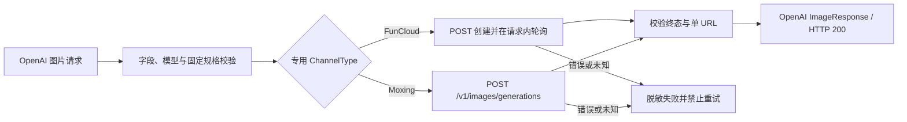

# 图片服务与异步 Provider 适配架构

## 1. 范围与状态

本文描述普通图片入口以及 `ChannelTypeAsyncImage`、`ChannelTypeMoxingImage` 两个专用南向适配的当前实现。图片生成继续使用 NEWAPI 原生
`POST /v1/images/generations`、Ability、渠道分发、模型映射和同步计费链路；Seedance Link 的
ModelArk V3、视频 Task 与无状态素材代理不进入图片入口。

`ChannelTypeAsyncImage=62` 的代码、管理端渠道类型、七种前端 locale、FunCloud adaptor 和确定性
测试已经存在。`ChannelTypeMoxingImage=63` 的 Lite/Pro 单图同步 adaptor、单渠道多模型保存校验、管理端渠道类型、
渠道测试映射和七种前端 locale 也已实现；当前登记 `doubao-seedream-5-0-260128` 与
`doubao-seedream-5-0-pro-260628`，两个 profile 都固定 `2K`、`n=1` 和 URL 结果。真实 FunCloud/Moxing
价格、失败扣费/退款、超时后 Provider exposure
和灰度尚未验收，因此“代码已实现”不等于“生产已发布”。

## 2. 合同边界

图片 Provider 可以同步返回，也可以在南向创建异步任务；客户合同始终是本次 HTTP 请求内等待并返回
OpenAI 图片响应。异步 Provider task ID 只存在于 adaptor 的请求上下文，不写入客户响应、主数据库或
平台 Task。

当前图片链路明确不提供：

- `/v1/images/tasks/:task_id`、HTTP `202` 或图片任务查询；
- 图片专用 `TaskCreateAttempt`、幂等 claim、Task 状态机和补偿扫描；
- Advanced Custom 协议 JSON、图片任务 converter 或 Provider task 状态脚本；
- 自动重发、跨渠道重试、fallback 或多图拆单。

若 Provider 不能在同步等待边界内给出可信结果，或者超时后仍可能收费且现有同步退款语义无法覆盖，
该 Provider 不得继续使用本兼容子集，必须另行评审 durable Task/attempt 与 Provider exposure 合同。

## 3. 渠道身份与注册

两个专用图片渠道都通过普通 NEWAPI 扩展点注册，不属于 Link 类型化入口：

```text
POST /v1/images/generations
  -> 原生鉴权 / Ability / Distribute
  -> model_mapping
  -> ChannelTypeAsyncImage / APITypeAsyncImage
     -> relay/channel/asyncimage Adaptor -> FunCloud Provider model
  -> ChannelTypeMoxingImage / APITypeMoxingImage
     -> relay/channel/moxingimage Adaptor -> Moxing Provider model
```

管理员配置客户模型、`model_mapping`、API Key、Base URL、价格和分组；Provider 请求字段、合法模型、
轮询或同步响应、错误映射由代码固定。FunCloud 可映射到其四个代码登记模型；一个 Moxing 渠道可以配置
一个或多个客户模型，客户模型名称与 `model_mapping` 内容均由管理员决定。代码复用 NEWAPI 原生映射链，
只校验每个渠道模型最终解析到代码登记的 Moxing Provider profile；客户模型本身就是 Provider 模型时无需
额外映射。Lite/Pro 可共用同一 Key 和同一渠道，能力仍按最终 Provider profile 分别校验。`model_mapping` 不赋予
Link 身份，也不改变图片的原生 Ability 与分发语义。

为避免绕过渠道专属校验，`APITypeAsyncImage` 和 `APITypeMoxingImage` 都禁止 request body
pass-through。Moxing 渠道保存时还拒绝 Param Override 和 Advanced Custom route；图片请求日志只记录
脱敏占位，不输出 prompt、参考图或 Provider 原始请求体。

## 4. 北向兼容子集

当前 FunCloud 渠道发布以下固定规格文生图：

| Provider 模型 | Prompt | 当前规格 | 可选参数 |
| --- | --- | --- | --- |
| `nano-banana-2-lite` | 最多 20000 字符 | 单一分辨率 | 已登记宽高比 |
| `nano-banana-2` | 最多 20000 字符 | `1K` | 已登记宽高比、`jpg/png` |
| `seedream-5.0-lite` | 3—3000 字符 | `2K/basic` | 已登记宽高比 |
| `seedream-5.0-pro` | 3—3000 字符 | `1K/basic` | 已登记宽高比 |

Moxing 登记两个固定规格单图文生图 profile：

| Provider 模型 | 客户模型示例 | Prompt | 当前规格 | 可选参数 |
| --- | --- | --- | --- | --- |
| `doubao-seedream-5-0-260128` | `seedream-5-moxing` | 1—3000 字符 | 固定 `2K`、单图 URL | `n` 可省略或为 `1`；`response_format` 可省略或为 `url` |
| `doubao-seedream-5-0-pro-260628` | `seedream-5-pro-moxing` | 1—3000 字符 | 固定 `2K`、单图 URL | `n` 可省略或为 `1`；`response_format` 可省略或为 `url` |

客户模型示例只是公开别名；两者可以位于同一个 Moxing 渠道，渠道能力只由专用 ChannelType 和映射后的
精确 Provider 模型确定。Provider 模型清单与固定尺寸来自 `constant/moxing_image.go` 的唯一 profile 注册表，
adaptor、渠道保存校验和管理端测试不维护第二份模型清单。两个模型的
参考图、组图、联网搜索、Base64、stream、任意宽高、输出格式和 watermark 当前均未发布；Pro 的
`1K` 与动态像素档也未发布。

所有模型共同遵守以下约束：

- `n` 必须为 `1`，`response_format` 只能为 `url`；
- 成功结果必须恰好包含一个合法 HTTP(S) URL；
- `callbackUrl`、Base64、显式提交的 `stream`（包括 `false`）、未知字段和 Provider 私有字段显式返回 `400`；
- `extra_fields.reference_images` 当前显式返回 `400`，在输入图价格与失败扣费规则完成核实、预扣和
  验收前不得发布；
- 高于当前固定规格的分辨率或质量不得仅通过修改渠道模型清单开放。

不支持字段不得静默删除、钳制、降级或改义。客户自定义模型名在 `model_mapping` 后必须落到所选
ChannelType 的代码登记模型之一，不能跨 FunCloud 与 Moxing profile 复用能力。

## 5. 南向控制流



FunCloud 创建成功后 adaptor 立即轮询一次；仍为活动状态时，开始 30 秒内每 3 秒轮询，之后每 5 秒轮询。
创建和轮询共享本次请求 context 与现有 Provider HTTP client，不建立后台任务或持久化状态。

Moxing adaptor 只发送一次同步 POST，不轮询、不重发；成功 envelope 必须恰好包含一个 HTTP(S) URL，
返回模型存在时还必须与冻结的上游模型一致。Provider 4xx/5xx、业务错误、非法 JSON、空结果、多结果和
Base64 结果均通过脱敏错误失败关闭。

Provider `code=10002` 映射为客户参数错误；凭据、余额、任务不存在、Provider 内部错误、未知状态、
非法 JSON、空 task ID、空结果和多结果均失败关闭。Provider 原始错误正文不进入普通客户响应。

## 6. 超时、重试与计费

两个专用渠道都要求 `RELAY_TIMEOUT` 为有限正数。`RELAY_TIMEOUT=0` 时 adaptor 在发送 Provider 请求前返回
`503`；等待超时或请求 context 取消返回 `504`，并带 skip-retry 语义。

图片预扣、成功结算和失败退款继续由现有同步图片链路负责：

- 请求发送前已经按客户模型固定价格完成普通图片预扣；
- 成功结果固定为一张，不在 Provider 终态临时追加未预扣的 `n` 或输入图倍率；
- 转换、创建、轮询、超时和 Provider 合同错误按同步失败路径退款；
- adaptor 和网关不自动重发或换渠道，调用方也不得把 `504` 解释为 Provider 一定未受理。

Moxing Lite/Pro 的 `DoResponse` 都返回非空零值 `*dto.Usage`；图片 handler 将最小日志 usage 补为 1，并按
客户模型的固定价格快照结算，不使用 Provider 原始 usage 猜测像素成本。代码默认价和当前本地配置为
`seedream-5-moxing = 0.035 USD/次`、`seedream-5-pro-moxing = 0.09 USD/次`；客户售价不代表供应商
成本已经验真。未来 Pro 若开放 `1K` 或动态像素分档，必须
先把已验证 Provider usage 归一到平台可消费的标准计费事实，再同时覆盖预扣和结算。

这条同步计费语义依赖上线前取得的 Provider 失败退款与超时扣费证据。证据不足时必须保持渠道停用，
不能用客户退款事实冒充 Provider 没有成本暴露。

## 7. 旧图片任务桥的当前状态

旧 `mediaimage` / `media_task_image_blocking` 通用任务桥已经从生产路径移除。图片生成 Router 已恢复为
普通 `Distribute()` 路径，图片专用 Task/attempt/幂等/查询路由、Advanced Custom blocking converter、
图片专用 trace 和 tiered billing 分支不再参与当前实现；Seedance 视频使用的共享 Task、attempt、计费
与补偿底座保持不变。

历史 `platform='media_image'` 数据不属于当前运行时可自动恢复的事实；代码中不再识别该平台，共享
sweep 也不承诺接管这些历史行。生产数据处置与发布门槛由路线图和运维流程承载。

## 8. 变更性质与上游同步边界

| 变更面 | 性质 | 上游同步影响 |
| --- | --- | --- |
| `relay/channel/asyncimage/` 与测试 | 独立新增 | Provider 转换、轮询和错误合同隔离在新目录 |
| `relay/channel/moxingimage/` 与测试 | 独立新增 | Lite/Pro 同步转换、响应和失败关闭合同隔离在新目录 |
| ChannelType、APIType、endpoint 与 adaptor 注册 | 必要窄接线 | 原生文件只追加常量、映射或单行 case |
| 图片 handler 的 pass-through、脱敏和错误映射分支 | 必要窄接线 | 由精确 APIType helper 只覆盖 AsyncImage/Moxing，不改变其它图片渠道 |
| 前端渠道类型与 locale | 管理面登记 | 不建立第二套图片配置或协议编辑器 |
| 旧图片任务桥删除 | 本地错误实现清理 | 不保留 alias、双读、空壳路由或兼容 decoder |

## 9. 架构不变量

1. 图片统一使用 NEWAPI 原生图片入口，不因 Provider 异步形态建立第二套客户 API。
2. `ChannelTypeAsyncImage` 与 `ChannelTypeMoxingImage` 都是普通图片渠道，不是 Seedance Link，也不使用 Link 模型推断。
3. Provider task ID 不持久化、不返回客户，也不创建图片 Task 或 create attempt。
4. 不支持字段显式失败；参考图在计费合同完成前保持未发布。
5. Provider POST、轮询和结果错误均 skip retry，不自动重发、换渠道或 fallback。
6. 成功必须恰好交付一张合法 URL 图片；其它结果失败关闭。
7. `RELAY_TIMEOUT` 必须为有限正数；代码实现不能替代真实 Provider、账单、残留数据和生产灰度验收。
8. 一个 Moxing 渠道可承载多个客户模型；映射由管理员配置，代码只校验最终 Provider profile，所有消费者共享唯一 profile 注册表。

## 10. 代码事实与相关文档

主要代码事实：

- `constant/channel.go`、`constant/api_type.go`、`common/api_type.go`、`common/endpoint_type.go`；
- `relay/relay_adaptor.go`、`relay/image_handler.go`、`relay/image_strict_api.go`；
- `relay/channel/asyncimage/`、`relay/channel/moxingimage/`；
- `model/channel_moxing_image.go` 与渠道保存校验测试；
- `controller/channel-test.go` 与 `controller/channel_test_image_profile_test.go`；
- `web/src/features/channels/` 与 `web/src/i18n/locales/`。

相关当前事实：

- [架构概览](架构概览.md)
- [异步任务与计费事实架构](账单计费-异步任务与计费事实架构.md)
- [图片模型 API 用户调用指南](../30-engineering/图片模型API用户调用指南.md)
- [图片渠道与异步 Provider 运维手册](../40-operations/03-图片渠道与异步任务运维手册.md)
- [统一图片渠道生产验收](../50-planning/路线图.md#统一图片渠道生产验收)
