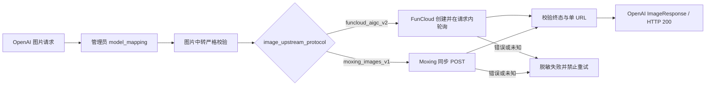

# 图片服务与中转 Provider 适配架构

## 1. 范围与状态

本文描述普通图片入口、统一图片中转渠道及其代码协议适配。图片生成继续使用 NEWAPI 原生
`POST /v1/images/generations`、Ability、渠道分发、管理员模型映射和同步计费链路；Seedance Link 的
ModelArk V3、视频 Task 与无状态素材代理不进入图片入口。

图片中转在管理面只有一个渠道类型：`ChannelTypeAsyncImage=62`，展示名为「图片中转」。同一个渠道实例
通过必填的 `image_upstream_protocol` 选择一个代码登记的南向协议：

| 协议值 | Provider 合同 | 当前执行形态 |
| --- | --- | --- |
| `funcloud_aigc_v2` | FunCloud `/api/v2/open/aigc/*` | 创建任务后在本次请求内轮询 |
| `moxing_images_v1` | Moxing `/v1/images/generations` | 单次同步 POST |

代码和管理端配置已经实现；真实 Provider 价格、失败扣费/退款、超时后的 Provider exposure 和生产灰度
尚未验收。因此“代码已实现”不等于“生产已发布”。

## 2. 身份与职责边界

统一的是渠道身份、北向入口、严格校验和计费底座，不是 Provider 请求协议：

```text
POST /v1/images/generations
  -> 原生鉴权 / Ability / Distribute
  -> 管理员 model_mapping
  -> ChannelTypeAsyncImage / APITypeAsyncImage
  -> image_upstream_protocol
     -> funcloud_aigc_v2 -> relay/channel/asyncimage
     -> moxing_images_v1 -> relay/channel/moxingimage
```

`relay/channel/imagerelay` 是薄 dispatch adaptor，只读取冻结在渠道设置中的协议枚举并委派给对应 adaptor。
它不得根据客户模型名、Provider 模型名、价格、Base URL、响应内容或 `model_mapping` 推断协议。

一个 Channel 实例只能选择一个协议，因为一条渠道记录只有一组 Base URL、凭据、代理和账号边界。一个
渠道可以承载所选协议下的多个客户模型，但不能在同一实例中混放 FunCloud 与 Moxing Provider 模型。
需要同时使用两个 Provider 时，管理员创建两条同为「图片中转」类型、协议不同的渠道记录。

## 3. 管理员配置与模型映射

管理员负责配置：

- `image_upstream_protocol`；
- Base URL、API Key、代理、分组、优先级和权重；
- 客户模型清单、`model_mapping` 和客户价格。

代码负责：

- 协议路径、鉴权头、请求字段转换、轮询和响应归一化；
- 每个协议已发布 Provider profile 的字段、规格和失败语义；
- 保存时确认每个客户模型最终解析到所选协议登记的 Provider profile。

`model_mapping` 始终遵守 NEWAPI 原生管理员语义：它只执行客户模型到 Provider 模型的转换。代码不生成、
补全或固化管理员映射，也不要求 Models 等于 mapping 的键集合。客户模型可以直接使用 Provider 模型名；
mapping 可以多跳并包含与当前渠道模型无关的管理员条目。代码仅对当前 Models 逐项执行原生
`ResolveModelMapping`，再检查最终 Provider 模型是否属于所选协议。

切换 `image_upstream_protocol` 不会改写 Models、`model_mapping` 或客户价格。若现有模型不能落到新协议的
profile，保存必须失败，由管理员显式调整配置。

## 4. 保存与运行时失败关闭

图片中转渠道保存时必须满足：

1. 显式选择已登记的 `image_upstream_protocol`；
2. 显式提供 Base URL；
3. 至少配置一个非空、无重复的客户模型；
4. 每个客户模型经管理员 mapping 后属于所选协议的代码 profile；
5. body pass-through 关闭，Param Override 为空，Advanced Custom route 不存在。

`APITypeAsyncImage` 是严格图片 API：全局或渠道级 body pass-through 都不能绕过专用 DTO 校验。图片请求日志
只记录脱敏占位，不输出 prompt、参考图、Provider 原始请求体或完整结果签名 URL。直接修改数据库造成协议
缺失或冲突时，运行时失败关闭，不尝试旧类型、其它协议或模型名推断。严格图片热路径在 adaptor 转换前还会
拒绝非空 Param Override，避免既有配置或直接数据库修改在 profile 校验后再次改写 Provider 请求。

## 5. 北向兼容子集

FunCloud 当前发布：

| Provider 模型 | Prompt | 当前规格 | 可选参数 |
| --- | --- | --- | --- |
| `nano-banana-2-lite` | 最多 20000 字符 | 单一分辨率 | 已登记宽高比 |
| `nano-banana-2` | 最多 20000 字符 | `1K` | 已登记宽高比、`jpg/png` |
| `seedream-5.0-lite` | 3—3000 字符 | `2K/basic` | 已登记宽高比 |
| `seedream-5.0-pro` | 3—3000 字符 | `1K/basic` | 已登记宽高比 |

Moxing 当前发布：

| Provider 模型 | 客户模型示例 | Prompt | 当前规格 |
| --- | --- | --- | --- |
| `doubao-seedream-5-0-260128` | `seedream-5-moxing` | 1—3000 字符 | 固定 `2K`、单图 URL |
| `doubao-seedream-5-0-pro-260628` | `seedream-5-pro-moxing` | 1—3000 字符 | 固定 `2K`、单图 URL |

客户模型示例不是代码映射或能力身份。管理员可以使用其它别名，也可以不配置映射而直接公开 Provider
模型。FunCloud 和 Moxing profile 由代码注册表分开维护；管理端渠道测试先执行管理员 mapping，再根据所选
协议和最终 Provider profile 选择测试尺寸。

所有当前 profile 共同遵守：

- `n` 必须为 `1`，`response_format` 只能为 `url`；
- 成功结果必须恰好包含一个合法 HTTP(S) URL；
- Base64、显式 `stream`（包括 `false`）、未知顶层字段和合同外 Provider 字段显式返回 `400`；
- `extra_fields.reference_images` 在输入图价格和失败扣费规则验收前保持未发布；
- 更高规格不能只通过修改 Models、mapping、Param Override 或透传配置开放。

不支持字段不得静默删除、钳制、降级或改义。

## 6. 南向控制流



FunCloud 创建成功后立即查询一次；仍为活动状态时，前 30 秒每 3 秒轮询，之后每 5 秒轮询。创建和轮询
共享本次请求 context 与 Provider HTTP client，不建立后台任务或持久化状态。

Moxing 只发送一次同步 POST，不轮询、不重发；成功响应必须恰好包含一个 HTTP(S) URL，返回模型存在时
还必须与冻结的上游模型一致。两个 adaptor 的路径、DTO、响应 envelope、错误码和轮询实现保持独立。

## 7. 客户生命周期、超时与重试

客户合同始终是本次 HTTP 请求内等待并返回 OpenAI 图片响应。FunCloud task ID 只存在于 adaptor 的请求
上下文；不会写入客户响应、主数据库、图片 Task 或 create attempt。Moxing 当前没有南向任务 ID。

两个协议都要求 `RELAY_TIMEOUT` 为有限正数。等待超时或请求 context 取消返回 `504`；Provider POST、
轮询、网络、5xx、非法 JSON、未知状态和结果合同错误均携带 skip-retry，不自动重发、换协议、换渠道或
fallback。`504` 不能解释为 Provider 一定未受理或未计费。

若任一 Provider 无法在同步等待边界内给出可信结果，或者超时后仍可能收费且现有同步退款语义无法覆盖，
该协议必须保持停用并另行评审 durable Task/attempt 与 Provider exposure 合同。

## 8. 计费边界

图片预扣、成功结算和失败退款继续由原生同步图片链路负责：

- 客户价格以客户模型配置和冻结快照为准，不由 `image_upstream_protocol` 或 Provider 模型反推；
- `model_mapping` 不改变客户价格事实；
- 当前结果固定一张，不在 Provider 响应阶段追加未预扣的数量、输入图或像素倍率；
- Moxing adaptor 返回非空零值 `*dto.Usage`，图片 handler 补最小日志 usage 并按客户固定价格结算；
- 客户退款与 Provider exposure 分账，未知供应商成本保持未知。

未来开放 Moxing Pro 动态像素档、参考图或 FunCloud 组图前，必须先把已验证 Provider usage 归一为平台
可预扣、可结算、可审计的标准计费事实，并同时覆盖请求上界、checked quota 转换、预扣和结算。

## 9. 旧类型迁移

旧 `ChannelTypeMoxingImage=63` 已退出运行时注册。数据库迁移必须在旧版本全部停止后，由 master 节点在业务
流量进入前原子执行：

- 旧类型 62 缺少协议时写入 `funcloud_aigc_v2`；
- 旧类型 63 改为类型 62 并写入 `moxing_images_v1`；
- 空 Base URL 按旧渠道语义物化为对应 Provider 默认地址；
- settings 只补写协议字段，必须保留其它已存在的 JSON 字段；
- 旧图片渠道存在 Param Override 时拒绝迁移，不静默删除或继续运行；
- settings 非法或旧类型 63 已带冲突协议时整笔迁移失败；
- 迁移以 Option marker 保证幂等。

master 完成迁移后，每个节点都必须在启动阶段只读确认 marker 已完成、类型 63 为零、类型 62 具有合法协议、
显式 Base URL 且不存在 Param Override；任何一项不满足都不得监听业务流量。禁止新旧版本混跑，因为旧版本
可能在 marker 写入后重新产生类型 63，或者把已迁移的 Moxing 渠道按旧类型语义解释。

迁移完成后，运行时、管理端和模型注册均不再识别类型 63。`ChannelTypeDummy=63` 与
`ChannelBaseURLs[63]` 空槽只保留计数和安全索引边界，不构成兼容渠道、别名或 fallback。

## 10. 架构不变量

1. 图片统一使用 NEWAPI 原生图片入口，不因 Provider 异步形态建立第二套客户 API。
2. 管理面只有一个图片中转 ChannelType/APIType；南向协议必须由管理员显式选择。
3. 一个 Channel 实例只承载一个上游协议；协议选择不得从模型、mapping、价格、Base URL 或响应推断。
4. `model_mapping` 完全由管理员维护；代码只解析当前客户模型并校验最终 Provider profile。
5. FunCloud 与 Moxing adaptor 独立履约，不共享请求 DTO、轮询状态或响应猜测。
6. Provider task ID 不持久化、不返回客户，也不创建图片 Task 或 create attempt。
7. 不支持字段显式失败；Provider 发送后的失败全部 skip retry。
8. 成功必须恰好交付一张合法 URL 图片；其它结果失败关闭。
9. 代码实现不能替代真实 Provider、账单、超时 exposure、外部数据库和生产灰度验收。

## 11. 代码事实与相关文档

主要代码事实：

- `relaykit/dto/image_upstream_protocol.go`、`constant/image_relay.go`；
- `relay/channel/imagerelay/`、`relay/channel/asyncimage/`、`relay/channel/moxingimage/`；
- `model/channel_image_relay.go`、`model/image_relay_channel_migration.go`；
- `relay/image_handler.go`、`relay/image_strict_api.go`、`relay/relay_adaptor.go`；
- `controller/channel-test.go`、`controller/channel_test_image_profile.go`；
- `web/src/features/channels/` 与七种 locale。

相关当前事实：

- [架构概览](架构概览.md)
- [异步任务与计费事实架构](账单计费-异步任务与计费事实架构.md)
- [图片模型 API 用户调用指南](../30-engineering/图片模型API用户调用指南.md)
- [图片渠道与异步 Provider 运维手册](../40-operations/03-图片渠道与异步任务运维手册.md)
