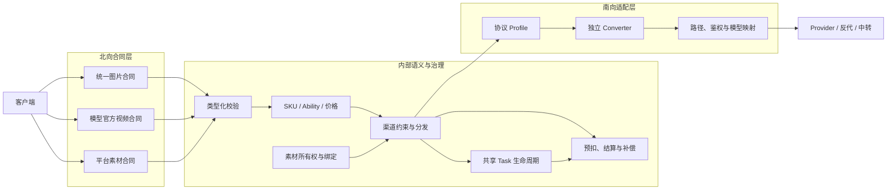
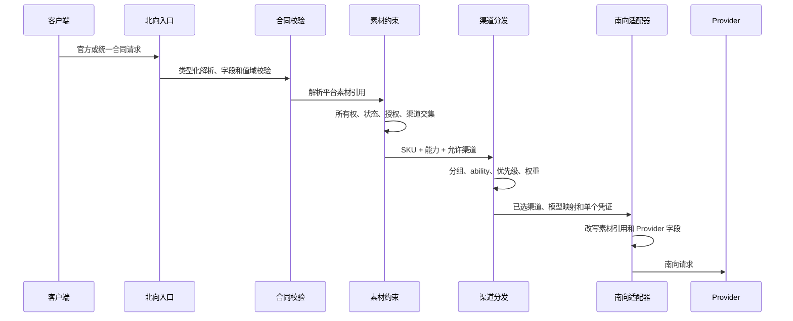

# 媒体北向合同与南向适配架构

## 1. 目的与范围

本文定义图片、视频和素材库共同遵守的合同边界：

- 北向向客户端提供什么稳定承诺；
- 公开模型、官方协议和平台资源如何标识；
- 渠道、Provider、反代和中转差异如何留在南向；
- 何时可以跨渠道选路，何时必须拆分公开 SKU；
- 请求校验、任务生命周期、计费和素材引用如何保持合同一致。

本文是跨产品总纲。图片异步执行、视频任务和素材生命周期的细节分别见对应专题架构。

## 2. 当前实现状态

截至 2026-07-28，代码已经形成以下边界：

| 产品面 | 北向合同 | 当前实现 |
| --- | --- | --- |
| 图片 | 统一 NEWAPI 图片接口 | `POST /v1/images/generations`；异步时使用 `GET /v1/images/tasks/:task_id` |
| 视频 | 模型厂商官方合同 | Seedance 使用 ModelArk v3，Kling 使用 Kling v1，即梦使用 `CVSync2Async*` |
| 素材库 | 平台统一控制面合同 | `/v1/assets`、平台 `ast_xxx` 和 `asset://ast_xxx` |

当前仍需通过生产配置或灰度持续证明的事项包括：

- 同一视频 SKU 的全部启用渠道是否完整实现其官方合同；
- 图片公开 SKU 的价格、能力和值域是否已完成真实上游与账单验收；
- 历史视频只读入口和素材旧别名是否达到退出条件；
- 内置 API 文档是否准确发布上述北向合同。

架构文档只描述已实现边界和已接受设计，不把“代码可解析”“渠道可配置”自动写成“生产已发布”。运行时可用模型仍以模型发现、ability、分组和渠道配置为准。

## 3. 核心决策

### 3.1 北向与南向

```text
北向合同 = 客户端可依赖的路径、鉴权、字段、错误、响应、生命周期和计费语义
南向适配 = 网关调用 Provider、反代或中转所需的地址、凭证、模型、字段和任务协议
```

渠道切换不得改变北向调用方式。Provider 私有路径、字段、真实模型 ID、任务 ID、状态和鉴权只能存在于渠道配置、适配器、任务快照和管理员审计中。

### 3.2 一个公开 SKU 对应一个合同

公开模型名不是基础模型家族别名，而是稳定、可计费、可验证的合同 SKU。同一 SKU 只能进入以下语义等价的渠道：

- 请求字段、类型、默认值、枚举和值域；
- 响应和错误外壳；
- 同步、异步、查询、取消、删除及内容下载生命周期；
- 已发布能力；
- 计费维度和结算语义。

无法证明等价时，应从该 SKU 的候选渠道中移除；如果产品确需同时发布，应拆分公开 SKU，并分别绑定模型映射、能力、渠道和价格。不得先随机进入不兼容渠道，再依赖重试、字段删除或内部错误掩盖差异。

### 3.3 合同来源

客户端可见合同的来源优先级为：

```text
NEWAPI 已稳定发布的北向合同
  -> 对应模型厂商官方 API
  -> 已验证且明确发布的平台扩展
```

第三方聚合商、反代和渠道文档只用于确认南向事实，不能直接升级为公共字段或公共协议。每项公开合同应记录来源链接、版本或验证日期。

## 4. 总体架构



北向 DTO 在进入分发前完成白名单校验和类型化归一。南向 converter 只负责确定性转换，不得反向扩张北向合同。

## 5. 产品合同

### 5.1 统一图片合同

当前统一图片产品使用：

```text
POST /v1/images/generations
GET  /v1/images/tasks/:task_id
```

当前公开 SKU：

| 公开 SKU | 南向模型 | 南向路径与策略 |
| --- | --- | --- |
| `seedream-5-moxing` | `seedream-5-0-260128` | Advanced Custom `/v1/images/generations` + `media_task_image_blocking` |
| `seedream-5-qihang` | `seedream-5` | Advanced Custom `/v1/images/generations` + `converter=none` |
| `nano-banana-2` | `gemini-3.1-flash-image-preview-usage` | Advanced Custom `/v1/media/generations` + `media_task_image_blocking` |

客户端统一使用 `model`、`prompt`、`image`、`size`、`n`、`response_format` 和 `stream` 等北向字段。Nano 的 `image -> reference_images`、模型 ID 和异步任务信封转换均属于南向事实。

统一字段不表示各模型拥有相同值域。尺寸、参考图数量、高级参数和同步/异步能力按 SKU 声明并在上游调用前校验。

供应商原生图片协议是独立附加合同，只有上游真实支持、网关已有转发能力并完成渠道验证时才能开放；它不属于统一图片的跨供应商兼容承诺。

### 5.2 官方视频合同

视频生成属于模型数据面，不强制伪装成单一平台协议：

| 模型族 | 北向合同 ID | 北向入口 |
| --- | --- | --- |
| Seedance | `modelark.contents.generations.v3` | `/api/v3/contents/generations/tasks` |
| Kling | `kling.v1.videos` | `/kling/v1/videos/*` |
| 即梦 | `jimeng.cv.async.2022-08-31` | `/jimeng?Action=CVSync2Async*` |

中间件将官方 DTO 转为内部视频任务语义，并把原始合同对象保存在请求上下文。任务创建时冻结 `northbound_contract_id`、合同版本和南向适配器版本；查询、列表、取消、删除和内容下载按任务创建时的合同投影。

OpenAI 视频已下架。`openai_videos` 只用于存量任务读取，不参与模型发现、新任务、计费或分发。

### 5.3 统一素材库合同

素材库属于平台控制面，统一提供：

- 平台 CRUD、迁移、授权、幂等和用户隔离；
- 平台资源 ID `ast_xxx`；
- 视频引用 `asset://ast_xxx`；
- 平台状态、错误和生命周期。

上游素材账号、资源 ID、素材组、Action/Version、签名、profile 和渠道 ID 不进入普通客户端合同。

视频请求仍使用该模型官方合同定义的媒体字段，只把字段值设为 `asset://ast_xxx`。网关在选渠前校验所有权、状态、授权、模型、账号指纹和多素材渠道交集，并在每次南向尝试前改写为该渠道账号下的上游引用。

## 6. 请求、选渠与适配顺序



错误必须尽早发生：

- 合同错误在预扣和上游调用前返回对应 4xx；
- 无兼容渠道时明确失败，不进入错误渠道试探；
- 未发布能力保持未发布，不通过任意 map 或 passthrough 绕过；
- 上游运行错误与北向合同错误分开投影。

## 7. 任务、幂等与计费

- 图片和视频可以共享 Task 持久层、轮询、终态 CAS、计费补偿和审计，但必须使用各自的客户端协议与响应投影。
- 任务快照冻结创建时实际使用的北向合同、南向 profile、路径、单个凭证、上游任务 ID、模型映射和计费合同。
- 渠道配置只决定新任务；在途任务不得随配置修改而漂移。
- 取得上游任务 ID并完成本地持久化后，结算与退款责任从请求转移到 Task。
- 公开模型名是价格键；上游模型、路径和 profile 不决定售价。
- 未经验证的 usage 不参与精确结算；缺失可信 usage 时按各产品的安全策略保留预扣或失败关闭。

## 8. 安全、错误与可观测性

### 8.1 安全边界

- 北向不得透传合同外 Provider 参数。
- API Key、上游凭证、签名 URL、上游任务 ID和 `private_data` 不得进入用户响应。
- Provider 错误必须脱敏，不能泄露内部域名、请求头或账号信息。
- 素材引用 fail closed；未知或未登记的上游素材 ID不得直接接受。

### 8.2 必要审计维度

管理日志至少能够关联：

- 公开模型与北向合同 ID；
- 渠道 ID、南向 profile 和适配器版本；
- 本地任务 ID、脱敏上游任务/请求 ID；
- 能力过滤和合同拒绝原因；
- 预扣、终态结算、退款和补偿状态；
- 素材绑定、账号指纹和渠道交集失败原因。

普通用户日志必须移除管理员专属字段。

## 9. 架构不变量

1. 渠道变化不改变客户端合同。
2. 一个公开 SKU 不同时承载两个不等价合同。
3. 合同外字段不透传，合法字段不静默删除、钳制、降级或改义。
4. 北向模型名、上游模型 ID、渠道和价格各有单一职责。
5. 图片保持统一 NEWAPI 合同；视频保持各模型官方合同；素材库保持平台统一合同。
6. 素材 Provider 差异不能成为新的北向资源类型或枚举。
7. 任务创建与轮询使用冻结的同一南向账号和协议事实。
8. 所有数据库设计继续兼容 SQLite、MySQL 和 PostgreSQL。

## 10. 变更规则

新增模型、渠道或 Provider 时依次完成：

1. 冻结可追溯北向合同和公开 SKU。
2. 明确已有 SKU 是否合同等价；无法证明时拆分 SKU。
3. 优先使用渠道配置、模型映射和既有 profile。
4. 只有 JSON、鉴权、状态或生命周期语义确实不同，才新增供应商中立 converter/profile。
5. 增加合同、跨渠道等价、失败关闭、计费和敏感信息回归测试。
6. 完成真实创建、终态、错误、限流和账单灰度后再开放 ability。
7. 同步更新架构、开发者指南、运维手册和公开 API 文档。

## 11. 相关文档

- [硬约束](../00-context/硬约束.md)
- [ADR-0007：视频官方北向合同与共享任务底座](decisions/0007-视频官方北向合同与共享任务底座.md)
- [ADR-0008：共享异步任务计费状态机与原子补偿](decisions/0008-共享异步任务计费状态机与原子补偿.md)
- [统一图片生成与异步任务架构](统一图片生成与异步任务架构.md)
- [视频上游接入与异步任务架构](视频上游接入与异步任务架构.md)
- [素材代理与真人授权架构](素材代理与真人授权架构.md)
- [图片模型 API 用户调用指南](../30-engineering/图片模型API用户调用指南.md)
- [视频模型 API 用户调用指南](../30-engineering/视频模型API用户调用指南.md)
- [素材库对接指南](../30-engineering/素材库对接指南.md)
