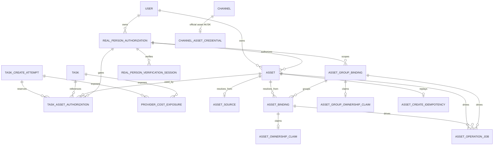

# 数据模型

## 1. 模型分区

new-api 的持久化模型按业务事实分为四类：

| 分区 | 核心模型 | 保存的事实 |
| --- | --- | --- |
| 身份与访问 | `User`、`Token`、认证相关模型 | 用户主体、调用凭据、权限与额度 |
| 渠道与路由 | `Channel`、`Ability`、`ChannelAssetCredential` | Provider 地址/凭据、公开模型能力、分组、优先级与权重 |
| 调用与计费 | `Task`、`TaskCreateAttempt`、`TaskCreateIdempotency`、`ProviderCostExposure`、`Log`、计费快照 | 请求执行、异步状态、创建恢复、冻结计费合同、结算、财务暴露与审计 |
| 素材控制面 | `Asset`、`AssetSource`、binding、ownership claim、authorization、operation job | 平台素材 ID、加密源引用、上游账号映射、唯一归属、真人授权和可恢复生命周期 |

渠道配置是未来请求的可编辑事实；Task、素材 binding 和真人 authorization 保存创建时已经发生的执行事实。运行中的任务或已创建素材不得通过重新读取渠道当前值而静默切换账号。

## 2. 异步任务与计费

`Task` 同时保存用户可见任务状态和私有执行快照：

| 数据面 | 主要字段 | 责任 |
| --- | --- | --- |
| 任务公共索引 | `task_id`、`platform`、`user_id`、`channel_id`、`status`、`client_protocol`、`billing_state` | 权限过滤、列表、CAS 状态推进和补偿扫描 |
| 模型事实 | `properties.origin_model_name/upstream_model_name` | 公开 SKU 计费与上游模型调用分离 |
| Link 合同执行快照 | `northbound_contract_id/version`、`sku_capability_version`、冻结生命周期能力、`client_request` | 按创建时合同和 SKU 能力投影查询响应 |
| 渠道适配协议快照 | `southbound_adapter_version`、profile、查询地址/模板、proxy、单个 Key、上游任务 ID | 在途任务不随渠道编辑漂移 |
| 素材路由快照 | `asset_public_ids`、binding/source 解析结果、implementation ID/version | 审计创建时使用的平台素材、解析模式与上游绑定；不保存明文源 URL |
| 真人授权关联 | `task_asset_authorizations` 普通关系表 | 发送前授权 reservation、内容回查以及撤回时索引 attempt/在途任务 |
| 计费快照 | billing source、subscription/token/node、`billing_context`、`async_billing` | 预扣、终态结算、退款、债务和补偿 |
| 产品状态 | `private_data.media_image`、`data` | 保存产品完成查询所需的最小结果与归一化状态；秘密只进入 `private_data` |

- `client_protocol` 区分 `openai_images`、rc23 原生 OpenAI Videos、旧版平台视频、ModelArk、Kling 和即梦，查询响应按创建时协议投影；
- 图片异步任务使用 `platform=media_image` 和 `private_data.media_image` 保存查询连接、鉴权模板、请求图片数、结果 URL、usage 与轮询审计，不保存 prompt、参考图或完整响应；
- `billing_state` 是异步表达式计费状态的可索引投影，完整快照仍位于私有数据；
- 终态状态推进使用 CAS，资金调整与计费状态在事务内幂等提交；
- 轮询响应不可采信时使用内部 `reconciliation_required`，业务状态保持活动且计费保持
  `pending`；连续次数、首次/最近时间、下次对账时间和 SLA 截止时间必须可被补偿扫描索引，
  不能只能通过数据库 JSON 查询发现；
- 可信终态结果确定违反交付上限或安全合同时使用内部
  `PROVIDER_CONTRACT_FAILURE` 平台不可交付终态，对外投影为
  `failed/provider_contract_failure`；客户目标额度为零，并单独记录潜在 Provider 成本
  exposure；
- 历史任务可在明确兼容路径下回退渠道配置，新任务必须写完整快照。

### `TaskCreateAttempt`

每次可能创建共享 Task 的数据面上游 POST 都必须有一条创建尝试，不依赖客户端是否提供
`Idempotency-Key`。这包括正式视频和已选中持久化媒体任务 route 的图片调用；素材、素材组和
真人认证控制面不使用本模型。逻辑模型至少保存：

- 唯一、不可预测的 `attempt_id` 与预生成公开任务 ID；
- `prepared/sending/upstream_succeeded/unknown/complete/rejected/released_with_exposure`
  执行状态；
- `unheld/held/transferred/released` 资金门闩、冻结预扣事实和 quota clamp；
- 请求 HMAC、用户/Token/订阅、 Link 合同、SKU 能力版本；
- 渠道、profile、adapter、冻结连接和选中的单个凭证；
- 上游 request/task ID、首次进入 `unknown` 的 `outcome_unknown_at`、对账次数、下次执行时间、
  资金占用与任务 SLA 截止时间。

`prepared` 在预扣前提交；预扣、`held` 和 `sending` 在同一事务提交后才能发送任何上游字节。
取得可信上游任务 ID 后，Task 创建、hold 转入 `AsyncBilling.pending` 和 attempt 完成在同一
事务提交；潜在异步图片返回同步成功时直接结算并完成 attempt，不创建 Task。陈旧 `sending`
转入 `unknown`；到期仍无法恢复时释放客户 hold 并记录 exposure。原始请求、媒体
URL/Data URL、Cookie 和原始幂等键不进入快照。exposure 转换率以
`outcome_unknown_at` 时间窗内的 unknown cohort 为分母，因此后续恢复为 `complete` 的 attempt
仍保留在分母中；不得用当前 `status=unknown` 数量替代该 cohort。

物理实现可以扩展现有创建幂等表，也可以新增独立表，但必须存在不依赖客户端 key 的唯一
attempt 域，并为状态、`next_attempt_at`、资金/SLA 截止时间建立普通索引；不能用 JSON 条件
扫描承担恢复。

### `TaskCreateIdempotency`

`TaskCreateIdempotency` 是可选的客户端重放 claim，以
`user_id + protocol + key_hash` 唯一约束关联一个 `TaskCreateAttempt`。同键同请求返回关联
attempt/Task，同键不同请求冲突；没有 Header 时不创建伪客户端 key，但内部 attempt 仍存在。
原始幂等键不落库。普通、确定同步的图片 route 不进入该幂等域；可能返回持久化 Task 的图片
route 在分发后、发送前建立 claim，即使本次最终同步成功也不能释放后重用。同步成功使用
`completed_no_replay` 状态，同键重放返回 `409 idempotency_result_unavailable`，不再次 POST。

### `task_asset_authorizations`

使用平台托管真人素材时，在发送前建立可索引的授权使用 reservation，取得上游任务 ID 后再与
Task 绑定。普通关系行至少包含：

```text
attempt_id + task_id + user_id + asset_id + authorization_id + asset_kind + state
```

其中 `task_id` 是 create attempt 预生成的公开任务 ID，`state` 至少包括
`reserved/task_bound/closed`。`attempt_id + authorization_id + asset_id` 和
`task_id + authorization_id + asset_id` 唯一，并为 `task_id` 以及
`authorization_id + state` 建立普通索引。该关系有三个用途：

- 在预扣、hold 与 `sending` 的同一事务中，按固定 ID 顺序锁定全部真人授权行，要求状态仍为
  `authorized` 且 `revoked_at=0`，然后写入 `reserved`。该事务提交是任务已接受使用授权的
  线性化点；撤回事务锁定同一授权行，因而“撤回先提交则不发送、reservation 先提交则属于
  可索引在途任务”；
- 取得可信上游任务 ID 后，在 Task 创建与 hold 转移事务中把 reservation 改为
  `task_bound`。明确未创建时改为 `closed`；创建结果 unknown 时保持可扫描，不能删除关系；
- `/v1/videos/{task_id}/content` 与 `part=last_frame` 每次回源前按关系加载授权；任一真人授权
  不再为 `authorized` 时 fail closed，不访问 Provider；
- 撤回事务按 `authorization_id + state` 找到已接受 attempt 和排队/运行 Task，记录审计，
  并仅在冻结 lifecycle capability 支持时安排取消尝试。

不能只依赖 `Task.private_data.asset_public_ids` 的 JSON 反向查询，因为 SQLite、MySQL 和
PostgreSQL 的 JSON 查询语义与索引能力不一致。关系行不改变素材所有权，也不意味着平台能删除
客户已经下载或 Provider 已缓存的副本。

### `provider_cost_exposures`

财务暴露不能只存在于日志或 JSON。使用普通表按唯一
`source_kind + source_id + reason` 记录 Task/create attempt 的 exposure，至少包含：

```text
source_kind + source_id + reason + state
user_id + channel_id + public_model + upstream_profile
customer_quota_released
provider_amount_minor? + provider_currency?
first_seen_at + updated_at + resolved_at?
```

`reason` 至少区分 `provider_contract_failure`、`released_with_exposure` 和
`upstream_outcome_unresolved`；未知 Provider 金额保持空值，不能用客户 quota 冒充供应商
货币成本。按 `state`、`reason`、`channel_id`、`public_model` 和时间建立普通索引。零目标退款
与 exposure 行在同一事务提交；若资金存储边界无法同事务，则先写唯一 outbox，由共享补偿
调度器幂等落表。重复轮询、补偿和人工操作不能生成第二条 exposure。

详见[统一图片生成与异步任务架构](统一图片生成与异步任务架构.md)、
[视频上游接入与异步任务架构](视频上游接入与异步任务架构.md)、
[ADR-0008](decisions/0008-共享异步任务计费状态机与原子补偿.md)和
[ADR-0011](decisions/0011-异步创建未知与轮询合同违例对账.md)。

用量账单不新增账单表。`GET /api/billing/self` 按用户、API Key 和模型只读聚合 `logs` 中的消费与退款结算事实；历史费用不从当前模型价格重算。详见 [API Key 用量账单架构](API-Key用量账单架构.md)。

## 3. 素材控制面实体

当前已实现 [ADR-0015](decisions/0015-Link公开SKU与实现身份版本绑定.md) 的逻辑 Asset、独立 `AssetSource`、0..N binding 和显式 Link 实现版本围栏。新 Asset 可以只有加密 source、只有 active binding，或同时具有两者；某一路径失效不会注销另一条仍有效的路径。



### `assets`

用户拥有的逻辑素材，公开 ID 为 `ast_` 前缀。保存名称、`general/real_person` 类型、媒体类型、授权关联和归一化状态，不直接保存源 URL、二进制、对象存储字段或上游 ID。`created_by_token_id` 仅用于审计，所有权归 `user_id`。查询时从 source 和 bindings 聚合当前可解析状态，不把某一 Provider 的处理状态当作 Asset 的唯一真相。

### `asset_sources`

一个 Asset 最多关联一个不可变的短期执行引用。字段只包含唯一 `asset_id`、使用 `asset-source:<public_id>` 作用域认证加密的 URL 和 `expires_at`；不设置公开 ID、URL HMAC、独立业务状态、错误字段或清理任务，也不支持旧的无作用域密文回退。明文 URL 只在 Resolver 内存中短暂存在，不进入 Task/attempt、普通日志或客户响应。源 URL 不能证明媒体相同，平台身份只由 `ast_*` 表达。

### `asset_bindings`

保存素材到上游账号的映射。关键事实包括 `channel_id`、凭据指纹、asset profile、代码注册的 Link implementation ID/version、model/target、上游 resource/reference、可选 group 和归一化状态。同一 Asset 可按不同当前实现、channel/profile/凭据作用域具有 0..N 个 binding；解析时只匹配注册表中当前唯一版本，不双读旧版 binding。任一上游对象仍只能被一个平台 Asset 认领，敏感字段不进入用户 JSON。

### `asset_ownership_claims` 与 `asset_group_ownership_claims`

在“Provider 账号指纹 + profile + project + region + 上游资源 ID”作用域内唯一认领素材或素材组。该约束防止同一个上游对象被并发或重试错误地绑定给不同用户/本地资源；claim 只保存归属关系，不取代 binding。

### `asset_group_bindings`

保存 Provider 要求的内部素材组或真人认证 scope。作用域由用户或 authorization 决定，并与 channel、凭据指纹、profile 和 group kind 共同约束。它是内部控制面，不提供独立公共管理 API。

### `asset_create_idempotencies`

服务平台素材创建。保存 `user_id + app_id + endpoint + key_hash` 唯一作用域、规范化请求 HMAC、asset 关联、状态和 24 小时过期时间；不保存原始幂等键或完整 URL。需要 source 的恢复由 `AssetSource` 密文承担，幂等表不建立第二份 URL 指纹。

### `asset_operation_jobs`

保存轮询、改名、删除、真人认证和不确定创建 watchdog。`idempotency_key` 唯一；`status/next_attempt_at/locked_until` 支持多实例租约抢占、有界重试和失败恢复。

### `channel_asset_credentials`

以 `channel_id` 一对一保存官方 Action 素材 AK/SK，与 `Channel.Key` 中的视频 Bearer 凭据分离。管理响应只返回“已配置”和脱敏 Access Key ID 提示；创建、轮换和清除与渠道身份检查在同一事务内完成。

### 应用规则与真人认证

- `api_service_rules`：版本化的应用级 API 服务规则；只允许已到生效时间的规则激活。
- `application_api_rule_acceptances`：应用对具体规则版本的不可变首次接受记录；不保存自然人同意证据。
- `real_person_authorizations`：公开 ID 为 `rpa_` 前缀，冻结 app、最终用户摘要、model、channel、凭据指纹、profile 和认证状态。
- `real_person_verification_sessions`：记录每次 Provider H5 session、过期、轮询和稳定错误；重试创建新 session，不覆盖旧审计记录。

## 4. 数据边界

以下数据不得进入普通持久化字段或用户响应：

- 素材二进制和明文完整源 URL（最小 `AssetSource` 密文除外）；
- URL 签名 query、Authorization、Cookie；
- 渠道 Key、凭据指纹和上游资源 ID；
- 官方素材 AK/SK、H5 验证句柄及可重放验证 URL；
- Provider 原始响应和可能包含内部地址的错误；
- Provider H5 可重放 token 与原始幂等键。

Token 和幂等信息只保存不可逆摘要；任务私有数据和素材内部映射按上游凭据敏感级别保护。

## 5. 迁移与三数据库兼容

- 所有表通过 GORM `AutoMigrate` 创建或扩展，不使用数据库专用 JSON 列或生成列；
- 需要补偿扫描的状态使用普通、可索引列，不在 WHERE 中依赖方言不同的 JSON 查询；
- 行锁统一使用 `lockForUpdate(tx)`，SQLite 通过事务与显式写锁路径完成等价串行化；
- 布尔业务默认值由代码规范化，不依赖会导致跨库反复迁移的 GORM boolean default tag；
- 时间使用 Unix 秒 `bigint`；软删除业务状态显式保存在 `deleted_at/status`，不依赖数据库触发器；
- 唯一约束、索引长度和错误处理必须同时覆盖 SQLite、MySQL >= 5.7.8、PostgreSQL >= 9.6。
- 旧平台真人专项同意模型不保留：启动迁移会幂等删除 `consent_policies`，并使用三数据库均支持的静态 `ALTER TABLE ... DROP COLUMN` 删除真人授权表中的旧政策、证据和 token 字段；该清理没有历史回填或兼容读取路径。

新增持久化状态时，应优先扩展所属领域模型，并同步检查创建、CAS 更新、删除、补偿扫描、唯一冲突和三数据库迁移测试。
