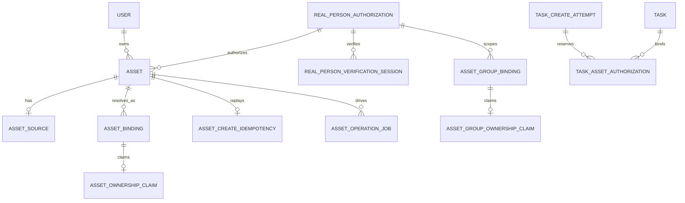

# 数据模型

本文只描述影响系统正确性的持久化事实及其所有权。字段的最终定义以 `model/` 中的 GORM struct 和迁移代码为准；Redis、进程缓存和前端状态不在本文的数据事实范围内。

## 1. 模型分区

| 分区 | 核心模型 | 保存的事实 |
| --- | --- | --- |
| 身份与访问 | `User`、`Token`、认证相关模型 | 用户主体、API 应用、凭据、权限和额度 |
| 渠道与路由 | `Channel`、`Ability`、`Model`、`ChannelAssetCredential` | Provider 连接、模型可路由性、分组、优先级、权重和素材凭据 |
| 调用与计费 | `TaskCreateAttempt`、`TaskCreateIdempotency`、`Task`、`ProviderCostExposure`、`ProviderExposureIncident`、`Log` | 发送前创建事实、异步生命周期、资金状态、平台风险与消费审计 |
| 素材控制面 | `Asset`、`AssetSource`、`AssetBinding`、ownership claim、authorization、operation job | 平台素材身份、受保护源、Provider 绑定、唯一归属、真人授权和可恢复生命周期 |

渠道配置描述“下一次请求怎么执行”；Task、attempt、binding 和授权关系描述“已经发生了什么”。在途任务或已创建素材不得通过重新读取渠道当前值而静默切换 Provider 账号。

## 2. 异步创建与任务

### 2.1 `TaskCreateAttempt`

显式接入共享创建安全边界的 Link 视频，以及已选中持久化媒体任务 route 的图片创建，在发送
Provider POST 前先写入 `TaskCreateAttempt`。它解决“上游可能已创建，但本地尚未取得或保存
task ID”的窗口；是否接入必须由具体 Router/Relay 明确决定，不能由本模型反向扩张到 NEWAPI
原生协议。

```text
prepared -> sending -> upstream_succeeded -> complete
                \-> unknown -> complete | rejected | released_with_exposure
prepared/sending -> rejected
```

持久化字段分为五组：

| 字段组 | 代表字段 | 用途 |
| --- | --- | --- |
| 身份 | `attempt_id`、`public_task_id`、`user_id`、`token_id`、`app_id`、`client_protocol` | 唯一尝试、权限与公开任务身份 |
| 合同 | Link 合同 ID/version、SKU capability version/hash、implementation ID/version/hash | 证明创建时使用的客户合同与实现 |
| 执行 | `channel_id`、`public_model`、profile、adapter version、冻结连接快照 | 恢复或人工对账时不依赖当前渠道配置 |
| 资金 | `billing_hold_state`、`billing_source`、`held_quota`、subscription/token 跟踪字段 | 将发送前 hold 与正式 Task 计费分开 |
| 对账 | 上游 request/task ID、`next_attempt_at`、`hold_deadline_at`、`task_deadline_at`、重试次数 | 扫描陈旧 `sending`、unknown 和可恢复成功 |

`prepared` 先提交；预扣、真人授权 reservation、`held` 与 `sending` 在同一事务提交后才允许发送请求字节。取得可信 task ID 后，Task 创建、hold 转移和 attempt 完成原子提交。到资金占用期限仍无法恢复时，释放 hold 并写入 `ProviderCostExposure`。

### 2.2 `TaskCreateIdempotency`

`TaskCreateIdempotency` 是可选的客户端重放索引，不是创建安全的事实源。其唯一作用域为：

```text
user_id + protocol + key_hash
```

记录只保存 key 摘要、请求哈希、attempt 关联、可恢复 Task 摘要和到期时间，不保存原始 key。相同 key 与相同请求恢复已有 attempt/Task；请求不同则冲突。可能异步的图片 route 如果最终同步完成，claim 进入 `completed_no_replay`，因为平台不保存同步图片结果用于回放。

### 2.3 `Task`

`Task` 是取得可信上游 task ID 后的异步事实：

| 数据面 | 代表字段 | 责任 |
| --- | --- | --- |
| 公共索引 | `task_id`、`platform`、`user_id`、`app_id`、`channel_id`、`status`、`client_protocol`、`billing_state` | 所有权过滤、CAS 状态推进和补偿扫描 |
| 模型事实 | `properties.origin_model_name`、`upstream_model_name` | 公开价格键与 Provider 模型分离 |
| 合同快照 | Link 合同、SKU capability、lifecycle、implementation ID/version/hash | 按创建时合同投影查询和生命周期 |
| 连接快照 | profile、adapter version、查询 Base URL/模板、proxy、单 Key、上游 task ID | 在途轮询不随渠道编辑漂移 |
| 素材关联 | `asset_public_ids`、`asset_binding_ids`、app/subject | 审计创建时引用的平台素材；明文 source URL 不落 Task |
| 计费快照 | funding source、token/subscription、`billing_context`、`async_billing` | 终态目标额度、退款、debt 和补偿 |
| 产品私有状态 | `private_data.media_image`、`data` | 图片或视频查询所需的最小结果；私密字段不返回用户 |

当前 Task 状态额外包含：

- `RECONCILIATION_REQUIRED`：本次轮询响应不可采信，仍是活动状态，计费保持 pending；
- `PROVIDER_CONTRACT_FAILURE`：可信终态已证明无法按公开合同交付，对外投影为 failed，并按冻结的零目标资金处理。

当前 reconciliation 以 Task 的普通 `status`、`updated_at` 和共享轮询调度驱动，没有另建 Provider 专用对账表。若未来需要独立的违例次数、告警状态或 SLA 扫描列，应作为明确的数据模型扩展，而不能假设它们已存在。

### 2.4 `TaskAssetAuthorization`

真人 Link 资源的每次 Task 使用通过普通关系表关联：

```text
attempt_id + task_id + user_id + app_id + end_user_subject_hash
+ asset_id + authorization_id + asset_kind + state
```

状态为 `reserved -> task_bound -> closed`。预扣与 `sending` 事务按固定顺序锁定 authorization 并写 `reserved`；Task 创建事务改为 `task_bound`。撤回通过 `authorization_id + state` 索引找到已接受 attempt/Task；内容代理每次回源前重新检查 authorization。该关系不能用 Task 私有 JSON 反向查询替代。

## 3. 计费与平台风险

### 3.1 Task 计费

`Task.private_data.async_billing` 保存完整计费状态，普通列 `billing_state` 是补偿扫描投影：

```text
pending -> settled
        -> failed -> settled
        -> debt
```

资金目标、Task quota、私有计费状态和投影列在同一事务提交。已经 settled 的重复操作是 no-op。预扣之前的资金属于 attempt hold；只有取得可信 Task 后才转入 Task billing。

### 3.2 `ProviderCostExposure`

客户退款与平台可能已经发生的 Provider 成本分账。当前表以：

```text
source_kind + source_id + reason
```

作为唯一幂等键，并保存 user、channel、公开模型、profile、implementation ID/version/hash、释放的客户 quota、可选 Provider 金额/币种和创建时间。当前模型没有 exposure `state` 或 `resolved_at`；运营处置和自动门禁由 `ProviderExposureIncident` 与聚合策略承接。未知 Provider 金额保持为空，不能用客户 quota 冒充供应商货币成本。

### 3.3 `Log`

`Log` 是已发生消费、退款和审计的历史事实。自助账单直接聚合日志，不新增账单表，也不按当前价格重算历史。详见 [API Key 用量账单架构](API-Key用量账单架构.md)。

## 4. 素材控制面



### `Asset`

平台逻辑素材，公开 ID 为 `ast_*`。保存 user/app 所有权、类型、媒体类型、真人授权引用、迁移谱系和聚合状态；不保存媒体二进制、完整 URL 或上游资源 ID。

### `AssetSource`

每个 Asset 最多一个不可变受保护源。字段只有 `asset_id`、使用 `asset-source:<public_id>` scope 加密的 URL 和 `expires_at`。它没有公开 ID、独立状态、URL HMAC 或后台清理任务。公开创建路径会建立 source；schema 仍允许内部历史或清理阶段不存在 source。

### `AssetBinding`

保存某 Asset 在精确 channel、凭据指纹、profile 和 Link implementation ID/version/hash 下的上游资源映射。一个 Asset 可以有多个 binding；只有 active 且仍匹配当前渠道身份与代码注册的 binding 能参与解析。

### Ownership claim

素材和素材组分别使用 ownership claim，在 Provider 账号指纹、profile、project、region 与上游资源 ID 作用域内唯一认领对象，避免并发或重试将同一上游对象绑定给多个平台资源。

### 授权与后台任务

- `AssetGroupBinding`：Provider 要求的内部素材组或真人认证 scope；
- `AssetCreateIdempotency`：素材创建的 24 小时幂等 claim；
- `AssetOperationJob`：binding 轮询、删除、认证、watchdog 和对账调度；
- `ChannelAssetCredential`：与视频 `Channel.Key` 分离的官方素材 AK/SK；
- API service rule、acceptance、authorization、verification session：应用规则接受与 Provider 真人认证事实。

## 5. 数据边界

以下数据不得进入用户 JSON、普通日志或可搜索业务列：

- 素材二进制和明文完整源 URL（`AssetSource` 密文除外）；
- URL 签名 query、Authorization、Cookie；
- Provider Key、素材 AK/SK、凭据指纹和上游资源 ID；
- H5 验证句柄、可重放 verification URL、原始幂等键；
- Provider 原始响应和可能含内部地址的错误。

Task 私有数据、attempt 的冻结连接和素材密文都必须按 Provider 凭据级别保护。

## 6. 三数据库约束

- 所有模型通过 GORM 迁移，并同时验证 SQLite、MySQL 和 PostgreSQL；
- 需要调度或补偿的状态使用普通索引列，查询不能依赖方言不同的 JSON 操作符；
- 标准行锁通过 `lockForUpdate(tx)`，SQLite 使用其事务语义；
- 业务默认值由代码规范化，避免跨数据库反复变更 boolean default；
- 时间统一保存为 Unix 秒，软删除和业务状态使用显式字段；
- 唯一约束、索引长度和冲突处理必须在三种数据库上保持等价。

新增持久化状态时，应同步检查创建、CAS、删除、补偿扫描、唯一冲突、隐私边界和三数据库迁移。
