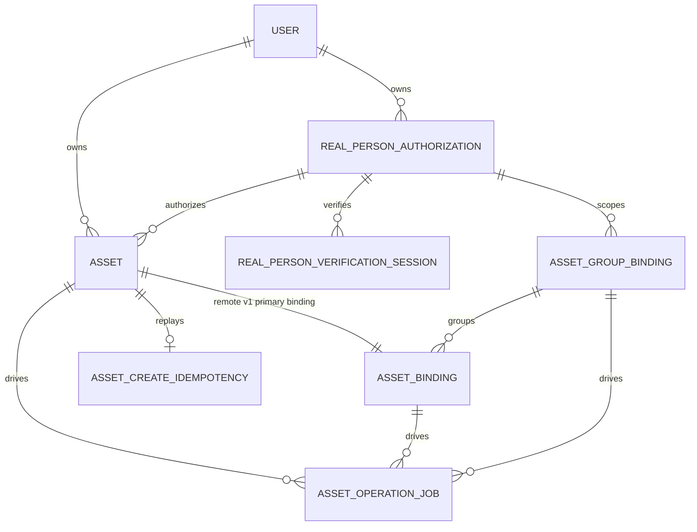

# 数据模型

## 1. 模型分区

new-api 的持久化模型按业务事实分为四类：

| 分区 | 核心模型 | 保存的事实 |
| --- | --- | --- |
| 身份与访问 | `User`、`Token`、认证相关模型 | 用户主体、调用凭据、权限与额度 |
| 渠道与路由 | `Channel`、`Ability` | Provider 地址/凭据、公开模型能力、分组、优先级与权重 |
| 调用与计费 | `Task`、`Log`、计费快照 | 请求执行、异步状态、冻结计费合同、结算与审计 |
| 素材控制面 | `Asset`、binding、authorization、operation job | 平台素材 ID、上游账号映射、真人同意和可恢复生命周期 |

渠道配置是未来请求的可编辑事实；Task、素材 binding 和真人 authorization 保存创建时已经发生的执行事实。运行中的任务或已创建素材不得通过重新读取渠道当前值而静默切换账号。

## 2. 异步任务与计费

`Task` 同时保存用户可见任务状态和私有执行快照：

- 公开/上游模型名分离，价格始终以公开模型名为键；
- `private_data` 冻结视频 profile、查询地址/模板、实际选中 Key、上游任务 ID 与 `async_billing`；
- `billing_state` 是异步表达式计费状态的可索引投影，完整快照仍位于私有数据；
- 终态状态推进使用 CAS，资金调整与计费状态在事务内幂等提交；
- 历史任务可在明确兼容路径下回退渠道配置，新任务必须写完整快照。

详见 [视频上游接入与异步任务架构](视频上游接入与异步任务架构.md) 和 [ADR-0002](decisions/0002-异步任务表达式计费快照与补偿结算.md)。

## 3. 素材控制面实体

### `assets`

用户拥有的逻辑素材，公开 ID 为 `ast_` 前缀。保存名称、`general/real_person` 类型、媒体类型、授权关联和归一化状态，不保存源 URL、二进制、对象存储字段或上游 ID。`created_by_token_id` 仅用于审计，所有权归 `user_id`。

### `asset_bindings`

保存素材到上游账号的唯一主映射。关键事实包括 `channel_id`、凭据指纹、asset profile、model/target、上游 resource/reference、可选 group 和归一化状态。`asset_id + channel_id + credential_fingerprint` 唯一，敏感字段不进入用户 JSON。

### `asset_group_bindings`

保存 Provider 要求的内部素材组或真人认证 scope。作用域由用户或 authorization 决定，并与 channel、凭据指纹、profile 和 group kind 共同约束。它是内部控制面，不提供独立公共管理 API。

### `asset_create_idempotencies`

只服务 remote 素材创建。保存 `user_id + endpoint + key_hash` 唯一作用域、请求 HMAC、asset 关联、状态和 24 小时过期时间；不保存原始幂等键或完整 URL。

### `asset_operation_jobs`

保存轮询、改名、删除、真人认证和不确定创建 watchdog。`idempotency_key` 唯一；`status/next_attempt_at/locked_until` 支持多实例租约抢占、有界重试和失败恢复。

### 真人同意与认证

- `consent_policies`：版本化、分 locale 的同意正文和内容哈希；每个 locale 同时只有一份生效政策。
- `real_person_authorizations`：公开 ID 为 `rpa_` 前缀，冻结 model、channel、凭据指纹、profile、政策哈希、同意证据和授权状态。
- `real_person_verification_sessions`：记录每次 Provider H5 session、过期、轮询和稳定错误；重试创建新 session，不覆盖旧审计记录。

## 4. 数据边界

以下数据不得进入普通持久化字段或用户响应：

- 素材二进制和完整源 URL；
- URL 签名 query、Authorization、Cookie；
- 渠道 Key、凭据指纹和上游资源 ID；
- Provider 原始响应和可能包含内部地址的错误；
- 同意 Token、回执 Token 与原始幂等键。

Token 和幂等信息只保存不可逆摘要；任务私有数据和素材内部映射按上游凭据敏感级别保护。

## 5. 迁移与三数据库兼容

- 所有表通过 GORM `AutoMigrate` 创建或扩展，不使用数据库专用 JSON 列或生成列；
- 需要补偿扫描的状态使用普通、可索引列，不在 WHERE 中依赖方言不同的 JSON 查询；
- 行锁统一使用 `lockForUpdate(tx)`，SQLite 通过事务与显式写锁路径完成等价串行化；
- 布尔业务默认值由代码规范化，不依赖会导致跨库反复迁移的 GORM boolean default tag；
- 时间使用 Unix 秒 `bigint`；软删除业务状态显式保存在 `deleted_at/status`，不依赖数据库触发器；
- 唯一约束、索引长度和错误处理必须同时覆盖 SQLite、MySQL >= 5.7.8、PostgreSQL >= 9.6。

新增持久化状态时，应优先扩展所属领域模型，并同步检查创建、CAS 更新、删除、补偿扫描、唯一冲突和三数据库迁移测试。
