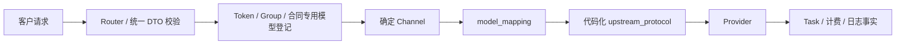

# 架构概览

## 1. 范围与状态

本文描述当前已实现的系统边界，以及明确标注为待实现的已接受目标。旧的 Link publication、SKU、
implementation、execution binding、通用 AssetBinding 和平台真人授权代码已直接移除，不保留兼容路径。
Channel 默认普通 AIGC 素材组属于待实现目标，不能写成生产已发布。具体 Provider 的生产可用性仍取决于
该线路的真实接口、账单、外部数据库和灰度验收。

## 2. 系统边界

系统由 NEWAPI 原生能力和 Link 本地扩展组成：

- NEWAPI 原生 Router、DTO、Relay、Provider adapter、模型发现和计费继续以上游代码为权威；
- Link 只承载本项目明确新增的产品入口、协议 adapter、异步任务和素材代理；
- 两类能力可以共享鉴权、Token、Group、Channel、计费、Task 和日志底座，但不得互相推断
  或把原生入口包装成 Link；
- Link 不再维护第二套 publication、SKU、implementation 或 execution binding 合同体系。



## 3. 主要平面

| 平面 | 主要职责 | 持久化权威 |
| --- | --- | --- |
| API 数据面 | 路由、鉴权、请求校验、Provider 转换和响应投影 | 同步请求上下文；异步成功后转入 Task |
| 管理控制面 | 用户、Token、Group、Channel、模型映射、价格和协议选择 | 主数据库 |
| 异步执行面 | durable create attempt、Task、轮询、结算和补偿 | `TaskCreateAttempt`、`Task`、计费状态 |
| 素材控制面 | 按客户模型代理 Provider 单资源操作，不提供列表或本地映射 | 无；Provider 与调用方保存 opaque ID |
| 历史审计面 | 使用日志、消费、退款和技术排障 | `Log` 及受保护快照 |

## 4. Seedance 专用架构

所有 Seedance 模型均使用独立业务渠道 `ChannelTypeSeedanceLink`。官方火山、BytePlus、飞彩、
FunCloud、TokenSave 等线路都属于这个渠道类型；它们的南向协议可以不同。

Seedance 北向固定为 ModelArk V3 四组任务接口。每个前端客户模型只登记在一个已启用的 Seedance
专用渠道中，因此请求直接确定渠道，不使用 Priority、Weight、Affinity、随机分发、失败重选或
fallback。不同 Provider 线路必须使用不同前端模型名。

```text
customer_model
  -> Group / price
  -> Seedance Channel 模型登记
  -> 唯一 ChannelTypeSeedanceLink
  -> model_mapping
  -> code-backed video_upstream_protocol
  -> Provider model
```

Seedance 不登记到 NEWAPI 原生 Ability 或通用分发缓存；模型发现和价格接口读取等价只读投影。
兼容性由技术人员线下确认。管理员只选择代码中已经存在的协议；若上游不兼容，由技术人员新增
adapter，而不是让管理员编写 JSON 映射或状态脚本。

## 5. 异步任务与计费

Seedance 视频是高成本重任务。每次创建只允许一次 Provider POST，不自动重发、换渠道或降级。
发送前必须建立 durable create attempt 并完成资金 hold；取得可信 Provider task ID 后才创建 Task。

视频创建结果无法确认时进入 `unknown`，不自动重试、切换渠道或退款。Task 冻结客户模型、渠道、
上游协议、Provider 模型、连接、素材和计费事实；后续查询、删除和结算不读取当前配置重新解释历史。

## 6. 素材代理

素材控制面是调用方自管的无状态单资源代理。每个操作携带客户 `model`，平台选择唯一 Seedance Channel
和代码 adapter，直接返回 Provider opaque 素材、素材组或认证会话 ID；平台不提供列表，不持久化客户
Asset/AssetGroup、所有权、状态或作用域映射。已接受的目标允许每个支持普通 AIGC 素材组的 Channel
保存一个内部默认 Provider group ID，它只服务南向履约，不形成客户资源目录。

统一北向素材协议优先于南向字段差异。客户使用相同请求形状；代码注册的唯一
`GeneralAssetGroupPolicy` 同时驱动运行时与公开元数据，adapter 按策略使用调用方组 ID、Channel 默认组
ID，或不发送该字段。管理端 `GroupAdapter` 和现有 requirement 接口都不得成为第二套运行时判据。

视频使用 `asset://<opaque-id>`。平台只做非空格式校验，不查询素材，不验证所有权、应用、状态、模型、
Channel、账号或 Region/Project；当前模型选定的 Provider 最终判断兼容性。错误 ID 不触发跨 Provider
探测、fallback 或迁移。

平台不保存 source URL 或媒体二进制，也不自建人脸认证、人工审核或法律授权系统。真人认证由素材协议
创建上游邀请并直接返回链接/二维码。

## 7. 权威事实

| 事实 | 权威来源 | 说明 |
| --- | --- | --- |
| 新请求是否可用 | Token、Group、Seedance Channel 状态 | 配置只影响之后的新请求 |
| 客户模型到渠道 | 已启用 Channel 的模型列表 | Seedance 保存/启用时校验唯一；请求时不重复校验 |
| Provider 模型 | 渠道 `model_mapping` | 无映射时按 NEWAPI 原生身份映射 |
| 南向协议 | 代码注册的 `upstream_protocol` | 配置选择代码，不承载转换脚本 |
| 已发生的视频创建 | `TaskCreateAttempt` / `Task` | 冻结执行和计费事实 |
| 素材 opaque ID 与状态 | Provider；调用方保存 `model + id + reference` | 平台不建立持久化事实或列表 |
| Channel 默认素材组 | 主数据库中的 Channel 一对一内部配置 | 普通 AIGC 素材南向默认参数；不是客户资源 |
| 历史费用 | `Log` 与冻结计费状态 | 不按当前价格回算历史 |

## 8. 架构不变量

1. NEWAPI 原生合同不由 Link 中间件识别、包装、收紧或降级。
2. Link 配置不创建 publication、SKU、implementation 或 execution binding 身份。
3. 一个已启用的 Seedance 客户模型只对应一个 Seedance 专用渠道。
4. Seedance 不进入原生 Ability/分发池，也不使用 Priority、Weight、Affinity、重试、切换或 fallback。
5. 管理端只选择代码化协议，不编辑协议 JSON。
6. 视频发送前先建立 durable attempt；`unknown` 不自动重发、换渠道或退款。
7. Task 按创建时冻结事实继续执行，不随当前 Channel、凭据或价格漂移。
8. 素材控制面不建立客户 Asset/AssetGroup、resolver、列表或本地作用域校验；Provider opaque ID 由
   调用方管理。每个支持普通 AIGC 素材组的 Channel 可以保存一个内部默认 Provider group ID，但它只是
   南向履约配置，不是客户资源。
9. Link 统一北向协议优先于南向字段差异；代码 adapter 负责转换或条件忽略，不能要求客户按 Provider
   改变已发布请求形状。
10. 平台不保存媒体二进制、人脸认证材料、完整签名 URL 或 Provider 凭据。
11. 主数据库是任务、资金、素材和审计的持久化事实源；缓存必须可重建。

## 9. 变更性质标注

本项目的本地扩展按以下方式接入 NEWAPI：

| 类别 | 说明 |
| --- | --- |
| NEWAPI 原生能力 | Router、DTO、Relay、Provider adapter、模型发现和原生计费仍以上游代码为权威；本地只在必要入口保留字段传递、早返回或单行调用。 |
| Link 专属新增 | `ChannelTypeSeedanceLink`、ModelArk V3 Router、代码化上下游协议、无状态素材代理和 Seedance Task 适配器均放在独立文件/注册表中，不收紧原生入口。 |
| 合同与投影优化 | 用户合同、管理员合同总览、表达式协议探针和只读模型/价格投影是本地增强；原生用户明确走原路径，不建立第二套原生状态。 |

每份专题架构都应在“变更性质”章节说明必要的 NEWAPI 窄接线、独立新增文件和未来上游同步的冲突边界。

## 10. 相关文档

- [Seedance 专用渠道与 Link 架构](Seedance专用渠道与Link架构.md)
- [公开模型元数据投影架构](公开模型元数据投影架构.md)
- [异步任务与计费事实架构](账单计费-异步任务与计费事实架构.md)
- [计费表达式与协议探针架构](账单计费-计费表达式与协议探针架构.md)
- [图片服务与异步 Provider 适配架构](图片服务与异步Provider适配架构.md)
- [用户模型合同定价架构](账单计费-用户模型合同定价架构.md)
- [ADR-0017：调用方自管无状态素材代理](decisions/0017-调用方自管无状态素材代理.md)
- [ADR-0018：Channel 默认素材组基础设施配置](decisions/0018-Channel默认素材组基础设施配置.md)
