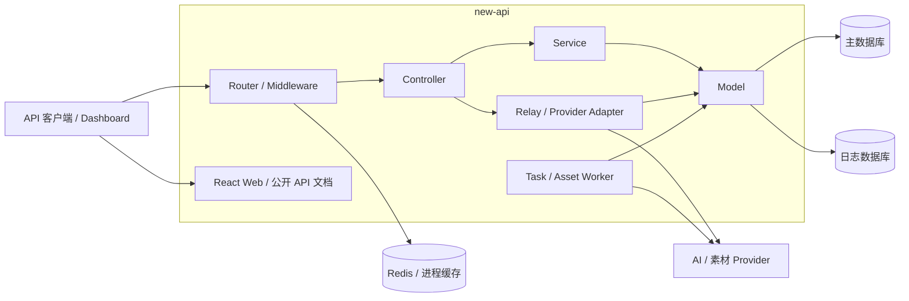

# 架构概览

new-api 是统一 AI API 网关。系统在同一鉴权、渠道、计费和审计底座上承载 NEWAPI 原生能力与
显式注册的 Link 服务合同；两类能力可以复用基础设施，但各自的客户协议、能力声明和运行时资格
必须保持独立。

本文只提供系统级地图。具体合同、状态机、数据结构和 Provider 适配规则由专题架构负责。

## 1. 系统边界

系统不把外部 Provider、Redis、浏览器状态或公开 Markdown 作为核心业务事实源。Provider 负责模型
执行；网关负责客户身份、路由、计费、异步状态、资源治理和审计。

## 2. 分层与依赖方向

主分层为 `Router -> Controller -> Service -> Model`：

| 层 | 主要职责 | 不承担的职责 |
| --- | --- | --- |
| `router/`、`middleware/` | 路径、鉴权、限流、合同选择、选渠前约束 | 不持久化第二套业务状态 |
| `controller/` | HTTP 解析、错误信封、响应投影 | 不决定 Provider 私有协议 |
| `service/` | 跨模型编排、计费、补偿、生命周期 | 不绕过模型事务直接拼接数据库事实 |
| `model/` | 数据库事实、事务、行锁、CAS 和查询边界 | 不承担 HTTP 或 Provider 转换 |
| `relay/`、`relay/channel/` | 请求转换、上游调用、响应归一化 | 不建立供应商专用产品状态 |
| `web/` | 管理控制面和公开文档展示 | 不是协议、价格或任务状态的权威来源 |

依赖方向以共享业务事实为中心：入口层可以调用服务与模型，Provider adapter 只能消费已选定的
执行合同，轮询与补偿必须读取创建时快照，不能从当前配置重新推导历史执行。

## 3. 运行平面

| 平面 | 入口与组件 | 权威事实 |
| --- | --- | --- |
| API 数据面 | Relay Router、鉴权/限流/分发 middleware、Provider adapter | 当前请求上下文；异步创建成功后转入 Task |
| 管理控制面 | Dashboard API、`setting/`、用户/渠道/模型服务 | User、Token、Channel、Ability、价格和运行配置 |
| Link 合同治理面 | publication、capability、implementation、execution binding | 客户模型发布身份与受控履约资格 |
| 异步执行面 | create attempt、Task、轮询、结算与补偿 | 创建结果、冻结执行快照、业务终态和资金状态 |
| Link 资源控制面 | Asset API、Resolver、operation job、真人授权 | 资源所有权、执行源、上游 binding 和授权状态 |
| 计费与审计面 | billing session、Task billing、Log、exposure | 预扣、结算、退款、消费记录和平台风险 |
| Web 与公开文档 | React Dashboard、`/docs`、文档构建校验 | 只读投影；公开内容由受控源和白名单生成 |

## 4. 合同边界

### 4.1 NEWAPI 原生能力

原生 Chat、Responses、Images、OpenAI Videos 等继续使用上游已有 Router、DTO、Relay、adapter、
Ability、模型发现和计费语义。Link 机制不得包装、复制或收紧这些路径，也不能根据路径名称或
历史模型名为原生入口增加本地协议推断。

### 4.2 Link 服务合同

需要本地代码扩展并显式发布的能力进入 Link。Link 使用持久化客户模型 publication、代码注册的
SKU capability 与 implementation、渠道 execution binding 共同决定可履约资格；当前候选耗尽时
失败关闭，不降级为普通模型或另一份客户合同。

详细定义见 [Link 服务合同概念与协作关系](Link服务合同概念与协作关系.md) 和
[Link 服务合同注册与履约架构](Link服务合同注册与履约架构.md)。

## 5. 事实所有权

| 事实 | 权威来源 | 约束 |
| --- | --- | --- |
| 用户、Token、额度 | 主数据库 | 所有客户资源按用户和应用作用域过滤 |
| 新请求路由 | Channel、Ability、settings | 编辑只影响之后创建的请求 |
| Link 客户模型发布 | `LinkModelPublication` 与 audit | 独立于候选可用性；改绑必须显式版本化 |
| Link SKU 与实现能力 | capability / implementation 代码注册 | SKU 定义客户能力，实现证明履约方式 |
| 异步创建与资金持有 | `TaskCreateAttempt` | 先落库再发送；模糊结果不自动重发或退款 |
| 在途任务 | `Task` 与私有快照 | 轮询、终态和计费不随当前渠道或价格漂移 |
| Link 资源 | `Asset`、`AssetSource`、`AssetBinding` | `ast_*` 是逻辑身份，不代表保存媒体字节 |
| 真人使用许可 | authorization 与 `TaskAssetAuthorization` | 使用与撤回在同一授权事实上线性化 |
| 历史费用 | `Log` | 不按当前价格回算历史 |
| 平台潜在成本 | `ProviderCostExposure` | 与客户退款分账并幂等记录 |
| 热缓存和限流 | Redis / 进程缓存 | 可重建，不能替代数据库业务事实 |

主数据库同时支持 SQLite、MySQL >= 5.7.8 和 PostgreSQL >= 9.6。共享持久化路径优先使用 GORM，
需要行锁时统一使用项目的跨数据库锁封装。

## 6. 全局不变量

1. NEWAPI 原生合同优先；Link 只约束显式接入的本地扩展。
2. 客户合同、Link SKU、Provider 实现和 Provider 模型是不同身份，不能互相反向推断。
3. 配置描述下一次请求；Task、Asset、计费和审计快照描述已经发生的事实。
4. 可能创建持久化任务的 Link Provider POST 必须先建立耐久创建事实和资金门闩。
5. 业务终态、资金状态和 Provider 可观测性分开建模；不可采信响应不等于业务失败。
6. 计费乘数先校验，额度换算、预扣、结算、退款和补偿必须防溢出且幂等。
7. Provider 凭据、完整签名 URL、Task 私有数据和上游资源 ID 不进入普通用户响应或日志。
8. 所有持久化、状态迁移和补偿继续兼容三种数据库。

## 7. 专题导航

- [Link 服务合同概念与协作关系](Link服务合同概念与协作关系.md)：统一业务概念与协作边界。
- [Link 服务合同注册与履约架构](Link服务合同注册与履约架构.md)：publication、capability、implementation 与渠道履约。
- [异步任务与计费事实架构](异步任务与计费事实架构.md)：create attempt、Task、资金状态和平台风险。
- [Link 图片服务合同与异步任务架构](Link图片服务合同与异步任务架构.md)：图片同步/异步联合合同。
- [Link 视频服务合同与异步任务架构](Link视频服务合同与异步任务架构.md)：视频协议、Task 和 Provider adapter。
- [Link 资源合同与解析架构](Link资源合同与解析架构.md)：`ast_*`、source/binding 和 Resolver。
- [真人素材授权与撤回架构](真人素材授权与撤回架构.md)：真人认证、任务使用与撤回边界。
- [API Key 用量账单架构](API-Key用量账单架构.md)：消费日志的只读账单投影。
- [公开 API 文档交付架构](公开API文档交付架构.md)：公开合同内容的构建和发布边界。
- [架构决策索引](decisions/README.md)：长期取舍、后果和被取代关系。
