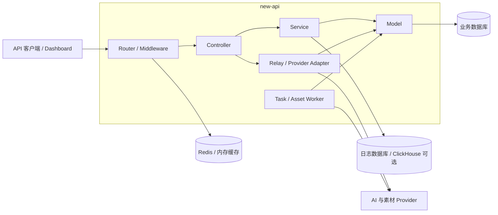

# 架构概览

new-api 是统一 AI API 网关。北向提供稳定的产品合同，南向通过渠道与 Provider adapter 接入不同上游；鉴权、路由、计费、异步任务和审计由平台公共能力统一承担。

## 1. 系统上下文



代码主分层为 `Router -> Controller -> Service -> Model`。`relay/` 位于外部 Provider 边界，负责协议转换而不是持有产品状态；异步轮询、结算和补偿由 service/worker 编排，持久化通过 model 完成。

## 2. 运行平面

| 平面 | 入口与组件 | 核心责任 |
| --- | --- | --- |
| API 数据面 | `router/`、`middleware/`、`controller/relay.go`、`relay/` | Token 鉴权、限流、模型与渠道分配、请求转换、同步响应 |
| 控制面 | Dashboard API、`setting/`、渠道/模型/用户服务 | 用户、Token、渠道、能力、价格、分组和运行配置 |
| 异步任务面 | `Task`、轮询 service、任务 worker | 视频与异步图片创建恢复、状态推进、结果投影、取消和补偿 |
| 素材控制面 | Asset API、asset service/adapter/job | 平台素材 ID、上游账号绑定、真人授权、生命周期和视频路由约束 |
| 计费与审计面 | billing service、`Log`、账单聚合 | 预扣、终态结算/退款、饱和审计、API Key × 模型账单 |
| Web 展示面 | `web/` | 用户和管理员工作台；不作为计费或协议事实源 |

## 3. 北向合同与南向适配

```text
北向产品合同
  -> 严格 DTO / 字段白名单 / 错误外壳
  -> 内部稳定表示
  -> 模型、分组、能力与素材约束选渠
  -> 南向渠道 adapter
  -> Provider
```

长期边界如下：

- 图片使用统一 NEWAPI 图片合同，渠道差异在图片 adapter 内消化；
- 视频按公开模型/SKU 使用 Seedance、Kling、即梦各自的官方北向合同；
- 素材库使用平台统一控制面合同，Provider Action、签名和上游资源 ID 不向客户泄漏；
- 同一公开 SKU 只能进入合同等价的渠道，北向合同不能反向限定南向只能是官方渠道；
- 未知字段、未知 profile、未知状态和缺失成功结果均 fail closed，不通过 metadata 或任意 map 旁路正式合同。

## 4. 状态与数据所有权

| 事实 | 权威来源 | 约束 |
| --- | --- | --- |
| 用户、Token、额度 | 业务数据库 | 所有资源查询绑定 `user_id`，Token 轮换不改变资源所有权 |
| 未来请求的渠道配置 | `Channel`、`Ability`、settings | 可编辑，只影响修改后创建的请求 |
| 在途任务执行与计费事实 | `Task` 私有快照 | 创建时冻结，不随渠道、Key、价格编辑漂移 |
| 素材上游归属 | Asset binding、ownership claim | 固定到 Provider 账号；迁移必须创建新平台资源 |
| 消费与退款历史 | `Log` | 账单按已结算日志聚合，不用当前价格回算历史 |
| 热缓存与限流状态 | Redis / 进程内存 | 可重建，不替代数据库业务事实 |

主数据库同时支持 SQLite、MySQL >= 5.7.8 和 PostgreSQL >= 9.6；共享持久化逻辑优先使用 GORM，行锁统一走 `lockForUpdate(tx)`。Redis 和 ClickHouse 均为可选基础设施，不能成为核心业务正确性的唯一事实源。

## 5. 关键不变量

1. 北向产品合同与南向渠道协议解耦，同一 SKU 对客户端始终保持同一合同。
2. 创建请求在一次选渠上下文中完成模型映射、单 Key 选择、调用和执行快照。
3. 在途任务依赖冻结快照继续轮询、投影和结算；历史兼容回退必须显式且可测试。
4. 计费乘数先校验，额度换算使用统一饱和函数；预扣、结算、退款和补偿均幂等可审计。
5. 渠道凭据、任务私有数据、素材上游 ID、签名 URL 和真人认证秘密不进入普通用户响应或日志。
6. Provider 不确定结果保留可恢复状态，不能伪装成功或盲目重复创建。

## 6. 专题架构

- [媒体北向合同与南向适配架构](媒体北向合同与南向适配架构.md)：图片、视频和素材库共同遵循的产品合同、SKU、选渠与适配边界。
- [统一图片生成与异步任务架构](统一图片生成与异步任务架构.md)：统一图片字段、同步/异步响应、共享 Task、幂等和计费责任转移。
- [视频上游接入与异步任务架构](视频上游接入与异步任务架构.md)：官方视频合同、渠道适配、任务执行快照、轮询和计费边界。
- [素材代理与真人授权架构](素材代理与真人授权架构.md)：URL 中转素材、上游账号绑定、素材感知路由、真人同意和可恢复删除。
- [数据模型](数据模型.md)：Task、计费与素材控制面的持久化事实和数据边界。
- [API Key 用量账单架构](API-Key用量账单架构.md)：结算日志口径、API Key × 模型聚合、权限和历史费用边界。
- [内置 API 文档中心架构](内置API文档中心架构.md)：公开文档内容、路由、构建、安全和合同治理；当前为已接受但尚未实现的目标架构。
