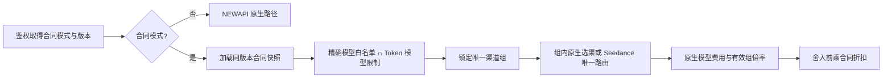

# 用户模型合同定价架构

## 1. 边界与事实源

主数据库中的用户合同模式、版本、规则和审计是权威事实。Redis、进程缓存和前端状态都可重建。
`contract_mode=false` 是原生早返回分支，不读取合同规则；`contract_mode=true` 必须取得与鉴权缓存版本一致的
合同快照，否则失败关闭。

规则采用八位定点整数保存折扣。写入是完整替换：用户行锁、`expected_version`、规则替换、`auth_version`
递增和审计写入处于同一事务。可履约性批量校验在取得用户行锁前完成，以避免按规则查询延长锁持有时间；
提交后渠道发生变化时，请求路径仍按当前渠道状态失败关闭。

## 2. 精确模型与三库一致性

应用层始终使用精确字符串匹配，不依赖数据库默认排序规则。由于 MySQL 常见
`utf8mb4_*_ci` 唯一索引会合并大小写变体，写入校验统一拒绝同一合同内仅大小写不同的模型名，从而使
SQLite、MySQL 和 PostgreSQL 行为一致。可用模型查询只接受启用 Ability 对应的启用 Channel，Seedance
模型由专用渠道组投影提供。

## 3. 请求控制流

指定 Channel 在任何分支都必须同时满足精确模型和合同渠道组。合同错误对客户端统一表现为普通
`model_not_found`，具体合同拒绝原因只进入管理日志。

## 4. 计费不变量

`ContractBillingFact` 是唯一权威合同计费事实，冻结用户、合同版本、公开模型、绑定组和八位定点折扣。
decimal 入口负责校验和乘法；Relay 的 float 入口仅是调用同一事实方法的薄适配。合同乘法发生在 quota
舍入前，模型小计完成之后，工具附加费之前。

固定价音频和 Realtime 的预扣、终态均必须携带 `ModelPrice`。异步任务终态使用已经规范化并持久化的
`ActualTokens`，不能在首次结算改用原始 `TotalTokens`。

合同 Task 使用创建时冻结的模型倍率、组倍率和合同折扣。没有 `ContractBillingFact` 的原生或历史 Task
继续执行原有的当前倍率读取，包括 `GroupGroupRatio[group][group]` 特殊覆盖；合同功能不得顺带改变该
原生语义。

## 5. 缓存与并发可见性

合同缓存按 `user_id` 只保留一个版本，版本不匹配必须回源且不能使用旧快照。提交通过既有
`auth_version` pending fence 使全部 Key 失效。已经通过 TokenAuth、但尚未到合同守卫的并发请求可能因
缓存时点按旧版本完成，或在版本不一致时短暂失败；不会扩大到合同外权限。运维应把提交瞬间少量 403
视为权限线性化窗口，而不是自动重试到原生路径。

## 6. 公共投影

普通用户价格接口使用合成组名 `contract` 表达一个不泄露真实渠道组的展示维度；该名称不参与路由或
计费。管理员选项接口可见内部渠道组和当前可履约模型，普通用户接口不得返回内部路由身份。首期管理员
选项接口返回完整候选快照，以保持配置操作简单且不发生静默截断；它只用于低频管理面。若装机规模使该
响应成为瓶颈，后续可在不改变合同事实语义的前提下改为按组搜索或分页，不能通过固定上限隐藏可选模型。
