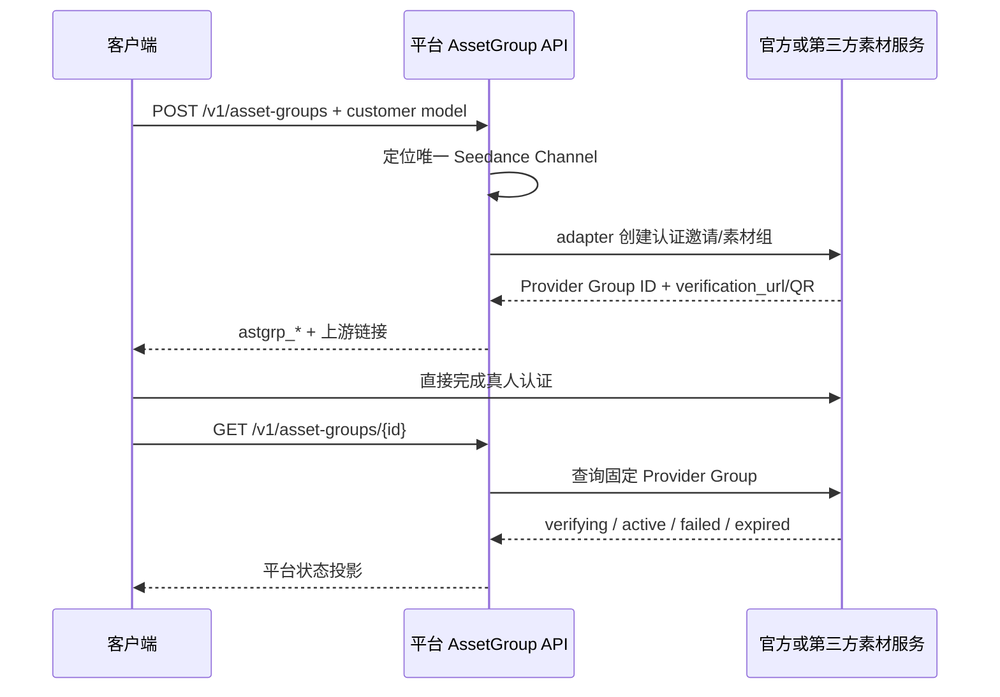

# 素材组与真人认证代理架构

## 1. 决策

平台不建立独立真人授权业务域。真人认证属于 Provider 素材库的 AssetGroup 创建流程，平台只代理
创建、返回上游链接和查询状态。

目标架构删除：

- `RealPersonAuthorization`；
- `/v1/real-person-authorizations`；
- `APIServiceRuleAcceptance`；
- `end_user_subject`；
- 平台人脸、活体、授权或身份证件表单；
- 平台 H5 中转页面；
- 自建授权撤回、Task reservation 和内容回源门禁。

本文已被接受但尚待完整实施；旧代码和旧 API 不能作为新设计依据。

## 2. 客户流程

客户不在平台上传人脸认证材料，也不把 Provider AK/SK、Group ID 或短期认证 token 当作客户凭据。

## 3. CallbackURL

Provider 允许客户提供 CallbackURL 时，平台做必要的 URL 结构与安全校验后传递给 adapter，不建立平台
中转 H5。只有某个上游协议强制回调平台时，才在该 adapter 内增加最窄的回调接线。

回调只能触发状态刷新，不能在没有 Provider 可验证结果时直接把 Group 标记为 active。

## 4. 持久化边界

AssetGroup 只保存：

- 平台 `astgrp_*`；
- `user_id + app_id`；
- 固定 Channel、素材协议和 Provider 账号作用域；
- Region/Project（协议需要时）；
- Provider Group ID；
- type、Provider status、过期时间；
- 必要且短期的受保护查询句柄。

平台不保存：

- 人脸图片、视频或音频；
- 身份证件、活体数据、人脸特征；
- 授权书、勾选表单或法律证据正文；
- Provider AK/SK、完整短期 URL 或原始响应。

## 5. 国内、海外和第三方

国内火山、海外 BytePlus 与第三方可能使用不同的认证页面、Group Action 和查询协议。它们都通过各自
代码化 `asset_upstream_protocol` 实现，不能通过替换 Base URL 猜测兼容。

第三方已经代理真人认证时，管理员只配置第三方 Base URL、平台 Key 和素材协议，不重复填写官方
AK/SK、Region 或 Project。客户通过不同客户模型选择国内、海外或第三方产品，不再提交区域字段。

## 6. 删除与撤回

- Provider 支持删除 Group 或取消授权：固定 adapter 调用真实能力；
- Provider 不支持：明确返回不支持；
- 调用结果不明确：返回失败并保持本地状态；
- 后续 GET 明确确认 Provider 不存在后，更新为 deleted；
- 平台不声称已撤回 Provider 授权、删除 Provider 数据或收回平台外副本。

不建立独立撤回状态机、管理员核查页面、自动重试或孤儿 Group 扫描。

## 7. 视频使用边界

只有 active 的 `astgrp_*` 和其下 active Asset 可以按 Provider 协议参与视频请求。视频入口校验平台
资源属于 `user_id + app_id`，并与客户模型确定的 Channel、账号、Region、Project 一致。

这些校验保护资源所有权和 Provider 作用域，不重新实现法律授权判断。Provider 是否允许某次真人素材
使用，由上游审核和生成接口决定；平台不新增 Task authorization reservation。

## 8. 架构不变量

1. 真人认证由官方或第三方页面完成，平台不自建表单。
2. 平台直接返回 Provider 链接/二维码，不包装为平台 H5。
3. AssetGroup 一对一固定 Channel 和 Provider Group。
4. 平台不保存人脸、证件、活体或授权表单数据。
5. 回调只能触发刷新，不能凭回调直接授予 active。
6. 删除和撤回只声明 Provider 确认的真实结果。
7. 不建立 `RealPersonAuthorization`、reservation 或内容回源门禁。

## 9. 相关文档

- [Link 素材库与确定性解析架构](Link资源合同与解析架构.md)
- [Seedance 统一北向合同架构](Seedance统一北向合同架构.md)
- [ADR-0016](decisions/0016-Seedance专用渠道与确定性素材代理.md)
