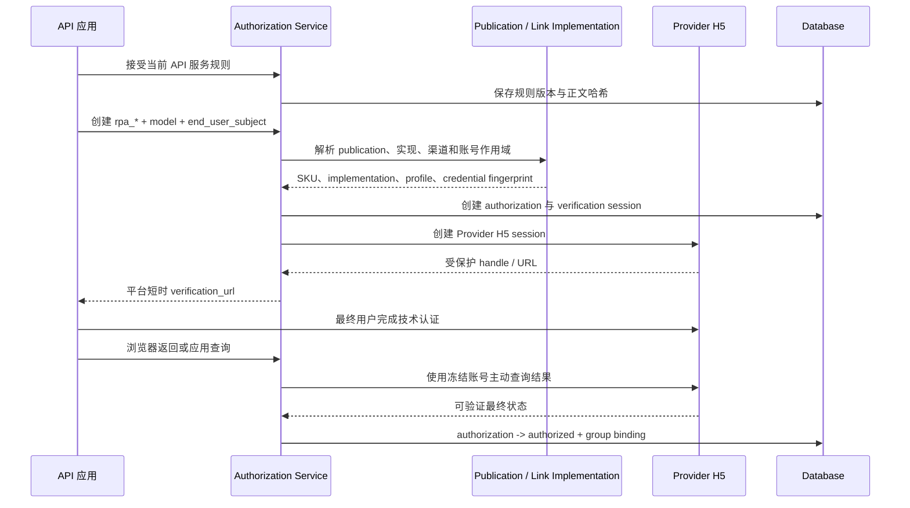
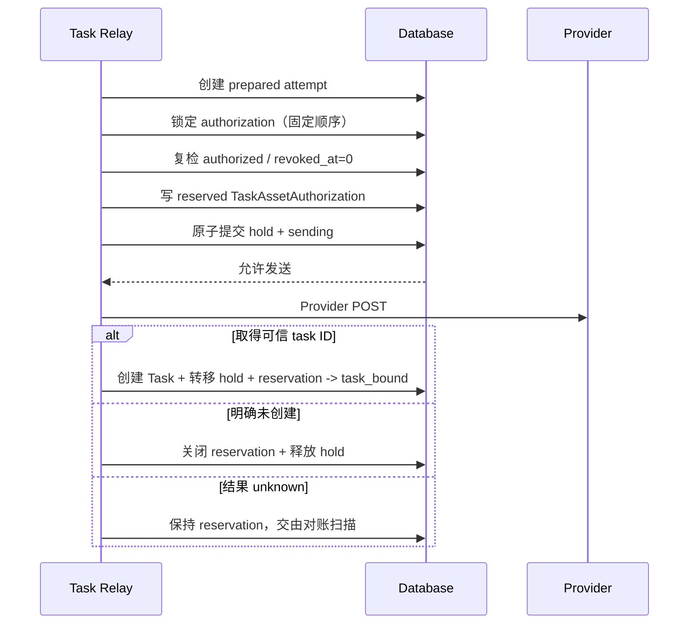

# 真人素材授权与撤回架构

本文定义平台已识别为真人的 Link 托管素材如何完成应用规则接受、Provider 技术认证、授权作用域
冻结、任务使用、撤回和内容访问控制。它不把 new-api 描述为自然人同意证据系统、内容审核机构或
能够收回 Provider 已处理媒体的平台。

普通 Link 资源的创建、source/binding 解析、Provider adapter 和生命周期由
[Link 资源合同与解析架构](Link资源合同与解析架构.md)负责。

## 1. 边界与保证

真人治理只适用于平台明确标记为 `real_person`、并通过 `/v1/assets` 管理的素材：

- 应用先接受当前生效的《API 服务规则》；
- 应用以稳定匿名 `end_user_subject` 发起 Provider H5 技术认证；
- 授权、认证 session、素材组、真人 Asset 和任务使用固定在相同 app、subject 与 Provider 账号；
- 新任务发送前必须在数据库中线性化地接受本次授权使用；
- 撤回后禁止新的任务使用，并对平台可控制的内容回源和清理动作 fail closed。

请求级 URL/Data URL 不进入本状态机。平台没有内容分类能力时，不能仅凭地址判断是否包含真人，
也不能声称直接媒体已通过真人技术审核；这类输入由业务准入、受控分组、调用方义务和 Provider
自身合同约束。

平台保证的是“停止平台可控制的后续动作”，不保证：

- 撤回已经提交给 Provider 的请求；
- Provider 取消一定成功；
- 删除 Provider 已处理、缓存或派生的数据；
- 收回已下载到平台外的结果副本；
- 保存自然人的专项同意正文或法律证明。

## 2. 领域事实

```text
API 应用（app_id，当前为 Token ID）
  ├─ APIServiceRuleAcceptance
  └─ RealPersonAuthorization（rpa_*）
       ├─ end_user_subject HMAC
       ├─ customer model / publication
       ├─ channel / implementation / profile / credential fingerprint
       ├─ 0..N VerificationSession
       ├─ 0..N AssetGroupBinding + ownership claim
       └─ 0..N real_person Asset

TaskCreateAttempt / Task
  └─ TaskAssetAuthorization
       └─ attempt + task + asset + authorization + state
```

| 事实 | 权威职责 |
| --- | --- |
| `APIServiceRuleAcceptance` | 应用接受的规则版本、正文哈希、时间和操作主体 |
| `RealPersonAuthorization` | app、匿名最终用户、客户模型、Provider 账号与授权状态 |
| `VerificationSession` | 一次 Provider H5 技术认证的受保护 handle、状态和过期时间 |
| `AssetGroupBinding` | 认证作用域对应的 Provider 素材组及账号身份 |
| `TaskAssetAuthorization` | 某次 attempt/Task 已接受使用哪些真人 Asset 的可索引关系 |

原始 `end_user_subject` 不落库，只保存应用作用域 HMAC。Task 私有 JSON 不能替代普通关系表，因为
撤回需要按 authorization 查找已接受 attempt 和在途 Task。

## 3. 授权建立



### 3.1 应用规则接受

规则接受是应用级合规门槛，不是自然人专项同意页。平台保存版本、正文哈希、时间和操作主体；
应用如何取得并保存最终用户明确同意不进入平台数据边界。

### 3.2 认证作用域

创建 authorization 时冻结：

- `app_id + end_user_subject_hash`；
- 客户模型、route family、Link SKU 和 publication version；
- implementation ID/version/hash；
- channel、profile、credential fingerprint、Project 和 Region；
- 允许的素材类型、数量和 Provider 生命周期能力。

认证重试可以创建新 session，但不能切换客户合同、Provider、账号、Project 或 Region。不同 Provider
的认证结果不能互认。

### 3.3 H5 跳转与结果确认

平台返回预取安全、可重复打开的短时 `verification_url`，不向应用暴露长期 Provider H5 地址或认证
handle。GET/HEAD 预取不能消费唯一凭证。

浏览器 callback 只触发状态刷新，不能直接授予 `authorized`。平台必须使用冻结账号主动查询 Provider
最终结果；无法确认时保持非授权状态并由后台 job 继续轮询或进入人工处置。

## 4. 真人 Asset 创建

`real_person` Asset 必须：

- 使用图片媒体类型；
- 关联当前 `authorized` 的 authorization；
- 沿用 authorization 冻结的 customer model、publication、implementation 和 Provider 账号；
- 创建到授权对应的专属 AssetGroupBinding；
- 继承相同 app 与 end-user subject；
- 继续满足普通 Asset 的 HTTPS URL、幂等、source 加密和 ownership claim 规则。

客户不能通过 `general`、metadata、extra、Provider 私有字段或裸上游 ID 绕过真人授权。未公开真人
能力的 SKU、implementation 或分组在创建和任务选渠阶段 fail closed。

## 5. 任务使用线性化

真人素材不能仅在选渠阶段检查一次授权。选渠到真正发送之间授权可能撤回，因此发送许可必须与
撤回在同一授权行上线性化。



`sending` 事务提交是“平台已接受本次真人素材使用”的线性化点：

- 撤回先提交：创建事务看到 revoked，不能发送 Provider 请求；
- reservation 先提交：该调用属于已接受在途任务，撤回能够通过普通索引发现 attempt/Task。

数据库锁不跨越网络请求。多素材按稳定顺序锁定全部 authorization，避免死锁和部分接受。

## 6. 撤回与内容访问

撤回事务锁定 authorization，写入 revoked 状态后立即：

1. 禁止新的 Asset 创建、迁移、Resolver 解析和任务 reservation；
2. 通过 `authorization_id + state` 查找 reserved attempt 与 task-bound Task；
3. 为已接受调用记录审计，并在冻结 lifecycle capability 支持时安排取消尝试；
4. 安排真人 Asset、binding 和 group 的可重试清理；
5. 让任务级视频内容与 last-frame 回源立即 fail closed。

内容端点每次访问都读取 `TaskAssetAuthorization` 并回查 authorization。任一真人授权不再 authorized
时返回稳定的 `real_person_authorization_revoked`，且不得访问 Provider。任务元数据可以继续按客户
协议查询，但受保护媒体内容不再由平台代理。

任务计费仍按真实 Provider 终态或 SLA 规则完成。撤回不能伪装成 Provider 已取消，也不能成为无条件
退款信号；取消失败、Provider 继续执行和清理结果分别记录。

## 7. 状态与后台恢复

authorization、verification session、group binding 和清理 job 使用各自状态机及条件更新。后台任务
负责：

- 主动查询 Provider H5 最终状态；
- verification 过期和重试；
- binding/group 创建未知的 watchdog；
- 撤回后的取消、删除与人工处置；
- 凭据变化、实现退役和 publication 不一致造成的 fail-closed 扫描。

关闭新建开关后，已开始的认证轮询、撤回和清理仍继续运行。晚到认证成功或素材创建结果不能复活
已经撤回或删除的本地事实。

## 8. 凭据、安全与隐私

- 所有 API 查询和修改使用 `user_id + app_id`；真人链路再使用 end-user subject HMAC；
- Provider H5 handle、上游认证 URL、素材 ID、group ID 和连接事实加密或受保护保存；
- verification token、幂等键和 end-user subject 只保存不可逆摘要；
- 视频 Bearer 与官方素材 AK/SK 分离，普通渠道详情不回显素材凭据；
- 匿名跳转路由隔离 CORS，使用限流和 `no-store/no-referrer`，不接受平台 API Token；
- 普通响应、日志、metrics、trace 和 job payload 不包含完整签名 URL、凭据指纹或原始 Provider 响应；
- authorization 与 Task 的关联使用普通表和索引，不对 Task JSON 执行关系查询；
- 所有事务、锁序、索引和补偿兼容 SQLite、MySQL 与 PostgreSQL。

## 9. 架构不变量

1. 应用规则接受、Provider 技术认证和自然人专项同意是不同概念。
2. callback 参数不能直接把 authorization 置为成功。
3. 授权固定到 app、匿名最终用户、客户模型 publication 和精确 Provider 账号。
4. 真人 Asset 不能跨 authorization、app、subject、publication 或账号复用。
5. 任务使用与撤回在同一 authorization 行上线性化，锁不跨网络请求。
6. 撤回后新的 Resolver 和内容回源 fail closed。
7. 撤回不等于 Provider 已取消、已删除或客户必然退款。
8. 直接 URL/Data URL 不伪装成已通过平台真人认证的 Link 资源。
9. 凭据、认证 handle、完整 URL 和上游资源 ID 不进入普通用户可见面。
10. 晚到 Provider 结果不能复活已撤回或已删除事实。

## 10. 对外接口边界

受 Token 鉴权：

```text
POST /v1/real-person-authorizations
GET  /v1/real-person-authorizations/:authorization_id
POST /v1/real-person-authorizations/:authorization_id/retry
POST /v1/real-person-authorizations/:authorization_id/revoke

GET  /v1/api-service-rules/current
POST /v1/api-service-rules/acceptance
```

匿名技术路由只有 `/verification/real-person/:token` 和 `/verification/real-person/complete`。前者安全
跳转到 Provider H5，后者只触发主动查询；两者都不能仅凭 callback 参数授权。

## 11. 相关文档

- [Link 资源合同与解析架构](Link资源合同与解析架构.md)
- [异步任务与计费事实架构](异步任务与计费事实架构.md)
- [Link 视频服务合同与异步任务架构](Link视频服务合同与异步任务架构.md)
- [素材库对接指南](../30-engineering/素材库对接指南.md)
- [02 视频与素材渠道运维手册](../40-operations/02-视频与素材渠道运维手册.md)
- [04 素材库验收操作手册](../40-operations/04-素材库验收操作手册.md)
- [ADR-0005：官方 Action 素材凭据隔离](decisions/0005-官方Action素材凭据隔离.md)
- [ADR-0009：请求级媒体与平台托管素材双路径](decisions/0009-请求级媒体与平台托管素材双路径.md)
