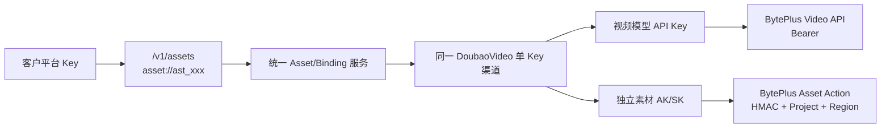
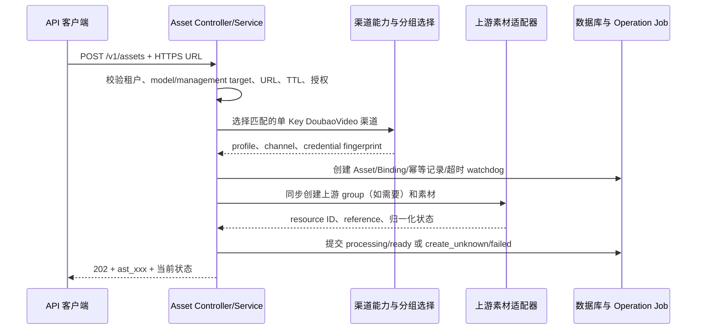

# 素材代理与真人授权架构

## 1. 定位与边界

素材能力是 new-api 的控制面代理，不是对象存储服务。当前代码仍接受客户提供的 Provider 可访问 HTTPS URL，把素材创建到选定的上游账号，并只保存平台 ID、上游资源、渠道账号和授权作用域之间的映射。[Link 资源虚拟素材库架构](Link资源虚拟素材库架构.md) 与 [ADR-0015](decisions/0015-Link公开SKU与实现身份版本绑定.md) 已接受供应商中立的目标架构：Link 资源可使用加密源引用或上游 binding 解析，但对应代码和迁移尚未完成。本文继续作为当前素材代理实现与真人授权生命周期的专题说明，Link 资源长期产品合同以专门架构文档为准。

本文只治理通过 `/v1/assets` 创建并以 `asset://ast_xxx` 复用的 Link 资源（平台治理素材），不排除模型官方
合同允许的请求级 HTTP/HTTPS URL 或 Data URL。请求级媒体不创建 Asset/Binding，也不获得
本文定义的迁移、授权、撤回或生命周期能力；两条路径的边界见
[ADR-0009](decisions/0009-请求级媒体与平台托管素材双路径.md)。

当前已实现边界如下：

- 对外使用稳定的 `asset://ast_xxx`，不接受客户直接提交上游素材 ID；
- 普通素材只接受 HTTPS URL，不支持 multipart、base64、内容下载或临时上传桥接；
- 平台不对源 URL 执行 GET/HEAD，不保存素材二进制；当前代码也不保存完整签名 URL；
- 当前代码在每个素材创建时立即绑定一个 model 或平台管理 target、一个 Provider profile、一个单 Key 渠道和一个素材账号凭据指纹；
- 当前代码中素材不能透明跨渠道、跨账号或跨 Provider 迁移；
- 真人素材必须先由应用接受当前《API 服务规则》，再完成上游 H5 认证；授权、素材组、素材和视频请求同时固定到 `app_id + end_user_subject` 与同一 Provider 账号；
- 上述真人强制边界适用于平台已识别为真人的托管素材。请求级 URL/Data URL 不进入本文状态
  机，平台没有分类/审核能力时不能仅凭地址判断是否包含真人；此时真人限制由业务准入、受控
  分组和调用方义务执行，不能声称已由技术自动识别。
- `joycreator_assets` 只用于素材管理，不进入视频素材路由；`official_action_assets` 使用独立 AK/SK 完成官方素材与真人 Action，视频仍使用同一渠道的模型 API Key。

被 [ADR-0004](decisions/0004-中转型素材代理与上游绑定.md) 取代的 Azure 托管方案从未部署，不存在存量迁移或兼容模式。ADR-0004 和 FunCloud 流式例外 ADR-0012 先由 ADR-0014 取代，现由 ADR-0015 继续承接；历史文件保留用于追溯，不再用于扩展新实现。

### 1.1 当前实现状态

截至 2026-08-02，代码已实现：

- `/v1/assets` 平台 CRUD、迁移、绑定查询和创建幂等；
- `ast_xxx`、`AssetBinding`、账号指纹、素材组和操作任务；
- 普通素材与真人授权状态机；
- `asset://ast_xxx` 所有权、状态、授权、模型和渠道交集校验；
- 每次 Provider 尝试前把平台引用改写为冻结账号下的上游引用；
- BytePlus 视频 Bearer 与素材 AK/SK 双凭据隔离。
- 应用级 API 服务规则版本/正文哈希接受记录，以及 `app_id + end_user_subject` 真人作用域隔离；
- Moxing `ark_assets` 与 BytePlus `official_action_assets` 共用一套客户端认证编排，未确认的 Moxing 组删除进入 `manual_required`；
- 预取安全、可重复打开的短时 `verification_url`，不向应用暴露上游 H5 长链接。

旧 target/profile 别名只用于迁移兼容，不属于新 Link 合同。其调用量、退出日期以及全部 Provider 的真实生命周期和三数据库灰度仍需持续验收。

ADR-0015 目标中的 `AssetSource` 加密持久化、`SupportsLinkAssets` 与按实现 ID/version 注册的内部解析能力、binding/`source_url` 双模式 Resolver、FunCloud 旧 multipart 链路删除均尚待实施。因此当前运行时仍只能按单主 binding 实现解释，不能因 ADR 已接受就宣称 FunCloud Link 已上线。

## 2. 核心领域模型

```text
用户
 └─ API 应用（当前以 Token ID 作为 app_id）
     ├─ APIServiceRuleAcceptance
     ├─ 素材 Asset（ast_xxx，逻辑资源）
 │   └─ 主绑定 AssetBinding
 │       ├─ model 或 management target
 │       ├─ upstream profile
 │       ├─ channel + credential fingerprint
 │       ├─ upstream resource/reference
 │       └─ AssetOwnershipClaim（上游对象唯一归属）
     └─ 真人授权 RealPersonAuthorization（rpa_xxx）
     ├─ end_user_subject 的 HMAC 摘要
     ├─ VerificationSession
     ├─ AssetGroupBinding + AssetGroupOwnershipClaim（认证作用域）
     └─ 真人 Asset

TaskCreateAttempt / Task
 └─ TaskAssetAuthorization（attempt + task + asset + authorization 可索引 reservation）

Channel
 ├─ Key（视频 Bearer）
 └─ ChannelAssetCredential（官方素材 AK/SK）
```

### 2.1 组件职责

| 组件 | 负责 | 不负责 |
| --- | --- | --- |
| 客户端 Asset Controller | 平台鉴权、DTO 和错误外壳 | 不暴露 Provider Action 协议 |
| Asset Service | 用户隔离、幂等、状态机、路由约束和生命周期编排 | 不保存素材二进制 |
| 渠道能力选择 | 按 model、用户组、profile、单 Key 和账号指纹选择渠道 | 不根据域名、模型名或 Key 格式猜协议 |
| Asset Provider Adapter | 按 profile 调用上游素材、素材组和认证接口 | 不决定平台所有权或视频价格 |
| AssetOperationJob | 轮询、删除、撤回、补偿和不确定创建 watchdog | 不复活已删除或已撤回资源 |
| 视频路由约束 | 求多个素材的共同可用渠道并改写上游引用 | 不迁移素材账号 |
| Task 授权 reservation 与内容门 | 发送前锁定授权并写 reservation，Task 创建时绑定；下载回查授权，撤回索引 attempt/在途任务 | 不声称能撤回平台外副本 |

### 2.2 客户端统一与 Provider 分流



客户端素材合同不复制 BytePlus Action 的签名、Action、Version 或上游资源 ID。Provider `official_action_assets` 严格遵循 Provider Action 合同，视频 `official` profile 则继续使用模型 API Key。两个适配器共享同一渠道身份和 Provider Project，但消费不同凭据。

`Asset` 表达用户拥有的一条平台逻辑资源；`AssetBinding` 才表达该资源在哪个上游账号中可用。当前实现每个 remote asset 只有一条主 binding。ADR-0015 目标改为一个不可变 `AssetSource` 加 0..N 个 binding，客户始终只使用原 `ast_*`；但更换源 URL 仍必须通过显式迁移创建新 `ast_*`，不允许在原资源上替换媒体身份。

第三方素材 profile 的凭据归属使用以下稳定指纹：

```text
SHA-256(normalized base URL + selected key + asset profile)
```

官方 `official_action_assets` 使用独立版本域：

```text
SHA-256(official_action_assets/v2 + Action host + AK + SK + profile + Project + Region)
```

官方 Action 的真实 host 由 Region 推导，不使用视频 Base URL；视频模型 API Key 不进入官方素材指纹。素材 AK/SK 独立保存在一对一表 `channel_asset_credentials`，不进入 `Channel.Key` 或普通 settings。

指纹只用于判定账号是否仍与创建时一致，不替代实际凭据，也不向用户返回。

官方双凭据渠道的配置事实如下：

| 事实 | 存储位置 | 消费方 |
| --- | --- | --- |
| 视频模型 API Key | `Channel.Key` | 视频 official adapter |
| 素材 AK/SK | `channel_asset_credentials` | official Action adapter |
| Provider Project / Region | 渠道素材 settings | Action host、签名与资源作用域 |
| 公开模型到 Endpoint ID | 渠道模型映射 | 视频任务创建 |
| 素材账号指纹 | Binding/授权等冻结事实 | 路由、轮换和生命周期栅栏 |

管理 API 对 AK/SK 采用“写入但不回显”合同：新建时成对填写，编辑时同时留空表示保留，同时填写表示轮换，清除必须使用显式动作。渠道保存、敏感凭据写入和账号身份校验必须具有原子性。

## 3. 创建链路



创建请求必须且只能指定一个目标：

- `model`：素材将用于该公开模型的视频请求；
- `target=management_library`：素材仅进入平台管理素材域；历史 `joycreator_library` 只作为输入兼容别名，存储和响应统一使用规范值。

普通素材支持 `general`；真人素材使用 `real_person`、媒体类型必须是 `image`，同时提供已处于 `authorized` 的 `authorization_id`，并沿用该授权冻结的 model 和渠道账号。

Provider profile 与视频 profile 的配对是显式合同：

| asset profile | video profile | 用途 |
| --- | --- | --- |
| `ark_assets` | `third_party_reverse_proxy` | Ark 兼容普通素材、真人认证和视频引用；素材组删除保持 fail closed |
| `relay_assets` | `third_party_relay` | 中转素材创建和视频引用 |
| `joycreator_assets` | 不参与视频路由 | 素材管理 |
| `official_action_assets` | `official` | BytePlus 官方 Action 素材、素材组、真人认证与视频引用 |

任何启用素材 profile 的渠道都必须是 DoubaoVideo 单 Key 渠道，并配置正数 `asset_min_url_ttl_seconds`。系统不根据 Base URL、模型名或 Key 格式推断 profile。

Bearer 中转线的连通性测试只使用已确认的只读列表合同：`ark_assets` 调用 `POST /v1/ark/assets/list`，`relay_assets` 调用 `POST /assets/list`，均限制为每页 1 条。该测试只证明素材 Base URL、平台 Key 和素材路由可用，不替代视频模型与额度验收。TokenSave `/v1/asset/*` 属于 JoyCreator 管理 facade，不属于现有 `joycreator_assets` 直连路径，也不能与参与视频路由的 `relay_assets` 混用；接入时必须使用独立的 management-only profile。

## 4. URL 与幂等合同

平台只做提交前的控制面校验：HTTPS、无 userinfo、长度受限、明显的非公网目标拒绝、DNS 当前解析结果均为公网地址。平台不主动访问 URL，因此不能验证 404、媒体类型、Cookie、防盗链、重定向或 Provider 最终连接目标。

每个 Provider 必须给出经验证的抓取窗口。`source.expires_at > 0` 表示客户声明的 Unix 秒级过期时间，其剩余 TTL 必须不少于选定渠道的 `asset_min_url_ttl_seconds`；值为 0 表示有效期未知，不代表永久有效，平台按 best-effort 提交。网关预检查不能替代 Provider 对重定向、DNS rebinding、私网和云元数据地址的最终 SSRF 防护。

ADR-0015 实施后，上述 TTL 合同还必须用于 `source_url` 任务执行：

- 客户创建后只使用 `asset://ast_*`，但 URL-only Provider 仍在每次任务中依赖密文中的源 URL；
- 已声明 `expires_at` 时，选渠和每次发送前都要满足 channel/profile 声明的最小 TTL；有效期未知时不猜测签名参数，按 best-effort 提交；
- 最小 TTL 必须覆盖队列延迟、Provider 抓取、重试预算和时钟偏差，不能只判断 `expires_at > now`；
- 源过期时仅移除 `source_url` 候选；已物化的 active binding 继续可用。当所有路径均不可用时，Asset 才对当前请求不可解析；
- 仅服务单次任务的短时 URL 优先使用 ADR-0009 定义的请求级媒体路径，不宣称为长期可复用素材。

`Idempotency-Key` 的作用域是 `user + app + endpoint + key`，有效期为 24 小时：

- 同键同请求返回原 `ast_xxx` 和当前状态，不再次调用上游；
- 同键不同请求返回 `idempotency_conflict`；
- 数据库只在幂等表保存 Key 摘要与规范化完整请求的 HMAC；可恢复 URL 只存在于最小 AssetSource 密文，不另存 URL HMAC；
- 上游明确拒绝时进入 `failed`；
- 网络结果不确定时进入 `create_unknown`，同键重放仍不重试 Create；
- watchdog 到期且无法确认结果时，以 `asset_creation_outcome_unknown` 关闭本地创建，并保留潜在上游孤儿的审计风险。

`Asset`、`AssetBinding`、幂等记录和 watchdog 在同一数据库事务中创建。上游返回资源 ID 后，系统在同一 Provider 账号作用域写入唯一 ownership claim；冲突时 fail closed，不能让两个本地资源认领同一上游对象。删除或撤回与上游创建并发时，晚到结果只能补记上游 ID 并进入清理，不能把本地资源复活为 ready。

显式迁移 `POST /v1/assets/:asset_id/migrations` 使用新的源 URL 和目标配置创建新 Asset，并通过 `supersedes_asset_id`、`migration_batch_id`、`migration_reason` 留下谱系；它不修改旧 binding，也不把上游 ID 跨账号搬运。

## 5. 视频路由与引用改写

引用平台托管素材的视频请求必须在对应厂商官方合同的媒体字段中使用 `asset://ast_xxx`：
ModelArk 使用 `content[*].{image_url,video_url,audio_url}.url`，Kling 使用 `image`、
`image_tail` 等字段，即梦使用 `image_urls`。正式入口不通过 `metadata` 或任意 map 搬运媒体
字段。普通请求级媒体不进入本节的 Asset/Binding 路由，但仍须通过 Link 合同和 SKU 能力校验。
路由中间件对 `asset://` 引用在渠道分配前完成：

1. 按当前用户加载全部素材并要求状态为 `ready`；
2. 真人素材额外要求授权仍为 `authorized`；
3. 过滤出 model、profile、渠道状态和凭据指纹均匹配的 active binding；
4. 对多个素材求可用渠道交集；
5. 把交集写入渠道分配约束；无交集时返回 `asset_binding_required`；
6. 每次上游尝试前再次校验选中渠道和指纹，并把平台引用改写为对应的上游 `asset://...`。
7. 在 create attempt 的预扣、hold 与 `sending` 事务内，按固定顺序锁定全部真人授权行并再次
   校验 `authorized/revoked_at=0`，写入带 `attempt_id` 和预生成公开 `task_id` 的
   `task_asset_authorizations: reserved`；事务提交后才允许发送上游请求。
8. 取得可信上游任务 ID 后，在创建正式 Task、转移 hold 的同一事务把 reservation 改为
   `task_bound`；明确未创建时关闭，结果 unknown 时保持可扫描。

`sending` 事务提交是“平台已经接受本次真人素材使用”的线性化点。撤回与它锁定同一授权行：
撤回先提交时创建失败且不发送；reservation 先提交时该调用属于在途任务，撤回能够按索引发现
并尝试取消。这样不需要把数据库锁跨越网络请求，也不会产生“撤回扫描完成后才出现不可见 Task”
的窗口。

同一请求混用 `asset://` 与请求级 URL/Data URL 时，同时需要 binding 渠道交集和直接媒体实现
能力，容易形成隐式合同。是否允许混用必须由公开 SKU 明确声明；未声明时拒绝，第一阶段
ModelArk 视频 SKU 不支持混用。

这保证了重试不会越过素材所属账号。第三方素材渠道的 Key/Base URL、官方素材 AK/SK/Project/Region、素材 profile 或共享视频渠道身份发生变化后，旧 binding 立即失去路由资格。存在未删除素材、素材组或真人授权时，渠道身份变更、素材凭据轮换/清除和渠道删除都会被生命周期栅栏拒绝。

## 6. 状态与后台任务

素材公共状态为：

```text
creating -> processing -> ready
    |            |          |
    +-> create_unknown      +-> deleting -> deleted
    +-> failed                  \-> deletion_failed
```

binding 使用更细的 `creating/create_unknown/processing/active/failed/stale_credential/deleting/deletion_failed/deleted`。只有 `ready` Asset 与 `active` binding 可用于视频请求。

`AssetOperationJob` 负责 `poll_binding`、`update_binding`、`delete_binding`、`delete_group`、`poll_verification` 和不确定创建 watchdog。Job 通过租约抢占、CAS 状态提交、有上限重试和退避保证多实例下可恢复。素材创建开关关闭后，系统仍继续执行轮询、删除、撤回和 watchdog，避免已开始的生命周期永久停留。

删除先把本地资源置为不可引用，再异步清理上游；所有 binding 删除后才写入 `deleted/deleted_at`。删除平台素材不删除客户自己的 OSS/CDN 源对象。无法证明上游对象不存在时不得向客户声称上游已经清理完成。

## 7. 应用规则与真人认证

平台只管理应用级 API 规则接受和 Provider H5 技术认证，不展示或保存自然人的专项同意：

1. 应用通过当前 API Key 获取并接受生效中的《API 服务规则》，登记合规责任人与应用层同意记录承载系统；平台保存版本、正文哈希、时间和操作主体。
2. 应用按 model 和稳定匿名的 `end_user_subject` 创建 `rpa_xxx`；系统将其 HMAC 摘要与 `app_id`、渠道、profile、凭据指纹、Project、Region 一起冻结。
3. 平台立即创建上游 H5 session，只返回平台短时 `verification_url`；GET/HEAD 预取不会消费唯一凭证。
4. 自然人在 Moxing/BytePlus H5 完成认证；浏览器返回只触发状态刷新。
5. 平台使用冻结账号主动查询 Provider 最终结果；callback 参数本身不能直接授予 `authorized`。
6. 认证成功后保存专属 `AssetGroupBinding`，真人图片创建只能进入该 group，并继承相同最终用户摘要。
7. 撤回在本地事务提交后立即禁止新的 authorization reservation，并为已 reservation 的
   attempt、关联 Task、素材和 group 安排可重试取消或清理。

授权与 session 均使用状态机和行锁串行化。认证重试可以创建新 session，但不能切换 Provider、账号、Project 或 Region；Moxing 与 BytePlus 的认证结果不可共享。`ASSET_PUBLIC_BASE_URL`、持久加密密钥、H5 host allowlist 或 Provider 合同未就绪时，真人能力 fail closed。应用层如何取得和保存最终用户明确同意不进入平台数据边界。

撤回只能保证平台可控制的后续动作：

- 立即禁止新的素材引用和迁移；
- `/v1/videos/{task_id}/content` 及 `part=last_frame` 每次回源前读取
  `task_asset_authorizations` 并回查授权；任一真人授权不是 `authorized` 时返回稳定的
  `real_person_authorization_revoked` 内容不可用错误，不访问上游；
- 通过 `authorization_id + state` 的普通索引查找已接受 attempt 及排队/运行 Task，记录
  审计，并在冻结 lifecycle capability 明确支持时安排取消尝试；
- 继续按任务真实终态或 SLA 到期执行计费，不把“授权撤回”伪装成已经取消成功；
- 安排托管素材和 group 的可重试清理，但不得声称能收回已提交给 Provider 的媒体，或保证
  Provider 已处理、缓存的数据被删除。

## 8. 安全与隐私不变量

- 所有客户端素材与真人授权查询和修改均以 `user_id + app_id` 限制；真人链路再以 `end_user_subject` 摘要限制，找不到和越权使用同一对外语义；
- 用户响应、普通日志、metrics、trace 和 job payload 不包含完整签名 URL、上游 ID、Key、凭据指纹或原始上游响应；
- 平台不保存素材二进制、Authorization 或 Cookie；当前代码不保存完整源 URL，ADR-0015 实施后只允许绑定 Asset scope 的最小 `AssetSource` 密文保存完整 URL，不增加 URL HMAC、独立状态或密钥迁移系统，明文和可重放签名不得进入其它持久化、响应、日志、metrics 或 trace；
- 视频 API Key 与官方素材 AK/SK 分表保存；普通渠道详情不返回素材凭据，敏感管理员最多看到固定规则的 Access Key ID 脱敏提示；
- 公开认证跳转路由隔离 CORS、禁止 OPTIONS、使用关键接口限流和 `no-store/no-referrer` 响应头；
- 认证跳转 Token 与幂等键只保存不可逆摘要，上游 H5 和认证 handle 加密保存；
- 真人撤回、用户删除和渠道身份变更必须经过同一生命周期锁序，避免并发创建或删除导致资源复活；
- 真人任务内容回查和撤回任务扫描必须使用普通关系和索引，不通过 Task JSON 条件查询；
- 所有表、锁和补偿查询必须同时兼容 SQLite、MySQL 与 PostgreSQL。

## 9. 对外接口边界

受 Token 鉴权的接口：

```text
POST   /v1/assets
POST   /v1/assets/:asset_id/migrations
GET    /v1/assets
GET    /v1/assets/:asset_id
PATCH  /v1/assets/:asset_id
DELETE /v1/assets/:asset_id
GET    /v1/assets/:asset_id/bindings

POST   /v1/real-person-authorizations
GET    /v1/real-person-authorizations/:authorization_id
POST   /v1/real-person-authorizations/:authorization_id/retry
POST   /v1/real-person-authorizations/:authorization_id/revoke

GET    /v1/api-service-rules/current
POST   /v1/api-service-rules/acceptance
```

平台不提供素材 content、后绑定创建或独立 asset-group 管理 API，也不提供平台真人同意页、回执页或自然人同意证据接口。

匿名技术路由只有 `/verification/real-person/:token` 与 `/verification/real-person/complete`。前者安全跳转到上游 H5，后者只触发主动查询；两者不接受平台 Token，也不能仅凭 callback 参数把授权置为成功。

## 10. 架构验证与演进

以下合同必须由自动化测试和环境验收持续保护：

- 应用所有权绑定 `UserID + app_id`；当前 `app_id` 为 Token ID，因此新 Token 不会自动继承旧应用资源，迁移必须显式执行；
- 真人授权、素材、create attempt、Task reservation 与内容回源使用相同最终用户摘要，跨应用或跨最终用户复用 fail closed；
- 同一幂等键不会重复创建上游资源，结果不确定时不自动换 Key 重建；
- 上游素材和素材组在 Provider 账号作用域只能被一个本地 binding 唯一认领；
- 显式迁移创建新 `ast_xxx` 并保留谱系，不原地改绑旧素材；
- 多素材路由只使用全部 binding 的渠道交集；
- 视频模型 API Key 与素材 AK/SK 分别进入正确适配器；
- 管理读取、用户响应、日志、任务快照和 Job payload 不泄露素材凭据；
- 渠道账号身份改变时旧 binding fail closed，存在活动资源时生命周期栅栏阻止轮换和删除；
- 删除、撤回与晚到创建结果并发时，本地资源不会复活；
- 真人任务创建与撤回覆盖两个事务提交顺序：撤回先提交时不发送上游，reservation 先提交时
  撤回能索引到 attempt/Task；撤回后平台内容访问 fail closed，取消失败、上游继续执行和后续
  清理结果均可审计；
- 视频和 last-frame 内容端点在授权撤回后均不向 Provider 发起请求；查询元数据可以保留，但
  已经下载到平台外的副本不在撤回保证范围；
- 未经分类的请求级媒体不会被错误记录成“已通过真人技术审核”，混合媒体路径按 SKU 明确
  能力 fail closed；
- ADR-0015 实施后，同一 Asset 在 binding 渠道和 `source_url` 渠道上按同一所有权/授权规则解析；已声明 TTL 不足、过期和无法解密时关闭 `source_url` 路径，`expires_at=0` 按 best-effort 处理，且不泄露明文 URL；
- SQLite、MySQL 和 PostgreSQL 上的状态迁移、行锁和补偿行为一致。

未来引入平台 Tenant/Project、二进制托管、普通客户可见素材组或 webhook 时，均会改变当前所有权、数据面或接口边界，必须通过独立 ADR 和数据迁移设计推进，不能在现有字段上隐式扩展。

## 11. 相关文档

- [Link 合同架构](Link合同架构.md)
- [Link 资源虚拟素材库架构](Link资源虚拟素材库架构.md)
- [ADR-0003：统一素材库与托管真人授权（已取代）](decisions/0003-统一素材库与托管真人授权.md)
- [ADR-0004：中转型素材代理与上游绑定（已取代）](decisions/0004-中转型素材代理与上游绑定.md)
- [ADR-0005：官方 Action 素材合同与 Bearer 兼容边界](decisions/0005-官方-action-素材合同与-bearer-兼容边界.md)
- [ADR-0009：请求级媒体与平台托管素材双路径](decisions/0009-请求级媒体与平台托管素材双路径.md)
- [ADR-0010：视频公开 SKU 能力与候选渠道等价](decisions/0010-视频公开SKU能力与候选渠道等价.md)
- [ADR-0015：Link 公开 SKU 与实现身份版本绑定](decisions/0015-Link公开SKU与实现身份版本绑定.md)
- [数据模型](数据模型.md)
- [素材库对接指南](../30-engineering/素材库对接指南.md)
- [02 视频与素材渠道运维手册](../40-operations/02-视频与素材渠道运维手册.md)
- [04 素材库验收操作手册](../40-operations/04-素材库验收操作手册.md)
- [视频上游接入与异步任务架构](视频上游接入与异步任务架构.md)
- 历史合同重构现场：[历史视频与素材合同重构方案](../99-archive/2026-07-28-视频官方%E5%8C%97%E5%90%91与统一素材库合同重构方案.md)
- 历史设计与实施记录：[BytePlus 官方视频与素材双凭据渠道接入完整方案](../99-archive/2026-07-26-BytePlus官方视频与素材双凭据渠道接入完整方案.md)
