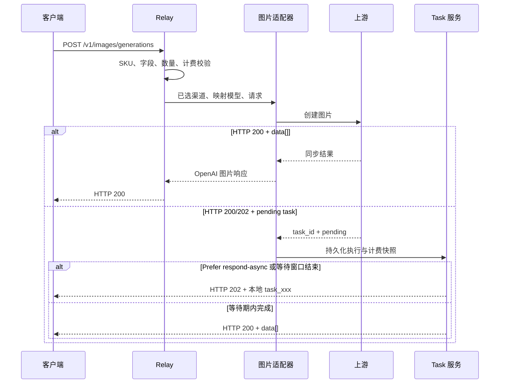

# 统一图片生成与异步任务架构

## 1. 目的与范围

本文描述统一图片接口如何承接同步和异步上游，并复用共享 Task、幂等和计费补偿能力。重点回答：

- 三个公开图片 SKU 如何保持统一北向字段；
- Moxing、Qihang 和媒体任务协议如何在南向隔离；
- HTTP 200 与 HTTP 202 如何进入同一客户端合同；
- 何时把计费责任从请求链路转交给 Task；
- 如何避免重复创建、重复计费、结果超发和敏感信息落库。

本文不扩展标准 multipart `/v1/images/edits`，也不改变 `gpt-image-2` 等既有 OpenAI 图片模型的同步路径。

## 2. 当前实现状态

当前代码已实现：

- `POST /v1/images/generations` 统一入口；
- `seedream-5-moxing`、`seedream-5-qihang`、`nano-banana-2` 的公共字段合同测试；
- Advanced Custom `media_task_image_blocking`；
- HTTP 200 图片、HTTP 200 queued 信封和 HTTP 202 任务信封识别；
- 共享 `Task` 持久化、后台轮询、终态 CAS、退款和补偿；
- `GET /v1/images/tasks/:task_id` 所有权查询；
- 图片任务创建幂等与同步图片隔离；
- 固定按张结算和可选 usage 表达式结算。

生产发布仍受 ability、分组、价格和真实验收控制。`doubao-seedream-4-5-251128` 只有适配器能力，不属于当前公开 SKU；`gpt-image-2` 被明确排除在媒体图片 Task 路径外。

## 3. 北向合同

### 3.1 路径与公开 SKU

```text
POST /v1/images/generations
GET  /v1/images/tasks/:task_id
```

| 公开 SKU | 公开能力 | 南向实现 |
| --- | --- | --- |
| `seedream-5-moxing` | 文生图、URL 参考图 | 映射为 `seedream-5-0-260128`，同步或媒体任务 |
| `seedream-5-qihang` | 文生图、URL 参考图 | 映射为 `seedream-5`，`converter=none`，当前同步 |
| `nano-banana-2` | 文生图、URL 参考图 | 映射为 Gemini usage 模型，媒体任务 |

三个 SKU 共同使用：

```text
model
prompt
image
size
n
response_format
stream
```

`image` 是 NEWAPI 统一图片合同中的 URL 参考图字段。Moxing Nano 所需的 `reference_images` 只在 converter 出站时生成；新客户端不得使用该南向字段。

### 3.2 能力和值域

统一字段只保证同名同义，不保证所有模型值域相同：

| SKU | `size` | URL 参考图 | 当前关键限制 |
| --- | --- | --- | --- |
| `seedream-5-moxing` | `2K`、`3K` | 最多 14 个 | 仅 `response_format=url` |
| `seedream-5-qihang` | 已验收 `2K` | 已验收单图和双图 | 当前同步响应 |
| `nano-banana-2` | `1K`、`2K`、`4K` | 最多 10 个 | 支持受控 `aspect_ratio` |

平台先执行 `dto.MaxImageN` 全局数量上限，再应用模型更严格的数量、尺寸和字段规则。合同外字段、冲突的参考图字段和不支持的显式值返回 400，不静默删除。

## 4. 组件与职责

```mermaid
flowchart LR
    Client[图片客户端]
    Router["POST /v1/images/generations"]
    Dist[模型与渠道分发]
    Prepare[持久化任务准备]
    Adapter[Advanced Custom 适配器]
    Provider[图片上游]
    Task[(共享 Task)]
    Poller[图片任务轮询]
    Billing[计费与补偿]
    Query["GET /v1/images/tasks/:id"]

    Client --> Router --> Dist --> Prepare --> Adapter --> Provider
    Adapter -->|同步 data[]| Client
    Adapter -->|任务信封| Task
    Task --> Poller --> Provider
    Poller --> Task
    Poller --> Billing
    Query --> Task
    Client --> Query
```

| 组件 | 负责 | 不负责 |
| --- | --- | --- |
| 图片 Router/Controller | 北向认证、分发和响应 | 不解析 Provider 私有任务 |
| 图片 DTO 与 converter | 公共字段校验、模型专有值域和南向转换 | 不决定价格或渠道权重 |
| `media_task_image_blocking` | 同步响应、任务信封、创建结果和等待窗口 | 不维护第二套任务表 |
| Task 服务 | 持久化、轮询、CAS、终态和公开投影 | 不保存 prompt 或参考图内容 |
| 计费服务 | 预扣、按实际结果或 usage 结算、退款和补偿 | 不由上游路径决定售价 |
| 查询 Controller | 用户所有权和 `openai_images` 协议隔离 | 不暴露上游任务或凭证 |

## 5. 创建与响应链路



上游 HTTP 状态不是唯一判断依据。HTTP 200 中包含 `queued/running` 和 `task_id` 时仍是异步任务；HTTP 200 中包含 `data[]` 时保持同步图片合同。

## 6. Task 数据合同

图片任务复用共享 `tasks` 表，并通过以下事实隔离：

```text
platform = media_image
client_protocol = openai_images
action = image_generation
private_data.media_image != nil
```

创建时冻结：

- 本地与上游任务 ID；
- 创建和最后轮询请求 ID；
- 查询 Base URL、固定查询模板和代理；
- 创建时实际单个 API Key及鉴权模板；
- 公开模型、上游模型和请求图片数量；
- 响应格式；
- 模型价格、分组倍率、附加倍率和计费来源；
- 可选表达式快照与最小计费探针。

不得持久化：

- prompt；
- 参考图、原图或 Base64；
- 完整请求或上游响应；
- 客户端 Authorization/Cookie；
- 无关 Provider 私有字段。

## 7. 轮询与状态

上游状态归一化为：

```text
queued
running / in_progress / processing
succeeded / success / completed
failed / failure / cancelled / expired
unknown
```

公开状态投影为：

```text
queued
in_progress
completed
failed
unknown
```

轮询规则：

- 查询 URL 只由冻结 Base URL、固定 `/v1/media/tasks/{task_id}` 和转义后的任务 ID构造；
- 不接受上游返回的绝对 `poll_url`；
- 响应体上限为 1 MiB；
- 返回任务 ID与冻结 ID不一致时拒绝；
- 成功必须包含有效 HTTP(S) 结果 URL；
- 去重后结果数超过请求 `n` 时按协议违规失败关闭；
- 未知状态保持可审计，不解释为成功。

请求内等待和后台轮询可能发生只读 GET竞争，但终态状态条件更新和计费状态机保证只结算或退款一次。

## 8. 幂等与责任转移

图片创建幂等只作用于已选中的 Advanced Custom 持久化媒体任务路由，且必须在渠道分发之后判断。普通 OpenAI 图片和 `gpt-image-2` 不获取图片 Task幂等 claim。

### 8.1 异步任务

取得上游任务 ID并完成本地持久化后：

```text
请求链路不再退款
Task 独占终态结算或退款
```

同一 `Idempotency-Key` 与相同请求可以恢复已有任务或结果；相同 Key但请求不同返回冲突。取得任务 ID后禁止换渠道重新 POST。

### 8.2 同步图片

同步 HTTP 200 不创建长期 Task，也不持久化结果用于回放；完成计费后释放临时 claim。因此同步图片不提供 exactly-once 保证，客户端不得无条件自动重试创建 POST。

创建结果未知且无法确认上游是否接受时，系统不应自动重提或盲目退款，应进入可审计的人工对账窗口。

## 9. 计费与资金闭环

### 9.1 固定价格

固定 `ModelPrice` 以公开 SKU 为价格键。预扣按请求数量，成功后按实际交付数量结算：

```text
target quota = 单张价格 × 实际成功图片数 × 分组倍率
```

结果数不得超过请求 `n`；超发失败并退款，不向用户补扣未请求图片。

### 9.2 usage 表达式

启用 `tiered_expr` 前必须有：

- 可信终态 usage 字段语义；
- 管理员配置的安全预扣 Token 上界；
- 真实上游账单核验；
- 目标尺寸、图片输入和多结果样本。

终态 usage 支持 OpenAI 与 Gemini 组件语义。usage 缺失或无效时保持安全预扣上界，不根据尺寸或图片数量臆测 Token。任何精确结算都使用冻结表达式快照和计费探针。

### 9.3 生命周期

`media_image` 的有效生命周期具有 30 分钟保护下限；生产配置应覆盖上游 P99/SLA，通常保持 `TASK_TIMEOUT_MINUTES=1440`。失败、取消、过期和生命周期超时进入共享退款/补偿状态机。

## 10. 错误、安全与审计

- 不支持字段在上游调用前返回 400。
- 上游错误经过脱敏，不返回渠道 ID、真实模型、Base URL、任务 ID或凭证。
- 任务查询只允许资源所有者或管理员，且必须匹配 `client_protocol=openai_images`。
- 普通响应不包含 `private_data`、`billing_state` 或上游请求。
- 管理审计保留本地任务、脱敏上游任务/请求、轮询次数、等待时间、渠道和计费状态。
- 创建后本地持久化失败、任务生命周期退款后晚成功、usage 与账单不一致均属于人工对账红色窗口。

## 11. 架构不变量

1. 公开 SKU 使用统一图片路径和同义字段，南向差异不泄漏。
2. 同步和异步是同一北向响应联合合同，不是两套产品 API。
3. 图片任务复用共享 Task，不建立第二套任务系统。
4. Task 持久化后，只有 Task可以完成终态资金操作。
5. 上游结果数不超过请求 `n`，用户控制数量先经过统一上限。
6. `gpt-image-2` 与标准 multipart edits 不进入媒体图片 Task 路径。
7. 任务快照不保存 prompt、参考图内容或完整上游响应。
8. 所有终态和资金更新保持幂等，并兼容三种数据库。

## 12. 相关文档

- [媒体北向合同与南向适配架构](媒体北向合同与南向适配架构.md)
- [ADR-0006：图片异步任务共享 Task 持久化与北向恢复](decisions/0006-media-image-shared-task-persistence.md)
- [ADR-0008：共享异步任务计费状态机与原子补偿](decisions/0008-共享异步任务计费状态机与原子补偿.md)
- [图片模型 API 用户调用指南](../30-engineering/图片模型API用户调用指南.md)
- [03 图片渠道与异步任务运维手册](../40-operations/03-图片渠道与异步任务运维手册.md)
