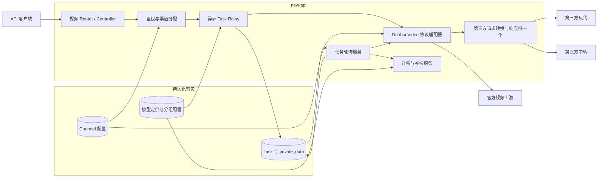
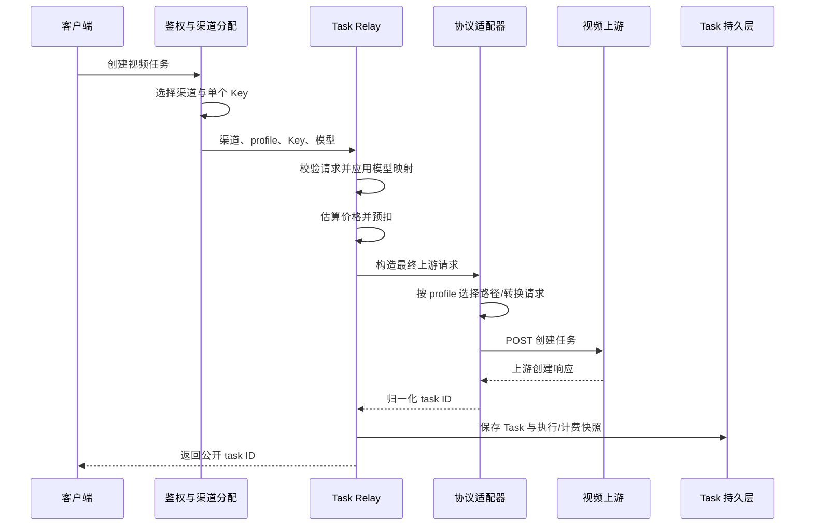
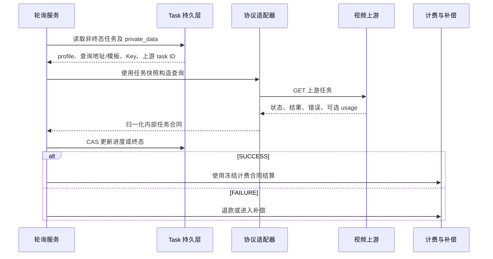

# 视频上游接入与异步任务架构

> 本文记录基于现有 `DoubaoVideo` 通道接入官方与第三方视频上游的当前架构合同。

## 1. 目的与范围

本文回答以下架构问题：

- 官方直连、第三方反代和第三方中转如何复用同一视频任务入口；
- 协议、地址、凭证、模型映射和价格分别由谁决定；
- 创建请求与异步轮询如何保持协议和账号一致；
- 第三方差异如何隔离，而不演变为供应商专用 Provider、服务或状态系统；
- 任务终态如何与既有计费、退款和补偿边界衔接。

本文聚焦 `DoubaoVideo` 异步视频任务链路，不重新定义 Kling、Jimeng 等其他任务平台，也不建设素材管理、供应商账号控制面、任意协议脚本或独立视频管理系统。

## 2. 架构原则

### 2.1 协议显式，供应商中立

`video_upstream_profile` 是唯一协议选择变量。profile 表达可测试的请求/响应合同，不表达供应商、域名、模型版本或价格。

同一供应商可以提供多个协议端点；不同供应商也可以实现同一个协议。系统因此不能从供应商名称、Base URL、模型名、Key 格式或请求头推断 profile。

### 2.2 配置与执行事实分离

渠道保存管理员可编辑的当前配置，用于创建未来任务；任务快照保存某个任务创建时已经发生的执行事实，用于完成在途任务。二者不是重复配置源：

```text
渠道配置（可编辑）  -> 决定下一次创建
任务快照（不可编辑）-> 保证已创建任务完成
```

### 2.3 适配器无供应商专用状态

协议适配器只进行确定性的 URL 构造、请求转换和响应归一化，不维护 Key 池、任务绑定、租户、价格或素材生命周期。异步状态归现有 Task 持久层，账号路由归现有渠道系统。

这里的“无供应商专用状态”不等于“异步任务无状态”。任务 ID、查询配置、选中 Key、模型和计费快照都是完成异步任务所需的创建事实。

### 2.4 失败优先于错误成功

未知 profile、无效路径、缺失任务 ID、未知中转状态以及成功终态缺失结果 URL 必须拒绝或保持未完成，不能通过猜测、默认映射或空结果把任务标记为成功。

### 2.5 协议、模型和计费正交

profile 决定如何调用，模型映射决定调用哪个上游模型，模型定价和分组倍率决定如何计费。任何一项都不能隐式覆盖另一项。

## 3. 系统上下文



架构保持现有 `Router -> Controller -> Service -> Model` 分层。协议适配位于 relay 边界；任务轮询和计费编排位于 service；渠道与任务事实由 model 持久化。

## 4. 组件职责

| 组件 | 核心职责 | 不承担的职责 |
| --- | --- | --- |
| 视频 Router / Controller | 暴露创建与查询 API，进入既有鉴权和任务 relay | 不选择第三方协议，不保存供应商配置 |
| 渠道分配器 | 按模型、分组、优先级和权重选择渠道及单个 Key | 不按模型名或地址猜测 profile |
| Task Relay | 校验请求、应用模型映射、估算与预扣、调用 adaptor、持久化任务 | 不实现供应商专用协议字段 |
| DoubaoVideo adaptor | 根据 profile 构造 URL、请求头和内部统一请求/响应 | 不维护任务到 Key 的外部绑定 |
| 第三方协议适配 | 转换第三方中转请求、兼容反代响应、归一化任务状态 | 不保存渠道、任务或价格状态 |
| Task 模型 | 保存公开/上游任务 ID、模型、执行快照和计费快照 | 不作为管理员配置入口 |
| 任务轮询服务 | 读取任务快照、查询上游、归一化状态、推进终态 | 不重新选择渠道协议或账号 |
| 计费与补偿服务 | 预扣、终态结算/退款、失败补偿和审计 | 不由 profile 或第三方路径决定价格 |

## 5. 协议合同

### 5.1 协议集合

| profile | 创建请求 | 创建/查询地址 | 响应处理 |
| --- | --- | --- | --- |
| `official` | 保持现有 Ark 视频请求 | 使用官方根地址回退与内置固定路径 | 使用官方任务响应合同 |
| `third_party_reverse_proxy` | 保持 Ark 兼容结构 | 使用渠道 Base URL、创建路径和查询模板 | 归一化已定义的包裹、任务 ID、状态和结果字段差异 |
| `third_party_relay` | 转换为统一媒体异步任务结构 | 使用渠道 Base URL、创建路径和查询模板 | 将中转四态、结果和错误归一化为内部任务合同 |

official 的内置路径为：

```text
POST /api/v3/contents/generations/tasks
GET  /api/v3/contents/generations/tasks/{task_id}
```

### 5.2 第三方中转请求合同

`third_party_relay` 从现有视频请求派生受控字段，包括：

- 上游模型 `model`；
- 能力与输入控制：`capability`、`input_mode`、`control_mode`；
- 文本、首帧、尾帧和参考图；
- 时长、分辨率、比例、随机种子、固定相机、水印和音频开关。

南向字段必须以中转合同为准，不能把北向或内部字段名原样透传：

| 北向/内部字段 | `third_party_relay` 出站字段 |
| --- | --- |
| `duration` | `duration_seconds` |
| `ratio` | `aspect_ratio` |
| `generate_audio` | `with_audio` |

这些可选标量使用指针语义；显式 `0` 或 `false` 必须继续发送，只有字段缺失时才省略。出站 JSON 不得同时残留 `duration`、`ratio`、`generate_audio` 等旧字段，否则上游可能接受任务却静默忽略参数。

转换只接受已定义的媒体类型和图片角色。不支持的视频/音频输入、重复首尾帧或互斥的尾帧与参考图组合直接拒绝，不能静默删除字段或降级为另一种输入模式。

### 5.3 内部任务响应合同

所有上游在进入任务服务前归一化为同一最小合同：

```text
task_id / id
status
result video URL（成功时必需）
error（失败时可用且已脱敏）
usage（仅在语义已验证时提供）
```

第三方中转状态归一化为 `queued`、`running`、`succeeded`、`failed`。第三方反代只接受已定义的 Ark 兼容状态及别名；任何未识别状态都不得被解释为成功。两个第三方 profile 的 `succeeded` 都必须包含可用结果 URL。

未经真实账单验证的第三方 usage 不得伪装为官方 Ark usage。协议兼容不等于计费语义兼容。

### 5.4 北向客户端协议与南向渠道协议

ModelArk v3 是客户端访问 new-api 的北向协议，`video_upstream_profile` 是 new-api 调用上游的南向协议，二者必须解耦：

```text
ModelArk v3 请求
  -> 内部统一视频任务
  -> official / third_party_reverse_proxy / third_party_relay
```

因此，从 `/api/v3/contents/generations/tasks` 创建任务时，不能因为北向采用 ModelArk 合同就只保留 `official` 渠道。`ModelArkVideoChannelConstraint` 的兼容边界是：

- 仅考察已启用的 `DoubaoVideo` 渠道；
- 空 profile 按历史 `official` 兼容；
- `VideoUpstreamProfile.IsValid()` 登记的已实现 profile 均可参与后续分发；
- 未知 profile 必须拒绝，不能借北向转换绕过南向协议实现；
- 允许集合与 `AssetRouteConstraint` 的素材可用渠道集合取交集，不能扩大素材路由范围；
- 最终仍由分发器校验调用分组、公开模型、能力记录、渠道状态、优先级和权重。

具体字段转换、响应归一化、终态 usage 和生命周期能力由选中 profile 的适配器负责。某个第三方 profile 暂不支持取消或删除，不应反向阻止其已实现的创建与查询能力。

北向长期合同为两套薄适配层，而不是两套任务系统：

| 北向协议 | 核心价值 | 独立合同 |
| --- | --- | --- |
| OpenAI Videos Core `/v1/videos` | 通用 SDK 和跨 Provider 接入 | cursor 分页、OpenAI 四态、终态删除和内容下载 |
| ModelArk v3 `/api/v3/contents/generations/tasks` | Seedance/字节生态原生接入 | 七天本地列表、ModelArk 状态、按状态取消或删除 |

两者共享内部 Task、渠道分配、素材约束、轮询、计费和审计主链路，但不得互用 DTO、分页或错误外壳。第三方 `/api/v1` 候选协议只有在取得真实 OpenAPI 和明确客户需求后才增加薄兼容层；平台不再新增第三套视频主协议。

## 6. 配置与状态所有权

| 事实 | 创建新任务时的来源 | 在途任务的执行事实 | 说明 |
| --- | --- | --- | --- |
| 协议合同 | `ChannelOtherSettings.video_upstream_profile` | `Task.private_data.video_upstream_profile` | 唯一协议开关 |
| 上游根地址 | `Channel.base_url` | `Task.private_data.video_upstream_query_base_url` | official 可使用类型默认地址 |
| 创建路径 | 渠道设置或 official 内置路径 | 无需快照 | 仅创建阶段使用 |
| 查询路径 | 渠道设置或 official 内置路径 | `Task.private_data.video_upstream_query_path_template` | 第三方模板含 `{task_id}` |
| 上游凭证 | `Channel.key` 中本次选中的单个 Key | `Task.private_data.key` | 不保存整组 Key |
| 公开模型 | 客户端请求 | `Task.properties.origin_model_name` | 计费与用户合同的模型键 |
| 上游模型 | 渠道 `model_mapping` | `Task.properties.upstream_model_name` | 仅参与上游调用和追踪 |
| 上游任务 ID | 创建响应 | `Task.private_data.upstream_task_id` | 不对用户暴露真实 ID |
| 上游请求 ID | 创建响应头 | `Task.private_data.upstream_request_id` | 仅用于追踪和事后对账，不参与计费计算 |
| 计费合同 | 模型定价、表达式、分组倍率 | 任务计费快照 | 与 profile、地址和上游模型解耦 |

渠道配置是唯一的人工配置面；任务快照由系统自动生成，不提供独立编辑 API。管理员修改渠道只影响修改后创建的任务。

## 7. 创建链路



创建阶段必须在同一条已选渠道上下文中完成模型映射、Key 选择、请求发送和任务快照。不能在上游任务创建成功后重新读取渠道当前配置来补写快照。

## 8. 轮询与终态链路



轮询优先使用任务快照。历史任务缺少某项快照时可以回退渠道当前值，但该路径只用于数据兼容，并应可由测试单独识别。

任务终态写入使用状态条件更新，避免并发轮询重复推进终态。资金调整失败不能回滚已经确认的上游业务事实；计费状态必须允许在终态后独立补偿。

## 9. URL 与配置约束

两种第三方 profile 必须同时提供 Base URL、创建路径和查询路径模板：

- Base URL 必须是绝对 `http://` 或 `https://` 地址，不包含 query 或 fragment；
- 路径必须以单个 `/` 开头，只能是 path，不能填写完整 URL；
- 创建路径不能包含 `{task_id}`；
- 查询模板必须包含且仅包含一个 `{task_id}`；
- 拼接时去除 Base URL 末尾多余 `/`；
- 查询时对 task ID 执行 URL path escaping；
- profile 未知或第三方配置缺失时拒绝保存或调用，不回退 official。

official profile 不读取第三方路径字段。保存 official 渠道时由后端清空这些字段，避免隐藏配置成为第二协议来源。

### 9.1 对外视频内容 URL 投影

任务查询响应（ModelArk v3 协议 `/api/v3/contents/generations/tasks/:task_id`）返回给客户端的视频内容 URL，遵循「主机跟随入站请求」规则，与上游 URL 约束（§9）相互独立：

- 成功任务的 `content.video_url` 固定为相对路径 `/v1/videos/{task_id}/content`，`last_frame_url` 为 `/v1/videos/{task_id}/content?part=last_frame`；不直接暴露上游直链或 `private_data.result_url`。
- 响应阶段在 controller 投影层（`projectModelArkVideoTask`）按入站请求推导前缀 `scheme://host[:port]`：`scheme` 取 `X-Forwarded-Proto` → `TLS` → `http`；`host` 取 `X-Forwarded-Host` → `Request.Host`；任一缺失时回退 `ServerAddress`。
- 该前缀仅用于客户端回访本服务自身的视频代理端点 `/v1/videos/:task_id/content`（VideoProxy），不会被本服务用作回源地址；VideoProxy 回源用的是任务快照里的上游直链。因此请求 `Host` 头伪造不构成 SSRF，最坏情况是客户端拿到不可达链接。
- OpenAI 视频协议（`/v1/videos`）的查询响应不输出视频 URL 字段，提交响应中的 URL 由各 adaptor 用上游直链给出，不参与本规则。

不变量：`video_url` 的主机部分 ≡ 调用方本次请求访问本服务所用的主机。线上公网域名与本地 localhost 两种入口在同一份 `ServerAddress` 配置下都能正确回访，无需按环境切换。反代部署须转发 `X-Forwarded-Proto` 与 `Host`，见 [环境配置](../40-operations/环境配置.md)。

## 10. 凭证与数据安全

- API Key 只由管理员在渠道配置一次；任务快照保存的是创建时实际使用的单个 Key，而不是可编辑副本或 Key 集合。
- `Task.private_data` 必须保持 `json:"-"` 用户响应边界，不得出现在任务列表、查询响应、错误详情或调试日志中。
- 数据库和备份必须按上游凭证敏感级别保护；任务完成不会自动降低历史备份中的凭证敏感性。
- Authorization、Cookie、原始媒体、可重放签名 URL 和完整第三方响应不得进入计费探针或普通日志。
- 第三方错误只保留完成排障所需的脱敏信息，不能原样转发可能包含凭证或内部地址的消息。
- 创建响应中的上游请求 ID 只保存到任务私有数据和管理员可用日志，用于把公开任务、上游任务和供应商账单关联起来；不向普通用户响应暴露，也不作为计费成立的前提。
- 请求重试时必须用最后一次响应的请求 ID 覆盖上下文，即便最后一次响应没有该头也要清空旧值，避免把失败尝试的 ID 错记到成功任务。
- 如果上游凭证泄露或撤销，需要另行定义显式、可审计的在途任务重绑流程；不得通过静默读取渠道新 Key 改变任务账号。

## 11. 计费边界

视频协议适配只提供业务请求和经过验证的 usage，不决定价格：

```text
公开模型名 -> 模型定价/表达式
调用分组   -> 分组倍率
任务请求   -> 受控计费维度
profile    -> 请求与响应协议（不参与价格）
上游模型名 -> 上游调用（不作为价格键）
```

普通异步任务继续使用既有按次/倍率计费。表达式计费任务的预扣、冻结快照、终态结算、退款和补偿由独立计费状态机承担，详见 [ADR-0002](decisions/0002-异步任务表达式计费快照与补偿结算.md)。

管理员配置中的「异步任务预扣 Token 上界」是服务器持久化的计费事实，按公开模型保存到 `task_billing_setting.preconsume_tokens`，合法范围为 `1..1,073,741,823`；缺失或越界时任务创建 fail closed，不使用进程级默认值。异步视频任务强制全额预扣，不能由无限额度或信任额度旁路，因此上界过大会阻止余额不足的任务创建，过小则可能在终态进入 `debt`。

费用试算器是按模型隔离的浏览器本地草稿，不能改变真实预扣或结算，也不能保存请求头、凭证或真实请求体。依赖 `_task.has_video_input`、`_task.resolution` 的表达式可通过受控任务探针预览；本地求值只接受计费变量和已声明函数的白名单，服务端表达式引擎和冻结任务快照始终是计费权威。异步表达式不得依赖 `header()` 或时间函数，因为这些值没有冻结到任务快照，预扣与终态复算可能不一致。

终态优先使用可信的 `usage.completion_tokens`，缺失时回退 `usage.total_tokens`；两者都不可用时保留原预扣。实际目标低于预扣时退还差额，超过预扣上界时进入 `debt`，不得自动突破上界补扣。

供应商请求 ID 只服务于账单抽样和事后对账；按 token 结算的直接事实仍是经过验证的终态 usage。对账流程不得进入计费热路径，也不能因对账接口暂时不可用阻塞正常结算。

## 12. 扩展规则

新增视频第三方上游时按以下顺序判断：

1. 如果请求、创建响应、查询状态和结果语义兼容 `third_party_reverse_proxy`，只新增渠道配置。
2. 如果兼容 `third_party_relay` 的统一媒体任务合同，只新增渠道配置。
3. 如果仅有域名或路径差异，使用渠道 Base URL 与路径字段解决，不新增 profile。
4. 如果 JSON、鉴权或任务状态语义不兼容，先定义供应商无关、可复用、可测试的新协议合同，再决定是否新增 profile。
5. 只有一个供应商使用不构成以该供应商命名 profile 或架构组件的理由。

新 profile 必须同时具备创建请求、创建响应、查询 URL、查询响应、错误语义和终态合同，不能只为某个字段或路径增加半套模式。

## 13. 兼容与演进

- 历史渠道未配置 profile 时按 `official` 解释，避免旧官方渠道迁移后改变行为。
- 未发布的开发期别名直接迁移到供应商无关 profile，不保留永久运行时别名。
- 历史任务无执行快照时允许受控回退渠道当前配置；所有新任务必须写完整快照。
- 第三方新增字段默认不进入内部合同。只有经过验证、具有稳定业务语义且不破坏既有调用方时才扩展归一化结构。
- 协议合同发生不兼容变化时新增 profile 或 ADR，不在原 profile 下按供应商地址分叉行为。

## 14. 架构不变量

以下条件必须长期成立：

1. profile 是创建和查询两阶段唯一的协议开关。
2. 渠道是新任务唯一的人工配置源，任务快照是不可编辑执行事实。
3. 创建和轮询使用同一个实际选中 Key，多 Key 集合不得作为 Bearer 凭证。
4. 在途任务不受渠道 profile、地址、查询路径和 Key 修改影响。
5. 第三方成功终态必须包含结果 URL，未知协议和未知中转状态 fail closed。
6. profile、路径和上游模型不决定价格；未经验证的 usage 不参与结算。
7. 任务私有凭证、Authorization、Cookie 和签名 URL 不出现在用户响应或普通日志。
8. 新第三方兼容现有协议时零代码接入，不兼容时新增的是通用协议合同而不是供应商模式。
9. 不新增供应商专用进程、环境变量、Key 池、Redis 绑定或控制面作为视频调用前提。
10. 任务与配置持久化继续兼容 SQLite、MySQL 和 PostgreSQL。
11. 对外视频内容 URL 的主机跟随调用方入站请求（`X-Forwarded-Proto` / `Host`），不取自全局 `ServerAddress`；`ServerAddress` 仅作兜底与其他模块（重置链接、Midjourney、Passkey 等）自用。
12. 北向 ModelArk 协议不限定南向必须为 `official`；所有已登记的视频 profile 按统一任务合同参与选渠，未知 profile 继续 fail closed。

## 15. 持续回归边界

以下行为必须持续由自动化测试和灰度验收保护：

- 新建 DoubaoVideo 任务完整冻结 profile、查询地址、查询模板和实际选中 Key；
- 单 Key 修改、多 Key 选择和历史任务回退均有行为测试；
- 三个 profile 的创建、查询、响应归一化和失败语义有回归测试；
- ModelArk 创建入口允许空 profile 和全部已登记 profile，并拒绝未知 profile；与素材允许渠道集合始终取交集；
- `third_party_relay` 将 `duration`、`ratio`、`generate_audio` 分别投影为 `duration_seconds`、`aspect_ratio`、`with_audio`，并保留显式零值；
- 异步计费补偿只扫描终态任务，非终态任务不能提前 settled；
- 运维手册与代码对 Key 快照、路径和 profile 的描述一致；
- official、第三方反代和第三方中转完成脱敏的真实上游创建至终态验收。

## 16. 相关文档

- [ADR-0001：视频上游协议适配与任务执行快照](decisions/0001-视频上游协议适配与任务执行快照.md)
- [ADR-0002：异步任务表达式计费快照与补偿结算](decisions/0002-异步任务表达式计费快照与补偿结算.md)
- [表达式计费系统设计](../../pkg/billingexpr/expr.md)
- [Seedance 视频渠道与计费配置手册](../40-operations/Seedance视频渠道与计费配置手册.md)
- [视频生成与素材库 API 对接指南](../30-engineering/视频生成与素材库API对接指南.md)
- [素材代理与真人授权架构](素材代理与真人授权架构.md)
- [环境配置（反代转发头与 ServerAddress）](../40-operations/环境配置.md)
- 历史接口决策与差距分析：[视频生成与素材接口标准性及实现差距分析](../99-archive/2026-07-23-视频生成与素材接口标准性及实现差距分析.md)
- 历史排障现场：[ModelArk 入口误过滤 Moxing 第三方中转渠道](../99-archive/2026-07-26-ModelArk入口误过滤Moxing第三方中转渠道问题与修复方案.md)
- 历史排障现场：[视频产物归档失败-video-url 前缀请求感知推导方案](../99-archive/2026-07-26-视频产物归档失败-video-url前缀请求感知推导方案.md)
