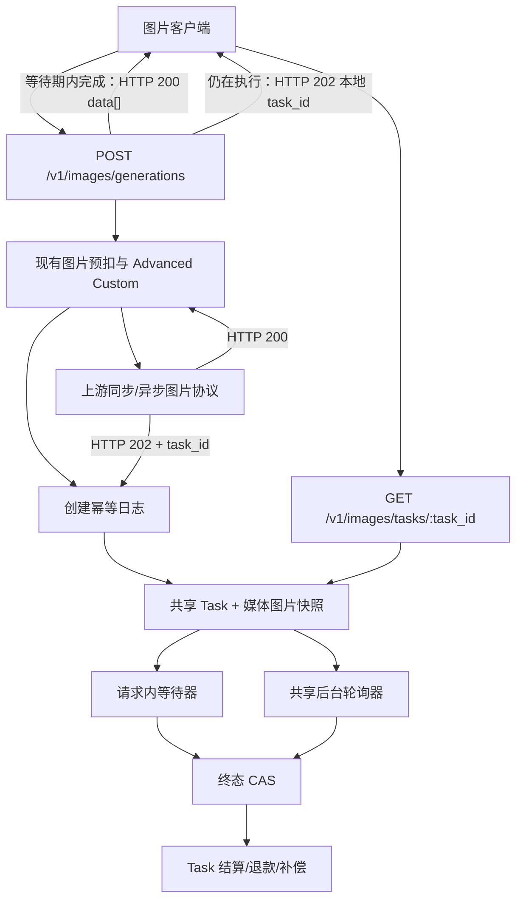

# 图片异步任务共享 Task 持久化闭环方案

## 1. 决策摘要

阶段 D 从“按需评估”调整为正式生产闭环的必需阶段。

实现继续遵守以下边界：

1. 北向继续以 `POST /v1/images/generations` 作为统一图片生成入口。
2. 南向继续由 Advanced Custom 的供应商无关策略 `media_task_image_blocking` 对接统一媒体任务协议。
3. 不新增图片专用任务表或第二套任务系统，复用现有 `Task`、后台轮询、终态 CAS、计费补偿和创建幂等日志。
4. 初始 HTTP 200 继续走现有同步图片链路；初始 HTTP 202 必须持久化后再等待，不再由单次 HTTP 请求独占任务生命周期。
5. 图片任务一旦被可靠持久化，计费责任从请求链路转移到 Task；客户端断开、请求超时和服务重启均不得触发重复创建或提前退款。
6. 请求等待窗口内完成时仍返回 OpenAI 图片 `data[]`；等待窗口结束但任务未终态时返回本地 HTTP 202 任务对象，并允许客户端查询最终结果。
7. 阶段 D 交付 usage 采集、持久化、安全预扣和冻结表达式结算框架；具体模型只有在真实 usage 与账单核验通过后才能启用精确 Token 结算，核验前继续使用管理员配置的固定 `ModelPrice`。

本方案只覆盖 `seedream-5-0-260128`、`doubao-seedream-4-5-251128` 和 `gemini-3.1-flash-image-preview-usage`，并继续只接受 `response_format=url`。固定尺寸价 `Gemini-3.1-Flash-Image-Preview` 和 `b64_json` 均不进入阶段 D。

本方案属于开发阶段设计。实施前应把确认后的北向 202 合同、共享 Task 媒体扩展和创建幂等边界抽取为 ADR，并更新 `docs/20-architecture/`。

## 2. 阶段 C 收口结论

本项目当前不接入“同一模型按 1K、2K、4K 固定价格分别收费”的版本，也不把 `b64_json` 纳入当前生产合同，北向仅支持：

```text
response_format=url
```

因此阶段 C 不再保留独立开发项：

- Seedream 5.0 按张固定价格由系统 `ModelPrice` 配置。
- 请求数量通过 `OtherRatios["n"]` 参与预扣。
- 最终按实际 OpenAI `data[]` 数量修正结算。
- 不新增 Seedream 专用价格常量、尺寸倍率或供应商价格表。
- 不支持的固定尺寸计价模型不进入当前渠道模型列表。

但必须区分两种业务计费合同：

### 2.1 本站固定销售价

如果 `gemini-3.1-flash-image-preview-usage` 在本站仍按管理员配置的固定 `ModelPrice` 销售，现有固定价与图片数量结算能力已经足够。

### 2.2 按上游真实 Token 精确结算

如果该 usage 模型需要按上游实际文本输入、图片输入和图片输出 Token 精确结算，当前异步合成响应尚未保留 usage，不能宣称端到端计费已经完成。

这不是“尺寸感知价格”问题，而是异步 Task 的实际 usage 采集、持久化和结算问题。本方案把它纳入阶段 D 的任务结算合同，不再作为独立阶段 C。

## 3. 闭环定义

本方案所称“闭环”包含三层。

### 3.1 执行闭环

- 上游任务 ID 不因客户端断开或进程重启而丢失。
- 在途任务使用创建时冻结的渠道、协议、Base URL、查询路径、代理、Key 和模型映射。
- 任何轮询错误、超时或重启都不得重新提交创建请求。
- 未知状态失败关闭，不猜测成功。

### 3.2 资金闭环

- 上游创建前失败由请求链路退款。
- 上游任务持久化后由 Task 独占结算或退款责任。
- 成功按实际图片数量或可信实际 Token 结算。
- 失败、取消或任务生命周期过期退款。
- 终态和计费分别具备幂等状态；计费失败进入现有补偿扫描。
- 不允许请求退款和 Task 退款同时发生。

### 3.3 用户结果闭环

- 请求等待期间完成时返回标准 OpenAI 图片 `data[]`。
- 等待期结束时返回可查询的本地任务 ID，而不是丢失任务。
- 客户端可查询任务状态和最终图片结果。
- 使用相同幂等键重放创建请求时，返回原任务或原结果，不重新创建上游任务。

只完成内部持久化可以解决执行和资金闭环，但不能解决客户端断开后的结果获取。完整阶段 D 必须包含北向任务查询合同。

## 4. 当前能力与缺口

### 4.1 可以直接复用

现有系统已经具备：

- `Task` 持久化表及公开任务 ID。
- `Task.private_data` 敏感执行快照。
- `TaskCreateIdempotency` 创建幂等日志和上游成功恢复快照。
- `TaskStatus` 活跃态、成功、失败、取消和过期状态。
- `UpdateWithStatus` 终态 CAS。
- 后台 `async_task_poll` 系统任务。
- 失败退款、成功差额结算和计费补偿。
- `BillingState` 可索引投影。
- SQLite、MySQL 和 PostgreSQL 通用的 GORM 更新路径。

### 4.2 不能直接把图片伪装成视频

现有共享 Task 的部分合同仍偏视频：

- `relaycommon.TaskInfo` 只有单个 `Url`。
- `TaskPrivateData.ResultURL` 只有单个结果。
- 查询快照字段命名为 `VideoUpstream*`。
- 轮询成功路径会把空 URL回退为视频代理地址。
- 任务结算主要使用 `CompletionTokens` 或 `TotalTokens`，无法表达图片输入/输出 Token 组件。
- `PerCallBilling=true` 会直接跳过终态差额结算，不适合“按预扣 `n`、按实际图片数结算”的图片任务。

因此“复用共享 Task”是复用状态机、持久层、轮询调度、CAS 和计费补偿，不是把图片数据强塞入视频字段。

## 5. 目标架构



请求内等待器和后台轮询器可以并发查询同一个上游任务，但只有终态 CAS 胜出者能够推进结算或退款。重复 GET 可以接受，重复创建和重复资金调整不可接受。

## 6. 北向合同

### 6.1 创建接口保持统一

继续使用：

```text
POST /v1/images/generations
```

处理结果分为：

| 场景 | 北向结果 |
|---|---|
| 上游同步 HTTP 200 | 现有 OpenAI 图片 HTTP 200 |
| 上游 202，等待期内成功 | OpenAI 图片 HTTP 200 |
| 上游 202，等待期内失败 | 稳定错误；Task 负责退款 |
| 上游 202，等待期结束仍运行 | HTTP 202 本地任务对象 |
| 客户端主动要求异步 | 持久化完成后立即返回 HTTP 202 |

客户端可使用：

```text
Prefer: respond-async
```

显式要求异步返回。未提供该首部时，系统继续按当前请求上下文、`RELAY_TIMEOUT` 和 5 分钟请求等待上限等待；等待上限不是 Task 生命周期上限。

`Prefer: respond-async` 只改变上游返回 HTTP 202 后的本站等待行为。如果上游已经同步返回 HTTP 200，结果已经可用，本站忽略该首部并直接返回现有 OpenAI 图片 HTTP 200。

### 6.2 HTTP 202 任务对象

建议响应：

```json
{
  "id": "task_xxx",
  "object": "image.generation.task",
  "status": "queued",
  "created_at": 1785139200,
  "model": "seedream-5-0-260128"
}
```

响应头：

```text
Location: /v1/images/tasks/task_xxx
Retry-After: 2
X-Task-ID: task_xxx
```

该 202 是本站本地任务，不透传上游真实任务 ID。

### 6.3 查询接口

新增供应商无关的薄北向接口：

```text
GET /v1/images/tasks/:task_id
```

状态映射：

| 内部状态 | 北向状态 |
|---|---|
| `NOT_START`、`SUBMITTED`、`QUEUED` | `queued` |
| `IN_PROGRESS` | `in_progress` |
| `SUCCESS` | `completed` |
| `FAILURE`、`CANCELLED`、`EXPIRED` | `failed` |
| `UNKNOWN` | `unknown` |

成功响应：

```json
{
  "id": "task_xxx",
  "object": "image.generation.task",
  "status": "completed",
  "created_at": 1785139200,
  "completed_at": 1785139235,
  "model": "seedream-5-0-260128",
  "result": {
    "created": 1785139235,
    "data": [
      {
        "url": "https://resource.example/image-0.png"
      }
    ]
  }
}
```

失败响应只返回脱敏错误，不暴露上游任务 ID、Key、Base URL、原始响应和内部计费状态。

查询必须同时校验：

- 当前认证用户是任务所有者，或当前用户具备管理员权限。
- `client_protocol=openai_images`。
- 任务未被客户端删除或隐藏。

### 6.4 创建幂等

支持客户端传入：

```text
Idempotency-Key: <opaque value>
```

幂等作用域：

```text
user_id + client_protocol + key_hash
```

请求体使用安全规范化后的哈希进行冲突检查。相同幂等键：

- 请求体相同：返回已有任务状态或最终结果。
- 请求体不同：返回 HTTP 409。
- 已记录上游成功但 Task 插入失败：从创建恢复快照补写 Task，不再请求上游。
- 状态为 `unknown`：禁止自动重新创建，进入恢复或人工对账。

严格的“客户端断开后仍可找回任务”要求客户端提供幂等键。没有幂等键时，系统仍保证内部执行和资金闭环，但客户端如果在收到本地任务 ID 前断开，无法凭空恢复任务引用。

异步图片调用应在 API 文档和 SDK 中把 `Idempotency-Key` 标记为强烈建议，并保证一次业务生成的网络重试复用同一个键。本站不默认按 prompt 或请求体哈希做隐式短时去重，因为用户可能有意使用完全相同的参数连续生成不同的随机结果；无显式幂等键的第二次 POST 仍被视为一次新创建。

## 7. 南向创建与持久化顺序

### 7.1 初始 HTTP 200

保持现有最小路径：

1. 上游返回 HTTP 200。
2. 现有 OpenAI 图片响应处理读取 `data[]` 和可选 usage。
3. 请求链路按现有逻辑结算。
4. 不创建长期异步 Task。

如果后续要求所有同步图片请求也具备创建幂等重放，再单独扩展同步结果缓存；阶段 D 首先解决上游 202 生命周期。

### 7.2 初始 HTTP 202

取得并验证上游 `task_id` 后必须按以下顺序处理：

1. 生成本地公开 `task_xxx`。
2. 构造完整 Task 和私有执行/计费快照。
3. 把“上游已成功创建”的恢复快照写入 `TaskCreateIdempotency`。
4. 在同一恢复合同下插入 Task，并把幂等日志推进为 `complete`。
5. 只有第 3 步成功后，才把计费责任标记为已转移给 Task。
6. 启动请求内等待；后台轮询器同时具备接管能力。

如果第 3 步失败：

- 不得把任务当作未创建后自动重提。
- 请求返回 `creation_persistence_failed`。
- 保留上游请求 ID和已脱敏任务 ID日志，进入管理员对账。
- 是否立即退款取决于是否能确认上游未计费；不能确认时不得伪装成完整闭环。

### 7.3 创建结果不确定窗口

以下窗口无法仅靠本地数据库严格消除：

```text
上游已经接受任务
→ 网络断开或进程崩溃
→ 本地尚未取得 task_id
```

要对该窗口提供严格 exactly-once 保证，上游至少需要支持一项：

- 客户端提供的幂等键；
- 按请求 ID 查询创建结果；
- 携带本地关联 ID 的可信回调。

TokenSave / Moxing 的公开文档目前没有形成经验证的创建幂等合同。实施阶段 D 前必须用真实渠道确认。

如果上游不支持上述能力，本系统的明确保证边界为：

> 取得并持久化上游 `task_id` 后执行、资金和结果全闭环；创建结果不确定时禁止自动重提，记录为 `UNKNOWN` 并进入管理员对账。

不得用“失败后重新 POST”掩盖这个协议边界。

## 8. 共享 Task 数据合同

### 8.1 复用现有表

继续使用现有 `tasks` 表及索引：

- `task_id`
- `platform`
- `user_id`
- `channel_id`
- `status`
- `client_protocol`
- `billing_state`

首期不新增数据库列和迁移。图片新增事实放入 `private_data` 的嵌套 JSON，对 SQLite、MySQL 和 PostgreSQL 保持同一序列化语义。

新增供应商无关常量：

```text
TaskPlatformMediaImage = "media_image"
TaskClientProtocolOpenAIImages = "openai_images"
TaskActionImageGeneration = "image_generation"
```

### 8.2 图片私有快照

在 `TaskPrivateData` 中增加单个嵌套字段：

```go
MediaImage *TaskMediaImagePrivateData `json:"media_image,omitempty"`
```

建议结构：

```go
type TaskMediaImagePrivateData struct {
    UpstreamProfile      string
    QueryBaseURL         string
    QueryPathTemplate    string
    Proxy                string
    ResponseFormat       string
    RequestedImageCount uint
    ResultURLs           []string
    CreateRequestID      string
    LastPollRequestID    string
    Usage                *dto.Usage
}
```

继续复用现有通用字段：

- `Key`
- `UpstreamTaskID`
- `BillingSource`
- `SubscriptionId`
- `TokenId`
- `NodeName`
- `BillingContext`
- `AsyncBilling`

不得复用 `VideoUpstream*` 和单个 `ResultURL` 表达图片事实。

### 8.3 不落库的数据

- API Key 之外的完整鉴权头。
- Cookie。
- 原始 prompt。
- 原始参考图内容。
- base64 图片。
- 用户提供的回调地址。
- 完整上游响应体。

现有 `TaskPrivateData.Key` 仍需保存创建时实际选中的单个 Key，数据库和备份按凭证敏感级别保护。

## 9. 轮询与并发控制

### 9.1 共享调度，图片专用薄适配

继续由现有 `async_task_poll` 系统任务触发轮询。在平台分发处增加唯一窄分支：

```text
media_image → UpdateMediaImageTasks
```

图片轮询适配器负责：

- 从 Task 快照构造查询 URL。
- 使用冻结的 Key 和代理。
- 解析 `queued/running/succeeded/failed`。
- 提取多个 URL。
- 提取可信 usage。
- 转换脱敏错误。

现有视频适配器和视频结果投影不修改。

### 9.2 请求内等待与后台接管

请求内等待器继续使用 1 秒起步、最大 5 秒的退避，以维持同步调用体验。后台轮询使用现有系统任务周期。

两者都调用同一组“查询并尝试推进 Task”的服务函数：

```text
PollMediaImageTaskOnce(task_id)
```

允许发生重复 GET，但必须保证：

- 不重复 POST。
- 非终态进度更新使用状态条件更新。
- 终态使用 `UpdateWithStatus(fromStatus)`。
- 只有终态 CAS 胜出者触发首次结算或退款。
- 计费状态机和补偿器继续保证资金调整最终幂等。

当前后台轮询周期为 15 秒，请求内等待器稳定后约每 5 秒查询一次；等待窗口内会有少量重复 GET，但不会重复 POST 或资金调整。现阶段不引入跨实例“活跃等待器租约”或隐式查询缓存，以免客户端断开后阻碍后台接管。上线后监控查询量、429 和上游是否按查询计费；只有出现实际限频或成本证据时，再增加带 TTL、可故障接管的轮询租约。

### 9.3 生命周期超时

区分两个超时：

| 超时 | 含义 | 后果 |
|---|---|---|
| 请求等待上限 | HTTP 客户端最多同步等待多久 | 返回本地 202，Task 继续 |
| `TASK_TIMEOUT_MINUTES` | 持久化任务最长生命周期 | 推进 `EXPIRED/FAILURE` 并退款 |

请求等待结束绝不等于任务失败。

媒体图片任务对 `TASK_TIMEOUT_MINUTES` 应用 30 分钟保护性下限：即使运维把全局值配置得更小，`media_image` 任务也不会在创建后 30 分钟内被超时清理；其他任务仍遵守原全局配置。生产配置仍应大于 `max（请求等待上限，上游真实 P99/SLA）+ 安全余量`，推荐保持默认 1440 分钟。`TASK_TIMEOUT_MINUTES=0` 继续表示禁用生命周期超时。

## 10. 计费责任转移

### 10.1 转移门槛

只有在“上游成功创建恢复快照”已经可靠写入后，才设置：

```text
BillingTransferredToTask = true
```

该标记只存在于本次请求的 `RelayInfo`，用于两个窄门禁：

1. 请求返回错误时，Controller 不执行原有请求级退款。
2. 请求内等到成功并返回 OpenAI `data[]` 时，图片主链路不再执行请求级 `PostTextConsumeQuota`。

Task 创建失败或上游明确拒绝创建时不设置该标记，继续使用现有请求退款。

### 10.2 固定按张计费

Task 冻结以下合同：

- `ModelPrice`
- 分组倍率
- 请求 `n`
- 预扣额度

终态成功时：

```text
实际额度 =
冻结的单张 ModelPrice
× 实际结果图片数
× 冻结的分组倍率
```

实际图片数必须：

- 大于 0。
- 不超过 `dto.MaxImageN`。
- 不超过创建时冻结的请求 `n`。
- 来自去重后的有效结果。

南向转换已保证 `extra.sequential_image_generation_options.max_images <= n`，但不能假设上游永远遵守请求。若去重后的上游结果数仍大于 `n`，视为上游协议违规：异步 Task 失败关闭并退款；同步 HTTP 200 在写出响应前拒绝该结果并走请求退款。两条路径都不返回或结算超发图片，避免因上游超发向用户补扣。正常异步结果少于 `n` 时，Task 按实际结果数退还差额。不得设置会跳过终态调整的旧 `PerCallBilling=true` 语义。

### 10.3 按真实 Token 计费

精确 usage 模型需要把当前任务结果扩展为：

```go
type TaskInfo struct {
    // 保留现有字段
    ResultURLs []string
    Usage      *dto.Usage
}
```

实际 usage 至少区分：

- 文本输入 Token。
- 图片输入 Token。
- 图片输出 Token。
- 总 Token。

结算使用创建时冻结的 billing expression 和请求探针，不读取管理员当前价格。表达式继续由现有 billingexpr 执行，不在图片适配器中写价格常量。

只有满足以下条件才允许启用精确 Token 结算：

1. 真实上游任务查询响应稳定返回 usage。
2. 字段语义通过真实账单核对。
3. 预扣能够根据请求 `size`、`n` 和参考图数量得到安全上界。
4. 终态 usage 缺失时有明确的失败关闭策略。

如果上游 usage 缺失或未经验证：

- 不得用图片数量或尺寸臆测 Token。
- 不得把 `TotalTokens=1` 当作真实结算。
- 应改用本站固定 `ModelPrice`，或者暂不开放该计费模型。

### 10.4 计费补偿

继续复用：

- `TaskBillingStatePending`
- `TaskBillingStateSettled`
- `TaskBillingStateFailed`
- `TaskBillingStateDebt`
- `ReconcileTaskBilling`

任务业务终态和资金终态分离。业务成功后即使首次计费写入失败，也保持 `SUCCESS`，由补偿器重试冻结的目标额度。

## 11. HTTP 202 的主链路接线

通用 `ImageHelper` 当前会在 `DoResponse` 前拒绝非 200，因此不能让本地持久化任务 202 走普通响应转换。

最小修改方式是在通用图片状态码门禁之前增加一处窄调用：

```text
TryHandlePersistedImageTaskResponse
```

该函数只识别本站内部构造并带有不可伪造内存标记的持久化图片任务响应：

- 写出 HTTP 202 任务 DTO。
- 不调用上游错误解析。
- 不进行请求级结算。
- 返回后由 Task 继续持有计费责任。

不得仅依靠用户可伪造的 HTTP Header 判断内部响应。内部标记应保存在 `RelayInfo` 或专用响应包装类型中。

## 12. 文件组织与最小入侵

### 12.1 建议新增文件

```text
dto/image_task.go
model/task_media_image.go
service/media_image_task_lifecycle.go
service/media_image_task_billing.go
service/task_polling_media_image.go
controller/image_task.go
relay/channel/advancedcustom/media_task_image_persistent.go
```

对应测试放在同目录独立测试文件。

### 12.2 现有文件窄修改

1. `model/task.go`
   - `TaskPrivateData` 增加一个 `MediaImage` 嵌套字段。

2. `relay/common/relay_info.go`
   - 为 Task 查询结果增加可选图片结果和完整 usage。
   - 为当前请求增加计费已转移标记。

3. `relay/image_handler.go`
   - 状态码门禁前增加持久化图片 202 的单行处理。
   - Task 接管计费后跳过请求级结算。

4. `controller/relay.go`
   - Task 接管计费后跳过请求级失败退款。

5. `service/task_polling.go`
   - 平台分发增加 `media_image` 窄分支。

6. `relay/channel/advancedcustom/adaptor.go`
   - 现有 `media_task_image_blocking` 策略内部切换为持久化执行；不增加供应商常量。

7. `router/relay-router.go`
   - 增加图片任务查询路由。

不修改：

- `service/relayconvert/request_registry.go`
- 数据库 Task 表结构和迁移
- 视频北向 DTO
- 视频结果投影
- 其他渠道类型
- 全局 `ImageRequest.MarshalJSON`

## 13. 安全要求

- 继续忽略上游绝对 `poll_url`。
- 查询地址只使用冻结 Base URL、路径模板和经过校验的上游任务 ID。
- 用户只能查询自己的图片任务。
- 公开响应只使用本地 `task_xxx`。
- 上游 Key、任务 ID和请求 ID仅位于私有快照或管理员日志。
- 创建幂等键只保存哈希。
- 原始 prompt、参考图内容和 base64 不进入 Task、幂等日志或普通日志。
- usage 和图片数量在进入计费前必须完成非负与上限校验。
- 所有额度计算继续使用 `common.Quota*Checked` 系列方法，并把饱和标记写入管理员日志。
- 如果以后启用上游回调，必须使用本站生成的不可预测关联令牌和签名验证，不接受用户 callback URL。

## 14. 错误与退款矩阵

| 失败点 | 是否已有上游任务 | 责任主体 | 行为 |
|---|---:|---|---|
| 参数校验失败 | 否 | 请求 | HTTP 400，不预扣或退款 |
| 渠道选择/模型映射失败 | 否 | 请求 | 请求退款 |
| 上游明确 4xx 拒绝 | 否 | 请求 | 请求退款 |
| 创建网络结果不确定 | 可能 | 创建幂等状态 | 标记 `UNKNOWN`，禁止重提 |
| 已取得 task_id，但恢复日志写入失败 | 是 | 对账 | 禁止重提，不宣称已闭环 |
| Task 已持久化，客户端断开 | 是 | Task | 继续轮询，不退款 |
| 查询暂时网络错误 | 是 | Task | 保持活跃，下周期重试 |
| 上游任务失败 | 是 | Task | 终态 CAS，退款一次 |
| Task 生命周期过期 | 是 | Task | 标记过期，退款一次 |
| 上游成功，结果数不超过 `n` | 是 | Task | 按实际图片数或经验证 usage 结算 |
| 上游成功，但结果数超过 `n` | 是 | Task | 按协议违规失败关闭并退款，记录管理员告警 |
| 计费写入失败 | 已终态 | 补偿器 | 保持待补偿，幂等重试 |

## 15. 实施阶段

### D0：协议和 ADR

- 用真实 Key 获取三个目标模型的 200、202、查询成功和失败样本，并为 usage 模型单独取得 usage 样本。
- 确认上游是否支持创建幂等、请求 ID查询或可信回调。
- 明确 HTTP 202 和图片任务查询北向合同。
- 新增 ADR，确认共享 Task 媒体扩展和计费责任转移。

### D1：共享数据与计费状态

- 增加图片 Task 私有快照和北向 DTO。
- 增加 `openai_images` client protocol。
- 冻结渠道、Key、模型与计费合同。
- 实现请求计费向 Task 的单向转移。
- 实现固定按张的实际数量结算。

### D2：持久化执行

- 初始 202 写创建恢复日志和 Task。
- 请求内等待改为读取并推进持久化 Task。
- 后台轮询增加 `media_image` 分支。
- 实现服务重启和客户端断开后的继续轮询。

### D3：北向恢复

- 实现 HTTP 202 本地任务响应。
- 实现 `GET /v1/images/tasks/:task_id`。
- 复用创建幂等日志支持相同请求重放。
- 完成所有权、敏感信息和错误投影测试。

### D4：精确 usage 与上线

- 在真实账单验证通过后接入组件化图片 usage。
- 验证预扣上界和终态结算。
- 灰度启用持久化执行。
- 监控 202 比例、完成耗时、未知创建、晚成功、退款和计费补偿。

## 16. 验收标准

### 16.1 执行

- [ ] 初始 HTTP 200 行为不变。
- [ ] 初始 HTTP 202 在返回客户端前已经持久化本地任务。
- [ ] 客户端断开后任务继续完成。
- [ ] 服务重启后任务继续轮询。
- [ ] 取得上游任务 ID后任何错误都不会重新 POST。
- [ ] 渠道配置或 Key 修改不影响在途任务。
- [ ] 请求内等待和后台轮询并发时只有一个终态胜出者。

### 16.2 资金

- [ ] Task 接管后请求链路不退款、不重复结算。
- [ ] 固定按张任务按实际结果数量结算。
- [ ] 上游实际结果数超过请求 `n` 时失败关闭且不补扣用户。
- [ ] Token usage 模型只使用经账单验证的实际 usage。
- [ ] 失败和过期只退款一次。
- [ ] 成功结算失败能够由补偿器恢复。
- [ ] 计费目标使用创建时快照，不受管理员后续改价影响。

### 16.3 北向

- [ ] 等待期内成功仍返回 OpenAI `data[]`。
- [ ] 等待期结束返回本地 HTTP 202 和 `Location`。
- [ ] 用户可以查询自己的任务和最终结果。
- [ ] 用户不能查询他人的任务。
- [ ] 相同幂等键不会创建第二个上游任务。
- [ ] 相同幂等键配不同请求返回 HTTP 409。

### 16.4 安全与兼容

- [ ] 不暴露上游 task_id、Key、Base URL 和原始响应。
- [ ] 不落库 prompt、参考图内容或 base64。
- [ ] task_id、结果数量和 usage 均有上限。
- [ ] SQLite、MySQL 和 PostgreSQL 测试通过。
- [ ] 视频 Task 创建、轮询、结算和北向投影无回归。

## 17. 风险与明确边界

### 17.1 北向兼容

OpenAI Images 没有标准异步任务合同。HTTP 202 和查询接口是本站供应商中立扩展，必须在发布说明和 SDK 接入文档中明确。仍只接受 HTTP 200 的客户端可以继续使用等待期内完成的路径，但必须能正确处理长任务返回的非 200。

### 17.2 创建 exactly-once

本地幂等日志可以解决“已取得上游 task_id，但本地 Task 插入失败”的恢复问题，不能单独解决“上游已接受但响应丢失”。没有上游幂等或回调时，该窗口只能失败关闭和人工对账。

### 17.3 Token usage

系统拥有表达式计费能力不等于已经获得可信上游 usage。只有完成字段语义和真实账单核对后，才能把 usage 模型声明为精确 Token 结算。

因此阶段 D 的代码完成标准是“usage 采集与冻结结算框架可用”，不是“具体 usage 模型已经完成生产计费验收”。核验前不得为对应模型启用 `tiered_expr`，应继续使用固定 `ModelPrice`。

### 17.4 base64

`b64_json` 不属于本方案。未来支持时不得把大体积 base64 直接持久化到 Task JSON，应保存受控对象存储引用或使用专门的结果存储方案。

## 18. 最终结论

阶段 D 应实施，但必须作为“共享 Task 的图片能力扩展”推进，而不是继续扩大当前阻塞轮询函数，也不是建立图片专用异步系统。

最小且完整的落点是：

```text
现有图片入口
+ 现有 Advanced Custom 南向策略
+ 共享 Task 持久化
+ 创建幂等恢复日志
+ 图片专用薄轮询/结果投影
+ Task 计费责任
+ 本地 202 与查询接口
```

在这一边界下：

- 北向供应商无关。
- 南向协议显式。
- 视频和图片共享任务与资金状态机。
- 图片和视频保留各自独立的 DTO 与结果外壳。
- 上游晚成功、客户端断开和服务重启都能进入可查询、可结算、可补偿的闭环。

## 19. 实施结果

2026-07-27 已完成 D1-D3 及 D4 的代码基础：

- 新增 `media_image` platform、`openai_images` protocol、`image_generation` action 和 `private_data.media_image`，未新增数据库表或列。
- 上游初始 HTTP 200 保持现有同步图片合同；初始 HTTP 202 先写创建恢复日志和共享 Task，再进入请求内等待。
- 请求内等待结束仍未终态时返回本站 HTTP 202、`Location`、`Retry-After` 和本地任务对象；`GET /v1/images/tasks/:task_id` 只允许任务所有者或管理员读取。
- 后台 `async_task_poll` 增加唯一的 `media_image` 平台分支；请求等待器和后台轮询器通过 Task 状态 CAS 竞争终态，只有胜出者推进结算或退款。
- 为保证重启后只依赖冻结快照查询，持久化图片任务只使用 Advanced Custom 路由 `auth`（省略时为默认 Bearer）表达鉴权；该路径失败关闭渠道级或运行时 header override，避免在途任务依赖未冻结的完整请求头。
- 取得上游任务 ID 后，创建请求不再自动重试或请求级退款。Task 持久化成功后，计费责任单向转移到 Task。
- 固定 `ModelPrice` 按去重后的实际结果 URL 数量结算；同步或异步上游结果数超过请求 `n` 时均在返回前按协议违规失败关闭并退款，不向用户补扣超发图片。
- `media_image` 生命周期应用 30 分钟保护性下限，避免错误的较小 `TASK_TIMEOUT_MINUTES` 在最长 5 分钟请求等待期间误杀任务；其他任务仍使用原全局配置。
- `tiered_expr` 在创建前使用 `task_billing_setting.preconsume_tokens` 作为保守上界，并冻结不含 prompt、参考图或请求头的 `_task` 探针；终态 usage 通过非负和上限校验后使用冻结表达式结算。usage 缺失时保持安全预扣上界。
- `Idempotency-Key` 复用现有创建幂等日志；相同请求恢复已有 Task，不同请求返回冲突。同步 HTTP 200 暂不缓存结果，成功后释放幂等占位。
- 已增加持久化、结果投影、所有权/协议隔离、HTTP 202 内存标记、幂等重放、后台轮询、实际图片数量结算、超发失败关闭、生命周期下限、usage 上限和路由合同回归测试。
- 架构决策已沉淀为 [ADR-0006](../20-architecture/decisions/0006-media-image-shared-task-persistence.md)。

仍需上线前操作验收：

- 用真实 Key 验证三个目标模型的 HTTP 200/202、成功、失败和长任务样本。
- 确认上游是否提供创建幂等、按请求 ID恢复或可信回调，以界定“上游已接受但本地未取得任务 ID”的不可消除窗口。
- 用真实账单核对 usage 字段语义。核对通过前，不应为对应模型启用 `tiered_expr`；可继续使用本站固定 `ModelPrice`。
