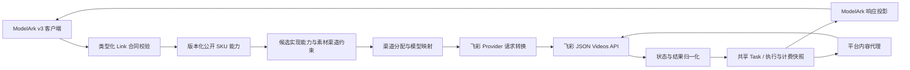

# 飞彩 Seedance 视频接口适配方案

> 2026-08-01 实测修订：原固定 `/content + Bearer` 是开发期本地假设，现已删除。omni 只支持
> adapter v2，从完成响应顶层读取经同源校验的 `video_url`，内容回源不发送 Bearer。
> 详细问题证据与实施顺序见
> [飞彩 Seedance 实测问题修复方案](./2026-08-01-飞彩Seedance实测问题修复方案.md)。
>
> 2026-08-02 范围决策：飞彩现有资料缺少真人认证、素材入库与引用、撤回清理及结果未知对账合同，
> 真人素材暂不接入，不进入当前实施与验收范围。

## 1. 结论

本方案不新增客户 API 合同路径或供应商私有字段，也不替代官方直连。Seedance Link 合同仍为 ModelArk v3
（火山引擎官方接口），其 Provider 主体是 `official` profile，对接火山引擎 Ark 官方直连；
`third_party_reverse_proxy`、`third_party_relay` 等第三方 profile 与之并列、共享同一客户端
合同（架构不变量：客户端 ModelArk 协议不限定 Provider 必须为 `official`）。飞彩只是在这个统一官方
Link 合同下新增一个第三方渠道 profile，作为 `official` 之外的补充渠道，而非替代。
`Idempotency-Key` 保持为平台推荐的可选扩展，不因命中飞彩渠道而变成必填字段；提供时继续
获得同键重放保护。

飞彩接口作为 `DoubaoVideo` 的新渠道 profile 接入，继续复用现有 ModelArk v3 Link 合同、共享
Task、渠道分配、模型映射、轮询、计费和审计链路。

本方案不恢复 OpenAI Videos/Sora 创建入口，不向客户端开放 `POST /v1/videos`，也不让客户端
使用飞彩私有字段。客户端继续调用：

```http
POST /api/v3/contents/generations/tasks
GET  /api/v3/contents/generations/tasks
GET  /api/v3/contents/generations/tasks/{task_id}
DELETE /api/v3/contents/generations/tasks/{task_id}
GET  /v1/videos/{task_id}/content
```

第一阶段只对接飞彩 AZHW 系列中请求合同已经明确的 5 个模型（选型依据见 2.4 节），并发布
纯文本、参考图、参考音频、首帧和首尾帧能力；AZHW 不支持参考视频。5 个模型共用同一套创建
请求合同，因此只新增一个供应商无关、完整可测试的 `video_upstream_profile`：

| profile | 适配的 Provider 请求合同 | 飞彩用途 |
| --- | --- | --- |
| `third_party_json_video_omni_reference` | 多图、多音频、派生参考模式（`input_images[]`、`audio_url_list[]`、`reference_mode`） | AZHW 系列模型 |

该 profile 对创建和查询复用统一 Bearer 鉴权；结果下载按 v2 使用响应中的同源 URL且不发送
Bearer。异步创建响应、五个精确状态值和内容下载合同集中校验。不得用模型名、Base URL 或 Key 格式在运行时推断 profile，也不得把
AZHW 模型与非 AZHW 协议放在同一渠道。

## 2. 背景与依据

### 2.1 上游共同特征

研究文档 `docs/70-research/XSeedance对接.md` 最初描述的上游共同特征为（其中固定内容端点假设
已被 2026-08-01 实测推翻）：

- Bearer Token；
- JSON 创建请求；
- `POST /v1/videos` 创建任务；
- `GET /v1/videos/{id}` 查询任务；
- `GET /v1/videos/{id}/content` 下载视频；
- 创建响应使用 `id`；
- 状态为 `queued`、`in_progress`、`completed`、`failed`；
- 完成响应可能在 `metadata.url` 提供结果提示，同时支持固定内容端点（未获实测支持）；
- 创建请求发生网络超时后不能无条件重发。

### 2.2 现有反向代理不能复用

现有 `third_party_reverse_proxy` 不能直接复用，原因包括：

- 它向上游发送 Ark `content[]` 请求，飞彩 AZHW 模型不接受该结构；
- 它不识别 `in_progress`；
- 它的创建请求与查询响应外壳不兼容 JSON video omni/reference 合同；
- 当前普通 `DoubaoVideo` 内容代理不执行飞彩 v2 的响应 URL 同源校验和无 Bearer 回源规则。

### 2.3 遗留 Sora adapter

遗留 Sora adapter 虽然在路径和响应状态上相近，但恢复 OpenAI Videos 创建违反现行产品合同，
并会重新引入宽松私有字段透传。因此只复用其中已经证明可靠的通用思路，不恢复其客户端路由。

### 2.4 模型选型与范围收敛

飞彩对外暴露的全部模型名义上都带 `seedance` 前缀，但按创建请求合同与渠道特征可归为三类：

| 类别 | 代表模型 | 创建请求合同特征 |
| --- | --- | --- |
| AZHW | `*-azhw-feicai` 系列 | `input_images[]` + `audio_url_list[]` + `reference_mode` |
| PI | `seedance-933-pro-pi-feicai` | 首图 `image_url` 与其余图 `reference_image_urls[]` 分字段，`seconds` 为字符串，支持参考视频 |
| SD2 | `seedance2.0-sd2-feicai` | 单张图片字符串 `image`，整数时长，无音频与视频 |

三类创建合同互不等价，不能据此推断它们使用相同或不同的基础模型。研究文档也明确警告：
`vip`、`933`、`fast`、`mini`、`pi`、`sd2` 只是渠道别名，不应解释为字节官方独立基础模型
版本。本方案仅依据可验证的请求合同、供应侧可用性标注以及待灰度的价格与质量样本收敛范围，
不对模型血缘、上游账号来源或实现方式作结论。

#### 2.4.1 纳入的 5 个模型

依据研究文档第 10 节的名称拆解与渠道标注，纳入模型如下：

| 真实上游模型 ID | 系列 | 分辨率 | 档位说明（名称拆解） | 渠道备注 | 适合场景与纳入理由 |
| --- | --- | --- | --- | --- | --- |
| `seedance-2.0-vip-720p-azhw-feicai` | vip | 720p | AZHW `vip` 渠道，标准 720p 档 | 供应侧标注稳定、偏贵 | 第一批内部灰度；请求合同明确，实际稳定性与画质仍以验收数据为准 |
| `seedance-2.0-vip-1080p-azhw-feicai` | vip | 1080p | 同一 `vip` 渠道的 1080p 档 | 供应侧标注稳定、偏贵 | 全高清样本验收通过后灰度 |
| `seedance-2.0-933-720p-azhw-feicai` | 933 | 720p | AZHW `933` 渠道的 720p 档，请求合同与 vip 一致 | 供应侧标注不算稳定但便宜 | 低成本验证、草稿；必须使用独立公开 SKU 与渠道灰度 |
| `seedance-2.0-933-1080p-azhw-feicai` | 933 | 1080p | AZHW `933` 渠道的 1080p 档 | 供应侧标注不算稳定但便宜 | 预算有限的全高清灰度 |
| `seedance-2.0-933-4k-azhw-feicai` | 933 | 4K | AZHW `933` 渠道的 4K 档 | 供应侧标注不算稳定但便宜 | 预算有限的 4K 尝试；生产使用前重点验收稳定性与画质 |

5 个模型除各自公开 SKU 固定的分辨率外，第一阶段能力一致：4–15 秒整数时长、六种画幅、
最多 9 张参考图、最多 3 段参考音频、不支持参考视频，并支持 `text_to_video`、
`first_frame`、`both_frames` 和 `omni` 四种由客户端角色派生的模式。飞彩协议声明支持真人
素材，适配层按同一媒体合同完成转换，但首期产品不宣传、不验收也不实际使用真人素材；完整
边界见 6.2 和 7.3 节。

**稳定性标签的证据边界。** 「稳定、偏贵」「不算稳定但便宜」仅来自供应侧经验标注，不是
SLA，也不能证明 `vip` 与 `933` 的模型血缘、账号来源或底层实现。`933` 只用于低成本验证与
草稿，灰度时独立观察失败率、超时、排队时间、画质样本和 `create_outcome_unknown`；在得到
可复现数据前，不宣称它与 `vip` 使用同一基础模型，也不推断其上游渠道来源。

#### 2.4.2 排除的模型及原因

| 排除项 | 类别 | 排除原因 |
| --- | --- | --- |
| `seedance2.0-sd2-feicai` | SD2 | 单图、无音频且请求合同不同；能力被 AZHW 覆盖，却会引入独立 `single_image` profile |
| `seedance-933-pro-pi-feicai` | PI | `seconds` 类型、图片字段和参考视频合同均不同；其图片与音频能力被 AZHW 覆盖，参考视频不足以抵消新增独立 `reference_split` profile 的实现与验收成本 |
| `seedance-2.0-vip-4k-azhw-feicai` | AZHW | 价格、真实输出细节和相对 1080p 的增益尚未完成独立样本验收 |
| `seedance-2.0-vip-720p-fast-azhw-feicai` | AZHW | 速度、质量和价格收益尚未完成独立样本验收 |
| `seedance-2.0-vip-720p-mini-azhw-feicai` | AZHW | 质量和价格收益尚未完成独立样本验收 |

排除项若未来经样本验收证明能力、质量、价格和运行稳定性满足产品要求，可在后续合同版本重新
评估接入，届时可能需要重新引入对应 profile。

#### 2.4.3 连带的架构简化

因为只对接单一创建合同，本方案相对初稿收敛为：

- 只新增一个 `video_upstream_profile`：`third_party_json_video_omni_reference`；
- 只实现一套 Provider converter、一套能力判断和一组转换测试；
- 不再登记 `reference_split`（PI）与 `single_image`（SD2）profile，不编写其转换、能力判断
  与测试；
- 渠道按稳定性与价格分层（`vip`、`933`）拆分，但共用同一 profile 与转换逻辑。

该收敛降低实现面积、冲突面与计费风险，是本方案相对原始三 profile 草案的主要变更。

## 3. 目标与非目标

### 3.1 目标

- 让 ModelArk v3 客户端通过独立公开 SKU 使用飞彩 AZHW 系列的文本、图片和音频参考能力；
- 飞彩路径、鉴权、字段和真实模型 ID 只存在于渠道配置、Provider converter 和任务私有快照；
- 该 profile 完整覆盖创建、查询、错误、结果和内容下载，并为 ModelArk 列表与 DELETE 提供
  确定的本地投影或能力不支持响应；
- 请求在选渠前和发送前都执行确定性能力校验；
- 模糊创建结果不自动重发，避免重复生成和重复上游费用；
- 成功、失败、超时、内容下载和计费均可审计、可灰度、可回滚。

### 3.2 非目标

- 不恢复 `POST /v1/videos`、Remix 或 OpenAI/Sora 视频模型；
- 不新增飞彩专用渠道类型、Provider 服务、Key 池、Task 表或 worker；
- 不把飞彩私有字段加入 ModelArk 客户端 DTO；
- 不通过 `metadata`、`extra` 或任意 JSON map 透传供应商参数；
- 不伪造飞彩上游未声明的取消、删除、回调或任务列表能力；ModelArk 客户端列表和 DELETE 的
  本地投影与不支持语义按 5.5 节保持完整；
- 不根据本文猜测价格、usage 或供应商账单语义；
- 第一阶段不接入 PI（`reference_split`）、SD2（`single_image`）类模型，也不接入 `vip-4k`、
  `vip-fast`、`vip-mini`（见 2.4.2）；
- 第一阶段开放普通图片与音频素材，但不支持参考视频和平台 `asset://`；
- 飞彩真人素材暂不接入；普通 URL/Data URL 字段的技术透传不计为真人能力，也不作为产品宣传、验收或实际业务使用。

## 4. 总体架构



保持以下不变量：

1. `contract_id` 仍为 `modelark.contents.generations.v3`。
2. `video_upstream_profile` 是唯一渠道适配协议选择变量；本阶段新增取值为
   `third_party_json_video_omni_reference`。
3. 公开模型名负责产品合同和计费，上游模型名只负责模型映射。
4. `VideoSKUCapability` 是字段值域、规范化、媒体组合和生命周期的客户端权威；profile 只声明
   自己是否完整实现，不反向决定客户端能力。
5. 创建时选中的 SKU 能力版本、生命周期能力、profile、Base URL、查询路径、proxy、单个 Key
   和上游任务 ID 继续冻结到
   `Task.private_data`。
6. 查询、内容下载和终态结算只使用冻结快照，不读取渠道修改后的连接事实。

## 5. 渠道适配协议定义

### 5.1 公共传输合同

该 profile 共享以下传输合同：

```text
鉴权：Authorization: Bearer <selected-channel-key>
请求：Content-Type: application/json
创建：POST <base_url><video_upstream_create_path>
查询：GET  <base_url><video_upstream_query_path_template>
```

建议渠道配置：

```text
base_url:                           <研究文档中的 API 根地址，去掉末尾 /v1>
video_upstream_create_path:         /v1/videos
video_upstream_query_path_template: /v1/videos/{task_id}
allow_service_tier:                 false
asset_upstream_profile:             none
```

Base URL、路径和查询模板继续复用现有第三方视频 URL 校验入口，但该 profile 额外要求：

- Base URL 必须使用 HTTPS，禁止 userinfo、query 和 fragment；
- Base URL 可以包含路径前缀，创建、查询和内容地址均通过同一规范化 join 规则拼接；
- 任务 ID 替换前必须 `url.PathEscape`；
- 保存配置时即完成上述校验，不能等到创建或内容下载时才发现不安全地址。

### 5.2 公共创建响应

创建响应至少必须包含非空字符串 `id`。以下字段只作为经过校验的上游快照保存，不作为创建
成功的必要条件：

- `object`；
- `status`；
- `model`；
- `created_at`；
- `progress`；
- `seconds`；
- `size`。

创建响应的处理必须遵循第 8 节的 retry disposition：只有登记并验证为未创建的拒绝才是明确
失败；请求已经发送后的 429、5xx、无效 2xx JSON 或缺失 `id` 均进入
`create_outcome_unknown`。不得从错误消息、Location 或其他未定义字段猜测任务 ID。

### 5.3 公共查询响应

只接受以下状态：

| 上游状态 | 内部状态 | 动作 |
| --- | --- | --- |
| `queued` | `QUEUED` | 继续轮询 |
| `in_progress` | `IN_PROGRESS` | 继续轮询 |
| `processing` | `IN_PROGRESS` | 经实测确认的精确别名，继续轮询 |
| `completed` | 条件映射 | 结果校验通过后 `SUCCESS` 并结算；不可采信时进入对账 |
| `failed` | `FAILURE` | 保存脱敏错误并退款 |

未知、空白或大小写变体状态均 fail closed，不默认视为处理中。

`completed` 的权威交付地址由唯一的
`54:third_party_json_video_omni_reference:v2` 合同决定：响应顶层 `video_url` 必须是长度
  受控、无 userinfo 的绝对 HTTPS URL，且规范化 scheme、host、port 与冻结 Base URL 同源；
- 校验失败时进入 `reconciliation_required`，不得静默回退固定路径；
- 通过 v2 校验的地址只保存到 `Task.private_data.result_url`，不直接向客户端投影。

`metadata.url` 不属于 v2 合同，decoder 忽略该字段；不得用于构造平台内容地址、推进成功、计费、
审计或凭据转发。

若未来需要把跨域 CDN 或 `metadata.url` 作为回源地址，必须新增经过安全评审的 adapter
version、profile 或受控 origin 配置，不能放宽 v2 的同源合同，也不能在本 profile 内静默回退。

上游 2xx 查询响应出现未知或空白状态、无效 JSON、任务 ID 不匹配，或无法取得冻结版本要求的
安全结果地址时，normalizer 返回类型化 `upstream_contract_violation`，轮询服务将任务推进为
内部 `reconciliation_required`、保持计费 `pending` 并触发管理员告警。该响应只能证明本次
查询不可采信，不能直接证明业务任务失败或执行退款。后续恢复合法响应时继续正常状态机；只有
上游明确 `failed` 才进入 `FAILURE`。超过公开任务生命周期仍无法核实时，按 SLA 进入
`EXPIRED` 并退款，同时记录 `upstream_outcome_unresolved`，但不得描述成已证明上游失败。
查询阶段的网络错误、429 和 5xx 属于安全可重试的 GET 失败，保持任务原状态并使用现有退避。

`failed` 只保留经过长度限制和脱敏的 `error.code`、`error.message`。不得把完整上游响应、
请求体、素材 Data URL 或 Key 写入普通日志。

### 5.4 内容下载

平台仍向客户端返回：

```text
/v1/videos/{public_task_id}/content
```

回源时，飞彩 profile 不直接信任客户端可见 URL，只使用经过同源 HTTPS 校验的
`private_data.result_url`，不发送 Authorization；保存到普通
  Task `data` 时必须递归脱敏 `url`/`*_url`，避免签名 URL 进入用户响应或普通日志。

内容代理必须保留现有：

- 用户与任务所有权校验；
- SSRF 防护；
- `Range` 请求转发；
- 安全响应头白名单；
- 60 秒读取超时；
- Key 和上游错误脱敏。

所有重定向继续逐跳执行 SSRF 校验。v2 不支持跨域回源，也不把 Bearer Token 转发到响应 URL；
本地 Fake-IP 命中 `198.18.0.0/15` 时修正本地 DNS/代理规则，不放宽网关 SSRF 防护。

### 5.5 ModelArk 生命周期投影

飞彩没有声明任务列表、取消或删除接口，不为满足客户端外壳而猜测 Provider 调用。现有 ModelArk
生命周期继续按任务创建时冻结的合同投影：

- `GET /api/v3/contents/generations/tasks` 读取当前用户最近七天的本地 Task，不调用飞彩列表；
- `GET /api/v3/contents/generations/tasks/{task_id}` 使用冻结连接轮询飞彩，再投影为 ModelArk
  状态、错误、usage 和平台内容地址；
- `DELETE` 遇到飞彩排队任务时，在调用上游前返回确定的
  `409 cancellation_unsupported`，不得进入 `cancellation_unknown` 或伪装取消成功；
- `DELETE` 遇到飞彩运行中任务时继续返回现有 `409 task_running`；
- `DELETE` 遇到飞彩终态任务时返回确定的 `409 delete_unsupported`，不得只隐藏本地 Task 后
  声称上游结果已删除；
- 内容下载能力保持支持，并使用 5.4 节冻结的连接事实。

上述 ModelArk 错误必须统一通过既有 `modelArkVideoError` 投影，保持 `error.code`、
`error.message`、`error.request_id` 信封不变。生命周期能力检查在任何 Provider 调用前完成；
确定不支持时不得调用飞彩。`cancellation_unknown` 只用于“已支持并实际发出取消请求，但结果
未知”，不能用于飞彩的确定不支持场景。

`TaskLifecycleCapabilities` 对该 profile 必须显式声明 `SupportsContent=true`、
`SupportsCancelQueued=false`、`SupportsDeleteTerminal=false`。不支持的生命周期动作是公开
SKU 的稳定能力边界，与本次随机选中的渠道无关；同一公开 SKU 的其他候选渠道也必须保持等价。

实现时新增版本化 `VideoSKUCapability` 作为上述生命周期及请求能力的客户端权威。Ability
发布时拒绝绑定生命周期或媒体能力不等价的候选；运行时在应用素材交集前再次排除不完整实现，
adapter 发送前按冻结版本复检。不得依靠运维约定让 official 与飞彩在同一 SKU 下提供不同
DELETE 结果。

Link 合同层在规范化和枚举 Ability 前捕获一次不可变的
`resolved_sku_capability(version + hash)`。候选过滤、素材交集、分发、发送前复检和
`prepared` 快照全部使用该值；处理中途管理员升级 SKU 能力只影响后续新请求。

## 6. ModelArk 到 profile 的转换

### 6.1 公共转换规则

- 使用模型映射后的 `info.UpstreamModelName`，不从请求或 URL 猜测真实模型；
- 按 `content[]` 原顺序连接所有文本项，项之间使用换行；
- 至少需要一个非空文本项；
- 媒体 URL 在每次 Provider 尝试前完成必要的类型化校验；第一阶段直接 URL/Data URL 由 converter
  使用，`asset://` 因没有兼容 binding 被渠道约束排除；
- 可选标量必须使用指针加 `omitempty`，保留显式 `0`、`false` 与字段缺失的差异；
- converter 只读取类型化 `ModelArkVideoCreateRequest`，不读取原始任意 map；
- 转换后的 JSON 只能包含目标 profile 定义的字段。

以下 ModelArk 字段在第一阶段不支持，显式出现时返回 `unsupported_parameter`：

- `callback_url`；
- `service_tier`；
- `watermark`；
- `return_last_frame`；
- `execution_expires_after`；
- `draft`；
- `tools`；
- `safety_identifier`；
- `priority`；
- `frames`；
- `seed`；
- `camera_fixed`。

`generate_audio` 省略或显式 `false` 都规范化为关闭，不发送飞彩私有字段；显式 `true`
返回 `unsupported_parameter`。所有规范化由公开 SKU 能力定义，规范化后的同一值同时用于
选渠、计费和 Provider 转换，不能由 profile 临时决定。

### 6.2 `third_party_json_video_omni_reference`

该 profile 的能力边界：

- `duration` 省略时按 ModelArk 合同规范化为 5，显式值必须为 4–15 的整数；
- `resolution` 省略或与公开 SKU 固定分辨率完全一致时接受，显式冲突值拒绝；规范化分辨率由
  公开 SKU 与上游模型映射固定；
- `ratio` 省略时归一化为 `16:9`，显式值允许六种固定比例，不接受 `adaptive`；
- 最多 9 张图片、3 段音频；
- 不接受视频；
- 图片和音频可使用经过类型、scheme、长度和 MIME 前缀校验的 HTTP/HTTPS URL 或 Data URL；
- HTTP URL 仅作为上游拉取地址，不携带平台或渠道凭据；生产建议优先使用 HTTPS；
- 图片 Data URL 只允许 `image/jpeg`、`image/png`、`image/webp`；
- 音频 Data URL 只允许 `audio/mpeg`、`audio/wav`、`audio/x-wav`、`audio/mp4`、`audio/aac`、
  `audio/ogg`、`audio/flac`；
- Data URL 必须使用 base64、与媒体类型匹配，单个媒体字符串继续受现有 20 MiB 上限约束，
  请求总体受 `MAX_REQUEST_BODY_MB` 限制（默认 128 MiB），不新增绕过全局限制的 profile
  私有入口。

参考模式由 ModelArk 角色确定，不允许客户端传飞彩私有 `reference_mode`：

| ModelArk 内容 | Provider `reference_mode` | 素材映射 |
| --- | --- | --- |
| 仅文本 | `text_to_video` | 不发送素材字段 |
| 一张 `first_frame`，无音频 | `first_frame` | `input_images[0]` |
| 一张或多张 `reference_image`，可带音频 | `omni` | `input_images[]`、`audio_url_list[]` |
| 一张 `first_frame` + 一张 `last_frame`，无音频 | `both_frames` | 按首帧、尾帧顺序写入 `input_images[]` |

以下组合拒绝：

- 单独 `last_frame`；
- 首尾帧模式带音频；
- `first_frame` 与 `reference_image` 混用；
- `last_frame` 与 `reference_image` 混用；
- 任何视频项；
- 同一请求混用 `asset://` 与 HTTP/HTTPS URL 或 Data URL；
- 素材数量、单项大小或请求总体大小越界；
- 图片项使用音频 MIME、音频项使用图片 MIME，或 Data URL MIME 不在白名单。

飞彩虽然声明支持真人素材，但首期只验证协议字段不会被错误丢弃或改义，不使用真人样本做
联调、灰度或生产请求，也不对外承诺真人能力。系统没有内容分类能力时不能仅凭直接媒体地址
识别真人，因此首期限制通过受控分组、业务准入和调用方义务执行，不描述成自动拦截保证。
未来实际使用平台已识别的真人素材前，必须接入同意、认证、撤回和审计链路，并使用
`asset://` 绑定到兼容渠道账号。

## 7. 渠道与模型配置

### 7.1 渠道拆分

本阶段所有纳入模型共用 `third_party_json_video_omni_reference` 一个 profile。按稳定性与价格
分层建立两个逻辑渠道，即使它们暂时使用相同 Base URL 和 Key：

| 渠道 | profile | 公开模型 | 定位 |
| --- | --- | --- | --- |
| 飞彩 AZHW 稳定渠道 | `third_party_json_video_omni_reference` | `vip` 720p / 1080p 公开 SKU | 第一批灰度，供应侧标注稳定偏贵 |
| 飞彩 AZHW 低成本渠道 | `third_party_json_video_omni_reference` | `933` 720p / 1080p / 4K 公开 SKU | 后续灰度，供应侧标注便宜但稳定性待验收 |

拆分是为了把稳定档与不稳定档隔离，避免 933 的不稳定性拖累生产流量，并便于独立灰度与回滚。
两个渠道共用同一 profile、同一套 Provider 转换与能力校验。渠道名称可以包含供应商名称，profile、
Go 包名、常量和内部状态不得包含供应商名称。

### 7.2 模型映射

公开 SKU 由产品侧单独确定，不直接使用研究文档中的供应商模型别名。渠道 `model_mapping` 的
左侧为公开 SKU，右侧为受控渠道配置中的真实上游模型 ID：

```text
<PUBLIC_VIP_720P_SKU>   -> <VIP_720P_UPSTREAM_MODEL>
<PUBLIC_VIP_1080P_SKU>  -> <VIP_1080P_UPSTREAM_MODEL>
<PUBLIC_933_720P_SKU>   -> <933_720P_UPSTREAM_MODEL>
<PUBLIC_933_1080P_SKU>  -> <933_1080P_UPSTREAM_MODEL>
<PUBLIC_933_4K_SKU>     -> <933_4K_UPSTREAM_MODEL>
```

真实上游模型 ID 以 `docs/70-research/XSeedance对接.md` 的验证清单为录入依据，不复制到新
客户端文档、模型发现说明或公开示例。

同一公开 SKU 不得同时路由到能力不等价的 official、reverse proxy、relay 或飞彩 profile。
不同分辨率的 AZHW 模型（例如 720p 与 4K）必须使用不同公开 SKU，不得共享。灰度前必须导出
`Ability`，确认每个公开 SKU 的全部候选渠道在时长、分辨率、媒体类型与数量、参考模式、
状态、内容下载和计费语义上等价。

除导出审计外，系统必须在 Ability 发布时以 `VideoSKUCapability` 结构化比较候选实现能力并
拒绝不等价绑定；运行时仍执行 fail-closed 过滤。仅有配置检查表或 profile 请求兼容判断不
足以作为合同保证。

### 7.3 素材能力

第一阶段渠道设置：

```text
asset_upstream_profile: none
```

第一阶段必须支持普通图片与音频媒体，这是已确认的业务需求：

- 允许符合 6.2 节限制的 HTTP/HTTPS URL 和 Data URL；
- URL/Data URL 只存在于请求期 `BodyStorage` 与 Provider 请求，生命周期结束后清理，不写入 Task、
  幂等 journal、普通日志、metrics 或 trace；
- `asset://` 请求不会选择该渠道；如果没有其他兼容渠道，返回明确能力不支持；
- 同一请求混用 `asset://` 与直接 URL/Data URL 在第一阶段返回明确 4xx，不先求 binding
  交集后再依赖随机渠道决定是否接受；
- `asset_upstream_profile: none` 表示飞彩渠道没有平台素材 binding，不代表禁止直接媒体输入。

两条素材路径已经由
[ADR-0009](../20-architecture/decisions/0009-请求级媒体与平台托管素材双路径.md)
和稳定架构文档明确区分：

1. **直接媒体输入：** ModelArk 官方媒体字段中的临时 URL/Data URL，只用于当前视频请求，不
   进入平台素材 CRUD、迁移或 binding 生命周期；
2. **平台托管素材：** `asset://ast_xxx`，继续遵循所有权、授权、渠道账号绑定和逐次改写。

`docs/00-context/硬约束.md` 与
`docs/20-architecture/Link合同架构.md` 已同步为双路径边界。飞彩不执行
请求级媒体的人工内容审核或长期托管，但仍执行合同、大小、MIME、凭据隔离和日志脱敏边界；
调用方负责确认其有权向模型服务提交媒体，Provider 仍可执行自身的内容安全判断。

飞彩声明的真人素材能力按相同字段完成协议适配，但首期不会真实使用：不采集真人样本、不做
真人灰度、不宣传或承诺真人能力，渠道仅向明确知悉该限制的受控分组开放。这里是运营边界，
不是自动内容识别能力；系统不能仅凭 URL 判断素材是否为真人。未来平台实际识别并使用真人
素材时，必须先接入同意、认证、撤回、审计和 `asset://` 渠道绑定。撤回只能立即阻止新引用
和平台可控访问，并按上游能力尝试取消在途任务；不能承诺收回已提交媒体或删除 Provider 已
处理、缓存的数据。

## 8. 创建幂等与重试

飞彩协议没有声明创建幂等键，且文档明确警告网络超时可能发生在上游已经创建任务之后。
因此必须区分“明确拒绝”和“创建结果未知”：

### 8.1 明确未创建

以下错误可以按现有策略决定是否换渠道：

- 本地类型化校验失败；
- 构造请求失败；
- 请求尚未开始发送；
- 上游返回 profile 明确登记且经供应商合同验证为“请求未创建”的 4xx 错误码。

仅凭 HTTP 状态码、响应中没有任务 ID 或灰度期间未观察到重复任务，都不能证明任务未创建。
第一阶段该 profile 收到 429、任何 5xx 或未登记的 4xx 后均不自动换渠道或重发 POST。

### 8.2 创建结果未知

以下情况不得自动重发 POST：

- 连接已建立后的超时；
- 写请求或读响应时连接中断；
- 收到无法解析但可能已经创建任务的 2xx；
- 响应在任务 ID 完整持久化前丢失；
- 其他无法证明“上游未创建”的传输错误。

实现时增加供应商无关的 retry disposition：

```text
safe_to_retry_before_create
terminal_rejection
create_outcome_unknown
```

`shouldRetryTaskRelay` 必须优先识别 disposition；`create_outcome_unknown` 禁止换渠道和重发，
不能伪装成 `LocalError`，也不能只依赖全局 HTTP 状态码配置。

### 8.3 客户端可选幂等扩展

`Idempotency-Key` 保持为 ModelArk v3 客户端的推荐可选平台扩展，不因公开 SKU、渠道名、Base URL
或最终命中的 profile 改为必填。缺失 Header 不返回 `missing_idempotency_key`，从而保持官方
客户端不增加必填字段即可调用；Header 过长仍返回 `invalid_idempotency_key`。

现有 `TaskCreateIdempotency` middleware 在 Header 存在时建立客户端可重放 claim。同一 Key
同请求返回原任务或待核对状态，同一 Key 不同请求返回 `idempotency_conflict`。客户端文档继续
强烈建议每次业务操作提供唯一 Key，因为没有 Key 的调用在收到模糊创建结果后无法通过重放安全
取回原任务。

无论客户端是否提供 Header，每次准备调用上游前都必须创建内部 `create_attempt_id`。提供 Key
时，该 attempt 关联现有客户端 claim；没有 Key 时，使用不可预测的系统内部标识建立仅供恢复
和对账的 journal 记录。内部标识不向客户端承诺 exactly-once，也不能被后续无 Key 请求复用。

### 8.4 `unknown` 的持久化计费闭环

`create_outcome_unknown` 不能走 `controller.RelayTask` 当前对任意 `taskErr` 执行的自动退款。
不能等捕获错误后才建立快照，因为进程可能在上游已创建、错误处理尚未执行前退出。attempt
必须使用以下耐久执行状态：

```text
prepared -> sending -> upstream_succeeded -> complete
             |                |
             +-> unknown <----+
prepared/sending -> rejected
unknown -> complete | released_with_exposure
```

在预扣前，把以下版本化快照写入 create attempt：

- 公开任务 ID、用户、Token、订阅、 Link 合同与 `sku_capability_version`；
- 渠道 ID、profile、冻结 Base URL/查询模板/proxy、选中的单个 Key、上游 request ID 和创建
  时间；
- 待预扣额度、账单来源、计费表达式/倍率快照和 quota clamp；
- 请求 HMAC、核对截止时间和当前 reconciliation 状态。

快照不保存原始 Idempotency-Key、请求正文、素材 URL 或 Cookie。客户端没有提供 Key 时，
journal 保存系统生成标识的摘要，不伪造客户端幂等键。为保证补录上游任务 ID 后
仍能使用原连接事实轮询，选中的单个渠道 Key 必须像正常 `Task.private_data.key` 一样保存在
仅后端可见的敏感快照中，不进入普通查询、日志、metrics 或 trace，并在 journal 关闭后清除。

随后在单一数据库事务中完成实际预扣、`billing_hold=held` 和 `sending`，事务成功后才能向
上游写出任何请求字节。遗留或超时的 `sending` 保守转为 `unknown`，不能因为可能尚未真正
发送就自动退款或重发。取得可信上游任务 ID 后，在同一事务创建正式 Task、把 hold 转移到
ADR-0008 的 `AsyncBilling.pending` 并完成 attempt；只有上游明确证明未创建时才能释放 hold
并进入 `rejected`。

模糊结果进入 `unknown` 后，首次请求返回 `502 create_outcome_unknown`；提供过 Key 的同键
后续请求返回 `409 idempotency_in_progress`。
没有提供 Key 的客户端收到该错误后不得把重试理解为原操作重放；如再次创建，将是可能产生重复
上游任务的新操作。

502 响应必须包含稳定错误码和平台 `request_id`。原请求提供 Key 时只提示使用同一 Key
重放；原请求没有 Key 时提示不要自动重试，并明确事后新增 Key 不能关联或恢复原 attempt。

`prepared` 或预扣/`sending` 事务失败时请求尚未发送，可以安全关闭 attempt；出站后
`unknown` 转换写入失败时不得退款，陈旧 `sending` watchdog 必须仍能接管，并触发最高级别
告警和自动停用渠道，不能既失去跟踪又假装已安全冻结。

提供过幂等键时，同键后续请求只返回 `409 idempotency_in_progress`，不得再次调用上游。
无 Key attempt 没有客户端重放入口，但仍由同一恢复记录和补偿链路持有计费责任。扩展现有
共享任务补偿调度器，新增 create-attempt 扫描键和状态处理器来扫描到期 unknown journal；
不新增独立进程、供应商专用 worker 或第二套任务系统：

1. 管理员确认“上游未创建”后，按冻结账单事实幂等退款并关闭 journal；
2. 管理员取得真实上游任务 ID 后，从快照恢复正常 Task，继续轮询和终态结算；
3. 截止时间仍无法确认时，按上线前批准的用户资金占用时限幂等释放 hold，进入
   `released_with_exposure`，记录供应商孤儿和平台成本风险；后续即使发现上游成功也不得
   静默补扣客户；
4. 任何分支均使用持久化幂等门闩，重复执行不能二次退款、二次建 Task 或二次结算。

没有可按幂等键或 request ID 查询上游任务的接口时，不得通过定时重发创建请求“自愈”。价格、
退款时限、管理员核对入口和供应商账单流程未配置前禁止启用渠道。

本节遵循
[ADR-0011](../20-architecture/decisions/0011-异步创建未知与轮询合同违例对账.md)；
`Idempotency-Key` 缺失时对外语义明确为 at-least-once，内部 attempt 只保证本次请求的资金
和恢复事实不丢失。

## 9. 任务快照与 adapter 版本

沿用现有任务私有快照：

- `sku_capability_version` 与冻结生命周期能力；
- `video_upstream_profile`；
- `video_upstream_query_base_url`；
- `video_upstream_query_path_template`；
- `video_upstream_proxy`；
- `key`；
- `upstream_task_id`；
- `origin_model_name`；
- `upstream_model_name`；
- Link 合同 ID/版本；
- 计费快照。

该 profile 只支持以下 adapter 版本：

```text
54:third_party_json_video_omni_reference:v2
```

`SouthboundAdapterVersion` 必须实际参与轮询 decoder 和 VideoProxy 校验，不能只记录字符串。
omni Task 缺少版本时按唯一 v2 解释；显式 v1、未知、畸形或
与 profile 不匹配的版本 fail closed。若未来请求字段、媒体能力、状态、结果 URL、鉴权或内容
下载规则再次发生不兼容变化，必须升级 adapter 版本或新增 profile。

正常创建成功的 SKU 能力、profile 和 adapter 版本继续保存在 `Task.private_data` JSON 中。
模糊创建使用 create attempt 的版本化 recovery snapshot 保存 billing hold；可以复用并扩展
现有 `TaskCreateIdempotency` 存储，但不能继续把“客户端提供了 Header”作为创建 attempt 的
存在条件。必须增加 schema 版本、`prepared/sending/unknown/complete` 状态转换、资金门闩和
三数据库回归测试。

## 10. 计费方案

研究文档不包含价格，示例响应也没有经过验证的 `usage`。因此价格未配置前禁止启用渠道。

### 10.1 计费事实

- 价格键始终是公开 SKU，不是飞彩真实模型 ID；
- profile、Base URL、渠道名称和 Key 不参与定价；
- 成功任务没有可信 usage 时保留冻结的预扣目标；
- `failed` 终态目标额度为零；
- `unknown` 由幂等 journal 与持久化 billing-hold 快照持有，不能走普通错误自动退款；只按
  8.4 节核对结果幂等恢复、结算或退款；
- 不把 `progress`、`seconds` 或 `size` 响应字段伪装成 token usage。

### 10.2 计费乘数

只有经过供应商报价验证的维度才能进入价格：

- AZHW 系列按时长计费只能使用已校验的 4–15 秒；
- AZHW 分辨率已由公开 SKU 固定，不从上游模型名运行时解析价格；`vip` 与 `933` 同分辨率档
  价格可以不同；
- AZHW 不支持视频参考；图片、音频数量只有在供应商报价明确按数量计费且平台完成账单验收时
  才能成为价格乘数。

若使用 `tiered_expr`，表达式只读取 `BuildTaskBillingProbe` 产生的白名单字段，例如
`_task.duration_seconds`；不得通过 `param()` 读取飞彩私有字段，也不得依赖 `header()` 或时间
函数。异步任务继续使用服务器保存的预扣 Token 上界和冻结表达式快照。

所有额度换算必须使用 checked 饱和函数，并将 clamp 写入任务和管理员日志。成功、失败、
补偿和 `debt` 行为继续遵循 ADR-0008。

## 11. 最小入侵实现布局

优先新增文件承载协议逻辑，现有热路径只增加 enum 分支和窄接线。

### 11.1 relaykit

修改：

- `relaykit/dto/upstream_profile.go`：登记
  `third_party_json_video_omni_reference` 常量，并同步纳入 `IsValid()` 和
  `IsThirdParty()`；
- `relaykit/dto/channel_settings.go`：更新允许值注释；
- relaykit 内增加表驱动测试，覆盖有效性、第三方分类和未知 profile 拒绝。

约束：

- `IsThirdParty()` 是 profile 的语义分类合同，但当前实现仍有显式 `switch` 和前端独立判断；
  不能把更新该方法误认为已经完成全部协议接线；
- 不依赖根模块；
- 完成后执行 `cd relaykit && GOWORK=off go build ./...`。

### 11.2 后端 DTO 与能力判断

建议新增：

- 供应商无关的 `VideoSKUCapability` 注册与版本化快照；
- `dto/video_capability_json_video.go`：该 profile 的 ModelArk 媒体能力判断；
- 对应表驱动测试文件。

同时修改 `dto/video_upstream_profile.go`，导出 relaykit 中的新 profile 别名。应以显式清单
检查所有 profile 判定点，包括渠道保存校验、连接检查、素材 profile 约束和
`ModelArkVideoProfileIncompatibility` 分派；未知 profile 继续 fail closed，不依赖
`IsThirdParty()` 自动覆盖这些分支。

公开 SKU 能力先完成规范化；Ability 发布时验证候选实现能力等价，运行时过滤完整实现后再
应用素材渠道交集。现有 `ModelArkVideoProfileIncompatibility` 只增加一个窄分派调用，不能
取代 SKU 权威能力。最终 adapter 发送前按冻结版本执行同一能力判断，防止缓存、并发渠道编辑
或直接调用绕过。ModelArk 转换层不增加飞彩专用 Link 合同字段；create attempt journal 在预扣前
建立，预扣与 `sending` 在出站前原子提交，`Idempotency-Key` 存在时关联现有客户端 claim。

能力解析 middleware 必须在第一次规范化前把
`resolved_sku_capability(version + hash)` 写入请求上下文；后续候选过滤、分发、adapter 和
attempt 只读取该不可变快照，不再次查询当前 registry 版本。

### 11.3 DoubaoVideo Provider 转换

建议新增：

- `relay/channel/task/doubao/thirdparty/json_video_common.go`；
- `json_video_omni_reference.go`；
- `json_video_response.go`；
- 各自测试文件。

现有 `video_upstream.go` 只增加：

- 创建路径和查询路径 profile 分支；
- 创建请求 converter 分支；
- 创建响应 normalizer 分支；
- 查询响应 normalizer 分支。

不得把转换逻辑直接堆入 `adaptor.go`。不编写 PI（`reference_split`）与 SD2（`single_image`）
的 converter。

### 11.4 内容代理与重试

建议新增供应商无关的小文件：

- JSON Videos 内容回源策略；
- 异步创建 retry disposition；
- 2xx 查询合同违例到 `reconciliation_required` 的类型化转换与有界对账；
- `TaskCreateIdempotency.RecoverySnapshot` 的 billing-hold schema 与恢复逻辑；
- 扩展现有共享任务补偿调度器的 unknown 核对扫描键和处理器。

现有 `controller/video_proxy.go` 和 `controller/relay.go` 只保留必要的 profile 分支或单行
策略调用。`controller/relay.go` 的 defer 退款必须跳过已经持久化 billing hold 的
`create_outcome_unknown`，其他明确失败仍保持现有退款行为。不能复用 Sora 渠道类型判断，
也不能重新打开 OpenAI 视频路由。

ModelArk 生命周期控制器只增加基于冻结 SKU 能力的窄分支，并统一调用
`modelArkVideoError` 输出 `cancellation_unsupported`、`task_running` 和
`delete_unsupported`。飞彩代码与错误码实际发布时，同一变更必须更新
`docs/30-engineering/视频模型API用户调用指南.md` 和内置 ModelArk API Reference；在实现
生效前不得把目标态错误写成当前已提供能力。只有管理端或其他前端新增面向用户的错误翻译映射时，
才为这些 API 错误补 locale；不能仅因为新增稳定机器错误码而虚构前端展示。

### 11.5 渠道管理端

DoubaoVideo 的 profile 下拉增加 `third_party_json_video_omni_reference` 选项，继续显示
Base URL、创建路径和查询模板。新增文案必须补齐全部前端 locale，并保持：

- official 自动清空第三方路径；
- 该 profile 必填 Base URL、创建路径、查询模板；
- 该 profile 的 Base URL 必须为无 userinfo/query/fragment 的 HTTPS URL；
- `allow_service_tier` 默认关闭；
- 不显示飞彩专用表单或模型名推断。

## 12. 测试计划

### 12.1 profile 与配置

- relaykit 与根模块均可序列化该 profile，`IsValid()` 接受且 `IsThirdParty()` 返回 true；
- 未知 profile 拒绝；
- Base URL 和路径约束继续适用；
- official 保存时仍清空第三方路径；
- 其他渠道类型忽略或拒绝 DoubaoVideo 专用 profile；
- 后端显式 switch、前端第三方判定、下拉和表单校验均覆盖该 profile；
- relaykit 独立构建通过。

### 12.2 请求能力表

使用确定性表测试覆盖：

- 时长缺失规范化为 5，显式 4–15 的最小值、最大值和越界；
- 分辨率缺失或与 SKU 固定值一致时接受，冲突值拒绝；
- 六种比例与 `adaptive`；
- 文本缺失；
- 图片、音频数量边界以及视频项拒绝；
- 每个图片角色、参考模式和互斥组合；
- HTTP/HTTPS URL、允许与禁止的 Data URL MIME、单项/总体大小边界和不合法 scheme；
- `asset://` 排除飞彩渠道；
- `asset://` 与直接 URL/Data URL 混用拒绝；
- `generate_audio` 缺失或 `false` 规范化为关闭，`true` 拒绝；
- 显式 `false`、`0` 与字段缺失；
- 所有不支持的 ModelArk 字段；
- 模型映射后的模型名出现在最终请求。

### 12.3 精确 JSON 转换

对该 converter 断言完整 JSON，不只断言局部字段：

- 多个文本项按原顺序用换行连接；
- 四种参考模式（`text_to_video`、`first_frame`、`omni`、`both_frames`）及素材顺序；
- 图片进入 `input_images[]`、音频进入 `audio_url_list[]`；
- 出站 JSON 不残留 `content`、其他 ModelArk 字段或 PI/SD2 私有字段。

### 12.4 创建和轮询

- 创建响应接受非空 `id`；
- 请求已发送后收到空 ID、错误类型 ID 或无效 2xx JSON 时进入持久化
  `create_outcome_unknown`，不重发且不走普通错误自动退款；
- 四个合法状态准确推进；
- `completed` 必须提供与冻结 Base URL 同源的 HTTPS 顶层 `video_url`；`metadata.url` 被忽略；
- 未知状态、空状态、无效 2xx JSON、任务 ID 不匹配和无法取得安全结果地址，均把
  数据库 Task 推进为 `reconciliation_required`，保持计费 pending、告警且不永久轮询；
- 对账期间恢复合法响应后继续正常状态；上游明确 `failed` 才进入 `FAILURE`；
- 对账超过任务 SLA 时进入 `EXPIRED`、只退款一次并记录
  `upstream_outcome_unresolved`；
- 查询 GET 的网络错误、429 和 5xx 保持活动态并按现有退避重试；
- 失败错误脱敏并触发零目标退款；
- 成功不伪造 usage。

### 12.5 内容代理

- 使用公开任务 ID 查询、上游任务 ID 回源；
- 使用冻结 Base URL、结果 URL 和 proxy；
- 不向结果 URL 发送 Bearer Token；
- Range 和 Content-Type 正确转发；
- 非任务所有者、未完成任务、被 SSRF 拦截地址拒绝；
- 渠道修改或禁用后，在途任务仍使用冻结连接。

### 12.6 ModelArk 生命周期

- 列表只读取本地 Task，不调用飞彩任务列表；
- 单任务查询继续按创建时的 ModelArk 合同投影；
- 排队任务 DELETE 返回 `cancellation_unsupported`，不调用上游且不进入结果未知；
- 运行中任务 DELETE 保持 `task_running`；
- 终态任务 DELETE 返回 `delete_unsupported`，不伪装上游内容已删除；
- 三个错误均通过 `modelArkVideoError` 保持统一信封，且不进入飞彩 Provider 调用；
- 飞彩路径不产生 `cancellation_unknown`；
- 该 profile 显式声明只支持内容下载，不支持排队取消和终态删除；
- `VideoSKUCapability` 冻结上述公开生命周期；
- Ability 发布拒绝生命周期不等价的候选绑定，运行时也不会选中不完整实现。

### 12.7 幂等和重试

- 请求发送前失败可安全释放幂等 claim；
- 未提供 `Idempotency-Key` 仍可创建，并在预扣前生成 `prepared` create attempt；
- 预扣、billing hold 与 `sending` 在发送任何上游字节前原子提交；
- 进程在发送前后退出遗留的陈旧 `sending` 保守转为 `unknown`，不重发、不即时退款；
- 提供 Key 时同键同请求可重放，同键不同请求返回 `idempotency_conflict`；
- 只有登记且验证为未创建的 4xx 才允许按策略换渠道；
- 429、5xx 和模糊传输错误不换渠道、不重发；
- 幂等 claim 与 billing hold 原子进入 `unknown`；
- 提供 Key 时同键重放不再次请求上游；
- 无 Key 的 unknown attempt 仍可恢复、结算或退款，但后续无 Key 请求不伪装成原操作重放；
- unknown 不走普通错误自动退款；
- 管理员确认未创建后只退款一次；
- 管理员补录上游任务 ID 后恢复 Task 且不重复创建；
- unknown 到期释放进入 `released_with_exposure`，供应商孤儿、金额和年龄均可审计，晚发现
  成功不会静默补扣客户；
- 上游成功而本地落库失败可从 recovery snapshot 恢复且不重复创建。

### 12.8 计费

- 用户控制的时长、图片数量、音频数量和媒体请求总体大小在计费及上游调用前有上界；
- 公开 SKU 与模型映射后的上游名使用不同价格键；
- 不同分辨率的 AZHW 模型使用不同公开 SKU；
- 预扣不足时请求不发送上游；
- 成功无 usage 保留冻结目标；
- 失败退到零；
- 重复终态轮询不重复调整资金；
- 饱和、补偿和 `debt` 保持可审计。
- `debt`、`released_with_exposure` 和 `upstream_outcome_unresolved` 分别统计，不混成普通
  失败。

### 12.9 路由回归

现有路由合同测试继续断言以下路由不存在：

```text
POST /v1/videos
POST /v1/videos/{id}/remix
POST /v1/video/generations
```

新增飞彩适配不能改变 OpenAI Videos 的下架状态。

## 13. 上线与灰度

### 13.1 上线前阻断条件

以下任一项未完成不得启用渠道：

- 请求级媒体与平台 `asset://` 双路径持续符合 ADR-0009、硬约束和稳定架构文档；
- AZHW 系列的直接上游最小请求验证成功；
- 五态查询、顶层 `video_url`、无 Bearer 下载和 Range 验证成功；
- `metadata.url` 不参与结果、计费、审计或凭据转发；
- 有无 `Idempotency-Key` 都在预扣前建立可恢复 create attempt；提供 Key 时重放语义通过测试；
- 预扣与 `sending` 在出站前原子提交，陈旧 `sending` 和到期 exposure 通过故障注入；
- 模糊创建错误不自动重试；
- unknown billing hold、人工恢复、到期释放和供应商孤儿/exposure 审计通过故障注入测试；
- 价格、预扣上界、普通失败退款和 unknown 资金占用时限已确认；
- 普通图片/音频媒体合同、大小边界和日志脱敏通过测试；
- `asset://` 排除该渠道，真人素材仅完成协议适配且受控分组不实际使用；
- `asset://` 与直接媒体混用在第一阶段明确拒绝；
- 公开 SKU 能力已版本化，Ability 发布与运行时均拒绝不等价候选；
- 查询合同违例进入有界对账而不是立即 FAILURE/退款，恢复与 SLA 到期路径通过测试；
- exposure 的金额、数量、转换率和年龄阈值以及 paging/自动停用动作已配置；首期任一
  exposure 都立即 paging；
- Key、上游模型名、媒体 URL 和结果 URL 不进入普通用户日志；
- 新 profile 代码覆盖 relaykit 常量、`IsValid()`、`IsThirdParty()`、根模块别名、全部显式
  profile 分支和前端第三方判定；
- 飞彩生命周期错误与实现一同写入用户调用指南和内置 ModelArk API Reference；若前端新增错误
  展示映射，再同步全部 locale；
- 管理端配置、后端测试、relaykit 独立构建和文档检查通过。

### 13.2 灰度顺序

1. 创建禁用渠道，配置 Base URL、Key、profile、公开模型和模型映射。
2. 使用渠道测试或受控脚本验证上游模型发现，不自动同步模型。
3. 先开放一个内部测试分组，并先放量稳定渠道的 `vip` 720p 公开 SKU。
4. 验证纯文字、首帧、首尾帧、普通多图/音频、素材边界、视频拒绝、失败审核和内容下载；不使用
   真人样本。
5. 检查任务快照、日志、预扣、成功结算和失败退款。
6. 连续观察成功率、排队时间、未知创建数、内容代理失败率和计费补偿状态。
7. 稳定后再逐步放量 `vip` 1080p 与低成本渠道的 `933` 系列；不同分辨率不共享公开 SKU。
8. 通过合同级验收后才允许加入权重路由。

### 13.3 监控

至少按公开模型、渠道和 profile 观察：

- 创建请求数与明确拒绝数；
- `create_outcome_unknown` 数；
- `sending` 陈旧数、billing hold 年龄/金额和 `released_with_exposure`；
- queued 到 completed 延迟；
- 成功、失败和未知状态数；
- `reconciliation_required` 数量/年龄、连续合同违例和 `upstream_outcome_unresolved`；
- 内容代理 401、403、404、5xx；
- 预扣、退款、`pending`、`failed`、`debt`；
- quota saturation；
- 上游状态或结果合同解析失败。

未知状态、成功缺失 URL、跨域结果 URL 和模糊创建结果必须触发管理员告警。

告警按公开 SKU、渠道和 profile 配置单笔金额、单位时间 exposure 金额/数量、unknown 转
exposure 比例和最老年龄阈值，并分别定义 warning、paging 与自动停用动作。飞彩首期灰度时，
任何 `released_with_exposure`、`provider_contract_failure` 或
`upstream_outcome_unresolved` 都立即 paging 并暂停该公开 SKU 新流量，恢复需人工确认。

## 14. 回滚

发现协议、计费或内容下载异常时：

1. 先禁用对应公开 SKU 的 Ability，停止新任务；
2. 不删除渠道，不修改在途任务冻结的 Base URL、Key 或 profile；
3. 保留新 profile 代码和冻结的 adapter v2，直到全部在途任务终态；
4. 对 `sending/unknown` 创建按冻结 billing hold 恢复或到期释放，不批量重发；已到期 exposure
   不静默补扣客户；
5. 对 `pending`、`failed`、`debt` 计费状态以及 `reconciliation_required` 使用现有补偿和
   对账流程；
6. 确认无在途任务后再撤销 Key、删除渠道或移除 profile。

回滚不能重新启用 OpenAI Videos，也不能把飞彩 SKU 临时指向能力不等价的其他 Seedance
渠道。

## 15. 文档与架构收尾

实施前后分别完成以下架构收尾：

- 共享底座修复按
  [Link 合同架构修复实施方案](2026-07-30-Link合同架构修复实施方案.md)执行；飞彩不能在
  自己的 adapter 内实现另一套 attempt、billing、authorization reservation 或调度逻辑；
- ADR-0010 已记录公开 SKU 能力权威和候选渠道等价；实现后核对 Ability 发布、运行时过滤和
  Task 能力快照；
- ADR-0011 已记录“发送前耐久 create attempt、持久化 billing hold、禁止重发、轮询合同
  违例对账和到期 exposure”；不能只在本文件实现飞彩专用状态；
- ADR-0009 已记录“官方视频媒体字段允许请求级临时 URL/Data URL，平台托管素材继续使用
  `asset://`”的双路径边界；实现完成后同步核对代码、硬约束和稳定架构文档；
- 更新 `docs/20-architecture/视频上游接入与异步任务架构.md` 的 profile 表和内容代理规则；
- `docs/20-architecture/数据模型.md` 已定义不依赖客户端 Key 的 `TaskCreateAttempt`、可选
  `TaskCreateIdempotency` claim、recovery snapshot 与 billing hold 状态所有权；实现时按该
  模型补齐迁移和三数据库测试；
- 如果实现改变“客户端只发布官方合同”或重新开放 OpenAI Videos，必须停止实施并新增 ADR，
  不能在本方案中顺带修改；
- 更新内部渠道配置手册，但公开文档只展示公开 SKU 和 ModelArk 调用方式；
- 不在公开文档重复飞彩真实模型 ID、Base URL 或私有请求字段；
- 将本文件保留为实施与验收记录，稳定事实抽取完成后再归档。

## 16. 完成标准

满足以下全部条件才算适配完成：

- 新增 profile 为完整渠道适配协议，不依赖供应商名称推断；
- 5 个 AZHW 模型使用 ModelArk v3 客户端完成文本、图片、音频参考的创建、查询和内容下载；
- 图片/音频按完整值域转换，视频、`asset://` 和其他不支持字段在选渠和预扣前返回明确 4xx；
- 真人素材协议字段不被错误改义，但首期不使用真人样本、不灰度真人能力且不对外宣传；
- `Idempotency-Key` 保持可选；有无 Header 都先建立内部 create attempt，提供 Key 时支持安全
  重放；无 Key 请求明确保持 at-least-once；
- 创建、轮询、内容下载始终使用同一冻结 Key 和连接事实；
- 模糊创建结果不会自动产生第二个上游任务；
- 成功任务有可下载内容，普通失败任务正确退款，未知创建由持久化 billing hold 管理并可幂等
  恢复或到期释放为 exposure；
- 未知/空状态、无效 2xx 查询响应和非法成功 URL 进入有界
  `reconciliation_required`，不会被即时误判失败，也不会永久轮询；
- 价格只绑定公开 SKU，模型映射不会改变计费键；
- OpenAI Videos 创建路由保持下架；
- 相关后端测试、前端检查、relaykit 独立构建、`task docs:check` 与 `task ai:check`
  全部通过。

当前状态（2026-08-01）：

- 协议代码主链、adapter v2、类型化单一创建 builder、机器可比较的公开 SKU
  合同和自动化回归已完成；
- 真实 Provider 已完成 5 个 SKU 的纯文本串行创建，3 个成功任务完成内容下载，
  2 个高规格 SKU 明确生成失败；
- 图片、首尾帧、参考图 + 参考音频的真实链路尚未验收，AAC 音轨语义与
  value-1080p/value-4k 可用性仍待 Provider 确认。

因此，当前只能判定“协议实现完成、渠道技术链路接通并可受控灰度”，尚未达到本节
定义的“全部产品能力验收完成”。
