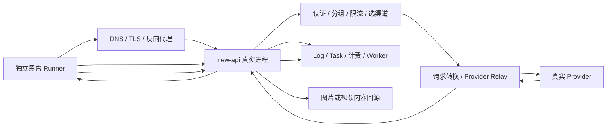

# 全渠道上线实际验收测试方案

## 1. 目标与口径

本方案用于上线前按照 new-api 客户 API 合同发起真实 Provider 调用，验证：

1. 模型发现和分组权限正确；
2. 请求命中预期渠道，不被同名模型的其他渠道接管；
3. Provider 鉴权、模型映射、请求转换和响应投影正确；
4. 文本、图片和视频结果真实可用；
5. 用量、预扣、结算、退款、日志和幂等链路正确；
6. 普通用户响应和日志不泄露渠道密钥、上游私有模型 ID、上游任务 ID 或签名 URL。

本轮按“同一 Provider 后端只做一个代表性业务请求”去重，但明确保留两个例外：

- Pool 同时验收 `gpt-5.5` 和 `gpt-image-2`；
- Azure 同时验收 `gpt-5.6-sol` 和 `gpt-image-2`。

因此本轮计划执行 **10 个真实业务用例**。视频幂等重放只查询已有任务，不得重复创建 Provider 任务，不计为额外生成用例。

### 1.1 E2E 硬边界

本轮与仓库内已有单元测试、`httptest`、controller 内部渠道测试和直连 Provider 探测不同。上线结论必须来自一个独立于 new-api 进程的黑盒测试程序，请求穿过待上线的真实网络入口和完整数据面。

合格的 E2E 必须覆盖：



以下结果不能单独作为上线 E2E 通过证据：

- `go test`、前端测试或 mock Provider 通过；
- 后台“测试渠道”按钮返回成功；
- controller 内的 `httptest` 请求成功；
- 用 Provider Key 直接调用上游成功；
- 只查数据库旧日志，没有本轮新的客户端 request ID；
- 只取得视频创建 HTTP 200，没有等待终态、下载内容和核对计费。

数据库只用于请求完成后的路由、计费和安全取证，不得代替黑盒客户端对公开 API 响应和媒体内容的断言。

### 1.2 黑盒 Runner 交付形式

正式执行使用独立第三方应用作为 Runner。本方案不限定其编程语言、产品或部署方式，但该应用必须是通用 HTTP API 测试/工作流程工具，而不能只是支持 OpenAI 文本对话的普通聊天客户端。它必须能管理超时、轮询、二进制内容、自定义 Header、脱敏证据和机器可读结果。

Runner 必须：

- 在 new-api 进程之外运行，不 import 仓库 controller、service、model 或 relay 包；
- 只接收部署后的 HTTPS Base URL 和 平台 API Key，不接收 Provider Key；
- 使用公开 `GET /v1/models`、文本/图片/视频创建、任务查询和内容下载接口；
- 不允许把 Base URL 设为 Provider 域名；
- 默认校验 TLS，禁止 `--insecure` 或跳过证书验证；
- 每个用例生成唯一 case ID 和幂等 Key，并保存系统响应 Header `X-Oneapi-Request-Id`；
- 按本方案严格串行付费请求；
- 将所有证据脱敏后写入独立证据目录；
- 任一阻断性用例失败时返回非 0 退出码；
- 输出机器可读 JSON 结果和人工可读 Markdown 报告。

第三方应用需要的逻辑配置如下。具体 Key 值由执行人单独配置，不写入本方案、测试 case 定义或证据文件：

```text
base_url=https://<staging-or-production-canary-host>
credential_profile_pool=<configured-separately>
credential_profile_azure=<configured-separately>
credential_profile_default=<configured-separately>
credential_profile_randy=<configured-separately>
evidence_dir=<approved-evidence-dir>
case_timeout=20m
poll_interval=10s
```

运行时不得在 URL、命令行、源码、报告、导出包或 shell history 中输出完整 API Key。

### 1.3 第三方应用接入信息

#### Base URL 与路径拼接

第三方应用只配置一个站点根地址：

```text
https://<your-new-api-host>
```

根地址不包含末尾 `/v1`。各用例使用完整路径：

| 功能 | Method | Path |
| --- | --- | --- |
| 模型发现 | GET | `/v1/models` |
| 文本对话 | POST | `/v1/chat/completions` |
| 图片生成 | POST | `/v1/images/generations` |
| Seedance 创建 | POST | `/api/v3/contents/generations/tasks` |
| Seedance 查询 | GET | `/api/v3/contents/generations/tasks/{task_id}` |
| Seedance 内容 | GET | 使用查询响应的 `content.video_url` |

第三方应用不得把 OpenAI 兼容 Base URL 预先配置成 `https://<host>/v1` 后再拼接视频路径，否则会产生错误的 `/v1/api/v3/...` URL。

#### 认证和通用 Header

所有 API 请求都使用由执行人在第三方应用中单独配置的本系统 API Key：

```http
Authorization: Bearer <system-api-key>
```

POST JSON 请求另带：

```http
Content-Type: application/json
```

视频创建请求另带：

```http
Idempotency-Key: <unique-case-id>
```

查询任务、下载视频和发起 Range 请求时必须继续携带创建该任务时的同一本系统 API Key。不使用 Provider Key，也不在不同凭据 Profile 间混用任务 ID。

第三方应用需保存每次响应中的：

```http
X-Oneapi-Request-Id: <platform-request-id>
```

该 Header 是后续核对渠道、Log 和计费的主要关联键。

#### 凭据 Profile 与用例映射

Key 值由执行人配置，第三方应用只需保存以下逻辑 Profile：

| Profile | 对应调用分组 | 使用用例 |
| --- | --- | --- |
| `pool` | `acceptance-pool` | GPT-P01、IMG-P01 |
| `azure` | `acceptance-azure` | GPT-A01、IMG-A01 |
| `default` | `default` 或对应隔离分组 | IMG-Q01、VID-B01、VID-M01、TXT-ALI01、TXT-FC01 |
| `randy` | `randy` | VID-F01 |

第三方应用必须允许每个 case 明确选择 Profile。如果它只支持全局单 Key，必须拆成四个独立运行集并在每个运行集前切换 Key，不得因为自动 fallback 而使用错误凭据。

#### 第三方应用能力门禁

选定应用后，先做不产生付费模型的能力检查。以下任一项不支持，该应用不适合执行本轮全量 E2E：

- 能分别保存和切换四个 Bearer Token Profile；
- 能发起 GET/POST，设置 JSON 请求体和自定义 `Idempotency-Key`；
- 能保存原始 HTTP 状态、响应 Header 和 JSON；
- 能从 JSON 中提取 Task ID、状态和 `content.video_url`；
- 能按 5–15 秒间隔轮询最长 20 分钟，且在客户端超时后查询原任务而不重新创建；
- 能带 Bearer Token 下载二进制图片/视频；
- 能发起 `Range: bytes=0-1023` 并检查 206、`Content-Range` 和 1024 字节；
- 能禁用“失败后自动重放 POST”，尤其是视频创建请求；
- 能将 Authorization、签名 URL 和媒体结果中的敏感参数脱敏后导出证据。

## 2. 当前渠道快照

本方案依据 2026-08-01 本地 `one-api.db` 渠道与 Ability 快照编制。当前共 16 条渠道，其中 14 条启用，Azure 渠道 18、19 手动停用。

| Provider / 后端 | 渠道 ID | 当前模型 | 当前状态 | 本轮去重口径 |
| --- | --- | --- | --- | --- |
| Azure | 18 | `gpt-5.6-sol`、`gpt-5.6-terra`、`gpt-5.6-luna` | 停用 | 验收已配置的 `gpt-5.6-sol` |
| Azure | 19 | `gpt-image-2` | 停用 | 验收 `gpt-image-2` |
| Pool | 22 | `gpt-5.5`、`gpt-image-2` | 启用 | 两个模态分别验收 |
| Qihang | 25、35 | `gemini-3.5-flash`、`seedream-5-qihang` | 启用 | 共用 Base URL 和凭据，代表测试图片链路 |
| BytePlus 官方 | 26 | `seedance-byteplus` | 启用 | 单独验收官方视频链路 |
| Moxing | 27、34 | 视频与图片模型 | 启用 | 本轮不重复生成 |
| TokenSave | 28 | `doubao-seedance-2-0-260128` | 启用 | 验收 V2 relay 视频链路 |
| 阿里 DashScope | 29 | `glm-5.2`、`qwen3.6-flash`、`qwen3.6-plus`、`text-embedding-v4` | 启用 | 选择原生阿里文本模型 |
| FunCloud | 30、31、32、33 | Claude 与 GLM 模型 | 启用 | 同一 Base URL 只做一个真实业务请求 |
| 飞彩 | 36、37 | standard / value Seedance SKU | 仅 `randy` 灰度 | 按要求只生成一个标准 720p 视频 |

## 3. 阻断性前置

### 3.1 Azure 文本模型使用 `gpt-5.6-sol`

当前 Azure 文本渠道 18 已配置 `gpt-5.6-sol`，因此本轮不新增 `gpt-5.5` 或猜测新 deployment，直接使用 `gpt-5.6-sol` 验收 Azure 文本链路。

开始 Azure 实测前必须：

1. 确认渠道 18 的 `gpt-5.6-sol` 仍指向当前 Azure 资源中存在的 deployment；
2. 检查当前 API Version 与该 deployment 兼容；
3. 确认 `gpt-5.6-sol` 的 Ability、价格和用量口径完整；
4. 只在 `acceptance-azure` 分组启用渠道 18，不直接放开生产 `default` 流量。

### 3.2 Pool 和 Azure 同名模型必须隔离选路

Azure 启用后，`gpt-image-2` 会同时存在于 Pool 和 Azure；两组测试也需要分别证明命中 Pool 和 Azure。如果直接使用 `default` 或 `randy` 分组，一次成功请求不能证明命中了目标渠道。

验收时建立两个临时调用分组：

| 临时分组 | 唯一可用渠道 | 允许模型 |
| --- | --- | --- |
| `acceptance-pool` | 22 | `gpt-5.5`、`gpt-image-2` |
| `acceptance-azure` | 18、19 | `gpt-5.6-sol`、`gpt-image-2` |

两个分组分别使用独立的验收 API Key。不通过修改生产 `default` 分组优先级来“尝试命中”目标渠道。

### 3.3 验收环境

执行前确认：

- 使用待上线的实际代码、数据库配置和网络出口；
- new-api 以真实独立进程运行，异步 worker、缓存、日志库和主库使用待上线配置；
- Runner 从另一个进程发起 HTTPS 请求；上线门禁默认使用预发或生产灰度域名，不把 `httptest` 或函数直调当作 E2E；
- DNS、TLS 证书、反向代理路由、请求体上限和超时值与待上线环境一致；
- 后端系统时间、时区和异步 worker 正常；
- 验收账户有足够额度，Provider 账户也有足够余额；
- 准备 `default`、`randy`、`acceptance-pool`、`acceptance-azure` 所需的独立 API Key；
- 执行前导出渠道状态、分组、Ability、优先级和模型映射快照，便于测试后精确恢复；
- 记录验收开始时间，后续只核对该时间点之后的 Log、Task 和 create attempt。

## 4. 实际验收矩阵

### 4.1 必须执行的 10 个用例

| 编号 | Provider | 目标渠道 | 验收模型 | 客户 API 合同 | 最小场景 | 预期分组 |
| --- | --- | ---: | --- | --- | --- | --- |
| GPT-P01 | Pool | 22 | `gpt-5.5` | `POST /v1/chat/completions` | 非流式短文本 | `acceptance-pool` |
| IMG-P01 | Pool | 22 | `gpt-image-2` | `POST /v1/images/generations` | 最小规格文生图，`n=1` | `acceptance-pool` |
| GPT-A01 | Azure | 18 | `gpt-5.6-sol` | `POST /v1/chat/completions` | 非流式短文本 | `acceptance-azure` |
| IMG-A01 | Azure | 19 | `gpt-image-2` | `POST /v1/images/generations` | 最小规格文生图，`n=1` | `acceptance-azure` |
| IMG-Q01 | Qihang | 35 | `seedream-5-qihang` | `POST /v1/images/generations` | `2K`、`n=1`、URL 结果 | `default` 或隔离分组 |
| VID-B01 | BytePlus | 26 | `seedance-byteplus` | `POST /api/v3/contents/generations/tasks` | 5 秒、720p、16:9 文生视频 | `default` 或隔离分组 |
| VID-M01 | TokenSave | 28 | `doubao-seedance-2-0-260128` | 同上 | 5 秒、720p、16:9 文生视频 | `default` 或隔离分组 |
| TXT-ALI01 | 阿里 | 29 | `qwen3.6-flash` | `POST /v1/chat/completions` | 非流式短文本 | `default` |
| TXT-FC01 | FunCloud | 33 | `claude-fable-5` | `POST /v1/chat/completions` | 非流式短文本 | `default` |
| VID-F01 | 飞彩 | 36 | `seedance-2.0-standard-720p` | `POST /api/v3/contents/generations/tasks` | 4 秒、720p、16:9 文生视频 | `randy` |

### 4.2 本轮明确不重复生成的模型

| 未单独生成的渠道 / 模型 | 原因 | 处置 |
| --- | --- | --- |
| Qihang 渠道 25 `gemini-3.5-flash` | 与渠道 35 共用 Base URL 和凭据，且已有持续真实调用记录 | 本轮用更高风险的 Qihang 图片链路代表 |
| Moxing 渠道 27 和图片渠道 34 | 按业务要求第三方 Seedance 只生成一个视频 | 本轮选择 TokenSave 渠道 28 验收当前 doubao V2 relay 合同；27、34 的独立凭据仍需 smoke check |
| FunCloud 渠道 30、31、32 | 同一后端只做一个业务请求 | 选择只在渠道 33 存在的 `claude-fable-5`，保证选路确定 |
| 飞彩 standard 1080p 和 value 全系列 | 按业务要求只生成一个飞彩视频 | 用已知相对稳定的 standard 720p 代表；value 高规格仍保持灰度 |

上述去重只证明代表后端链路可用，不证明所有未调用凭据、所有模型和所有能力组合都已经通过 Provider 验收。

## 5. 请求规范

### 5.1 文本用例

文本用例统一使用不含工具、图片或敏感内容的短请求：

```json
{
  "model": "<target-model>",
  "messages": [
    {
      "role": "user",
      "content": "只回复 ACCEPTANCE_OK"
    }
  ],
  "stream": false,
  "max_tokens": 32
}
```

验收时不强制模型逐字返回指定文本；只要 HTTP 成功、助手内容非空、响应结构正确且 usage 可用即可。如果目标 GPT deployment 只接受 `max_completion_tokens`，应使用其公开合同支持的字段，不得通过透传私有参数绕过客户端校验。

### 5.2 Pool / Azure `gpt-image-2`

两个 Provider 使用相同客户端请求，只切换验收 API Key：

```json
{
  "model": "gpt-image-2",
  "prompt": "A small blue ceramic cup centered on a plain white background, product photo",
  "size": "1024x1024",
  "n": 1
}
```

如目标 deployment 不支持 `1024x1024`，必须先根据已核实的模型合同修订用例，不得在运行时随意试探多种付费规格。

图片验收要求：

- 返回恰好 1 张图片；
- URL 可下载，或 Base64 可解码；
- 文件格式是可解码的图片，像素尺寸符合请求；
- 图片内容与 prompt 基本一致，不接受空白文件或占位 URL；
- 日志分别命中渠道 22 和 19。

### 5.3 Qihang 图片

```json
{
  "model": "seedream-5-qihang",
  "prompt": "一只放在白色桌面上的蓝色陶瓷杯，产品摄影，柔和棚拍光线",
  "size": "2K",
  "n": 1,
  "response_format": "url",
  "stream": false
}
```

预期同步 HTTP 200，`data` 中恰好一个可下载 URL，命中渠道 35，日志中按当前固定售价结算一次。

### 5.4 BytePlus 和 TokenSave 视频

```json
{
  "model": "<seedance-byteplus-or-doubao-seedance-2-0-260128>",
  "content": [
    {
      "type": "text",
      "text": "清晨的雪山被第一缕阳光照亮，固定镜头，电影感，写实风格"
    }
  ],
  "duration": 5,
  "resolution": "720p",
  "ratio": "16:9",
  "generate_audio": false
}
```

每个请求必须使用独立的 `Idempotency-Key`。不使用参考图、参考音频、参考视频或真人素材，避免把素材合同和后端基础可用性混在一个用例中。

### 5.5 飞彩视频

```json
{
  "model": "seedance-2.0-standard-720p",
  "content": [
    {
      "type": "text",
      "text": "蓝色陶瓷杯放在白色桌面上，镜头缓慢推进，柔和棚拍光线"
    }
  ],
  "duration": 4,
  "resolution": "720p",
  "ratio": "16:9",
  "generate_audio": false
}
```

飞彩曾在 `generate_audio=false` 时仍返回 AAC 音轨。本轮应记录实际音轨，但在 Provider 未确认前，不将“无音轨”作为成功门槛，也不将现有行为改写为产品承诺。

### 5.6 第三方应用的响应提取规则

第三方应用应按下表配置提取和断言，不使用“响应体非空”作为唯一成功条件：

| 接口 | 预期 HTTP | 需提取的字段 | 最小断言 |
| --- | ---: | --- | --- |
| `GET /v1/models` | 200 | `data[].id` | 当前 Profile 能看到本 case 的目标模型 |
| `POST /v1/chat/completions` | 200 | `choices[0].message.content`、`usage` | `choices` 恤好包含可用助手内容；usage 数值非负 |
| `POST /v1/images/generations` | 200 | `data[0].url` 或 `data[0].b64_json` | `data` 恰好一项；实际下载/解码后是完整图片 |
| Seedance 创建 | 200 | `id` | `id` 是非空平台 Task ID，应以 `task_` 开头 |
| Seedance 查询 | 200 | `id`、`model`、`status`、`content.video_url` 或 `error` | `id` 与创建结果相同；只接受已知状态 |
| Seedance 内容 | 200 | `Content-Type`、`Content-Length` 和二进制体 | 文件非空、可解码，且存在视频轨 |
| Seedance Range | 206 | `Content-Range`、`Content-Length` | 返回 1024 字节，`Content-Range` 与 `bytes 0-1023/...` 一致 |

对响应 JSON 的参考路径：

```text
models:               $.data[*].id
chat_content:         $.choices[0].message.content
prompt_tokens:        $.usage.prompt_tokens
completion_tokens:    $.usage.completion_tokens
image_url:            $.data[0].url
image_base64:         $.data[0].b64_json
video_task_id:        $.id
video_status:         $.status
video_content_url:    $.content.video_url
video_error_code:     $.error.code
video_error_message:  $.error.message
```

Seedance 任务只接受以下状态：

```text
非终态: queued, running
成功终态: succeeded
非成功终态: failed, cancelled, expired
```

出现未知状态、缺失 `id`、查询返回不同 Task ID、成功终态缺失 `content.video_url` 或者内容无法下载时，用例必须失败。

### 5.7 轮询、超时和重试策略

第三方应用应使用以下策略：

1. 视频创建成功后首次等待 2 秒；
2. 前 2 分钟每 5 秒查询一次，之后每 10–15 秒查询一次；
3. 单任务最长等待 20 分钟；
4. GET 查询收到 429、502 或 503 时可带抖动指数退避，但必须查询原 Task ID；
5. POST 创建请求遇到超时、连接中断或 5xx 时不得自动重试；
6. 客户端超时不能自动将任务判定为 Provider 失败；应保存平台 Task ID 并继续查询原任务；
7. 幂等重放只在首次创建已经返回明确平台 Task ID 后执行，重放时必须使用完全相同的请求体和 `Idempotency-Key`。

## 6. 执行顺序

所有用例严格串行，避免混淆选路、任务、日志和 Provider 账单证据：

1. GPT-P01：Pool `gpt-5.5`；
2. IMG-P01：Pool `gpt-image-2`；
3. GPT-A01：Azure `gpt-5.6-sol`；
4. IMG-A01：Azure `gpt-image-2`；
5. TXT-ALI01：阿里 `qwen3.6-flash`；
6. TXT-FC01：FunCloud `claude-fable-5`；
7. IMG-Q01：Qihang `seedream-5-qihang`；
8. VID-B01：BytePlus `seedance-byteplus`；
9. VID-M01：TokenSave `doubao-seedance-2-0-260128`；
10. VID-F01：飞彩 `seedance-2.0-standard-720p`。

前 7 项全部取得终态并完成日志、用量和账单核对后，才开始三个视频任务。每个视频必须取得可信终态后才执行下一个；出现创建结果未知时必须停止视频队列，不得换渠道或重新 POST。

### 6.1 每个用例的黑盒步骤

Runner 对每个用例统一执行：

1. 用该用例的 平台 API Key 请求 `GET /v1/models`，确认目标模型实际可见；
2. 记录发起时间、case ID 和脱敏请求；
3. 通过部署域名发起公开客户端请求；
4. 校验 HTTP 状态、Content-Type、响应 schema 和平台 request ID；
5. 文本校验非空内容；图片下载并解码；视频通过公开查询轮询至终态后下载和解码；
6. 对异步用例使用相同幂等 Key 重放原请求，确认返回同一个平台任务；
7. 通过管理员只读 API 或执行后取证步骤核对实际渠道、用量、quota、Task 和计费；
8. 产生该 case 的 JSON 结果、Markdown 摘要和脱敏原始证据；
9. 只有黑盒内容断言和执行后取证均通过时，该 case 才标记为 `PASS`。

## 7. 单项验收标准

### 7.1 通用标准

每个用例必须同时满足：

- 测试 API Key 的 `GET /v1/models` 中存在目标模型；
- 请求从 new-api Link 公开入口发起，不使用 Provider Key 绕过网关；
- HTTP 响应与对应 Link 合同一致；
- 返回的文本、图片或视频可实际使用；
- 日志的 `channel_id`、`model_name`、`request_id`、分组和用量符合本方案；
- 完成且仅完成一次计费，无重复消费、无负 quota、无饱和异常；
- 错误、普通响应和用户可见日志不暴露 Provider 凭据或 Provider 私有信息。

### 7.2 异步图片和视频附加标准

- 创建时取得平台任务 ID，客户端不得看到真实上游任务 ID；
- Task 状态按合同从非终态进入可信终态；
- 成功时 `billing_state=settled`，失败时退款后也必须进入 `settled`；
- 不得留下无法解释的 hold、debt、create attempt 或 Provider exposure；
- 成功视频通过平台 content URL 下载，HTTP 200；
- 至少对每个视频 Provider 检查一次 `Range: bytes=0-1023`，预期 HTTP 206 和 1024 字节；
- 解码视频容器，核对非空视频轨、时长、分辨率和帧率；
- 使用原 `Idempotency-Key` 和原请求体重放，返回同一平台任务 ID，Task 数、Provider 任务数和消费日志数不增加。

## 8. 证据留存

执行时建立目录：

```text
docs/80-dev/2026-08-01-全渠道上线实际验收/
```

每个用例保存：

```text
<case-id>/
  request.redacted.json
  response.redacted.json
  response.headers.txt
  result-summary.md
  billing-evidence.redacted.json
  task-final.redacted.json        # 仅异步任务
  content.headers.txt             # 仅视频
  content-range.headers.txt       # 仅视频
  media-metadata.txt              # 图片/视频
```

证据文件禁止保存：

- new-api API Key 完整值；
- Provider Key、Cookie 或签名凭据；
- 完整签名 URL；
- 渠道 `key`、`private_data` 原文或未脱敏的管理员日志；
- 包含真实用户数据的 prompt 或媒体。

每个用例的 `result-summary.md` 至少记录：开始/结束时间、HTTP 状态、平台 request ID、平台 Task ID、目标/实际渠道 ID、模型、终态、用量、quota、幂等重放结果与最终 `PASS / FAIL / BLOCKED`。

## 9. 安全核对 SQL

以平台 request ID 核对日志，不查询渠道 Key 或用户 prompt：

```sql
SELECT
  id,
  datetime(created_at, 'unixepoch', 'localtime') AS created_time,
  request_id,
  model_name,
  channel_id,
  channel_name,
  "group",
  quota,
  prompt_tokens,
  completion_tokens,
  use_time,
  is_stream
FROM logs
WHERE request_id = '<request-id>'
ORDER BY id;
```

以平台 Task ID 核对异步任务，不读取 `private_data`：

```sql
SELECT
  id,
  task_id,
  channel_id,
  "group",
  status,
  billing_state,
  quota,
  submit_time,
  start_time,
  finish_time,
  cancellation_state
FROM tasks
WHERE task_id = '<public-task-id>';
```

如果出现 quota 饱和、创建结果未知或费用暴露，由管理员在受控环境进一步检查 create attempt 和 exposure 记录，不将未脱敏数据复制进验收文档。

## 10. 异常处置

| 异常 | 处置 |
| --- | --- |
| `GET /v1/models` 中无目标模型 | 停止该用例，检查渠道、Ability、分组与价格，不绕过模型发现强行请求 |
| 命中非目标渠道 | 该用例失败；先修复验收分组隔离，不用多次重试碰概率 |
| 同步请求 4xx | 记录稳定错误码，核对请求合同和模型映射；修正前不重复付费试探 |
| 同步请求 5xx / 超时 | 保留 request ID，核对是否产生消费日志；人工确认 Provider 结果前不盲目重试 |
| 视频创建结果未知 | 立即停止后续视频，保留 hold，进入有界对账；不换渠道、不重新 POST、不立即退款 |
| 视频可信终态失败 | 确认稳定失败投影、退款和 `settled`；本用例记 `FAIL` |
| 任务成功但内容无法下载 | 按交付失败处理，不因 Task 状态为 succeeded 就通过 |
| 计费不符、重复扣费、debt 或饱和 | 立即停止后续付费用例，核对预扣与结算链路 |
| 响应或日志出现凭据/私有信息 | 安全失败，立即中止验收，处理泄露证据并轮换受影响凭据 |

## 11. 上线判定

### 11.1 全量通过条件

只有同时满足以下条件，才能将本轮验收标记为通过：

1. 10 个用例全部 `PASS`；
2. Pool 和 Azure 四个用例分别命中 22、18、19 的指定渠道；
3. 三个视频均取得可信成功终态、可下载内容和正确结算；
4. 无未处置的 create outcome unknown、hold、debt、quota saturation 或 Provider exposure；
5. 无密钥、私有任务 ID 或签名 URL 泄露；
6. 验收证据完整，且能从 request ID / Task ID 追溯到渠道、用量和计费结果。
7. 10 个用例全部由独立黑盒 Runner 通过待上线 HTTPS 域名执行，没有使用内部 controller 调用、`httptest`、直连 Provider 或手工改数据库来代替数据面链路。

### 11.2 分渠道结论

某一 Provider 用例失败不等于其他 Provider 的已通过证据无效，但本方案的“全渠道上线通过”结论仍不成立。验收报告必须分别标记每个 Provider 为 `PASS`、`FAIL` 或 `BLOCKED`，不使用“大部分通过”替代具体结果。

飞彩本轮即使 standard 720p 通过，也不自动解锁渠道 37 的 value 1080p / 4K；这两个 SKU 已有真实 Provider 失败证据，仍保持 `randy` 灰度和独立复验门禁。

## 12. 测试后恢复

验收结束后：

1. 根据执行前快照恢复 Azure 渠道状态、分组和优先级；
2. 删除临时 `acceptance-pool` / `acceptance-azure` Ability 和验收 API Key；
3. 不删除验收 Log、Task、create attempt 或账单记录；
4. 核对没有非终态任务和遗留临时分组；
5. 生成最终验收报告，记录每项实际结果、已知限制、未通过门禁和上线建议。

## 13. 结果记录表

| 用例 | 实际渠道 | HTTP / 创建 | 结果或终态 | 内容检查 | 计费 | 幂等 | 结论 | 证据路径 |
| --- | ---: | --- | --- | --- | --- | --- | --- | --- |
| GPT-P01 | | | | | | 不适用 | | |
| IMG-P01 | | | | | | 不适用 | | |
| GPT-A01 | | | | | | 不适用 | | |
| IMG-A01 | | | | | | 不适用 | | |
| IMG-Q01 | | | | | | 视响应类型执行 | | |
| VID-B01 | | | | | | | | |
| VID-M01 | | | | | | | | |
| TXT-ALI01 | | | | | | 不适用 | | |
| TXT-FC01 | | | | | | 不适用 | | |
| VID-F01 | | | | | | | | |

## 14. 已知范围边界

- 本轮不等于逐 Provider 凭据验收。当前数据库实际存在 11 组不同凭据，Moxing 和 FunCloud 部分未调用凭据仍需另行做鉴权或模型列表 smoke check。
- 本轮不验收文本模型的流式输出、工具调用、长上下文、视觉输入或 prompt cache。
- 本轮不验收图片编辑、多图、多尺寸、异步图片的全部组合。
- 本轮视频只验收纯文本最小场景，不代替首帧、首尾帧、多参考图、参考音频、参考视频、平台素材和真人授权的专项验收。
- 本轮使用 SQLite 数据库时，不代表 MySQL 和 PostgreSQL 的发布门禁已通过；实际生产数据库必须在对应集成环境中独立验证。

## 15. 参考

- [Seedance（ModelArk v3）视频 API 调用指南](../30-engineering/视频模型API用户调用指南.md)
- [图片模型 API 用户调用指南](../30-engineering/图片模型API用户调用指南.md)
- [视频与素材渠道运维手册](../40-operations/02-视频与素材渠道运维手册.md)
- [图片渠道与异步任务运维手册](../40-operations/03-图片渠道与异步任务运维手册.md)
- [飞彩 Seedance 修复后串行实测报告](./2026-08-01-飞彩Seedance修复后串行实测报告.md)
