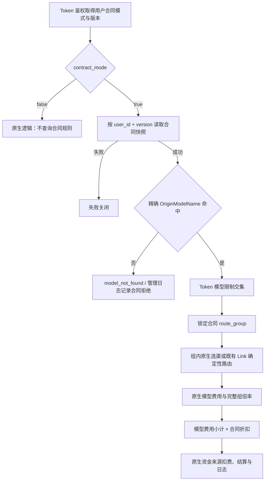

# 用户模型合同折扣与渠道组约束设计

> 本文保留实施设计和验证记录。稳定产品、架构、运维和界面事实分别以
> [用户模型合同定价](../10-product/用户模型合同定价.md)、
> [用户模型合同定价架构](../20-architecture/用户模型合同定价架构.md)、
> [用户模型合同运维手册](../40-operations/10-用户模型合同运维手册.md)和
> [用户模型合同管理界面](../90-ui-ux/用户模型合同管理界面.md)为权威；真实账单和灰度完成前本文保持
> `in-progress`。

## 1. 问题与目标

当前 NEWAPI 通过用户分组、Token 分组、渠道分组、模型价格和组间倍率共同决定模型发现、选渠与计费。
这套机制适合通用零售定价，但在 B 端客户场景中，管理员必须同时维护多处配置，才能近似表达“某个客户
只能调用合同内模型，且每个模型有独立折扣”。配置成本高，也容易因组权限或倍率叠加产生错误授权和错账。

本次设计新增按 `User ID` 生效的模型合同模式。每条合同规则表达：

```text
精确客户模型 + 唯一渠道组 + 合同折扣
```

例如同一个客户可以配置：

```text
claude-sonnet-5：0.8
claude-opus-4-8：0.6
claude-haiku-4-5：0.5
```

目标如下：

1. 未启用合同模式的用户完整执行 NEWAPI 原生模型发现、权限、分发和计费逻辑，结果不变。
2. 启用合同模式的用户只能发现和调用精确登记的合同模型，未登记模型严格拒绝。
3. 一个合同模型只绑定一个具体渠道组；组内仍由 NEWAPI 原生逻辑选择任意可用渠道。
4. 合同折扣叠加在原生模型费用与完整原生组倍率之后，不替换或改写现有价格配置。
5. 合同属于一个不可变 `User ID`，该用户的所有现有和未来 API Key 立即共享同一合同。
6. 管理员只维护“用户、模型、渠道组、折扣”，不再为合同客户同步编辑多套原生组权限。
7. 用户在 API Key 页面只读查看合同模型、合同折扣和当前折后价格。

本设计已完成本地代码实现，并通过自动化回归以及独立 MySQL 8.0、PostgreSQL 17 容器中的迁移、唯一
约束、事务和并发版本冲突验证。它仍不表示真实 Provider、真实客户账单或生产灰度已经完成；这些发布
闸门继续保留在实施计划中。

## 2. 范围与非目标

### 2.1 范围内

- 合同模式启停、规则批量保存、版本控制和管理员审计；
- 合同用户的精确模型白名单、模型发现、价格展示和渠道组约束；
- 同步文本、音频、图片、Realtime 和异步生成任务的客户模型费用折扣；
- 钱包、订阅和 Token 额度使用同一折后客户费用；
- 异步任务创建时冻结合同和原生计费事实，终态按实际用量对账；
- 主数据库、Redis/进程缓存、鉴权缓存围栏和失败关闭；
- 合同停用、规则失效、渠道组不可用、并发编辑和历史账单边界。

### 2.2 范围外

- `/v1/assets`、`/v1/asset-groups`、真人素材认证和其它无计费素材控制面；
- 已有 Task 查询、取消、结果下载、账单查询、用量日志查询和管理员渠道测试；
- Provider 成本折扣、上游对账折扣、充值折扣、违规费用和独立工具附加费；
- 多用户组织合同、合同继承、合同模板、定时生效、通配模型或按单个 API Key 定价；
- 自动迁移、删除或改写 `UserUsableGroups`、`GroupSpecialUsableGroup`、`GroupGroupRatio`、Token 分组等
  原生配置；
- 按当前价格重算历史请求、历史 Task 或历史账单。

视频生成即使引用 `asset://` 仍属于模型调用，必须检查视频客户模型的合同；素材本身的创建、查询、更新
和删除不进入本合同系统。

## 3. 当前实际情况

### 3.1 已验证代码事实

| 主题 | 当前事实 | 影响 |
| --- | --- | --- |
| 模型发现 | [`controller/model.go`](../../controller/model.go) 根据 Token/User Group、Ability 和 Token 模型限制生成模型列表 | 现有组集合不是合同精确白名单 |
| 价格展示 | [`controller/pricing.go`](../../controller/pricing.go) 按用户可用组过滤价格，并覆盖组间倍率 | 只能表达组级价格，不能表达每用户每模型折扣 |
| 鉴权与组 | [`middleware/auth.go`](../../middleware/auth.go) 将用户组、Token Group、AutoGroups 写入请求上下文 | 存量 KEY 可能保留不同组配置 |
| 原生分发 | [`middleware/distributor.go`](../../middleware/distributor.go) 处理模型限制、Affinity、Auto Group、组内渠道选择和重试 | 合同检查必须早于 Affinity、分发和 Provider 调用 |
| 原生组倍率 | [`relay/helper/price.go`](../../relay/helper/price.go) 优先使用 `GroupGroupRatio[userGroup][usingGroup]`，否则使用 `GroupRatio[usingGroup]` | 合同折扣必须叠加在完整解析结果之后 |
| Realtime | [`service/quota.go`](../../service/quota.go) 的预扣路径会再次读取当前模型和组倍率 | 只改通用价格入口会漏掉 Realtime |
| 异步非表达式结算 | [`service/task_billing_state.go`](../../service/task_billing_state.go) 与 [`service/task_billing.go`](../../service/task_billing.go) 会在终态重新读取当前倍率 | 可能导致创建时预扣与终态结算不一致 |
| 阶梯表达式 | [`pkg/billingexpr/expr.md`](../../pkg/billingexpr/expr.md) 已要求表达式与请求状态冻结后结算 | 合同倍率应作为独立客户合同事实冻结，不写回表达式 |
| 鉴权缓存 | [`model/user_auth_cache.go`](../../model/user_auth_cache.go) 已有 `auth_version`、pending fence 和 committed floor | 可复用现有失败关闭机制阻断陈旧合同权限 |
| 历史账单 | [`docs/20-architecture/API-Key用量账单架构.md`](../20-architecture/API-Key用量账单架构.md) 规定按已结算日志汇总 | 合同变化不能重算历史账单 |

### 3.2 当前风险结论

不能把本需求简化为新增 `GroupGroupRatio` 或为每个客户复制一组原生分组配置：

1. 原生可用组是多个配置的并集，不天然满足“未配置即拒绝”。
2. 组倍率只能表达组级统一倍率，不能可靠表达同一客户不同模型的不同比例。
3. 将合同折扣直接写进 `GroupRatioInfo` 会让独立工具费、违规费等非模型费用一起打折。
4. 仅过滤 `/v1/models` 或价格页面不能阻止客户端直接提交合同外模型。
5. 异步终态若读取当前合同或当前组倍率，同一任务会因管理员修改时点而产生不同结算结果。
6. 当前原生异步非表达式 Token 重算仍具有读取实时倍率的既有语义。本扩展只让带
   `ContractBillingFact` 的合同 Task 使用创建时冻结事实，并以回归测试固定“无合同事实时继续执行原生
   读取”，不借合同功能改变未标记用户的历史计费行为。

上述代码风险不等于已经证明历史账单存在错账。是否存在历史影响仍需通过真实日志、Task 私有计费快照
和账单数据另行核对。

## 4. 已确认的业务不变量

### 4.1 模式与授权

1. 合同模式是显式、按用户启用的增强能力；没有合同标记时走原生逻辑。
2. 首次原子创建有效规则时自动启用合同模式；管理员也可以显式启用零规则合同，结果是零模型权限。
3. 删除最后一条规则不会自动退回原生模式；用户继续处于合同模式且无法调用任何模型。
4. 只有管理员显式停用合同模式才恢复原生权限。停用需高风险确认，并提示所有 KEY 将恢复原生权限。
5. 停用只改变模式，保留规则和审计。重新启用前必须预览、校验并由管理员确认。
6. 合同模式约束同一 `User ID` 下全部现有和未来 KEY；不允许存量 KEY 保留旧权限。
7. Token 模型限制只能在合同白名单内继续收窄，不能扩大合同授权。
8. 合同匹配只使用客户端请求中的精确公开模型名，即 `OriginModelName`；不使用通配、前后缀、模糊匹配、
   `FormatMatchingModelName`、Provider 模型名或 `model_mapping` 推断合同。
9. 请求匹配保留大小写精确语义；同一合同写入时拒绝仅大小写不同的重复模型，避免 MySQL 默认
   `utf8mb4_*_ci` 与 SQLite/PostgreSQL 唯一约束行为分裂。

### 4.2 路由

1. 一个合同中的一个公开模型只绑定一个明确存在的具体渠道组。
2. 渠道组不能是 `auto`、通配符、候选列表或表达式。
3. 合同绑定组覆盖该用户 Token 的固定组、AutoGroups、Playground 选组和跨组重试；这些原生字段不能
   将合同模型路由到其它组。
4. 组内 Priority、Weight、Affinity、随机分发、失败重选和原生重试语义保持不变；禁止跨合同组回退。
5. 新建或重新启用规则时，目标组必须至少存在一条能履约该精确公开模型的可用渠道。
6. 生效后若目标组、渠道或模型暂时不可用，保留合同规则但派生显示为不可用；新请求失败关闭，不自动
   换组、迁移或删除规则。恢复同一组与模型后可重新履约。

Seedance Link 继续遵守“一个已启用客户模型只对应一个专用 Channel，且不进入原生 Ability/分发池”的
硬约束。合同可以限制 Seedance 视频客户模型并参与其客户费用，但不能让合同渠道组创建第二条 Link
路由、候选集或 fallback；启用时必须校验该唯一专用 Channel 属于合同指定组，实际执行仍由现有
Seedance 确定性路由完成。

### 4.3 计费

合同最终费用公式为：

```text
合同客户模型费用 = NEWAPI 原生模型费用小计 × 完整原生有效组倍率 × 合同模型折扣
```

完整原生有效组倍率继续按以下顺序解析：

```text
存在 GroupGroupRatio[userGroup][usingGroup]
  -> 使用该特殊倍率
否则
  -> 使用 GroupRatio[usingGroup]
```

例如原生模型费用为 `100`、有效组倍率为 `0.87`、合同折扣为 `0.8`：

```text
100 × 0.87 × 0.8 = 69.6
```

合同折扣只作用于模型固有费用小计：

- 输入、输出、缓存、图片 Token、音频 Token；
- 图片数量、视频时长、分辨率、质量等模型固有规格倍率；
- 按次固定模型费用；
- 动态/阶梯表达式求出的模型费用。

以下费用不参与合同折扣：

- 独立工具调用附加费；
- 违规或滥用费用；
- 充值折扣；
- Provider 成本、上游账单折扣和成本暴露。

合同折扣使用固定点事实，精度最多八位小数，满足 `0 < ratio <= 1`。不允许免费 `0`、加价 `> 1`、
NaN 或无穷值。折扣在最终 quota 舍入前应用，quota 转换继续使用统一 checked 饱和函数。

原生组倍率后续发生变化时，合同用户的新请求价格同步变化。管理端保存或启用合同时必须展示原生倍率、
合同折扣和最终倍率；若存在不等于 `1` 的特殊 `GroupGroupRatio`，提示双重折扣风险，但不修改原生配置。

### 4.4 生效、历史和显示

1. 合同事务提交后的新请求使用新版本；已经取得计费快照的请求继续使用旧版本。
2. 同步和异步请求均在授权、路由、预扣之前取得一致的合同快照。
3. 异步任务冻结创建时合同版本、折扣、公开模型、绑定组、原生组倍率和原生计费规则；终态只补齐实际
   Token、时长、数量或上游扣费单位等用量事实。
4. 合同变化不追溯历史请求、日志、余额或账单；已删除规则对应的历史 Task 和结果仍可查询。
5. 普通用户只看到合同模型、合同折扣和当前折后价格；不看到内部组倍率、组名、Channel、Provider 或
   上游模型。

## 5. 总体架构



关键隔离原则：

- `contract_mode=false` 是字面量原生分支，不读取合同规则、不改变组、不增加合同价格因子；
- `contract_mode=true` 时合同快照同时承担授权、唯一组路由和模型折扣，不再依赖管理员另配原生可用组；
- 合同服务只提供一套权威读取与校验实现，模型发现、价格展示、请求授权和计费快照都读取同一快照；
- 缓存只保存按版本不可变的投影，主数据库始终是合同事实源。

## 6. 持久化模型

### 6.1 用户合同标记

在 `users` 增加最小字段：

| 字段 | 类型建议 | 语义 |
| --- | --- | --- |
| `contract_mode` | boolean | `false` 为原生模式，`true` 为合同模式；业务默认值由代码设置 |
| `contract_version` | bigint | 合同聚合版本，初始为 `0`，每次合同变更单调增加 |

这两个字段进入 `UserBase` 鉴权缓存。原生用户可在鉴权后直接走旧路径，不需要为每个请求额外查询合同表。
合同模式切换和规则变更同时增加现有 `auth_version`，复用鉴权缓存围栏阻断陈旧权限。

### 6.2 模型合同规则

新增 `customer_model_contracts`：

| 字段 | 类型建议 | 约束 |
| --- | --- | --- |
| `id` | GORM 主键 | 由 GORM 生成 |
| `user_id` | int | 合同唯一所属用户 |
| `public_model` | varchar(255) | 精确公开模型名，保存时去除首尾空白但不改写大小写 |
| `route_group` | varchar(64) | 唯一具体渠道组，不允许 `auto` |
| `ratio_units` | bigint | 折扣乘以 `100000000` 后的正整数，范围 `1..100000000` |
| `created_at` / `updated_at` | bigint 或项目统一时间类型 | 管理事实时间 |

唯一索引为：

```text
UNIQUE(user_id, public_model)
```

使用固定点整数而不是数据库浮点数，避免 SQLite、MySQL 和 PostgreSQL 对小数精度的不同处理。运行时只有
在价格计算边界转换为 `decimal.Decimal`；持久化和 API 输入输出保持八位以内十进制定点语义。

规则不持久化“渠道不可用”状态。可用性由当前渠道事实派生，避免渠道恢复后仍残留错误状态。管理员删除
规则表示撤销新请求授权，历史审计、Task 和日志不删除。

### 6.3 审计

新增只追加的 `customer_contract_audits`：

| 字段 | 内容 |
| --- | --- |
| `user_id` | 被修改的合同用户 |
| `contract_version` | 修改后版本 |
| `admin_user_id` | 操作管理员 |
| `operation` | create/update/enable/disable/delete-rule |
| `reason` | 必填操作原因，限制长度 |
| `before_state` / `after_state` | 使用 `TEXT` 保存脱敏 JSON 快照 |
| `created_at` | 操作时间 |

JSON 编解码必须使用 `common.Marshal` / `common.Unmarshal`。审计不保存 Token、Channel Key、Provider
凭据或原始请求响应。

## 7. 控制面事务与并发

管理员写接口提交完整期望状态和 `expected_version`。服务端先按渠道组批量校验即将生效规则的当前可履约
能力，随后在一个数据库事务中：

1. 使用 `lockForUpdate(tx)` 锁定用户；
2. 校验 `expected_version == users.contract_version`；
3. 计算并记录旧状态、新状态、原生有效倍率、最终倍率和风险提示；
4. 对启用、收窄、删除、改组、改价等可能影响授权或账单的变化调用
   `IncrementUserAuthVersionWithTx`，在提交前发布失败关闭围栏；
5. 批量写入合同规则、`contract_mode`、新 `contract_version` 和审计；
6. 提交后发布新的用户鉴权缓存，并替换该用户的旧合同缓存。

任何一步失败都不得留下部分规则。`expected_version` 冲突返回明确的版本冲突，管理员重新读取后再决定，
不做最后写入覆盖。可履约校验不持有用户行锁；若校验后渠道状态发生变化，请求路径仍按当前状态失败
关闭，不跨组履约。

合同停用只设置 `contract_mode=false` 并增加版本，规则保留。重新启用时重新执行全部可用性校验和风险
预览，不能因为历史上曾经可用而跳过校验。

## 8. 缓存与失败关闭

请求侧合同解析返回三态：

```text
native             用户明确处于原生模式
contract(snapshot) 用户处于合同模式且取得对应版本快照
error              状态、版本或规则读取失败
```

只有明确的 `native` 可以走原生逻辑。合同用户出现以下情况必须在 Provider 调用和预扣前失败：

- 主数据库读取失败；
- 合同缓存缺失且无法从主数据库重建；
- 缓存版本与用户 `contract_version` 不一致；
- 快照内容损坏、比例非法或出现重复模型；
- 规则绑定组或模型当前不可履约。

缓存键必须包含 `user_id + contract_version`，快照写入后不可原位修改。Redis 和进程缓存失效只能导致
回源或失败，不能回退到原生模式、倍率 `1` 或旧合同版本。

现有用户鉴权 `auth_version` 围栏用于保证合同启用、权限收窄和规则变更后，陈旧 `UserBase` 不能继续
授权。若提交后缓存发布失败，围栏保持失败关闭；不得为了可用性接受旧权限。

## 9. 请求授权、模型发现与路由

### 9.1 请求授权顺序

所有实际产生模型调用或生成费用的入口按以下顺序执行：

```text
Token 鉴权
  -> 读取合同模式/版本
  -> 解析精确公开模型
  -> 合同白名单检查
  -> Token 模型限制交集
  -> 写入唯一 route_group 与合同计费快照
  -> Affinity / 原生组内分发或既有 Link 路由
  -> model_mapping
  -> 预扣
  -> Provider 请求
```

合同拒绝必须发生在 Affinity、渠道分发、`model_mapping`、预扣、durable attempt 和 Provider 请求之前。
普通用户可以收到统一的 `model_not_found` 类错误；管理员技术日志记录 user、公开模型、合同版本和拒绝
原因，但不得记录 Key 或 Provider 凭据。

### 9.2 模型发现

合同模式的 `/v1/models` 只返回同时满足以下条件的模型：

1. 存在精确合同规则；
2. 合同绑定组当前能履约该精确公开模型；
3. 当前 Token 未通过模型限制进一步排除该模型；
4. 模型具有有效原生计费配置，除非既有自用模式明确允许未配置价格。

不再将用户可用组中的其它模型并入结果，也不因渠道组以后新增模型而自动开放。管理端的“选择当前全部
模型”只是在保存时创建多条精确规则，未来新增模型仍需管理员明确加入。

### 9.3 路由

合同 `route_group` 是合同用户原生模型分发的唯一组输入。Token Group、AutoGroups、Playground Group、
Affinity 和重试只能在该组内部生效。若原生组件试图切到其它组，合同守卫必须拒绝该尝试。

管理员专用渠道测试和运维测试不使用客户合同授权；但使用合同用户 API Key 发起的真实模型请求不能
通过指定渠道参数绕过合同组。

## 10. 计费设计

### 10.1 独立合同计费事实

不得把合同折扣写入：

- `GroupRatio` 或 `GroupSpecialRatio`；
- 全局 `ModelRatio` / `ModelPrice`；
- `PriceData.OtherRatios`；
- billing expression 文本。

新增独立的合同计费快照，例如：

```text
ContractBillingFact {
  user_id
  contract_version
  public_model
  route_group
  ratio_units
}
```

它可以挂在 `RelayInfo`、同步计费上下文、`TaskBillingContext` 和 `BillingSnapshot` 的扩展字段中，但只有
`types.ContractBillingFact.RatioDecimal` 解释八位定点事实；service decimal 入口执行统一乘法，Relay float
入口只是调用同一事实方法的薄适配。原生用户不创建该事实。

### 10.2 模型费用边界

每条计费路径先按原生逻辑求出“模型费用小计”，再调用统一合同函数：

```text
ApplyContractModelRatio(modelSubtotal, contractFact)
```

应用顺序为：

```text
模型基础价格/倍率
  -> completion/cache/audio/image/时长/分辨率等模型固有维度
  -> 完整原生组倍率
  -> 合同折扣
  -> checked quota 舍入
```

工具费和违规费在独立路径中计算，不调用合同函数。日志需要保存合同版本和折扣，普通用户日志可以显示
合同折扣，但不能显示内部渠道组或特殊组倍率。

### 10.3 动态表达式

表达式仍只定义模型本身的价格，不写入客户合同折扣。预扣和结算均使用同一个冻结表达式及请求探针，
表达式结果经过冻结组倍率后再乘合同折扣。合同变化不能改变已经建立的 `BillingSnapshot`。

### 10.4 Realtime

Realtime 预扣和终态结算必须读取请求创建时的 `PriceData` 与合同快照，不能再次从全局配置读取当前
`ModelRatio`、`GroupRatio` 或合同折扣。预扣不足仍按现有资金逻辑拒绝，不引入独立账本。

### 10.5 异步任务与最终对账

异步任务区分两类事实：

| 创建时冻结 | 终态补齐 |
| --- | --- |
| 公开模型、合同版本、合同折扣、绑定组、原生组倍率、模型价格/倍率、表达式版本、资金来源 | 实际 Token、时长、数量、Provider 扣费单位、成功/失败与退款事实 |

最终客户费用使用：

```text
终态可信实际用量 × 创建时冻结的原生计价规则 × 创建时冻结的组倍率 × 创建时合同折扣
```

Provider 最终金额属于上游成本对账，不能自动替代客户合同价格。即使某条原生路径使用 Provider 返回的
扣费单位形成客户模型费用基数，也只能把该最终基数与创建时合同快照组合。

合同模式下的非表达式异步 Token 重算必须读取 `TaskBillingContext` 中冻结的 `ModelRatio`、
`GroupRatio` 和合同折扣，禁止调用当前 `ratio_setting`。没有 `ContractBillingFact` 的历史和原生 Task
继续走原生读取，保证增强分支不改变旧行为。同一个合同 Task 的重复轮询、补偿和结算只能产生同一目标
quota。

## 11. API 与页面

### 11.1 管理接口

管理接口采用用户合同聚合资源，具体路由名称在实现时遵循现有 Router 约定。最小能力包括：

- 读取某个 User ID 的模式、版本、规则、可用性和价格预览；
- 使用 `expected_version` 原子替换完整规则集；
- 显式启用或停用合同模式；
- 读取该用户合同审计。

写请求必须包含操作原因。响应中的风险预览至少包括：特殊原生组倍率、合同折扣、最终倍率、不可用模型
和退出合同后恢复原生权限的提示。

### 11.2 用户接口和 API Key 页面

新增只读的当前用户合同价格接口。仅返回：

```text
contract_mode
contract_version
models[] {
  model
  discount
  current_discounted_price
  available
}
```

不返回 `route_group`、`GroupGroupRatio`、Channel ID、Provider、上游模型或凭据。API Key 页面展示同一
用户级合同价格区域，所有 KEY 内容相同，不提供单 KEY 合同编辑能力。

合同没有可展示模型时显示明确空状态；接口失败显示读取失败，不能悄悄显示原生价格。

## 12. 兼容、迁移与回滚

### 12.1 数据迁移

- 新字段由代码为存量用户初始化为 `contract_mode=false`、`contract_version=0`；
- 不根据现有用户组、Token Group 或 `GroupGroupRatio` 自动推导合同；
- 不迁移、删除或改写任何原生配置；
- 迁移必须同时支持 SQLite、MySQL >= 5.7.8、PostgreSQL >= 9.6；
- 不使用数据库 JSON 类型、触发器或单数据库语法。

### 12.2 行为兼容

原生用户必须证明以下行为与改动前一致：

- `/v1/models` 和 `/api/pricing` 输出；
- Token Group、AutoGroups、模型限制和跨组重试；
- 原生组倍率、特殊组间倍率及所有计费模式；
- 同步、Realtime、异步预扣、结算、退款和日志；
- 管理员渠道测试及素材控制面。

### 12.3 回滚

业务回滚优先逐用户停用合同模式，使其显式恢复原生逻辑；停用前必须提示权限扩大风险。代码回滚前要
确保数据库仍保留新增列和表，旧程序忽略这些结构，不删除审计或规则。不得通过批量删除规则达到回滚，
否则合同用户会保持合同模式但变成零权限。

## 13. 验收标准

### 13.1 原生零变化

- 存量用户迁移后全部为原生模式；
- 同一请求在功能开关前后产生相同模型发现、渠道组、原生价格和 quota；
- 原生用户请求热路径不读取合同规则表；
- 原生组配置不被合同管理接口修改。

### 13.2 合同授权与路由

- 合同外模型不出现在模型列表和价格列表，直接请求在预扣与 Provider 调用前失败；
- 存量 KEY、AutoGroups、旧 Token Group、模型映射和 Affinity 均不能绕过合同；
- 合同模型只在指定组内选渠，组内多渠道保持原生选择行为；
- 绑定组不可用时失败关闭，恢复同一组后重新可用；
- 停用合同后所有 KEY 恢复原生逻辑，规则仍可审计和重新启用。

### 13.3 计费

- `100 × 0.87 × 0.8` 精确得到与统一 quota 规则一致的 `69.6` 对应额度；
- Token、固定价、动态表达式、图片、音频、Realtime 和异步路径均只对模型费用应用合同折扣；
- 工具费、违规费、充值折扣和 Provider 成本不受合同折扣影响；
- 钱包、订阅和 Token 额度产生相同目标客户 quota；
- 合同或原生价格在异步任务运行中修改，不改变该 Task 的最终合同版本和折扣；
- 重复轮询、补偿和重放结算是幂等 no-op，不因读取当前倍率产生差异；
- 所有非法比例、溢出和饱和均失败或进入既有管理员审计，不能形成负费用。

### 13.4 并发、缓存与审计

- 两个管理员使用同一 `expected_version` 修改时只有一个成功；
- 合同启用、收窄或改价提交后，陈旧鉴权缓存不能继续原生授权或使用旧价格；
- 合同缓存损坏、版本不匹配、Redis 故障与数据库故障均不回退到原生模式；
- 审计能回答谁、何时、为何、从什么状态改到什么状态，以及管理员当时看到的最终倍率与警告。

## 14. 后续事实收敛

本方案实现并完成代码与数据库验证后，应将稳定事实分别收敛到：

- 产品行为：`docs/10-product/`；
- 合同授权、路由和计费架构：`docs/20-architecture/`；
- 工程接入与测试要求：`docs/30-engineering/`；
- 管理配置与故障处置：`docs/40-operations/`；
- API Key 页面展示规范：`docs/90-ui-ux/`。

真实 Provider、真实账单和灰度没有完成前，不得把本方案写成生产已发布事实。SQLite、MySQL 与
PostgreSQL 的合同数据结构和关键事务已经完成自动化验证；最低受支持数据库版本仍由 CI 与发布环境持续
守护。

## 15. 本地已实现界面与验证落点

管理员从“用户管理”每行操作菜单进入“管理模型合同”宽侧边栏。用户列表区分原生、生效、停用和生效
但零权限四种状态；
侧边栏头部固定显示用户名、User ID、合同状态、规则数和版本。配置流程为：

```text
搜索并选择具体渠道组
  -> 多选该组当前可履约的精确模型
  -> 填写批量默认折扣（0.8 / 80% / 8折）
  -> 逐模型修改组或折扣并预览原生倍率、最终倍率和当前价格
  -> 填写必填原因
  -> 使用 expected_version 原子保存完整规则集
```

界面保留不可用规则，支持按模型搜索；特殊原生组倍率显示双重倍率警告。停用合同必须二次确认，未保存
关闭必须确认，删除最后规则后显示零权限状态。审计页签只展示管理员、版本、原因和规则数量摘要，不返回
原始审计 JSON、Channel Key 或 Provider 身份。

普通用户只在 API Key 页面看到用户级只读区域，字段限于模型、合同折扣、当前折后价格和可用状态；不按
单个 KEY 复制，也不返回内部渠道组、Channel、Provider 或上游模型。

实现主体隔离在新增的 `customer_contract` 后端文件和合同专属前端组件中。NEWAPI 原生文件只保留：鉴权
上下文字段、分发前守卫、模型/价格接口早返回、计费小计乘数和异步快照接线。无合同事实时辅助函数直接
返回原值；专门的原生回归测试证明异步当前倍率读取和 tiered 结果保持旧语义。
