# Moxing 图片渠道代码适配实施记录与代码候选说明

## 问题与目标

现有普通图片入口已经能够通过 OpenAI 图片渠道、高级自定义渠道和 FunCloud 专用
`ChannelTypeAsyncImage` 转发请求，但它们都不能在不牺牲参数校验、计费安全和失败语义的前提下完整承载
Moxing 图片协议。高级自定义渠道可以用于固定文生图的内部联调，却无法可靠表达 Moxing Lite 组图、Pro
像素分档、参考图输入费和图片生成 POST 禁止重试等生产合同；FunCloud 异步图片渠道又固定了另一套模型、
路径和轮询响应，不能通过 Base URL 或模型名分支混入 Moxing。

本次目标是完成可验收的代码候选并记录实施结果，遵守以下边界：

1. 北向只保留 NEWAPI 原生 `POST /v1/images/generations`，不新增 Moxing 公共 Router、请求 DTO 或任务查询接口；
2. 客户模型继续由管理员配置，并通过 `model_mapping` 精确转换为 Moxing Provider 模型；
3. 南向由代码固定的 Moxing adaptor 完成路径、鉴权、字段转换、模型能力校验、响应转换和错误脱敏；
4. 客户不得透传 Moxing 私有的 `capability`、`extra`、任务状态或原始 usage；
5. 图片数量、尺寸、参考图数量和其它计费乘数必须在发送前有上界，并进入安全预扣与结算；
6. 未完成真实 Provider、真实账单和超时暴露验证前，只能表述为“代码候选”或“待验收”，不能发布为生产能力。

## 当前实际情况

### 1. 已验证代码事实

- 普通图片北向请求已经进入 NEWAPI 原生 `/v1/images/generations`、Ability、渠道分发、模型映射、预扣和
  图片响应链路；无需为 Moxing 建立第二套公共入口。
- `relaykit/dto.ImageRequest` 已提供 `model`、`prompt`、`n`、`size`、`response_format`、`output_format`、
  `watermark`、`image/images` 和 `extra_fields` 等字段，并以 `dto.MaxImageN` 约束通用图片数量上限。
- `ImageRequest.Extra` 会接收未知顶层字段，但重新序列化时不会把这些字段合并回请求。这意味着关闭透传后，
  高级自定义渠道不能仅靠参数配置稳定发送 Moxing 私有顶层 `capability` 和 `extra`；打开透传又会绕过
  `model_mapping` 后的请求重写和专用字段白名单。
- `ChannelTypeAsyncImage=62`、`APITypeAsyncImage` 和 `relay/channel/asyncimage/` 是 FunCloud 专用实现，
  其模型清单、`/api/v2/open/aigc/{model}` 路径、轮询响应和单图限制均已由代码固定。
- `constant/channel.go` 的 `ChannelTypeDummy` 和 `constant/api_type.go` 的 `APITypeDummy` 都是计数哨兵，
  必须始终位于常量列表最后。新增实际类型要插在对应 Dummy 之前；`APIType` 使用 `iota`，因此插入后
  `APITypeDummy` 的数值会自然递增，不能把旧 Dummy 数值当成稳定协议值，也不能在 Dummy 之后追加类型。
- `constant.ChannelBaseURLs` 以 ChannelType 数值作为数组索引，当前最后一个实际索引是 62。新增
  `ChannelTypeMoxingImage=63` 时必须同时补齐索引 63；即使不提供默认 Base URL，也要追加空字符串占位，
  防止类型编号与默认地址错位。
- `web/src/features/channels/constants.ts` 除渠道名称外还维护展示顺序和可抓取模型类型集合；Moxing 没有已验证的
  模型发现接口，不能加入 `MODEL_FETCHABLE_TYPES`。
- `controller/channel_test_image_profile.go` 当前按模型名字启发式地把 `seedream-5-moxing` 测试请求设为
  `size=2K`，对应测试名为 `Moxing Seedream public SKU`。这只证明管理端测试辅助函数认识一个客户模型别名，
  不证明已经存在 Moxing 图片渠道、Provider adaptor 或真实调用能力。
- 当前图片通用错误路径仍可能按状态码进入渠道重试；对非幂等的图片生成 POST，网络超时、连接中断和 5xx
  都不能证明 Provider 未创建图片，因此 Moxing adaptor 必须显式关闭发送后的自动重试。
- 普通固定价图片预扣使用标准 `n` 作为数量倍率。若客户端提交 `n=1`，而 adaptor 私下把 Moxing
  `extra.max_images` 提高到多张，会造成预扣不足，因此组图只能由标准 `n` 驱动。
- 本次实施前，`relay/image_handler.go` 只对 `APITypeAsyncImage` 关闭 pass-through，并在成功后要求 `DoResponse`
  返回非空 `*dto.Usage`；其中零值 `PromptTokens`、`TotalTokens` 会被补为 1 后进入
  `PostTextConsumeQuota`。Moxing 必须同步接入这两个合同，否则可能绕过专用校验或在响应阶段触发类型断言问题。

### 2. 本次实现与本地配置结果

- 已新增 `ChannelTypeMoxingImage=63`、`APITypeMoxingImage`、图片 endpoint 映射、默认 Base URL、adaptor
  注册和 Dummy/数组索引回归测试；`ChannelTypeDummy` 仍位于最后并沿用 Go 常量组的最后实际值，
  `APITypeDummy` 仍是 `iota` 的下一项。
- 已新增 `relay/channel/moxingimage/`。当前代码登记 Lite `doubao-seedream-5-0-260128` 与 Pro
  `doubao-seedream-5-0-pro-260628` 两个 profile：同步 POST、固定 `2K`、`n=1`、URL 响应、prompt
  最多 3000 字符；参考图、组图、Base64、stream、output format、watermark 和未知字段均在发送前拒绝。
- 图片 handler 已通过 `isStrictImageAPIType` 同时对 AsyncImage 和 Moxing 关闭 body pass-through、脱敏请求体
  日志并保留 adaptor 的 skip-retry 错误；Moxing 发送后的网络错误、超时、Provider 错误和非法响应不自动重发。
- 渠道保存校验允许一个渠道承载一个或多个客户模型；Models 与 `model_mapping` 完全由管理员维护，代码
  复用 `ResolveModelMapping` 解析管理员映射，只校验每个渠道模型的最终结果属于唯一 Moxing Provider
  profile 注册表；同时禁止 body pass-through、Param Override 和 Advanced Custom route。
- 管理端渠道测试已根据精确映射选择 `2K` 并固定使用图片生成 endpoint；原有
  `seedream-5-moxing` 名称启发式用例保留为其它渠道的回归事实，Moxing 专用测试证明任意客户别名都不能
  绕过 Provider 模型 profile。
- 前端已登记类型 63、展示顺序、默认地址和模型提示；未加入 `MODEL_FETCHABLE_TYPES`，七种 locale 已同步，
  登记回归测试已纳入标准 Vitest 配置，不在前端维护第二份 Provider 模型能力表。
- 默认客户固定价为 `seedream-5-moxing = 0.035 USD/次`、`seedream-5-pro-moxing = 0.09 USD/次`；
  不把研究资料中的人民币供应商成本直接作为客户价格。Moxing `DoResponse` 返回非空零值 `*dto.Usage`，
  继续使用原生固定价结算。
- 本地 `one-api.db` 的两个空 KEY、手工禁用且无 Ability 的候选渠道已合并为
  `Moxing Image - Seedream 5 Lite & Pro`（ID 78）：同一渠道包含两个客户模型及两条精确映射，测试模型为
  Lite；原 ID 79 已删除，并保留合并前 SQLite 备份。真实 Provider、账单和超时歧义验证完成前不得启用。
- 针对性 Go/前端测试、根模块与 `relaykit` 构建、前端类型检查、定向 lint、i18n 同步和前端生产构建均通过。
  全仓前端 lint 仍存在与本次文件无关的既有错误，不能误记为本次回归。

### 3. Provider 研究输入与待确认项

研究资料描述了两个 Provider 模型：

| Provider 模型 | 研究资料中的能力 | 当前结论 |
| --- | --- | --- |
| `doubao-seedream-5-0-260128` | Lite；文生图、参考图、组图、联网搜索；同步和异步入口 | 可设计代码 profile，真实字段、上限、失败和账单仍待验证 |
| `doubao-seedream-5-0-pro-260628` | Pro；文生图、参考图、单图；同步和异步入口 | 可设计代码 profile，像素分档和输入图计费仍待验证 |

研究资料还声称同步入口为 `POST /v1/images/generations`，异步入口为
`POST /v1/media/generations` 加任务查询。当前优先使用同步入口，因为北向也是同步图片合同；只要同步接口能够
在有限 `RELAY_TIMEOUT` 内稳定完成，就没有理由为了南向形态引入图片 Task、create attempt 或轮询状态机。

以下信息不能直接写进生产代码，必须先用脱敏请求和供应商账单确认：

- 同步请求的准确字段类型、缺省值以及未知字段处理方式；
- usage 中数值到底是 JSON number 还是字符串，以及像素换算的准确语义；
- Pro 像素价格分界点，研究资料中相邻区间存在重叠表述；
- 参考图到底按接收数量、成功读取数量还是实际参与生成数量计费；
- 请求超时、客户端断连、Provider 5xx 和响应解析失败后是否已经产生供应商费用；
- Lite 组图是否可能部分成功，以及实际返回张数和账单张数能否一致核对。

### 4. 当前不应直接开放的能力

- 不使用高级自定义渠道作为公开生产合同；
- 不把 Moxing 分支加入 `relay/channel/asyncimage/`；
- 不打开 request body pass-through；
- 不接受客户直接提交顶层 `capability`、`extra`、`tools` 或 Provider 私有任务字段；
- 不在第一阶段开放联网搜索、stream、任意 `宽x高`、参考图、Lite 组图或 Moxing 异步入口；
- 不把研究资料中的人民币供应商成本直接写成美元客户计费表达式。

## 优化方案

### 1. 目标架构

```mermaid
flowchart LR
    A["POST /v1/images/generations"] --> B["原生鉴权、Ability 与渠道分发"]
    B --> C["标准 ImageRequest 校验与预扣"]
    C --> D["ChannelTypeMoxingImage"]
    D --> E["model_mapping"]
    E --> F["relay/channel/moxingimage Adaptor"]
    F --> G["Moxing POST /v1/images/generations"]
    G --> H["严格响应与 usage 归一化"]
    H --> I["OpenAI ImageResponse 与实际结算"]
```



北向和南向的职责必须明确分离：

- 北向合同只出现客户模型名和统一图片字段；
- `model_mapping` 只负责客户模型到 Provider 模型的精确转换；
- Moxing adaptor 只根据映射后的精确 Provider 模型选择代码 profile，不根据客户模型名、价格或 Base URL
  猜测能力；
- adaptor 生成固定的 `capability` 和 Provider `extra`，客户端不能控制协议骨架；
- 公开响应只返回统一图片结果、脱敏错误和平台 usage，不返回 Moxing 账号、原始模型身份、任务字段或原始响应。

### 2. 渠道身份与最小接线

新增普通图片渠道类型 `ChannelTypeMoxingImage` 和对应 `APITypeMoxingImage`。它不是 Link，不使用
Seedance 的唯一渠道、Task 或素材代理合同，也不改变其它普通图片渠道的 Ability 与分发语义。

实际只在现有文件保留以下必要窄接线：

| 接线位置 | 必要改动 | 冲突影响控制 |
| --- | --- | --- |
| `constant/channel.go` | 在 `ChannelTypeAsyncImage=62` 与 `ChannelTypeDummy` 之间增加 `ChannelTypeMoxingImage=63`；保持 Dummy 为最后哨兵；补 `ChannelTypeNames` 和 `ChannelBaseURLs[63]` 空占位或已验证默认地址 | 不改既有实际类型编号；不得在 Dummy 后追加类型；数组索引与 ChannelType 保持一致 |
| `constant/api_type.go`、`common/api_type.go`、`common/endpoint_type.go` | 在 `APITypeDummy` 前追加 APIType，并映射到图片 endpoint | 保持 Dummy 为最后哨兵；只增加单个 case |
| `relay/relay_adaptor.go` | 注册 Moxing adaptor | 只增加单个构造分支 |
| `relay/image_handler.go` | 将 `allowPassThrough := info.ApiType != constant.APITypeAsyncImage` 改为同时排除 `APITypeMoxingImage`，并让 Moxing 复用图片敏感日志保护和发送后 skip-retry 错误合同 | 只增加精确类型判断，不改变其它渠道 |
| `model/channel.go` 或独立的渠道校验接线文件 | 保存时校验模型清单和禁止透传 | 主体校验放在新增文件，现有保存路径只保留单行调用 |
| `controller/channel-test.go`、`controller/channel_test_image_profile.go` | `normalizeChannelTestEndpoint` 将 Moxing 映射到 `EndpointTypeImageGeneration`；`buildChannelTestImageRequest` 根据精确映射后的 Provider profile 选择已验证测试尺寸 | 不把客户模型名字当作 Provider 能力身份 |
| `web/src/features/channels/constants.ts` | 增加 `CHANNEL_TYPE_MOXING_IMAGE=63`、`CHANNEL_TYPES[63]`，并把 63 放到 62 附近的 `CHANNEL_TYPE_DISPLAY_ORDER`；明确不加入 `MODEL_FETCHABLE_TYPES` | 只登记已支持的管理能力，不伪造模型发现 |
| `web/src/features/channels/lib/channel-type-config.ts` 与 locale | 增加 Moxing 的 Base URL、Key、模型提示和七种 locale；没有验真的默认 Base URL 时要求管理员显式配置 | 不新增协议 JSON 编辑器，不复制 Provider 能力表到前端 |

主体实现放入新增目录 `relay/channel/moxingimage/`。首版规模只需要 `adaptor.go` 和
`adaptor_test.go`；模型与固定尺寸常量放在独立 `constant/moxing_image.go`，渠道保存约束放在独立
`model/channel_moxing_image.go`。只有单个文件出现稳定、可独立测试的多项业务职责后再拆分，不为目录形状
预先建立空抽象。

只有第二个 adaptor 已经证明存在稳定、完全相同的行为时，才从 FunCloud 与 Moxing 目录提取小型公共图片辅助
函数。首版不建立抽象 Provider DSL、动态状态脚本或通用协议注册框架。

现有 `seedream-5-moxing` 应继续被视为客户模型别名，而不是 Provider 模型。管理员若保留该名称，渠道配置必须
包含精确映射：

```text
seedream-5-moxing -> doubao-seedream-5-0-260128
```

新增渠道后不应简单删除原测试用例，因为其它既有渠道可能仍使用该客户别名；应把它改写为“旧通用测试启发式
仍保持行为”的回归用例，并另外新增 Moxing 专用用例，证明任意客户模型名都先经过 `model_mapping`，再由
`doubao-seedream-5-0-260128` 的代码 profile 选择测试尺寸。不得根据 `seedream-5-moxing` 字符串本身授予
Moxing 渠道能力。

### 3. 北向统一合同

第一阶段仅发布以下北向子集：

| 字段 | 第一阶段合同 | 南向处理 |
| --- | --- | --- |
| `model` | 必填客户模型名 | 先经 `model_mapping`，再匹配精确 Moxing profile |
| `prompt` | 必填；按 profile 校验长度 | 写入 Moxing prompt |
| `n` | 省略或显式 `1` | 固定生成单图，不写入隐藏组图数量 |
| `size` | 只允许代码登记的固定档位 | 映射到 Provider size；不接受任意宽高 |
| `response_format` | 省略或 `url` | 统一返回 URL，拒绝 Base64 |
| `output_format` | 只在真实验证后开放明确枚举 | 映射到 Provider 输出格式 |
| `watermark` | 只在真实验证后开放布尔值 | 保留显式 `false`，不得因 `omitempty` 丢失 |

以下字段第一阶段显式返回 `400`：

- `n > 1`；
- `image`、`images`、`mask` 和 `extra_fields.reference_images`；
- 显式提交的 `stream`（包括 `false`）、`partial_images`；
- `quality`、`style` 以及未登记的 `extra_fields`；
- 所有 `ImageRequest.Extra` 未知顶层字段。

Provider 固定字段由 adaptor 生成，而不是由客户端提交。例如 Moxing 要求的 `capability` 由当前
RelayMode 和代码 profile 决定；Provider `extra` 只能由已通过统一校验的 `n`、size、格式和后续参考图事实构造。

### 4. 南向模型 profile

当前代码同时登记 Lite/Pro 单图文生图，并由同一个禁用渠道承载两个精确客户模型。为避免 Pro 像素档位和 usage 尚未验真时形成
低预扣路径，两个 profile 都锁定 `2K` 和独立固定价格：

| Profile | 代码合同 | 生产门槛 |
| --- | --- | --- |
| Lite | 固定 `2K`、文生图、`n=1`、URL 结果 | 真实请求、固定价账单、失败/超时 exposure 验证；组图、联网搜索、stream、参考图、任意宽高保持关闭 |
| Pro | 固定 `2K`、文生图、`n=1`、URL 结果 | 真实请求、`2K` 账单、失败/超时 exposure 验证；`1K`、动态像素档和参考图保持关闭 |

Lite 首个固定尺寸优先验证研究资料和现有渠道测试共同出现的 `2K`。`1024x1024`、`3K`、`4K` 以及任意
`宽x高` 都不能因为 Provider 文档声称支持就自动进入代码清单；只有真实请求、结果尺寸和账单均匹配后才逐项登记。

唯一代码 profile 注册表只包含上述两个精确 Provider 模型，并同时派生 adaptor 模型清单与固定尺寸校验。
管理员不能仅通过修改渠道模型清单增加第三个模型、开放其它尺寸或改变 profile；预建合并渠道保持禁用，
直到两个模型分别完成真实验收。

模型映射完成后，如果 Provider 模型不在代码登记表中，必须在发送前返回 `400`。管理员只配置模型、Key、
Base URL、分组和价格，不编写请求模板、字段映射、状态脚本或错误脚本。

第二阶段开放 Lite 组图时：

1. 北向 `n` 是唯一输出数量事实，并限制在 Moxing 已验证上限与 `dto.MaxImageN` 的较小值；
2. adaptor 将 `n` 映射为 Provider 的顺序生成/最大图片数字段，禁止从 `extra_fields` 再接收第二个数量；
3. 预扣按请求 `n` 的最大可能输出计算；
4. 成功响应按实际合法图片数量结算，返回数量超出 `n`、零张、重复或非法 URL 时失败关闭；
5. 部分成功的退款/结算只能按真实 Provider 账单规则实现，规则不清楚时整项能力保持关闭。

第三阶段开放参考图时，统一使用一个已文档化的北向字段，例如 `extra_fields.reference_images`，并在
adaptor 中限制 URL 数量、每项类型和总请求体大小。不得同时接受 `image`、`images` 和多个同义扩展，避免
形成多套输入事实。Provider 输入图费用必须在发送前进入预扣上界，并在结算时使用冻结的输入数量事实；不能
依赖响应返回一个未经验证的数量来重新解释请求。

联网搜索若未来需要开放，应先形成独立的北向通用字段与计费/隐私合同；不得直接透传 Moxing `tools`。

### 5. 请求实现要求

- Moxing Provider DTO 只包含实际允许的南向字段；可选标量使用指针和 `omitempty`，保留客户端显式
  `0`、`false` 与字段缺失之间的差异。
- 根模块业务代码使用 `common.Marshal`、`common.Unmarshal` 或 `common.DecodeJson`，不得直接调用
  `encoding/json` 编解码函数。
- 使用现有 Provider HTTP client、代理和 header override 底座，但 `Authorization`、`Content-Type` 和
  `Accept` 的最终合同由 adaptor 明确设置。
- Base URL 保持 NEWAPI 的绝对 HTTP(S) 地址语义；Provider 路径由 adaptor 固定拼接，不能由客户请求覆盖。
- 请求转换完成后只序列化专用 Moxing DTO，不重新序列化通用 `ImageRequest`，从根源上避免未知字段丢失或
  私有字段透传。
- `DoResponse` 必须始终返回非空 `*dto.Usage`。Lite 首版固定价不依赖 Provider usage，可以返回
  `&dto.Usage{}`，由现有图片 handler 补齐最小日志 usage 并按冻结的固定价格结算；不得返回 nil 或其它类型。
  未来 Pro 若按输出像素结算，adaptor 必须先把真实 Provider usage 严格转换为平台支持的标准字段，再交给
  `PostTextConsumeQuota`，不能继续返回零 usage 后按预扣全量结算，也不能把原始 usage map 直接透传。
- prompt、参考图、Provider 原始请求体、完整图片签名 URL 和原始响应不得进入普通日志。

### 6. 响应、超时与重试

同步响应只接受真实验证过的唯一成功 envelope：

- HTTP 状态、业务状态和结果数组必须同时满足成功合同；
- 每个成功结果必须包含合法 HTTP(S) URL；
- `n=1` 时结果必须恰好一张；
- usage 只接受真实样本证明的字段类型和单位，不添加“字符串或数字都猜着解析”的无依据兼容分支；
- Provider 余额、凭据、内部堆栈、账号和原始响应统一转换为脱敏错误。

失败语义按是否发送 Provider 请求区分：

- 模型、字段和额度校验在发送前完成，客户参数错误返回 `400`；
- 一旦图片 POST 已开始发送，网络错误、超时、断连、5xx、非法 JSON 和未知业务状态都携带 skip-retry；
- 不自动换渠道、fallback 或重新 POST，也不把客户退款解释为 Provider 一定没有费用；
- `RELAY_TIMEOUT` 必须是有限正数。若同步接口不能在该边界内稳定完成，则渠道保持停用，不自动切换到
  Moxing 异步入口。

若未来确实需要 Moxing 异步入口，应另行设计 durable create attempt、可信 task ID、Task 生命周期、
unknown 创建结果和 Provider exposure，不能在本方案中用请求内临时轮询掩盖这些问题。

### 7. 计费方案

计费必须区分“客户售价”和“供应商成本”：

- 研究资料里的人民币单价只用于供应商成本核对；现有 billing expression 的价格系数是美元价格，不能直接复制；
- 客户固定价仍按客户模型配置，`model_mapping` 不改变客户模型价格事实；
- 请求 `n`、固定尺寸档位、参考图数量和允许的最大输出像素必须在 Provider POST 前冻结，预扣使用不会低估的上界；
- 实际结算只能使用严格归一化后的实际图片数、实际尺寸/像素和已冻结输入数量；所有 quota 转换使用
  `common.Quota*Checked` 系列并记录饱和审计。

建议按能力分期处理：

1. **固定规格单图文生图**：Lite/Pro 各使用独立客户模型和明确固定售价；只允许代码 profile 中的固定
   `2K`，确保不会通过请求参数切换到更贵但未预扣的 Provider 档位。两个 profile 的 `DoResponse` 都返回
   非空零值 `*dto.Usage`，现有 handler 补齐最小 usage 后使用各自固定价快照结算。
2. **Pro 动态像素档**：必须让客户价格能够根据标准化 `size` 或实际输出像素安全分档。可以复用请求感知表达式，
   但表达式读取的是北向统一字段或归一化 usage，不读取 Moxing 原始 `extra`；预扣按允许的最高档位，结算按
   真实档位。adaptor 必须把已验证的像素 usage 写入平台标准 `dto.Usage` 图片输出字段；若现有 handler 或
   billing expression 无法无损消费该事实，应先补齐计费链路并测试。无法完整覆盖时，为不同固定尺寸发布不同
   客户模型，并由代码合同锁定尺寸，不能从模型名字猜测。
3. **参考图**：输入图数量是独立加法费用时，必须新增可审计的标准计费事实并同时接入预扣和结算；当前表达式
   或 usage 无法准确表达时，图生图保持未发布。
4. **Lite 组图**：预扣按 `n`，结算按实际输出张数；Provider 部分成功账单未验证前不开放。

任何新计费路径都要完整追踪：请求上界校验 → `EstimateBilling`/倍率 → checked quota 转换 → 预扣 →
成功结算或失败退款 → 消费日志与饱和审计。不能只在 adaptor 内计算一个价格而绕开现有计费底座。

### 8. 实施阶段

#### 阶段 0：真实 Provider 契约验证

- 使用隔离测试渠道和脱敏日志验证 Lite/Pro 单图文生图；
- 记录请求字段、响应 envelope、usage 类型、HTTP/业务错误和账单结果；
- 分别验证正常成功、客户 4xx、Provider 5xx、超时、客户端取消和非法参数；
- 明确 Pro 像素分界与人民币账单规则；
- 证据不足的字段从首版 profile 删除，不增加兼容猜测。

#### 阶段 1：Moxing 专用同步渠道最小闭环

- 新增 ChannelType、APIType、endpoint 和 adaptor 注册；
- 新增 `relay/channel/moxingimage/` 的 Lite 单图文生图 profile、转换、响应和错误处理；
- 强制关闭 pass-through；
- 管理端完整登记渠道类型、展示顺序、专用配置、渠道测试 endpoint 和七种 locale；不加入模型抓取集合；
- 首先只允许 Lite 固定 `2K`、`n=1` 和 URL 响应；
- 完成最小客户价格配置、预扣、成功结算和失败退款验证。

#### 阶段 1.5：Pro 单图文生图

- 代码已登记 Pro 精确模型并锁定 `2K`、`n=1`、URL 响应，以独立客户模型固定价预扣和结算；
- Pro 已作为第二个精确客户模型合入同一禁用渠道；
- 真实请求、输出尺寸、固定价利润边界、失败/超时 exposure 和供应商账单仍需逐项验证；
- `1K`、动态像素档、Provider usage 计费和参考图继续关闭。

#### 阶段 2：Lite 组图

- 用标准 `n` 驱动 Provider 组图字段；
- 增加 Moxing 上限、通用 `dto.MaxImageN` 和实际结果数量三层校验；
- 补足预扣上界、实际张数结算和部分成功账单验证。

#### 阶段 3：Pro 图生图与输入成本

- 建立唯一北向参考图字段和输入数量上界；
- 验证输入图费用、像素分档和输出 usage；
- 增加标准化计费事实、预扣与结算；
- 完成真实账单对账后才发布。

联网搜索、stream、任意宽高和异步入口不随上述阶段自动开放，分别经过合同和计费评审。

### 9. 测试与验收

代码测试至少保护以下可观察合同：

1. 客户模型经过 `model_mapping` 后只允许 Lite/Pro 两个精确 Provider 模型，并分别使用固定 `2K` profile；
2. 未知顶层字段、未知 `extra_fields`、参考图、显式 `stream`（包括 `false`）、Base64 和未登记尺寸在发送前返回 `400`；
3. 管理员可使用任意客户模型名、无映射的 Provider 模型名或原生映射链，Lite/Pro 可在同一渠道分别命中正确 profile；
4. 请求转换产生精确 Moxing JSON，不包含客户未提交或合同外字段；
5. POST 已发送后的网络错误、超时、5xx、非法 JSON 和未知状态全部 skip retry；
6. 成功响应只接受合法 HTTP(S) URL 和预期数量，原始 Provider 错误不泄露；
7. `n`、尺寸、参考图数量和像素相关输入不能绕过预扣上界或造成负 quota；
8. Lite 组图启用后，预扣数量与实际结算数量分别正确；
9. `buildChannelTestImageRequest` 能基于 Moxing 精确 Provider profile 为 Lite/Pro 选择测试尺寸，不依赖客户别名猜测；
10. `normalizeChannelTestEndpoint` 对 `ChannelTypeMoxingImage` 返回 `EndpointTypeImageGeneration`；
11. `CHANNEL_TYPES` 和展示顺序包含 63，`MODEL_FETCHABLE_TYPES` 不包含 63；
12. `ChannelTypeDummy`、`APITypeDummy` 仍是最后哨兵，`ChannelBaseURLs[63]` 与新类型索引一致；
13. adaptor 模型清单、渠道保存校验和管理端模型测试使用同一代码 profile 注册表，不建立第二份模型清单；
14. 其它 OpenAI 图片渠道、Advanced Custom 图片路由和 FunCloud AsyncImage 行为不受影响。

本次使用的验证命令：

```bash
go test ./relay/channel/moxingimage
go test ./relay -run 'TestStrictImageAPITypesDisablePassThrough'
go test ./common -run 'TestMoxingImageChannel'
go test ./controller -run 'TestBuildChannelTestImageRequest.*Moxing|TestNormalizeChannelTestEndpoint.*Moxing'
go test ./model -run 'TestMoxingImageChannelSettings'
go build ./...
(cd relaykit && GOWORK=off go build ./...)
(cd web && bun run test src/features/channels/lib/__tests__/moxing-image-channel.test.ts)
(cd web && bun run typecheck)
(cd web && bunx oxlint -c .oxlintrc.json src/features/channels/constants.ts src/features/channels/lib/channel-type-config.ts src/features/channels/lib/__tests__/moxing-image-channel.test.ts src/i18n/static-keys.ts)
(cd web && bun run i18n:sync)
(cd web && bun run build)
task docs:check
task ai:check
(cd web && bun run docs:validate)
```

若首版不修改 `relaykit/`，仍建议执行其独立构建，证明新增根模块 adaptor 没有反向依赖；若确实修改
`relaykit/` DTO 或公开 API，则该独立构建是强制门槛。

### 10. 发布门槛与回滚

满足以下条件前，Moxing 渠道保持禁用：

- Lite/Pro 固定 `2K` 字段、响应和客户价格已经分别用真实 Provider 与供应商账单验证；
- 超时、5xx、客户端取消后的 Provider exposure 与供应商账单已经核对；
- 客户预扣、成功结算、失败退款和供应商成本对账没有低估路径；
- 渠道模型、客户价格、Base URL、Key、有限 `RELAY_TIMEOUT` 和监控告警已经完成运维验收；
- 单元测试、构建、文档检查和隔离环境灰度均通过。

回滚只需停用 `ChannelTypeMoxingImage` 渠道并撤销对应客户模型的 Ability/分组发布，不修改客户请求合同、
不回退到高级自定义渠道，也不把失败请求自动切换到 FunCloud AsyncImage。已经发生的消费日志和 Provider
成本事实必须保留，不做历史重解释。

## 剩余事项

- [ ] 取得两个模型的真实同步请求/响应样本和脱敏错误样本；
- [ ] 取得正常、4xx、5xx、超时和客户端取消对应的供应商账单证据；
- [ ] 单独确认同步接口超时或客户端取消后 Provider 是否已经受理并计费；
- [ ] 确认 Pro 像素档位的准确边界和 usage 单位，为后续 `1K`/动态像素档提供依据；
- [ ] 用真实 Provider 与供应商账单分别确认 Lite/Pro 固定 `2K` 和当前客户模型售价的利润边界；
- [x] 保留现有 `seedream-5-moxing` 通用测试别名，并新增任意客户别名到
  `doubao-seedream-5-0-260128` 精确映射的专用测试；
- [x] 将稳定架构事实收敛到 `docs/20-architecture/图片服务与异步Provider适配架构.md`；
- [ ] 生产验收完成后更新路线图和图片渠道运维手册；
- [ ] 完成事实收敛后再申请归档本增量文档，未经授权不得移动到 `99-archive/`。
