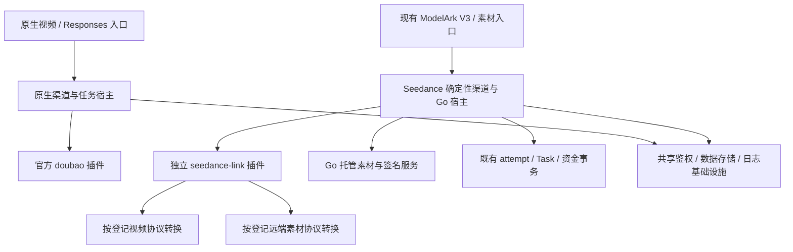

# Seedance 独立插件迁移方案

## 1. 问题与目标

本方案讨论把现有 Seedance 专用渠道的 Provider 适配迁为独立插件，与官方 Doubao 插件并列运行。
目标是减少供应商协议变更对 Go 业务代码的影响和未来接取上游的冲突，同时保持客户 API、素材和账务合同。

**建议采用：官方 Doubao 插件 + 独立 Seedance 插件 + 共享 Go 宿主。迁移的是协议实现载体，
不合并渠道，不迁移 Provider 账号或素材，不转换价格表达式，不接管原生 Doubao 计费。**

用户已确认两个渠道独立的方向，本次仅授权分析与编写方案。本文尚未实施，不是生产发布说明。
现有定价修复及其验证见[定价回归修复与 Doubao 渠道迁移评估](2026-09-09-Seedance定价回归修复与Doubao渠道迁移评估.md)。
该文评估的是“迁入 Doubao”；本文评估的是“保留 Seedance 身份、迁为独立插件”，两者不能混用。

### 1.1 成功标准

- 客户继续使用原 ModelArk V3、素材和模型发现接口，原客户模型、Task ID、素材引用保持含义。
- `ChannelTypeSeedanceLink` 保持 62，官方插件仍服务其原生渠道；双方定价、分发与生命周期不串用。
- 每一条迁移线路在相同冻结输入下，创建请求语义、响应投影、用量事实、预扣和最终 quota 均与迁移前一致。
- 新任务可以明确选择已发布插件版本，历史任务始终按创建时版本执行；升级、回滚、停用不能丢失履约能力。
- 已迁出的协议转换逻辑不保留两个用于新请求的实现，不新增通用脚本状态机、第二套账本或素材数据库。
- 真实 Provider、账单、三数据库及多节点灰度验证完成后，才允许将相应线路写为生产可用。

## 2. 当前实际情况

### 2.1 取证范围与可信度

本次以本地提交 `3f7e6f2a6` 的代码及当前架构文档为基线，检查了插件加载、任务适配、路由、渠道配置、
素材接口、协议枚举、Task/attempt 快照和计费接线。没有访问生产数据库，没有调用真实 Provider。
此前记录的本机 38 个价格名字、12 个渠道和历史任务核对只是上一轮取证，实施前必须重新生成清单，
不能视为当前生产规模或迁移许可。

当前代码证明 NewAPI 正在使用任务插件机制；本方案不据此推断其未公开的长期路线图。
“Go 渠道”和“插件”也不是互斥的技术栈：当前插件由 Go 宿主加载、执行和发送 HTTP，脚本负责适配。

已有总体文档中默认素材组仍有“待实现”等旧表述，而素材专题及代码已描述实现；缺用量计费也应读取
计费架构末尾的专门章节。本文以对应代码和更精确专题交叉核对，不把旧概述作为迁移行为基线，
不在本次顺手改写其他事实文档。

### 2.2 当前边界及迁移含义

| 项目 | 当前可验证事实 | 对本方案的影响 |
| --- | --- | --- |
| 官方 Doubao | `plugins/tasks/doubao/plugin.js` 声明 `doubao`，渠道 54/45，固定的视频请求与用量接口 | 保持原插件及其语义；同一上游模型可由不同业务渠道提供 |
| Seedance | `relay/relay_adaptor.go` 先按 62 返回 Go Seedance adapter，明确绕开 JS 任务注册表 | 不能仅上传脚本或修改 `channelTypes` 就完成迁移 |
| 客户入口 | ModelArk V3 创建、单项、列表、删除，以及 `/v1/assets`、`/v1/asset-groups` | 已有 Go Router 继续作为入口，不增加客户 URL 前缀或要求改 SDK |
| 原生插件宿主 | 内置 `openai_responses`、`openai_video`，另支持插件自定义路由 | 自定义路由不等于具备 Link 的资金、素材及确定性路由合同 |
| JS 引擎 | Sobek，同步 hook，禁止 import/async/await；默认执行超时 5 秒、每个 Engine 并发 8，执行计时不包含取得槽位前的排队 | 不代表全局 HTTP 并发或视频时长上限；须分别验收排队和执行容量，见 §8.3 |
| 插件版本 | `TaskPlugin` 按 key/version 存源码，拒绝同版本不同源码；支持激活和跨节点修订同步 | 复用已有存储和引擎，不另建插件平台 |
| 版本执行 | Task 记录插件版本审计；通用适配获取仍按 platform/当前 registry，原生轮询接口以 platform 为入口 | 审计版本不等于生命周期固定执行版本，需新增精确解析接线 |
| 版本删除保护 | 删除仅在 `plugin.Active && !taskPluginHasFactory(key)` 时检查引用；非 active 版本及有 factory 的版本跳过该检查；删除/停用均有 force 绕过在途检查的路径 | 现有引用查询也未覆盖 62、attempt、成功待结算及内容/删除依赖；Seedance 须按 key+version 检查所有版本，禁止绕过仍有执行依赖的版本删除保护 |
| 视频协议 | 11 个代码注册协议 | 逐协议验收，不能只验证截图中的单模型或官方 ModelArk |
| 素材协议 | 10 个枚举，包含 `none` 和本站托管图片 | 8 类远端素材协议分别验收；托管路径是宿主资源服务，不是远端素材插件 |
| Link 计费 | `c`、`param("_task.*")` 及请求规则；保留现有换算、预扣、补扣和等待用量 | 不能因脚本提供用量就进入原生 `TaskUsageBilling` 分支 |

主要证据：
[插件定义与校验](../../pkg/jsplugin/registry.go)、[引擎](../../pkg/jsplugin/engine.go)、
[宿主路由](../../pkg/jsplugin/routing.go)、[插件协议 Router](../../router/task-plugin-protocol-router.go)、
[适配分流](../../relay/relay_adaptor.go)、[Task 快照](../../model/task.go)、
[插件版本存储及引用查询](../../model/task_plugin.go)、[插件删除控制器](../../controller/task_plugin.go)、
[轮询](../../service/task_polling.go)、[Link 冻结版本校验](../../service/task_video_polling_link.go)。

### 2.3 本次定价问题对迁移的约束

此前回归有两个独立原因：价格元数据按模型名/映射误认插件身份；共享异步计费接线误接管原生用量快照。
换成两个 JS 文件不会自动消除它们。迁移继续保留已有渠道身份隔离、价格键冲突保护、编辑器保真与
原生/Link 结算边界；不得为了“支持插件”删除这些保护。

同一个 Provider 模型可以被两种渠道使用，但当前价格表按客户模型名索引。Seedance 与原生渠道不能
共用产生计费合同冲突的客户价格键；该规则包括停用配置，不能等到重新启用时才暴露错配。

## 3. 优化方案：目标架构与职责

### 3.1 唯一推荐路径

独立插件建议 key 为 `seedance-link`（拟议名称，实施时先查重），保留 62 与现有视频/素材协议标识。
它是一个受技术人员维护的适配包，内部按明确协议选择函数；不是每个模型一个插件，也不是每个
Channel 一份脚本。管理员继续选择代码登记的协议，不获得编写映射或状态脚本的业务入口。



“共享宿主”表示复用现有基础设施，不意味着把原生和 Link 的所有资金策略统一成同一分支。
插件不直接写余额、Task、attempt、素材表，不决定退款或自动重试，不持有数据库连接。

### 3.2 职责与唯一权威

| 事项 | 唯一权威/执行方 | 插件承担的部分 |
| --- | --- | --- |
| 北向 API、DTO、权限、模型唯一性、渠道选择 | 现有 Link Go Router/middleware/service | 接收校验后的类型化请求，不重选模型/渠道 |
| 协议枚举、Provider 模型登记、视频/素材配对、普通素材组策略 | 现有代码注册与保存校验 | 精确协议到 hook 的实现；发布时校验覆盖关系 |
| Provider 请求、响应字段及业务码 | 已发布版本的协议 adapter | 路径/正文/必要头、解析和协议观察分类 |
| HTTP 发送、代理、凭据、超时和重定向 | Go transport | 返回受校验的请求描述；不自己发网络请求 |
| 素材签名和二进制上传 | Go 提供受限签名/流式 transport | 提供协议所需操作与字段；不把文件塞入 JS 状态 |
| 用量 | 插件采集，Go 校验并写入现有归一事实 | 明确数值、是否报告、字段来源与异常信息 |
| 价格、请求倍率、quota 与资金状态 | 现有 Go 计费实现与冻结快照 | 不返回最终应扣金额，不执行乘价和资金变更 |
| 北向结果、错误脱敏与资源访问 | 现有宿主投影和内容入口 | 输出受约束业务结果，不原样透出 Provider 响应 |
| 版本发布与运行时加载 | 现有插件存储/引擎加 Seedance 专属接线 | 作为不可原地替换的发布制品 |

继续以 [协议枚举](../../relaykit/dto/upstream_protocol.go)、
[普通素材组策略](../../relaykit/dto/asset_group_policy.go)、
[渠道校验](../../model/channel_seedance_settings.go) 为管理合同权威。迁移首期不把这些登记复制到可由
插件自行扩张的另一套模型能力表。插件 handler 清单只是实现清单，发布校验必须证明该版本覆盖本批登记。
纯转换修复可以更新插件；新增模型/协议或改变北向资格仍需现有代码登记及审核。该限制是明确取舍。

### 3.3 与现有插件机制的接入方式

保留 Seedance Go adapter 作为宿主入口，将已迁移协议的转换委托给同一 `pkg/jsplugin.Engine`。
复用 `TaskPlugin` 版本存储、发布同步和审计，增加 Seedance 专属的加载与 hook 校验接线。
不要直接实例化现有通用 `relay/channel/task/jsplugin.TaskAdaptor` 代替整个 Seedance adapter：
其请求形状、用量合并和任务处理并非 Seedance 合同。

现有 `CompilePlugin` 无条件要求通用任务 hook，meta 还要求 models 等字段。因此一个只提供 Seedance
扩展的脚本目前不能假定可直接上传。实施须提供一个明确的、受版本约束的宿主扩展登记点，完成
Seedance 导出校验与管理装载；不能塞入空壳通用 hook 来骗过校验，也不能删除原生插件必需校验。
具体字段名/API 版本由技术验证后确定，本文的 hook 名称只表示职责，尚不是新增公共插件 API。

优先通过新增本地文件注册扩展，原生文件只留必要调用；不另造 JS 引擎、版本表或管理页面。
Seedance 插件无需声明或抢占已有 HTTP 路由，也不声明原生 `openai_video` / `openai_responses` 资格。
插件元数据不能让 62 写入原生 Ability、通用分发缓存或原生模型匹配索引。

当前 registry 的 `byModel` 是全局按模型名字组织的索引，并不表达 Seedance 的渠道/协议边界。
必须区分[索引构建](../../pkg/jsplugin/routing.go)的三类行为：

- 模型名完全相同：`byModel` 保留按插件 key 排序后先登记的插件，大小写归一索引接受相同拼写；
  **不会仅因完全同名而报错**，但存在业务归属被另一插件占用的风险。
- 模型名仅大小写不同：归一后相同而原拼写不同，构建返回冲突。渠道、路由和协议端点还各有独立冲突规则，
  不能把这些冲突都归因于模型同名。
- 注册表存在逐插件准入与部分发布路径：可排除冲突插件并继续发布其他插件；某些更新还会保留该 key 的
  旧执行对象。整体构建/准备失败时才保留旧 generation，不能概括为“同名阻断所有插件后续发布”。

**设计红线：Seedance 实现清单不参与原生模型候选索引及原生端点资格登记。**
同一插件存储不意味着共享模型匹配资格。扩展装载必须在原生索引构建前区分宿主合同；不通过伪造模型名、
依赖插件 key 排序或放宽全部原生 models 校验规避问题。具体扩展函数/元数据形式留给 P1 验证，
不把“永远不能经过某个函数”作为实现约束。

P1 用完全同名、大小写变体、新名字及不同装载/启停顺序验证：原生 `GetByModel`、`CanonicalModel`、
端点候选、别名和价格元数据在装载 Seedance 前后保持相同结果。内部索引可辅助核对，但不能只断言私有 map
相等而遗漏 API 行为；同样不能把原生 generation 因正常发布而改变的编号当成失败。

首期不得发布触发原生任务用量编辑器的 `billing_usage_schema`。价格接口继续使用 Seedance 渠道投影，
保留当前表达式编辑器、Token 预扣设置及不能无损转换时保留原表达式的行为。

## 4. 视频 API 迁移合同

### 4.1 保持客户可观察行为

- 创建、单项查询、列表、删除、模型列表、结果与尾帧内容入口保持现有路径和鉴权方式。
- 列表继续读取本站 Task；不改成查询 Provider 列表。客户只看到平台 Task ID 和客户模型。
- duration、分辨率、媒体数量、role、缺省值、显式 `0`/`false` 和已发布字段语义与现有校验保持一致。
- 已发布但某 Provider 不使用的条件字段按合同忽略/转换；合同外私有参数仍明确拒绝。
- 不增加客户端幂等键、callback 或其他未发布能力；两次客户 POST 仍是两个创建意图。
- Provider 不支持删除、取消或尾帧时保持已登记的错误/不支持行为，不伪造成功。

### 4.2 最小 hook 责任

| 职责（拟议） | 输入 | 输出与限制 |
| --- | --- | --- |
| 构造创建请求 | 精确协议、Provider 模型、已校验请求与冻结参数；不含凭据 | 签名前 method/path/body/业务 headers 描述；无签名、凭据注入或网络副作用 |
| 宿主最终组装与签名（Go 阶段，非 JS hook） | 签前描述、冻结协议/连接、受保护凭据及协议所需时间/nonce | 最终字节与鉴权头/查询参数；签名后不再修改被签字段，详见 §4.3 |
| 解析创建结果 | HTTP 状态、必要响应头和响应正文 | 可信 task ID / 明确拒绝 / 不明确观察；不写 Task 或放款 |
| 构造查询与删除 | Task 冻结协议、task ID、连接上下文 | 单一确定 Provider 请求，不读取当前模型映射 |
| 解析任务观察 | HTTP 结果与冻结协议上下文 | 身份、状态、用量及来源、受控结果字段；区分缺失、零、无效 |
| 内容请求描述 | 冻结 task ID、受支持的 part | 受约束内容请求；宿主完成鉴权、SSRF、重定向与流式转发 |

用量归一应继续复用现有 Go 公共归一逻辑，插件只解开 Provider 包裹/定位候选字段；不得同时维护
两套 completion/total/prompt 推导。若某 Provider 必须专门解析，输出仍进入同一个类型化校验边界。

Go 宿主继续决定凭据允许发送到的地址、代理、头覆盖顺序和内容回源行为。插件返回的绝对 URL、
路径、跳转或 header 不能改变冻结 Provider 连接，也不能把视频 Key 发到素材/CDN 域名。
`Channel.base_url` 保持既有绝对 HTTP(S) 中转语义，不因脚本或 Provider 官网示例强制收紧为 HTTPS；
客户 source URL、内容回源与托管对象继续各自的安全约束。
错误与脚本 console 输出也纳入脱敏测试，不能仅检查成功响应；插件 state 只允许必要且受限的业务字段，
不得把原始响应作为便捷恢复状态保存。

插件异常也必须按“是否已允许/实际可能发送”分类。发送前构造异常不得扣留不必要资金；
`sending` 已提交且可能发出字节后的超时、脚本解析失败、空 ID，不得一律作为明确拒绝退款。

### 4.3 签名与凭据边界

对本次新增的 Seedance 插件合同，AK/SK、视频 Bearer Key、可复用鉴权 Token 不进入 JS 输入、state、
console 或异常文案。插件只输出签名前描述，Go 根据冻结协议选择已有签名器/鉴权方式，
不能由脚本任意指定凭据来源、签名服务或鉴权目标地址。该边界不反向改写原生插件的已发布输入合同。

宿主先完成已允许的参数/头覆盖、托管引用临时 URL 替换和最终序列化，确定 method、路径、query、
正文及相关头，再签名/注入凭据并发送。签名必须作用于真正发送的字节；不得签完再改正文或受签字段。
时间/nonce 按协议在发送附近生成，不把一次签名结果当成可复用的冻结凭据或恢复许可。

| 协议/字段 | 当前语义 | 迁移验收 |
| --- | --- | --- |
| 官方素材 Volc V4 | 规范化请求与正文摘要、时间和作用域参与签名 | 固定时间/凭据 fixture 下，分别断言签前描述与最终签名字节/头 |
| CMCC 视频 `Input-Has-Video` | 根据视频内容设置的业务头，不是加密签名 | 有/无参考视频时头语义一致，不混入素材签名器 |
| CMCC 素材 V2 | 方法、转义路径与规范化查询参数摘要参与签名，含协议专属时间与 nonce | 固定时间/nonce 的路径、查询、编码及签名精确一致，不能套用正文签名模型 |
| JWT（某协议确有需要时） | 对 claims 签名，不天然绑定 HTTP body | 验证该协议的 claims、有效期及注入位置，不把工具可用当成协议已支持 |

来源：[官方素材签名](../../relay/channel/task/seedance/assets/official_action.go)、
[CMCC 视频业务头](../../relay/channel/task/seedance/request_headers_cmcc.go)、
[CMCC 素材签名](../../relay/channel/task/seedance/assets/cmcc_aicc_v2.go)。
签名前后 fixture 使用明确的测试凭据，不采集生产凭据。签名/鉴权生成失败的资金处理由 Go 根据
持久状态和是否可证明未发送判断；一旦可能发送，不能用“脚本或签名异常”作为自动退款依据。

### 4.4 不改变事务顺序

```text
北向/协议校验、托管引用校验、请求构造及用量边界校验
  -> 固定插件版本、执行/计费探针与连接事实
  -> durable prepared
  -> 同一事务提交 hold + reservation（适用时）+ sending
  -> Go 完成最终请求组装、签名/凭据注入，transport 单次 Provider POST
  -> 可信 ID：Task + hold 转移 + attempt complete 原子提交
     明确拒绝：按现有可证明未创建的规则释放
     不明确：unknown，保留 hold，不自动重发/换渠/退款
```

JS hook 不能跳过此顺序。故障恢复继续通过已有 attempt 和 Task 执行，不建立插件自己的任务状态表。
不可采信的单次轮询保持既有核查语义；FunCloud 可见性窗口、Synlink 未识别状态等协议差异逐条保留。

## 5. 全部视频与素材协议迁移清单

以下是代码枚举与配对校验的覆盖表，**不是 Provider 生产认证表，也不是此次新增许可**。
`none` 是不启用素材控制面的配置；不自动否定该视频协议已有的 opaque 引用语义。
每行仍需检查该协议登记的全部 Provider 模型，以及每个 Channel 的全部客户模型映射。

| 视频协议 | 可配对的远端/托管素材协议（另可为 none） | 必须保留的差异与验收重点 |
| --- | --- | --- |
| `modelark_v3_volcengine` | `volcengine_assets_action_v2024_01_01` | ModelArk 视频、Action 素材签名、Project/Region、真人认证、实际用量 |
| `modelark_v3_byteplus` | `byteplus_assets_action_v2024_01_01` | 独立账号/Region 的素材租户；不借用火山连接与素材 ID |
| `modelark_v3_cmcc` | `cmcc_aicc_assets_v2` | 参考视频请求头、AICC 素材独立鉴权及响应错误分类 |
| `tokensave_media_task_v1` | `tokensave_assets_v1` | `/v1/media/*` 的请求与响应、素材 URL 有效期和组语义 |
| `moxing_media_task_v1` | `moxing_joycreator_assets_v1` | 与 TokenSave 不同的模型登记及素材域，不因共享 transport 合并身份 |
| `moxing_modelark_media_v1` | `moxing_volc_assets_v1` | ModelArk 形状与 media 路径组合、固定 Project 语义 |
| `ark_media_v1` | `ark_assets_v1` | `/v1/ark/media/*` 与素材接口，不能按标准 ModelArk 路径发送 |
| `feicai_videos_v1` | 无；使用 `none` | `/v1/videos` 转换、响应及内容回源、已冻结 adapter revision |
| `funcloud_seedance` | `funcloud_material` | V2 按模型区分创建路径、查询包裹、正用量要求及查询宽限规则 |
| `funcloud_modelark_v3` | `funcloud_material`、`funcloud_material_hosted` | submitted 等状态、固定真人模式字段、直接 URL/opaque/托管引用区别 |
| `synlink_video_v1` | `funcloud_material_hosted` | task 包裹、可信状态、尾帧、非本站 opaque 引用预扣前拒绝 |

配对权威：[渠道设置](../../model/channel_seedance_settings.go)、
[协议路径](../../relaykit/dto/upstream_protocol.go)、
[托管支持登记](../../relaykit/dto/synlink_video.go)。
实施时若代码文件或登记变化，以重新核对的注册表为准，禁止根据表中名称猜测 Provider 兼容性。

### 5.1 远端素材接口

保持现有 `Adapter`、`GroupAdapter`、`VerificationAdapter` 等职责，先迁远端请求/响应转换。
素材创建/查询/更新/删除、组创建/单项查询、真人认证会话创建/查询/结果分别验收；
`GroupSearchAdapter` 只用于管理端默认组查找，不成为客户列表接口。

普通组策略仍由 `GeneralAssetGroupPolicy` 唯一决定：显式非空 ID 优先且保持原值；空白/缺省才读默认组；
缺配置按既有错误返回；上游拒绝显式 ID 后不 fallback。默认组只由管理员手工创建/复用，升级不得自动创建。
无状态素材没有本地所有权索引；引用只送到选定 Provider，不扫描其他插件找资源。

Action 签名、移动云鉴权、第三方上传形状、TTL、分页完整性分别制作固定请求向量。
现有 JS 工具已有 HMAC/JWT/Volc V4 签名能力，不能声称签名工具完全缺失；但是否满足素材完整协议仍需验证。
Seedance 按 §4.3 强制由 Go 执行签名和凭据注入，已有 JS 签名工具不构成向新插件传递密钥的理由。
二进制、完整响应或 source URL 也不得存入插件 state。
多步认证和默认组分页由有界的宿主操作编排，不引入管理员可编程工作流。

依据：[素材接口](../../relay/channel/task/seedance/assets/adapter.go)、
[签名工具](../../pkg/jsplugin/utils.go)、[素材架构](../20-architecture/Seedance无状态素材代理架构.md)。

### 5.2 本站托管图片

`funcloud_material_hosted` 不迁成远端素材脚本；继续作为 Seedance 插件使用的 Go 宿主能力：

- `fhgrp_*`、`fhas_*`、对象位置和按 `user_id` 共享的事实保留，不搬对象、不改 ID、不建立新素材表。
- 创建时复制图片、媒体验证、存储位置检查、权限及删除行为由既有服务承担。
- 引用在 hold 前校验并冻结对象事实；发送时通过宿主生成临时 URL，不把签名 URL 放进 Task 或插件状态。
- FunCloud 非本站 opaque 仍按其合同透传；Synlink 的相同引用仍在 hold 前拒绝。
- 删除只拒绝新引用，已接受任务继续按冻结事实执行；不清理 OSS、不建立孤儿补偿。
- 托管图片未完成的真实 Provider/存储验收仍是独立发布阻塞项，插件化不能改变该状态。

### 5.3 素材租户保持不变

迁移不更改 Channel ID/type、Base URL、Key、Project、Region、视频/素材协议标识、默认组 ID、租户
identity 或 `reuse_scope`。不能为了标记“已经插件化”触发替换素材租户，也不能复制渠道来规避类型限制。
如迁移需要改变这些语义，应拆为独立的租户变更，按现有管理员确认和审计流程处理，不能并入自动迁移。

## 6. 价格与计费零改义方案

### 6.1 本次不转换表达式

Seedance 插件继续提供现有计费探针与归一用量，交给原 Link 结算；不得设置原生 `TaskUsageBilling=true`。
保留 `ModelBillingMode`、`ModelBillingExpr`、`preconsume_tokens`、固定价格、倍率与合同折扣的现有存储。
原生 Doubao 的 `u()` 表达式和任务用量语义保持独立。

例如 $5/百万 Token，预扣 200000 Token，实际 100000 Token，组倍率和折扣均为 1：

| 路径 | 表达式/换算 | 预扣美元 | 最终美元 |
| --- | --- | --- | --- |
| 现有及迁移后的 Seedance | `c * 5`，结果经既有规则除以 1000000 | 1.00 | 0.50 |
| 原生 Doubao | `u("tokens") * 5 / 1000000`，表达式已输出美元 | 1.00 | 0.50 |

上例仅解释单位，不代表任何 Provider 实际单价。最终 quota 使用现有 checked 换算和舍入顺序，
不能在 JS 内乘价格后再让 Go 重复换算。仅替换变量名会造成百万倍错误。

### 6.2 必须验证的资金链

| 场景 | 迁移后必须保持的结果 |
| --- | --- |
| 依赖用量表达式缺预扣预算 | Provider POST 前拒绝，不自动改零、不绕过 hold |
| 余额/Token/订阅额度不足 | hold 事务失败，不发送请求；无部分扣费 |
| 成功实际费用低于预扣 | 原子退差额，重复查询不重复退款 |
| 成功实际费用高于预扣 | 冻结资金来源补扣；确实不足进入 debt，业务保持 SUCCESS |
| 成功尚无可信用量 | 适用 Seedance 协议保持 awaiting_usage，保留预扣并继续补查，不写零费用 |
| 明确零/缺失/无效用量 | 三者区分；官方/V3 明确零与 FunCloud V2 正用量约束分别保留 |
| 按秒/按次/纯参数表达式 | 保存 Token 证据也不改变冻结计价单位；不错误等待 Token |
| 失败、取消、过期等可信终态 | 按原有生命周期条件进入一次原子退款，不进入成功 Token 结算 |
| unknown 或单次不可信查询 | 不自动退款，不重新发送，保持原核查规则 |
| 价格、组倍率、折扣、渠道在任务中途变化 | 使用冻结快照；不读取新价格重算历史 |
| 用量后续发生矛盾 | 保留首份已接受用量与目标，差异进入现有审计，不二次改账 |

所有数字经 Go 验证有限、非负、单位和上界；区分缺省和显式零，拒绝 JS NaN/Infinity、非整数计数
及超出协议/安全界限的值。quota 继续使用 checked 饱和函数并写管理员审计。
JS Number 的安全整数范围不是计费许可上界，不能以“能解析”为有效性标准。

依据：[表达式合同](../../pkg/billingexpr/expr.md)、[Link 计费校验](../../setting/billing_setting/task_billing.go)、
[探针](../../relay/channel/task/seedance/billing_probe.go)、[冻结结算](../../service/task_tiered_settle.go)、
[计费事实架构](../20-architecture/账单计费-异步任务与计费事实架构.md)。
`param("_task.*")` 的完整实现链为：Seedance adapter 生成探针，
[预扣入口](../../relay/helper/task_tiered_price.go)封装为 `{"_task": probe}` 写入求值请求，
[表达式运行时](../../pkg/billingexpr/run.go)的 `param(path)` 用路径读取该正文。
`task_billing.go` 负责配置校验，不是 `param()` 的函数实现位置。

## 7. 版本固定、存量任务与回滚

### 7.1 版本持久化不是版本执行保障

复用已有 `TaskExecutionSnapshot.TaskPlugin` 表达插件身份，不再新增同义 plugin key/version 字段。
现有 `SouthboundAdapterVersion` 表达线协议 revision，插件 version 表达发布制品，两者职责不同。
新任务须在 prepared 前固定插件 key/API version/version，并写入 attempt 恢复模板及正式 Task。
沿用已有模板转移机制；不得只在成功创建后记插件版本，遗漏 unknown 恢复。

Seedance 后续查询、用量补查、删除、内容回源与恢复必须通过冻结版本解析器获取执行对象，
不使用当前 registry active 版本替代。进程 generation 只用于审计，不能作为跨节点版本标识。
复用 key/version 的源码不可变约束；源码校验属于已有插件制品完整性，不引入 Link 内容 hash 资格系统。

内置插件版本也需要可跨部署恢复的制品。首个 Seedance 生产版本须落入已有版本存储，或提供经验证的
持久发布包解析方式；仅依赖新镜像中“当前内置文件”不够。优先复用已有 `TaskPlugin` 存储。

### 7.2 发布、停用与删除

- 发布先验证 hook、协议覆盖、构建版本、fixture 和节点装载；激活只影响尚未开始的新请求。
- 一次创建调用只使用一个已固定版本，即使中途激活别版，也不混用构造、解析、探针和恢复模板。
- 当前版本停用阻止新受理；已有任务和 attempt 仍可通过冻结版本完成。安全事件需要强制暂停执行时，
  保留状态和资金，转人工处置，不自动回退至另一版、Go 或 Doubao。
- 删除保护必须按 `key + version` 检查全部版本，包括非 active 版本及有 factory 的版本，覆盖
  未解决 attempt、活动 Task、awaiting_usage、debt、failed 资金补偿，
  以及仍需该版本完成查询/删除/内容服务的历史 Task。不能只检查业务非终态。
- 创建的 prepared 持久引用与版本删除必须在数据库事务中通过同一精确版本锁串行化；
  控制器预检查或 POST 前重复查存在性不能替代此约束。引用查询先读 attempt 再读 Task，
  防止原子转移期间跨语句漏查。锁不跨 JS 执行、HTTP 或后续资金 hold。
- 复用权威终态集合，UNKNOWN 仍属活动状态。已结算的失败、取消、过期任务释放依赖；
  可见 SUCCESS 的单项 GET 仍刷新冻结插件，因此不能仅按 settled 排除。管理引用数同时包含
  Task 和 attempt；停用、编译失败也必须显示，查询错误不能投影为零。
- 首期禁止删除仍被 Seedance 生命周期引用的版本，不能沿用可绕过检查的 force 删除。
  纯审计历史引用与执行依赖需明确区分；不能为了垃圾回收先假定成功任务无依赖。
- 停用新受理与停用历史执行分别处理：前者可以正常操作；任何 force/cascade 操作均不能隐式删除或
  切断 Seedance 冻结版本的历史执行能力。安全事件强制暂停遵守前述保留状态、资金和人工处置规则。
  这些保护只接入 Seedance 扩展，不借本次迁移改写全部原生插件的管理策略。
- 编译失败必须显形；失败的 active 制品停止新受理，不静默采用旧缓存并报告健康。
  已 pin 的执行对象不被改写，后续无法解析冻结版本时保留任务与资金并走既有对账路径。
- 多节点以持久插件修订和版本就绪状态核对；缺版节点拒绝新受理/暂缓对应恢复，不使用“本机最新版”。
  不新增业务请求时模型唯一性扫描，版本装载检查与渠道唯一性是不同边界。

### 7.3 存量任务及旧 Go 实现的退出条件

不改写既有 Task 的 platform、协议 revision、价格或连接，不把缺少插件快照的旧任务伪装成新插件任务。
旧任务继续通过已登记的 Go adapter version 完成，新任务在切换后使用明确插件版本。
这是对真实冻结版本的履约，不新增历史 JSON decoder、deprecated alias 或失败 fallback。

迁移前优先排空本批活动任务；unknown、awaiting_usage、欠费和资金故障单列，不为切换强行退款/标结算。
排空活动任务仍不代表可以删除 Go adapter：成功任务可能还需尾帧、内容或删除操作。
只有证明某旧版本无执行依赖，才能删除该版本的转换代码；否则保留有明确引用范围的旧执行代码，
禁止新请求选用。不得为了“全部 JS”牺牲已承诺的历史生命周期。

### 7.4 回滚的实际边界

| 所处阶段 | 可执行回滚 | 禁止做法 |
| --- | --- | --- |
| 新插件尚未受理任务 | 撤销激活/退回上一宿主发布 | 改价格或素材配置掩盖接口问题 |
| 已有新版本 attempt/Task | 暂停本批新受理，恢复上一已验证版本服务新请求；新宿主继续履约已冻结任务 | 回滚到不识别新快照的旧二进制；把已发送请求交给旧版重发 |
| 某插件版本不能安全查询 | 暂缓该版本调用，保留资金并人工核查；部署能保持该版本语义的修复 | 自动换最新版、换 Provider、退款 unknown |

首个迁移批次前必须有能读取新快照、保留冻结执行能力的回退发布包。即使同版本源码不可替换，
也不能通过改写 Task 版本来掩盖缺陷；需要改变冻结语义的事故修复须另行按任务与账务证据评审。
回滚不恢复旧数据库快照覆盖新产生的资金记录，不回滚已发生的消费或 Provider 创建事实。

## 8. 实施批次与放行条件

每批是完整可验收的协议组合；同一请求只选择一个实现。灰度按明确登记的协议/发布批次进行，
不新增客户模型推断、随机切流、渠道级任意脚本选择或永久 Go/JS 双开关。
宿主的本批代码登记明确哪些协议已迁移；未迁协议继续当前 Go 实现，已迁协议缺少插件/hook 时失败关闭，
不能临时回到 Go。新插件包只宣称实现已验收的迁移集合；每次扩大集合都校验实现清单与宿主登记一致，
不要求首个包伪装成已覆盖全部 11 个协议。

| 批次 | 工作 | 放行条件 |
| --- | --- | --- |
| P0：冻结基线 | 重新导出脱敏渠道/模型/价格矩阵；梳理全部生命周期入口和原生接线点；准备版本回退包 | 现有修复验证完成；每个价格键、协议、素材租户与存量执行依赖均可对照 |
| P1：宿主接入验证 | 同一引擎、存储和控制面增加 Seedance 扩展；完成索引隔离、固定版本、attempt 转移、全版本删除保护、宿主签名及容量验收 | 确定性 fixture 证明资金/单次发送全过程；签前后向量一致；排队有界且容量满足基线；未切生产渠道，原生 Doubao 无行为差异 |
| P2：首个独立视频协议 | 建议从 `feicai_videos_v1 + none` 做工程候选，因不涉及远端素材管理；最终选择仍取决于可用验收环境 | 该协议全部已登记模型、内容/生命周期和账单等价；先非生产验证，再批准小批灰度 |
| P3：远端素材全链路 | 选择一组完整视频+远端素材组合验证 hook 后，覆盖 TokenSave、两种 Moxing、Ark、官方火山/BytePlus | 每组独立通过素材创建到视频引用、默认组、认证（支持时）、删除及账单验收；未迁组继续现有实现 |
| P4：特殊协议 | 移动云动态头/签名、FunCloud V2/V3、Synlink 与托管引用 | 覆盖观察分类、用量信任、托管权限与尾帧；没有真实证据的能力仍不发布 |
| P5：完成与收敛 | 删除无引用的旧转换和临时试验代码；固化维护入口、发布/回滚操作与回归矩阵 | 所有目标协议验收完成；遗留 Go 版本逐项列依赖；按授权更新事实文档并归档方案 |

不承诺固定工期：P1 的宿主接入、生命周期版本保障和真实 Provider 验收是主要工作量。
P1 若只能通过大范围侵入原生 Router/计费实现才能实现，应停止扩大迁移，优先推动上游扩展点，
保留现有 Go 实现继续服务。插件化带来的维护收益必须高于新增宿主补丁成本。

### 8.1 全量盘点字段

实施时对全部启用和停用的 62 渠道记录：客户模型、最终映射的登记结果、视频/素材协议、素材策略、
定价模式、是否依赖实际用量、预扣配置状态、表达式保真校验结果、目标批次与验证状态。
渠道身份仅用于受保护内部清单；普通报告不包含密钥、URL、Project/Region、原始素材 ID 或 Task 私有数据。

单独记录跨原生/Link 价格键冲突、未配置渠道的价格条目、未定价模型及无法按当前合同解释的历史任务。
不自动改名、套用相邻模型价格、填预扣预算或启用停用渠道；有待处理项的线路不进入切换批次。

### 8.2 预期修改面与上游冲突控制

| 区域 | 预期改动 | 必要性与控制方式 |
| --- | --- | --- |
| Seedance 专属 adapter/service | 新增插件调用、请求/结果类型校验与协议版本分流 | 主体放本地新增文件；最终删除无依赖的旧转换 |
| `pkg/jsplugin` | 最小扩展登记/校验接线，复用引擎与现有 Meta 机制 | 现有强制通用 hook 无法承载全部职责；不得改坏原生 v1 合同 |
| 插件 model/controller | 复用版本存储，补 Seedance 引用保护和控制面校验 | 主逻辑新增文件，现有管理入口保留窄调用；不另建版本表 |
| Task/attempt 快照接线 | 复用现有插件身份字段及恢复模板 | 优先不加列；确需新增字段时单独说明并验证三数据库与回退 |
| `relay/relay_adaptor.go` 与轮询/内容接线 | Seedance 局部分支连接冻结版本宿主 | 不改变原生选渠；把版本解析主体留在本地文件 |
| 协议注册与公开元数据 | 首期保留现有权威，新增版本装载一致性校验 | 禁止复制逐模型能力、组策略或价格身份推断 |
| 前端 | 复用插件管理；必要时展示 Seedance 版本/停用限制 | 不重做价格页，不暴露 Provider 私有参数；新增文字须补全部语言 |

这些是预计接线区域，不构成大范围重构授权。实施 PR 必须逐个列出实际原生文件的必要性、最小接线和
未来上游同步影响，遵循[硬约束](../00-context/硬约束.md)及[上游合并指南](../30-engineering/上游代码合并指南.md)。
`relaykit` 保持独立构建，不依赖根模块插件存储或运行时。

### 8.3 JS 容量、排队与超时

当前[引擎](../../pkg/jsplugin/engine.go)默认执行超时为 5 秒、每个 Engine 并发 8。
普通 `Call`/`CallPath` 先等信号量，取得槽位后才开始执行超时计时；排队由调用 context 约束，
并不自动包含在这 5 秒内。已有 `CallPathWithAdmissionTimeout` 可以单独限制等待槽位时间，优先复用。
同一版本、同一 Engine 的创建/解析/查询等 hook 共享容量；不同 Engine 不共享该信号量，
因此还要考虑并存版本和多节点的总 CPU/内存需求。

此并发限制不覆盖视频生成全过程，也不是全局 HTTP 并发限制。当前
[用量补查](../../service/task_usage_recovery.go)每轮最多顺序处理 10 个任务，不能仅凭扫描
SUCCESS+awaiting_usage 就断定会同时提交大量 hook。创建流量、普通轮询、主动查询及素材请求叠加后的
争用仍需验证；本方案尚无实测证据证明默认并发 8 足够或已经成为瓶颈。

P1 的容量交付必须包含：

1. 以实际协议 fixture 和有代表性的输入大小测量 hook 执行耗时分布、分配内存及冷/热装载差异；
   基于预计创建/轮询/素材请求率和每次操作调用次数估算突发需求，记录环境与测量结果。
2. 分别记录等待槽位耗时、hook 执行耗时、HTTP 耗时、并发占用、排队/执行超时及补查积压年龄，
   不以整体请求延迟代替各阶段指标。
3. 所有运行时调用有明确总期限及有限的准入等待；断言容量耗尽、取消、异常后槽位释放，
   不因 context 无期限而无限等待。用确定性同步测试验证这些合同，不用 sleep/随机循环伪造容量测试。
4. 在 hold 前因排队超时拒绝创建时不产生资金或 Provider 副作用；可能已发送后的解析超时保持 unknown
   等既有规则；查询超时不制造失败退款。容量不足不能成为自动重发理由。
5. 根据测量决定 Seedance 登记点是否覆盖 `Options.Timeout/Concurrency`，同时确认宿主总容量预算。
   不预先增大并发或延长超时，不修改全部原生插件默认值，不新增第二套 JS 引擎或调度系统。

缺少负载基线、排队上界或超时资金语义验证时，P1 不放行生产受理；参数建议和灰度阈值必须带实测依据。

## 9. 验证计划与上线闸门

### 9.1 自动化验证矩阵

| 层次 | 必须覆盖的可观察不变量 |
| --- | --- |
| 协议转换 | 每个协议/登记模型的正常与边界请求；缺省/显式零、角色顺序、路径、头、签名正文完全匹配 |
| 索引隔离 | 完全同名、大小写变体、不同顺序和启停后，原生模型解析、端点候选、别名与价格行为保持一致；冲突不误归因于完全同名 |
| 凭据与签名 | 测试凭据下签前描述和签后请求分别精确断言；最终字节不再被覆盖；JS 输入/state/日志/异常不含凭据 |
| API | 原路径、鉴权/隔离、HTTP 状态/错误、平台 ID、列表分页、删除/内容/尾帧；不出现原生入口串用 |
| 素材 | 显式组/空白/默认缺失、错误 ID 不换渠、认证、不可支持操作、分页不完整不创建组、无源 URL 泄露 |
| 托管 | 跨用户拒绝、同用户共享、删除与受理交界、冻结对象、存储位置/媒体校验、签名 URL 不持久化 |
| 资金 | 第 6 节全部场景；钱包/订阅/Token/合同折扣、倍率、请求规则、舍入边界与溢出审计 |
| 耐久执行 | prepared/hold/POST/可信 ID/Task 提交各边界注入故障；POST 次数与余额精确断言 |
| 并发与恢复 | 重复轮询、用量补查并发、debt/failed 补偿、进程重启与跨节点接管只产生一次资金效果 |
| 插件版本 | 创建途中换版、旧版本查询、停用、缺版节点、active/非 active/factory 相关版本引用保护、force 不绕过 Seedance 执行保护、unknown 恢复、回滚后履约 |
| 容量与期限 | 有界准入、执行超时、context 取消与槽位释放；创建/查询/素材争用；超时不导致重复 POST、错误扣费或退款 |
| 定价回归 | 全量 Seedance 价格加载/保存/重开原样；原生 Doubao 用量结算不被接管；冲突仍失败关闭 |

差异测试仅把同一份确定性 fixture 分别送给旧转换和新转换，比较结构、用量、错误和 quota。
**不得为影子对比向真实 Provider 创建两次任务、创建两份素材或删除两次资源。**
相同输入的价格测试必须断言最终整数 quota 精确相等；有意改变 Provider 语义则拆为独立功能变更。

自动测试优先落在现有回归边界：`relay/channel/task/seedance`、`assets`、`service/task_*`、
`model/task_*`、渠道与价格校验、前端 Seedance 定价边界测试。使用确定性表驱动及真实资金状态断言，
不以 mock hook 被调用或覆盖率作为通过条件。

### 9.2 工程检查

实施时先跑受影响的窄边界，再执行必要整体验证：

```bash
go test ./model ./middleware ./controller ./service ./relay/... ./setting/billing_setting ./pkg/billingexpr ./pkg/jsplugin ./router
go vet ./model ./middleware ./controller ./service ./relay/... ./setting/billing_setting ./pkg/billingexpr ./pkg/jsplugin ./router
```

涉及 `relaykit/` 时另执行 `cd relaykit && GOWORK=off go build ./...`，并运行受影响 DTO 测试。
涉及前端时按项目入口执行 Bun test/typecheck/lint/build 与 i18n 检查。
数据库快照/事务/版本删除查询在 SQLite、MySQL、PostgreSQL 都须验证；本地 SQLite 通过不代表三库通过。

### 9.3 真实 Provider 与灰度

每个实际迁移的协议组合至少验证一条完整视频成功链、一条可安全构造的明确拒绝链、实际用量和账单核对；
支持素材的还要验证创建→查询→视频引用→单素材删除，支持认证的单独验证认证链。
按模型区别收费、时长、内容形状的分支必须分别覆盖，不能用同组一个模型代替全部模型验收。
结果不明确、解析异常和网络中断通过可控环境验证，不为故障测试在生产重复产生高额任务。

灰度观察覆盖：创建拒绝与 unknown、不可采信观察、awaiting_usage 积压、预扣/结算差额、debt/failed、
重复资金记录、素材错误以及冻结版本缺失；同时记录 JS 排队/执行耗时、准入/执行超时、并发占用、
CPU/内存和用量补查积压年龄，与独立 HTTP 耗时区分。先记录同线路基线与合理完成窗口，再确定具体告警阈值；
金额差异、重复 POST/扣款、渠道串用、素材越权或敏感信息泄露任何一项即暂停新受理。
恢复决策遵守第 7 节，不把停止灰度等同于退款或撤销已发生的 Provider 操作。

## 10. 风险、剩余决策与本次交付

| 优先级 | 风险/待确认项 | 处理与阻塞范围 |
| --- | --- | --- |
| 阻塞 | 同一 JS 文件能否通过最小扩展承载视频和素材，且不进入通用分发/计费 | P1 原型证明；不能实现则保留 Go，不伪造通用 hook |
| 阻塞 | Seedance 模型进入原生索引导致归属占用或特定声明冲突 | 按 §3.3 隔离；验证原生可观察结果不随装载/启停改变，不假定完全同名必然硬失败 |
| 阻塞 | 精确版本执行、attempt 模板及历史内容操作仍依赖当前版本 | 全入口测试通过前不接受首个插件生产任务 |
| 阻塞 | 原生/Link 单位混用、零/缺失用量混用、错误退款 | 保留现有计费引擎与语义，逐项精确金额验证 |
| 阻塞 | 控制面删除/停用遗漏 62、非 active 版本、unknown 或成功待结算任务 | key+version 全版本引用保护，无强删绕过；新建停用与历史执行分离 |
| 阻塞 | 签名阶段不明确或密钥流入脚本 | Go 最终组装/签名/注入，签前后向量精确一致，凭据不进入 Seedance JS |
| 阻塞 | 缺少容量基线、排队无限期或超时误退款 | §8.3 验收，按实测决定独立参数；不能据默认并发 8 宣称已有瓶颈 |
| 高 | 素材迁移意外改变租户、组策略或托管隔离 | 配置不改义，双协议及引用全链路验收 |
| 高 | 多节点版本不同步、旧二进制无法识别新快照 | 切流前版本就绪；保留可履约新快照的回退包 |
| 高 | 第三方协议与真实账单尚未验证 | 按协议/模型单独阻塞，不借插件化宣称生产可用 |
| 中 | 宿主扩展比 Go adapter 本身更难维护 | P1 评估原生修改面，必要时先推动上游扩展点 |

本文已确定推荐边界、全协议覆盖清单、迁移批次、计费等价要求、存量处理和回滚限制。
仍需在实施前确定：扩展导出的精确类型、首批可用 Provider 验收环境、生产执行依赖清单、发布与
回退包版本，以及真实灰度观察窗口。这些不通过模型名字或本机历史样本推断。

本次只新建本方案，未修改业务代码、公开 API 文档、配置、价格、资金或素材，未执行迁移。
本次文档验证：`task docs:check`、`task ai:check` 通过；逐项检查本文相对文件链接。
评审核查时复跑 `TestRegistryExcludesConflictingPluginWithoutBlockingGeneration`、
`TestPerProtocolModelsStillConflictOnOverlap`、`TestRegistryRetainsIncumbentWhenUpdatedPluginConflicts`
三项既有测试通过，证明当前冲突排除/部分发布与保留旧对象行为，不构成 Seedance 插件迁移验收。
以上实施测试、真实 Provider 和账单验收均属于待执行项。
