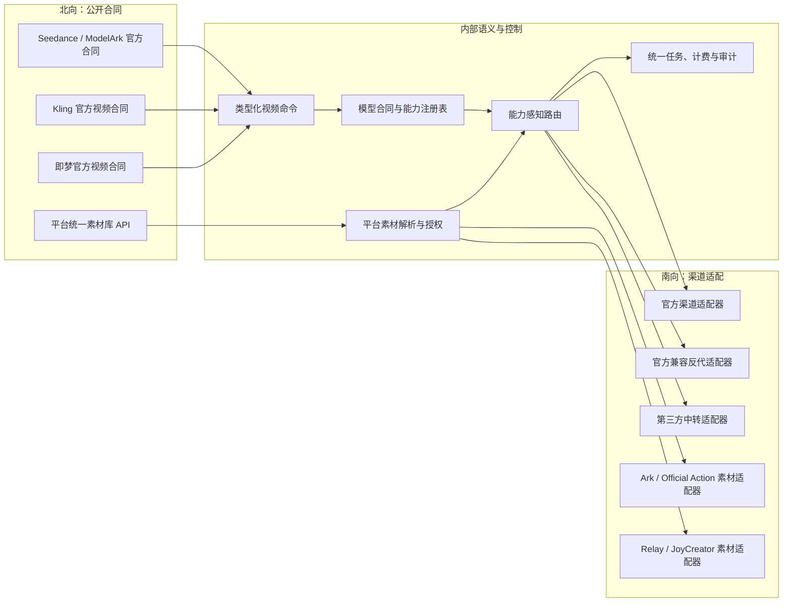

# 视频官方北向与统一素材库合同重构方案

> 本文保留重构步骤与完成清单。当前总合同以[媒体北向合同与南向适配架构](../20-architecture/媒体北向合同与南向适配架构.md)为准，专题细节见[视频上游接入与异步任务架构](../20-architecture/视频上游接入与异步任务架构.md)和[素材代理与真人授权架构](../20-architecture/素材代理与真人授权架构.md)。

## 1. 文档定位

本文是针对当前工作区代码的实施级重构方案，用于落实 `docs/00-context/硬约束.md` 中“视频与素材库 API 对接要求”：

- 视频是模型数据面：每个公开模型或 SKU 的北向请求、响应、错误、异步任务生命周期均以该模型厂商的官方合同为准。
- 同一公开模型或 SKU 无论命中官方渠道、反向代理还是第三方中转，北向合同必须完全一致。
- 渠道字段、鉴权、路径、状态、素材 ID 和能力差异只能存在于南向适配层。
- 素材库是平台控制面：只提供一套平台统一、供应商无关的 API 和资源标识。

这里的“视频北向统一”不是把所有厂商的视频模型强行改造成一套自定义协议，而是：

1. **同一模型或 SKU 统一**：一个公开模型只对应一个官方北向合同，不因渠道变化而变化。
2. **当前只维护三类官方合同**：Seedance 使用其 ModelArk 官方合同，Kling 和即梦分别使用各自官方合同。
3. **内部统一承接语义**：官方北向请求进入系统后转换成类型化的内部语义，再由南向适配器翻译成具体上游协议。

当前产品不再接入 OpenAI 视频模型。OpenAI 视频模型已经下架，因此 `/v1/videos` 不属于目标北向架构，不新增模型、渠道或兼容适配；仅在迁移期保留历史任务读取所必需的兼容代码，完成存量处置后退出公开路由。

本文给出重构边界、阶段、文件落点、迁移和验收标准，并记录 2026-07-28 的代码实施结果。图片生成协议由同目录的 `2026-07-27-NEWAPI统一图片接口生产级多渠道兼容方案.md` 单独覆盖。

### 1.1 当前实施状态

代码侧已经完成：三类官方入口类型化、正式路径去除 `metadata` 搬运、南向能力前置过滤、合同化错误、任务合同快照、OpenAI 视频创建/Remix 和平台旧创建入口下线、素材管理 target 供应商中立化及相关回归测试。

仍属于部署与运营动作、不能由本次代码修改代替的事项：使用真实凭据完成逐 profile 灰度验收；统计并退出 OpenAI 历史只读路由；在兼容窗口结束后移除 `joycreator_library` 输入别名；完成三种数据库的部署迁移演练。

## 2. 目标架构



目标调用链为：

> 官方北向 DTO 校验 → 类型化内部命令 → 模型合同/能力校验 → 能力感知路由 → 素材解析与南向 ID 改写 → 渠道适配器 → 上游

任何不支持的字段、输入类型或生命周期动作都必须在计费预扣和上游调用前，以当前北向官方合同规定的 4xx 错误返回；禁止在南向静默删除、忽略、钳制或改变含义。

## 3. 范围与非目标

### 3.1 本次范围

- 视频创建、查询、列表、删除、取消、内容下载等北向合同。
- Seedance（ModelArk V3）、Kling、即梦三类官方北向合同。
- 已下架 OpenAI 视频入口和历史平台自定义视频入口的边界收敛与退出。
- DoubaoVideo 官方、第三方反代、第三方中转三类南向 profile。
- 视频请求中的 `asset://ast_xxx` 解析、授权和渠道约束。
- `/v1/assets`、`/v1/real-person-authorizations` 及关联绑定接口的供应商中立化。
- 异步任务合同快照、状态归一、错误映射、幂等、计费和审计。

### 3.2 非目标

- 不建立一套替代所有模型官网合同的“平台统一视频协议”。
- 不接入或恢复 OpenAI 视频模型，不为 `/v1/videos` 新增渠道、适配器或新功能。
- 不因为代码中仍有 OpenAI 历史任务类型，就把它视为当前支持的视频合同。
- 不新建第二套异步任务、计费、渠道分发或素材存储系统。
- 不把供应商素材创建、授权、迁移等过程硬改成完全相同的工作流。
- 不调整图片生成北向合同。
- 不借本次重构整理无关目录、重命名公共类型或大范围重写现有热路径。

## 4. 当前实现基线

以下结论以 2026-07-28 当前工作区为准；“已具备”表示可继续复用，“差距”表示与最新硬约束仍有距离。

### 4.1 已具备的基础

| 能力 | 当前实现证据 | 结论 |
|---|---|---|
| 三类目标官方入口已有基础 | `router/video-router.go` 已包含 Seedance 使用的 ModelArk `/api/v3/contents/generations/tasks`、Kling 和即梦入口 | 应收敛为当前正式视频北向白名单 |
| Seedance 官方响应投影已隔离 | `controller/video_modelark.go`、`model/task_modelark.go` | 可继续作为 Seedance 北向合同基础 |
| 历史客户端协议留痕 | `model/task_video_lifecycle.go` 中已有 `openai_videos`、`modelark_v3`、`platform_video` | `openai_videos`、`platform_video` 仅用于历史任务兼容，不代表当前支持模型 |
| 南向 profile 显式配置 | `dto/video_upstream_profile.go`、`relay/channel/task/doubao/video_upstream.go` | 官方、反代、中转已具备明确适配边界 |
| 在途任务冻结南向信息 | `model/task.go`、`model/task_video_snapshot.go` 已保存 `VideoUpstreamProfile`、查询路径、代理等快照 | 可避免渠道改配影响在途任务 |
| 平台素材公共入口 | `router/asset-router.go` 暴露 `/v1/assets` 和 `/v1/real-person-authorizations` | 已有统一素材库 API 主体 |
| 素材平台 ID | `relay/asset_reference_resolver.go` 处理 `asset://ast_xxx` | 北向不需要暴露上游素材 ID |
| 素材权限与路由交集 | `middleware/asset_route_constraint.go` 校验所有权、绑定、模型、渠道和凭据指纹 | 可继续承担素材安全边界 |
| 素材南向适配器 | `relay/channel/task/doubao/assets/adapter.go` 及 Ark、Relay、Official Action、JoyCreator 实现 | 供应商差异已有南向容器 |

### 4.2 必须修复的合同差距

| 优先级 | 差距 | 当前证据 | 影响 |
|---|---|---|---|
| P0 | 视频内部仍通过通用 `metadata` 传递协议字段 | `relay/common/relay_info.go` 的 `TaskSubmitReq.Metadata`；`middleware/modelark_video.go` 将官方请求剩余字段放入 `metadata`；`relay/channel/task/doubao/adaptor.go` 再执行 `UnmarshalMetadata` | 类型边界不清，南向可覆盖或改变北向语义，难以证明合同一致 |
| P0 | 第三方中转存在按模型静默删字段 | `relay/channel/task/doubao/thirdparty/relay.go` 对 `doubao-seedance-2-0-260128` 将 `seed`、`camera_fixed`、`watermark` 置空 | 违反“不支持必须拒绝，禁止静默丢弃” |
| P0 | ModelArk 路由只判断 profile 合法，不判断本次请求能力 | `middleware/modelark_video.go` 的 `modelArkVideoProfileCompatible` 对所有已知 profile 均返回兼容 | 含视频、音频等输入的请求可能先命中不支持的渠道，失败位置过晚 |
| P0 | 南向构建错误被归类为服务端 500 | `relay/relay_task.go` 将 build-request 错误包装为 `build_request_failed`；`controller/task_protocol_error.go` 再投影 | 本应为合同不支持的 4xx 被误报为系统故障 |
| P0 | 同一公开 SKU 缺少可执行的“等价能力”约束 | 当前只有模型映射、渠道类型和 profile，没有按公开 SKU 描述字段、输入角色、生命周期动作的能力合同 | 无法阻止能力不等价的渠道加入同一 SKU 池 |
| P0 | 已下架的 OpenAI 视频创建入口仍公开注册 | `router/video-router.go` 仍注册 `/v1/videos` 创建、remix、列表、查询、删除和内容路由 | 可能继续形成新依赖，与“当前不接 OpenAI 视频模型”冲突 |
| P1 | 历史平台自定义视频入口仍公开 | `router/video-router.go` 的 `/v1/video/generations` 使用 `platform_video` | 新客户端仍可能依赖非官网合同，扩大长期兼容面 |
| P1 | 素材公共参数泄露具体供应商语义 | `dto/asset.go` 暴露 `target`；`service/asset_binding_service.go` 使用公共值 `joycreator_library` | 素材 API 尚未完全供应商中立 |
| P1 | 未识别的上游状态可能被当作进行中 | Doubao 视频结果解析对未知状态采用继续轮询的兼容策略 | 可能无限轮询，且无法按官方合同稳定投影 |
| P1 | 生命周期能力没有进入渠道选择条件 | 当前取消能力主要在实际执行时由 task lifecycle adaptor 判断 | 创建时无法保证同一 SKU 在取消、删除等动作上的一致性 |
| P2 | 路由合同测试不是严格白名单 | `router/video_router_contract_test.go` 主要断言部分入口存在 | 历史兼容入口或新自定义入口可能无意中成为正式北向合同 |
| P2 | 官网合同来源和版本未机器化 | 当前 DTO、路由和文档之间没有统一的 contract ID/version | 官网升级后难以判断行为变化属于兼容修复还是破坏性变更 |

## 5. 核心设计

### 5.1 一个公开 SKU 绑定一个北向合同

新增“视频公开合同注册表”，至少描述：

- `contract_id`：当前只登记 Seedance/ModelArk、Kling、即梦合同，例如 `modelark.contents.generations.v3`；具体 ID 在官网合同核验后冻结。
- `contract_version`：采用可审计的内部版本，记录对应的官网文档日期或版本。
- `public_model`：对客户端公开的模型或 SKU。
- 创建请求允许的字段、字段类型、枚举、范围和显式零值语义。
- 支持的媒体类型和角色，如首帧、尾帧、参考图、参考视频、参考音频。
- 支持的任务动作，如获取、列表、删除、取消、内容下载。
- 官方响应、错误和状态投影器。

注册表用于校验和路由，不直接暴露南向 provider/profile。一个 `public_model` 不允许同时绑定两个语义不同的北向合同。

注册表不得登记 OpenAI 视频合同。历史任务需要的 `openai_videos` 字符串和响应投影只能存在于兼容读取路径，不得参与新任务的模型发现、渠道分发或能力注册。

初期优先采用代码静态注册表，放在新增独立文件中，避免数据库迁移和大范围修改渠道模型。只有确认管理员确需动态维护合同版本时，才引入持久化配置。

### 5.2 类型化内部视频命令

官方 DTO 校验完成后，转换为类型化的内部命令。命令只表达已经被北向合同定义的语义，不保存任意 map：

```go
type VideoCreateCommand struct {
    ContractID      string
    ContractVersion string
    PublicModel     string
    Prompt          string
    Media           []VideoMediaInput
    Duration        *int
    Resolution      string
    AspectRatio     string
    GenerateAudio   *bool
    Seed            *int
    CameraFixed     *bool
    Watermark       *bool
}
```

示例仅表达方向，最终字段必须由各官网合同逐项核验后确定。所有可选标量使用指针，保留“未传”和显式 `0`、`false` 的区别，并遵循现有计费边界约束。

禁止在正式官方入口中使用以下方式补充协议能力：

- `metadata`、`extra`、任意 JSON map。
- `provider_options` 一类供应商逃生口。
- 由南向 profile 猜测北向字段含义。
- 先接受字段，再由某个南向适配器静默删除。

历史 `/v1/video/generations` 可在迁移期继续使用旧请求结构，但必须标记为 legacy protocol，不得成为新官方入口的内部公共模型。

### 5.3 南向适配器声明能力

每种南向 profile 必须提供显式能力描述：

- 可承接的 `contract_id` 和公开模型集合。
- 支持的输入媒体类型、角色和数量。
- 支持的可选字段及其范围。
- 是否支持取消、删除、内容下载等生命周期动作。
- 状态映射表。
- 素材 profile 和凭据要求。

创建请求进入分发前，路由器计算：

> 模型允许渠道 ∩ 北向合同能力 ∩ 本次请求能力 ∩ 素材绑定渠道 ∩ 用户/分组渠道

交集为空时返回对应北向协议的 4xx 能力错误，不执行预扣费，也不调用上游。

同一 SKU 只能纳入可以无损承接该 SKU 完整公开合同的渠道。如果某渠道只能承接合同子集，应当采取以下顺序：

1. 优先增强南向适配器，使其完整支持合同。
2. 如上游客观不支持，则从该 SKU 的渠道池移除。
3. 只有确实是不同官方 SKU 时，才拆分公开模型；不得用渠道名伪造公开模型。

### 5.4 明确区分合同错误与运行错误

新增稳定的内部错误分类：

| 错误类别 | 示例 | 北向结果 |
|---|---|---|
| 请求合同错误 | 字段类型错误、枚举错误、数量越界、字段组合冲突 | 按官网合同返回 400/422 |
| 渠道能力不匹配 | 参考视频、音频、取消等不受目标 SKU 支持 | 在分发前按官网合同返回 4xx |
| 素材错误 | 不存在、无权访问、未绑定、绑定失效 | 按官网合同映射为 4xx |
| 上游运行错误 | 超时、鉴权失败、限流、上游 5xx | 按官网合同映射，保留内部可观测信息 |
| 内部系统错误 | DB、序列化、任务落库失败 | 500 |

南向 `BuildRequest` 不再返回无法区分的普通字符串错误。能力错误应使用类型化错误，并在进入通用 500 包装前被识别。日志中可以保留 provider、profile、上游原始码等管理信息，但公开响应不得泄露渠道实现。

### 5.5 素材库保持单一平台合同

公共素材合同继续以以下资源为核心：

- `/v1/assets`
- `/v1/assets/{asset_id}`
- `/v1/assets/{asset_id}/bindings`
- `/v1/assets/migrations`
- `/v1/real-person-authorizations`
- `asset://ast_xxx`

公共字段只描述平台语义，如素材类型、媒体类型、名称、来源、授权状态、迁移目标能力；不得出现：

- `ark_assets`
- `official_action_assets`
- `joycreator_assets`
- `joycreator_library`
- 上游素材 ID、上游凭据或渠道 ID

当前 `target=joycreator_library` 按已有兼容数据处理：

- 新增供应商无关的规范值，例如 `management_library`。
- 写入时接受旧值作为限时别名并立即归一化。
- 所有新响应、OpenAPI、示例和前端只输出规范值。
- 记录旧值调用量，达到迁移退出条件后删除别名。
- 绑定表内部仍可保留 provider/profile 信息，且只向管理员可见。

### 5.6 任务快照必须同时冻结南北合同

现有任务已经冻结南向 profile 和查询配置。重构后在 `TaskPrivateData` 的 JSON 中增补：

- `northbound_contract_id`
- `northbound_contract_version`
- `southbound_adapter_version`

上述字段使用 JSON 扩展，不要求首期增加数据库列。查询、取消、删除、轮询和响应投影优先读取任务创建时快照，禁止在途任务随新配置或新适配器语义漂移。

历史任务没有新字段时，按 `ClientProtocol` 和现有 `VideoUpstreamProfile` 回退，保持可查询和可结算。

## 6. 分阶段实施

### 阶段 0：冻结合同清单与渠道能力

目标：在改动运行逻辑前形成可审计基线。

实施：

1. 仅按 Seedance、Kling、即梦公开模型逐一登记官网合同页面、文档日期、路径、DTO、错误、状态和生命周期动作。
2. 导出当前模型能力与渠道配置，建立“公开 SKU → 合同 → channel/profile”矩阵。
3. 对官方、反代、中转渠道分别执行真实上游探测，核验字段是否被接受以及返回语义。
4. 找出只支持合同子集的渠道，在正式切换前从对应 SKU 的能力池移除或禁用。
5. 冻结历史 `/v1/video/generations` 的使用量、客户端、字段分布和最后调用时间。

产物：

- 代码内合同注册表草案。
- 渠道能力矩阵及不兼容清单。
- legacy 入口迁移名单。

退出条件：

- 每个公开视频 SKU 都有且只有一个 `contract_id`。
- 合同注册表中不存在 OpenAI 视频模型或 OpenAI 视频渠道。
- 每个启用渠道都有明确的能力证明，不以“看起来兼容”代替验证。

### 阶段 1：建立类型化北向入口

目标：官方入口不再通过通用 `TaskSubmitReq.Metadata` 承载合同字段。

建议新增文件：

- `dto/video_contract.go`
- `dto/video_modelark_request.go`
- `dto/video_kling_request.go`
- `dto/video_jimeng_request.go`
- `relay/common/video_create_command.go`
- `relay/common/video_contract_error.go`
- `middleware/video_contract_context.go`

最小修改：

- `middleware/modelark_video.go`：保留官方校验和错误形状，改为写入类型化命令，不再把剩余字段装入 `metadata` 后改写为 legacy 请求。
- Kling、即梦入口：分别完成“官方 DTO → 内部命令”转换。
- OpenAI 视频创建和 remix 入口不接入内部命令；它们按阶段 4 下线。
- `relay/common/relay_utils.go`：只为 legacy protocol 保留 `TaskSubmitReq` 解析，新官方路径禁止进入 metadata 兼容分支。
- 上下文中只传递已校验的类型化命令和合同 ID，不传递任意 provider 参数。

退出条件：

- 正式官方路径请求中加入任意 `metadata`、`extra` 或未知字段，不会改变南向请求。
- 显式 `0`、`false` 和字段缺失在北向到南向全过程保持可区分。
- 官方 DTO 的字段、枚举、组合和边界测试齐全。

### 阶段 2：收紧 DoubaoVideo 南向适配

目标：所有渠道差异只在南向显式映射或显式拒绝。

建议新增文件：

- `relay/channel/task/doubao/video_capability.go`
- `relay/channel/task/doubao/video_contract_adapter.go`
- `relay/channel/task/doubao/video_contract_error_test.go`

最小修改：

- `relay/channel/task/doubao/adaptor.go`：正式官方路径读取类型化命令；`taskcommon.UnmarshalMetadata` 仅保留在明确的 legacy 分支。
- `relay/channel/task/doubao/thirdparty/relay.go`：删除按模型将 `seed`、`camera_fixed`、`watermark` 置空的逻辑。支持则映射，不支持则返回类型化 4xx 能力错误。
- `relay/channel/task/doubao/video_upstream.go`：把路径、鉴权、请求转换、响应转换和轮询状态继续封装在 profile 内，但不得决定北向字段是否存在。
- 官方和反代 profile 也必须声明能力，不能默认“官方兼容”等于完整兼容。

退出条件：

- 仓库中不存在正式视频入口字段被静默清空的代码。
- 每个字段都能在测试中证明“无损映射”或“北向显式拒绝”。

### 阶段 3：能力感知分发

目标：不兼容渠道在分发前被排除。

建议新增文件：

- `middleware/video_contract_constraint.go`
- `middleware/video_contract_constraint_test.go`
- `model/channel_video_capability_validation.go`

最小修改：

- `router/video-router.go`：在 `Distribute()` 前接入统一的视频合同约束中间件。
- `middleware/modelark_video.go`：移除只按 `profile.IsValid()` 判断兼容的宽松逻辑，复用统一能力约束。
- 渠道保存校验：检查模型列表、视频 profile、素材 profile 与合同能力是否自洽。
- 素材约束与视频合同约束使用同一个 allowed-channel 集合做交集，不互相覆盖。
- 生命周期能力纳入公开 SKU 的渠道准入，而不是到取消时才发现不支持。

退出条件：

- 能力不匹配在预扣费和上游调用前失败。
- 同一请求重复分发不会因命中不同渠道而改变可接受字段、错误或生命周期能力。
- 可观测日志能说明某渠道因何种能力缺失被过滤，但公开响应不暴露渠道。

### 阶段 4：收敛视频公开路由

目标：新客户端只使用模型官网合同。

实施：

1. 立即停止将 OpenAI 视频模型加入模型发现、渠道能力和新配置，不再为 `/v1/videos` 创建及 remix 接口接入任何上游。
2. 审计 `/v1/videos` 存量任务；迁移期只保留完成历史任务查询、删除和内容读取所需的最小代码。
3. 无存量读取需求后，从公开路由删除 `/v1/videos` 全部视频接口；如需要短期停服提示，使用固定下线响应且不得进入分发、预扣或任务创建。
4. 将 `/v1/video/generations` 标记为 legacy，不再出现在新文档、SDK 示例和模型能力发现结果中。
5. 为 legacy 平台入口增加调用量、调用方和字段审计，对客户端提供 Seedance、Kling 或即梦对应官网合同入口。
6. 达到退出条件后关闭 legacy 平台入口公开注册；如内部仍需要，则转为明确的内部兼容入口。
7. Seedance、Kling、即梦入口只有在路径、DTO、错误和生命周期都与其官网合同一致时才能进入正式北向白名单。

退出条件：

- 正式视频路由白名单仅包含 Seedance、Kling、即梦。
- OpenAI 视频创建、remix 和模型发现不可用，且不会创建任务、预扣费用或调用上游。
- 历史 OpenAI 任务完成迁移后，公开查询、删除和内容路由一并删除。
- 路由合同测试以白名单区分“三类正式官方入口”和“限时兼容入口”。
- 不允许再新增自定义视频公共路径。
- `openai_videos`、`platform_video` 不再用于新建正式任务，只用于历史任务识别和迁移期兼容。

### 阶段 5：素材 API 供应商中立化

目标：素材公共请求和响应不出现 provider/profile。

建议新增文件：

- `dto/asset_target.go`
- `service/asset_target_compat.go`
- `service/asset_target_compat_test.go`

最小修改：

- `dto/asset.go`：将 `target` 限制为平台语义枚举，或在语义唯一时取消客户端选择。
- `service/asset_remote_service.go`：接受规范平台值；旧 `joycreator_library` 仅进入兼容归一化函数。
- `service/asset_binding_service.go`：内部 profile 选择不再由供应商命名的公共值直接驱动。
- 资产列表、详情、绑定和迁移响应统一输出平台字段。
- 前端管理页面可向管理员展示渠道/profile，但不能把这些值作为普通用户 API 合同。

退出条件：

- 新请求、响应、公开文档和 SDK 不出现四个受禁 provider/profile 值。
- `asset://ast_xxx` 仍是视频北向唯一平台素材引用。
- 上游素材 ID 和凭据不会进入普通用户响应、任务公开字段或错误消息。

### 阶段 6：状态与生命周期一致性

目标：创建后全生命周期仍遵循原北向官方合同。

实施：

- 为每个南向 profile 建立显式状态映射表。
- 未知状态不得无限映射为 processing；应记录原始状态、触发告警，并按可重试未知或终态失败策略有界处理。
- 查询、列表、删除、取消、内容下载均读取任务合同快照并使用对应官方投影器。
- 不支持取消的渠道不得进入声明支持取消的公开 SKU。
- 删除保持“客户端可见性删除”和“上游资源删除”的语义区分，并按官网合同返回。
- 保持当前取消退款、异步差额结算和幂等保护，不在适配器中自行结算。

退出条件：

- 官方、反代、中转三类渠道对同一 SKU 返回相同的北向状态集合和字段形状。
- 未知上游状态能被审计且不会无限轮询。
- 在途任务改配渠道后仍按创建时合同完成查询和结算。

### 阶段 7：灰度切换与清理

建议顺序：

1. 只记录模式：新合同校验器并行计算结果，不改变流量。
2. 单模型、单分组灰度：先选有真实上游回归覆盖的 SKU。
3. 启用分发前能力过滤。
4. 切换正式官方入口到类型化命令。
5. 素材规范值开始只出不进旧值，旧值继续兼容读取。
6. 按观测数据逐步关闭 legacy 视频入口和旧素材别名。
7. 删除只为兼容期存在的桥接代码。

回滚以合同/适配器版本为单位：新任务恢复旧入口或旧适配器，在途任务继续读取自己的快照；不回写、不重建任务，不通过数据库回滚破坏结算状态。

## 7. 文件级改造清单

### 7.1 优先新增独立文件

| 文件 | 职责 |
|---|---|
| `dto/video_contract.go` | 合同 ID、版本及公共能力类型 |
| `dto/video_modelark_request.go` | ModelArk 官方请求 DTO |
| `dto/video_kling_request.go` | Kling 官方请求 DTO |
| `dto/video_jimeng_request.go` | 即梦官方请求 DTO |
| `relay/common/video_create_command.go` | 类型化内部视频命令 |
| `relay/common/video_contract_error.go` | 合同/能力错误分类 |
| `middleware/video_contract_context.go` | 在 Gin 上下文中安全传递已校验命令 |
| `middleware/video_contract_constraint.go` | 请求能力与渠道能力交集 |
| `relay/channel/task/doubao/video_capability.go` | DoubaoVideo 各 profile 能力声明 |
| `relay/channel/task/doubao/video_contract_adapter.go` | 类型化命令到南向请求的入口 |
| `dto/asset_target.go` | 素材平台规范目标值 |
| `service/asset_target_compat.go` | 旧公共值的限时归一化 |

具体文件可按现有包依赖微调，但应坚持“新增文件承载主要逻辑、现有热路径只做窄接线”的最小入侵原则。

### 7.2 只做必要接线的现有文件

| 文件 | 最小修改 |
|---|---|
| `router/video-router.go` | 接入三类合同转换和能力约束；下线 OpenAI 视频路由；标记平台 legacy 路由 |
| `middleware/modelark_video.go` | 移除 metadata 搬运和宽松 profile 兼容判断 |
| `relay/common/relay_info.go` | 不再作为新官方视频合同载体；保留历史兼容 |
| `relay/common/relay_utils.go` | 将 metadata 解析限制在 legacy protocol |
| `relay/channel/task/doubao/adaptor.go` | 连接类型化南向适配器 |
| `relay/channel/task/doubao/thirdparty/relay.go` | 删除静默删字段，改为映射或类型化拒绝 |
| `relay/relay_task.go` | 在通用 500 包装前识别合同错误 |
| `controller/task_protocol_error.go` | 按北向合同投影 4xx/5xx |
| `model/task.go` | 仅在现有 JSON 私有数据中增加合同快照字段 |
| `model/task_video_snapshot.go` | 冻结南北合同和适配器版本 |
| `dto/asset.go` | 素材平台目标值校验与响应规范化 |
| `service/asset_remote_service.go` | 使用平台规范目标 |
| `service/asset_binding_service.go` | 将 provider 选择留在内部 |

### 7.3 首期明确不改

- 不修改现有任务表主键、状态列和计费列。
- 不重写通用 `Distribute` 算法，只通过 allowed-channel 交集接入。
- 不改变现有配额计算、预扣、结算和退款公式。
- 不替换素材存储、授权记录和绑定模型。
- 不把视频重构扩散到同步聊天、图片或音频 relay。

## 8. 测试与验收矩阵

### 8.1 北向合同测试

Seedance、Kling、即梦每套官方合同至少覆盖：

- 必填、可选、未知字段。
- 枚举和数值边界。
- 显式 `0`、`false` 与缺失。
- 首帧、尾帧、参考图、参考视频、参考音频的允许组合。
- 官网错误状态、错误码、错误体和 request ID。
- 创建、查询、列表、删除、取消、内容下载。
- 幂等键重放与冲突。

另需增加下线合同测试：

- OpenAI 视频模型不出现在模型发现结果中。
- `/v1/videos` 创建和 remix 不会进入分发、预扣或任务落库。
- 迁移完成后 OpenAI 视频公开路由返回不存在；迁移期如保留历史读取，只能访问已存在的本人历史任务。

### 8.2 同 SKU 多渠道等价测试

对每个公开 SKU 执行：

| 维度 | 官方 | 官方兼容反代 | 第三方中转 |
|---|---:|---:|---:|
| 接受字段一致 | 必测 | 必测 | 必测 |
| 拒绝字段一致 | 必测 | 必测 | 必测 |
| 显式零值保留 | 必测 | 必测 | 必测 |
| 素材角色一致 | 必测 | 必测 | 必测 |
| 北向错误一致 | 必测 | 必测 | 必测 |
| 状态与生命周期一致 | 必测 | 必测 | 必测 |
| 计费输入一致 | 必测 | 必测 | 必测 |

无法通过完整矩阵的渠道不得进入该 SKU。

### 8.3 素材合同测试

- 创建、列表、详情、更新、删除和迁移只使用平台字段。
- 旧 `joycreator_library` 输入在兼容期可接受，但响应始终为规范平台值。
- 普通用户响应不包含渠道 ID、provider/profile、上游素材 ID 或凭据。
- 跨用户访问、失效绑定、指纹漂移、模型不匹配均 fail closed。
- 多个 `asset://` 引用取渠道交集，不取并集。
- 北向平台 ID 在请求发送前才改写为对应渠道的上游 ID。
- 素材解析失败不预扣、不调用上游。

### 8.4 回归与环境

- Go 单元测试使用 `testify/require` 和 `testify/assert`。
- 路由合同测试采用正式入口白名单和 legacy 入口单独清单。
- SQLite 为本地必测；涉及新持久化查询时补 MySQL 5.7.8+、PostgreSQL 9.6+ 验证。
- 真实上游灰度至少覆盖每种启用 profile 的创建、轮询、失败、取消和素材引用。
- 执行 `task docs:check`、`task ai:check`、相关包测试和 `git diff --check`。

## 9. 数据与配置迁移

### 9.1 渠道配置

上线前对所有启用的 DoubaoVideo 渠道执行审计：

- `VideoUpstreamProfile` 是否明确且合法。
- 模型映射是否对应同一官方 SKU。
- 该 profile 是否支持 SKU 的完整合同。
- 素材 profile、素材凭据和视频 profile 是否配套。
- 查询路径、代理和状态映射是否可用。

不兼容渠道先从模型能力中移除，再上线严格校验，避免把存量配置问题暴露为用户请求故障。

### 9.2 在途与历史任务

- 不批量改写在途任务。
- 新任务保存南北合同和适配器版本。
- 历史任务按 `ClientProtocol`、`VideoUpstreamProfile` 和已有快照回退。
- legacy 入口关闭后仍保留历史查询、结算和审计能力。
- OpenAI 历史任务不批量改写为 Seedance、Kling 或即梦合同，也不重新创建任务。

### 9.3 素材目标值

- 首期使用读旧写新的归一化策略。
- 若 `target` 仅存在于请求而未持久化，不做数据库迁移。
- 若已进入持久化 JSON 或业务列，使用 GORM 和三数据库兼容迁移，禁止仅适配单一方言。
- 内部绑定 profile 不因公共枚举改名而重建，避免丢失上游素材关联。

## 10. 可观测性与发布闸门

新增或补齐以下管理指标：

- 按 `contract_id`、公开模型、profile 的请求量和成功率。
- 能力过滤原因计数。
- legacy 视频入口调用量和调用方。
- OpenAI 视频创建拦截量、历史任务剩余量和最后读取时间。
- 旧素材 target 别名调用量。
- 未知上游状态计数。
- 北向 4xx、上游 4xx/5xx、内部 5xx 分类。
- 字段被南向拒绝的合同差异审计。
- 素材绑定缺失、过期、指纹漂移和渠道交集为空计数。

发布闸门：

- P0 差距全部关闭。
- 目标 SKU 的等价测试全部通过。
- 不存在静默字段丢弃。
- 能力错误发生在预扣和上游调用前。
- 真实上游灰度通过且无计费回归。
- legacy 与素材旧别名均有可量化退出条件。

## 11. 风险与回滚

| 风险 | 缓解 |
|---|---|
| OpenAI 视频路由下线影响历史任务读取 | 创建入口先停用，历史读取按存量审计结果限时保留；任务与结算记录不删除 |
| 存量客户端依赖 `/v1/video/generations` 或 metadata | 先审计、告警和迁移，后关闭；兼容逻辑与正式合同分支隔离 |
| 当前中转渠道只支持官方合同子集 | 不静默兼容；从 SKU 池移除，或为真实不同 SKU 建立独立官方模型 |
| 严格能力过滤导致可用渠道减少 | 上线前完成渠道能力矩阵和真实探测 |
| 任务创建前后适配器版本变化 | 任务私有快照冻结合同和适配器版本 |
| 状态策略变更影响结算 | 保持终态写入和结算幂等；先只记录未知状态，再灰度切换 |
| 素材公共值改名破坏存量客户端 | 读旧写新、度量旧值、限时别名 |
| 重构扩大上游合并冲突 | 主要逻辑放新增文件，现有热路径只保留必要接线 |

紧急回滚时：

1. 停止新合同入口灰度，恢复对应模型的旧适配器版本。
2. 保留能力审计和错误日志，不删除任务快照。
3. 在途任务继续使用创建时 profile、路径和合同快照。
4. 不回滚已经完成的计费、退款、素材绑定或客户端删除状态。

## 12. 完成定义

- [x] 每个公开视频 SKU 有唯一、可审计的官方 `contract_id` 和版本。
- [x] 正式视频模型与路由白名单仅包含 Seedance、Kling、即梦。
- [x] OpenAI 视频模型不参与模型发现、渠道配置、任务创建、预扣和上游调用。
- [ ] OpenAI 历史任务完成兼容读取和退出，未被错误迁移为其他视频合同。
- [ ] 同一 SKU 的所有启用渠道通过完整合同等价矩阵。
- [x] 正式视频入口不使用 `metadata`、`extra` 或任意 provider 参数传递合同字段。
- [x] 不支持的字段或能力以官方合同 4xx 返回，不预扣、不调用上游。
- [x] 南向不存在静默忽略、删除、钳制或改变请求语义的逻辑。
- [x] 查询、列表、删除、取消、内容下载均使用任务创建时的北向合同投影。
- [x] 未知上游状态有界处理并可审计，不会无限轮询。
- [x] `/v1/video/generations` 已关闭创建，仅保留存量查询兼容。
- [x] 素材库只有一套平台 API 和平台 ID。
- [x] 新素材请求、响应、文档和 SDK 不暴露 provider/profile 或上游素材 ID。
- [ ] `joycreator_library` 仅作为有退出日期的兼容别名存在。
- [ ] 素材权限、绑定、指纹和渠道交集仍 fail closed。
- [ ] 任务计费、退款、幂等和在途任务行为无回归。
- [ ] 相关单元、路由、跨渠道、三数据库和真实上游灰度验证通过。

## 13. 文档落地

本方案评审通过后：

1. 新建 ADR，记录“视频按模型官网合同统一北向、素材库采用平台统一合同”的架构决定，以及 legacy 路由退出策略。
2. 更新 `docs/20-architecture/视频上游接入与异步任务架构.md`。
3. 更新 `docs/20-architecture/素材代理与真人授权架构.md`。
4. 更新 `docs/30-engineering/视频模型API用户调用指南.md`、`docs/30-engineering/素材库对接指南.md` 和对应 OpenAPI/SDK 示例。
5. 将分阶段任务和负责人转入 `docs/50-planning/`；实现完成后归档本文，避免 `80-dev` 草案长期成为第二份规范。
