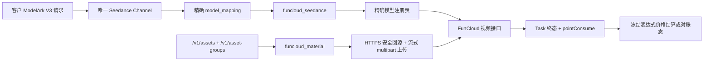

# FunCloud Seedance 全模型渠道、素材与计费架构设计

## 问题与目标

接入前仓库已经存在 FunCloud 视频协议，但实现只通过 Provider 模型名是否包含 `fast`
选择路径，尚未完整表达 Standard、Fast、Mini、2.5 四个模型；FunCloud 也还没有独立的标准素材库
协议。现有 Fast 计费沿用了火山模型倍率，不能代表 FunCloud 海外美元价格和终态 `pointConsume`
计量事实。

本次设计目标是：在不改变 Seedance Link 北向 ModelArk V3 合同、不侵入 NEWAPI 原生视频入口的前提
下，完成 FunCloud 四模型渠道适配、Standard/Fast/Mini 虚拟素材库适配，以及基于 `pointConsume`
的临时 Token 结算闭环。本文是本次实施的开发设计，不表示真实 Provider、真实账单或生产灰度已经
验收。

## 当前实际情况

### 已验证事实

1. 历史成功的 FunCloud Standard/Fast 任务使用 `content`、`ratio`、`duration`、`resolution`、
   `generateAudio`、`watermark`、`seed`、`cameraFixed` 请求结构；没有向 Provider body 发送
   `model`、`prompt` 或 `mode`。
2. 四个创建路径和统一查询路径为：

   | Provider 模型 | 创建路径 | 查询路径 |
   | --- | --- | --- |
   | `seedance-2` | `/api/v2/open/aigc/seedance2-0` | `/api/v2/open/aigc/{task_id}` |
   | `seedance-2-fast` | `/api/v2/open/aigc/seedance2-0-fast` | 同左 |
   | `seedance-2-mini` | `/api/v2/open/aigc/seedance2-0-mini` | 同左 |
   | `seedance-2-5` | `/api/v2/open/aigc/seedance2-5` | 同左 |

3. Mini 的已确认合同完全参照 Fast，仅 Provider 模型名和创建路径不同。
4. 2.5 按其专用文档支持 480p/720p、4—30 秒或 `-1` 智能时长；当前没有证据证明 2.5 支持
   FunCloud 素材库。
5. FunCloud 素材文档明确提供虚拟素材组创建、组列表、组更新、组删除、虚拟素材 multipart 上传和
   素材列表；生成任务使用上传返回的 `assetUrl`。文档未提供单素材更新、单素材删除和真人认证状态
   查询合同。
6. 一个真实 Fast 720p 文生视频样本证明：在冻结官方人民币 Token 单价后，
   `pointConsume × 6.82` 可以反推出实际 Token；`K=6.82` 目前只有单样本证据，属于临时、低置信度
   计量。
7. 用户已确认：当前只发布虚拟素材；成功任务缺失、非法或冲突的 `pointConsume` 时进入
   `RECONCILIATION_REQUIRED` 并保留预扣，不估算结算、不退款。

### 尚未验证事实

- Mini、2.5 的真实 Provider 生成和终态 `pointConsume` 尚未完成黑盒验收；
- FunCloud 素材列表和素材组列表的完整响应示例尚未取得；
- `K=6.82` 是否跨账号、模型、价格版本和折扣长期稳定尚未验证；
- 失败任务的 `pointConsume` 语义、结果 URL 生命周期和生产故障行为尚未闭合。

## 优化方案

## 1. 总体边界



FunCloud 继续使用 `ChannelTypeSeedanceLink`。北向只接受 ModelArk V3；南向视频和素材差异分别由代码
协议注册表表达。不得修改 NEWAPI 原生视频 Router、DTO、分发池或 Ability。

## 2. 模型、渠道与路径

四个客户模型分别创建独立的已启用 Channel：

| 客户模型 | Provider 模型 | 视频协议 | 素材协议 |
| --- | --- | --- | --- |
| `seedance-2-funcloud` | `seedance-2` | `funcloud_seedance` | `funcloud_material` 或 `none` |
| `seedance-2-fast-funcloud` | `seedance-2-fast` | `funcloud_seedance` | `funcloud_material` 或 `none` |
| `seedance-2-mini-funcloud` | `seedance-2-mini` | `funcloud_seedance` | `funcloud_material` 或 `none` |
| `seedance-2-5-funcloud` | `seedance-2-5` | `funcloud_seedance` | 只允许 `none` |

每条渠道必须只有一个客户模型和一条完全匹配的 `model_mapping`。路径只能由
`provider_model -> model spec` 精确注册表取得；未知模型保存时和请求时均失败。禁止 `Contains("fast")`、
默认 Standard、未知模型回退和跨模型 fallback。

Provider 模型身份必须保留在任务快照中，即使 FunCloud body 不发送 `model`。创建和查询继续使用冻结
Base URL、Bearer Key、代理、路径、协议和 adapter 版本。

## 3. 视频请求能力

### 3.1 Standard、Fast、Mini

- body 使用历史成功任务已经验证的富 `content` 结构；
- 至少一个非空 text；
- 支持 text、image、video、audio，媒体 URL 必须是安全 HTTPS 或已经解析后的 Provider
  `asset://`；
- duration 为 4—15 秒；省略时发送 5；
- ratio 支持 `16:9`、`9:16`、`1:1`、`4:3`、`3:4`、`21:9`、`adaptive`；
- Standard 支持 480p/720p/1080p；Fast/Mini 只支持 480p/720p；
- Fast/Mini 的媒体数量、字段限制和默认值完全一致；
- `generate_audio`、`watermark`、`camera_fixed` 的显式 `false` 和 `seed=0` 必须保留。

### 3.2 2.5

- body 仍使用 2.5 文档定义的富 `content` 结构；
- duration 为 4—30 秒或 `-1`；省略时发送 5；
- 只支持 480p/720p；
- 图片最多 9、视频最多 3、音频最多 3；
- 不向北新增 `taskType` 或 `realPersonMode` 私有参数；FunCloud 按输入自动推断任务类型；
- 不接受 `asset://ast_*`，因为素材协议固定为 `none`。

所有 FunCloud 模型都显式拒绝当前本地合同未开放的 callback、return last frame、480p-to-720p、tools、
draft、priority、service tier、output format、frames 等字段，禁止静默删除。部分字段可见于 Provider
文档，但尚未完成北向映射和真实回归，因此不能把拒绝理由写成“Provider 未发布”。

## 4. 创建、查询和状态

发送前沿用 durable `TaskCreateAttempt + hold + sending`。每个创建意图只发送一次。只有
`code=0 + data.taskId + data.status=processing` 才创建平台 Task；发送后出现网络错误、坏 JSON、
非零应用 code 或缺失可信 task ID 时保持 create `unknown`。

查询响应要求：

- `data.taskId` 必须与冻结 Provider task ID 一致；
- `processing/running/submitted -> IN_PROGRESS`；
- `success/completed/succeeded -> SUCCESS`；
- `failed -> FAILURE`；
- 成功必须只有一个一致的 HTTPS 结果 URL；
- 未知状态、ID 冲突、结果冲突、非法 URL 和成功缺失可信计量均为合同违例，进入
  `RECONCILIATION_REQUIRED`，不自动退款。

## 5. 标准素材库

新增管理员协议 `funcloud_material`，内部 profile 为 `funcloud_material`。它只与
`funcloud_seedance` 配对，并通过精确客户模型/Provider 模型规则排除 2.5。

### 5.1 发布能力

| 北向操作 | FunCloud 履约 | 当前行为 |
| --- | --- | --- |
| 创建虚拟素材组 | `/api/v2/open/material/group/create` | 支持 |
| 获取/刷新素材组 | group list 中按冻结 group ID 查找 | 有可信唯一结果时支持 |
| 更新素材组 | `/api/v2/open/material/group/update` | 支持 |
| 删除空素材组 | `/api/v2/open/material/group/delete` | 本地无活动素材且 Provider 唯一组明确 `materialCount=0` 时支持 |
| 上传虚拟素材 | `/api/v2/open/material/virtual/upload` | 支持 HTTPS URL 安全回源后流式 multipart 上传 |
| 获取/刷新素材 | material list 中按冻结 material ID 查找 | 有可信唯一结果时支持 |
| 单素材重命名 | 无文档合同 | 明确不支持 |
| 单素材删除 | 无文档合同 | 明确不支持 |
| 真人素材 | 缺少认证状态查询合同 | 明确不支持 |
| 2.5 素材 | 无证据 | 明确不支持 |

素材组列表和素材列表解析只接受代码明确列出的响应 envelope 与字段；没有唯一匹配时失败关闭，不通过
`fileUrl`、名称或模糊搜索猜测 Provider 资源。

### 5.2 流式上传和安全

1. `source.url` 只在创建请求和当次回源中存在，不写入 Asset、日志或返回；
2. 使用拨号期 SSRF 防护的 HTTP 客户端，逐次校验 HTTPS、443、DNS 解析、重绑定和重定向；
3. 只接受与声明 media type 匹配的 MIME；拒绝 HTML、JSON 和未知类型；
4. `Content-Length` 已知时先拒绝超过 100MB，未知时使用 100MB+1 的限制读取器；
5. 通过 `io.Pipe + multipart.Writer` 直接把回源响应流写入 FunCloud 请求，不落盘、不整块加载内存；
6. 回源响应和 pipe 在成功、错误、取消时都必须关闭；Provider 成功响应限制为 1MB；Provider Key 和
   响应体不得写日志。

上传成功后只保存 Provider `materialId`、`assetUrl` 中去掉 `asset://` 后的引用值、状态和固定作用域。
视频发送前 Resolver 将 `asset://ast_*` 唯一转换为冻结的 FunCloud `asset://<providerAssetId>`。

## 6. 计费与 `pointConsume`

### 6.1 客户美元价格

客户模型使用异步 `tiered_expr`，单位为 USD/百万 completion tokens：

| 模型 | 无视频输入 480/720 | 无视频输入 1080 | 有视频输入 480/720 | 有视频输入 1080 |
| --- | ---: | ---: | ---: | ---: |
| Standard | 6.74 | 7.48 | 4.11 | 4.55 |
| Fast | 5.43 | 不支持 | 3.23 | 不支持 |
| Mini | 3.37 | 不支持 | 2.05 | 不支持 |
| 2.5 | 10.26 | 不支持 | 6.16 | 不支持 |

表达式只读取冻结 `_task.has_video_input` 和 `_task.resolution`。预扣使用管理员配置的最大 Token 上界；
建议 Standard 730,000、Fast/Mini 324,000、2.5 648,000。实际值在终态由可信 `pointConsume`
反推后重新运行同一冻结表达式。

### 6.2 临时 Token 反推

adapter v3 固定：

```text
K = 6.82
inferred_tokens = round(pointConsume × K × 1,000,000 / official_price_cny_per_million)
```

人民币单价只用于反推 Provider Token，不是客户售价。初始表为 Standard 46/28（1080 为 51/31）、
Fast 37/22、Mini 23/14、2.5 70/42；前者为无视频/有视频输入。模型、分辨率、是否有视频输入、K、
反推表版本和客户美元表达式都在创建时或 adapter 版本中冻结。成功终态同时在 Task 私有计费事实中
保存原始 `pointConsume`、K、价格表/算法版本、实际档位和推导 Token，并只向管理员日志投影；客户
Task 数据不包含这些证据。

计算使用十进制定点和统一 checked quota 转换。成功终态必须满足：

- `pointConsume` 是非空、严格大于零、有限十进制字符串；
- 同一响应没有冲突值；
- 冻结 Provider 模型、分辨率和输入类型可解析；
- 反推 Token 为正且不超过预扣合同允许的安全上界。

否则查询视为上游合同违例，Task 进入 `RECONCILIATION_REQUIRED`，资金 hold 保留。失败任务不生成
推断 Token，并按既有明确失败退款合同处理。日志中可记录脱敏后的用量来源、公式版本、价格版本和
置信度，但不得记录原始 Provider 响应或把客户 quota 当作 Provider 货币成本。

## 7. 最小入侵接线

- `relaykit/dto`：新增素材协议/profile，并用精确模型表解析 FunCloud 路径；保持模块独立；
- `model/channel_seedance_settings.go`：仅增加 FunCloud 精确模型映射与素材配对保存校验；
- `relay/channel/task/seedance`：新增 FunCloud model spec、请求校验和终态计量上下文；
- `relay/channel/task/seedance/assets`：新增独立 FunCloud adapter 文件；
- `service/asset_service.go`：只增加 FunCloud 流式回源接线和明确不支持错误映射；
- 管理前端：只增加协议枚举、标签、配对和验证；所有文案使用既有 i18n 机制；
- 不修改原生视频入口，不建立第二套路由、Task、素材或账本。

### 7.1 旧 FunCloud 实现处置

- 管理协议固定使用无版本标识 `funcloud_seedance` / `funcloud_material`，内部视频 profile
  固定使用 `third_party_funcloud_seedance`；Provider 当前 `/api/v2` 路径由代码注册表表达，
  不写入管理协议名；
- adapter revision 与管理协议分离；新 Task 仍冻结 v3，但 Provider 将来切换路径版本时不需
  为此改变管理协议标识；
- 不保留 FunCloud adapter revision v2 解析器、判断方法或支持清单；冻结 v2 的旧 Task
  失败关闭，不再进入兼容解析；
- 一次性名称迁移发现引用旧协议的活动 Task、attempt 或 idempotency 时整体中止，只允许迁移已终结
  的耐久事实；
- 删除已经被美元 Token 表达式替代、没有生产调用方的旧 FunCloud Standard/Fast 按秒列表价测试和
  常量；
- 完成后按符号引用、协议注册、前端枚举和冻结 Task 路径逐项审计；旧标识由一次性
  数据库迁移改写，运行时不保留 alias、双读或 fallback。

## 8. 验证与发布门槛

代码完成必须通过：FunCloud 四模型路径和 validator、富 content 序列化、终态计量失败关闭、multipart
流式上传上限/MIME/关闭行为、素材配对、Resolver、三数据库无新增方言依赖、`relaykit` 独立构建、
前端协议表单和 docs 校验。

生产发布前仍需逐模型完成真实创建/查询、素材上传/刷新、`asset://` 视频生成、Provider 后台 Token、
美元账单、失败/超时和灰度验证。在这些门槛完成前，文档和代码只能表述为“已实现、待生产验收”。

## 风险和剩余事项

1. 素材列表 envelope 缺少完整样例；实现只发布能被严格解析和唯一定位的形状，真实返回不匹配时应
   补证据后升级 adapter，不增加递归猜测或松散兼容。
2. `K=6.82` 和 Mini/2.5 人民币反推价均为临时事实；出现漂移时必须进入对账态并暂停自动结算。
3. FunCloud 文档把部分地址称为国内专线，但本次渠道身份按用户确认属于海外 FunCloud；Base URL
   保持管理员配置，不用域名推断地区或协议资格。
