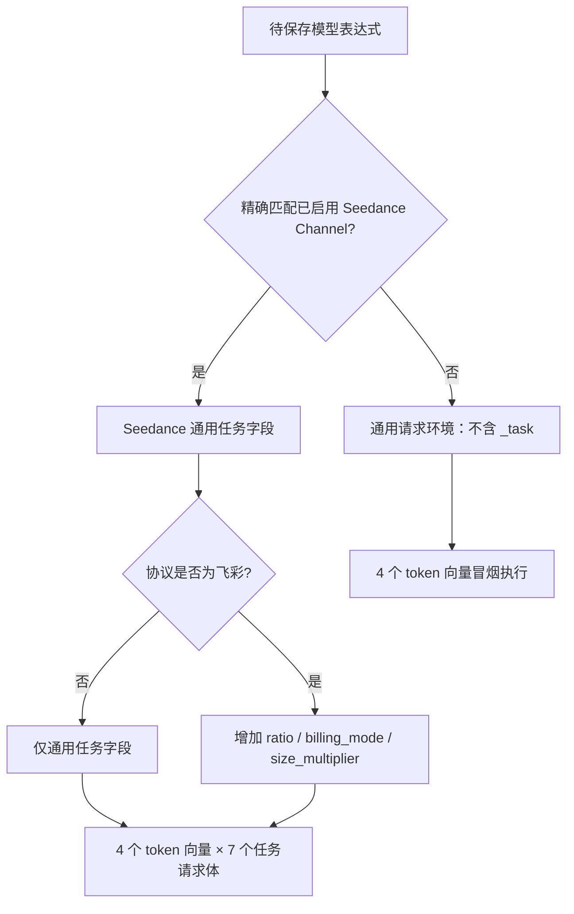

# Seedance 计费表达式串值与保存失败修复

## 1. 问题与目标

### 1.1 宏观问题

本次问题不是单一价格数字错误，而是同一份 Seedance 计费合同在三个环节失去一致性：

1. 前端切换客户模型时，上一模型的表达式可能短暂进入下一模型的编辑状态；
2. 服务端保存表达式时，使用不含任务探针的通用请求校验，合法的按秒表达式因 `nil` 参与乘法而失败；
3. 第一版修复把飞彩专属字段注入所有校验请求，虽然消除了假拒绝，却可能放行其它协议运行时不存在的
   字段，形成新的校验失真。

系统最终必须保证：管理员看到、服务端保存和任务运行时求值的是同一个客户模型、同一个明确协议下的
同一份计费表达式，且任何缺少必要计费字段的情况都失败关闭，不能按零费用或错误分支继续执行。

### 1.2 本次目标

- 模型切换后，前端首帧就显示当前模型的数据，不再复用上一模型的计费草稿；
- 保存校验根据明确的 `ChannelTypeSeedanceLink`、客户模型和代码协议选择任务探针，不根据模型名推断；
- 通用 Seedance 字段与飞彩专属字段分层，避免假拒绝、假放行和静默选择错误价格分支；
- `seedance-2.0-4k` 使用不含折扣的原价系数 `741114.000000`；
- 用回归测试固定前端模型身份、后端协议字段边界和计费失败关闭行为；
- 明确区分“代码已修复”“配置已迁移”“生产已部署”“真实 Provider 账单已核对”四种状态。

### 1.3 最终价格合同

| 客户模型 | 原价（美元/秒） | 表达式系数 | 推荐表达式 |
| --- | ---: | ---: | --- |
| `seedance-2.0-1080p` | $0.363431 | `363431.000000` | `v1:tier("base", param("_task.duration_seconds") * 363431.000000)` |
| `seedance-2.0-4k` | $0.741114 | `741114.000000` | `v1:tier("base", param("_task.duration_seconds") * 741114.000000)` |

表达式系数是美元价格乘以一百万后的计费表达式单位，不是折扣价。新配置不再依赖历史字段
`param("_task.size_multiplier")`；该字段当前仅为尚未迁移的飞彩旧表达式保留，值恒为 `1`。

## 2. 当前实际情况

### 2.1 计费链路与权威边界


各环节的权威事实如下：

| 环节 | 权威事实 | 不允许的推断 |
| --- | --- | --- |
| 前端编辑 | 当前 `editData.name` 对应的编辑器实例 | 用上一模型 state 补当前模型首帧 |
| 保存校验 | 已启用 `ChannelTypeSeedanceLink`、精确客户模型、`video_upstream_protocol` | 根据模型名或价格猜协议 |
| 运行时探针 | 选中 adapter 的 `BuildTaskBillingProbe` | 从原始客户请求直接读取未受信计费字段 |
| 计费执行 | 已保存表达式、冻结 `_task` 探针和预扣 Token 上界 | 缺参按零、换表达式或按当前配置重解释历史 Task |

### 2.2 已验证的价格事实

- 本地 SQLite 中 `billing_setting.billing_expr["seedance-2.0-4k"]` 的系数已经是
  `741114.000000`，本地持久化配置没有把 4K 写成 `363431.000000`；
- [计费与分组运维手册](../40-operations/01-计费与分组运维手册.md)以及
  [飞彩火山八月折扣前价格对比](../20-architecture/Seedance模型接入设计/飞彩/飞彩火山八月折扣前价格对比.md)
  均记录 1080p 为 `$0.363431/秒`、4K 为 `$0.741114/秒`；
- 页面曾出现的“4K 模型名 + 1080p 系数”是前端编辑状态串值证据，不代表本地数据库已经错误持久化；
- 服务端此前保存正确 4K 表达式仍返回 `<nil> * float64`，说明当时部署的后端校验环境不支持任务探针。

### 2.3 当前完成状态

| 项目 | 状态 | 证据或说明 |
| --- | --- | --- |
| 前端模型切换隔离 | 代码已完成 | 模型名作为编辑器 key，首帧直接从 `editData` 初始化 |
| 后端协议感知校验 | 代码已完成 | 普通、Seedance 通用、飞彩专属三类字段环境已分离 |
| 回归测试 | 已通过 | Go、Vitest、TypeScript、oxlint、docs 校验通过 |
| 本地 4K 系数 | 已核对 | 系数为 `741114.000000`，旧表达式仍可能包含恒为 1 的历史乘数 |
| 远端服务代码部署 | 未验证 | 不能把本地测试通过写成服务端已部署 |
| 远端 4K 表达式保存 | 未完成 | 必须先部署新校验器，再保存规范表达式 |
| 真实任务与 Provider 账单 | 未验证 | 仍需受控任务和真实账单对账 |

## 3. 根因分析

### 3.1 前端：模型身份变化晚于本地 state 切换

原实现复用同一个 `ModelPricingEditorPanel`。当 `editData` 从 1080p 切换到 4K 时，React 首帧仍使用
旧的 `billingExpr` state，随后才由 `useEffect` 同步新数据。内层 `TieredPricingEditor` 又会把有效
表达式回写父组件，因此可能出现：

```text
modelName = seedance-2.0-4k
billingExpr = 1080p 的 363431.000000
```

根因是模型身份与编辑状态生命周期没有绑定，而不是价格来源本身计算错误。

### 3.2 后端：保存校验缺少任务运行时类型环境

旧校验器只使用空请求和通用请求执行表达式。对于：

```text
v1:tier("base", param("_task.duration_seconds") * 741114.000000)
```

保存时 `param("_task.duration_seconds")` 为 `nil`，因此产生 `nil * float64`。运行时 Seedance adapter
实际会构造冻结任务探针，保存环境与运行环境不一致导致合法表达式被拒绝。

### 3.3 第一版修复：全局合成字段造成协议边界扩大

第一版修复把 `size_multiplier=1` 放入全部 7 个任务请求体。专家评审指出：运行时只有飞彩协议提供该
字段，非飞彩表达式会在保存时被错误放行。

风险不仅是运行时报 `<nil> * float64`。如果表达式通过条件比较引用缺失字段，运行时可能不报错而进入
另一个价格分支，例如：

```text
param("_task.size_multiplier") == 1
  ? tier("with_multiplier", c * 1)
  : tier("without_multiplier", c * 2)
```

校验环境看到 `1`，非飞彩运行时看到 `nil`，两者会选择不同档位。因此不能用“运行时最终失败关闭”
解释全局字段注入，也不能把缺少的字段统一补零。

### 3.4 为什么“只给一个请求体补字段”不能解决问题

冒烟校验使用 `4 个 token 向量 × 每个请求体` 的全组合循环。表达式必须在所有请求体上执行成功。
若只给一个请求体补 `ratio` 或 `billing_mode`，其它请求体仍会缺参；若把字段补到所有模型的所有请求
体，又会重现协议字段假放行。正确边界必须是“先确定模型对应的协议，再为该模型构造完整字段集”。

## 4. 优化方案

### 4.1 总体设计

保存校验分为两步：

1. 由管理配置确定表达式属于普通模型还是已启用 Seedance 客户模型；
2. 对 Seedance 客户模型，再由明确的代码协议决定是否增加协议专属字段。



### 4.2 校验环境分层

| 校验对象 | 请求环境 | 允许的 `_task` 字段 |
| --- | --- | --- |
| 普通模型或未绑定已启用 Seedance Channel 的模型 | 原有空请求与通用请求 | 无 |
| 所有已启用 Seedance 客户模型 | 7 个任务分支探针 | `duration_seconds`、`resolution`、`has_video_input`、`generate_audio`、`input_mode`、`control_mode` |
| 飞彩 Seedance 客户模型 | 7 个任务分支探针，每个都加入飞彩字段 | 通用字段 + `ratio`、`billing_mode`、`size_multiplier` |

该设计有四个关键约束：

- 客户模型只作为精确配置键，不承担协议推断；
- 飞彩专属字段必须加入该模型的每一个请求体；
- 非飞彩和普通模型看不到飞彩字段；
- 未知数值字段仍返回 `nil` 并使计费算术失败，不增加兼容层或零值回退。

### 4.3 前端状态隔离

- 移动端 Sheet 和桌面端并排编辑器都使用客户模型名作为 `ModelPricingEditorPanel` 的 React key；
- 模型身份变化时重新创建完整编辑状态，不复用上一模型的 state；
- `pricingMode`、价格通道、`billingExpr`、请求规则、任务预扣上界和表单默认值在首次渲染时直接从
  当前 `editData` 初始化；
- 同一模型保存后不重建编辑器，保留费用试算现场；
- 重复的 pricing mode 推导收敛为稳定业务 helper `pricingModeFromData`；
- `createInitialLaneState` 只映射六个价格通道，开销很小，不增加无收益的 memo/ref 复杂度。

### 4.4 后端职责划分

| 文件 | 职责 | 变更边界 |
| --- | --- | --- |
| [`controller/billing_expression_validation.go`](../../controller/billing_expression_validation.go) | 组织配置保存校验，按精确客户模型关联协议字段 | 原生 Option 更新路径只保留一个窄调用 |
| [`model/channel_seedance_billing_validation.go`](../../model/channel_seedance_billing_validation.go) | 读取已启用 Seedance Channel | 不写 Ability，不增加运行时选渠逻辑 |
| [`relay/channel/task/seedance/billing_probe_validation.go`](../../relay/channel/task/seedance/billing_probe_validation.go) | 定义飞彩协议校验专属字段 | 与运行时 `BuildTaskBillingProbe` 保持同一协议边界 |
| [`setting/billing_setting/task_billing_smoke_requests.go`](../../setting/billing_setting/task_billing_smoke_requests.go) | 分别构造通用与任务冒烟请求 | JSON 使用项目统一 `common.Marshal` |
| [`setting/billing_setting/tiered_billing.go`](../../setting/billing_setting/tiered_billing.go) | 根据模型上下文选择请求集并执行非负、`tier()` 校验 | 保留现有 token 向量与全组合执行语义 |
| [`setting/billing_setting/task_billing_test.go`](../../setting/billing_setting/task_billing_test.go) | 固定字段边界与失败关闭回归 | 不以随机 smoke 或实现细节代替合同测试 |

### 4.5 价格配置迁移

新 4K 配置必须保存为：

```text
v1:tier("base", param("_task.duration_seconds") * 741114.000000)
```

旧飞彩表达式：

```text
v1:tier("base", param("_task.duration_seconds") * 741114.000000 * param("_task.size_multiplier"))
```

由于 `size_multiplier` 在飞彩探针中恒为 `1`，旧表达式当前数值等价，但它是历史残留，不应继续复制到
新配置。迁移完成并确认没有存量引用后，才能另行删除运行时兼容字段；本次不提前移除，以免部署代码和
配置迁移之间出现服务中断。

### 4.6 专家评审结论收敛

| 评审项 | 处理结论 |
| --- | --- |
| `size_multiplier` 被注入全部请求环境 | 已修复；只跟随飞彩协议 |
| 飞彩 `ratio`、`billing_mode` 未进入校验环境 | 已修复；与 `size_multiplier` 一起加入飞彩的每个请求体 |
| “只给至少一个 body 补字段” | 未采用；全组合循环下仍会被其它 body 拒绝 |
| pricing mode 推导重复 | 已提取 `pricingModeFromData` |
| effect 内 ternary 属顺手重构 | 重复逻辑由业务 helper 自然替代，不保留两套推导 |
| `createInitialLaneState` 可惰性初始化 | 未增加优化；当前转换轻量，模型切换依靠 key 保证正确生命周期 |
| 7 body × 4 vector 抽样有限 | 保留限制并补关键反向合同测试，不宣称穷举所有表达式分支 |
| 用 `_task.ratio` 作为未知字段反向用例 | 未采用；飞彩运行时合法提供该字段，改用 `_task.unsupported_numeric` |

## 5. 验证结果

### 5.1 回归矩阵

| 场景 | 期望 | 结果 |
| --- | --- | --- |
| 1080p 切换到 4K | 不出现“4K 模型名 + 1080p 表达式”帧 | 通过 |
| 4K 规范按秒表达式 | 已绑定 Seedance Channel 后保存校验通过 | 通过 |
| 墨行 `seedance-2-5-m` 多分支表达式 | 通用任务字段可执行 | 通过 |
| 飞彩表达式引用三个专属字段 | 飞彩模型通过 | 通过 |
| 官方协议引用 `size_multiplier` | 保存校验拒绝 | 通过 |
| 普通模型条件引用 `_task.duration_seconds` | 不获得合成任务字段，防止静默选错分支 | 通过 |
| 任务表达式引用 `_task.unsupported_numeric` | `nil` 参与算术并失败关闭 | 通过 |
| 负价格或缺少 `tier()` | 保持原有拒绝行为 | 通过 |

### 5.2 已执行命令

```text
env GOCACHE=/private/tmp/yuan-gateway-go-cache go test ./setting/billing_setting ./relay/channel/task/seedance ./controller
cd web && bunx vitest run src/features/system-settings/models/__tests__/model-pricing-switch.test.tsx
cd web && bun run typecheck
cd web && bunx oxlint -c .oxlintrc.json \
  src/features/system-settings/models/model-pricing-core.ts \
  src/features/system-settings/models/model-pricing-sheet.tsx \
  src/features/system-settings/models/model-ratio-visual-editor.tsx \
  src/features/system-settings/models/__tests__/model-pricing-switch.test.tsx
task docs:check
task ai:check
```

以上结果只证明代码与文档校验通过，不等于远端服务已部署、价格已保存或真实 Provider 账单已闭环。

## 6. 部署与验收

### 6.1 部署顺序

1. 部署本次前端和后端代码；
2. 确认 `seedance-2.0-4k` 精确绑定到已启用的 `ChannelTypeSeedanceLink`，且协议配置正确；
3. 硬刷新服务端管理页面，直接打开 `seedance-2.0-4k`；
4. 保存规范表达式 `v1:tier("base", param("_task.duration_seconds") * 741114.000000)`；
5. 重新加载页面，确认仍显示 4K 系数，且不再出现 `<nil> * float64`；
6. 使用受控测试任务核对 4、5、15 秒的预扣结果；
7. 使用真实 Provider 账单单独核对成本，不以客户 quota 或代码测试替代 Provider 账单证据。

如果模型尚未绑定已启用 Seedance Channel，保存校验不会为其注入 `_task`。这不是模型名识别失败，而是
明确要求管理员先建立类型化协议身份，再保存依赖该协议的任务表达式。

### 6.2 验收标准

- 页面切换模型时不显示或回写上一模型表达式；
- 服务端可以保存 4K 规范原价表达式；
- 保存后重新加载仍为 `741114.000000`，不出现 `363431.000000`；
- 非飞彩模型引用飞彩专属字段时保存失败；
- 缺少必要数值字段时计费失败关闭，不产生零费用任务；
- 受控任务的预扣秒数与冻结任务探针一致；
- 真实 Provider 账单核对结论与客户定价结论分开记录。

## 7. 剩余风险与后续事项

1. 冒烟校验仍是代表性抽样，不会自动枚举表达式中的任意字符串条件；新增分辨率或协议字段时必须同步
   增加有业务意义的 fixture 和合同测试。
2. 当前协议字段校验发生在保存 `billing_expr` 时。若之后修改 Channel 协议，应重新保存并验证对应
   表达式；本次没有在请求热路径增加重复协议校验或自动修复。
3. 飞彩 `size_multiplier` 仍为存量表达式保留。完成服务端配置迁移和引用扫描前，不得提前删除。
4. 远端部署、远端表达式保存、受控任务和真实 Provider 账单均未完成，因此本文继续保持
   `status: in-progress`，不能归档，也不能写成生产已修复。
