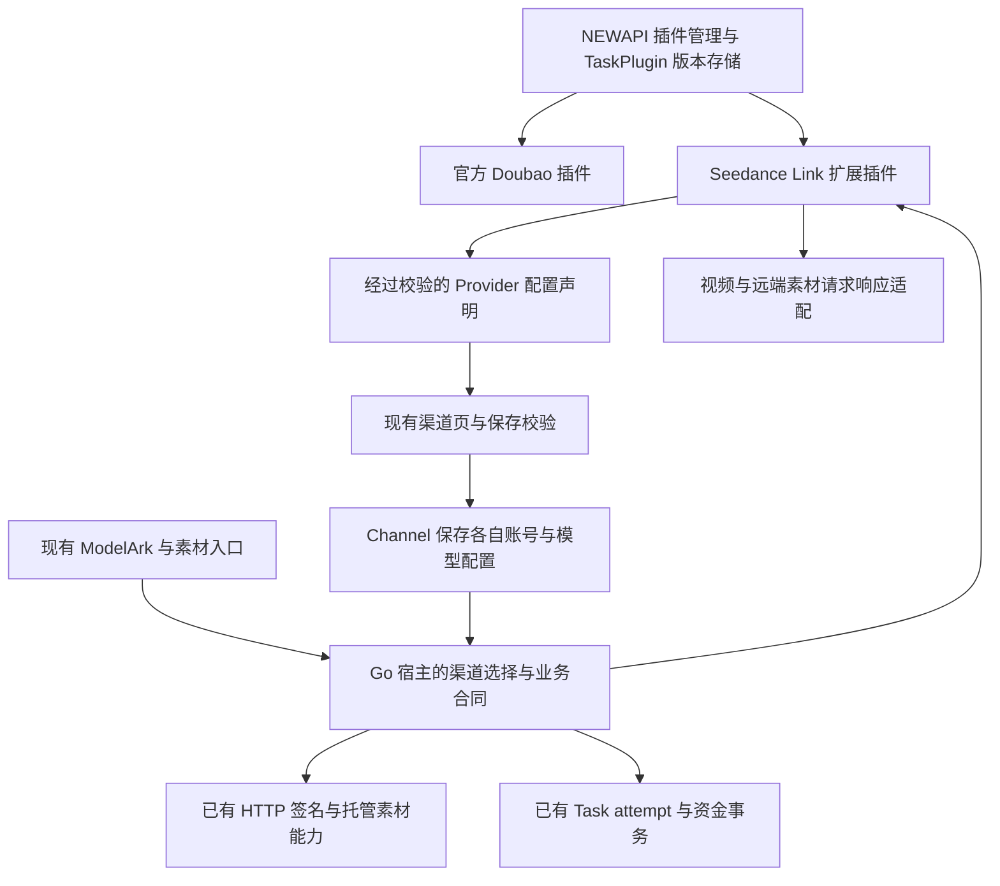

# Seedance 独立插件迁移方案

## 1. 问题与目标

**首要目标是降低持续同步 NEWAPI 上游时的冲突面、合并成本与行为回归风险。** Seedance 作为 NEWAPI
的扩展渠道，沿用 Channel、插件发布/管理、运行引擎、Task 与资金底座；由一个 `seedance-link` 插件
统一维护全部在用 Seedance Provider 的专属配置定义与协议适配。

2026-09-11 用户已确认按 NEWAPI 架构与设计思路调整方案，原因是后续会持续同步上游。后续已授权按方案实施。
当前 U1—U3 本机实现与验证、U4 主要清理及补丁重放已完成，剩余清理与外部验收见
[配置统一实施记录](2026-09-11-Seedance配置统一实施记录.md)。未切换生产渠道或发布；旧 P1/P2
继续作为迁移基线，不将局部实现写成完整目标已交付。

本文是后续迁移目标、职责和验收的唯一方案入口。
[统一分析](2026-09-11-Seedance扩展渠道与NEWAPI插件统一分析.md)保留取证与取舍依据，
[P1/P2 记录](2026-09-09-Seedance插件迁移P1P2实施记录.md)保留实际交付及验证；二者不另设目标合同。
[原 Doubao 迁移评估](2026-09-09-Seedance定价回归修复与Doubao渠道迁移评估.md)讨论合并到 Doubao，
不适用于本方案。官方 Doubao 继续服务其原生渠道，本次不合并两者身份或价格合同。

### 1.1 成功标准

- 复用 NEWAPI 已有抽象与接入机制；能使用上游现成能力时不另造实现，缺口优先以新增文件和窄接线补齐。
- Provider 模型登记、视频/素材协议选项和配对、Provider 专属配置规则与适配进入插件唯一来源；前端、
  保存校验、运行时和元数据使用同一经过校验的声明，不再各维护一份 Provider 表。
- 在既有北向合同与宿主能力内新增同类模型或修复协议，主要修改插件及 fixture；新增 API、资金语义或
  签名/存储能力仍需宿主开发，不承诺所有扩展都能零 Go 修改。
- `ChannelTypeSeedanceLink` 保持 62；多个 Channel 共享插件实现，各自保存连接、凭据、客户模型和映射。
- 客户 ModelArk V3、素材和模型发现接口、Task ID、素材引用与历史计费事实保持原含义。
- 每条迁移线路在相同冻结输入下，创建语义、响应、用量、预扣和最终整数 quota 与原实现一致。
- 新请求固定发布版本，历史任务按冻结版本履约；无新请求 Go/JS 双实现、失败 fallback 或平行账本。
- 每批提供相对明确上游基线的文件差异清单和同步演练结果；真实 Provider、账单、数据库与灰度通过后
  才能将对应线路写为生产可用。

## 2. 当前实际情况

> 取证时点说明：本节是 U1—U3 实施前（2026-09-09/11 复核时）的取证快照，表中"当前可验证事实"
> 不随实施进度改写。实施后的代码事实与剩余工作见
> [配置统一实施记录](2026-09-11-Seedance配置统一实施记录.md)与
> [评审问题修复方案](2026-09-11-Seedance插件迁移评审问题修复方案.md)。

### 2.1 取证范围与可信度

本次复核使用当前工作区和本地已获取的 `upstream/main` 提交 `3a9f41ee8`（2026-09-04），通过 Git
对象检查上游插件 API 文档、Channel 保存、Meta、注册表及 adapter 入口。未重新获取远端，不推断
后续上游版本。原稿的 `3f7e6f2a6` 与本机渠道/价格数量只代表早期样本，不能当作当前生产矩阵。
实施前重新记录本地提交、上游目标、共同祖先和工作区已有改动，禁止覆盖其他任务的未提交修改。

上游文档的通用 Task Plugin 类型仍写 59，但同一提交的常量代码为 61；按代码确认身份。当前本地
默认地址补全等增强也不全是上述上游已有能力，实施盘点必须区分上游、本地已实现与目标新增。

### 2.2 当前边界及差距

| 项目 | 当前可验证事实 | 对后续统一的影响 |
| --- | --- | --- |
| NEWAPI Channel/插件分工 | 插件声明能力并实现适配；Channel 保存实际账号、模型和运行配置 | 不把 Channel 值迁进插件源码，不另建插件账号表 |
| 专用类型与通用类型 | Doubao 插件声明渠道 54/45；通用 Task Plugin 61 以 `task_plugin_key` 绑定 | 62 可以保留为扩展渠道；改成 61 不是插件化前提 |
| Seedance 已有插件 | `seedance-link` 共用引擎、TaskPlugin 表及管理页；专用编译器与装载分支只承接飞彩三个转换 hook | 已完成旧 P1/P2，不等于配置和全部协议统一 |
| 配置定义 | Go 枚举/模型表/保存校验与前端选项、配对逻辑仍分散维护 | 原生 Meta 缺完整渠道配置声明，需有限扩展，不可只搬 JS 函数 |
| API 与素材 | 宿主协议表主要覆盖 Responses/OpenAI Video；本地已有 ModelArk 和素材 Router | 保留已发布路径和唯一 handler；素材不伪装成 Task，不能用自定义路由占用保留的 `/api` 命名空间 |
| 模型索引 | 普通 `meta.models` 参与全局模型索引及端点候选 | Provider 模型定义不能无条件成为原生客户模型资格 |
| JS 引擎 | Sobek 同步 hook，默认执行 5 秒、Engine 并发 8；执行时间不含排队 | 复用现有引擎，有界准入与容量按 §8.3 验证 |
| 版本与删除 | Seedance 已有精确版本解析、prepared 引用锁和执行依赖保护；通用 adapter 获取仍按当前 generation | 保留这些已交付保障，不能为合并缓存/装载代码改用最新版履约 |
| 协议数量 | 9 个可新受理视频协议；2 个视频协议只保留历史识别；7 个远端素材协议，加 none/托管 | 以 §5 为迁移范围，不重新启用退役协议 |
| 计费 | 通用 JS adapter 实现 TaskUsageFactsProvider，现有 Seedance 使用独立计价语义 | 直接替换 adapter 类型可能改变计价分支，必须保持 §6 的资金等价 |

主要证据：[插件定义](../../pkg/jsplugin/registry.go)、[宿主注册表](../../pkg/jsplugin/routing.go)、
[Doubao 插件](../../plugins/tasks/doubao/plugin.js)、[渠道保存](../../controller/channel.go)、
[Seedance 编译合同](../../pkg/jsplugin/seedance_extension.go)、
[装载接线](../../controller/seedance_plugin_extension.go)、
[迁移登记](../../relay/channel/task/seedance/plugin_extension.go)、
[版本解析](../../pkg/seedanceplugin/store.go)、
[渠道配置](../../model/channel_seedance_settings.go)、[适配入口](../../relay/relay_adaptor.go)。

### 2.3 已有资金、素材与原生隔离约束

此前价格元数据按模型名误认插件身份、异步计费误接管原生快照的回归，不能因统一插件而重新引入。
同一 Provider 模型可由不同业务渠道提供，但当前客户价格键不能产生原生/Seedance 计费合同冲突，
包括停用配置。统一发布与声明不等于统一所有分发或计价规则。

当前事实以[硬约束](../00-context/硬约束.md)、对应素材/计费专题及代码为准；本方案调整 Provider
登记的维护位置，未取消确定性渠道、已发布北向语义、无状态素材、托管例外与资金不变量。

## 3. 优化方案：目标架构与职责

### 3.1 沿用 NEWAPI 的扩展渠道模式

保留插件 key `seedance-link`、渠道类型 62 与现有协议标识。一个技术人员维护的发布包承接全部在用
协议，管理员在现有渠道页选择插件提供的协议与配置项；账号、连接及模型映射仍按 Channel 保存。
源码可按协议组织并构建成已有单文件制品，不新增 JS 引擎或运行时模块加载器，不为每个渠道复制脚本。



### 3.2 职责与唯一权威

| 内容 | 目标权威 | 宿主职责 |
| --- | --- | --- |
| Provider 模型清单、协议选项与视频/素材配对 | 已校验插件声明 | 验证结构和宿主支持范围；供管理与运行时读取 |
| Provider 专属字段、必填/格式规则、展示条件 | 已校验插件声明 | 复用表单组件，服务端独立执行校验；展示条件不代替权限 |
| 普通素材组策略的协议映射 | 插件声明固定 none/default_fallback/hosted 之一 | Go 定义枚举语义与安全边界，运行时/元数据读取同一结果 |
| Provider 路径、字段、业务错误与响应观察 | 插件适配实现 | 检查请求描述、结果身份、数据类型和敏感信息 |
| Base URL、Key、客户模型、model_mapping、Project/Region、默认组等实际值 | 现有 Channel 及受保护配置存储 | 管理保存、租户变更确认、权限和审计 |
| 北向 API、DTO、请求上限、用户权限与唯一渠道 | 现有 Go 业务合同 | 插件不得新增原生资格、重选渠道或改义客户字段 |
| HTTP、代理、鉴权/签名、超时及流式传输 | Go 宿主 | 最终组装与凭据注入；插件仅描述已授权操作 |
| 用量与计费 | 插件提取 Provider 用量；Go 归一并执行既有计费 | 插件不返回最终金额，不改价格与退款规则 |
| 托管素材、Task/attempt、版本冻结和恢复 | 现有 Go 服务及持久事实 | 不搬业务状态到 JS，不新增账本或资源表 |
| 发布、激活、管理与版本存储 | NEWAPI 已有插件底座 | 复用现有流程，缺口通过明确扩展接入 |

旧方案“Provider 登记与配对始终留在 Go”调整为“插件统一声明，宿主验证并投影”。这不是在现有
Go 登记旁再加一套能力表。当前 [协议枚举](../../relaykit/dto/upstream_protocol.go)、
[组策略映射](../../relaykit/dto/asset_group_policy.go)和[保存校验](../../model/channel_seedance_settings.go)
是实现基线；每批迁出时删除已被替代的 Provider 决策源。协议标识、固定枚举和稳定接口类型可以保留。

实现该维护位置变化时，同批更新硬约束与当前架构中对应的来源表述，保留其业务不变量；本次不把目标
伪写为当前事实，也不把本方案复制成第二份通用规范。技术审核通过的插件发布才可增加同类 Provider
声明，客户或普通渠道管理员不能编写映射脚本、任意扩张北向合同或选择未登记的宿主能力。

### 3.3 最小宿主扩展与原生隔离

先对明确上游基线做能力对照：能直接复用的 Meta、TaskPlugin、引擎、管理 API、发布同步不再实现。
缺口限定为配置声明、ModelArk/素材操作、已冻结版本解析与声明投影。扩展主体放新增文件，原生文件
仅保留注册或窄调用；不新建插件平台、版本表、管理页面或通用工作流系统。

当前专用编译/装载机制是过渡基线。优先让共享装载流程有明确的扩展合同接入点，逐步消除按保留 key
散落的特判；不预先要求所有对象并入同一 map，也不把当前旁路永久写成目标。精确版本缓存承担历史
履约，候选路由缓存承担新请求选择，两者不能因“统一”混淆。每项必要例外都要记录责任和退出条件。

通用 TaskAdaptor 只有在接口、资金与生命周期等价得到证明后才能复用；不能通过空壳 hook、宽松
全局校验或新增一个实现资金接口的 adapter，让 Seedance 自动进入原生 TaskUsageBilling。
已有 Go adapter 可保留为窄宿主桥接，迁完的 Provider 转换及配置分支必须退出新请求路径。

保留 62 符合 NEWAPI 专用类型由插件驱动的方式，但当前仅加 `channelTypes: [62]` 并不足够：专用
编译合同、adapter 分流和注册资格都需要接线。保持 62 的确定性选择，不借此写入通用 Ability 或
修改原生路由去识别 Link。ModelArk/素材保留原路径，每个方法与路径一个 handler，不增加客户前缀。

Provider 模型清单属于管理声明，客户模型来自 Channel。原生 `meta.models` 会进入 `byModel` 与
端点索引，不能直接承载全部 Seedance Provider 身份。目标扩展应显式区分管理声明与原生资格，
通过选定 Channel 的模型映射读取该声明，不把模型名或价格作为插件身份。

当前普通注册表中，完全同名可能保留按 key 排序先登记的元信息；大小写变体可能导致冲突；部分发布
还可能排除冲突项并保留其他插件。不能以“不报错”证明隔离。U1/U2 必须以原生模型解析、端点候选、
别名和价格等可观察行为验证完全同名、大小写变体、新名字及启停顺序，不只比较私有 map 或 generation。

### 3.4 渠道配置声明与发布一致性

U1 定义有限、类型化的配置合同，确切字段名与 API 版本经接口验证后确定，不先造任意 JSON 表单引擎。

- 区分插件公共定义、Channel 实际值、宿主生成的只读值与敏感凭据槽位。凭据继续走已有受保护存储，
  声明可表示需要哪类既有凭据，但不得让脚本读取密钥或任意指定鉴权目标。
- 前端选项、服务端保存验证、运行时选择及公开元数据均取自同一已校验声明；公开投影仍只显示客户
  模型与获准字段，不泄露上游模型、Provider、Project/Region 或连接身份。
- 保存与激活期间固定所用声明版本，并用现有发布/事务边界防止相互竞态：过时页面不能按已失效定义
  写入配置；受理时冻结实际执行版本与连接。不得新增同义持久版本字段或每请求全库扫描。
- 新版移除模型、配对或新增必填条件时，先在管理/发布阶段列出受影响配置并阻止不兼容激活；并发保存
  也不得穿透检查。不得静默补字段、改默认地址、替换租户、停启渠道或依赖业务失败后回退。
- 已保存 Channel 的默认值是事实；插件默认值只用于明确的新建/编辑，不在每个请求随最新版重算。
  配置迁移优先保持现有存储键，若必须迁移则在 U0 清单说明三库、回退与旧任务读法，不双写两套配置。
- 素材的一次操作固定一个版本完成；分页/认证步骤由宿主有限编排，不在调用中途混用不同 active 版本。
- 在用协议缺定义、缺 hook 或编译失败时明确失败关闭；历史 Task/attempt 继续以创建时版本履约。

### 3.5 同步上游时的治理原则

每批变更都按“插件制品、本地新增宿主文件、原生必要接线、历史依赖”分类，列出上游文件/符号、
修改理由、为何不能零修改、可重放的接线点、对应回归与退出条件。不能用“插件化”批准大范围重构。

下一次同步时先检查上游是否已经提供等价扩展能力；可等价替换则收敛本地补丁并删除重复实现，不能
同时保留两套。尚有语义缺口则明确记录，禁止暗中混合旧业务分支。遵循
[上游代码合并指南](../30-engineering/上游代码合并指南.md)，保留项需进入该次同步的明确白名单。
技术上适合上游的最小扩展可以整理成独立补丁；是否向上游提交另按用户授权，不自动发 PR 或消息。

具体文件数和接线行数记录迁移前后实际值，用于评估冲突面；不以减少总行数替代行为正确性。
若完整配置迁移只能通过大范围改写原生 Router/计费/注册表实现，应收窄扩展设计再验证，不能在未达到
目标时仅以“剩余协议已搬进 JS”宣布完成。

## 4. 视频 API 迁移合同

### 4.1 保持客户可观察行为

- 创建、单项查询、列表、删除、模型列表、结果与尾帧内容入口保持现有路径和鉴权方式。
- 列表继续读取本站 Task；不改成查询 Provider 列表。客户只看到平台 Task ID 和客户模型。
- duration、分辨率、媒体数量、role、缺省值、显式 `0`/`false` 和已发布字段语义与现有校验保持一致。
- 已发布但某 Provider 不使用的条件字段按合同忽略/转换；合同外私有参数仍明确拒绝。
- 不增加客户端幂等键、callback 或其他未发布能力；两次客户 POST 仍是两个创建意图。
- Provider 不支持删除、取消或尾帧时保持已登记的错误/不支持行为，不伪造成功。

### 4.2 最小 hook 责任

| 职责（拟议） | 输入 | 输出与限制 |
| --- | --- | --- |
| 构造创建请求 | 精确协议、Provider 模型、已校验请求与冻结参数；不含凭据 | 签名前 method/path/body/业务 headers 描述；无签名、凭据注入或网络副作用 |
| 宿主最终组装与签名（Go 阶段，非 JS hook） | 签前描述、冻结协议/连接、受保护凭据及协议所需时间/nonce | 最终字节与鉴权头/查询参数；签名后不再修改被签字段，详见 §4.3 |
| 解析创建结果 | HTTP 状态、必要响应头和响应正文 | 可信 task ID / 明确拒绝 / 不明确观察；不写 Task 或放款 |
| 构造查询与删除 | Task 冻结协议、task ID、连接上下文 | 单一确定 Provider 请求，不读取当前模型映射 |
| 解析任务观察 | HTTP 结果与冻结协议上下文 | 身份、状态、用量及来源、受控结果字段；区分缺失、零、无效 |
| 内容请求描述 | 冻结 task ID、受支持的 part | 受约束内容请求；宿主完成鉴权、SSRF、重定向与流式转发 |

用量归一应继续复用现有 Go 公共归一逻辑，插件只解开 Provider 包裹/定位候选字段；不得同时维护
两套 completion/total/prompt 推导。若某 Provider 必须专门解析，输出仍进入同一个类型化校验边界。

Go 宿主继续决定凭据允许发送到的地址、代理、头覆盖顺序和内容回源行为。插件返回的绝对 URL、
路径、跳转或 header 不能改变冻结 Provider 连接，也不能把视频 Key 发到素材/CDN 域名。
`Channel.base_url` 保持既有绝对 HTTP(S) 中转语义，不因脚本或 Provider 官网示例强制收紧为 HTTPS；
客户 source URL、内容回源与托管对象继续各自的安全约束。
错误与脚本 console 输出也纳入脱敏测试，不能仅检查成功响应；插件 state 只允许必要且受限的业务字段，
不得把原始响应作为便捷恢复状态保存。

插件异常也必须按“是否已允许/实际可能发送”分类。发送前构造异常不得扣留不必要资金；
`sending` 已提交且可能发出字节后的超时、脚本解析失败、空 ID，不得一律作为明确拒绝退款。

### 4.3 签名与凭据边界

对本次新增的 Seedance 插件合同，AK/SK、视频 Bearer Key、可复用鉴权 Token 不进入 JS 输入、state、
console 或异常文案。插件只输出签名前描述，Go 根据冻结协议选择已有签名器/鉴权方式，
不能由脚本任意指定凭据来源、签名服务或鉴权目标地址。该边界不反向改写原生插件的已发布输入合同。

宿主先完成已允许的参数/头覆盖、托管引用临时 URL 替换和最终序列化，确定 method、路径、query、
正文及相关头，再签名/注入凭据并发送。签名必须作用于真正发送的字节；不得签完再改正文或受签字段。
时间/nonce 按协议在发送附近生成，不把一次签名结果当成可复用的冻结凭据或恢复许可。

| 协议/字段 | 当前语义 | 迁移验收 |
| --- | --- | --- |
| 官方素材 Volc V4 | 规范化请求与正文摘要、时间和作用域参与签名 | 固定时间/凭据 fixture 下，分别断言签前描述与最终签名字节/头 |
| CMCC 视频 `Input-Has-Video` | 根据视频内容设置的业务头，不是加密签名 | 有/无参考视频时头语义一致，不混入素材签名器 |
| CMCC 素材 V2 | 方法、转义路径与规范化查询参数摘要参与签名，含协议专属时间与 nonce | 固定时间/nonce 的路径、查询、编码及签名精确一致，不能套用正文签名模型 |
| JWT（某协议确有需要时） | 对 claims 签名，不天然绑定 HTTP body | 验证该协议的 claims、有效期及注入位置，不把工具可用当成协议已支持 |

来源：[官方素材签名](../../relay/channel/task/seedance/assets/official_action.go)、
[CMCC 视频业务头](../../relay/channel/task/seedance/request_headers_cmcc.go)、
[CMCC 素材签名](../../relay/channel/task/seedance/assets/cmcc_aicc_v2.go)。
签名前后 fixture 使用明确的测试凭据，不采集生产凭据。签名/鉴权生成失败的资金处理由 Go 根据
持久状态和是否可证明未发送判断；一旦可能发送，不能用“脚本或签名异常”作为自动退款依据。

### 4.4 不改变事务顺序

```text
北向基础解析与不依赖插件的结构校验
  -> 选择 Channel，固定本次插件执行版本、同版配置声明与连接事实
  -> 按固定版本完成协议校验、托管引用校验、请求构造、执行/计费探针及用量边界校验
  -> durable prepared（持久化既有执行快照与版本引用，建立删除保护）
  -> 同一事务提交 hold + reservation（适用时）+ sending
  -> Go 完成最终请求组装、签名/凭据注入，transport 单次 Provider POST
  -> 可信 ID：Task + hold 转移 + attempt complete 原子提交
     明确拒绝：按现有可证明未创建的规则释放
     不明确：unknown，保留 hold，不自动重发/换渠/退款
```

插件版本须在首次读取插件配置声明或执行 hook 前固定；这里的请求内固定与后续 prepared 的持久化
是两个阶段，不得为了提前固定版本而提前资金 hold，也不得在 prepared 时重新读取 active 版本。
中途激活新版不改变本次校验、转换、计费探针及持久快照所用版本；素材单次操作同样遵守此原则。
JS hook 不能跳过此顺序。故障恢复继续通过已有 attempt 和 Task 执行，不建立插件自己的任务状态表。
不可采信的单次轮询保持既有核查语义；FunCloud 可见性窗口、Synlink 未识别状态等协议差异逐条保留。

## 5. 全部视频与素材协议迁移清单

以下为当前可新受理的 9 个视频协议及 7 个远端素材协议，另有 `none` 和本站托管两种素材模式。
本表是迁移范围，不是生产认证或新增 Provider 许可。每行覆盖该协议登记的全部 Provider 模型及
Channel 客户模型映射；实际切换前重新核对代码和目标插件声明。

| 视频协议 | 可配对的远端/托管素材协议（另可为 none） | 保留语义与验收重点 |
| --- | --- | --- |
| `modelark_v3_volcengine` | `volcengine_assets_action_v2024_01_01` | ModelArk、Action 签名、Project/Region、认证与用量 |
| `modelark_v3_byteplus` | `byteplus_assets_action_v2024_01_01` | 独立账号/Region 与素材租户，不借用火山身份 |
| `modelark_v3_cmcc` | `cmcc_aicc_assets_v2` | 视频业务头、素材独立鉴权、响应错误分类 |
| `tokensave_media_task_v1` | `tokensave_assets_v1` | media 路径、内容转换、素材 URL TTL 和组策略 |
| `moxing_modelark_media_v1` | `moxing_volc_assets_v1` | 当前精确模型登记、ModelArk 与 media 路径、固定 Project |
| `ark_media_v1` | `ark_assets_v1` | ark/media 路径与资源合同 |
| `feicai_videos_v1` | 无；使用 `none` | 既有插件升级、视频请求/响应、内容回源与历史 revision |
| `funcloud_modelark_v3` | `funcloud_material`、`funcloud_material_hosted` | 状态、固定真人模式、URL/opaque/托管区别与用量 |
| `synlink_video_v1` | `funcloud_material_hosted` | task 包裹、可信状态、尾帧、非本站 opaque 预扣前拒绝 |

`moxing_media_task_v1`、`funcloud_seedance` 已退出新配置和创建，仅保留历史任务识别与原冻结履约。
旧 Moxing JoyCreator 素材不列入新配置覆盖。不得照抄原稿 11 个视频/8 个远端素材的数量重新开放退役项。
`none` 不自动否定该视频协议已发布的 opaque 引用语义；托管仍按 §5.2 由宿主实现。

基线来源：[当前协议](../../relaykit/dto/upstream_protocol.go)、
[渠道配对校验](../../model/channel_seedance_settings.go)、[托管支持](../../relaykit/dto/synlink_video.go)。
目标权威按 §3.2 逐批移到插件声明，不保留这份文档表格作为运行时第二来源。

### 5.1 远端素材接口

保持现有 `Adapter`、`GroupAdapter`、`VerificationAdapter` 等职责，先迁远端请求/响应转换。
素材创建/查询/更新/删除、组创建/单项查询、真人认证会话创建/查询/结果分别验收；
`GroupSearchAdapter` 只用于管理端默认组查找，不成为客户列表接口。

普通组策略按 §3.2 的唯一声明映射到宿主 `GeneralAssetGroupPolicy` 固定语义：显式非空 ID 优先且保持原值；空白/缺省才读默认组；
缺配置按既有错误返回；上游拒绝显式 ID 后不 fallback。默认组只由管理员手工创建/复用，升级不得自动创建。
无状态素材没有本地所有权索引；引用只送到选定 Provider，不扫描其他插件找资源。

Action 签名、移动云鉴权、第三方上传形状、TTL、分页完整性分别制作固定请求向量。
现有 JS 工具已有 HMAC/JWT/Volc V4 签名能力，不能声称签名工具完全缺失；但是否满足素材完整协议仍需验证。
Seedance 按 §4.3 强制由 Go 执行签名和凭据注入，已有 JS 签名工具不构成向新插件传递密钥的理由。
二进制、完整响应或 source URL 也不得存入插件 state。
多步认证和默认组分页由有界的宿主操作编排，不引入管理员可编程工作流。

依据：[素材接口](../../relay/channel/task/seedance/assets/adapter.go)、
[签名工具](../../pkg/jsplugin/utils.go)、[素材架构](../20-architecture/Seedance无状态素材代理架构.md)。

### 5.2 本站托管图片

`funcloud_material_hosted` 不迁成远端素材脚本；继续作为 Seedance 插件使用的 Go 宿主能力：

- `fhgrp_*`、`fhas_*`、对象位置和按 `user_id` 共享的事实保留，不搬对象、不改 ID、不建立新素材表。
- 创建时复制图片、媒体验证、存储位置检查、权限及删除行为由既有服务承担。
- 引用在 hold 前校验并冻结对象事实；发送时通过宿主生成临时 URL，不把签名 URL 放进 Task 或插件状态。
- FunCloud 非本站 opaque 仍按其合同透传；Synlink 的相同引用仍在 hold 前拒绝。
- 删除只拒绝新引用，已接受任务继续按冻结事实执行；不清理 OSS、不建立孤儿补偿。
- 托管图片未完成的真实 Provider/存储验收仍是独立发布阻塞项，插件化不能改变该状态。

### 5.3 素材租户保持不变

迁移不更改 Channel ID/type、Base URL、Key、Project、Region、视频/素材协议标识、默认组 ID、租户
identity 或 `reuse_scope`。不能为了标记“已经插件化”触发替换素材租户，也不能复制渠道来规避类型限制。
如迁移需要改变这些语义，应拆为独立的租户变更，按现有管理员确认和审计流程处理，不能并入自动迁移。

## 6. 价格与计费零改义方案

### 6.1 本次不转换表达式

Seedance 插件继续提供现有计费探针与归一用量，交给原 Link 结算；不得设置原生 `TaskUsageBilling=true`。
保留 `ModelBillingMode`、`ModelBillingExpr`、`preconsume_tokens`、固定价格、倍率与合同折扣的现有存储。
原生 Doubao 的 `u()` 表达式和任务用量语义保持独立。

例如 $5/百万 Token，预扣 200000 Token，实际 100000 Token，组倍率和折扣均为 1：

| 路径 | 表达式/换算 | 预扣美元 | 最终美元 |
| --- | --- | --- | --- |
| 现有及迁移后的 Seedance | `c * 5`，结果经既有规则除以 1000000 | 1.00 | 0.50 |
| 原生 Doubao | `u("tokens") * 5 / 1000000`，表达式已输出美元 | 1.00 | 0.50 |

上例仅解释单位，不代表任何 Provider 实际单价。最终 quota 使用现有 checked 换算和舍入顺序，
不能在 JS 内乘价格后再让 Go 重复换算。仅替换变量名会造成百万倍错误。

### 6.2 必须验证的资金链

| 场景 | 迁移后必须保持的结果 |
| --- | --- |
| 依赖用量表达式缺预扣预算 | Provider POST 前拒绝，不自动改零、不绕过 hold |
| 余额/Token/订阅额度不足 | hold 事务失败，不发送请求；无部分扣费 |
| 成功实际费用低于预扣 | 原子退差额，重复查询不重复退款 |
| 成功实际费用高于预扣 | 冻结资金来源补扣；确实不足进入 debt，业务保持 SUCCESS |
| 成功尚无可信用量 | 适用 Seedance 协议保持 awaiting_usage，保留预扣并继续补查，不写零费用 |
| 明确零/缺失/无效用量 | 三者区分；官方/V3 明确零与 FunCloud V2 正用量约束分别保留 |
| 按秒/按次/纯参数表达式 | 保存 Token 证据也不改变冻结计价单位；不错误等待 Token |
| 失败、取消、过期等可信终态 | 按原有生命周期条件进入一次原子退款，不进入成功 Token 结算 |
| unknown 或单次不可信查询 | 不自动退款，不重新发送，保持原核查规则 |
| 价格、组倍率、折扣、渠道在任务中途变化 | 使用冻结快照；不读取新价格重算历史 |
| 用量后续发生矛盾 | 保留首份已接受用量与目标，差异进入现有审计，不二次改账 |

所有数字经 Go 验证有限、非负、单位和上界；区分缺省和显式零，拒绝 JS NaN/Infinity、非整数计数
及超出协议/安全界限的值。quota 继续使用 checked 饱和函数并写管理员审计。
JS Number 的安全整数范围不是计费许可上界，不能以“能解析”为有效性标准。

依据：[表达式合同](../../pkg/billingexpr/expr.md)、[Link 计费校验](../../setting/billing_setting/task_billing.go)、
[探针](../../relay/channel/task/seedance/billing_probe.go)、[冻结结算](../../service/task_tiered_settle.go)、
[计费事实架构](../20-architecture/账单计费-异步任务与计费事实架构.md)。
`param("_task.*")` 的完整实现链为：Seedance adapter 生成探针，
[预扣入口](../../relay/helper/task_tiered_price.go)封装为 `{"_task": probe}` 写入求值请求，
[表达式运行时](../../pkg/billingexpr/run.go)的 `param(path)` 用路径读取该正文。
`task_billing.go` 负责配置校验，不是 `param()` 的函数实现位置。

## 7. 版本固定、存量任务与回滚

### 7.1 版本持久化不是版本执行保障

复用已有 `TaskExecutionSnapshot.TaskPlugin` 表达插件身份，不再新增同义 plugin key/version 字段。
现有 `SouthboundAdapterVersion` 表达线协议 revision，插件 version 表达发布制品，两者职责不同。
新任务须在 prepared 前固定插件 key/API version/version，并写入 attempt 恢复模板及正式 Task。
沿用已有模板转移机制；不得只在成功创建后记插件版本，遗漏 unknown 恢复。

Seedance 后续查询、用量补查、删除、内容回源与恢复必须通过冻结版本解析器获取执行对象，
不使用当前 registry active 版本替代。进程 generation 只用于审计，不能作为跨节点版本标识。
复用 key/version 的源码不可变约束；源码校验属于已有插件制品完整性，不引入 Link 内容 hash 资格系统。

内置插件版本也需要可跨部署恢复的制品。首个 Seedance 生产版本须落入已有版本存储，或提供经验证的
持久发布包解析方式；仅依赖新镜像中“当前内置文件”不够。优先复用已有 `TaskPlugin` 存储。

### 7.2 发布、停用与删除

- 发布先验证 hook、协议覆盖、构建版本、fixture 和节点装载；激活只影响尚未开始的新请求。
- 一次创建调用只使用一个已固定版本，即使中途激活别版，也不混用构造、解析、探针和恢复模板。
- 当前版本停用阻止新受理；已有任务和 attempt 仍可通过冻结版本完成。安全事件需要强制暂停执行时，
  保留状态和资金，转人工处置，不自动回退至另一版、Go 或 Doubao。
- 删除保护必须按 `key + version` 检查全部版本，包括非 active 版本及有 factory 的版本，覆盖
  未解决 attempt、活动 Task、awaiting_usage、debt、failed 资金补偿，
  以及仍需该版本完成查询/删除/内容服务的历史 Task。不能只检查业务非终态。
- 创建的 prepared 持久引用与版本删除必须在数据库事务中通过同一精确版本锁串行化；
  控制器预检查或 POST 前重复查存在性不能替代此约束。引用查询先读 attempt 再读 Task，
  防止原子转移期间跨语句漏查。锁不跨 JS 执行、HTTP 或后续资金 hold。
- 复用权威终态集合，UNKNOWN 仍属活动状态。已结算的失败、取消、过期任务释放依赖；
  可见 SUCCESS 的单项 GET 仍刷新冻结插件，因此不能仅按 settled 排除。管理引用数同时包含
  Task 和 attempt；停用、编译失败也必须显示，查询错误不能投影为零。
- 首期禁止删除仍被 Seedance 生命周期引用的版本，不能沿用可绕过检查的 force 删除。
  纯审计历史引用与执行依赖需明确区分；不能为了垃圾回收先假定成功任务无依赖。
- 停用新受理与停用历史执行分别处理：前者可以正常操作；任何 force/cascade 操作均不能隐式删除或
  切断 Seedance 冻结版本的历史执行能力。安全事件强制暂停遵守前述保留状态、资金和人工处置规则。
  这些保护只接入 Seedance 扩展，不借本次迁移改写全部原生插件的管理策略。
- 编译失败必须显形；失败的 active 制品停止新受理，不静默采用旧缓存并报告健康。
  已 pin 的执行对象不被改写，后续无法解析冻结版本时保留任务与资金并走既有对账路径。
- 多节点以持久插件修订和版本就绪状态核对；缺版节点拒绝新受理/暂缓对应恢复，不使用“本机最新版”。
  不新增业务请求时模型唯一性扫描，版本装载检查与渠道唯一性是不同边界。

### 7.3 存量任务及旧 Go 实现的退出条件

不改写既有 Task 的 platform、协议 revision、价格或连接，不把缺少插件快照的旧任务伪装成新插件任务。
旧任务继续通过已登记的 Go adapter version 完成，新任务在切换后使用明确插件版本。
这是对真实冻结版本的履约，不新增历史 JSON decoder、deprecated alias 或失败 fallback。

迁移前优先排空本批活动任务；unknown、awaiting_usage、欠费和资金故障单列，不为切换强行退款/标结算。
排空活动任务仍不代表可以删除 Go adapter：成功任务可能还需尾帧、内容或删除操作。
只有证明某旧版本无执行依赖，才能删除该版本的转换代码；否则保留有明确引用范围的旧执行代码，
禁止新请求选用。不得为了“全部 JS”牺牲已承诺的历史生命周期。

### 7.4 回滚的实际边界

| 所处阶段 | 可执行回滚 | 禁止做法 |
| --- | --- | --- |
| 新插件尚未受理任务 | 撤销激活/退回上一宿主发布 | 改价格或素材配置掩盖接口问题 |
| 已有新版本 attempt/Task | 暂停本批新受理，恢复上一已验证版本服务新请求；新宿主继续履约已冻结任务 | 回滚到不识别新快照的旧二进制；把已发送请求交给旧版重发 |
| 某插件版本不能安全查询 | 暂缓该版本调用，保留资金并人工核查；部署能保持该版本语义的修复 | 自动换最新版、换 Provider、退款 unknown |

首个迁移批次前必须有能读取新快照、保留冻结执行能力的回退发布包。即使同版本源码不可替换，
也不能通过改写 Task 版本来掩盖缺陷；需要改变冻结语义的事故修复须另行按任务与账务证据评审。
回滚不恢复旧数据库快照覆盖新产生的资金记录，不回滚已发生的消费或 Provider 创建事实。

## 8. 实施批次与放行条件

旧 P0/P1/P2 的实际取证和交付以实施记录为准，不能因本次方案修订清零。本轮以 U0—U5 表达后续
统一工作，替代原稿未执行的 P3—P5 排程；旧记录中的批次名只表示当时范围。

| 批次 | 工作 | 放行条件 |
| --- | --- | --- |
| U0：同步与配置基线 | 固定上游目标/共同祖先，盘点原生补丁、全部渠道字段和协议、生产执行依赖及回退包 | 上游/本地/目标差距可追溯，配置逐项归属明确，不从旧本机样本推断生产 |
| U1：最小扩展合同 | 定义配置声明、操作接线、元数据隔离及冻结版本复用；给出必要原生修改清单 | 复用上游可用机制，无第二注册资格/配置/账本；最小接线可单独评审和重放 |
| U2：端到端样板 | 飞彩及一组有素材与额外凭据的协议，优先官方火山组合；验证发布→表单→保存→执行→历史恢复，并在隔离环境重放核心扩展补丁 | 声明单一来源、并发保存/激活、签名、API 与账务等价；§8.2 核心扩展重放及原生回归通过后才可进入 U3，不以飞彩单协议通过代替配置扩展验证 |
| U3：全协议覆盖 | U2 放行后覆盖其余在用视频/远端素材、CMCC、FunCloud V3、Synlink 与托管能力调用 | 每组独立通过正常/失败与资金验证，9 视频/7 远端素材覆盖，退役项仅历史履约 |
| U4：收敛与同步演练 | 删除被替代的 Go/前端 Provider 表及新请求转换，收敛 key 特判，保留精确历史依赖 | 在隔离 checkout/worktree 上对明确上游目标演练接取，接线可重放，原生行为与全部合同回归通过 |
| U5：验收与发布 | 逐线路真实 Provider、账单、数据库和多节点灰度，更新事实与维护入口 | 对应线路证据齐全、回退能继续履约；未验证项不写生产可用，归档另循文档流程 |

每批完整迁移一组配置声明和实现；已迁组的新请求只使用插件，缺定义/版本/hook 时失败关闭。
未迁组仍使用其原唯一实现，两组由明确迁移登记区分；临时迁移表只记录交付范围，不复制 Provider
字段和能力规则，U4 在最后一批迁完后删除无用途的选择分支。不得新增渠道级任意脚本选择、永久
Go/JS 开关、模型推断或请求失败 fallback。

每批验证插件声明、宿主已支持操作及该批迁移范围一致，不让部分发布的包宣称已完成全部配置统一。
已有旧版制品不要求满足新版新增的合同字段；用明确 API/合同版本规则解析，保留其冻结执行，不给
旧源码塞空壳字段或静默升级历史 Task。发布不兼容新合同的宿主必须在受理前识别并拒绝。

### 8.1 全量盘点与配置归属

对全部启用和停用的 62 渠道记录脱敏的模型映射、视频/素材协议、组策略、计价方式、预扣状态、
目标批次与验证状态；单列跨原生价格键冲突、未定价模型、退役配置与未解决 Task/attempt。
不记录密钥、完整 URL、Project/Region 实值、原始素材 ID 或 Task 私有内容，不自动改名/补价/启用。

每个配置字段至少标注：当前定义文件与存储键、目标声明或宿主责任、类型/必填/默认规则、是否敏感、
是否影响租户、管理与运行读取位置、历史快照使用方式、替代后删除的定义、必要的数据迁移及回退。
模型清单、配对、组策略的前后端重复来源必须逐项列出，不能只盘点视频转换函数。

### 8.2 修改面、退出条件与上游同步验收

| 区域 | 目标修改 | 合并成本与退出要求 |
| --- | --- | --- |
| 插件制品 | 统一 Provider 声明与视频/素材实现 | 优先本地插件目录；同类变更不触碰原生热路径 |
| 插件引擎/加载/Meta | 接入有限扩展合同，复用现有发布同步 | 新增文件优先；现有 v1 原生合同不变，不另造 Engine/表/管理页 |
| Channel 管理与前端 | 插件声明驱动字段，通用组件渲染、宿主保存校验 | 删除被替代的 Provider 选项和配对表；实际值保持 Channel 存储 |
| Seedance adapter/service | 窄桥接宿主与插件，保留北向/资金/签名边界 | 已迁 Provider 转换退出新请求；历史版本逐项列依赖 |
| Task/attempt 与插件版本 | 沿用快照、持久引用、删除锁和恢复 | 优先不加列，不用当前版本替代冻结版本 |
| 路由与元数据 | 现有 API 单一 handler，管理声明与原生资格隔离 | 不改原生入口识别 Link，不写通用 Ability，不复制 Provider 决策表 |
| relaykit | 保留稳定 DTO、接口类型和宿主语义 | 不依赖根模块数据库/插件运行时；根模块注入声明投影，不在子模块重建默认 Provider 表 |

每项原生文件改动必须说明必要性、接线符号、影响范围、上游重放步骤与对应测试。同步验证分两次，
均在隔离环境按[上游合并指南](../30-engineering/上游代码合并指南.md)执行，不操作当前工作区的其他
修改、不自动提交或部署：

- U1 明确配置声明的读取接口、Channel 保存与插件激活的事务责任，以及各项必要接线的补丁边界。
  U2 样板完成后，针对 U0 固定的上游目标实际重放核心扩展补丁及明确列出的必要本地依赖；验证声明
  驱动的保存/激活一致性、请求处理中换版仍使用原版本，以及原生渠道、插件、路由和计费行为。
  记录原生修改文件/符号、冲突及处理、数据库结论和回归结果，证明扩展可独立重放后才放行 U3。
- U4 在全部协议迁移与重复实现清理后，完成全量同步演练，复核后续新增接线、历史履约依赖与全部
  合同回归；U2 的局部通过不能替代 U4 的完整验收。

两次均记录冲突文件、语义冲突、数据库迁移与原生回归；有上游等价实现时删除本地被替代补丁。
当前上游目标若已包含在基线中，空合并不能充当演练通过，须验证从该目标应用最小本地扩展及其回归。

验收要求是冲突面可解释、可重放、可持续收敛，不承诺未来零冲突。不为追求表面“零特判”大改
原生注册表/计费，也不允许旧 Provider 配置与新插件配置永久并存。未能证明较低同步成本时返回 U1
优化设计，不扩大到与本次需求无关的通用框架。

### 8.3 JS 容量、排队与超时

当前[引擎](../../pkg/jsplugin/engine.go)默认执行超时为 5 秒、每个 Engine 并发 8。
普通 `Call`/`CallPath` 先等信号量，取得槽位后才开始执行超时计时；排队由调用 context 约束，
并不自动包含在这 5 秒内。已有 `CallPathWithAdmissionTimeout` 可以单独限制等待槽位时间，优先复用。
同一版本、同一 Engine 的创建/解析/查询等 hook 共享容量；不同 Engine 不共享该信号量，
因此还要考虑并存版本和多节点的总 CPU/内存需求。

此并发限制不覆盖视频生成全过程，也不是全局 HTTP 并发限制。当前
[用量补查](../../service/task_usage_recovery.go)每轮最多顺序处理 10 个任务，不能仅凭扫描
SUCCESS+awaiting_usage 就断定会同时提交大量 hook。创建流量、普通轮询、主动查询及素材请求叠加后的
争用仍需验证；已有本机基线见 P1/P2 记录，不能替代全协议、多节点和目标流量验证。

U2/U3 在复用已有 P1/P2 本机基线的基础上，补充新增协议与素材负载的容量交付：

1. 以实际协议 fixture 和有代表性的输入大小测量 hook 执行耗时分布、分配内存及冷/热装载差异；
   基于预计创建/轮询/素材请求率和每次操作调用次数估算突发需求，记录环境与测量结果。
2. 分别记录等待槽位耗时、hook 执行耗时、HTTP 耗时、并发占用、排队/执行超时及补查积压年龄，
   不以整体请求延迟代替各阶段指标。
3. 所有运行时调用有明确总期限及有限的准入等待；断言容量耗尽、取消、异常后槽位释放，
   不因 context 无期限而无限等待。用确定性同步测试验证这些合同，不用 sleep/随机循环伪造容量测试。
4. 在 hold 前因排队超时拒绝创建时不产生资金或 Provider 副作用；可能已发送后的解析超时保持 unknown
   等既有规则；查询超时不制造失败退款。容量不足不能成为自动重发理由。
5. 根据测量决定 Seedance 登记点是否覆盖 `Options.Timeout/Concurrency`，同时确认宿主总容量预算。
   不预先增大并发或延长超时，不修改全部原生插件默认值，不新增第二套 JS 引擎或调度系统。

缺少目标负载基线、排队上界或超时资金语义验证时，U5 不放行对应生产受理；参数建议和灰度阈值必须带实测依据。

## 9. 验证计划与上线闸门

### 9.1 自动化验证矩阵

| 层次 | 必须覆盖的可观察不变量 |
| --- | --- |
| 配置单一来源 | 同一插件声明驱动表单、保存、运行时与元数据；新增同类模型无需同步手改 Go/前端 Provider 表；客户模型与 Provider 模型不混用 |
| 配置发布 | 过时页面、保存/激活并发、不兼容新版、缺字段与缺版节点明确处理；已有 Channel 地址、凭据、租户和默认组不被升级改写 |
| 协议转换 | 每个协议/登记模型的正常与边界请求；缺省/显式零、角色顺序、路径、头、签名正文完全匹配 |
| 索引隔离 | 完全同名、大小写变体、不同顺序和启停后，原生模型解析、端点候选、别名与价格行为保持一致；冲突不误归因于完全同名 |
| 凭据与签名 | 测试凭据下签前描述和签后请求分别精确断言；最终字节不再被覆盖；JS 输入/state/日志/异常不含凭据 |
| API | 原路径、鉴权/隔离、HTTP 状态/错误、平台 ID、列表分页、删除/内容/尾帧；不出现原生入口串用 |
| 素材 | 显式组/空白/默认缺失、错误 ID 不换渠、认证、不可支持操作、分页不完整不创建组、无源 URL 泄露 |
| 托管 | 跨用户拒绝、同用户共享、删除与受理交界、冻结对象、存储位置/媒体校验、签名 URL 不持久化 |
| 资金 | 第 6 节全部场景；钱包/订阅/Token/合同折扣、倍率、请求规则、舍入边界与溢出审计 |
| 耐久执行 | prepared/hold/POST/可信 ID/Task 提交各边界注入故障；POST 次数与余额精确断言 |
| 并发与恢复 | 重复轮询、用量补查并发、debt/failed 补偿、进程重启与跨节点接管只产生一次资金效果 |
| 插件版本 | 首次读取声明/执行 hook 前固定版本；处理中激活新版后，校验、转换、计费探针与 prepared 快照仍对应同一旧版，素材单次操作也不混版；旧版本查询、停用、缺版节点、active/非 active/factory 相关版本引用保护、force 不绕过 Seedance 执行保护、unknown 恢复、回滚后履约 |
| 容量与期限 | 有界准入、执行超时、context 取消与槽位释放；创建/查询/素材争用；超时不导致重复 POST、错误扣费或退款 |
| 定价回归 | 全量 Seedance 价格加载/保存/重开原样；原生 Doubao 用量结算不被接管；冲突仍失败关闭 |
| 上游接取 | U2 对明确上游目标在隔离环境重放核心扩展并验证原生行为，通过后才进入 U3；U4 全量同步演练，记录冲突与数据库结论，原生插件/路由/计费回归通过；已被上游覆盖的补丁退出 |

差异测试仅把同一份确定性 fixture 分别送给旧转换和新转换，比较结构、用量、错误和 quota。
**不得为影子对比向真实 Provider 创建两次任务、创建两份素材或删除两次资源。**
相同输入的价格测试必须断言最终整数 quota 精确相等；有意改变 Provider 语义则拆为独立功能变更。

自动测试优先落在现有回归边界：`relay/channel/task/seedance`、`assets`、`service/task_*`、
`model/task_*`、渠道与价格校验、前端 Seedance 定价边界测试。使用确定性表驱动及真实资金状态断言，
不以 mock hook 被调用或覆盖率作为通过条件。

### 9.2 工程检查

实施时先跑受影响的窄边界，再执行必要整体验证：

```bash
go test ./model ./middleware ./controller ./service ./relay/... ./setting/billing_setting ./pkg/billingexpr ./pkg/jsplugin ./router
go vet ./model ./middleware ./controller ./service ./relay/... ./setting/billing_setting ./pkg/billingexpr ./pkg/jsplugin ./router
```

涉及 `relaykit/` 时另执行 `cd relaykit && GOWORK=off go build ./...`，并运行受影响 DTO 测试。
涉及前端时按项目入口执行 Bun test/typecheck/lint/build 与 i18n 检查。
数据库快照/事务/版本删除查询在 SQLite、MySQL、PostgreSQL 都须验证；本地 SQLite 通过不代表三库通过。
配置、声明版本与发布的事务边界同样覆盖三库。U2 和 U4 分别完成 §8.2 的核心扩展重放与全量同步
演练，普通本地构建通过不能替代接取上游后的行为与补丁复核。方案文档修改运行 `task docs:check` 和 `task ai:check`；
涉及公开 API 文档时另运行 `cd web && bun run docs:validate`。

### 9.3 真实 Provider 与灰度

每个实际迁移的协议组合至少验证一条完整视频成功链、一条可安全构造的明确拒绝链、实际用量和账单核对；
支持素材的还要验证创建→查询→视频引用→单素材删除，支持认证的单独验证认证链。
按模型区别收费、时长、内容形状的分支必须分别覆盖，不能用同组一个模型代替全部模型验收。
结果不明确、解析异常和网络中断通过可控环境验证，不为故障测试在生产重复产生高额任务。

灰度观察覆盖：创建拒绝与 unknown、不可采信观察、awaiting_usage 积压、预扣/结算差额、debt/failed、
重复资金记录、素材错误以及冻结版本缺失；同时记录 JS 排队/执行耗时、准入/执行超时、并发占用、
CPU/内存和用量补查积压年龄，与独立 HTTP 耗时区分。先记录同线路基线与合理完成窗口，再确定具体告警阈值；
金额差异、重复 POST/扣款、渠道串用、素材越权或敏感信息泄露任何一项即暂停新受理。
恢复决策遵守第 7 节，不把停止灰度等同于退款或撤销已发生的 Provider 操作。

## 10. 风险、剩余细化与本次交付

| 优先级 | 风险/细化项 | 处理与阻塞范围 |
| --- | --- | --- |
| 阻塞 | 配置统一变成第二套插件平台或大范围上游重构 | U1 明确有限扩展与窄接线；U2 核心扩展重放通过后才进入 U3，U4 完成全量同步演练，不能只以 JS 覆盖率放行 |
| 阻塞 | 插件与 Go/前端重复决定模型、配对与组策略 | 声明/保存/执行/元数据唯一来源，按批删除替代项；临时迁移表不得保存第二份规则 |
| 阻塞 | 保存与激活竞态、升级改写实际配置 | 固定声明版本、管理阶段校验兼容性；不自动换账号、地址、租户或默认组 |
| 阻塞 | Provider 模型进入原生索引、API 路由重叠 | 原生可观察隔离与单一 handler 回归；不放宽全局校验规避冲突 |
| 阻塞 | 普通 JS adapter 触发计价分支变化 | 保留既有资金引擎与冻结语义，按 §6 精确验证整数 quota |
| 阻塞 | 精确版本和删除保护在统一过程中丢失 | prepared 引用锁、历史查询/内容/恢复与 force 保护回归；不改用当前 active |
| 阻塞 | 声明允许密钥进入脚本或任意网络目标 | 受保护 Channel 存储和宿主签名，脚本只使用允许的操作描述 |
| 高 | 素材配置、托管权限或旧版本语义漂移 | 样板包含素材与额外凭据，全部配对独立验证，历史依赖不清零 |
| 高 | 把旧 P1/P2、本机或三库锁测试当成新目标已完成 | 按 U0—U5 分别列证据；真实 Provider/账单/目标库/灰度仍各自验收 |
| 中 | 宿主与声明的版本合同、发布兼容规则尚未细化 | U1 落定精确接口与版本规则，先验证旧制品履约再扩大协议 |


本次更新已确认：以持续同步 NEWAPI 为首要目标，采用现有 Channel 与插件底座，统一 Provider 配置
声明和适配，按 U0—U5 推进。精确扩展字段、样板额外凭据协议的可用验收环境、生产依赖清单和
目标发布/回退版本属于实施细化，不通过模型名字或旧样本推断。

本次只更新方案与关联导航/待办，未修改业务代码、公开 API、渠道、价格、资金或素材，未执行部署。
旧 P1/P2 的测试和版本交付保留为历史基线，不冒充本次目标的验证。本轮复审修正 §4.4 时序图，
将请求内版本固定移至插件相关校验和构造之前，保持后续持久化、资金与发送顺序；§8、§9 与风险项
同步增加 U2 核心扩展重放放行条件，U4 保留全量演练。实际同步成本及运行时验证仍待实施取证。
