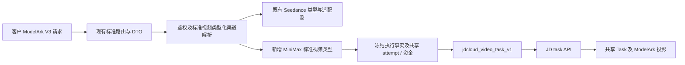

# MiniMax 标准北向与京东云南向适配方案

## 1. 问题与目标

为京东云提供的 `MiniMax-H3` 增加平台现有 **ModelArk V3 视频标准接口**接入，客户继续使用统一的
`model + content + 标准视频参数`，京东云的路径、`parameters` 包裹、响应和状态差异由南向 adapter 吸收。
这里的标准接口是 `/api/v3/contents/generations/tasks`，不能把本需求缩减为 `/v1/videos` 适配。

本次交付已完成方案编码与本地回归（见文末实施记录）：adapter、类型化接线、制品与版本存储、目录投影、
计费合同与内容交付均已落地并有合同测试覆盖。本地桩服务已覆盖网关创建、查询、下载及资金闭环。渠道未开启，真实 Provider、真实账单、
外部数据库与灰度验收仍未完成；在 §3.8 首期开放前验收项通过前，渠道保持停用，本文参数范围仍不是
已发布接口说明。

设计依据：

- [Seedance 专用渠道与 Link 架构](../20-architecture/Seedance专用渠道与Link架构.md)第 2、6—8 节：统一 ModelArk V3、确定性渠道、共享 Task 和冻结执行事实。
- [公开模型元数据投影架构](../20-architecture/公开模型元数据投影架构.md)：公开创建合同和操作矩阵来自代码登记，不从模型名推断。
- [异步任务与计费事实架构](../20-architecture/账单计费-异步任务与计费事实架构.md)：attempt、资金、Task 与 Provider 观测边界。
- [硬约束](../00-context/硬约束.md)：原生最小入侵、统一北向优先、敏感信息保护和跨数据库要求。
- [原生任务插件合同](../plugin-api/README.md)：JS 同步转换与 Go 宿主职责、管理和版本存储；其中原生路由及轮询选版规则不替代类型化视频的冻结合同。

### 1.1 与标准视频架构的对应边界

20 目录是标准视频合同的权威，本文只设计 MiniMax 的增量接入，不重定义现有通用规则。

| 权威架构 | 本方案遵循的合同 | MiniMax 增量 |
| --- | --- | --- |
| 视频架构第 2、5、6 节 | ModelArk V3 统一请求形状；南向吸收差异；条件字段按标准履约 | 新类型及 JD adapter，不新增北向 Provider 参数 |
| 视频架构第 4 节 | 类型化身份、唯一渠道、保存/启用校验、不进原生分发池 | 同一 ModelArk 入口内补跨视频类型的模型唯一性 |
| 视频架构第 7、8 节 | 单次 POST、durable attempt、冻结执行及共享 Task | 补 MiniMax 的类型分派，不复制任务和资金状态机 |
| 视频架构第 3.1.1 节 | 精确制品版本、配置一致性、执行依赖保护 | 显式登记新制品及其生命周期；Seedance 自动晋升仍按原范围执行 |
| 公开模型元数据架构第 2—4 节 | 单一声明投影、模型可见性、参数与操作合同一致 | 扩展 ModelArk 目录的类型范围，不建立第二套模型事实 |

JD 后台查询节奏、内容地址解析和首期参数范围均是该协议的局部设计，不升级为所有标准视频模型的
通用约束。原生入口、已有 Seedance 参数和生命周期继续遵循其现有合同。

### 1.2 最小入侵与当前插件合同

本方案以仓库当前代码与 20 目录为依据。“插件化”不等于把所有扩展都注册成原生 Task Plugin：
原生任务插件当前合同为 API v1；类型化视频扩展的配置声明由 API v2 引入，当前 Seedance 内置制品已用
API v3 将用量归一交回宿主。两类版本号属于不同合同，不能用更高数字替换原生插件 ABI。
MiniMax 新制品采用现有类型化扩展 API v3 的职责边界，复用 JS 引擎、严格编译校验与配置声明结构；
不另创 MiniMax 插件 ABI，不批量重命名现有 Seedance 编译类型或声明字段。

实施前按以下代码入口复核，避免把文档中的历史版本描述当成当前实现：

- `docs/plugin-api/v1.d.ts` / `v1.schema.json`：原生插件合同；本次不扩展其模型匹配、路由或重试语义。
- `pkg/jsplugin/seedance_extension.go`、`seedance_configuration.go`：类型化扩展编译与配置/用量协议。
- `plugins/seedance-link/plugin.js`：当前制品声明 `apiVersion: 3`。
- `plugins/embed.go`：遍历 `plugins/tasks/` 并注册原生 factory；类型化 MiniMax 制品不得进入该目录。
- `plugins/seedance_embed.go`、`pkg/seedanceplugin/store.go`、`model/task_plugin.go`：独立嵌入、精确版本解析及共享版本存储机制。

最小入侵以**减少原生修改面与后续上游合并冲突**衡量，不以文件数量最少衡量。优先新增独立文件，
已有入口只留必要的单行调用或窄分支；允许局部少量重复，禁止顺手重构整个插件框架。所有原生文件
改动都须记录“为何不能在扩展中完成、最小接线点、上游同步影响”，不能仅以“方便复用”为理由。

## 2. 当前实际情况

### 2.1 标准接口已存在，但当前限定 Seedance

| 边界 | 当前事实 | 本需求的含义 |
| --- | --- | --- |
| ModelArk V3 | 提供创建、单项查询、列表、删除；创建路由调用 `ResolveSeedanceChannel` | 需要显式接入 MiniMax 类型，不能只新增一个 HTTP 转换函数 |
| Seedance 专用渠道 | `ChannelTypeSeedanceLink`，代码登记南向协议，客户模型对应唯一已启用渠道 | MiniMax 不能冒充 Seedance 或加入 Seedance 模型登记表 |
| 原生视频 | `/v1/videos`、`/v1/video/generations` 由原生路由与任务插件履约 | 保留原有语义；本次新增标准入口不借此修改原生合同 |
| 原生 MiniMax | 类型 35 选择 `hailuo` 插件，使用 MiniMax 官方协议 | 京东云域名和 Key 不会自动把它变成京东云协议 |
| 模型目录 | ModelArk 专用目录当前只投影 Seedance | 新类型需要运行时与目录同时接入，目录不能反向授权执行 |
| 冻结连接 | `freezeTaskVideoUpstream` 当前仅处理 Seedance 类型 | 新类型必须补齐冻结、恢复、查询、内容和结算接线 |

代码核对入口为 `router/video-router.go`、`middleware/seedance_channel.go`、
`relay/relay_adaptor.go`、`plugins/tasks/hailuo/plugin.js`、`model/task_video_snapshot.go`、
`controller/video_modelark.go` 和 `controller/video_proxy_link.go`。
仅给类型 35 设置 `TaskPluginKey` 不会改变其固定的 `hailuo` 选择；仅将 `ClientProtocol` 设置成
`modelark_v3` 也不能自动补齐新类型的冻结连接和生命周期。

### 2.2 官方资料与真实调用分别证明什么

官方原文已分别保存：

- [京东云海螺文生视频 API 原文](../70-research/京东云/海螺文生视频API原文.md)。
- [京东云海螺图生视频 API 原文](../70-research/京东云/海螺图生视频API原文.md)。

两页以 `MiniMax-Hailuo-2.3` 为例，不是完整 H3 规格。原文中的 6/10 秒、分辨率组合、图片规格和
取消示例不能直接作为 H3 的全部能力合同。原文保留标题、表格、示例地址和参数，适配解释只写在本文。

本地测试环境直连 `https://modelservice.jdcloud.com` 的结果：

| 检查 | 观察结果 | 可得结论 |
| --- | --- | --- |
| 原生 MiniMax 渠道调用 | `/v2/video_generation` 返回 HTTP 400、参数解析失败 | 原生南向协议与京东云不一致；未形成有效视频 Task |
| JD 正确路径，文生请求未带 ratio | 提交被受理，随后任务失败；要求纯文本显式比例且不能为 adaptive | 仅凭创建 HTTP 200 不能判定生成成功；H3 有文档示例未覆盖的要求 |
| JD 正确路径与参数包裹，显式 `ratio=16:9` | pending → running → success，约 256 秒观察到完成 | 该 H3 文生组合真实成功，凭据与模型可用 |
| 下载结果 | HTTP 200、video/mp4；965,763 字节，H.264 1344×768、AAC，容器时长约 6.583 秒 | 已验证视频实际可下载；不是仅取得 task ID |
| 成功 usage | `video_output=6` | 官方将该字段解释为积分；不能因为数值与请求秒数相等就改称秒或 Token |

成功的南向请求形状如下，提示词为可公开测试内容，不包含凭据或任务标识：

```json
{
  "model": "MiniMax-H3",
  "content": [{"type": "text", "text": "A ceramic cup on a wooden table in soft morning sunlight. Slow camera movement. No people, no text."}],
  "parameters": {
    "duration": 6,
    "resolution": "768P",
    "ratio": "16:9",
    "prompt_optimizer": true,
    "watermark": false
  }
}
```

本地测试渠道 `JD-MiniMax-H3`（ID 137，原生类型 35）仍停用，价格未配置。
直连成功不代表 ModelArk 网关适配、真实账单、跨数据库或生产灰度通过。图生、其它时长与分辨率、
音轨开关、取消、结果过期及错误矩阵均尚未完成 H3 真实验收。

### 2.3 错误根因

| 项目 | 原生 H3 adapter | JD 已验证协议 |
| --- | --- | --- |
| 创建 | `POST /v2/video_generation` | `POST /v1/task/submit` |
| 视频参数 | 顶层字段 | `parameters` 对象 |
| 创建 ID | 顶层 `task_id` | `result.task_id` |
| 查询 | `GET /v2/query/video_generation/{id}` | `GET /v1/task/{id}` |
| 查询状态 | `task.status` | 顶层 `task_status` |
| 成功结果 | `task.content.url` | `content[].video_url.url` 等嵌套 URL |

因此修改 Base URL 或模型映射无法修复；必须有独立的京东云南向协议转换和响应解析。

## 3. 优化方案

### 3.1 类型化接入，共用现有标准合同

拟新增 `ChannelTypeMiniMaxLink`（数值在实施时按当前常量登记分配），管理名称“MiniMax 标准视频渠道”。
首个代码注册协议为 `jdcloud_video_task_v1`，显式登记 Provider 模型 `MiniMax-H3`。
该类型与协议只用于新增 ModelArk V3 能力；原生类型 35 和 `hailuo` 插件继续承担原生入口。

复用现有 ModelArk DTO、handler、Task、attempt、资金状态与内容代理，不新建 `/minimax/*` 客户接口、
MiniMax 专属 Task 表或账本。MiniMax 的南向转换和协议声明独立存放，不混入 Seedance 内置制品，
也不覆盖原生 `hailuo`。版本执行复用现有插件宿主：新增独立 `minimax-link` 制品和类型化接线，
创建前固定精确版本，后续操作按冻结版本执行；不得以当前 active 版本替代历史版本。

制品放入 `plugins/minimax-link/plugin.js`，通过新增的独立 embed 文件加载，复用 `TaskPlugin` 版本表；
不放入 `plugins/tasks/`，不进入原生 `DefaultRegistry` 的 factory、模型索引或端点候选。
不以 `meta.models`、`channelTypes`、`routes`、原生 `usageSchema` 或普通 Task Plugin Channel 来取得
ModelArk 履约资格。类型化宿主登记 key、协议及允许 hooks；版本化声明负责 Provider 配置与公开参数，
Channel 仍保存实际连接、映射和凭据，不增加第二套模型或协议配置事实。

| 插件制品（JS） | 宿主与类型化接线（Go） |
| --- | --- |
| JD 请求字段转换、响应包裹解析、候选状态映射与结果字段定位 | 鉴权、选渠、连接、HTTP、凭据、SSRF 和响应可信性校验 |
| 同一版本内的模型/公开参数声明、Provider 用量子树定位 | 参数安全上限、标准 DTO 投影、可信用量归一与字段来源证据 |
| 无副作用的同步 hooks | attempt、Task、调度、资金事务、内容代理与精确版本依赖保护 |

`relay/channel/task/minimax/` 只负责这些宿主边界与 hook 调用，不再写一份 JD 字段映射或状态解析作为
并行实现；插件不访问网络、数据库、文件或环境，不计算价格、扣款或发起重试。沿现有 API v3 用量
原则由宿主读取已定位的可信字段，不能让插件提供的数值直接成为最终计费用量。



标准视频解析器只处理代码明确注册的类型。客户模型精确匹配 Channel 模型清单，然后校验该 Channel
的类型和协议；不以 `MiniMax` 前缀、域名、价格、Key 或请求字段推断身份。一个客户模型在该标准入口
只对应一个已启用的类型化视频渠道，保存/启用时检查 Seedance 与 MiniMax 之间的重名冲突，不增加请求时
唯一性复检、启动修复或第二套路由表。已有 Seedance 路由行为保持不变。

新增类型不进入原生 Ability 或通用分发缓存，不使用 Priority、Weight、自动换渠或失败重选。
Group、Token 和合同授权仍在原有授权边界校验。客户模型通过 `model_mapping` 解析 Provider 模型，
管理员只配置代码允许的协议、模型、连接、单个凭据和价格，不编辑协议 JSON 或状态脚本。

这是对当前“标准入口仅 Seedance”范围的拟议扩展。实施完成后再更新 20 目录中的当前架构和公开目录范围，
本次不把尚未实现的 MiniMax 接线写成当前事实。

### 3.2 北向接口与操作边界

| 操作 | 标准入口 | MiniMax 首期行为 |
| --- | --- | --- |
| 创建 | `POST /api/v3/contents/generations/tasks` | 标准 DTO → JD adapter；只有可信上游 ID 才创建平台 Task |
| 单项查询 | `GET /api/v3/contents/generations/tasks/{task_id}` | 按冻结连接查询 JD，返回现有 ModelArk 投影 |
| 列表 | `GET /api/v3/contents/generations/tasks` | 查询本站 Task，复用分页、过滤与归属隔离，不扫描 JD 账号 |
| 删除/取消 | `DELETE /api/v3/contents/generations/tasks/{task_id}` | 保留现有路由及状态语义；取消验收前不发布支持，返回既有不支持错误 |
| 内容下载 | 查询结果中的本站 `content.video_url` | 复用 `/v1/videos/{task_id}/content` 内容代理，不等于使用 `/v1/videos` 创建合同 |
| 模型发现 | `/v1/models`、详情、价格及 ModelArk 模型目录 | 从同一类型化声明投影 `api.video`，ModelArk 目录扩展包含新类型 |

北向示例（拟发布的最小文生合同，客户模型名由管理员配置）：

```http
POST /api/v3/contents/generations/tasks
Authorization: Bearer <PLATFORM_API_KEY>
Content-Type: application/json
```

```json
{
  "model": "customer-video-model",
  "content": [{"type": "text", "text": "晨光下木桌上的陶瓷杯，镜头缓慢移动。"}],
  "duration": 6,
  "resolution": "768p",
  "ratio": "16:9",
  "watermark": false
}
```

创建返回既有 ModelArk 创建响应；查询沿用 `id/model/status/content/error` 等标准投影。
`id` 是平台 Task ID，`model` 是客户模型，成功视频地址是本站鉴权地址。
响应不返回 JD `requestId`、Provider task ID、原始模型名、协议或渠道配置。

首期实现和验证聚焦上述已实测文生组合。其它组合保持待验证，不把单次实测值写成 H3 厂商完整枚举；
首期按受限试用合同发布，必须在参数元数据与说明中明确“本平台首期开放范围”：文生、6 秒、768p、
16:9、无水印，输入为单个非空 text 节点。该范围是本平台本次拟开放集合，不是 H3 厂商完整规格；
运行时和各目录从同一版本声明读取，不把推荐值当限制，也不在通用 ModelArk DTO 中硬编码该集合。
图生设计沿用标准 `content[].image_url` 和角色表达；H3 首帧、尾帧、参考图及多图角色尚未取证，
不得先删除 `role` 再当成等价输入。图生、视频/音频输入和素材库不随文生接入自动发布。

### 3.3 请求字段映射

| 北向字段 | JD 南向字段/处理 | 约束 |
| --- | --- | --- |
| `model` | 映射后的 `model` | 只发送代码登记的 Provider 模型 |
| `content[].text` | `content` 的 text 节点 | 保持提示词语义；首期仅已验证文本场景 |
| `duration` | `parameters.duration` | 默认值拟定 6；冻结后发送，先校验正数与共享安全上限 |
| `resolution` | `parameters.resolution` | `768p` → `768P` 是枚举拼写转换；不得将 `720p` 偷换成 `768P` |
| `ratio` | `parameters.ratio` | 文生未传时由已声明默认值补 `16:9`，不让客户为 JD 新增字段 |
| `watermark` | `parameters.watermark` | 首期固定 false，保留显式 false 并冻结；true 的交付能力验收后再扩展声明 |
| 无对应北向字段 | `parameters.prompt_optimizer=true` | 固定南向策略；公开说明平台启用提示词优化，客户不透传该 Provider 私有字段 |

文生 `ratio` 的首期客户合同明确为可选、默认 `16:9`、开放枚举仅 `16:9`。显式 `adaptive` 或其它
未开放值在该模型的参数校验阶段返回 HTTP 400、`error.code=invalid_request`，说明当前文生合同不支持
该比例；此时不建立 attempt、不预扣、不调用 JD，也不暗改为默认值。合法但不可访问的模型先按既有授权
规则处理，不能借参数错误泄露模型合同。这一模型级枚举不收紧其他 ModelArk 模型对 adaptive 的支持。

JD 失败信息给出了 `16:9/4:3/1:1/3:4/9:16/21:9`，目前仅 `16:9` 完成成功验收；其余比例须补测后
更新同一声明及公开范围，不能从失败说明推导它们已全部验收。
北向默认值、计费使用值、南向发送值必须一致，不能只在序列化最后一步补默认而漏掉计费冻结。

`generate_audio`、`return_last_frame`、`seed`、`camera_fixed`、`frames`、callback 等须逐项核对标准语义与
JD 可履约证据。已发布标准明确规定的条件不生效字段按合同转换或忽略；有实际交付语义但未能履约的
特性不能伪装支持。成功文件含 AAC 只证明该次输出有音轨，不证明 `generate_audio=false` 能履约。
不借南向适配增加 `parameters`、`extra_body` 等任意透传入口。

Go 可选标量使用指针和 `omitempty`，保留 false/0 与未传的区别；业务 JSON 编解码使用 `common` 封装。
先完成北向结构、公开范围和计费上界校验，再进入资金 hold 和 Provider POST。

### 3.4 JD 创建、查询与状态归一

连接采用 Channel Base URL（本次实测 HTTPS），按现有绝对 HTTP(S) 配置语义拼接固定路径。
凭据只由宿主附在 JD API 的 `Authorization: Bearer`，客户端 Key 不转发上游。

创建严格读取 `result.task_id` 与 `result.status`。HTTP 2xx、无接口错误、合法非空 ID 且状态为
已登记受理态 `pending`，才认定创建成功。现有官方创建示例和本次实测均只证明 pending；原文查询章节的
状态枚举不作为创建响应的状态枚举。本次不声称已掌握 JD 创建响应的完整状态空间，也不预先接受 running
或 success。实施取证若发现其它创建受理态，须先验证其 ID、错误和受理语义，再更新版本化登记及测试。

明确未创建的拒绝释放 hold；发送后超时、畸形响应、缺少 ID
或矛盾结果进入 `unknown`，不猜测其它 JSON 包裹，不重发 POST。

查询严格校验顶层 `task_id` 等于冻结的 Provider task ID，再读取 `task_status`：

| JD 状态 | 北向状态 | 接受条件 |
| --- | --- | --- |
| `pending` | `queued` | 身份一致，无矛盾错误 |
| `running` | `running` | 身份一致，无矛盾错误 |
| `success` | `succeeded` | 身份一致、无有效错误且有可信视频结果 |
| `failed` | `failed` | 身份一致、失败合同可信；错误码和说明经过脱敏 |
| `cancelled` | `cancelled` | 身份一致、明确取消事实，不从 DELETE 超时猜测 |
| 其它/缺失/畸形 | 不推进业务终态 | 记录不可采信观察，沿共享核查与后续恢复流程处理 |

成功实测存在 `error={code:0,type:"",message:""}`。不能把 error 对象非空当成失败；应接受 null 或
已取证的零码空错误结构，非零错误与成功状态冲突时保持不可采信。查询 HTTP 404、失效响应或成功但
结果缺失均不能自动等同生成失败和退款。

成功内容读取 `content[].video_url.url`；水印交付若需要 `watermarked_url.url`，必须按冻结请求选择并验证，
缺失时不静默换成另一种交付。`cover_url` 是封面，不可当成标准 `last_frame_url`。首期按单视频结果验收，
多结果形状未定义时显式记录合同异常，不任选一个吞掉其余结果。

JD 文档有 `DELETE /v1/task/{id}`，但仅是取消，不证明终态删除可用。首期两个 lifecycle 支持位均关闭；
补齐排队取消、竞态、重复取消和真实退款验收后才开放排队取消。运行中和终态继续遵守现有 ModelArk
DELETE 状态规则，不因 JD 可能接受某次调用就扩大北向语义。

### 3.5 共享耐久执行、轮询与内容交付

发送前沿用 `prepared → sending`，资金 hold、必要 reservation 与 sending 同事务提交。
成功后 Task、hold 转移与 attempt 完成原子提交。创建结果不明不得自动重发或换渠；未转移的创建占款
按既有 24 小时保障期限释放客户资金，Provider 成本风险保持未知，不伪造上游终态。

新类型必须冻结客户模型、Provider 模型、ChannelType、代码协议、精确制品版本、Base URL、查询路径、
代理、受保护凭据和计费事实。当前快照 helper 只处理 Seedance，`FrozenVideoTaskChannel` 又依赖数值
平台身份，因此不能直接把原生 `Platform=hailuo` 的任务接到这条链；新类型采用与类型化视频一致的平台
身份，新增局部接线并测试恢复。旧类型 35 的 Task 不批量改型、不改快照。

#### 查询节奏与按需下载分开处理

JD 原文建议至少间隔 15 分钟查询、成功结果信息只保存 90 分钟。15 分钟目前是建议，尚无证据证明它是
覆盖所有查询场景的强制限流门槛。本方案据此选择该协议的后台轮询默认间隔，不把建议转换成客户下载
必须等待 15 分钟的规则，也不修改其他协议的全局轮询行为。

| 场景 | 拟定行为 | 边界 |
| --- | --- | --- |
| 后台轮询 | 在共享调度器按该协议 15 分钟默认节奏查询 | 仅调整 JD 的调度策略，不新增独立任务状态机 |
| 客户单项 GET | 返回持久 ModelArk 投影；到刷新时机时复用同一可信观测处理 | 未到刷新时机可返回最近事实；不伪造完成或进度 |
| 成功任务下载，临时地址仍可用 | 直接使用短期缓存中的已验证地址回源 | 不重新查询状态，不持久化完整签名 URL |
| 成功任务下载，缓存缺失或地址已明确过期 | 用冻结连接和 Provider task ID 发起一次按需 JD GET，解析后回源 | 不受后台下一次轮询时间阻挡；不是 Provider 创建重试 |
| JD 明确限流或暂时故障 | 按既有脱敏错误合同报告暂时不可用，遵守可信限流信息 | 不自动连续查询、不重发创建、不凭故障推导生成失败 |

按需 GET 的频率可接受性尚待 JD 依据及真实验证，是该协议开放下载前的交付验收条件。若确认 JD 强制
限制该场景，需先修订局部交付方案并验证再开放渠道；不能回退到“缓存丢失便等下一轮，可能错过结果”
的设计，再以公开免责声明代替履约验证。客户端已有请求限流继续生效，不因区分场景而无限访问上游。

#### 冻结内容源、缓存与过期

内容交付复用视频架构第 8 节的冻结连接和唯一内容代理，保留既有授权、SSRF、Range/HEAD 处理。
Task 保存可信成功和已验证结果存在等最小事实，不以一个本站内容占位 URL 伪装成功结果；Provider task ID
留在受保护快照，完整签名 URL 和原始响应不进入 Task。临时地址由冻结 JD adapter 解析，短期内存缓存
只减少重复查询；缓存键须绑定任务及冻结执行身份，不能跨任务/渠道复用。

节点重启、请求落到另一节点或缓存淘汰后，必须能通过冻结事实重新取地址，不依赖进程缓存获得下载资格。
重复查询可以合并，但不新增以缓存为权威的业务状态。查询返回的结果仍须校验身份和结果合同；可信状态
或用量更新只经过现有共享入口，内容代理不直接操作资金，也不重复结算。

JD API 凭据只附到冻结 JD API 地址，不跟随媒体 URL 或跨域重定向发送到 CDN。已有地址可用时不为刷新
而额外查询；回源 403/404 本身不证明链接到期，只有可信过期事实才使用过期语义。

90 分钟是外部文档给出的保存边界，尚需验证 H3 的起算点及查询/下载表现；不承诺从本地首次观察成功起
再延长 90 分钟，缺少权威时间时不伪造 `expires_at`。公开说明临时下载与及时保存要求，以及超过上游保存
窗口后平台可能无法再次取得结果；不宣称供应商底层文件必然永久删除，也不把本地缓存丢失当成上游过期。
已确认成功的任务不因一次内容错误而改为生成失败、自动重建或退款；资金处置继续沿共享架构，不能由
下载 handler 发明补偿规则。首期不新增媒体长期存储。

### 3.6 计费与公开元数据

复用现有任务表达式引擎及共享原子资金入口，遵循
[表达式计费设计](../../pkg/billingexpr/expr.md)。首期客户价格按管理员明确配置的请求秒数或次数冻结，
不得自动复制原生 MiniMax、Seedance 或其他 Provider 价格。缺少有效价格时不开放新受理。

`usage.video_output` 按官方含义保存为 `credit` 单位的 Provider 用量证据，同时保存字段来源；不写入
北向 `completion_tokens/total_tokens`，不覆盖请求秒数。其与 JD 账单金额的换算尚未验证，Provider
成本金额保持未知。首期不开放依赖该积分实测值的客户价格表达式，避免缺少预扣上界和缺用量策略时误收费。
若将来按积分收费，须另行补齐 credit schema、提交预算、可信终态替换与缺用量结算规则。

API v3 的 `usage_scan_root` 只表示插件定位到的 Provider 用量子树，不是可信归一结果。
现有 `NormalizeTerminalTokenUsage` 处理 Token，不能把 JD 积分塞进它的 Token 字段。JD credit 取值与
非负、有限、上界校验放在新增的局部宿主用量归一文件，复用既有证据与单位表达；不改通用 Token
归一规则，不在原生插件 schema 中添加本地私有计费捷径。未来响应含可信 Token 字段时，仍由现有
Token 归一入口处理，与 credit 事实分别保留。

请求 6 秒而容器实测约 6.583 秒，不构成自动按 6.583 秒或向上取 7 秒收费的依据。
所有计费乘数先校验上界，quota 使用统一 checked 转换；重复轮询、取消竞态和资金补偿必须幂等。

模型发现、详情、价格和 ModelArk 模型目录复用同一 MiniMax 代码声明生成 `api.video`，发布标准路径、
参数默认值、首期开放范围和操作矩阵，不暴露 JD 私有协议。`api.assets` 不发布素材操作或复用域；
JD 图生文档不等于素材库能力。新类型的模型目录读取不能将其加入原生 Ability 或给原生入口增加拒绝逻辑。

素材运行时也必须与公开合同一致：调用 `/v1/assets` 或 `/v1/asset-groups` 的现有方法时，先沿既有
鉴权、请求结构和模型可见性边界处理；对已确认可访问的 MiniMax 客户模型返回 HTTP 422、
`unsupported_asset_operation`，不查找 Seedance 渠道、不调用 JD 素材接口。未知或不可见模型保持既有
`model_not_found` / 授权错误语义；不能为返回“不支持”而泄露隐藏模型，也不新增素材路由。

公开使用说明与参数投影共同交付以下客户可见行为，不新增 Provider 私有可配置字段或另一套能力事实：

- 单文本、6 秒、768p、16:9、无水印是本平台首期开放范围，省略项的默认值与实际发送一致；
- 平台固定启用提示词优化，生成前可能优化输入提示词，当前没有客户端关闭开关；该说明不暴露南向字段名；
- 状态刷新可能滞后于上游完成，成功后应及时下载并自行保存；提供临时下载，不承诺长期存储；
- 外部资料给出的结果保存窗口为成功后 90 分钟，H3 实际边界须验收；公开发布时只承诺已验证行为，
  不把它写成本站从首次 GET 起提供 90 分钟保留；
- 真实上游限流或暂时故障可能使下载暂时不可用，超过保存窗口可能无法重新取得结果；
  本地缓存丢失本身不构成拒绝下载理由，也不等同结果过期。

### 3.7 实施落点与最小改动

以下文件名为实施建议；优先在新增文件实现，再在既有边界保留窄接线。

| 改动面 | 拟实施内容 | 原生修改必要性及合并影响 |
| --- | --- | --- |
| 类型与代码协议 | 新增 MiniMax 类型常量、`jdcloud_video_task_v1` 声明及独立注册文件 | 仅常量/注册接线；保留原有编号和枚举语义 |
| MiniMax 执行 | 新增 `plugins/minimax-link/plugin.js`、独立 embed 与 `relay/channel/task/minimax/` 薄宿主接线 | JS 唯一负责 JD 协议转换；不进入原生 factory，不改 `hailuo/plugin.js` |
| 标准入口选渠 | 新增标准视频类型化解析实现，`router/video-router.go` 的 ModelArk 创建入口替换一处 resolver 接线 | 该路由已有本地扩展；不动原生视频路由和 `Distribute` 行为 |
| 管理与目录 | 新增 MiniMax 保存校验/模型投影文件，扩展类型化模型唯一性和 ModelArk 目录筛选 | 共用 Channel 表与目录入口；管理 UI 只增加类型/协议表单，zh/en 文案 |
| attempt、Task 和恢复 | 扩展新类型的冻结、精确版本依赖、恢复及生命周期分派 | 共享文件只留新类型分派，不复制资金状态机；现有 Seedance 专用判断须逐项审视 |
| 内容与轮询 | 新增 JD 内容源解析，区分后台节奏与按需下载查询 | 继续复用唯一内容代理、鉴权与调度器，不另起定时任务体系 |
| 计费 | 新增局部宿主 credit 取值与价格资格校验，接入共享资金入口 | 不冒用 Seedance 专用协议归属或 Token 单位；不扩写通用表达式引擎，不新增账本 |

现有类型化插件的部分配置声明和宿主调用限定 Seedance，实施时需要补 MiniMax 的显式类型注册与声明消费入口，
不能仅复制一个制品就声称获得全生命周期支持。避免为这一个协议重构所有 Provider；必要的共享入口
扩展以可观察合同测试为边界。

跨类型的新入口和新文件使用“标准视频”语义命名，既有 `ListSeedanceModels`、
`GetConfiguredSeedancePublicModels` 等仍只承担 Seedance 子集。新入口组合类型化投影后返回同一公开合同，
不把 MiniMax 塞进名为 Seedance 的查询，也不为更名而重构原生调用链或增加兼容别名。
这里区分“业务查询范围”与“已存在的编译 ABI”：可传入显式宿主合同的编译器和配置结构允许直接复用，
不为消除内部名称中的 Seedance 而复制整套编译器或变更历史制品字段。

实施改动范围还须满足以下约束：

- 不改原生 `hailuo`、通用 `Distribute`、普通 Task Plugin 选版/重试和其他 Provider 的模型资格；
- 不新增 MiniMax 版本表、发布控制台、独立同步循环、调度器、Task 表或资金状态机；
- 复用现有版本存储、锁、管理接口、同步时机与执行引擎；类型判断之外的新增逻辑放独立文件；
- 不为 JD 修改全局轮询周期、创建幂等合同或 Token 用量规则；不以关闭验证、引用保护等方式减少改动；
- 不将“建立通用插件平台”作为前置任务；只有两个实际类型需要共享的稳定边界才做局部参数化；
- 若共享文件无法保持窄接线，在实施记录中先明确不可替代的原因和具体冲突面，再进行必要的最小改动。

#### MiniMax 制品的发布、激活与执行依赖

遵循视频架构第 3.1.1 节的版本与依赖不变量，首期采用**部署入库但不启用、管理面显式启用及选择升级版本**的发布策略。
该选择只作用于新增 MiniMax 制品，既有 Seedance 随部署自动晋升继续按原规则运行。以下能力均为新增
接线要求，不声称现有 Seedance helper 已自动覆盖 `minimax-link`。

沿用 `TaskPlugin.Active`（当前选定版本）与 `Enabled`（可接受新请求）的既有区分。
`SaveTaskPlugin` 当前会把首个版本设为 active，方案不为避免这个标记而修改所有插件的保存语义：
首次通过扩展入库接线保存 `Enabled=false`，允许首版按既有规则成为 active；管理员显式启用后才允许新受理。
后续内置版本只补缺失记录，不反复保存既有记录以免覆盖管理员启停选择，也不自动替换当前 active。

| 阶段 | MiniMax 拟定规则 |
| --- | --- |
| 首次入库 | 复用部署同步时机，完成类型化编译校验后新增版本，Enabled=false；首版可按既有规则成为 active，但不准入新请求、不启用 Channel |
| 激活/升级 | 复用现有制品管理入口；在该 key 的配置/发布锁下验证目标声明与已保存渠道兼容性，再原子切换 active；不兼容时保持原状态并报告错误 |
| 管理保存 | 表单携带所读声明的版本；渠道保存、制品激活及重新启用共享协调边界，不在升级中改写模型映射、默认值或凭据 |
| 多节点加载 | 每个节点按主库已提交的 active 身份加载精确制品；开始新受理时核对固定身份，未加载、编译失败或宿主不支持的节点停止该类型新准入，不沿用旧缓存 |
| prepared 与删除 | 创建引用和删除在同一精确版本锁下串行化；prepared 固定 key/API version/版本并写入冻结与恢复快照，不能在删除检查后无锁新增引用 |
| 依赖保护 | 删除检查覆盖该 key 的 attempt 与 Task，以及活动任务、未完成资金状态、仍可查询的成功任务；停用、非 active、编译失败版本同样受保护，查询失败不得当作零引用 |
| 执行与恢复 | GET、轮询、内容解析、取消及补偿都读取冻结版本；缺失或无法编译时明确失败关闭，不替换成 active 或原生 hailuo |
| 停用/回滚 | 停止新受理不停止旧任务；需要切换旧版本时仍做配置兼容校验，只影响新请求，不改已有快照；保留所有被引用版本 |

同 key/版本的源码不可覆盖；修改源码必须发布新版本。旧节点不得在启动同步中改写 active 或降级数据库
版本，已有显式停用状态不能被部署重启恢复。多节点的编译缓存只保存主库制品的可重建副本，不成为
版本权威。

具体缺口必须补齐：`SeedancePluginExecutionUsageApplies` 当前只匹配 `seedance-link`，
`model/task_plugin_seedance_usage.go` 的 Task 查询只筛 Seedance 平台类型，
`model/task_plugin_seedance_lock.go` 的引用锁和删除保护也受该限制。新增 MiniMax 类型化依赖接线须同时
覆盖 key、平台类型、prepared 快照与终态依赖，不能只扩展字符串判断而遗漏 Task 查询。
仍可查询的成功任务即使已结算也保留版本依赖，不能仅凭 JD 保存窗口推导该版本可删除。

不原地把测试渠道 137 改成新类型。新类型上线后通过管理校验新建停用配置、明确客户模型和映射，
完成价格与验收后再开放测试分组。回滚停止新受理，保留已冻结制品版本和旧任务履约；不能通过删除
渠道、制品或改历史 Task 来回滚。

### 3.8 验收清单

| 层级 | 必须验证的可观察行为 |
| --- | --- |
| adapter 合同 | 固定 JD 路径、参数嵌套、显式 false、默认比例、合法 ID/状态；只接受已取证创建态，查询状态枚举不反向扩大创建合同；零码 error 不误判 |
| 北向一致性 | ModelArk 示例可创建/查询/列表/下载；平台 ID 与客户模型投影；显式 adaptive 在 attempt/预扣/POST 前报 400；目录与运行时范围一致，其他模型语义不变 |
| 原生回归 | 既有类型 35、`/v1/videos`、`/v1/video/generations` 与 Seedance 标准入口行为不变 |
| 安全与隔离 | 按 `user_id + app_id` 隔离；合同/Token/Group 校验；无凭据、Provider ID、完整签名 URL 泄漏 |
| durable 创建 | 提交前事务失败不发送；发送后超时不重发；取得 ID 后落库故障可恢复；24 小时资金保护不伪造业务失败 |
| 冻结与版本 | 停用渠道、修改 Key/映射/价格、激活新版后，旧任务仍用冻结连接、制品和价格；缺版本失败关闭 |
| 发布与引用保护 | 首版可为 active 但 Enabled=false，安装/重启不覆盖显式启停；兼容校验失败不切换 active；旧节点不降级；prepared/删除互斥；活动及可查询成功 Task 阻止删除引用版本 |
| 插件隔离与最小接线 | 类型化制品不进入原生 factory/候选；JS 无网络和资金副作用；JD 转换只有一份实现；现有原生插件 ABI/行为不变；列出每个原生修改点的必要性与合并影响 |
| 轮询与交付 | 404、畸形响应、ID 不符、成功无结果不触发错误退款；后台节奏不阻挡按需下载；验证实际限流、90 分钟边界和 CDN 凭据隔离 |
| 冷缓存与多节点 | 重启、淘汰或跨节点后仍按冻结身份解析内容；临近上游保存窗口时不因等待后台下一轮而丢失获取机会；验证 Range/HEAD、多次下载及无错误退款 |
| 素材与说明 | 可访问 MiniMax 模型报 422 unsupported_asset_operation 且无素材上游调用；未知/不可见模型不泄露；提示词优化、参数范围和临时下载说明与实际行为一致 |
| 资金 | 重复终态只结算一次；credit 不当秒数/Token；未知供应商金额保持未知；跨数据库原子行为 |
| 真实 Provider | 通过网关完成 H3 文生创建至视频下载，再验证失败/取消等计划开放能力，核对 JD 账单 |

后端新增测试遵循 testify 约定；数据库涉及 SQLite、MySQL、PostgreSQL；如修改 `relaykit/`，运行
`cd relaykit && GOWORK=off go build ./...`。实现阶段对实际修改运行最小相关测试，再按风险扩展。
文档运行 `task docs:check`、`task ai:check`；发布公开 API 文档时另运行 `cd web && bun run docs:validate`。

当前已完成外部原文保存、架构与代码边界核对、一次 JD H3 文生成功直连。
方案编码与本地网关桩服务回归已完成（见 §4.4）；真实 H3 网关端到端、图生/取消/其它参数、真实账单对账、外部数据库和灰度验证仍待验收。
其中 JD 按需结果查询的频率依据、冷缓存下载、H3 保存窗口、MiniMax 制品发布与引用删除保护是首期开放
前的必要验收项；未通过时保持渠道停用，不能靠“架构方向一致”或补充限制说明代替交付验证。

## 4. 实施记录（2026-09-24）

编码已按本方案完成。新增文件承担 MiniMax 专属逻辑；既有文件只保留窄接线，逐点说明如下。

### 4.1 新增文件

| 文件 | 职责 |
| --- | --- |
| `constant/minimax_channel.go` | 类型常量 64、`jdcloud_video_task_v1` 协议与 JD 固定路径（model 与 relay 的公共依赖） |
| `plugins/minimax-link/plugin.js` + `plugins/minimax_embed.go` | JD 转换唯一实现：buildCreate/parseCreateResponse/parseTaskObservation、声明与公开元数据；独立 embed |
| `pkg/jsplugin/minimax_host_contract.go` | `minimax-link` 类型化宿主合同（复用 Seedance 编译器与配置结构，不另造 ABI） |
| `pkg/minimaxplugin/store.go`（+store_test） | 部署入库不启用、显式启用、精确版本解析、失败关闭 |
| `pkg/minimaxlink/usage_fields.go` | 叶子计费 schema（宿主探针事实，无 tokens/credit 乘数） |
| `relay/channel/task/minimax/`（constants/declaration/plugin_extension/bridge_create/bridge_query/bridge_helpers/usage/adaptor/content + 测试） | 薄宿主接线：pin、hook 调用、宿主不变量校验、credit 局部归一、冻结执行、按需内容源与短期缓存、生命周期能力位 |
| `model/channel_minimax_settings.go` / `channel_minimax_uniqueness.go` / `channel_standard_video_route.go` / `minimax_plugin_configuration.go` / `channel_minimax_public_catalog.go`（+测试） | 设置校验、跨类型唯一性、类型化选渠、发布锁/激活/删除保护/管理投影、公开目录 |
| `middleware/standard_video_channel.go` | 标准入口类型化解析（MiniMax 命中走新路径，其余保持 Seedance 行为不变） |
| `controller/standard_video_catalog.go` / `minimax_plugin_extension.go` | 合并目录入口与列表/单模型投影、minimax 扩展同步与编译路由 |
| `relay/task_minimax_disposition.go` | JD 错误信封的创建拒绝分类（文档化信封 + 4xx + 无 task id） |
| `service/task_minimax_polling.go` | 该协议 15 分钟后台节奏与按需下载分离 |
| `web/src/features/channels/lib/minimax-plugin-configuration.ts`、`components/drawers/minimax-protocol-fields.tsx` | 管理表单声明 pin 与固定协议说明（zh/en 文案已同步） |

### 4.2 既有文件的窄接线（必要性与合并影响）

| 文件 | 接线 | 说明 |
| --- | --- | --- |
| `constant/channel.go` | +1 名称映射项 | 管理端显示名；上游枚举块未动 |
| `model/channel.go` | +1 瞬态字段、ValidateSettings +1 分支 | 表单版本 pin 与设置校验分发；均为追加 |
| `model/ability.go` | 模型清单与 ability 视图追加 minimax | 只增投影，不改原生 Ability 行 |
| `model/channel_type_gating.go` | skip 列表 +1 类型 | 类型化渠道不产通用 Ability |
| `model/channel_seedance_settings.go` | 唯一性入口按类型分发 + 查询扩为类型集合 | 共享标准入口的跨类型唯一性；Seedance 语义不变 |
| `model/channel_seedance_pricing_ownership.go` | 定价归属按类型集合 | minimax 与原生定价键互斥 |
| `model/task.go` | TaskPrivateData +1 轮询调度字段 | 该协议 15 分钟节奏的持久事实；JSON 追加字段 |
| `model/task_video_snapshot.go` | freezeTaskVideoUpstream +minimax 分支 | 冻结同形快照；Seedance 分支未动 |
| `model/task_plugin.go` | 启用/激活/删除 +minimax 分支与锁 | 复用既有生命周期管理入口；seedance 分支未动 |
| `model/task_plugin_seedance_usage.go` | 谓词扩为 typed 集合 + 平台按 key 映射 | 引用保护覆盖 minimax；schema/锁机制复用 |
| `model/pricing_seedance_catalog.go` / `customer_contract_projection.go` | 目录/合同元数据并入 minimax 子集 | 同一定价与合同投影面 |
| `model/seedance_plugin_configuration.go` | 无改动 | minimax 配对逻辑独立成文件 |
| `relay/relay_adaptor.go` | GetTaskAdaptor +1 行分派 | 平台 "64" → 类型化 adaptor |
| `relay/task_create_disposition.go` | +3 行类型分派 | minimax 走独立拒绝分类 |
| `relay/helper/task_tiered_price.go` | taskUsageBilling +minimax schema | 宿主冻结参数通过 u() 计费；tokens 与 credit 字段禁止用于客户计价 |
| `controller/relay.go` | 无重试门 +1 类型 | 共享单次 POST 合同 |
| `controller/channel.go` / `channel_authz.go` | +pin 调用、+1 字段分类 | 管理保存协调与读权限分类 |
| `controller/task_plugin.go` | 上传门/列表分支/同步调用 +minimax key | 复用同一管理面 |
| `controller/customer_contract_models.go` / `model.go` | 合同过滤 + 目录入口换标准视频实现 | Seedance 子集函数保留未动 |
| `controller/video_proxy_link.go` | 内容源 switch +minimax case | 复用唯一内容代理、SSRF、Range/HEAD |
| `service/asset_service.go` | +5 行 422 分支 | 可访问 minimax 模型返回 unsupported_asset_operation |
| `service/task_polling.go` | +节奏门与调度写入（2 处 ≤6 行） | 仅该平台参与；其他协议不变 |
| `router/video-router.go` | resolver 与 models handler 两处替换 | 路由组结构不变 |

### 4.3 验证与遗留

- 全仓库 `go build` 通过；`relaykit/` 未修改（`GOWORK=off` 约束不受影响）。
- 新增测试：制品编译隔离、JD 线缆形状与开放集拒绝（adaptive/水印/多节点/未支持字段）、创建受理态登记、
  查询状态映射与零码 error、身份不符/成功无结果/多结果不可信、credit 归一边界、宿主存储形状、
  部署不启用与启用保护、删除引用失败关闭、跨类型唯一性、设置校验、生命周期能力位。
- 既有 Seedance/controller/service/middleware/jsplugin 回归通过（controller 并发删除用例存在与本次
  无关的既有抖动，单跑通过）。
- 2026-09-24 实施后评审修正四个缺陷并补回归测试：①标准入口探针去除分组过滤（`auto` 组与合同令牌
  此前永远无法路由到 MiniMax 解析器；分组/令牌授权仍在解析器内产生既有错误语义）；②素材 422 分支
  保持分组感知，无分组权限的调用方仍得到 `model_not_found`，不泄露隐藏模型；③终态计费准备守卫扩展
  到 MiniMax 类型化身份（此前 credit 证据与可退终态 Operation 被静默跳过，违反 §3.6）；④上游查询
  节奏纳入任务快照变更检测并把快照前移（此前节奏字段在观测不变的轮次不会落库，15 分钟节奏在首轮后
  失效）；另修复请求路径适配器分派顺序（此前 pinned 插件会把平台改写为制品 key 并用通用 js-plugin
  适配器替代类型化适配器，创建链路整体失效）。四项均有对应回归测试。
- 待验收（对应 §3.8）：网关端到端 H3 文生至下载、按需 GET 频率依据、冷缓存下载、90 分钟保存窗口、
  真实账单对账、外部数据库与灰度。未通过前渠道保持停用。
- 20 目录的完整架构收敛（标准视频入口成为当前事实）待真实 Provider 验收后随 10/20 文档一起更新。


### 4.4 复审修复与本地闭环验证（2026-09-24）

此次修复保持 20 目录的唯一标准视频状态与资金底座，不增加 Task、账本、原生插件路由或 Provider fallback：

- `HasTypedVideoBillingFacts` 将明确的 MiniMax 冻结身份接入既有计费上下文创建、行锁观察合并、原子资金
  目标、补偿扫描与日志交付。保留 Seedance token 身份判断，MiniMax credit 只作为私有证据；第一次
  接受的证据与来源不可被后续观察覆盖，差异只进入已有审计字段。旧轮询/计费写入不得重开已结清状态。
- 成功单调性同时作用于 adapter、共享错误分类及数据库 CAS。后续 404、错误 ID、冲突状态不撤销成功
  与内容入口。JD 取消观察进入已存在的取消终态和退款路径，不经过成功金额结算；退款失败由原有扫描恢复。
- 相同观察也持久化下一轮查询时间，按需下载仍独立于后台节奏。查询时间沿共享行锁观察写入保留。
- MiniMax 公开投影采用声明中的时长及单值分辨率/比例默认值，按已登记宿主合同只发布单文本节点与
  固定关闭水印。声明、协议、映射或数据库故障明确失败，不返回残缺成功目录。
- 价格保存、管理 schema、公开价格目录和创建预扣统一采用 MiniMax 既有字段合同。仅有 MiniMax
  渠道时也生成价格目录；不要求 token 预算，不允许用 tokens/credit 字段定价，冻结单位不冒充 token。

最小接线与上游同步影响：

| 既有接线点 | 必要性与最小范围 | 合并影响 |
| --- | --- | --- |
| `model/task.go` 的 `UpdateWithStatus` | 用类型化谓词复用现有行锁观察合并，防止资金状态被旧观察覆盖 | 原生文件只替换既有本地分支谓词，不新增状态机 |
| `service/task_polling.go` | 成功保护谓词、MiniMax 取消认可/退款窄分支 | 同步上游时保留这些明确类型分支，原生状态域不扩展 |
| `model/model_pricing_config.go` | 预算展示由已有 schema 的 token 字段决定 | 一处赋值替换，其他原生价格语义不变 |
| 既有 Link 计费/日志/价格辅助文件 | 扩展明确类型集合，复用原子事务、schema 及目录，不复制结算实现 | 本地扩展文件内调整，已有 Seedance 函数名保留以避免无关重命名 |
| `relay/helper/task_tiered_price.go` | MiniMax 冻结自身 schema 的计费单位 | 仅类型分支；原生金额引擎不变 |

回归入口：`controller/minimax_funds_e2e_test.go` 通过真实鉴权、标准入口解析、RelayTask、attempt、
本地 JD HTTP 桩、共享查询与内容代理，验证公开默认值可提交、auto 分组、发送前资金冻结、Task 原子
转移、渠道修改后冻结履约、credit 留证与不作 token、成功后异常观察、无凭据 CDN 下载、取消/失败
退款故障恢复、幂等资金与日志、相同观察的查询节奏、目录失败显形，以及不支持参数在 hold 前拒绝和
创建 unknown 不重发。`model/minimax_pricing_contract_test.go` 验证 MiniMax 独立部署时的目录、
管理价格合同和禁用渠道定价边界。终态准备测试从真实 `AttachAsyncTaskBilling` 构建用量计价上下文，
不再手工预置生产路径缺失的计费状态。

以上为本地桩与 SQLite 回归证据，不等同于真实 JD、MySQL/PostgreSQL 或生产验收；§3.8 的外部验收
与渠道停用边界保持不变。

本轮验证通过：`go test ./model ./service ./controller ./relay ./middleware ./relay/helper
./relay/channel/task/minimax ./pkg/minimaxplugin ./pkg/publicmodel ./plugins -count=1`、
`go build ./...`、`task docs:check`、`task ai:check` 与 `git diff --check`。构建退出码为 0，
沙箱报告的用户目录 Go 模块元数据缓存写入权限警告不影响构建结果；未修改 `relaykit/` 或公开 API 文档。
